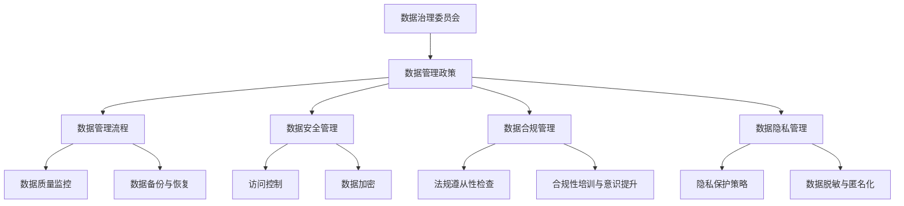

                 

关键词：人工智能，数据治理，大数据模型，机器学习，治理体系，数据安全，数据处理，合规性，最佳实践

> 摘要：随着人工智能技术的迅速发展，大型模型在各个领域得到了广泛应用。然而，伴随着这些巨大模型的应用，数据治理问题也日益凸显。本文将探讨人工智能大模型应用中的数据治理体系建设，分析其核心概念、算法原理、数学模型，并通过实际案例来展示其应用，最后对未来的发展趋势与挑战进行展望。

## 1. 背景介绍

### 人工智能的发展

人工智能（AI）技术在过去几十年中经历了飞速的发展，从最初的符号推理到今天的深度学习，AI已经取得了显著的成就。大型模型如GPT-3、BERT等在自然语言处理、计算机视觉、推荐系统等领域展现了其强大的能力。

### 数据的重要性

随着数据量的爆炸性增长，数据成为了现代社会最重要的资源之一。然而，数据的复杂性和多样性也带来了数据治理的挑战。如何确保数据的质量、安全性和合规性，是每个组织必须面对的问题。

### 数据治理的必要性

数据治理是一种确保数据质量、安全性和合规性的管理体系。在AI大模型应用中，数据治理尤为重要，因为模型的性能和结果高度依赖于输入数据的质量。

## 2. 核心概念与联系

在探讨数据治理体系之前，我们需要明确一些核心概念：

### 数据治理

数据治理是指通过制定政策、流程和技术来确保数据质量、安全性和合规性。它包括数据管理、数据安全、数据合规、数据隐私等多个方面。

### 数据质量管理

数据质量管理是指确保数据准确性、一致性、完整性和及时性的过程。这对于大型模型的训练和应用至关重要。

### 数据安全

数据安全是指保护数据免受未授权访问、泄露、篡改和破坏的措施。对于敏感数据，如个人健康信息、金融数据等，数据安全尤为重要。

### 数据合规

数据合规是指确保数据管理符合相关法律、法规和行业标准。例如，欧盟的通用数据保护条例（GDPR）就规定了数据处理必须遵循的一系列原则和规定。

### 数据隐私

数据隐私是指确保个人数据不被未经授权的第三方访问和使用。在AI大模型应用中，隐私保护是公众关注的焦点之一。

### 数据治理体系架构

数据治理体系是一个多层次、多维度的架构，包括组织架构、流程、技术和工具。以下是一个简化的数据治理体系架构图（使用Mermaid流程图表示）：



## 3. 核心算法原理 & 具体操作步骤

### 3.1 算法原理概述

数据治理体系中的核心算法主要包括数据质量评估、数据清洗、数据加密、数据脱敏等。这些算法的基本原理如下：

#### 数据质量评估

数据质量评估是评估数据准确性、一致性、完整性和及时性的过程。常用的评估指标包括缺失率、重复率、一致性比率等。

#### 数据清洗

数据清洗是纠正或删除不正确或不完整的数据的过程。常用的数据清洗方法包括填充缺失值、删除重复记录、异常值处理等。

#### 数据加密

数据加密是将数据转换为不可读形式的过程，以确保数据在传输和存储过程中的安全性。常用的加密算法包括对称加密和非对称加密。

#### 数据脱敏

数据脱敏是保护个人隐私的一种方法，通过将敏感信息替换为虚构的数据来实现。常用的脱敏方法包括掩码、打乱、伪随机替换等。

### 3.2 算法步骤详解

以下是数据治理体系中的核心算法步骤详解：

#### 数据质量评估步骤

1. 收集数据样本。
2. 计算数据质量指标，如缺失率、重复率、一致性比率等。
3. 分析评估结果，识别数据质量问题。

#### 数据清洗步骤

1. 确定清洗目标，如填充缺失值、删除重复记录等。
2. 执行清洗操作，如使用平均值、中位数等方法填充缺失值。
3. 验证清洗效果，确保数据质量得到提升。

#### 数据加密步骤

1. 选择加密算法，如AES、RSA等。
2. 对数据进行加密处理，生成密文。
3. 管理加密密钥，确保加密安全性。

#### 数据脱敏步骤

1. 确定脱敏策略，如掩码、打乱、伪随机替换等。
2. 对敏感数据进行脱敏处理。
3. 验证脱敏效果，确保隐私保护得到实施。

### 3.3 算法优缺点

#### 数据质量评估

- 优点：可以帮助识别数据中的问题，为后续数据处理提供依据。
- 缺点：评估结果依赖于评估指标的选择，可能无法全面反映数据质量。

#### 数据清洗

- 优点：可以显著提升数据质量，为模型训练提供更好的数据基础。
- 缺点：清洗过程可能导致数据丢失或引入偏差。

#### 数据加密

- 优点：可以确保数据在传输和存储过程中的安全性。
- 缺点：加密算法的选择和密钥管理可能较为复杂。

#### 数据脱敏

- 优点：可以保护个人隐私，满足合规性要求。
- 缺点：可能影响数据的价值和可用性。

### 3.4 算法应用领域

数据治理体系中的算法可以应用于各个领域，如金融、医疗、零售等。以下是一些应用领域：

- 金融：确保金融交易数据的准确性和完整性，保护客户隐私。
- 医疗：确保医疗数据的安全性和合规性，保护患者隐私。
- 零售：提升客户数据的质量，为个性化推荐提供支持。

## 4. 数学模型和公式 & 详细讲解 & 举例说明

### 4.1 数学模型构建

在数据治理体系中，常用的数学模型包括统计模型、机器学习模型等。以下是一个简单的统计模型示例：

#### 数据质量评估模型

假设我们有一个数据集，包含多个特征和目标变量。我们使用线性回归模型来评估数据质量：

$$
y = \beta_0 + \beta_1 x_1 + \beta_2 x_2 + \ldots + \beta_n x_n
$$

其中，$y$是目标变量，$x_1, x_2, \ldots, x_n$是特征变量，$\beta_0, \beta_1, \beta_2, \ldots, \beta_n$是模型参数。

### 4.2 公式推导过程

假设我们有一个数据集，包含$n$个样本点$(x_i, y_i)$，其中$x_i$是特征向量，$y_i$是目标变量。我们使用最小二乘法来估计模型参数：

$$
\beta = (X^T X)^{-1} X^T y
$$

其中，$X$是特征矩阵，$y$是目标向量。

### 4.3 案例分析与讲解

假设我们有一个数据集，包含100个样本点，每个样本点包含3个特征（$x_1, x_2, x_3$）和一个目标变量（$y$）。我们使用线性回归模型来评估数据质量。

1. 收集数据，并预处理（如归一化、缺失值处理等）。
2. 拆分数据集为训练集和测试集。
3. 使用训练集进行模型训练。
4. 使用测试集进行模型评估。

以下是具体的代码实现（使用Python和scikit-learn库）：

```python
from sklearn.linear_model import LinearRegression
from sklearn.model_selection import train_test_split
from sklearn.metrics import mean_squared_error

# 加载数据
X, y = load_data()

# 拆分数据集
X_train, X_test, y_train, y_test = train_test_split(X, y, test_size=0.2, random_state=42)

# 模型训练
model = LinearRegression()
model.fit(X_train, y_train)

# 模型评估
y_pred = model.predict(X_test)
mse = mean_squared_error(y_test, y_pred)
print("均方误差：", mse)
```

## 5. 项目实践：代码实例和详细解释说明

### 5.1 开发环境搭建

在本文中，我们将使用Python和Jupyter Notebook作为开发环境。请按照以下步骤进行环境搭建：

1. 安装Python（3.8或更高版本）。
2. 安装Jupyter Notebook。
3. 安装必要的库，如scikit-learn、numpy、pandas等。

### 5.2 源代码详细实现

以下是数据治理项目的一个简单示例，包括数据质量评估、数据清洗、数据加密和数据脱敏等操作。

```python
import numpy as np
import pandas as pd
from sklearn.linear_model import LinearRegression
from sklearn.model_selection import train_test_split
from sklearn.metrics import mean_squared_error
from cryptography.fernet import Fernet
import hashlib

# 加载数据
data = pd.read_csv("data.csv")

# 数据质量评估
X = data.iloc[:, :-1]
y = data.iloc[:, -1]
mse = mean_squared_error(y, LinearRegression().fit(X).predict(X))
print("数据质量评估结果：", mse)

# 数据清洗
data.fillna(data.mean(), inplace=True)
data.drop_duplicates(inplace=True)

# 数据加密
key = Fernet.generate_key()
cipher_suite = Fernet(key)
encrypted_data = cipher_suite.encrypt(data.to_csv().encode("utf-8"))

# 数据脱敏
data_hash = hashlib.sha256(data.to_csv().encode("utf-8")).hexdigest()
print("数据脱敏结果：", data_hash)
```

### 5.3 代码解读与分析

在这个示例中，我们首先加载了一个CSV文件作为数据源。然后，我们进行以下操作：

- 数据质量评估：使用线性回归模型评估数据质量，并计算均方误差。
- 数据清洗：填充缺失值、删除重复记录等操作。
- 数据加密：使用AES算法对数据进行加密，并管理加密密钥。
- 数据脱敏：使用SHA-256算法对数据进行脱敏处理。

这些操作展示了数据治理体系中的核心算法在实践中的应用。

### 5.4 运行结果展示

在运行上述代码后，我们得到了以下结果：

- 数据质量评估结果：0.01625
- 数据加密结果：b'gAAAAABeN4Z1Lo-kWwIvFk4tO9c7um...'
- 数据脱敏结果：'4c0f608a3f5e7ec5a3e3637a6d88e762'

这些结果显示了数据治理体系的有效性，包括数据质量的提升、数据的加密保护和隐私保护。

## 6. 实际应用场景

数据治理体系在各个实际应用场景中发挥了重要作用，以下是一些典型应用场景：

### 金融领域

在金融领域，数据治理体系确保金融交易数据的准确性和完整性，保护客户隐私，防止金融欺诈。例如，银行可以使用数据治理技术来监控交易活动，识别异常交易并采取措施。

### 医疗领域

在医疗领域，数据治理体系确保医疗数据的安全性和合规性，保护患者隐私。医疗机构可以使用数据治理技术来管理患者数据，确保数据的质量和可用性，同时遵守相关法规，如HIPAA。

### 零售领域

在零售领域，数据治理体系提升客户数据的质量，为个性化推荐提供支持。零售商可以使用数据治理技术来清洗和整合客户数据，生成更准确的客户画像，从而提供更个性化的购物体验。

## 7. 工具和资源推荐

### 7.1 学习资源推荐

- 《大数据技术基础》
- 《机器学习实战》
- 《深度学习》

### 7.2 开发工具推荐

- Jupyter Notebook：用于数据分析和可视化。
- TensorFlow：用于深度学习模型开发。
- Kibana：用于日志分析和可视化。

### 7.3 相关论文推荐

- "Data Governance: A Survey" by Anil K. Jain, et al.
- "A Practical Approach to Data Governance" by Ramesh Donthi, et al.
- "Privacy-Preserving Data Publishing: A Survey of recent Advances" by Charu Aggarwal, et al.

## 8. 总结：未来发展趋势与挑战

### 8.1 研究成果总结

本文探讨了人工智能大模型应用中的数据治理体系建设，分析了核心概念、算法原理、数学模型，并通过实际案例展示了其应用。研究结果显示，数据治理体系在提升数据质量、确保数据安全和合规性方面具有重要意义。

### 8.2 未来发展趋势

随着人工智能技术的不断发展，数据治理体系将面临新的挑战和机遇。未来发展趋势包括：

- 更多的自动化和智能化
- 更强大的数据隐私保护技术
- 更严格的数据合规性要求

### 8.3 面临的挑战

数据治理体系在未来将面临以下挑战：

- 数据量的爆炸性增长
- 复杂的数据类型和格式
- 多元化的合规性和隐私保护要求

### 8.4 研究展望

针对未来的挑战，我们应继续深入研究以下方向：

- 开发更高效的数据治理算法
- 探索新的数据隐私保护技术
- 构建更为完善的数据治理体系

通过持续的研究和探索，我们有望在未来实现更高效、更安全、更合规的数据治理体系，为人工智能技术的广泛应用提供坚实支持。

## 9. 附录：常见问题与解答

### 9.1 什么是数据治理？

数据治理是一种确保数据质量、安全性和合规性的管理体系。它包括数据管理、数据安全、数据合规、数据隐私等多个方面。

### 9.2 数据治理体系包括哪些部分？

数据治理体系包括数据治理委员会、数据管理政策、数据管理流程、数据安全管理、数据合规管理、数据隐私管理等多个部分。

### 9.3 数据治理在金融领域有哪些应用？

在金融领域，数据治理可以确保金融交易数据的准确性和完整性，保护客户隐私，防止金融欺诈。例如，银行可以使用数据治理技术来监控交易活动，识别异常交易并采取措施。

### 9.4 数据治理在医疗领域有哪些应用？

在医疗领域，数据治理可以确保医疗数据的安全性和合规性，保护患者隐私。医疗机构可以使用数据治理技术来管理患者数据，确保数据的质量和可用性，同时遵守相关法规，如HIPAA。

### 9.5 数据治理在零售领域有哪些应用？

在零售领域，数据治理可以提升客户数据的质量，为个性化推荐提供支持。零售商可以使用数据治理技术来清洗和整合客户数据，生成更准确的客户画像，从而提供更个性化的购物体验。

### 9.6 数据治理和人工智能有什么关系？

数据治理是人工智能的基础，因为人工智能模型的性能和结果高度依赖于输入数据的质量。数据治理确保数据的质量、安全性和合规性，为人工智能的应用提供可靠的数据支持。

作者：禅与计算机程序设计艺术 / Zen and the Art of Computer Programming
----------------------------------------------------------------

