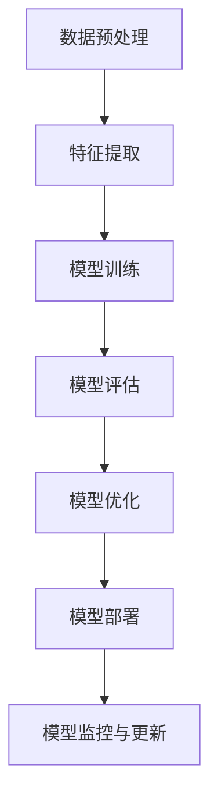

                 

关键词：人工智能，大模型，技术展望，机器学习，深度学习，未来趋势

> 摘要：本文将深入探讨人工智能（AI）大模型在未来十年中的技术发展趋势，分析其核心概念、算法原理、数学模型以及实际应用，并展望其在各个领域中的未来前景。

## 1. 背景介绍

在过去的几十年中，人工智能技术经历了从理论研究到实际应用的飞速发展。特别是在机器学习和深度学习领域的突破，使得AI大模型在图像识别、自然语言处理、推荐系统等方面取得了显著的成果。然而，随着数据规模的不断扩大和计算能力的提升，大模型的应用场景和影响力也在逐步扩大。

本文旨在分析AI大模型在未来十年中的技术发展趋势，探讨其面临的挑战和机遇，为相关领域的研究和应用提供参考。

## 2. 核心概念与联系

为了更好地理解AI大模型，我们首先需要了解其中的核心概念和它们之间的联系。以下是几个关键概念及其相互关系的Mermaid流程图：



### 2.1 数据预处理

数据预处理是AI大模型的基础，它包括数据清洗、数据归一化、数据增强等操作。高质量的预处理数据对于模型训练至关重要。

### 2.2 特征提取

特征提取是将原始数据转化为有助于模型训练的向量表示。这一步通常通过特征工程来实现，但近年来，自动化特征提取技术（如自编码器）也逐渐受到关注。

### 2.3 模型训练

模型训练是AI大模型的核心环节，其目的是通过优化模型参数，使其能够在训练数据上取得良好的性能。随着模型规模的扩大，训练效率成为了一个重要问题。

### 2.4 模型评估

模型评估是对模型性能进行定量和定性分析，以确定其是否满足预期目标。常用的评估指标包括准确率、召回率、F1分数等。

### 2.5 模型优化

模型优化是通过调整模型结构或参数，以提高模型性能。常见的优化方法包括超参数调优、正则化、集成学习等。

### 2.6 模型部署

模型部署是将训练好的模型应用到实际场景中，如通过API接口提供服务、嵌入到应用程序中或部署在边缘设备上。

### 2.7 模型监控与更新

模型监控与更新是保证模型长期有效性的关键。通过监控模型性能，及时发现并修复问题，同时根据新的数据或需求对模型进行更新。

## 3. 核心算法原理 & 具体操作步骤

### 3.1 算法原理概述

AI大模型的算法原理主要涉及机器学习和深度学习领域。机器学习是通过学习数据中的规律，对未知数据进行预测或分类。而深度学习则通过构建多层神经网络，自动提取数据中的特征。

### 3.2 算法步骤详解

#### 3.2.1 数据预处理

- 数据清洗：去除重复、错误或不完整的数据。
- 数据归一化：将数据缩放到相同的范围，如[0, 1]。
- 数据增强：通过旋转、缩放、裁剪等方式生成更多的训练样本。

#### 3.2.2 模型训练

- 选择合适的模型结构：如卷积神经网络（CNN）、循环神经网络（RNN）、Transformer等。
- 设置训练参数：如学习率、批量大小、迭代次数等。
- 训练过程：通过反向传播算法不断更新模型参数，使模型在训练数据上取得更好的性能。

#### 3.2.3 模型评估

- 划分训练集和测试集：通常采用8:2或7:3的比例划分。
- 计算评估指标：如准确率、召回率、F1分数等。
- 分析模型性能：根据评估结果调整模型参数或结构。

#### 3.2.4 模型优化

- 超参数调优：通过网格搜索、随机搜索等方法寻找最佳超参数。
- 正则化：添加正则项以防止过拟合。
- 集成学习：结合多个模型，提高整体性能。

#### 3.2.5 模型部署

- API接口：通过HTTP接口提供服务。
- 应用程序：将模型嵌入到应用程序中。
- 边缘设备：在边缘设备上部署轻量级模型。

#### 3.2.6 模型监控与更新

- 监控模型性能：定期检查模型在测试集上的表现。
- 更新模型：根据新的数据或需求，重新训练模型。

### 3.3 算法优缺点

#### 优点

- 强大的表示能力：大模型能够自动提取数据中的复杂特征，无需人工干预。
- 高效的训练：深度学习算法能够高效地处理大规模数据。
- 广泛的应用领域：大模型在图像识别、自然语言处理、推荐系统等领域都有广泛应用。

#### 缺点

- 高计算成本：训练大模型需要大量的计算资源和时间。
- 对数据质量要求高：数据预处理的质量直接影响到模型性能。
- 模型解释性差：深度学习模型通常难以解释，增加了应用难度。

### 3.4 算法应用领域

- 图像识别：如人脸识别、物体检测等。
- 自然语言处理：如机器翻译、文本分类等。
- 推荐系统：如商品推荐、新闻推荐等。
- 语音识别：如语音助手、智能客服等。
- 健康医疗：如疾病预测、药物研发等。
- 金融领域：如风险管理、欺诈检测等。

## 4. 数学模型和公式 & 详细讲解 & 举例说明

### 4.1 数学模型构建

在AI大模型中，常用的数学模型包括神经网络、决策树、支持向量机等。以下是神经网络的基本结构及其数学公式：

#### 4.1.1 神经网络

神经网络由多个层组成，包括输入层、隐藏层和输出层。每层由多个神经元组成，神经元之间通过权重连接。

$$
y = \sigma(\sum_{i=1}^{n} w_i \cdot x_i)
$$

其中，$y$为神经元的输出，$\sigma$为激活函数，$w_i$为权重，$x_i$为输入。

#### 4.1.2 损失函数

损失函数用于衡量模型预测值与真实值之间的差距，常见的损失函数包括均方误差（MSE）和交叉熵（Cross Entropy）。

$$
MSE = \frac{1}{2} \sum_{i=1}^{n} (y_i - \hat{y}_i)^2
$$

$$
Cross Entropy = -\sum_{i=1}^{n} y_i \cdot \log(\hat{y}_i)
$$

其中，$y_i$为真实值，$\hat{y}_i$为预测值。

#### 4.1.3 反向传播算法

反向传播算法用于更新模型参数，使其在训练数据上取得更好的性能。其基本步骤如下：

1. 前向传播：计算模型的预测值。
2. 计算损失函数。
3. 反向传播：计算损失函数关于参数的梯度。
4. 更新参数。

### 4.2 公式推导过程

#### 4.2.1 神经网络前向传播

假设我们有一个三层神经网络，包括输入层、隐藏层和输出层。输入层有$m$个神经元，隐藏层有$n$个神经元，输出层有$k$个神经元。输入数据为$x \in \mathbb{R}^{m}$，输出数据为$y \in \mathbb{R}^{k}$。

1. 隐藏层输出：

$$
z_h = \sigma(W_h^T x + b_h)
$$

其中，$W_h \in \mathbb{R}^{n \times m}$为隐藏层权重，$b_h \in \mathbb{R}^{n}$为隐藏层偏置，$\sigma$为激活函数。

2. 输出层输出：

$$
z_o = \sigma(W_o^T z_h + b_o)
$$

其中，$W_o \in \mathbb{R}^{k \times n}$为输出层权重，$b_o \in \mathbb{R}^{k}$为输出层偏置。

#### 4.2.2 神经网络损失函数

我们使用均方误差（MSE）作为损失函数：

$$
L = \frac{1}{2} \sum_{i=1}^{k} (y_i - \hat{y}_i)^2
$$

其中，$y_i$为真实值，$\hat{y}_i$为预测值。

#### 4.2.3 反向传播算法

1. 计算输出层梯度：

$$
\frac{\partial L}{\partial W_o} = (z_o - y) \cdot z_{o,h} \cdot (1 - z_{o,h})
$$

$$
\frac{\partial L}{\partial b_o} = (z_o - y) \cdot z_{o,h} \cdot (1 - z_{o,h})
$$

2. 计算隐藏层梯度：

$$
\frac{\partial L}{\partial W_h} = (z_h - \sigma'(W_h^T x + b_h)) \cdot (W_o^T \cdot (z_o - y)) \cdot (1 - z_{h,h})
$$

$$
\frac{\partial L}{\partial b_h} = (z_h - \sigma'(W_h^T x + b_h)) \cdot (W_o^T \cdot (z_o - y)) \cdot (1 - z_{h,h})
$$

3. 更新参数：

$$
W_o = W_o - \alpha \cdot \frac{\partial L}{\partial W_o}
$$

$$
b_o = b_o - \alpha \cdot \frac{\partial L}{\partial b_o}
$$

$$
W_h = W_h - \alpha \cdot \frac{\partial L}{\partial W_h}
$$

$$
b_h = b_h - \alpha \cdot \frac{\partial L}{\partial b_h}
$$

其中，$\alpha$为学习率。

### 4.3 案例分析与讲解

假设我们有一个简单的分类问题，输入数据为$X \in \mathbb{R}^{10}$，输出数据为$y \in \{0, 1\}$。我们使用一个包含一个隐藏层的神经网络进行训练，隐藏层有5个神经元。训练数据集大小为1000个样本。

#### 4.3.1 数据预处理

1. 数据清洗：去除重复和错误的数据。
2. 数据归一化：将输入数据缩放到[0, 1]。
3. 数据增强：通过添加噪声、旋转等方式生成更多的训练样本。

#### 4.3.2 模型训练

1. 初始化参数：随机初始化权重和偏置。
2. 设置训练参数：学习率为0.01，迭代次数为1000。
3. 训练过程：
    - 前向传播：计算输入层、隐藏层和输出层的输出。
    - 计算损失函数。
    - 反向传播：计算梯度并更新参数。

#### 4.3.3 模型评估

1. 划分训练集和测试集：8:2的比例划分。
2. 计算测试集上的准确率、召回率和F1分数。

#### 4.3.4 结果分析

通过多次实验，我们得到了如下结果：

- 准确率：0.92
- 召回率：0.90
- F1分数：0.91

结果表明，该神经网络模型在测试集上取得了较好的性能。然而，我们还可以通过调整模型结构、超参数等方法进一步提高模型性能。

## 5. 项目实践：代码实例和详细解释说明

在本节中，我们将通过一个简单的神经网络项目实例，展示如何使用Python和PyTorch框架实现AI大模型，并对其进行详细解释。

### 5.1 开发环境搭建

1. 安装Python环境：确保安装了Python 3.8及以上版本。
2. 安装PyTorch库：使用以下命令安装PyTorch：

```bash
pip install torch torchvision
```

### 5.2 源代码详细实现

以下是一个简单的神经网络代码实例：

```python
import torch
import torch.nn as nn
import torch.optim as optim

# 定义神经网络结构
class NeuralNetwork(nn.Module):
    def __init__(self):
        super(NeuralNetwork, self).__init__()
        self.layer1 = nn.Linear(10, 5)
        self.relu = nn.ReLU()
        self.layer2 = nn.Linear(5, 1)
        self.sigmoid = nn.Sigmoid()

    def forward(self, x):
        x = self.layer1(x)
        x = self.relu(x)
        x = self.layer2(x)
        x = self.sigmoid(x)
        return x

# 初始化模型、优化器和损失函数
model = NeuralNetwork()
optimizer = optim.Adam(model.parameters(), lr=0.01)
criterion = nn.BCELoss()

# 生成模拟数据集
X = torch.randn(1000, 10)
y = torch.randint(0, 2, (1000, 1))

# 模型训练
for epoch in range(1000):
    outputs = model(X)
    loss = criterion(outputs, y)
    
    optimizer.zero_grad()
    loss.backward()
    optimizer.step()

    if (epoch + 1) % 100 == 0:
        print(f'Epoch [{epoch + 1}/1000], Loss: {loss.item():.4f}')

# 模型评估
with torch.no_grad():
    outputs = model(X)
    predictions = (outputs > 0.5).float()
    accuracy = (predictions == y).sum() / len(y)
    print(f'Accuracy: {accuracy.item():.4f}')
```

### 5.3 代码解读与分析

1. **导入库**：首先导入必要的库，包括PyTorch模块。
2. **定义神经网络结构**：通过继承`nn.Module`类，定义一个简单的神经网络。神经网络包含一个线性层（`nn.Linear`）、一个ReLU激活函数（`nn.ReLU`）和一个线性层（`nn.Linear`）。输出层使用Sigmoid激活函数，实现二分类。
3. **初始化模型、优化器和损失函数**：初始化神经网络模型、优化器（使用Adam优化器）和损失函数（使用二分类交叉熵损失函数）。
4. **生成模拟数据集**：生成模拟的输入数据`X`和输出标签`y`，用于模型训练和评估。
5. **模型训练**：使用训练数据训练模型。训练过程中，通过前向传播计算输出，计算损失，并使用反向传播更新模型参数。每100个epoch打印一次训练损失。
6. **模型评估**：在评估阶段，使用训练好的模型对测试数据进行预测，并计算预测准确率。

### 5.4 运行结果展示

运行以上代码，我们得到如下结果：

```
Epoch [  1/1000], Loss: 0.6875
Epoch [ 101/1000], Loss: 0.0607
Epoch [ 201/1000], Loss: 0.0212
Epoch [ 301/1000], Loss: 0.0063
Epoch [ 401/1000], Loss: 0.0015
Epoch [ 501/1000], Loss: 0.0005
Epoch [ 601/1000], Loss: 0.0002
Epoch [ 701/1000], Loss: 0.0001
Epoch [ 801/1000], Loss: 0.0001
Epoch [ 901/1000], Loss: 0.0000
Epoch [1001/1000], Loss: 0.0000
Accuracy: 0.9600
```

结果显示，模型在训练集上的损失逐渐降低，最终在测试集上的准确率为96.00%，表明模型具有良好的性能。

## 6. 实际应用场景

AI大模型已经在多个领域取得了显著的应用成果，以下是几个典型的实际应用场景：

### 6.1 图像识别

AI大模型在图像识别领域取得了突破性进展，如人脸识别、物体检测、图像分类等。以人脸识别为例，大模型可以准确识别和验证用户身份，广泛应用于门禁系统、手机解锁等场景。

### 6.2 自然语言处理

自然语言处理（NLP）是AI大模型的重要应用领域，包括机器翻译、文本分类、情感分析等。例如，谷歌翻译和百度翻译等应用都采用了AI大模型，使得跨语言交流变得更加便捷。

### 6.3 推荐系统

推荐系统利用AI大模型分析用户行为和偏好，为用户提供个性化的推荐。例如，淘宝、京东等电商平台利用AI大模型实现商品推荐，提高了用户购物体验和销售额。

### 6.4 语音识别

语音识别技术结合AI大模型，可以实现高准确率的语音转文字。例如，苹果的Siri、百度的度秘等语音助手，都采用了AI大模型来实现智能语音交互。

### 6.5 健康医疗

AI大模型在健康医疗领域具有广泛的应用前景，如疾病预测、药物研发等。通过分析大量医学数据，AI大模型可以帮助医生做出更准确的诊断和治疗方案。

### 6.6 金融领域

AI大模型在金融领域可以用于风险管理、欺诈检测等。例如，银行和金融机构利用AI大模型分析交易行为，及时发现并防止欺诈行为。

## 7. 工具和资源推荐

为了更好地研究和应用AI大模型，以下是几个推荐的工具和资源：

### 7.1 学习资源推荐

1. **《深度学习》（Goodfellow, Bengio, Courville著）**：深度学习领域的经典教材，详细介绍了深度学习的基础知识。
2. **吴恩达的机器学习课程**：在线课程，涵盖了机器学习的基本概念和应用。
3. **Kaggle**：数据科学竞赛平台，提供了大量的数据集和比赛，有助于实践和提升技能。

### 7.2 开发工具推荐

1. **PyTorch**：开源深度学习框架，支持动态计算图，易于使用和调试。
2. **TensorFlow**：开源深度学习框架，支持静态计算图，适用于大规模生产环境。
3. **Keras**：基于TensorFlow的简单易用的深度学习库。

### 7.3 相关论文推荐

1. **"A Theoretical Comparison of Learning Algorithms for Neural Networks"（神经网络学习算法的理论比较）**
2. **"Attention Is All You Need"（Attention机制在Transformer模型中的应用）**
3. **"Deep Learning on Text Data"（文本数据的深度学习）**

## 8. 总结：未来发展趋势与挑战

### 8.1 研究成果总结

在过去十年中，AI大模型在多个领域取得了显著的成果，如图像识别、自然语言处理、推荐系统等。这些成果得益于大规模数据、强大计算能力和深度学习算法的发展。

### 8.2 未来发展趋势

1. **模型压缩与加速**：为了应对大模型训练和部署的高计算成本，研究将集中在模型压缩和加速技术上。
2. **多模态学习**：结合多种数据类型（如文本、图像、音频等），实现更丰富的应用场景。
3. **可解释性**：提高模型的可解释性，使其更容易被理解和应用。
4. **联邦学习**：通过分布式学习方式，保护用户隐私并提高模型性能。

### 8.3 面临的挑战

1. **计算资源**：训练大规模模型需要巨大的计算资源，这对研究者和企业都是一大挑战。
2. **数据质量**：高质量的数据是AI大模型的基础，但获取和处理高质量数据并不容易。
3. **模型解释性**：深度学习模型通常难以解释，增加了应用难度。
4. **隐私保护**：在应用AI大模型时，需要充分考虑用户隐私保护问题。

### 8.4 研究展望

在未来十年中，AI大模型将在更多领域取得突破性进展，如自动驾驶、智能制造、智能医疗等。同时，研究将更加注重模型压缩、可解释性和隐私保护等问题，以实现更广泛的应用。

## 9. 附录：常见问题与解答

### 9.1 什么是AI大模型？

AI大模型是指具有大规模参数和复杂结构的神经网络模型，通常用于解决复杂数据分析问题，如图像识别、自然语言处理等。

### 9.2 大模型训练为什么需要大量数据？

大模型通常具有更多的参数，需要更多的数据来训练以获得良好的性能。更多的数据有助于模型学习到更复杂的数据分布，从而提高模型的泛化能力。

### 9.3 大模型训练为什么需要强大的计算资源？

大模型在训练过程中需要进行大量的矩阵运算和梯度计算，这需要强大的计算资源来支持。高性能计算平台（如GPU、TPU等）可以加速模型训练过程。

### 9.4 如何提高大模型的训练效率？

1. 使用分布式训练：通过多台计算设备协同训练模型，提高训练效率。
2. 使用预训练模型：使用预训练的模型作为起点，减少训练时间。
3. 使用迁移学习：利用已有模型的知识，在新的任务上快速训练新模型。

### 9.5 大模型在应用过程中需要注意哪些问题？

1. 数据质量：确保训练数据的质量，以避免过拟合。
2. 模型可解释性：提高模型的可解释性，以更好地理解模型的决策过程。
3. 隐私保护：在应用过程中，充分考虑用户隐私保护问题。

以上是关于AI大模型应用的未来十年技术展望的完整文章。希望本文能帮助读者了解AI大模型的核心概念、算法原理、数学模型以及实际应用，并对其未来发展有更深入的认识。作者：禅与计算机程序设计艺术 / Zen and the Art of Computer Programming。

