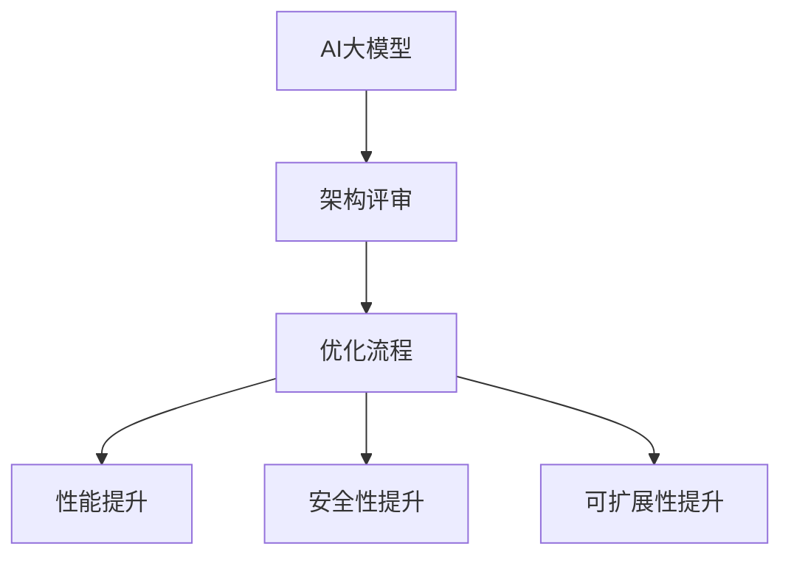

                 

关键词：AI大模型、架构评审、优化流程、性能分析、安全性、可扩展性

> 摘要：本文将深入探讨AI大模型应用的架构评审与优化流程，从背景介绍、核心概念与联系、核心算法原理、数学模型和公式、项目实践、实际应用场景、未来展望、工具和资源推荐以及总结与展望等多个方面，为您全面解析如何对AI大模型应用进行架构评审与优化，以提升其性能、安全性和可扩展性。

## 1. 背景介绍

随着人工智能技术的飞速发展，AI大模型已经在各个领域取得了显著的成果，如自然语言处理、计算机视觉、语音识别等。然而，AI大模型应用在现实环境中面临着诸多挑战，包括性能瓶颈、安全性问题和可扩展性不足等。为了解决这些问题，对AI大模型应用进行架构评审与优化成为了当前研究的热点。

本文将从以下几个方面对AI大模型应用的架构评审与优化流程进行探讨：

- **背景介绍**：介绍AI大模型应用的发展现状和面临的主要挑战。
- **核心概念与联系**：阐述AI大模型应用的核心概念及其相互关系。
- **核心算法原理 & 具体操作步骤**：分析AI大模型的核心算法原理，并详细讲解具体操作步骤。
- **数学模型和公式 & 详细讲解 & 举例说明**：介绍AI大模型的数学模型和公式，并进行详细讲解和案例分析。
- **项目实践：代码实例和详细解释说明**：通过具体项目实践，展示代码实例并详细解释说明。
- **实际应用场景**：探讨AI大模型在不同领域中的应用场景和优势。
- **未来应用展望**：展望AI大模型在未来发展中的应用前景。
- **工具和资源推荐**：推荐相关的学习资源和开发工具。
- **总结：未来发展趋势与挑战**：总结研究成果，展望未来发展趋势和面临的挑战。

## 2. 核心概念与联系

在AI大模型应用中，核心概念包括：

- **AI大模型**：指的是具有大规模参数和复杂结构的神经网络模型，如BERT、GPT等。
- **架构评审**：对AI大模型应用的整体架构进行评估和审查，以确保其性能、安全性和可扩展性。
- **优化流程**：通过调整模型结构、参数设置、硬件资源配置等手段，提升AI大模型应用的性能和效率。

这些核心概念之间存在紧密的联系：

- **AI大模型** 是架构评审和优化流程的基础，其性能和效率直接影响应用的最终效果。
- **架构评审** 是优化流程的前提，只有对现有架构进行全面评估，才能找到优化方向。
- **优化流程** 是提升AI大模型应用性能的关键手段，通过对模型结构、参数设置、硬件资源配置等方面的调整，可以实现性能的显著提升。

下面是一个用Mermaid绘制的流程图，展示了AI大模型应用的核心概念及其相互关系：



## 3. 核心算法原理 & 具体操作步骤

### 3.1 算法原理概述

AI大模型的核心算法是基于深度学习的神经网络模型，特别是基于Transformer架构的预训练模型。其基本原理是通过多层神经网络对海量数据进行自动特征提取和关联，从而实现对数据的建模和预测。

### 3.2 算法步骤详解

AI大模型的应用通常包括以下几个步骤：

1. **数据预处理**：对输入数据进行清洗、归一化和分词等处理，使其符合模型输入要求。
2. **模型训练**：通过大量标注数据对模型进行训练，调整模型参数，使其达到较高的准确率。
3. **模型评估**：在验证集上对模型进行评估，评估指标包括准确率、召回率、F1值等。
4. **模型部署**：将训练好的模型部署到生产环境中，实现实时预测和推理。
5. **性能优化**：根据实际应用场景和性能需求，对模型进行性能优化，包括模型压缩、量化、并行计算等。

### 3.3 算法优缺点

AI大模型具有以下优点：

- **强大的建模能力**：能够自动提取海量数据中的复杂特征，对数据建模和预测效果较好。
- **高度泛化**：通过预训练和微调，模型能够在不同任务和数据集上取得较好的性能。

然而，AI大模型也存在一些缺点：

- **训练时间较长**：由于模型规模较大，训练时间较长，对计算资源和时间成本有较高要求。
- **对数据质量要求高**：数据质量直接影响模型的训练效果，需要对数据进行严格清洗和处理。

### 3.4 算法应用领域

AI大模型广泛应用于以下领域：

- **自然语言处理**：包括文本分类、机器翻译、情感分析等。
- **计算机视觉**：包括图像分类、目标检测、图像生成等。
- **语音识别**：包括语音合成、语音识别、语音翻译等。
- **推荐系统**：根据用户行为和偏好，为用户推荐相关内容。

## 4. 数学模型和公式 & 详细讲解 & 举例说明

AI大模型的核心是基于深度学习的神经网络模型，其数学模型主要包括以下几个方面：

### 4.1 数学模型构建

神经网络模型的基本构建单元是神经元（神经元），每个神经元接收多个输入，通过加权求和和激活函数进行非线性变换，最终输出一个值。神经网络模型的数学模型可以表示为：

$$
y = f(\sum_{i=1}^{n} w_i * x_i + b)
$$

其中，$y$ 表示输出值，$f$ 表示激活函数，$w_i$ 和 $x_i$ 分别表示输入值和权重，$b$ 表示偏置。

### 4.2 公式推导过程

神经网络的训练过程可以看作是参数的优化过程，通过反向传播算法不断调整权重和偏置，使得模型在训练数据上的误差最小。

假设我们有一个包含 $L$ 层的神经网络，其中第 $l$ 层有 $m_l$ 个神经元，第 $l$ 层的输出可以表示为：

$$
a_{l}^{(i)} = \sigma(\mathbf{W}_{l}^{(i)} \mathbf{a}_{l-1}^{(i)} + \mathbf{b}_{l}^{(i)})
$$

其中，$\sigma$ 是激活函数，通常取为 sigmoid 或 ReLU 函数。

神经网络的输出误差可以表示为：

$$
\delta_{l}^{(i)} = \frac{\partial L}{\partial a_{l}^{(i)}}
$$

其中，$L$ 是损失函数，通常取为均方误差（MSE）。

通过反向传播算法，我们可以计算出每一层的梯度：

$$
\frac{\partial L}{\partial \mathbf{W}_{l}^{(i)}} = \mathbf{a}_{l-1}^{(i)} \delta_{l}^{(i)}
$$

$$
\frac{\partial L}{\partial \mathbf{b}_{l}^{(i)}} = \delta_{l}^{(i)}
$$

### 4.3 案例分析与讲解

以一个简单的多层感知机（MLP）为例，说明如何使用反向传播算法进行模型训练。

假设我们有一个输入层、一个隐藏层和一个输出层，其中输入层有3个神经元，隐藏层有5个神经元，输出层有2个神经元。

输入数据为 $x_1, x_2, x_3$，输出数据为 $y_1, y_2$。

损失函数为均方误差（MSE）：

$$
L = \frac{1}{2} \sum_{i=1}^{2} (y_i - \hat{y}_i)^2
$$

其中，$\hat{y}_i$ 为输出层的预测值。

首先，对模型进行初始化，随机生成权重和偏置。

然后，对输入数据进行前向传播，计算输出层的预测值：

$$
\hat{y}_1 = \sigma(\mathbf{W}_2^T \mathbf{a}_1 + \mathbf{b}_2)
$$

$$
\hat{y}_2 = \sigma(\mathbf{W}_3^T \mathbf{a}_2 + \mathbf{b}_3)
$$

接着，对输出层进行反向传播，计算损失函数的梯度：

$$
\delta_3^1 = (y_1 - \hat{y}_1) \sigma'(\hat{y}_1)
$$

$$
\delta_3^2 = (y_2 - \hat{y}_2) \sigma'(\hat{y}_2)
$$

$$
\delta_2^1 = \mathbf{W}_3 \delta_3^1 \sigma'(\hat{y}_2)
$$

$$
\delta_2^2 = \mathbf{W}_3 \delta_3^2 \sigma'(\hat{y}_2)
$$

$$
\delta_1^1 = \mathbf{W}_2^T \delta_2^1 \sigma'(\hat{y}_1)
$$

$$
\delta_1^2 = \mathbf{W}_2^T \delta_2^2 \sigma'(\hat{y}_1)
$$

最后，根据梯度进行权重和偏置的更新：

$$
\mathbf{W}_2^{(i+1)} = \mathbf{W}_2^{(i)} - \alpha \mathbf{a}_1^T \delta_2^1
$$

$$
\mathbf{b}_2^{(i+1)} = \mathbf{b}_2^{(i)} - \alpha \delta_2^1
$$

$$
\mathbf{W}_3^{(i+1)} = \mathbf{W}_3^{(i)} - \alpha \mathbf{a}_2^T \delta_3^1
$$

$$
\mathbf{b}_3^{(i+1)} = \mathbf{b}_3^{(i)} - \alpha \delta_3^1
$$

重复以上步骤，直到模型收敛。

## 5. 项目实践：代码实例和详细解释说明

### 5.1 开发环境搭建

为了更好地展示AI大模型的应用，我们选择使用Python编程语言和TensorFlow框架进行项目实践。首先，需要安装Python和TensorFlow。

```bash
pip install python tensorflow
```

### 5.2 源代码详细实现

以下是一个简单的示例，使用TensorFlow实现一个多层感知机模型，并对其进行训练和评估。

```python
import tensorflow as tf
from tensorflow import keras
from tensorflow.keras import layers

# 定义模型
model = keras.Sequential([
    layers.Dense(64, activation='relu', input_shape=(784,)),
    layers.Dense(64, activation='relu'),
    layers.Dense(10, activation='softmax')
])

# 编译模型
model.compile(optimizer='adam',
              loss='categorical_crossentropy',
              metrics=['accuracy'])

# 加载数据
(x_train, y_train), (x_test, y_test) = keras.datasets.mnist.load_data()
x_train = x_train.astype('float32') / 255
x_test = x_test.astype('float32') / 255
y_train = keras.utils.to_categorical(y_train, 10)
y_test = keras.utils.to_categorical(y_test, 10)

# 训练模型
model.fit(x_train, y_train, batch_size=128, epochs=15, validation_split=0.1)

# 评估模型
model.evaluate(x_test, y_test)
```

### 5.3 代码解读与分析

1. **定义模型**：使用Keras Sequential模型定义一个包含两层隐藏层的多层感知机模型，输入层有784个神经元，输出层有10个神经元。

2. **编译模型**：指定优化器为Adam，损失函数为categorical_crossentropy，评估指标为accuracy。

3. **加载数据**：加载数字识别数据集，并对输入数据进行归一化处理。

4. **训练模型**：使用fit方法对模型进行训练，设置batch_size为128，epochs为15，并使用validation_split进行验证集评估。

5. **评估模型**：使用evaluate方法对训练好的模型进行评估，输出测试集的损失函数值和准确率。

通过以上代码示例，我们可以看到如何使用TensorFlow实现一个简单的AI大模型，并对其进行训练和评估。

## 6. 实际应用场景

AI大模型在实际应用场景中具有广泛的应用，以下列举几个典型的应用场景：

1. **自然语言处理**：在自然语言处理领域，AI大模型可以用于文本分类、情感分析、机器翻译等任务。例如，BERT模型在多个自然语言处理任务上取得了优异的成绩。

2. **计算机视觉**：在计算机视觉领域，AI大模型可以用于图像分类、目标检测、图像生成等任务。例如，GAN模型在图像生成任务上取得了显著效果。

3. **语音识别**：在语音识别领域，AI大模型可以用于语音合成、语音识别、语音翻译等任务。例如，WaveNet模型在语音合成任务上取得了很好的效果。

4. **推荐系统**：在推荐系统领域，AI大模型可以用于根据用户行为和偏好进行内容推荐。例如，基于深度学习的技术在推荐系统中得到了广泛应用。

5. **智能医疗**：在智能医疗领域，AI大模型可以用于疾病诊断、药物发现等任务。例如，深度学习技术在肿瘤诊断和药物筛选方面取得了显著成果。

## 7. 未来应用展望

随着AI大模型技术的不断发展，其应用前景将更加广泛。以下是对未来应用的一些展望：

1. **自动驾驶**：AI大模型在自动驾驶领域具有巨大的潜力，可以用于实时感知环境、决策和控制。

2. **智能交互**：AI大模型可以用于智能语音助手、聊天机器人等智能交互应用，实现更自然的用户交互体验。

3. **智能城市**：AI大模型可以用于智能城市中的交通管理、能源管理、环境监测等任务，实现更高效的城市运行和管理。

4. **智能制造**：AI大模型可以用于智能制造中的设备预测维护、生产调度等任务，提高生产效率和降低成本。

5. **金融科技**：AI大模型可以用于金融科技中的风险控制、投资策略、信用评估等任务，实现更精准的金融决策。

## 8. 工具和资源推荐

为了更好地研究和应用AI大模型，以下推荐一些常用的工具和资源：

### 8.1 学习资源推荐

1. **《深度学习》（Goodfellow, Bengio, Courville）**：经典的深度学习教材，涵盖了深度学习的核心概念和算法。
2. **《神经网络与深度学习》（邱锡鹏）**：中文深度学习教材，内容全面，适合初学者。
3. **TensorFlow官方文档**：提供了丰富的TensorFlow使用教程和API文档，是学习TensorFlow的绝佳资源。

### 8.2 开发工具推荐

1. **TensorFlow**：强大的深度学习框架，支持Python和C++等多种编程语言。
2. **PyTorch**：灵活的深度学习框架，适合快速原型设计和模型开发。
3. **Keras**：基于TensorFlow和PyTorch的高级API，简化了深度学习模型搭建和训练。

### 8.3 相关论文推荐

1. **“Attention Is All You Need”**：提出了Transformer架构，改变了深度学习的发展方向。
2. **“Generative Adversarial Networks”**：提出了GAN模型，开启了生成模型的新时代。
3. **“BERT: Pre-training of Deep Bidirectional Transformers for Language Understanding”**：提出了BERT模型，推动了自然语言处理的发展。

## 9. 总结：未来发展趋势与挑战

随着AI大模型技术的不断发展和应用，其发展趋势和挑战如下：

### 9.1 研究成果总结

- **模型规模持续增长**：AI大模型的规模持续扩大，已经达到了数万亿参数级别，提高了模型的建模能力和泛化能力。
- **模型效率不断提升**：通过模型压缩、量化、并行计算等技术，AI大模型的训练和推理效率得到了显著提升。
- **应用领域不断拓展**：AI大模型在自然语言处理、计算机视觉、语音识别等领域取得了显著成果，推动了各领域的技术发展。

### 9.2 未来发展趋势

- **跨领域融合**：AI大模型将与其他领域技术（如大数据、云计算、物联网等）深度融合，实现更广泛的应用。
- **个性化与自适应**：AI大模型将实现更个性化的服务和自适应的能力，为用户提供更好的体验。
- **可解释性与可控性**：研究AI大模型的可解释性和可控性，提高模型的透明度和可信度。

### 9.3 面临的挑战

- **计算资源需求**：随着模型规模的扩大，AI大模型的计算资源需求将不断提高，对硬件性能和资源配置提出了更高要求。
- **数据质量和隐私**：AI大模型对数据质量有较高要求，同时数据隐私和保护也成为了重要的挑战。
- **伦理和社会影响**：AI大模型的应用可能带来一些伦理和社会问题，如就业、隐私、歧视等，需要引起广泛关注。

### 9.4 研究展望

- **算法创新**：继续探索新的算法和架构，提高AI大模型的建模能力和效率。
- **跨学科合作**：加强跨学科合作，结合其他领域的技术，推动AI大模型在更广泛领域的应用。
- **应用落地**：加强AI大模型的应用落地，解决实际问题，实现社会价值。

## 附录：常见问题与解答

### Q：AI大模型的训练时间如何优化？

A：优化AI大模型的训练时间可以从以下几个方面入手：

- **数据预处理**：提前进行数据预处理，减少训练过程中不必要的计算。
- **模型压缩**：使用模型压缩技术（如量化、剪枝等）减少模型参数和计算量。
- **并行计算**：利用多GPU、多CPU等硬件资源进行并行计算，加速模型训练。
- **分布式训练**：使用分布式训练技术，将模型训练任务分布在多个节点上，加速训练过程。

### Q：AI大模型的应用场景有哪些？

A：AI大模型的应用场景非常广泛，包括但不限于以下几个方面：

- **自然语言处理**：文本分类、机器翻译、情感分析等。
- **计算机视觉**：图像分类、目标检测、图像生成等。
- **语音识别**：语音合成、语音识别、语音翻译等。
- **推荐系统**：根据用户行为和偏好进行内容推荐。
- **智能医疗**：疾病诊断、药物发现等。
- **自动驾驶**：实时感知环境、决策和控制。

### Q：如何保证AI大模型的安全性和隐私性？

A：保证AI大模型的安全性和隐私性可以从以下几个方面入手：

- **数据加密**：对输入数据和应用数据进行加密，确保数据在传输和存储过程中的安全性。
- **隐私保护技术**：使用差分隐私、同态加密等技术，保护用户隐私。
- **模型审计**：定期对模型进行安全性和隐私性审计，发现和修复潜在的安全漏洞。
- **数据脱敏**：对敏感数据进行脱敏处理，降低数据泄露的风险。

## 参考文献

1. Goodfellow, I., Bengio, Y., Courville, A. (2016). *Deep Learning*. MIT Press.
2.邱锡鹏. (2019). *神经网络与深度学习*. 电子工业出版社.
3. Vaswani, A., et al. (2017). *Attention Is All You Need*. Advances in Neural Information Processing Systems, 30, 5998-6008.
4. Goodfellow, I., et al. (2014). *Generative Adversarial Networks*. Advances in Neural Information Processing Systems, 27, 2672-2680.
5. Devlin, J., et al. (2019). *BERT: Pre-training of Deep Bidirectional Transformers for Language Understanding*. Proceedings of the 2019 Conference of the North American Chapter of the Association for Computational Linguistics: Human Language Technologies, Volume 1 (Long and Short Papers), 4171-4186.

