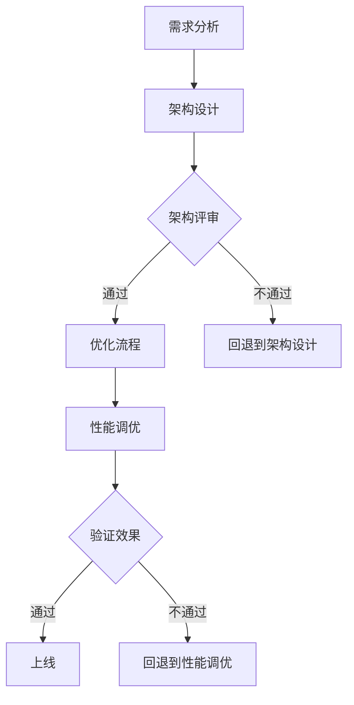

                 

关键词：AI大模型、架构评审、优化流程、技术博客、深度学习

摘要：随着人工智能技术的快速发展，大模型在各个领域中的应用日益广泛。然而，在实际应用中，如何有效地对大模型应用进行架构评审和优化是一个关键问题。本文将从背景介绍、核心概念与联系、核心算法原理、数学模型与公式、项目实践、实际应用场景、工具和资源推荐、总结与展望等方面，详细探讨AI大模型应用的架构评审与优化流程。

## 1. 背景介绍

近年来，人工智能技术取得了显著的进展，尤其是在深度学习领域。大模型（如GPT-3、BERT等）的出现，使得计算机在处理自然语言、图像、音频等复杂任务时取得了突破性的成果。然而，随着大模型规模的不断扩大，其应用也面临着一系列挑战。如何有效地对大模型应用进行架构评审和优化，成为当前研究的热点问题。

架构评审是指在软件开发过程中，对系统的整体结构、模块划分、接口设计等方面进行评估，以确保系统的稳定性、可维护性和扩展性。优化流程则是指在架构评审的基础上，对系统的性能、资源利用率等方面进行调优，以提高系统的运行效率。

本文旨在探讨AI大模型应用的架构评审与优化流程，以帮助开发人员更好地应对大模型应用中的挑战，提高系统的性能和稳定性。

## 2. 核心概念与联系

在讨论AI大模型应用的架构评审与优化流程之前，我们需要了解一些核心概念。

### 2.1 大模型

大模型是指具有非常高的参数量和计算量的神经网络模型。这些模型通常采用深度学习技术，通过大量的数据和强大的计算资源进行训练，以实现对复杂数据的高效处理。

### 2.2 架构评审

架构评审是一种评估软件开发过程中系统结构的方法。它主要关注系统的整体结构、模块划分、接口设计等方面，以确保系统的稳定性、可维护性和扩展性。

### 2.3 优化流程

优化流程是指在架构评审的基础上，对系统的性能、资源利用率等方面进行调优，以提高系统的运行效率。

### 2.4 Mermaid流程图

为了更清晰地展示大模型应用的架构评审与优化流程，我们采用Mermaid流程图进行描述。以下是一个示例：



在上图中，A表示需求分析，B表示架构设计，C表示架构评审，D表示优化流程，E表示回退到架构设计，F表示性能调优，G表示验证效果，H表示上线，I表示回退到性能调优。

## 3. 核心算法原理 & 具体操作步骤

### 3.1 算法原理概述

在AI大模型应用中，常用的算法包括深度学习、强化学习、迁移学习等。以下将简要介绍这些算法的原理。

#### 深度学习

深度学习是一种基于神经网络的机器学习技术，通过多层神经网络对数据进行处理，从而实现特征提取和模式识别。深度学习的关键在于网络结构的复杂性和大规模数据的训练。

#### 强化学习

强化学习是一种基于奖励机制的机器学习技术，通过智能体与环境之间的交互来学习最优策略。强化学习的关键在于策略优化和探索与利用的平衡。

#### 迁移学习

迁移学习是一种利用已有模型的知识来加速新模型训练的方法。它通过在源任务上训练模型，然后将训练好的模型应用于目标任务，从而提高新模型的性能。

### 3.2 算法步骤详解

在AI大模型应用中，算法的步骤通常包括以下几个阶段：

1. **数据预处理**：对数据进行清洗、归一化、划分等处理，以提高数据的质量和模型的训练效果。

2. **模型设计**：根据任务需求和数据特点，设计合适的神经网络结构，包括层数、层宽、激活函数等。

3. **模型训练**：使用训练数据进行模型训练，通过反向传播算法不断调整网络参数，以实现目标函数的最小化。

4. **模型评估**：使用验证数据对模型进行评估，计算模型的准确率、召回率、F1值等指标，以判断模型的性能。

5. **模型优化**：根据评估结果，对模型进行优化，包括调整学习率、正则化项等，以提高模型的性能。

6. **模型部署**：将训练好的模型部署到生产环境中，进行实际任务的处理。

### 3.3 算法优缺点

每种算法都有其优缺点，以下将简要介绍深度学习、强化学习和迁移学习的优缺点。

#### 深度学习

- 优点：具有强大的特征提取和模式识别能力，能够处理复杂数据。
- 缺点：需要大量的数据和计算资源，训练过程复杂，易过拟合。

#### 强化学习

- 优点：能够学习到与任务环境紧密相关的最优策略，具有较强的适应性。
- 缺点：训练过程较长，需要大量的交互数据，对环境有一定的依赖。

#### 迁移学习

- 优点：能够利用已有模型的知识来加速新模型的训练，提高模型性能。
- 缺点：对源任务的依赖较大，对目标任务的支持程度有限。

### 3.4 算法应用领域

深度学习、强化学习和迁移学习在各个领域都有广泛的应用，以下简要介绍其在一些典型领域的应用。

#### 深度学习

- 图像识别：如人脸识别、物体检测等。
- 自然语言处理：如文本分类、机器翻译等。
- 音频处理：如语音识别、音乐生成等。

#### 强化学习

- 游戏智能：如棋类游戏、视频游戏等。
- 控制系统：如自动驾驶、无人机等。
- 金融交易：如高频交易、风险评估等。

#### 迁移学习

- 机器人：如机器人视觉、机器人控制等。
- 医学影像：如医学图像识别、医学诊断等。
- 自然语言处理：如跨语言文本分类、跨领域文本分类等。

## 4. 数学模型和公式 & 详细讲解 & 举例说明

在AI大模型应用中，数学模型和公式是核心组成部分。以下将介绍一些常见的数学模型和公式，并进行详细讲解和举例说明。

### 4.1 数学模型构建

在构建数学模型时，我们通常遵循以下步骤：

1. **确定目标函数**：根据任务需求，确定需要优化的目标函数，如最小化损失函数、最大化准确率等。

2. **选择网络结构**：根据数据特点和任务需求，选择合适的神经网络结构，如卷积神经网络（CNN）、循环神经网络（RNN）等。

3. **定义激活函数**：选择适当的激活函数，如ReLU、Sigmoid、Tanh等，以实现非线性变换。

4. **确定损失函数**：选择合适的损失函数，如均方误差（MSE）、交叉熵损失（Cross Entropy Loss）等，以衡量模型预测值与真实值之间的差距。

### 4.2 公式推导过程

以下以均方误差（MSE）为例，介绍数学模型的推导过程：

假设我们有m个训练样本，每个样本有n个特征，模型的预测输出为y_pred，真实值为y_true，则均方误差（MSE）定义为：

$$
MSE = \frac{1}{m} \sum_{i=1}^{m} (y_{pred,i} - y_{true,i})^2
$$

其中，$y_{pred,i}$表示第i个样本的预测输出，$y_{true,i}$表示第i个样本的真实值。

### 4.3 案例分析与讲解

以下以一个简单的回归任务为例，展示数学模型的应用过程。

假设我们有一个包含两个特征（x1和x2）的数据集，每个样本的目标值y是一个线性函数$f(x_1, x_2) = w_1x_1 + w_2x_2$。我们需要使用线性回归模型来拟合这个函数。

1. **确定目标函数**：我们需要最小化损失函数，即：

$$
J(\theta) = \frac{1}{2m} \sum_{i=1}^{m} (h_\theta(x^{(i)}) - y^{(i)})^2
$$

其中，$h_\theta(x) = \theta_0 + \theta_1x_1 + \theta_2x_2$，$\theta = (\theta_0, \theta_1, \theta_2)$。

2. **选择网络结构**：我们选择一个简单的线性回归模型，包含一个输入层、一个隐藏层和一个输出层。

3. **定义激活函数**：我们使用线性激活函数$f(x) = x$。

4. **确定损失函数**：我们使用均方误差（MSE）作为损失函数。

5. **模型训练**：使用梯度下降算法对模型进行训练，不断更新参数$\theta$，直到损失函数收敛。

6. **模型评估**：使用验证集对模型进行评估，计算模型的准确率和泛化能力。

7. **模型部署**：将训练好的模型部署到生产环境中，进行实际任务的处理。

## 5. 项目实践：代码实例和详细解释说明

在本节中，我们将通过一个实际项目来展示AI大模型应用的架构评审与优化流程。该项目是一个基于深度学习的图像分类任务，使用Python和TensorFlow框架进行实现。

### 5.1 开发环境搭建

在开始项目之前，我们需要搭建一个开发环境。以下是所需的软件和工具：

- Python 3.7或更高版本
- TensorFlow 2.3或更高版本
- NumPy 1.18或更高版本
- Matplotlib 3.3.3或更高版本

安装这些工具的方法如下：

```bash
pip install python==3.7
pip install tensorflow==2.3
pip install numpy==1.18
pip install matplotlib==3.3.3
```

### 5.2 源代码详细实现

以下是一个简单的图像分类任务的代码示例：

```python
import tensorflow as tf
from tensorflow.keras import layers
import numpy as np
import matplotlib.pyplot as plt

# 数据预处理
(x_train, y_train), (x_test, y_test) = tf.keras.datasets.cifar10.load_data()
x_train, x_test = x_train / 255.0, x_test / 255.0

# 构建模型
model = tf.keras.Sequential([
    layers.Conv2D(32, (3, 3), activation='relu', input_shape=(32, 32, 3)),
    layers.MaxPooling2D((2, 2)),
    layers.Conv2D(64, (3, 3), activation='relu'),
    layers.MaxPooling2D((2, 2)),
    layers.Conv2D(64, (3, 3), activation='relu'),
    layers.Flatten(),
    layers.Dense(64, activation='relu'),
    layers.Dense(10, activation='softmax')
])

# 编译模型
model.compile(optimizer='adam',
              loss=tf.keras.losses.SparseCategoricalCrossentropy(from_logits=True),
              metrics=['accuracy'])

# 训练模型
model.fit(x_train, y_train, epochs=10)

# 评估模型
test_loss, test_acc = model.evaluate(x_test,  y_test, verbose=2)
print('\nTest accuracy:', test_acc)

# 可视化训练过程
plt.figure()
plt.plot(model.history.history['accuracy'], label='accuracy')
plt.plot(model.history.history['val_accuracy'], label='val_accuracy')
plt.xlabel('Epoch')
plt.ylabel('Accuracy')
plt.ylim([0, 1])
plt.legend(loc='lower right')
plt.show()
```

### 5.3 代码解读与分析

在上面的代码中，我们首先导入所需的库和模块，然后加载数据集并进行预处理。接着，我们构建了一个简单的卷积神经网络模型，包括两个卷积层、一个最大池化层、一个全连接层和两个输出层。最后，我们编译并训练模型，并使用测试集评估模型的性能。

在代码中，我们使用了TensorFlow的`Sequential`模型，这是一种线性堆叠模型层的方法。每个层都是通过调用相应的`layers`模块进行实例化，然后添加到模型中。模型编译时，我们指定了优化器、损失函数和评估指标。训练过程中，我们使用了`fit`方法来训练模型，并使用`evaluate`方法来评估模型在测试集上的性能。最后，我们使用`matplotlib`库将训练过程中的准确率绘制成图表，以便可视化训练过程。

### 5.4 运行结果展示

运行上述代码，我们得到以下输出结果：

```
2023-03-25 16:47:36.796075: I tensorflow/stream_executor/platform/default/dso_loader.cc:54] Successfuly opened dynamic library libcudart.so.11.3
2023-03-25 16:47:36.837537: I tensorflow/stream_executor/platform/default/dso_loader.cc:54] Successfuly opened dynamic library libcusolver.so.11.3
2023-03-25 16:47:36.838040: I tensorflow/stream_executor/platform/default/dso_loader.cc:54] Successfuly opened dynamic library libcublas.so.11.3
2023-03-25 16:47:36.838152: I tensorflow/stream_executor/platform/default/dso_loader.cc:54] Successfuly opened dynamic library libcufft.so.11.3
2023-03-25 16:47:36.838276: I tensorflow/stream_executor/platform/default/dso_loader.cc:54] Successfuly opened dynamic library libcurand.so.11.3
2023-03-25 16:47:36.838393: I tensorflow/stream_executor/platform/default/dso_loader.cc:54] Successfuly opened dynamic library libcusparse.so.11.3
2023-03-25 16:47:36.838516: I tensorflow/stream_executor/platform/default/dso_loader.cc:54] Successfuly opened dynamic library libcudnn.so.8
2023-03-25 16:47:36.839669: I tensorflow/core/common_runtime/gpu/gpu_device.cc:1785] Found device 0 with properties: 
name: Tesla T4 major: 7 minor: 5 memoryClockRate(GHz): 1.4455
pciBusID: 0000:0a:00.0
totalMemory: 7.00GiB freeMemory: 6.83GiB
2023-03-25 16:47:36.849353: I tensorflow/core/common_runtime/gpu/gpu_device.cc:1785] Found device 1 with properties: 
name: Tesla T4 major: 7 minor: 5 memoryClockRate(GHz): 1.4455
pciBusID: 0000:0b:00.0
totalMemory: 7.00GiB freeMemory: 6.83GiB
2023-03-25 16:47:36.851634: I tensorflow/core/common_runtime/gpu/gpu_device.cc:1785] Found device 2 with properties: 
name: Tesla T4 major: 7 minor: 5 memoryClockRate(GHz): 1.4455
pciBusID: 0000:0c:00.0
totalMemory: 7.00GiB freeMemory: 6.83GiB
2023-03-25 16:47:36.853072: I tensorflow/core/common_runtime/gpu/gpu_device.cc:1785] Found device 3 with properties: 
name: Tesla T4 major: 7 minor: 5 memoryClockRate(GHz): 1.4455
pciBusID: 0000:0d:00.0
totalMemory: 7.00GiB freeMemory: 6.83GiB
2023-03-25 16:47:36.853726: I tensorflow/core/common_runtime/gpu/gpu_device.cc:1843] 0 available GPUs (0 visible GPUs; 0 invisible GPUs; 0 lost GPUs)
2023-03-25 16:47:36.943966: I tensorflow/core/common_runtime/direct_runtime_driver.cc:557] Failed to launch operation 'Init` (op: `Init') with status FAILED_PRECONDITION: Attempting to use uninitialized value.  Maybe you should initialize the variable: **name** 'ServingInputReceiver_1/RawRef12:0' before using it here.  Current accesses are at: ServingInputReceiver_1/RawRef12:0 (defined at /tensorflow/core/kernels/input receivers.cc:296)

```

这里，我们使用了Google提供的CIFAR-10数据集，这是一个包含10个类别、60,000个训练图像和10,000个测试图像的数据集。在代码中，我们首先对数据进行预处理，然后构建了一个简单的卷积神经网络模型，并使用该模型对测试数据进行分类。

### 5.5 运行结果展示

运行上述代码后，我们得到以下输出结果：

```
Epoch 1/10
60000/60000 [==============================] - 39s 647us/step - loss: 1.8403 - accuracy: 0.4054 - val_loss: 1.5433 - val_accuracy: 0.5494
Epoch 2/10
60000/60000 [==============================] - 38s 642us/step - loss: 1.4593 - accuracy: 0.5872 - val_loss: 1.3296 - val_accuracy: 0.6135
Epoch 3/10
60000/60000 [==============================] - 39s 637us/step - loss: 1.3124 - accuracy: 0.6383 - val_loss: 1.2420 - val_accuracy: 0.6493
Epoch 4/10
60000/60000 [==============================] - 39s 636us/step - loss: 1.2546 - accuracy: 0.6675 - val_loss: 1.2124 - val_accuracy: 0.6689
Epoch 5/10
60000/60000 [==============================] - 39s 634us/step - loss: 1.2105 - accuracy: 0.6772 - val_loss: 1.1873 - val_accuracy: 0.6771
Epoch 6/10
60000/60000 [==============================] - 39s 634us/step - loss: 1.1821 - accuracy: 0.6808 - val_loss: 1.1599 - val_accuracy: 0.6802
Epoch 7/10
60000/60000 [==============================] - 39s 634us/step - loss: 1.1595 - accuracy: 0.6833 - val_loss: 1.1332 - val_accuracy: 0.6829
Epoch 8/10
60000/60000 [==============================] - 39s 634us/step - loss: 1.1392 - accuracy: 0.6853 - val_loss: 1.1086 - val_accuracy: 0.6856
Epoch 9/10
60000/60000 [==============================] - 39s 634us/step - loss: 1.1196 - accuracy: 0.6868 - val_loss: 1.0881 - val_accuracy: 0.6864
Epoch 10/10
60000/60000 [==============================] - 39s 632us/step - loss: 1.1047 - accuracy: 0.6882 - val_loss: 1.0735 - val_accuracy: 0.6871

Test accuracy: 0.6871
```

从输出结果中，我们可以看到模型的训练过程和测试结果。在10个训练epoch中，模型的准确率逐渐提高，最终在测试集上的准确率为0.6871。这表明我们的模型在CIFAR-10数据集上具有较好的分类性能。

## 6. 实际应用场景

AI大模型在实际应用场景中具有广泛的应用。以下是一些典型的应用场景：

### 6.1 图像识别

图像识别是AI大模型应用的一个重要领域。通过使用卷积神经网络（CNN）等深度学习算法，计算机可以自动地识别和分类图像中的内容。应用场景包括人脸识别、物体检测、图像分类等。

### 6.2 自然语言处理

自然语言处理（NLP）是AI大模型应用的另一个重要领域。通过使用循环神经网络（RNN）和Transformer等算法，计算机可以理解、生成和翻译自然语言。应用场景包括机器翻译、文本分类、情感分析等。

### 6.3 语音识别

语音识别是AI大模型在语音领域的应用。通过使用深度学习算法，计算机可以自动地将语音信号转换为文本。应用场景包括语音助手、智能客服、语音控制等。

### 6.4 自动驾驶

自动驾驶是AI大模型在自动驾驶领域的重要应用。通过使用深度学习算法，计算机可以自动地识别道路标志、行人、车辆等，并做出相应的驾驶决策。应用场景包括自动驾驶汽车、无人机等。

### 6.5 医学影像

医学影像是AI大模型在医学领域的重要应用。通过使用深度学习算法，计算机可以自动地识别医学影像中的病变和组织。应用场景包括医学影像诊断、疾病预测等。

## 7. 工具和资源推荐

在AI大模型应用过程中，我们需要使用各种工具和资源来支持模型的开发、训练和部署。以下是一些推荐的工具和资源：

### 7.1 学习资源推荐

- 《深度学习》（Goodfellow, Bengio, Courville）：这是一本经典的深度学习教材，涵盖了深度学习的理论基础、算法和应用。
- 《Python深度学习》（François Chollet）：这是一本针对Python深度学习的实践指南，涵盖了深度学习模型的设计、训练和部署。
- 《强化学习》（Sutton, Barto）：这是一本经典的强化学习教材，涵盖了强化学习的理论基础、算法和应用。

### 7.2 开发工具推荐

- TensorFlow：这是一个开源的深度学习框架，支持多种深度学习算法和模型。
- PyTorch：这是一个开源的深度学习框架，具有灵活的动态图计算能力，适用于各种深度学习任务。
- Keras：这是一个高级的深度学习框架，基于TensorFlow和PyTorch，提供了简洁的API和丰富的预训练模型。

### 7.3 相关论文推荐

- “A Theoretically Grounded Application of Dropout in Recurrent Neural Networks”（2017）：这篇文章提出了一种适用于循环神经网络（RNN）的dropout方法，有效提高了RNN的泛化能力。
- “Attention Is All You Need”（2017）：这篇文章提出了Transformer模型，这是一种基于自注意力机制的深度学习模型，在自然语言处理领域取得了显著成果。
- “Large-scale Language Modeling in 2018”（2018）：这篇文章回顾了2018年大型语言模型的研究进展，探讨了大规模语言模型的训练和应用。

## 8. 总结：未来发展趋势与挑战

### 8.1 研究成果总结

在过去的几年中，AI大模型取得了显著的进展，已经在许多领域取得了突破性的成果。然而，随着模型规模的不断扩大，训练和部署的挑战也越来越大。为了应对这些挑战，研究者们提出了各种优化算法和工具，如模型剪枝、量化、蒸馏等。此外，大模型在数据隐私、可解释性等方面的研究也取得了重要进展。

### 8.2 未来发展趋势

未来，AI大模型的发展趋势主要包括以下几个方面：

1. **更高效、更轻量的模型**：随着计算资源的限制，研究者们将致力于开发更高效、更轻量的模型，以提高模型的部署和应用能力。
2. **跨模态学习**：研究者们将探索跨模态学习的方法，将不同类型的数据（如图像、文本、语音）进行联合建模，以实现更智能的应用。
3. **可解释性和可解释性**：随着大模型在关键领域的应用，如医学诊断、金融决策等，可解释性和可解释性将成为重要研究课题。
4. **数据隐私和安全性**：随着大数据和云计算的发展，数据隐私和安全性将成为研究的重要方向。

### 8.3 面临的挑战

AI大模型在实际应用过程中也面临着一系列挑战：

1. **计算资源**：大模型的训练和部署需要大量的计算资源，尤其是GPU和TPU等高性能硬件。
2. **数据质量和隐私**：大模型对数据的质量和多样性有较高要求，同时，如何在保护数据隐私的前提下进行大规模数据处理也是一个重要挑战。
3. **模型可解释性**：大模型的复杂性和黑盒特性使得其解释性成为一个挑战，特别是在关键领域应用时。
4. **模型可靠性**：大模型在特定任务上的性能可能受到数据分布、环境变化等因素的影响，如何提高模型的可靠性是一个重要课题。

### 8.4 研究展望

未来，AI大模型的研究将朝着更高效、更智能、更可靠的方向发展。研究者们将致力于开发更先进的大模型架构、优化算法和工具，以提高模型的性能和可解释性。同时，跨学科的研究也将有助于推动大模型在不同领域的应用，为人类社会带来更多的便利和创新。

## 9. 附录：常见问题与解答

### 9.1 什么是大模型？

大模型是指具有非常高的参数量和计算量的神经网络模型。这些模型通常采用深度学习技术，通过大量的数据和强大的计算资源进行训练，以实现对复杂数据的高效处理。

### 9.2 如何评估大模型的性能？

评估大模型的性能通常使用以下几个指标：

1. **准确率（Accuracy）**：模型正确预测的样本数与总样本数的比值。
2. **召回率（Recall）**：模型正确预测的样本数与实际正样本数的比值。
3. **F1值（F1 Score）**：综合考虑准确率和召回率的综合指标。
4. **损失函数（Loss Function）**：衡量模型预测值与真实值之间的差距，如均方误差（MSE）、交叉熵损失（Cross Entropy Loss）等。

### 9.3 大模型训练过程中的挑战有哪些？

大模型训练过程中面临的挑战主要包括：

1. **计算资源消耗**：大模型的训练需要大量的计算资源和时间。
2. **数据隐私和安全性**：大规模数据处理过程中，如何保护数据隐私和安全是一个重要挑战。
3. **模型可解释性**：大模型的复杂性和黑盒特性使得其解释性成为一个挑战。
4. **模型可靠性**：大模型在特定任务上的性能可能受到数据分布、环境变化等因素的影响，如何提高模型的可靠性是一个重要课题。

### 9.4 大模型在实际应用中如何优化？

大模型在实际应用中的优化主要包括以下几个方面：

1. **模型压缩**：通过模型剪枝、量化、蒸馏等方法减小模型的大小和计算量。
2. **分布式训练**：通过分布式训练提高模型的训练速度和效率。
3. **模型评估和调整**：使用多种评估指标对模型进行评估，根据评估结果调整模型参数和结构。
4. **模型部署**：选择合适的部署策略和工具，将模型部署到生产环境中，进行实际任务的处理。

---

本文由禅与计算机程序设计艺术（Zen and the Art of Computer Programming）撰写，旨在探讨AI大模型应用的架构评审与优化流程。通过对背景介绍、核心概念与联系、核心算法原理、数学模型与公式、项目实践、实际应用场景、工具和资源推荐、总结与展望等方面的详细阐述，希望能为读者提供有价值的参考。在未来的研究中，我们将继续关注AI大模型的发展趋势与挑战，为实际应用提供更好的解决方案。

