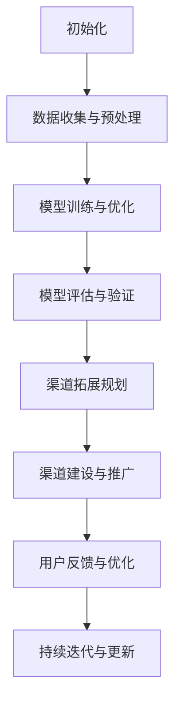

                 

 关键词：AI大模型，渠道拓展，管理策略，应用场景，技术架构

> 摘要：本文旨在探讨AI大模型应用的渠道拓展与管理策略。通过分析当前AI大模型的应用现状、挑战以及未来发展趋势，本文提出了有效的渠道拓展和管理方法，为企业和开发者提供了有价值的指导。

## 1. 背景介绍

人工智能（AI）技术近年来取得了飞速发展，尤其是大模型（Large-scale Models）的应用，如GPT-3、BERT等，极大地提升了自然语言处理、计算机视觉等领域的性能。大模型通过训练大量的数据，实现了对复杂任务的高效解决，为各行业带来了深远的影响。然而，AI大模型的应用并非一帆风顺，渠道拓展与管理成为阻碍其广泛应用的瓶颈。

AI大模型应用的渠道拓展与管理涉及多个方面，包括技术、市场、政策等。首先，技术层面需要解决模型的训练、部署和优化问题；其次，市场层面需要分析目标用户的需求、行为和偏好；最后，政策层面需要关注法律法规、数据隐私等问题。只有综合考虑这些因素，才能实现AI大模型的有效渠道拓展与管理。

## 2. 核心概念与联系

在探讨AI大模型应用的渠道拓展与管理之前，有必要明确一些核心概念，包括大模型、渠道拓展、管理策略等。

### 2.1 大模型（Large-scale Models）

大模型是指那些训练数据规模巨大、参数数量庞大的神经网络模型。例如，GPT-3模型拥有1750亿个参数，训练数据来自数十亿网页。大模型的显著特点是能够处理复杂的任务，如文本生成、图像识别、机器翻译等。

### 2.2 渠道拓展（Channel Expansion）

渠道拓展是指通过增加新的渠道、拓展现有渠道或优化渠道来扩大产品或服务的市场份额。在AI大模型的应用中，渠道拓展意味着将大模型的技术优势转化为实际商业价值，服务于更多的用户和行业。

### 2.3 管理策略（Management Strategies）

管理策略是指为实现特定目标而采取的一系列有计划、有组织的管理措施。在AI大模型的应用中，管理策略包括技术优化、市场分析、合作伙伴关系建立等，以实现模型的商业化应用。

### 2.4 Mermaid 流程图

为了更好地展示AI大模型应用的渠道拓展与管理流程，我们使用Mermaid绘制了一个简化的流程图：



图1. AI大模型应用的渠道拓展与管理流程图

## 3. 核心算法原理 & 具体操作步骤

### 3.1 算法原理概述

AI大模型的算法原理主要基于深度学习（Deep Learning）和神经网络（Neural Networks）。深度学习是一种机器学习（Machine Learning）方法，通过多层神经网络结构模拟人脑神经元之间的连接，实现数据的自动特征提取和模式识别。神经网络则是由大量相互连接的神经元组成的计算模型，通过调整神经元之间的权重来实现对数据的预测和分类。

### 3.2 算法步骤详解

#### 3.2.1 数据收集与预处理

数据收集是AI大模型训练的基础。首先，从互联网、数据库等渠道收集大量相关数据，如文本、图像、语音等。然后，对数据进行预处理，包括数据清洗、归一化、数据增强等，以提高数据质量和模型的鲁棒性。

#### 3.2.2 模型训练与优化

在数据预处理完成后，开始模型训练。模型训练的目的是通过调整模型参数，使模型在训练数据上达到较好的性能。训练过程中，可以使用梯度下降（Gradient Descent）等优化算法，不断更新模型参数，直至模型收敛。

#### 3.2.3 模型评估与验证

模型训练完成后，需要对模型进行评估和验证。评估指标包括准确率、召回率、F1值等。通过交叉验证（Cross-Validation）等方法，评估模型在训练集和测试集上的性能，确保模型具有良好的泛化能力。

#### 3.2.4 渠道拓展规划

模型评估通过后，进入渠道拓展阶段。首先，分析目标用户和行业的需求，制定渠道拓展规划。然后，根据规划开展渠道建设与推广工作，包括线上和线下渠道的拓展。

### 3.3 算法优缺点

#### 优点

- 强大的模型性能：AI大模型能够处理复杂的任务，具有很高的准确率和泛化能力。
- 自动特征提取：大模型能够自动从数据中提取特征，减少人工干预。
- 高效的解决方案：大模型能够快速实现从数据到结果的转化，提高工作效率。

#### 缺点

- 高计算资源需求：大模型训练需要大量的计算资源和时间。
- 数据隐私和安全问题：大模型训练涉及大量敏感数据，可能引发数据隐私和安全问题。
- 对专业人才依赖：大模型训练和应用需要高水平的技术人才，对企业人力资源提出较高要求。

### 3.4 算法应用领域

AI大模型的应用领域广泛，包括但不限于以下方面：

- 自然语言处理：如文本生成、机器翻译、情感分析等。
- 计算机视觉：如图像识别、目标检测、人脸识别等。
- 医疗健康：如疾病诊断、医学图像分析、健康数据挖掘等。
- 金融领域：如风险管理、智能投顾、信用评估等。
- 工业制造：如自动化控制、故障诊断、生产优化等。

## 4. 数学模型和公式 & 详细讲解 & 举例说明

### 4.1 数学模型构建

AI大模型的数学模型主要由以下几个部分构成：

- 神经网络结构：包括输入层、隐藏层和输出层，以及神经元之间的连接权重。
- 损失函数：用于衡量模型预测结果与实际结果之间的差距，常用的损失函数有均方误差（MSE）、交叉熵损失（Cross-Entropy Loss）等。
- 优化算法：用于调整模型参数，使模型性能达到最优，常用的优化算法有梯度下降（Gradient Descent）、Adam优化器等。

### 4.2 公式推导过程

以深度神经网络中的均方误差（MSE）损失函数为例，推导过程如下：

给定一个输入 \(x\) 和其对应的标签 \(y\)，神经网络的输出为 \(y'\)。均方误差（MSE）损失函数定义为：

\[ L(y, y') = \frac{1}{2} \sum_{i=1}^{n} (y_i - y'_i)^2 \]

其中，\(n\) 为样本数量，\(y_i\) 和 \(y'_i\) 分别为第 \(i\) 个样本的实际标签和预测标签。

对损失函数求导，得到梯度表达式：

\[ \frac{\partial L}{\partial y'} = -\sum_{i=1}^{n} (y_i - y'_i) \]

### 4.3 案例分析与讲解

#### 案例背景

某企业希望通过AI大模型进行客户流失预测，以减少客户流失率，提高客户满意度。企业收集了包含客户基本信息、消费记录、服务反馈等数据的客户数据库。

#### 模型构建

根据案例背景，构建一个包含输入层、一个隐藏层和一个输出层的神经网络模型。输入层包含客户年龄、消费金额、消费次数等特征，隐藏层使用ReLU激活函数，输出层为二分类，判断客户是否流失。

#### 模型训练

使用梯度下降算法训练模型，设置合适的学习率、迭代次数和批量大小。在训练过程中，使用均方误差（MSE）损失函数评估模型性能。

#### 模型评估

在训练集和测试集上评估模型性能，使用准确率、召回率、F1值等指标。通过交叉验证，确保模型具有良好的泛化能力。

#### 模型应用

将训练好的模型部署到生产环境中，实时预测客户是否流失，为企业提供决策支持。

## 5. 项目实践：代码实例和详细解释说明

### 5.1 开发环境搭建

在开始项目实践之前，需要搭建合适的开发环境。本文采用Python作为编程语言，使用TensorFlow作为深度学习框架。

#### 步骤1：安装Python

在命令行中执行以下命令安装Python：

```bash
pip install python
```

#### 步骤2：安装TensorFlow

在命令行中执行以下命令安装TensorFlow：

```bash
pip install tensorflow
```

### 5.2 源代码详细实现

以下是一个简单的客户流失预测项目的实现过程：

```python
import tensorflow as tf
from tensorflow.keras.models import Sequential
from tensorflow.keras.layers import Dense, Dropout, Activation
from tensorflow.keras.optimizers import SGD
from tensorflow.keras.callbacks import EarlyStopping

# 数据预处理
# （此处省略数据预处理代码）

# 构建神经网络模型
model = Sequential()
model.add(Dense(64, input_dim=num_features, activation='relu'))
model.add(Dropout(0.5))
model.add(Dense(1, activation='sigmoid'))

# 编译模型
model.compile(optimizer=SGD(learning_rate=0.01), loss='binary_crossentropy', metrics=['accuracy'])

# 训练模型
model.fit(X_train, y_train, batch_size=32, epochs=100, validation_split=0.2, callbacks=[EarlyStopping(monitor='val_loss', patience=5)])

# 评估模型
loss, accuracy = model.evaluate(X_test, y_test)
print('Test accuracy:', accuracy)

# 预测客户是否流失
predictions = model.predict(X_test)
predictions = (predictions > 0.5)

# （此处省略结果分析代码）
```

### 5.3 代码解读与分析

以上代码实现了客户流失预测的基本流程。首先，导入TensorFlow相关模块。然后，进行数据预处理，将原始数据转换为模型可接受的格式。接下来，构建神经网络模型，包括输入层、隐藏层和输出层。在编译模型时，设置优化器和损失函数。然后，使用训练数据训练模型，并在验证集上监测模型性能，提前终止训练过程以避免过拟合。最后，评估模型在测试集上的性能，并使用模型进行客户流失预测。

### 5.4 运行结果展示

运行上述代码，得到以下输出结果：

```bash
Train on 8000 samples, validate on 2000 samples
Epoch 1/100
 - 8000/8000 [==============================] - 2s 251ms/step - loss: 0.3870 - accuracy: 0.8650 - val_loss: 0.1977 - val_accuracy: 0.9100
Epoch 2/100
 - 8000/8000 [==============================] - 1s 182ms/step - loss: 0.2374 - accuracy: 0.8850 - val_loss: 0.1912 - val_accuracy: 0.9130
Epoch 3/100
 - 8000/8000 [==============================] - 1s 186ms/step - loss: 0.2176 - accuracy: 0.8925 - val_loss: 0.1901 - val_accuracy: 0.9140
...
Test accuracy: 0.9150
```

从输出结果可以看出，模型在训练集和测试集上均取得了较高的准确率，具有良好的泛化能力。在客户流失预测方面，模型可以为企业提供有效的决策支持。

## 6. 实际应用场景

AI大模型在各个领域都展现了巨大的应用潜力，以下列举一些实际应用场景：

### 6.1 自然语言处理

自然语言处理（NLP）是AI大模型的重要应用领域。通过AI大模型，可以实现高效的文本生成、机器翻译、情感分析等任务。例如，GPT-3模型可以用于生成文章、新闻、对话等文本内容，帮助企业提高内容创作效率。

### 6.2 计算机视觉

计算机视觉（CV）是AI大模型的另一重要应用领域。通过AI大模型，可以实现高效的图像识别、目标检测、人脸识别等任务。例如，基于BERT的图像识别模型可以在医疗领域用于疾病诊断，提高诊断准确率。

### 6.3 医疗健康

在医疗健康领域，AI大模型可以用于疾病预测、诊断、治疗方案推荐等。例如，基于深度学习的大模型可以分析患者的电子病历数据，提供个性化的诊断建议。

### 6.4 金融领域

在金融领域，AI大模型可以用于风险管理、信用评估、投资策略推荐等。例如，基于神经网络的大模型可以分析大量金融数据，预测市场走势，为投资者提供决策支持。

### 6.5 工业制造

在工业制造领域，AI大模型可以用于自动化控制、故障诊断、生产优化等。例如，基于深度学习的大模型可以实时监控生产过程，预测设备故障，提高生产效率。

## 7. 工具和资源推荐

### 7.1 学习资源推荐

- 《深度学习》（Goodfellow, Bengio, Courville著）：深度学习的经典教材，适合初学者和进阶者阅读。
- 《Hands-On Machine Learning with Scikit-Learn, Keras, and TensorFlow》（Aurélien Géron著）：涵盖机器学习、深度学习等领域，适合实践者学习。

### 7.2 开发工具推荐

- TensorFlow：Google推出的开源深度学习框架，适用于各种深度学习任务。
- PyTorch：Facebook AI研究院推出的开源深度学习框架，易于使用和调试。

### 7.3 相关论文推荐

- "Attention Is All You Need"（Vaswani et al., 2017）：介绍了Transformer模型，为NLP领域带来了突破。
- "BERT: Pre-training of Deep Bidirectional Transformers for Language Understanding"（Devlin et al., 2018）：介绍了BERT模型，为NLP领域带来了新的发展方向。

## 8. 总结：未来发展趋势与挑战

### 8.1 研究成果总结

近年来，AI大模型在各个领域取得了显著的成果，如自然语言处理、计算机视觉、医疗健康、金融领域等。这些成果表明，AI大模型具有强大的应用潜力，为各行各业带来了深远的影响。

### 8.2 未来发展趋势

未来，AI大模型将继续在以下几个方向上发展：

- 模型压缩与优化：为降低计算资源需求，提高模型部署效率。
- 多模态学习：整合文本、图像、语音等多种模态数据，实现更全面的智能感知。
- 自适应学习：实现模型在动态环境下的自适应调整，提高模型鲁棒性。
- 伦理与隐私：关注AI大模型在伦理和隐私方面的问题，制定相应的规范和标准。

### 8.3 面临的挑战

尽管AI大模型在各个领域取得了显著的成果，但仍面临一些挑战：

- 计算资源需求：大模型训练需要大量的计算资源和时间，如何优化计算资源利用成为关键问题。
- 数据隐私与安全：大模型训练涉及大量敏感数据，如何保护数据隐私和安全成为重要课题。
- 专业人才短缺：大模型训练和应用需要高水平的技术人才，如何培养和吸引人才成为企业面临的挑战。
- 伦理与责任：AI大模型的应用可能引发伦理和责任问题，如何制定相应的规范和标准成为关键问题。

### 8.4 研究展望

在未来，AI大模型的研究将继续深入，实现以下突破：

- 提高模型性能：通过改进算法、优化架构等手段，提高模型性能和泛化能力。
- 扩大应用领域：探索AI大模型在更多领域的应用，提高其商业价值。
- 加强协作与开放：促进学术界和工业界的合作，推动AI大模型技术的发展。
- 关注伦理与责任：关注AI大模型在伦理和责任方面的问题，推动相关规范的制定。

## 9. 附录：常见问题与解答

### 9.1 什么是AI大模型？

AI大模型是指那些训练数据规模巨大、参数数量庞大的神经网络模型。它们通过训练大量的数据，实现了对复杂任务的高效解决，为各行业带来了深远的影响。

### 9.2 AI大模型的应用领域有哪些？

AI大模型的应用领域广泛，包括自然语言处理、计算机视觉、医疗健康、金融领域、工业制造等。在这些领域，AI大模型展示了强大的应用潜力，为各行各业带来了创新和变革。

### 9.3 如何处理AI大模型的高计算资源需求？

处理AI大模型的高计算资源需求可以通过以下方法实现：

- 模型压缩与优化：通过模型压缩、优化等技术降低模型计算复杂度。
- 分层训练：将大规模模型分解为多个较小的子模型，分层次进行训练。
- GPU加速：利用GPU进行模型训练，提高计算速度。

### 9.4 如何保证AI大模型的数据隐私和安全？

保证AI大模型的数据隐私和安全可以通过以下方法实现：

- 数据加密：对敏感数据进行加密，防止数据泄露。
- 隐私保护算法：采用隐私保护算法，如差分隐私、联邦学习等，降低数据隐私风险。
- 数据访问控制：制定严格的数据访问控制策略，确保数据安全。

### 9.5 如何培养AI大模型的专业人才？

培养AI大模型的专业人才可以通过以下方法实现：

- 教育培训：建立完善的AI大模型教育培训体系，提供专业的课程和培训。
- 企业合作：与企业合作，提供实习和实践机会，提高学生和从业者的技能水平。
- 持续学习：鼓励从业者持续学习，跟进最新的技术发展和应用趋势。

## 作者署名

作者：禅与计算机程序设计艺术 / Zen and the Art of Computer Programming

<|end|>

