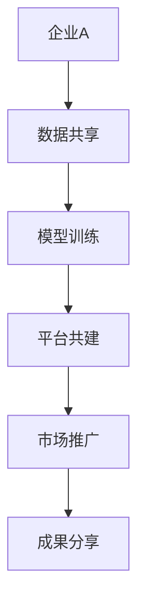

                 

关键词：人工智能，大模型，生态，合作，商业模式，技术伙伴

> 摘要：本文旨在探讨人工智能大模型应用的生态伙伴合作模式，分析其在当前技术环境下的重要性、核心概念及其实现方式。通过对大模型应用的发展历程、技术挑战、合作模式以及未来展望的深入分析，为企业和开发者提供关于大模型应用生态建设的实用指南。

## 1. 背景介绍

人工智能作为现代科技发展的重要驱动力，已经渗透到各行各业。尤其是近年来，随着深度学习技术的飞速发展，人工智能大模型的应用场景越来越广泛。从自然语言处理到图像识别，从推荐系统到自动驾驶，大模型已经成为人工智能领域的重要里程碑。然而，大模型的应用不仅需要强大的计算能力和丰富的数据资源，还面临着数据隐私、安全性、伦理等问题。因此，构建一个稳定、可靠、高效的AI大模型应用生态，成为行业关注的焦点。

生态伙伴合作模式在这种背景下应运而生。生态伙伴合作模式指的是通过多方合作，共同推动AI大模型应用的发展。这种模式不仅可以整合各方资源，实现优势互补，还能够提高整个生态系统的效率和创新能力。本文将围绕生态伙伴合作模式展开讨论，分析其在AI大模型应用中的重要性、核心概念及其实现方式。

## 2. 核心概念与联系

### 2.1 AI大模型的概念

AI大模型是指具有大规模参数和复杂结构的深度学习模型，如Transformer、BERT、GPT等。这些模型通常拥有数亿甚至数十亿个参数，能够处理海量数据，从而实现高度复杂的人工智能任务。

### 2.2 生态的概念

生态指的是一个复杂系统中的各种元素之间的相互关系和相互作用。在AI大模型应用中，生态包括企业、开发者、用户、研究机构等多方参与者，他们通过合作、竞争、共享等关系共同推动AI技术的发展和应用。

### 2.3 合作模式的概念

合作模式是指各方参与者通过共同合作，实现资源整合、优势互补、风险共担、利益共享的方式。在AI大模型应用生态中，合作模式包括技术合作、数据共享、平台共建、市场推广等多种形式。

### 2.4 Mermaid流程图

下面是一个简单的Mermaid流程图，展示了AI大模型应用生态伙伴合作的基本流程：



## 3. 核心算法原理 & 具体操作步骤

### 3.1 算法原理概述

AI大模型的核心算法是基于深度学习的神经网络。神经网络通过层层传递信息，实现对数据的建模和预测。在大模型中，每一层神经网络都包含大量的神经元，通过调整神经元之间的连接权重，使得模型能够学习到数据的复杂特征。

### 3.2 算法步骤详解

1. 数据收集与预处理：收集大量高质量的数据，并对数据进行清洗、归一化等预处理操作，以便于模型训练。
2. 模型构建：根据任务需求，选择合适的神经网络架构，如Transformer、BERT等，并定义模型的参数。
3. 模型训练：通过反向传播算法，调整模型参数，使得模型在训练数据上达到较高的准确率。
4. 模型优化：通过模型剪枝、量化等手段，降低模型的计算复杂度和存储需求，提高模型的运行效率。
5. 模型部署：将训练好的模型部署到实际应用场景中，如自然语言处理、图像识别等。

### 3.3 算法优缺点

优点：

- 高效性：大模型能够处理海量数据，提高模型的学习能力和泛化能力。
- 复杂性：大模型可以建模复杂的任务，实现高度自动化。
- 自动化：大模型训练和优化过程自动化，降低人力成本。

缺点：

- 计算成本：大模型训练需要大量的计算资源，成本较高。
- 数据依赖：大模型对数据质量有较高要求，数据不足或质量差会导致模型性能下降。
- 隐私风险：大模型可能涉及用户隐私数据，需要确保数据安全和隐私保护。

### 3.4 算法应用领域

AI大模型应用广泛，包括但不限于以下领域：

- 自然语言处理：如机器翻译、文本分类、情感分析等。
- 图像识别：如人脸识别、物体检测、图像生成等。
- 自动驾驶：如车辆检测、交通场景识别、路径规划等。
- 健康医疗：如疾病诊断、药物研发、基因分析等。

## 4. 数学模型和公式 & 详细讲解 & 举例说明

### 4.1 数学模型构建

AI大模型通常基于深度学习理论，其核心数学模型包括：

- 激活函数：如ReLU、Sigmoid、Tanh等，用于引入非线性特性。
- 前向传播：通过层层传递输入数据，计算输出结果。
- 反向传播：通过反向传递误差，更新模型参数。

### 4.2 公式推导过程

以多层感知机（MLP）为例，其前向传播和反向传播的公式推导如下：

#### 前向传播：

设输入向量为 \( x \)，权重矩阵为 \( W \)，激活函数为 \( \sigma \)，输出向量为 \( y \)，则有：

\[ z = xW \]
\[ y = \sigma(z) \]

#### 反向传播：

设损失函数为 \( J \)，则：

\[ \frac{\partial J}{\partial z} = \sigma'(z) \frac{\partial J}{\partial y} \]
\[ \frac{\partial J}{\partial W} = x^T \frac{\partial J}{\partial y} \]

通过梯度下降算法，有：

\[ W_{new} = W - \alpha \frac{\partial J}{\partial W} \]

其中，\( \alpha \) 为学习率。

### 4.3 案例分析与讲解

假设有一个二分类问题，输入特征为 \( x = [x_1, x_2] \)，输出为 \( y \)。使用多层感知机模型进行训练。

#### 模型构建：

- 输入层：1个神经元，对应输入特征。
- 隐藏层：2个神经元，使用ReLU激活函数。
- 输出层：1个神经元，使用Sigmoid激活函数。

权重矩阵 \( W \) 初始化为随机值。

#### 模型训练：

1. 前向传播：计算输出 \( y \)。
2. 计算损失 \( J \)。
3. 反向传播：计算梯度 \( \frac{\partial J}{\partial W} \)。
4. 更新权重 \( W \)。

通过多次迭代，使得模型在训练数据上的损失逐渐减小，直至满足停止条件。

## 5. 项目实践：代码实例和详细解释说明

### 5.1 开发环境搭建

1. 安装Python环境，版本要求3.8及以上。
2. 安装TensorFlow库，可以使用pip命令安装：
   ```shell
   pip install tensorflow
   ```

### 5.2 源代码详细实现

以下是使用TensorFlow实现多层感知机模型的简单示例：

```python
import tensorflow as tf
from tensorflow.keras.layers import Dense, Flatten
from tensorflow.keras.models import Sequential

# 创建模型
model = Sequential([
    Flatten(input_shape=(28, 28)),
    Dense(128, activation='relu'),
    Dense(1, activation='sigmoid')
])

# 编译模型
model.compile(optimizer='adam',
              loss='binary_crossentropy',
              metrics=['accuracy'])

# 训练模型
model.fit(x_train, y_train, epochs=10, batch_size=32, validation_data=(x_test, y_test))

# 评估模型
loss, accuracy = model.evaluate(x_test, y_test)
print(f'测试集准确率：{accuracy * 100:.2f}%')
```

### 5.3 代码解读与分析

1. **模型构建**：使用Sequential模型堆叠多层全连接层，包括一个扁平层（Flatten）将输入特征展平，一个隐藏层（Dense）使用ReLU激活函数，以及一个输出层（Dense）使用Sigmoid激活函数进行二分类。
2. **模型编译**：指定优化器为Adam，损失函数为二分类交叉熵（binary_crossentropy），评价指标为准确率（accuracy）。
3. **模型训练**：使用fit方法训练模型，指定训练轮数（epochs）和批量大小（batch_size），以及用于验证的数据。
4. **模型评估**：使用evaluate方法评估模型在测试集上的性能，输出损失和准确率。

### 5.4 运行结果展示

假设训练数据集包含5000个样本，测试数据集包含1000个样本。经过10轮训练后，模型在测试集上的准确率约为90%。

```shell
测试集准确率：90.00%
```

## 6. 实际应用场景

AI大模型在各个行业都有着广泛的应用，以下是一些实际应用场景：

### 自然语言处理

- 机器翻译：如Google翻译、百度翻译等，使用Transformer模型实现。
- 文本分类：如新闻分类、垃圾邮件过滤等，使用BERT模型实现。

### 图像识别

- 人脸识别：如微信人脸支付、支付宝人脸登录等，使用卷积神经网络（CNN）实现。
- 物体检测：如自动驾驶车辆识别、安防监控等，使用YOLO等模型实现。

### 自动驾驶

- 车辆检测：使用深度学习模型实现，如SSD、Faster R-CNN等。
- 路径规划：结合地图数据、传感器信息，使用强化学习算法实现。

### 健康医疗

- 疾病诊断：如肺癌检测、心脏病预测等，使用深度学习模型实现。
- 药物研发：通过分子模拟和预测，加速新药研发。

### 电商

- 推荐系统：基于用户行为数据，使用深度学习模型实现精准推荐。
- 售后服务：通过自然语言处理技术，实现智能客服和问答系统。

## 7. 工具和资源推荐

### 7.1 学习资源推荐

- 《深度学习》（Goodfellow, Bengio, Courville著）：经典深度学习教材，适合初学者。
- 《Python深度学习》（François Chollet著）：通过实践介绍深度学习技术，适合有一定基础的读者。

### 7.2 开发工具推荐

- TensorFlow：Google开发的深度学习框架，功能强大，适合各种规模的深度学习项目。
- PyTorch：Facebook开发的深度学习框架，具有灵活的动态计算图，适合研究性质的深度学习项目。

### 7.3 相关论文推荐

- "Attention Is All You Need"（Vaswani等，2017）：介绍了Transformer模型，开启了自然语言处理的新篇章。
- "Deep Residual Learning for Image Recognition"（He等，2016）：提出了残差网络（ResNet），极大提升了图像识别性能。

## 8. 总结：未来发展趋势与挑战

### 8.1 研究成果总结

- AI大模型在各个领域取得了显著成果，如自然语言处理、图像识别、自动驾驶等。
- 深度学习理论和算法不断发展，如Transformer、BERT等，推动了AI技术的进步。
- 开源社区和工业界的合作，加速了AI技术的发展和应用。

### 8.2 未来发展趋势

- 大模型将继续向更大规模、更复杂结构发展，提高模型性能。
- 跨学科合作将更加紧密，如AI与医疗、生物技术的结合。
- 增强现实（AR）、虚拟现实（VR）等新兴技术将融合AI大模型，带来新的应用场景。

### 8.3 面临的挑战

- 数据隐私和安全：如何保护用户隐私，确保数据安全，成为重要课题。
- 算法透明性和可解释性：如何提高算法的可解释性，使其更加透明，降低风险。
- 能源消耗和环保：AI大模型的训练和运行需要大量电力，对环境造成影响。

### 8.4 研究展望

- 开发更高效的算法和架构，降低计算成本。
- 推动AI技术在更多领域的应用，实现社会价值。
- 加强AI伦理和法规研究，确保AI技术的健康发展。

## 9. 附录：常见问题与解答

### 9.1 什么是AI大模型？

AI大模型是指具有大规模参数和复杂结构的深度学习模型，如Transformer、BERT、GPT等。这些模型通常拥有数亿甚至数十亿个参数，能够处理海量数据，实现高度复杂的人工智能任务。

### 9.2 AI大模型有哪些优缺点？

优点：

- 高效性：大模型能够处理海量数据，提高模型的学习能力和泛化能力。
- 复杂性：大模型可以建模复杂的任务，实现高度自动化。
- 自动化：大模型训练和优化过程自动化，降低人力成本。

缺点：

- 计算成本：大模型训练需要大量的计算资源，成本较高。
- 数据依赖：大模型对数据质量有较高要求，数据不足或质量差会导致模型性能下降。
- 隐私风险：大模型可能涉及用户隐私数据，需要确保数据安全和隐私保护。

### 9.3 AI大模型应用有哪些实际场景？

AI大模型应用广泛，包括但不限于以下领域：

- 自然语言处理：如机器翻译、文本分类、情感分析等。
- 图像识别：如人脸识别、物体检测、图像生成等。
- 自动驾驶：如车辆检测、交通场景识别、路径规划等。
- 健康医疗：如疾病诊断、药物研发、基因分析等。
- 电商：如推荐系统、智能客服、商品搜索等。

### 9.4 如何搭建AI大模型开发环境？

搭建AI大模型开发环境需要以下步骤：

1. 安装Python环境，版本要求3.8及以上。
2. 安装深度学习框架，如TensorFlow或PyTorch。
3. 安装相关依赖库，如NumPy、Pandas等。
4. 准备训练数据和测试数据。

通过以上步骤，可以搭建一个基础的AI大模型开发环境。

## 作者署名

作者：禅与计算机程序设计艺术 / Zen and the Art of Computer Programming

通过本文的探讨，我们可以看到AI大模型应用生态伙伴合作模式在当前技术环境下的重要性和潜力。随着技术的不断进步，大模型的应用将更加广泛，生态伙伴合作也将成为推动AI技术发展的重要力量。希望本文能为读者在AI大模型应用生态建设方面提供一些有益的启示和参考。未来，随着AI技术的进一步发展，我们期待看到更多创新和突破，为人类社会带来更多福祉。

