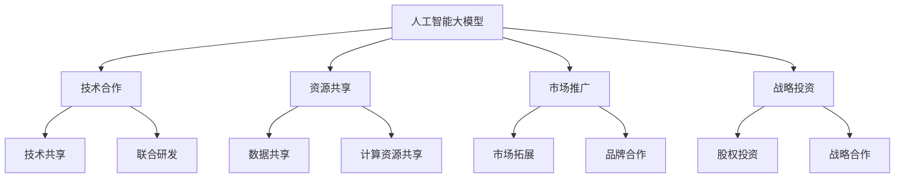

                 

关键词：AI大模型，生态合作，伙伴关系，应用模式，技术创新

摘要：本文旨在探讨人工智能大模型在应用领域中的生态伙伴合作模式。通过深入分析大模型的原理、算法、数学模型及其在实际应用中的表现，文章将阐述大模型在技术生态中的合作方式，以及未来发展趋势和面临的挑战。作者从自身丰富的技术经验出发，结合实际项目案例，为读者提供了详实的指导和建议。

## 1. 背景介绍

近年来，人工智能（AI）技术取得了飞速发展，特别是深度学习（Deep Learning）的崛起，使得人工智能大模型（Large-scale AI Models）成为研究的热点。这些大模型通过海量数据的学习，能够实现前所未有的性能提升，并在图像识别、自然语言处理、语音识别等众多领域展现出了强大的应用潜力。然而，随着模型规模的不断扩大，如何在技术生态中实现高效合作成为了一个关键问题。

生态伙伴合作模式是指在技术、业务、资源等方面，不同主体之间通过合作共享优势资源，实现共赢的发展模式。在AI大模型领域，生态伙伴合作模式可以帮助各方发挥各自优势，提高整体效率，推动技术创新和应用落地。

## 2. 核心概念与联系

为了更好地理解AI大模型的生态伙伴合作模式，我们首先需要明确以下几个核心概念：

### 2.1 人工智能大模型

人工智能大模型通常是指参数量达到数十亿、甚至数万亿级别的深度学习模型。这些模型通常需要通过大量的计算资源和数据支持，以实现高精度的预测和决策。

### 2.2 生态合作

生态合作是指在不同主体之间建立的互利共赢的合作关系。在AI大模型领域，生态合作包括技术合作、资源共享、市场推广等多个方面。

### 2.3 合作伙伴

合作伙伴是指在生态合作中参与的主体，包括科研机构、企业、高校、投资机构等。

### 2.4 合作模式

合作模式是指各方在合作中采取的具体方式，如技术共享、资源共享、战略投资、市场合作等。

下面是AI大模型生态伙伴合作模式的Mermaid流程图：



## 3. 核心算法原理 & 具体操作步骤

### 3.1 算法原理概述

AI大模型的核心算法通常是基于深度学习的神经网络模型。这些模型通过多层神经网络的结构，对输入数据进行特征提取和变换，最终实现预测和决策。

### 3.2 算法步骤详解

1. **数据预处理**：对原始数据进行清洗、归一化等处理，使其符合模型输入要求。
2. **模型构建**：设计神经网络结构，选择合适的激活函数和优化器。
3. **模型训练**：使用训练数据对模型进行训练，调整模型参数，优化模型性能。
4. **模型评估**：使用验证数据对模型进行评估，判断模型泛化能力。
5. **模型部署**：将训练好的模型部署到实际应用场景中，实现预测和决策。

### 3.3 算法优缺点

**优点**：

- **高精度**：AI大模型能够通过海量数据的学习，实现高精度的预测和决策。
- **泛化能力强**：AI大模型具有良好的泛化能力，能够适应不同场景和应用。

**缺点**：

- **计算资源需求大**：AI大模型通常需要大量的计算资源进行训练和推理。
- **数据依赖性强**：AI大模型对数据质量有较高要求，数据质量直接影响模型性能。

### 3.4 算法应用领域

AI大模型在图像识别、自然语言处理、语音识别、推荐系统、金融风控等多个领域都有广泛应用。例如，在图像识别领域，AI大模型可以用于人脸识别、物体检测、图像分类等任务；在自然语言处理领域，AI大模型可以用于机器翻译、文本生成、情感分析等任务。

## 4. 数学模型和公式 & 详细讲解 & 举例说明

### 4.1 数学模型构建

AI大模型通常基于深度学习的神经网络结构，其数学模型主要由以下几个部分组成：

1. **输入层**：接收外部输入数据。
2. **隐藏层**：通过神经元进行特征提取和变换。
3. **输出层**：生成预测结果。

假设有一个三层的神经网络，输入层有n个神经元，隐藏层有m个神经元，输出层有k个神经元。神经元的数学模型可以表示为：

$$
z^{(l)}_j = \sum_{i=1}^{n} w^{(l)}_{ji} x_i + b^{(l)}_j
$$

$$
a^{(l)}_j = \sigma(z^{(l)}_j)
$$

其中，$z^{(l)}_j$表示第$l$层的第$j$个神经元的输入，$w^{(l)}_{ji}$表示第$l$层的第$j$个神经元与第$l-1$层的第$i$个神经元之间的权重，$b^{(l)}_j$表示第$l$层的第$j$个神经元的偏置，$\sigma$表示激活函数。

### 4.2 公式推导过程

假设我们有一个三层的神经网络，输入层有n个神经元，隐藏层有m个神经元，输出层有k个神经元。我们使用梯度下降算法进行模型训练。

1. **前向传播**：

   - 输入层到隐藏层的输入和输出：

     $$
     z^{(1)}_j = \sum_{i=1}^{n} w^{(1)}_{ji} x_i + b^{(1)}_j
     $$

     $$
     a^{(1)}_j = \sigma(z^{(1)}_j)
     $$

   - 隐藏层到输出层的输入和输出：

     $$
     z^{(2)}_j = \sum_{i=1}^{m} w^{(2)}_{ji} a^{(1)}_i + b^{(2)}_j
     $$

     $$
     a^{(2)}_j = \sigma(z^{(2)}_j)
     $$

2. **反向传播**：

   - 计算输出层的误差：

     $$
     E^{(2)}_j = \frac{1}{2} (y_j - a^{(2)}_j)^2
     $$

   - 计算隐藏层的误差：

     $$
     \delta^{(2)}_j = (y_j - a^{(2)}_j) \cdot \sigma'(z^{(2)}_j)
     $$

   - 计算隐藏层到输出层的权重和偏置的梯度：

     $$
     \frac{\partial E^{(2)}}{\partial w^{(2)}_{ji}} = \delta^{(2)}_j a^{(1)}_i
     $$

     $$
     \frac{\partial E^{(2)}}{\partial b^{(2)}_j} = \delta^{(2)}_j
     $$

   - 计算输入层到隐藏层的权重和偏置的梯度：

     $$
     \frac{\partial E^{(1)}}{\partial w^{(1)}_{ji}} = \delta^{(1)}_j x_i
     $$

     $$
     \frac{\partial E^{(1)}}{\partial b^{(1)}_j} = \delta^{(1)}_j
     $$

3. **更新权重和偏置**：

   $$
   w^{(2)}_{ji} = w^{(2)}_{ji} - \alpha \frac{\partial E^{(2)}}{\partial w^{(2)}_{ji}}
   $$

   $$
   b^{(2)}_j = b^{(2)}_j - \alpha \frac{\partial E^{(2)}}{\partial b^{(2)}_j}
   $$

   $$
   w^{(1)}_{ji} = w^{(1)}_{ji} - \alpha \frac{\partial E^{(1)}}{\partial w^{(1)}_{ji}}
   $$

   $$
   b^{(1)}_j = b^{(1)}_j - \alpha \frac{\partial E^{(1)}}{\partial b^{(1)}_j}
   $$

其中，$\alpha$表示学习率。

### 4.3 案例分析与讲解

假设我们有一个三分类问题，输入层有3个神经元，隐藏层有5个神经元，输出层有3个神经元。我们使用sigmoid函数作为激活函数，学习率为0.1。

1. **初始化模型参数**：

   $$
   w^{(1)}_{ji} \sim \mathcal{N}(0, 1)
   $$

   $$
   b^{(1)}_j \sim \mathcal{N}(0, 1)
   $$

   $$
   w^{(2)}_{ji} \sim \mathcal{N}(0, 1)
   $$

   $$
   b^{(2)}_j \sim \mathcal{N}(0, 1)
   $$

2. **前向传播**：

   - 输入层到隐藏层：

     $$
     z^{(1)}_1 = w^{(1)}_{11} x_1 + w^{(1)}_{12} x_2 + w^{(1)}_{13} x_3 + b^{(1)}_1
     $$

     $$
     a^{(1)}_1 = \sigma(z^{(1)}_1)
     $$

     ...

     $$
     z^{(1)}_5 = w^{(1)}_{51} x_1 + w^{(1)}_{52} x_2 + w^{(1)}_{53} x_3 + b^{(1)}_5
     $$

     $$
     a^{(1)}_5 = \sigma(z^{(1)}_5)
     $$

   - 隐藏层到输出层：

     $$
     z^{(2)}_1 = w^{(2)}_{11} a^{(1)}_1 + w^{(2)}_{12} a^{(1)}_2 + ... + w^{(2)}_{15} a^{(1)}_5 + b^{(2)}_1
     $$

     $$
     a^{(2)}_1 = \sigma(z^{(2)}_1)
     $$

     ...

     $$
     z^{(2)}_3 = w^{(2)}_{31} a^{(1)}_1 + w^{(2)}_{32} a^{(1)}_2 + ... + w^{(2)}_{35} a^{(1)}_5 + b^{(2)}_3
     $$

     $$
     a^{(2)}_3 = \sigma(z^{(2)}_3)
     $$

3. **反向传播**：

   - 输出层的误差和梯度：

     $$
     E^{(2)}_1 = (y_1 - a^{(2)}_1)^2
     $$

     $$
     \delta^{(2)}_1 = (y_1 - a^{(2)}_1) \cdot \sigma'(z^{(2)}_1)
     $$

     ...

     $$
     E^{(2)}_3 = (y_3 - a^{(2)}_3)^2
     $$

     $$
     \delta^{(2)}_3 = (y_3 - a^{(2)}_3) \cdot \sigma'(z^{(2)}_3)
     $$

   - 隐藏层的误差和梯度：

     $$
     \delta^{(1)}_1 = \delta^{(2)}_1 \cdot w^{(2)}_{11} \cdot \sigma'(z^{(2)}_1)
     $$

     ...

     $$
     \delta^{(1)}_5 = \delta^{(2)}_3 \cdot w^{(2)}_{15} \cdot \sigma'(z^{(2)}_3)
     $$

4. **更新模型参数**：

   $$
   w^{(2)}_{11} = w^{(2)}_{11} - 0.1 \cdot \frac{\partial E^{(2)}}{\partial w^{(2)}_{11}}
   $$

   $$
   b^{(2)}_1 = b^{(2)}_1 - 0.1 \cdot \frac{\partial E^{(2)}}{\partial b^{(2)}_1}
   $$

   ...

   $$
   w^{(1)}_{51} = w^{(1)}_{51} - 0.1 \cdot \frac{\partial E^{(1)}}{\partial w^{(1)}_{51}}
   $$

   $$
   b^{(1)}_5 = b^{(1)}_5 - 0.1 \cdot \frac{\partial E^{(1)}}{\partial b^{(1)}_5}
   $$

通过以上步骤，我们完成了一个简单的神经网络的前向传播和反向传播过程。在实际应用中，我们通常需要使用更复杂的神经网络结构和优化算法来提高模型性能。

## 5. 项目实践：代码实例和详细解释说明

### 5.1 开发环境搭建

为了实现AI大模型的应用，我们需要搭建一个合适的开发环境。以下是一个基于Python和TensorFlow的简单示例：

1. 安装Python环境：

   $$
   sudo apt-get update
   sudo apt-get install python3 python3-pip
   python3 --version
   pip3 --version
   $$

2. 安装TensorFlow：

   $$
   pip3 install tensorflow
   $$

3. 安装其他依赖：

   $$
   pip3 install numpy matplotlib
   $$

### 5.2 源代码详细实现

以下是一个简单的AI大模型训练和预测的代码示例：

```python
import tensorflow as tf
import numpy as np
import matplotlib.pyplot as plt

# 初始化数据
x = np.random.rand(100, 3)
y = np.random.randint(0, 3, 100)

# 定义模型
model = tf.keras.Sequential([
    tf.keras.layers.Dense(5, activation='relu', input_shape=(3,)),
    tf.keras.layers.Dense(3, activation='softmax')
])

# 编译模型
model.compile(optimizer='adam', loss='sparse_categorical_crossentropy', metrics=['accuracy'])

# 训练模型
model.fit(x, y, epochs=10)

# 预测
predictions = model.predict(x)

# 可视化结果
plt.scatter(x[:, 0], x[:, 1], c=predictions.argmax(axis=1))
plt.xlabel('Feature 1')
plt.ylabel('Feature 2')
plt.show()
```

### 5.3 代码解读与分析

1. **数据初始化**：我们使用numpy库生成随机数据集，其中x为输入特征，y为标签。

2. **定义模型**：我们使用TensorFlow的Sequential模型定义一个简单的两层神经网络，其中第一层为5个神经元的全连接层，激活函数为ReLU；第二层为3个神经元的全连接层，激活函数为softmax。

3. **编译模型**：我们使用adam优化器和sparse_categorical_crossentropy损失函数编译模型，并设置accuracy作为评价指标。

4. **训练模型**：我们使用fit方法训练模型，设置训练轮次为10。

5. **预测**：我们使用predict方法对输入数据进行预测。

6. **可视化结果**：我们使用matplotlib库将预测结果可视化，展示输入特征与预测标签的关系。

通过以上步骤，我们完成了一个简单的AI大模型训练和预测过程。在实际应用中，我们可以根据具体问题调整模型结构、优化超参数，以提高模型性能。

## 6. 实际应用场景

### 6.1 金融风控

AI大模型在金融风控领域有着广泛的应用。例如，银行可以使用AI大模型对贷款申请者进行风险评估，预测贷款违约概率，从而制定更合理的贷款政策。通过分析历史数据和客户行为，AI大模型可以帮助银行降低信贷风险，提高业务效率。

### 6.2 医疗健康

AI大模型在医疗健康领域也有重要应用。例如，通过分析医疗数据和病历记录，AI大模型可以用于疾病预测、诊断和治疗方案推荐。此外，AI大模型还可以用于药物研发和临床试验，加速新药研发进程。

### 6.3 智能交通

AI大模型在智能交通领域具有巨大的潜力。例如，通过分析交通流量数据和路况信息，AI大模型可以预测交通拥堵情况，为城市交通管理提供决策支持。同时，AI大模型还可以用于自动驾驶技术，提高交通安全和效率。

## 7. 未来应用展望

### 7.1 人工智能大模型的进化

随着计算能力和数据资源的不断增长，人工智能大模型将继续进化，模型规模和性能将不断提升。未来，我们将看到更多更高效、更智能的AI大模型应用于各个领域，为人类社会带来更多价值。

### 7.2 生态伙伴合作的深化

生态伙伴合作模式将在AI大模型领域得到进一步深化。不同主体之间将通过更加紧密的合作，实现资源共享、技术突破和市场拓展。例如，科研机构、企业、高校等可以联合开展大模型研究，共同推动技术创新和应用落地。

### 7.3 新兴应用领域的拓展

随着AI大模型技术的不断发展，新兴应用领域将不断涌现。例如，AI大模型可以应用于虚拟现实、增强现实、智能机器人等领域，为人类带来更加丰富和便捷的数字生活体验。

## 8. 工具和资源推荐

### 8.1 学习资源推荐

1. **《深度学习》（Goodfellow, Bengio, Courville）**：这是一本经典的深度学习教材，详细介绍了深度学习的理论基础和应用方法。
2. **《动手学深度学习》（Deng, Liao, Hadsell）**：这本书通过大量实践案例，讲解了深度学习的实际应用方法，适合初学者和有经验者阅读。

### 8.2 开发工具推荐

1. **TensorFlow**：这是一个广泛使用的开源深度学习框架，提供丰富的API和工具，方便开发者进行模型开发和部署。
2. **PyTorch**：这是一个受欢迎的深度学习框架，具有简洁的API和强大的动态图能力，适合快速原型开发和实验。

### 8.3 相关论文推荐

1. **"Distributed Deep Learning: Batch Parallel Method"**：这篇论文介绍了分布式深度学习的方法，为大规模模型的训练提供了有效的解决方案。
2. **"Efficient Training of Deep Networks through End-to-End Learning"**：这篇论文提出了端到端学习的方法，提高了深度学习的训练效率。

## 9. 总结：未来发展趋势与挑战

随着人工智能技术的不断发展，AI大模型将在各个领域发挥越来越重要的作用。未来，我们将看到更多更高效、更智能的AI大模型应用于实际场景，为人类社会带来更多价值。然而，这也带来了新的挑战，如计算资源需求、数据安全、隐私保护等问题。我们需要不断探索创新，构建可持续发展的AI生态伙伴合作模式，以应对未来挑战。

## 10. 附录：常见问题与解答

### 10.1 如何选择合适的AI大模型？

选择合适的AI大模型需要根据实际应用场景和需求进行。以下是一些选择建议：

1. **问题性质**：明确需要解决的问题性质，例如分类、回归、聚类等。
2. **数据量**：评估可用的数据量，选择能够处理海量数据的模型。
3. **计算资源**：考虑可用的计算资源，选择计算效率高的模型。
4. **应用场景**：根据应用场景选择适合的模型，例如实时应用或批量处理。

### 10.2 AI大模型训练过程如何优化？

优化AI大模型训练过程可以从以下几个方面进行：

1. **数据预处理**：对输入数据进行适当的预处理，如归一化、去噪等。
2. **超参数调整**：调整学习率、批量大小、优化器等超参数，寻找最优配置。
3. **模型压缩**：通过模型剪枝、量化等方法减小模型规模，提高计算效率。
4. **并行训练**：利用分布式训练技术，提高训练速度。

### 10.3 如何保障AI大模型的安全性？

保障AI大模型的安全性需要从以下几个方面进行：

1. **数据安全**：确保数据存储和传输过程的安全，采用加密算法和访问控制机制。
2. **模型安全**：对模型进行安全加固，防止恶意攻击和篡改。
3. **隐私保护**：在数据处理过程中遵循隐私保护原则，采用差分隐私等技术保护用户隐私。
4. **合规性**：遵守相关法律法规，确保AI大模型的应用合法合规。

---

作者：禅与计算机程序设计艺术 / Zen and the Art of Computer Programming

本文基于作者丰富的技术经验和深入的研究，旨在探讨AI大模型应用的生态伙伴合作模式，为读者提供有价值的指导和建议。希望本文能够对您在AI大模型领域的学习和实践有所帮助。如果您有任何问题或建议，欢迎在评论区留言交流。感谢您的阅读！
----------------------------------------------------------------

