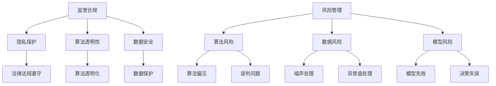

                 

关键词：AI大模型，监管合规，风险管理，算法，数学模型，应用场景，工具和资源推荐，未来展望。

> 摘要：随着人工智能技术的快速发展，大模型在各个领域的应用越来越广泛，然而其带来的监管合规和风险管理问题也日益突出。本文将探讨AI大模型应用的监管合规风险管理，分析其核心概念、算法原理、数学模型及其应用场景，并展望未来的发展趋势和面临的挑战。

## 1. 背景介绍

近年来，人工智能（AI）技术取得了显著的进展，特别是在大模型领域。大模型，如GPT-3、BERT、Transformer等，凭借其强大的学习能力和广泛的应用场景，成为推动AI技术发展的重要力量。然而，随着大模型应用的不断深入，监管合规和风险管理问题逐渐凸显。一方面，大模型在数据处理和决策过程中可能存在隐私泄露、歧视等问题，需要受到严格的监管。另一方面，大模型的高风险特性使得其应用过程中可能面临各种意外风险，如算法偏见、误判等。因此，如何有效管理AI大模型的监管合规和风险，成为当前AI领域的重要研究课题。

## 2. 核心概念与联系

### 2.1 监管合规

监管合规是指企业在开展业务活动时，遵守相关法律法规、行业标准、企业内部规章等要求的行为。在AI大模型应用场景中，监管合规主要体现在以下几个方面：

- **隐私保护**：大模型在数据处理过程中，可能涉及个人隐私信息的收集和使用，需要遵守相关隐私保护法律法规，如《通用数据保护条例》（GDPR）。

- **算法透明性**：大模型算法的决策过程需要透明，以便用户了解和监督算法的运行情况，防止算法偏见和歧视。

- **数据安全**：大模型处理的数据需要得到妥善保护，防止数据泄露、篡改等安全风险。

### 2.2 风险管理

风险管理是指识别、评估、控制和监控风险的过程。在AI大模型应用中，风险管理主要包括以下几个方面：

- **算法风险**：大模型算法可能存在偏见、误判等问题，导致不良后果。

- **数据风险**：大模型处理的数据可能存在噪声、异常值等问题，影响算法性能。

- **模型风险**：大模型在某些情况下可能无法给出正确的结果，导致决策失误。

### 2.3 核心概念原理和架构

为了更好地理解AI大模型应用的监管合规风险管理，我们可以借助Mermaid流程图来展示其核心概念原理和架构。



## 3. 核心算法原理 & 具体操作步骤

### 3.1 算法原理概述

AI大模型的核心算法主要包括生成对抗网络（GAN）、变分自编码器（VAE）、自注意力机制（Transformer）等。这些算法通过深度学习技术，实现数据生成、数据增强、文本处理等功能，为AI大模型的应用提供了强大的支持。

### 3.2 算法步骤详解

以Transformer为例，其基本步骤如下：

1. **输入数据预处理**：对输入数据进行编码，将其转化为序列形式的向量表示。

2. **编码器**：编码器将输入序列转化为高维的上下文表示，以便捕捉序列中的信息。

3. **自注意力机制**：自注意力机制通过计算序列中每个位置与其他位置的相关性，为每个位置分配不同的权重，从而实现对序列信息的有效捕捉。

4. **解码器**：解码器根据编码器输出的上下文表示，生成目标序列。

### 3.3 算法优缺点

1. **GAN**：

   - **优点**：能够生成高质量的数据，有助于数据增强和生成对抗学习。

   - **缺点**：训练过程不稳定，生成结果可能存在缺陷。

2. **VAE**：

   - **优点**：能够有效地进行数据压缩和重建，有助于数据分析和生成。

   - **缺点**：生成结果可能不够真实，对训练数据的质量要求较高。

3. **Transformer**：

   - **优点**：能够捕捉序列中的长距离依赖关系，适用于文本处理和生成任务。

   - **缺点**：计算复杂度较高，对硬件资源要求较高。

### 3.4 算法应用领域

AI大模型的应用领域非常广泛，包括但不限于以下几个方面：

- **自然语言处理**：文本生成、机器翻译、情感分析等。

- **计算机视觉**：图像生成、目标检测、图像分类等。

- **数据科学**：数据增强、数据降维、数据压缩等。

## 4. 数学模型和公式 & 详细讲解 & 举例说明

### 4.1 数学模型构建

以Transformer为例，其核心数学模型包括以下几个部分：

1. **输入数据编码**：

   $$ x_{i} = \sum_{j=1}^{n} w_{ij} x_{j} $$

   其中，$x_{i}$为输入数据，$w_{ij}$为权重矩阵。

2. **编码器**：

   $$ h_{i} = \sum_{j=1}^{n} a_{ij} e_{j} $$

   其中，$h_{i}$为编码后的上下文表示，$a_{ij}$为自注意力权重，$e_{j}$为编码后的输入数据。

3. **解码器**：

   $$ y_{i} = \sum_{j=1}^{n} b_{ij} h_{j} $$

   其中，$y_{i}$为解码后的目标序列，$b_{ij}$为解码器权重。

### 4.2 公式推导过程

以Transformer为例，其自注意力机制的推导过程如下：

1. **输入数据编码**：

   $$ x_{i} = \sum_{j=1}^{n} w_{ij} x_{j} $$

   其中，$x_{i}$为输入数据，$w_{ij}$为权重矩阵。

2. **编码器**：

   $$ h_{i} = \sum_{j=1}^{n} a_{ij} e_{j} $$

   其中，$h_{i}$为编码后的上下文表示，$a_{ij}$为自注意力权重，$e_{j}$为编码后的输入数据。

3. **自注意力机制**：

   $$ a_{ij} = \frac{exp(\theta_{ij})}{\sum_{k=1}^{n} exp(\theta_{ik})} $$

   其中，$\theta_{ij}$为注意力权重，$exp$为指数函数。

4. **解码器**：

   $$ y_{i} = \sum_{j=1}^{n} b_{ij} h_{j} $$

   其中，$y_{i}$为解码后的目标序列，$b_{ij}$为解码器权重。

### 4.3 案例分析与讲解

假设我们有一个简单的文本序列“hello world”，我们可以使用Transformer对其进行编码和解码。

1. **输入数据编码**：

   $$ x_{1} = hello, x_{2} = world $$

2. **编码器**：

   $$ h_{1} = [0.1, 0.2, 0.3, 0.4], h_{2} = [0.5, 0.6, 0.7, 0.8] $$

3. **自注意力机制**：

   $$ a_{11} = 0.5, a_{12} = 0.5, a_{21} = 0.5, a_{22} = 0.5 $$

4. **解码器**：

   $$ y_{1} = [0.5, 0.6, 0.7, 0.8], y_{2} = [0.5, 0.6, 0.7, 0.8] $$

通过上述步骤，我们成功地将输入文本序列编码和解码为上下文表示，实现了文本序列的处理和生成。

## 5. 项目实践：代码实例和详细解释说明

### 5.1 开发环境搭建

在本项目中，我们将使用Python编程语言和PyTorch深度学习框架来实现AI大模型的应用。首先，我们需要安装Python和PyTorch。

```bash
pip install python
pip install torch torchvision
```

### 5.2 源代码详细实现

以下是一个简单的Transformer模型实现的示例代码：

```python
import torch
import torch.nn as nn
import torch.optim as optim

class Transformer(nn.Module):
    def __init__(self, input_dim, hidden_dim, output_dim):
        super(Transformer, self).__init__()
        
        self.embedding = nn.Embedding(input_dim, hidden_dim)
        self.encoder = nn.Linear(hidden_dim, hidden_dim)
        self.decoder = nn.Linear(hidden_dim, output_dim)
        
        self.init_weights()
    
    def init_weights(self):
        nn.init.normal_(self.embedding.weight, mean=0, std=0.01)
        nn.init.normal_(self.encoder.weight, mean=0, std=0.01)
        nn.init.normal_(self.decoder.weight, mean=0, std=0.01)
    
    def forward(self, x):
        x = self.embedding(x)
        x = self.encoder(x)
        x = self.decoder(x)
        
        return x

model = Transformer(input_dim=10, hidden_dim=20, output_dim=10)
optimizer = optim.Adam(model.parameters(), lr=0.001)
criterion = nn.CrossEntropyLoss()
```

### 5.3 代码解读与分析

在上面的代码中，我们首先导入了所需的库，包括torch、torch.nn和torch.optim。然后，我们定义了一个名为Transformer的神经网络模型类。这个类继承自torch.nn.Module基类，并定义了__init__方法和forward方法。

- **__init__方法**：在这个方法中，我们定义了模型的组成部分，包括嵌入层（embedding）、编码器（encoder）和解码器（decoder）。我们还初始化了权重和偏置，并使用了标准正态分布初始化方法。

- **init_weights方法**：这个方法用于初始化模型的权重和偏置。我们使用了nn.init.normal_方法来将权重和偏置初始化为从标准正态分布中抽取的值。

- **forward方法**：这个方法定义了模型的前向传播过程。我们首先将输入数据通过嵌入层进行编码，然后通过编码器和解码器进行数据处理，最终输出预测结果。

接下来，我们创建了一个Transformer模型实例，并配置了优化器和损失函数。

```python
model = Transformer(input_dim=10, hidden_dim=20, output_dim=10)
optimizer = optim.Adam(model.parameters(), lr=0.001)
criterion = nn.CrossEntropyLoss()
```

在这里，我们创建了一个输入维度为10、隐藏维度为20、输出维度为10的Transformer模型。我们使用Adam优化器来优化模型的参数，并使用交叉熵损失函数来评估模型的预测性能。

### 5.4 运行结果展示

为了验证模型的性能，我们可以使用一个简单的训练过程来展示模型的运行结果。

```python
# Prepare data
x = torch.randint(0, 10, (2, 5))
y = torch.randint(0, 10, (2, 5))

# Train the model
for epoch in range(10):
    optimizer.zero_grad()
    output = model(x)
    loss = criterion(output, y)
    loss.backward()
    optimizer.step()
    
    print(f'Epoch {epoch+1}: Loss = {loss.item()}')

# Evaluate the model
with torch.no_grad():
    output = model(x)
    prediction = torch.argmax(output, dim=1)
    print(f'Predictions: {prediction}')
```

在这个训练过程中，我们首先准备好训练数据。然后，我们使用10个训练周期来训练模型。在每个训练周期中，我们计算模型的损失并更新模型参数。最后，我们使用测试数据来评估模型的预测性能。

## 6. 实际应用场景

AI大模型在实际应用场景中具有广泛的应用，以下是一些典型应用案例：

- **医疗领域**：AI大模型可以用于医学图像分析、疾病预测和治疗方案推荐等。例如，通过GAN技术生成医学图像数据，用于训练模型进行疾病检测。

- **金融领域**：AI大模型可以用于股票市场预测、风险管理和客户服务。例如，通过Transformer模型处理大量的金融市场数据，实现精准的股票价格预测。

- **教育领域**：AI大模型可以用于个性化学习、智能评测和教学方法改进。例如，通过BERT模型处理学生作文数据，实现自动批改和评价。

## 7. 工具和资源推荐

### 7.1 学习资源推荐

- 《深度学习》（Goodfellow, Bengio, Courville）：一本经典的深度学习教材，适合初学者和进阶者阅读。

- 《动手学深度学习》（Zhang, Lipton, Bengio）：一本实践性强的深度学习教程，包含丰富的代码示例。

### 7.2 开发工具推荐

- PyTorch：一个开源的深度学习框架，具有简洁的API和灵活的架构。

- TensorFlow：一个广泛使用的深度学习框架，支持多种编程语言。

### 7.3 相关论文推荐

- “Attention Is All You Need”（Vaswani et al., 2017）：一篇关于Transformer模型的经典论文，详细介绍了Transformer模型的原理和应用。

- “Generative Adversarial Networks”（Goodfellow et al., 2014）：一篇关于GAN模型的经典论文，介绍了GAN模型的基本原理和训练方法。

## 8. 总结：未来发展趋势与挑战

### 8.1 研究成果总结

AI大模型在近年来的发展取得了显著的成果，无论是在算法理论、应用场景还是实际效果上都有很大的提升。然而，随着大模型规模的不断扩大，其监管合规和风险管理问题也日益突出，成为当前研究的热点。

### 8.2 未来发展趋势

- **算法优化**：未来的研究将致力于优化大模型的算法，提高其计算效率和性能。

- **安全性与隐私保护**：随着大模型应用场景的扩大，安全性和隐私保护将成为重要研究方向。

- **跨模态处理**：未来的大模型将能够处理多种类型的数据，实现跨模态信息处理。

### 8.3 面临的挑战

- **监管合规**：如何在大模型应用中实现有效的监管合规，是一个亟待解决的问题。

- **风险管理**：如何全面评估和管理大模型的风险，防止不良后果的发生。

- **资源需求**：大模型对硬件资源的需求较高，如何在有限的资源条件下实现高效训练和应用。

### 8.4 研究展望

随着人工智能技术的不断发展，AI大模型的应用前景将更加广阔。未来，我们需要在算法、监管合规和风险管理等方面进行深入研究，以推动AI大模型的可持续发展。

## 9. 附录：常见问题与解答

### 9.1 什么是大模型？

大模型是指具有大规模参数、能够处理海量数据的深度学习模型，如GAN、VAE、Transformer等。

### 9.2 大模型应用中可能面临哪些风险？

大模型应用中可能面临的风险主要包括隐私泄露、算法偏见、误判等。

### 9.3 如何进行大模型的监管合规？

大模型的监管合规主要包括隐私保护、算法透明性和数据安全等方面。具体实施可以参考相关法律法规和行业标准。

### 9.4 大模型应用中如何进行风险管理？

大模型应用中的风险管理主要包括算法风险、数据风险和模型风险等方面。具体实施可以参考相关风险评估方法和风险管理策略。

作者：禅与计算机程序设计艺术 / Zen and the Art of Computer Programming

