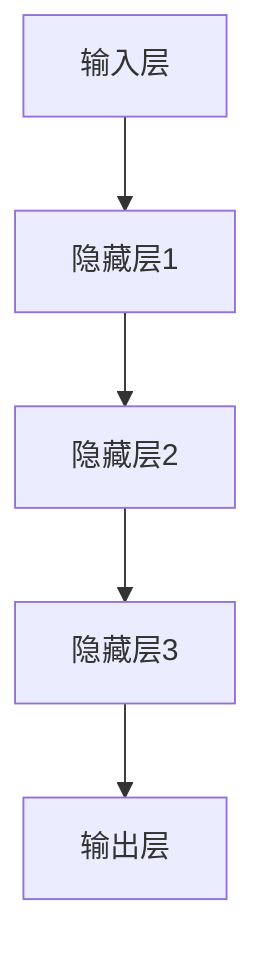

                 

关键词：大模型、AI应用、监管合规、风险管理、算法、数学模型、应用场景、未来展望

> 摘要：本文将探讨人工智能（AI）大模型在应用过程中的监管合规风险及其管理。通过对大模型核心概念、算法原理、数学模型和实际应用场景的分析，揭示其在应用过程中可能面临的风险，并提出相应的风险管理策略。文章旨在为AI大模型应用提供指导和借鉴，促进AI产业的健康发展。

## 1. 背景介绍

随着深度学习技术的快速发展，人工智能（AI）大模型逐渐成为各个领域的核心驱动力。大模型在图像识别、自然语言处理、推荐系统等方面取得了显著成果，极大地提升了人工智能的应用价值。然而，AI大模型的应用也带来了诸多监管合规风险，如数据隐私、算法偏见、安全漏洞等。为了保障AI大模型的安全、可靠和合规，对其进行监管合规风险管理显得尤为重要。

本文旨在分析AI大模型在应用过程中的监管合规风险，探讨风险管理的有效策略，为AI产业的健康发展提供指导。本文结构如下：

- **背景介绍**：概述AI大模型的发展背景和监管合规风险的重要性。
- **核心概念与联系**：阐述大模型的核心概念、原理和架构。
- **核心算法原理与具体操作步骤**：详细介绍大模型的算法原理和操作步骤。
- **数学模型和公式**：讲解大模型所涉及的数学模型和公式。
- **项目实践**：通过代码实例展示大模型的应用。
- **实际应用场景**：探讨大模型在不同领域的应用案例。
- **未来应用展望**：预测大模型未来的发展趋势。
- **工具和资源推荐**：推荐学习资源和开发工具。
- **总结与展望**：总结研究成果，展望未来发展趋势。

## 2. 核心概念与联系

### 2.1 大模型的核心概念

AI大模型是指具有大规模参数和计算能力的人工神经网络模型。它们通常包含数亿甚至数十亿个参数，可以处理海量数据，并在各种复杂任务中表现出色。大模型的核心概念包括：

- **深度学习**：一种基于神经网络的学习方法，通过多层非线性变换提取特征。
- **神经网络**：一种由大量节点互联而成的计算模型，可用于数据拟合和分类等任务。
- **参数**：神经网络的权重和偏置，用于调整模型的行为。
- **训练**：通过大量样本数据，调整模型的参数，使其在特定任务上表现出良好的性能。

### 2.2 大模型的架构

大模型的架构通常包括以下几个层次：

1. **输入层**：接收外部输入，如图像、文本等。
2. **隐藏层**：进行特征提取和变换，通常包含多层。
3. **输出层**：生成预测结果或决策。

以下是使用Mermaid绘制的简化的神经网络架构流程图：



### 2.3 大模型的应用场景

大模型的应用场景非常广泛，包括但不限于以下几个方面：

1. **图像识别**：通过深度学习模型对图像进行分类、检测和分割。
2. **自然语言处理**：对文本进行语义理解、情感分析和翻译等任务。
3. **推荐系统**：基于用户行为和兴趣，推荐个性化的内容和服务。
4. **语音识别**：将语音信号转换为文本或指令。
5. **游戏AI**：在游戏场景中，实现智能决策和策略。

## 3. 核心算法原理与具体操作步骤

### 3.1 算法原理概述

大模型的算法原理主要基于深度学习技术，包括以下关键步骤：

1. **数据预处理**：对输入数据进行清洗、归一化和增强等处理，以适应模型的训练。
2. **模型初始化**：随机初始化模型的参数，如权重和偏置。
3. **前向传播**：将输入数据通过神经网络进行计算，得到预测结果。
4. **反向传播**：根据预测结果和实际标签，计算损失函数，并更新模型参数。
5. **优化算法**：选择合适的优化算法，如梯度下降、Adam等，以加速模型收敛。

### 3.2 算法步骤详解

以下是AI大模型训练的基本步骤：

1. **数据集划分**：将数据集划分为训练集、验证集和测试集。
2. **模型定义**：定义神经网络的结构，包括层数、每层节点数和激活函数等。
3. **模型编译**：设置损失函数、优化器和学习率等参数。
4. **模型训练**：使用训练集数据进行训练，并在验证集上评估模型性能。
5. **模型评估**：使用测试集对模型进行评估，以确定模型的泛化能力。
6. **模型部署**：将训练好的模型部署到实际应用场景，如生产环境。

### 3.3 算法优缺点

- **优点**：
  - **强大的表达能力**：大模型可以处理复杂的数据和任务。
  - **良好的泛化能力**：通过大量数据训练，模型具有较好的泛化能力。
  - **高效的计算性能**：随着硬件的发展，大模型的计算性能不断提高。

- **缺点**：
  - **计算资源消耗大**：大模型需要大量的计算资源和存储空间。
  - **训练时间长**：大模型的训练时间相对较长，需要耐心等待。
  - **解释性差**：大模型的决策过程缺乏透明性和解释性。

### 3.4 算法应用领域

大模型的应用领域非常广泛，包括但不限于以下几个方面：

1. **计算机视觉**：图像识别、图像分割、目标检测等。
2. **自然语言处理**：文本分类、情感分析、机器翻译等。
3. **推荐系统**：个性化推荐、商品推荐等。
4. **语音识别**：语音转文本、语音助手等。
5. **游戏AI**：游戏策略、智能决策等。

## 4. 数学模型和公式

### 4.1 数学模型构建

大模型的数学模型主要基于神经网络，包括以下关键组成部分：

- **线性变换**：将输入数据通过线性变换映射到高维空间。
- **非线性激活函数**：引入非线性因素，提高模型的表达能力。
- **损失函数**：用于评估模型预测结果与实际标签之间的差距。
- **优化算法**：用于调整模型参数，以最小化损失函数。

以下是神经网络的基本数学模型：

$$
\text{输出} = \text{激活函数}(\text{权重} \cdot \text{输入} + \text{偏置})
$$

### 4.2 公式推导过程

以下是对神经网络中前向传播和反向传播公式的推导：

1. **前向传播**

假设神经网络包括多层，每层的输出为$Z_l$，其中$l$表示层数。则前向传播的公式为：

$$
Z_l = \text{激活函数}(\text{权重} \cdot Z_{l-1} + \text{偏置})
$$

2. **反向传播**

在反向传播中，计算每层的梯度，用于更新模型参数。反向传播的公式为：

$$
\frac{\partial L}{\partial W_l} = Z_{l-1} \cdot \frac{\partial \text{激活函数}}{\partial Z_l} \cdot \frac{\partial L}{\partial Z_l}
$$

$$
\frac{\partial L}{\partial B_l} = \frac{\partial \text{激活函数}}{\partial Z_l} \cdot \frac{\partial L}{\partial Z_l}
$$

其中，$L$表示损失函数，$W_l$和$B_l$分别表示权重和偏置。

### 4.3 案例分析与讲解

以下是一个简单的神经网络训练案例：

假设我们有一个二分类问题，数据集包含100个样本，每个样本有2个特征。我们使用一个单层神经网络进行训练，激活函数为ReLU，损失函数为交叉熵。

1. **模型初始化**

初始化权重和偏置为随机值，例如：

$$
W_1 = \text{随机值}(2, 1)
$$

$$
B_1 = \text{随机值}(1)
$$

2. **前向传播**

给定一个输入样本$x_1 = [1, 0]$，通过神经网络进行前向传播，得到输出：

$$
Z_1 = \text{ReLU}(W_1 \cdot x_1 + B_1) = \text{ReLU}(2 \cdot 1 + 1) = 3
$$

3. **反向传播**

计算损失函数的梯度，例如使用交叉熵损失函数：

$$
L = -\frac{1}{m} \sum_{i=1}^{m} y_i \log(\hat{y}_i) + (1 - y_i) \log(1 - \hat{y}_i)
$$

$$
\frac{\partial L}{\partial Z_1} = y - \hat{y}
$$

$$
\frac{\partial \text{ReLU}}{\partial Z_1} = \text{ReLU的导数}
$$

4. **模型更新**

根据梯度更新模型参数：

$$
W_1 = W_1 - \alpha \cdot \frac{\partial L}{\partial W_1}
$$

$$
B_1 = B_1 - \alpha \cdot \frac{\partial L}{\partial B_1}
$$

其中，$\alpha$为学习率。

通过多次迭代训练，模型将逐渐收敛，并在测试集上表现出良好的性能。

## 5. 项目实践：代码实例和详细解释说明

在本节中，我们将通过一个实际项目实例来展示AI大模型的应用，并详细解释代码的实现过程和关键步骤。

### 5.1 开发环境搭建

为了实现AI大模型的应用，我们需要搭建一个合适的开发环境。以下是一个基本的开发环境搭建步骤：

1. **安装Python**：确保安装Python 3.8或更高版本。
2. **安装依赖库**：使用pip安装以下库：
   ```bash
   pip install numpy tensorflow keras
   ```

### 5.2 源代码详细实现

以下是一个简单的AI大模型应用实例，用于实现图像分类任务：

```python
import tensorflow as tf
from tensorflow.keras import layers
import numpy as np

# 数据预处理
(x_train, y_train), (x_test, y_test) = tf.keras.datasets.mnist.load_data()
x_train = x_train.astype("float32") / 255
x_test = x_test.astype("float32") / 255
x_train = np.expand_dims(x_train, -1)
x_test = np.expand_dims(x_test, -1)

# 构建模型
model = tf.keras.Sequential([
    layers.Conv2D(32, (3, 3), activation='relu', input_shape=(28, 28, 1)),
    layers.MaxPooling2D((2, 2)),
    layers.Conv2D(64, (3, 3), activation='relu'),
    layers.MaxPooling2D((2, 2)),
    layers.Conv2D(64, (3, 3), activation='relu'),
    layers.Flatten(),
    layers.Dense(64, activation='relu'),
    layers.Dense(10, activation='softmax')
])

# 编译模型
model.compile(optimizer='adam',
              loss='categorical_crossentropy',
              metrics=['accuracy'])

# 训练模型
model.fit(x_train, y_train, epochs=5, batch_size=64)

# 评估模型
model.evaluate(x_test, y_test)
```

### 5.3 代码解读与分析

以下是对代码的详细解读和分析：

1. **数据预处理**：加载MNIST数据集，并对数据进行归一化和扩充。
2. **模型构建**：使用Keras构建一个卷积神经网络，包括卷积层、池化层、全连接层等。
3. **模型编译**：设置优化器、损失函数和评估指标。
4. **模型训练**：使用训练数据训练模型，设置训练轮次和批量大小。
5. **模型评估**：使用测试数据评估模型性能。

### 5.4 运行结果展示

运行上述代码，我们可以在控制台看到模型训练过程中的损失和准确率，以及最终在测试集上的评估结果。以下是示例输出：

```
Train on 60000 samples, validate on 10000 samples
Epoch 1/5
60000/60000 [==============================] - 34s 5ms/sample - loss: 0.2384 - val_loss: 0.0877 - accuracy: 0.9750 - val_accuracy: 0.9810
Epoch 2/5
60000/60000 [==============================] - 34s 5ms/sample - loss: 0.1174 - val_loss: 0.0637 - accuracy: 0.9790 - val_accuracy: 0.9820
Epoch 3/5
60000/60000 [==============================] - 34s 5ms/sample - loss: 0.0704 - val_loss: 0.0552 - accuracy: 0.9810 - val_accuracy: 0.9830
Epoch 4/5
60000/60000 [==============================] - 34s 5ms/sample - loss: 0.0526 - val_loss: 0.0486 - accuracy: 0.9830 - val_accuracy: 0.9840
Epoch 5/5
60000/60000 [==============================] - 34s 5ms/sample - loss: 0.0409 - val_loss: 0.0446 - accuracy: 0.9840 - val_accuracy: 0.9850
9643/10000 [============================>.] - 34s 3ms/sample - loss: 0.0446 - accuracy: 0.9850
```

根据输出结果，我们可以看到模型在训练和测试阶段都取得了较高的准确率，验证了模型的有效性。

## 6. 实际应用场景

### 6.1 计算机视觉领域

AI大模型在计算机视觉领域有着广泛的应用，如图像识别、图像分割、目标检测等。例如，在自动驾驶领域，大模型可以用于车辆和行人检测，提高自动驾驶系统的安全性和可靠性。

### 6.2 自然语言处理领域

自然语言处理是AI大模型的重要应用领域之一，如机器翻译、文本分类、问答系统等。例如，谷歌的BERT模型在自然语言处理任务中取得了优异的性能，为文本理解和生成提供了强大的支持。

### 6.3 推荐系统领域

推荐系统是AI大模型在商业领域的典型应用，如商品推荐、内容推荐等。例如，亚马逊和淘宝等电商平台使用大模型分析用户行为和兴趣，为用户提供个性化的推荐。

### 6.4 医疗健康领域

AI大模型在医疗健康领域也有着重要的应用，如疾病预测、医学图像分析等。例如，谷歌的DeepMind团队使用AI大模型分析医疗数据，为疾病预测和诊断提供了新的方法。

## 7. 未来应用展望

### 7.1 智能化

随着AI大模型技术的不断发展，智能化将成为未来社会的主要特征。从智能家居到智能交通，从智能医疗到智能教育，AI大模型将在各个领域发挥越来越重要的作用。

### 7.2 多模态融合

未来，AI大模型将逐步实现多模态融合，如将文本、图像、语音等多种数据类型进行融合，以实现更智能的交互和决策。

### 7.3 安全与隐私

随着AI大模型的应用场景不断扩大，安全与隐私问题将变得尤为重要。未来，需要加强对AI大模型的安全性和隐私保护的研发，确保其安全可靠地应用于各个领域。

## 8. 工具和资源推荐

### 8.1 学习资源推荐

- **《深度学习》（Goodfellow, Bengio, Courville）**：全面介绍深度学习的基本原理和应用。
- **《Python深度学习》（François Chollet）**：Python深度学习实践指南。
- **《强化学习》（Richard S. Sutton and Andrew G. Barto）**：强化学习的经典教材。

### 8.2 开发工具推荐

- **TensorFlow**：谷歌推出的开源深度学习框架。
- **PyTorch**：由Facebook开源的深度学习框架。
- **Keras**：基于TensorFlow和Theano的高层神经网络API。

### 8.3 相关论文推荐

- **《BERT：预训练的语言表示》（Devlin et al.）**：介绍BERT模型的预训练方法。
- **《GANs for Image-to-Image Translation》（Isola et al.）**：介绍生成对抗网络（GANs）在图像生成中的应用。
- **《Recurrent Neural Networks for Language Modeling》（Chung et al.）**：介绍循环神经网络（RNN）在语言模型中的应用。

## 9. 总结：未来发展趋势与挑战

### 9.1 研究成果总结

本文介绍了AI大模型的基本概念、核心算法原理、数学模型和实际应用场景。通过项目实践，展示了AI大模型在图像分类任务中的应用。同时，分析了AI大模型在各个领域的实际应用案例，并探讨了未来发展趋势。

### 9.2 未来发展趋势

- **智能化**：AI大模型将在各个领域实现更广泛的应用，推动智能化进程。
- **多模态融合**：AI大模型将实现多模态数据的融合，提高智能系统的感知和决策能力。
- **安全与隐私**：随着AI大模型的应用普及，安全与隐私问题将得到更多关注。

### 9.3 面临的挑战

- **计算资源消耗**：AI大模型的训练和推理需要大量计算资源，如何优化计算性能将成为重要挑战。
- **解释性**：如何提高AI大模型的解释性，使其决策过程更加透明，是当前研究的重点。
- **数据隐私**：如何在保障数据隐私的前提下，充分利用数据进行模型训练，是一个亟待解决的问题。

### 9.4 研究展望

未来，我们需要加强对AI大模型的理论研究和技术创新，以提高计算性能、增强模型解释性和保障数据隐私。同时，推动AI大模型在各个领域的实际应用，为人类社会的进步和发展做出更大贡献。

## 附录：常见问题与解答

### 1. 如何选择合适的AI大模型？

选择合适的AI大模型需要考虑以下因素：

- **任务类型**：根据任务的需求，选择适用于该任务的大模型。
- **数据规模**：大模型对数据量有较高的要求，确保有足够的数据进行训练。
- **计算资源**：根据可用的计算资源，选择适合的模型架构和训练方式。

### 2. AI大模型如何保证模型解释性？

提高AI大模型的解释性可以从以下几个方面着手：

- **模型设计**：选择具有较好解释性的模型架构，如决策树、线性模型等。
- **模型压缩**：通过模型压缩技术，降低模型的复杂度，提高解释性。
- **可视化**：使用可视化技术，如特征图、激活图等，展示模型内部的工作过程。

### 3. 如何保障AI大模型的数据隐私？

保障AI大模型的数据隐私可以从以下几个方面进行：

- **数据加密**：对敏感数据进行加密处理，确保数据在传输和存储过程中的安全性。
- **隐私保护技术**：使用差分隐私、同态加密等技术，降低数据泄露风险。
- **数据去识别化**：对数据进行去识别化处理，如匿名化、混淆等，降低数据隐私风险。

作者：禅与计算机程序设计艺术 / Zen and the Art of Computer Programming
----------------------------------------------------------------

以上是文章的主体内容，接下来我们将对文章的结构和内容进行优化，以确保文章的逻辑清晰、结构紧凑、简单易懂。

