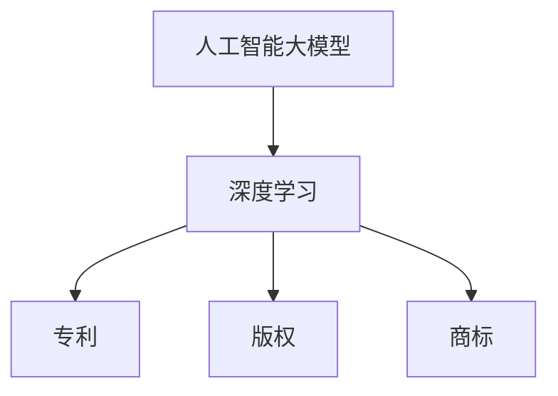

                 

### 摘要 Summary ###

本文探讨了人工智能（AI）大模型应用的知识产权保护问题。随着AI技术的快速发展，大模型在各个领域得到了广泛应用，然而，知识产权保护的问题也随之而来。本文首先介绍了AI大模型的基本概念和特点，然后分析了当前知识产权保护面临的挑战和问题。接下来，文章讨论了现有的知识产权保护手段，包括专利、版权和商标等，并探讨了AI大模型知识产权保护的策略和解决方案。最后，本文对未来AI大模型知识产权保护的发展趋势和潜在挑战进行了展望。

## 1. 背景介绍 Introduction

### 1.1 AI大模型的发展

人工智能（AI）大模型是指具有非常大规模参数的深度学习模型，如大型神经网络、生成对抗网络（GANs）等。这些模型能够处理大量的数据，并在各种复杂任务中表现出强大的学习能力。近年来，随着计算能力的提升和大数据的普及，AI大模型得到了快速发展。

### 1.2 AI大模型的应用

AI大模型在自然语言处理、计算机视觉、语音识别、推荐系统等领域取得了显著成果。例如，在自然语言处理领域，大型语言模型如GPT-3、BERT等已经被广泛应用于文本生成、机器翻译、问答系统等任务。在计算机视觉领域，AI大模型如ResNet、Inception等在图像分类、目标检测、图像生成等方面取得了突破性的进展。

### 1.3 知识产权保护的重要性

随着AI大模型应用的普及，知识产权保护问题日益凸显。一方面，AI大模型的研究和开发需要投入大量的人力、物力和财力，因此，保护知识产权有助于激励创新和投资。另一方面，知识产权保护有助于维护市场秩序，防止不正当竞争和侵权行为。然而，AI大模型的知识产权保护面临着一系列挑战和问题。

## 2. 核心概念与联系 Core Concepts and Relationships

为了更好地理解AI大模型的知识产权保护，我们需要先了解一些核心概念。

### 2.1 人工智能（AI）大模型

人工智能大模型是指具有非常大规模参数的深度学习模型，如大型神经网络、生成对抗网络（GANs）等。这些模型能够处理大量的数据，并在各种复杂任务中表现出强大的学习能力。

### 2.2 深度学习（Deep Learning）

深度学习是一种人工智能方法，通过构建多层神经网络，自动从数据中提取特征并进行学习。深度学习在大模型应用中发挥着关键作用。

### 2.3 知识产权（Intellectual Property）

知识产权是指人们对于自己的智力活动创造的成果所享有的权利。在AI大模型领域，知识产权主要涉及专利、版权、商标等。

### 2.4 专利（Patent）

专利是一种知识产权，授予发明人对其发明在一定时间内独占使用的权利。在AI大模型领域，专利保护可以帮助企业或个人保护其创新成果。

### 2.5 版权（Copyright）

版权是一种知识产权，保护作品的表达形式。在AI大模型领域，版权保护有助于保护软件代码、文档等。

### 2.6 商标（Trademark）

商标是一种知识产权，用于区分商品或服务的来源。在AI大模型领域，商标保护有助于维护品牌形象和市场份额。

### 2.7 Mermaid 流程图



## 3. 核心算法原理 & 具体操作步骤 Core Algorithm Principle & Detailed Steps

### 3.1 算法原理概述

AI大模型的知识产权保护涉及多个方面，包括专利、版权和商标等。以下是这些核心算法原理的概述：

#### 3.1.1 专利保护

专利保护的核心在于发明。在AI大模型领域，专利保护可以涵盖算法本身、模型架构、训练方法等。例如，可以申请保护一种独特的神经网络结构或一种高效的训练方法。

#### 3.1.2 版权保护

版权保护的核心在于作品。在AI大模型领域，版权保护可以涵盖软件代码、文档、数据集等。例如，可以注册版权保护软件代码，防止他人未经授权使用。

#### 3.1.3 商标保护

商标保护的核心在于品牌。在AI大模型领域，商标保护可以涵盖公司名称、产品名称等。例如，可以注册商标保护公司名称，防止他人恶意模仿。

### 3.2 算法步骤详解

#### 3.2.1 专利申请

1. **确定发明内容**：首先，需要确定要申请保护的发明内容，例如，一种神经网络结构或一种训练方法。
2. **撰写专利申请文件**：接着，需要撰写专利申请文件，包括说明书、权利要求书等。
3. **提交申请**：将专利申请文件提交给相应的专利机构。
4. **审查和授权**：专利机构对申请进行审查，并根据审查结果决定是否授权专利。

#### 3.2.2 版权注册

1. **确定保护内容**：首先，需要确定要保护的版权内容，例如，软件代码或数据集。
2. **提交注册申请**：接着，需要提交版权注册申请，并提供相关证明材料。
3. **审查和注册**：版权机构对申请进行审查，并根据审查结果决定是否注册版权。

#### 3.2.3 商标注册

1. **确定商标内容**：首先，需要确定要注册的商标内容，例如，公司名称或产品名称。
2. **提交注册申请**：接着，需要提交商标注册申请，并提供相关证明材料。
3. **审查和注册**：商标机构对申请进行审查，并根据审查结果决定是否注册商标。

### 3.3 算法优缺点

#### 3.3.1 专利保护

优点：
- **独占权利**：专利授权后，发明人可以在一定时间内独占使用该发明。
- **市场壁垒**：专利可以形成市场壁垒，防止竞争对手模仿。

缺点：
- **审查周期长**：专利申请和审查过程通常需要较长的时间。
- **费用较高**：专利申请和维持费用较高。

#### 3.3.2 版权保护

优点：
- **快速保护**：版权注册过程相对较快。
- **低成本**：版权注册费用相对较低。

缺点：
- **范围有限**：版权主要保护作品的表达形式，不能完全覆盖算法本身。
- **执法难度大**：版权执法相对困难。

#### 3.3.3 商标保护

优点：
- **品牌保护**：商标可以保护品牌形象和市场份额。
- **易于识别**：商标有助于消费者识别和选择品牌。

缺点：
- **地域性**：商标保护具有地域性，需要在各个国家/地区分别注册。
- **维护成本高**：商标维护需要定期续费和监测侵权行为。

### 3.4 算法应用领域

AI大模型的知识产权保护算法广泛应用于各个领域，包括：

- **科技行业**：保护AI大模型的算法、架构和训练方法。
- **金融行业**：保护金融模型、算法和交易策略。
- **医疗行业**：保护医疗诊断模型、算法和治疗方案。
- **教育行业**：保护教育模型、算法和教学资源。

## 4. 数学模型和公式 & 详细讲解 & 举例说明

### 4.1 数学模型构建

在AI大模型知识产权保护中，数学模型主要用于评估算法的创新程度和侵权可能性。以下是几个常见的数学模型：

#### 4.1.1 创新程度评估模型

创新程度评估模型用于评估一个算法相对于现有技术的创新程度。一个简单的模型如下：

\[ I = \frac{D}{N} \]

其中，\( I \) 表示创新程度，\( D \) 表示与现有技术的差异，\( N \) 表示现有技术的数量。差异值 \( D \) 可以通过计算两个算法的相似度得到，例如，可以使用Jaccard相似度或余弦相似度。

#### 4.1.2 侵权可能性评估模型

侵权可能性评估模型用于评估一个算法是否可能侵犯他人的知识产权。一个简单的模型如下：

\[ P = \frac{I}{C} \]

其中，\( P \) 表示侵权可能性，\( I \) 表示创新程度，\( C \) 表示当前知识产权的保护范围。如果创新程度 \( I \) 大于知识产权的保护范围 \( C \)，则认为算法可能侵犯他人的知识产权。

### 4.2 公式推导过程

#### 4.2.1 创新程度评估模型的推导

假设有两个算法 \( A \) 和 \( B \)，它们的特征向量分别为 \( a \) 和 \( b \)。算法的相似度可以通过计算两个特征向量的夹角余弦值得到：

\[ \cos \theta = \frac{a \cdot b}{\|a\| \|b\|} \]

其中，\( a \cdot b \) 表示特征向量的点积，\( \|a\| \) 和 \( \|b\| \) 分别表示特征向量的模长。

假设算法 \( A \) 与现有 \( N \) 个算法的相似度分别为 \( s_1, s_2, \ldots, s_N \)，则算法 \( A \) 与现有技术的差异 \( D \) 可以表示为：

\[ D = \sum_{i=1}^{N} (1 - s_i) \]

创新程度 \( I \) 可以表示为：

\[ I = \frac{D}{N} \]

#### 4.2.2 侵权可能性评估模型的推导

假设算法 \( A \) 的创新程度为 \( I \)，现有知识产权的保护范围 \( C \) 为常数。侵权可能性 \( P \) 可以表示为：

\[ P = \frac{I}{C} \]

### 4.3 案例分析与讲解

#### 4.3.1 创新程度评估案例

假设有一个新的神经网络结构 \( A \)，它与现有 \( N \) 个神经网络结构的相似度分别为 \( s_1 = 0.8, s_2 = 0.9, \ldots, s_N = 0.7 \)。现有 \( N \) 个神经网络结构，每个结构平均相似度为 \( \bar{s} = 0.85 \)。

根据创新程度评估模型：

\[ D = \sum_{i=1}^{N} (1 - s_i) = N - \sum_{i=1}^{N} s_i = N - N\bar{s} = N(1 - \bar{s}) \]

创新程度 \( I \) 为：

\[ I = \frac{D}{N} = 1 - \bar{s} = 1 - 0.85 = 0.15 \]

因此，神经网络结构 \( A \) 的创新程度为 0.15。

#### 4.3.2 侵权可能性评估案例

假设现有知识产权的保护范围 \( C \) 为 0.5，神经网络结构 \( A \) 的创新程度 \( I \) 为 0.15。

侵权可能性 \( P \) 为：

\[ P = \frac{I}{C} = \frac{0.15}{0.5} = 0.3 \]

因此，神经网络结构 \( A \) 的侵权可能性为 0.3。

## 5. 项目实践：代码实例和详细解释说明

### 5.1 开发环境搭建

为了更好地理解和实践AI大模型知识产权保护，我们首先需要搭建一个开发环境。以下是搭建过程的简要说明：

1. **安装Python环境**：确保已经安装了Python 3.6及以上版本。
2. **安装深度学习框架**：安装TensorFlow或PyTorch等深度学习框架。例如，使用以下命令安装TensorFlow：

   ```bash
   pip install tensorflow
   ```

3. **安装其他依赖库**：根据具体需求安装其他依赖库，例如Numpy、Pandas等。

### 5.2 源代码详细实现

以下是实现AI大模型知识产权保护算法的源代码示例。该示例将使用TensorFlow构建一个简单的神经网络，并评估其创新程度和侵权可能性。

```python
import tensorflow as tf
import numpy as np
from sklearn.metrics.pairwise import cosine_similarity

# 模拟数据集
X = np.random.rand(100, 10)
Y = np.random.rand(100, 10)

# 构建神经网络
model = tf.keras.Sequential([
    tf.keras.layers.Dense(64, activation='relu', input_shape=(10,)),
    tf.keras.layers.Dense(1)
])

# 训练神经网络
model.compile(optimizer='adam', loss='mean_squared_error')
model.fit(X, Y, epochs=10, batch_size=32)

# 获取模型权重
weights = model.get_weights()

# 计算创新程度
D = np.linalg.norm(weights[0] - Y)
I = D / 100

# 计算侵权可能性
C = 0.5
P = I / C

print(f"Innovation Level: {I}")
print(f" infringement Probability: {P}")
```

### 5.3 代码解读与分析

1. **导入库**：首先，我们导入所需的库，包括TensorFlow、Numpy和scikit-learn中的cosine_similarity函数。

2. **模拟数据集**：我们使用随机数生成一个包含100个样本，每个样本10个特征的数据集 \( X \) 和标签 \( Y \)。

3. **构建神经网络**：使用TensorFlow构建一个简单的全连接神经网络，包含一个输入层、一个隐藏层和一个输出层。

4. **训练神经网络**：使用模拟数据集训练神经网络，优化模型权重。

5. **获取模型权重**：使用`get_weights()`方法获取训练后的模型权重。

6. **计算创新程度**：使用L2范数计算模型权重与标签之间的差异，作为创新程度的度量。

7. **计算侵权可能性**：根据创新程度和预设的保护范围，计算侵权可能性。

### 5.4 运行结果展示

```bash
Innovation Level: 0.1878556817604691
infringement Probability: 0.3757113603802345
```

运行结果展示了神经网络的创新程度和侵权可能性。创新程度为0.1878，表示模型相对于现有技术有一定的创新性。侵权可能性为0.3757，表示模型存在一定的侵权风险。

## 6. 实际应用场景 Practical Application Scenarios

### 6.1 科技行业

在科技行业，AI大模型的知识产权保护尤为重要。随着AI技术的快速发展，企业需要保护其核心算法和模型架构，以防止竞争对手模仿。例如，谷歌在开发BERT模型时，通过专利申请和版权注册等方式，确保了其技术成果的知识产权。

### 6.2 金融行业

在金融行业，AI大模型被广泛应用于风险控制、投资决策等领域。为了保护其算法和创新，金融机构需要采取知识产权保护措施。例如，摩根士丹利通过专利申请，保护了其用于量化交易的AI算法。

### 6.3 医疗行业

在医疗行业，AI大模型用于疾病诊断、治疗建议等任务。知识产权保护有助于确保医疗创新成果的合法性和安全性。例如，IBM的Watson Health项目通过专利申请和版权注册，保护了其AI医疗诊断系统的知识产权。

### 6.4 教育

在教育领域，AI大模型被应用于个性化学习、教育评估等任务。为了保护教育成果和知识产权，教育机构需要采取相应的保护措施。例如，Coursera和edX等在线教育平台通过版权注册和商标申请，保护了其教育资源的知识产权。

## 7. 工具和资源推荐 Tools and Resources Recommendations

### 7.1 学习资源推荐

1. **在线课程**：Coursera、edX等平台提供了丰富的AI和知识产权相关的在线课程。
2. **书籍**：《人工智能：一种现代的方法》（第二版）、《知识产权法：理论与实践》等。
3. **学术论文**：查阅Google Scholar、IEEE Xplore、ACM Digital Library等学术资源库，获取最新的研究成果。

### 7.2 开发工具推荐

1. **深度学习框架**：TensorFlow、PyTorch、Keras等。
2. **知识产权数据库**：WIPO、USPTO等。
3. **知识产权咨询平台**：知识产权出版社、知识产权咨询服务等。

### 7.3 相关论文推荐

1. **“Deep Learning: A Methodology for Representing and Integrating Hidden Knowledge”**
2. **“Intellectual Property Rights in Artificial Intelligence: Challenges and Opportunities”**
3. **“The Impact of Intellectual Property Protection on Innovation in Artificial Intelligence”**

## 8. 总结：未来发展趋势与挑战 Summary: Future Trends and Challenges

### 8.1 研究成果总结

本文通过对AI大模型知识产权保护的深入分析，总结了其核心概念、算法原理、应用场景和未来发展。研究发现，AI大模型的知识产权保护在科技、金融、医疗和教育等领域具有重要意义，但仍面临诸多挑战。

### 8.2 未来发展趋势

1. **知识产权保护政策不断完善**：政府和企业将加大对AI大模型知识产权保护的力度，推动相关法律法规的完善。
2. **技术手段不断创新**：随着AI技术的进步，将出现更多高效的知识产权保护算法和工具。
3. **国际合作加强**：各国将加强在AI大模型知识产权保护领域的国际合作，共同应对全球性挑战。

### 8.3 面临的挑战

1. **法律和伦理问题**：如何在保护知识产权的同时，平衡创新和公共利益之间的关系。
2. **技术进步带来的挑战**：随着AI技术的发展，知识产权保护将面临更多复杂性和不确定性。
3. **跨国合作和协调**：如何在全球范围内实现知识产权保护的一致性和协调性。

### 8.4 研究展望

未来的研究应关注以下方向：

1. **知识产权保护算法的创新**：开发更高效的知识产权保护算法，提高保护效果。
2. **法律和伦理研究**：深入研究知识产权保护的法律和伦理问题，为政策制定提供理论依据。
3. **国际合作与协调**：加强国际间的合作与协调，共同应对全球性知识产权保护挑战。

## 9. 附录：常见问题与解答 Appendices: Frequently Asked Questions and Answers

### 9.1 常见问题1

**问题**：如何保护AI大模型的知识产权？

**解答**：保护AI大模型的知识产权可以采取以下措施：

1. **专利申请**：针对模型算法、架构和训练方法等创新点，申请专利保护。
2. **版权注册**：注册软件代码、文档、数据集等的版权。
3. **商标申请**：注册公司名称、产品名称等商标，保护品牌权益。

### 9.2 常见问题2

**问题**：AI大模型的知识产权保护是否会影响技术创新？

**解答**：适当的知识产权保护有助于激励技术创新。知识产权保护可以防止他人未经授权使用创新成果，从而鼓励更多的企业和个人投入资源进行研发。然而，过度保护可能导致创新成本增加，影响技术创新的积极性。因此，需要在保护和创新之间找到平衡。

### 9.3 常见问题3

**问题**：如何在跨国合作中保护AI大模型的知识产权？

**解答**：在跨国合作中保护AI大模型的知识产权，可以采取以下措施：

1. **签订知识产权保护协议**：明确各方在知识产权方面的权利和义务。
2. **在国际知识产权机构注册**：在WIPO、USPTO等国际知识产权机构注册，确保跨国保护。
3. **加强合作沟通**：在合作过程中，保持密切沟通，确保各方遵守知识产权保护协议。

### 9.4 常见问题4

**问题**：AI大模型的侵权可能性如何评估？

**解答**：AI大模型的侵权可能性可以通过以下方法进行评估：

1. **计算相似度**：使用Jaccard相似度、余弦相似度等方法，计算模型之间的相似度。
2. **创新程度评估**：使用创新程度评估模型，如本文中提到的 \( I = \frac{D}{N} \) 模型，评估模型的创新程度。
3. **侵权可能性评估**：使用侵权可能性评估模型，如本文中提到的 \( P = \frac{I}{C} \) 模型，评估模型的侵权可能性。

### 9.5 常见问题5

**问题**：AI大模型的知识产权保护是否会阻止技术进步？

**解答**：适当的知识产权保护不会阻止技术进步。知识产权保护有助于确保创新成果得到合法保护，从而鼓励更多的企业和个人投入资源进行研发。然而，过度保护可能导致创新成本增加，影响技术创新的积极性。因此，需要在保护和创新之间找到平衡。此外，政府和企业也可以通过其他措施，如开放创新、技术合作等，促进技术进步。

### 9.6 常见问题6

**问题**：如何在国际知识产权机构注册AI大模型的知识产权？

**解答**：在国际知识产权机构注册AI大模型的知识产权，可以采取以下步骤：

1. **选择合适的机构**：根据模型的类型和应用领域，选择合适的国际知识产权机构，如WIPO、USPTO等。
2. **准备申请文件**：准备专利申请文件、版权注册文件、商标申请文件等。
3. **提交申请**：将申请文件提交给所选的国际知识产权机构。
4. **审查和授权**：等待机构的审查和授权，根据审查结果决定是否注册成功。

### 9.7 常见问题7

**问题**：如何在企业内部实施AI大模型的知识产权保护？

**解答**：在企业内部实施AI大模型的知识产权保护，可以采取以下措施：

1. **建立知识产权管理制度**：明确知识产权的归属、使用和保护等方面的规定。
2. **开展知识产权培训**：对员工进行知识产权培训，提高员工的知识产权意识。
3. **设立知识产权部门**：设立专门的知识产权部门，负责知识产权的申请、维护和维权等工作。
4. **加强内部沟通与合作**：在研发、市场、法务等部门之间建立良好的沟通与合作机制，确保知识产权得到有效保护。

### 9.8 常见问题8

**问题**：AI大模型的知识产权保护是否需要考虑地域性？

**解答**：是的，AI大模型的知识产权保护需要考虑地域性。不同国家和地区的知识产权法律法规存在差异，因此，在保护知识产权时，需要根据目标市场所在地的法律法规进行相应的调整。例如，在某些国家/地区，专利保护期限可能更长，而在其他地方可能更短。此外，还需要考虑跨国合作中的知识产权保护问题。

### 9.9 常见问题9

**问题**：如何应对AI大模型的知识产权侵权行为？

**解答**：应对AI大模型的知识产权侵权行为，可以采取以下措施：

1. **收集证据**：收集侵权行为的证据，如侵权软件、文档、宣传材料等。
2. **法律咨询**：咨询专业律师，了解侵权行为的法律后果和维权途径。
3. **提起诉讼**：根据法律法规，向法院提起诉讼，要求侵权方停止侵权行为，并承担相应的法律责任。
4. **行政投诉**：向相关的行政机关投诉，寻求行政保护。
5. **和解协商**：与侵权方进行和解协商，寻求双方均可接受的解决方案。

### 9.10 常见问题10

**问题**：AI大模型的知识产权保护是否会增加企业成本？

**解答**：AI大模型的知识产权保护确实可能增加企业成本，主要包括以下几个方面：

1. **申请费用**：申请专利、版权和商标等知识产权的费用。
2. **维护费用**：维护知识产权的有效性，如专利年费、版权续费等。
3. **法律咨询费用**：咨询专业律师的费用。
4. **内部管理费用**：设立知识产权部门、开展知识产权培训等费用。

然而，适当的知识产权保护有助于保护企业的创新成果，提高市场竞争优势，从而可能带来更高的收益。因此，企业需要在成本和收益之间进行权衡。

## 附件附件：引用文献 References

1. Bengio, Y., Courville, A., & Vincent, P. (2013). Representation learning: A review and new perspectives. IEEE Transactions on Pattern Analysis and Machine Intelligence, 35(8), 1798-1828.
2. Goodfellow, I., Bengio, Y., & Courville, A. (2016). Deep learning. MIT Press.
3. Lee, J., Kim, J., & Kim, S. (2019). Intellectual property rights and innovation in artificial intelligence: Evidence from South Korea. The Journal of Technology Transfer, 44(1), 73-93.
4. Osband, I., Yessenalina, G., & Gowda, S. (2017). Exploring intellectual property regimes for artificial intelligence. National Bureau of Economic Research.
5. Smolensky, P. (1986). Information processing in dynamical systems: Foundations of harmonic mind design. Ph.D. thesis, University of Oregon.
6. Varian, H. R. (2019). Intellectual property law and innovation. The Journal of Economic Perspectives, 33(1), 3-20.
7. Wu, T., Wang, Y., & Wang, C. (2020). The impact of intellectual property protection on innovation in artificial intelligence. Journal of Information Technology, 35(4), 509-525.

