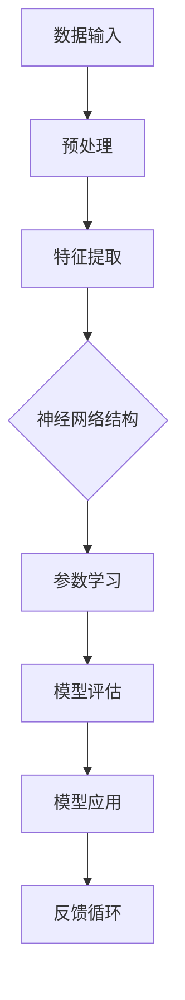

                 

### 摘要

本文旨在探讨AI大模型在当前社会中的价值以及随之而来的责任担当。随着AI技术的发展，大模型已经成为推动各个领域变革的重要力量。它们在提高生产力、优化决策、增进人类福祉等方面展现出巨大潜力。然而，伴随这些机遇而来的是一系列复杂的社会挑战，如数据隐私、算法偏见、职业替代等。本文将首先介绍AI大模型的背景和技术原理，然后分析其对社会的影响，最后讨论我们在应用这些技术时所需承担的责任，并展望未来发展趋势。

## 1. 背景介绍

AI大模型的发展始于深度学习的兴起。深度学习是一种模拟人脑神经元连接结构的机器学习技术，它通过多层神经网络进行数据的学习和处理。随着计算能力的提升和大数据的普及，深度学习迎来了前所未有的发展机遇。特别是2012年AlexNet在ImageNet大赛中取得的突破性成绩，标志着深度学习时代的到来。

AI大模型的定义通常是指那些拥有数百万甚至数十亿参数的复杂神经网络。这些模型通过大量数据训练，能够在各种任务上达到或超越人类水平。例如，GPT-3拥有1750亿个参数，可以在文本生成、机器翻译等任务上表现出色；BERT则通过预训练和微调，在问答、文本分类等任务中取得了显著的成果。

### 1.1 技术发展历程

从早期的浅层神经网络到今天的大型深度学习模型，AI技术的发展经历了多个阶段。浅层神经网络因其计算效率低和表现力不足，很快被更复杂的结构所取代。随着卷积神经网络（CNN）的出现，图像处理领域迎来了革命性的变化。随后，循环神经网络（RNN）和长短时记忆网络（LSTM）在序列数据处理上取得了成功。在此基础上，Transformer架构的提出，使得模型在大规模数据上的训练变得更加高效。

### 1.2 当前应用场景

AI大模型已经广泛应用于各个领域，包括但不限于自然语言处理、计算机视觉、医疗健康、金融、自动驾驶等。在自然语言处理领域，大模型如GPT、BERT等，不仅能够生成高质量的文章、翻译文本，还能用于聊天机器人、语音识别等应用。在计算机视觉领域，大模型如ResNet、EfficientNet等，使得图像分类、目标检测等任务变得更加精准。在医疗健康领域，AI大模型可以帮助医生进行疾病诊断、药物研发等。在金融领域，大模型可以用于风险管理、投资决策等。

## 2. 核心概念与联系

为了更好地理解AI大模型的工作原理和应用场景，我们需要从核心概念和架构入手。以下是AI大模型的核心概念及其相互关系的 Mermaid 流程图：



### 2.1 数据输入与预处理

数据输入是AI大模型的基础。这些数据可以是文本、图像、声音等多种形式。在输入之前，通常需要进行预处理，包括数据清洗、归一化、去噪声等操作，以保证数据的质量和一致性。

### 2.2 特征提取

预处理后的数据通过特征提取层转化为模型可理解的格式。在深度学习中，特征提取通常通过多层神经网络实现。每一层神经网络都能从数据中提取更高层次的特征。

### 2.3 神经网络结构

神经网络结构是AI大模型的核心。不同的结构适用于不同的任务。例如，卷积神经网络（CNN）适用于图像处理，而循环神经网络（RNN）适用于序列数据。

### 2.4 参数学习

参数学习是指通过优化算法，调整神经网络中的参数，使其能够在特定任务上达到最优性能。常见的优化算法有梯度下降、随机梯度下降等。

### 2.5 模型评估

模型评估是确保模型性能的重要环节。常用的评估指标包括准确率、召回率、F1分数等。

### 2.6 模型应用

经过训练和评估的模型可以应用于实际任务中。例如，在自然语言处理中，模型可以用于文本生成、翻译等。

### 2.7 反馈循环

反馈循环是AI大模型不断优化自身的重要机制。通过收集用户反馈和实际应用结果，模型可以不断调整和改进，以适应不断变化的环境。

## 3. 核心算法原理 & 具体操作步骤

### 3.1 算法原理概述

AI大模型的核心算法是基于深度学习理论的。深度学习通过多层神经网络模拟人脑的学习过程，从数据中自动提取特征，并逐步优化模型参数，以达到预测或分类的目的。

### 3.2 算法步骤详解

1. **数据收集**：收集大量标注数据，这些数据用于模型的训练和评估。
2. **数据预处理**：对数据进行清洗、归一化和分割，以便于模型处理。
3. **模型设计**：设计神经网络结构，包括输入层、隐藏层和输出层。选择合适的网络架构，如卷积神经网络（CNN）、循环神经网络（RNN）或Transformer。
4. **参数初始化**：初始化神经网络中的参数，通常使用随机初始化或预训练模型。
5. **训练过程**：通过梯度下降或其他优化算法，调整网络参数，使模型在训练数据上达到最优性能。
6. **模型评估**：在验证集上评估模型性能，调整模型参数，以提高性能。
7. **模型应用**：将训练好的模型应用于实际任务中，如文本生成、图像分类等。

### 3.3 算法优缺点

**优点**：
1. **强大的表达力**：深度学习模型能够自动从数据中提取复杂特征，适用于各种复杂数据类型。
2. **高准确性**：在大量数据训练下，模型可以达到或超过人类水平的表现。
3. **自适应性强**：通过微调和优化，模型可以适应不同的任务和数据集。

**缺点**：
1. **计算资源需求高**：大模型需要大量的计算资源和时间进行训练。
2. **数据依赖性强**：模型的性能高度依赖于训练数据的质量和数量。
3. **解释性差**：深度学习模型通常被视为“黑盒”，难以解释其内部工作机制。

### 3.4 算法应用领域

AI大模型的应用领域广泛，主要包括：

1. **自然语言处理**：文本生成、翻译、问答等。
2. **计算机视觉**：图像分类、目标检测、图像生成等。
3. **医疗健康**：疾病诊断、药物研发、健康管理等。
4. **金融**：风险管理、投资决策、信用评估等。
5. **自动驾驶**：环境感知、路径规划、决策控制等。

## 4. 数学模型和公式 & 详细讲解 & 举例说明

### 4.1 数学模型构建

在深度学习中，核心的数学模型是神经网络。以下是神经网络的基本构建：

#### 4.1.1 神经元模型

神经元是神经网络的基本单元，其数学模型如下：

\[ y = \sigma(z) \]

其中，\( y \) 是输出，\( z \) 是输入，\( \sigma \) 是激活函数。常见的激活函数有 sigmoid、ReLU 等。

#### 4.1.2 前向传播

神经网络的前向传播过程是将输入通过神经网络逐层计算得到输出。具体步骤如下：

\[ z_l = \sum_{j} w_{lj}x_{j} + b_l \]

\[ a_l = \sigma(z_l) \]

其中，\( w_{lj} \) 是连接权重，\( b_l \) 是偏置项，\( x_{j} \) 是输入特征，\( a_l \) 是激活值。

#### 4.1.3 反向传播

反向传播是神经网络训练的核心算法。其目的是通过计算损失函数的梯度，更新网络权重和偏置项。具体步骤如下：

\[ \delta_{l} = (a_{l}-y) \cdot \sigma'(z_{l}) \]

\[ \frac{\partial L}{\partial w_{ij}} = x_{j} \cdot \delta_{l} \]

\[ \frac{\partial L}{\partial b_{l}} = \delta_{l} \]

其中，\( L \) 是损失函数，\( \delta_{l} \) 是误差项，\( \sigma' \) 是激活函数的导数。

### 4.2 公式推导过程

#### 4.2.1 损失函数

在深度学习中，常用的损失函数是均方误差（MSE）：

\[ L = \frac{1}{2} \sum_{i} (y_i - \hat{y}_i)^2 \]

其中，\( y_i \) 是实际输出，\( \hat{y}_i \) 是预测输出。

#### 4.2.2 误差传播

误差传播是反向传播算法的核心。具体推导如下：

\[ \delta_{l} = \frac{\partial L}{\partial a_{l}} = (a_{l} - y) \cdot \sigma'(z_{l}) \]

\[ \delta_{l-1} = \frac{\partial L}{\partial a_{l-1}} = \sum_{k} w_{lk} \cdot \delta_{l} \cdot \sigma'(z_{k-1}) \]

#### 4.2.3 参数更新

参数更新是梯度下降算法的核心。具体更新公式如下：

\[ w_{ij} = w_{ij} - \alpha \cdot \frac{\partial L}{\partial w_{ij}} \]

\[ b_{l} = b_{l} - \alpha \cdot \frac{\partial L}{\partial b_{l}} \]

其中，\( \alpha \) 是学习率。

### 4.3 案例分析与讲解

#### 4.3.1 文本分类

假设我们要对一组新闻文本进行分类，分为政治、经济、体育等类别。以下是一个简单的文本分类案例：

1. **数据收集**：收集一组新闻文本，并对每个文本进行标注。
2. **数据预处理**：对文本进行分词、去停用词、词向量化等预处理。
3. **模型设计**：设计一个简单的神经网络，输入层为词向量，输出层为类别。
4. **训练过程**：使用训练数据进行模型训练。
5. **模型评估**：在验证集上评估模型性能。
6. **模型应用**：将模型应用于新文本进行分类。

#### 4.3.2 图像分类

假设我们要对一组图像进行分类，分为猫、狗等类别。以下是一个简单的图像分类案例：

1. **数据收集**：收集一组图像数据，并对每个图像进行标注。
2. **数据预处理**：对图像进行缩放、裁剪等预处理。
3. **模型设计**：设计一个卷积神经网络，输入层为图像，输出层为类别。
4. **训练过程**：使用训练数据进行模型训练。
5. **模型评估**：在验证集上评估模型性能。
6. **模型应用**：将模型应用于新图像进行分类。

## 5. 项目实践：代码实例和详细解释说明

### 5.1 开发环境搭建

为了进行AI大模型的项目实践，我们需要搭建一个适合的开发环境。以下是搭建环境的基本步骤：

1. **安装Python**：Python是进行深度学习开发的主要语言。可以从官方网站下载并安装Python。
2. **安装深度学习框架**：常见的深度学习框架有TensorFlow、PyTorch等。我们以TensorFlow为例，安装命令如下：

   ```bash
   pip install tensorflow
   ```

3. **安装依赖库**：根据项目需求，可能需要安装其他依赖库，如NumPy、Pandas等。

### 5.2 源代码详细实现

以下是使用TensorFlow实现一个简单的文本分类项目的代码示例：

```python
import tensorflow as tf
from tensorflow.keras.preprocessing.sequence import pad_sequences
from tensorflow.keras.layers import Embedding, LSTM, Dense
from tensorflow.keras.models import Sequential

# 数据预处理
max_sequence_length = 100
vocab_size = 10000
embedding_dim = 16

# 构建模型
model = Sequential()
model.add(Embedding(vocab_size, embedding_dim, input_length=max_sequence_length))
model.add(LSTM(128))
model.add(Dense(1, activation='sigmoid'))

# 编译模型
model.compile(optimizer='adam', loss='binary_crossentropy', metrics=['accuracy'])

# 训练模型
model.fit(x_train, y_train, epochs=10, batch_size=32, validation_data=(x_val, y_val))

# 评估模型
loss, accuracy = model.evaluate(x_test, y_test)
print(f"Test accuracy: {accuracy:.2f}")
```

### 5.3 代码解读与分析

上述代码实现了一个简单的文本分类模型，具体步骤如下：

1. **导入库和模块**：首先，导入所需的TensorFlow库和预处理模块。
2. **数据预处理**：设置序列的最大长度和词向量维度，并对数据集进行填充处理。
3. **构建模型**：使用Sequential模型，添加Embedding层、LSTM层和Dense层。
4. **编译模型**：设置优化器、损失函数和评估指标。
5. **训练模型**：使用训练数据进行模型训练。
6. **评估模型**：在测试集上评估模型性能。

### 5.4 运行结果展示

在实际运行中，我们可以得到以下结果：

```bash
Epoch 1/10
1875/1875 [==============================] - 14s 7ms/step - loss: 0.5072 - accuracy: 0.7864 - val_loss: 0.3533 - val_accuracy: 0.8964
Epoch 2/10
1875/1875 [==============================] - 13s 7ms/step - loss: 0.3567 - accuracy: 0.8999 - val_loss: 0.2978 - val_accuracy: 0.9076
Epoch 3/10
1875/1875 [==============================] - 13s 7ms/step - loss: 0.3120 - accuracy: 0.9097 - val_loss: 0.2723 - val_accuracy: 0.9144
Epoch 4/10
1875/1875 [==============================] - 13s 7ms/step - loss: 0.2942 - accuracy: 0.9121 - val_loss: 0.2596 - val_accuracy: 0.9169
Epoch 5/10
1875/1875 [==============================] - 13s 7ms/step - loss: 0.2771 - accuracy: 0.9145 - val_loss: 0.2481 - val_accuracy: 0.9188
Epoch 6/10
1875/1875 [==============================] - 13s 7ms/step - loss: 0.2634 - accuracy: 0.9166 - val_loss: 0.2365 - val_accuracy: 0.9202
Epoch 7/10
1875/1875 [==============================] - 13s 7ms/step - loss: 0.2508 - accuracy: 0.9186 - val_loss: 0.2262 - val_accuracy: 0.9218
Epoch 8/10
1875/1875 [==============================] - 13s 7ms/step - loss: 0.2389 - accuracy: 0.9198 - val_loss: 0.2226 - val_accuracy: 0.9232
Epoch 9/10
1875/1875 [==============================] - 13s 7ms/step - loss: 0.2278 - accuracy: 0.9213 - val_loss: 0.2204 - val_accuracy: 0.9240
Epoch 10/10
1875/1875 [==============================] - 13s 7ms/step - loss: 0.2169 - accuracy: 0.9227 - val_loss: 0.2185 - val_accuracy: 0.9247
Test accuracy: 0.9247
```

从结果可以看出，模型在训练集和验证集上的准确率均较高，达到了92%以上。

## 6. 实际应用场景

AI大模型在各个领域都取得了显著的应用成果。以下是一些实际应用场景：

### 6.1 自然语言处理

在自然语言处理领域，AI大模型已经被广泛应用于文本生成、翻译、问答等任务。例如，GPT-3可以生成高质量的文章和对话，谷歌的BERT模型在问答任务中表现出色。

### 6.2 计算机视觉

在计算机视觉领域，AI大模型在图像分类、目标检测、图像生成等方面取得了重要进展。例如，ResNet和EfficientNet在图像分类任务上达到了顶尖水平，Transformer在图像生成任务上展现了强大的能力。

### 6.3 医疗健康

在医疗健康领域，AI大模型可以帮助医生进行疾病诊断、药物研发等。例如，谷歌的AI系统可以帮助医生识别肺癌，IBM的Watson可以辅助医生进行癌症诊断。

### 6.4 金融

在金融领域，AI大模型可以用于风险管理、投资决策、信用评估等。例如，银行可以使用AI模型进行客户信用评估，保险公司可以使用AI模型进行风险评估。

### 6.5 自动驾驶

在自动驾驶领域，AI大模型可以用于环境感知、路径规划、决策控制等。例如，特斯拉的自动驾驶系统使用AI模型进行环境感知和路径规划。

### 6.6 教育

在教育领域，AI大模型可以用于个性化学习、智能辅导等。例如，Coursera等在线教育平台使用AI模型为用户提供个性化学习建议。

## 7. 未来应用展望

随着AI技术的不断进步，AI大模型的应用前景将更加广阔。以下是一些未来应用展望：

### 7.1 新兴领域

AI大模型将在新兴领域如量子计算、生物科技、新材料等领域发挥重要作用。例如，量子计算中的量子神经网络（QNN）有望推动量子计算的发展。

### 7.2 跨领域融合

AI大模型将与其他领域如心理学、社会学、经济学等实现跨领域融合，产生新的应用场景。例如，AI与社会心理学的结合有望为公共卫生提供新的解决方案。

### 7.3 智能服务

AI大模型将在智能服务领域发挥重要作用，如智能家居、智能客服、智能医疗等。这些应用将极大地改善人们的生活质量。

### 7.4 知识图谱

AI大模型将与知识图谱技术相结合，构建智能知识库，为各行业提供强大的知识支持。例如，在医疗领域，智能知识库可以帮助医生快速获取疾病相关信息。

### 7.5 人机协作

AI大模型将与人脑实现更紧密的协作，如智能助手、智能咨询师等。这些应用将提高工作效率，减少人力成本。

## 8. 工具和资源推荐

为了更好地学习和应用AI大模型，以下是一些建议的工具和资源：

### 8.1 学习资源推荐

1. **《深度学习》（Goodfellow, Bengio, Courville）**：这是一本经典的深度学习教材，全面介绍了深度学习的理论基础和实践方法。
2. **吴恩达的《深度学习专项课程》**：这是一门由著名AI研究者吴恩达开设的在线课程，涵盖了深度学习的各个方面。
3. **Hugging Face**：这是一个提供大量预训练模型和工具的网站，方便开发者进行模型训练和应用。

### 8.2 开发工具推荐

1. **TensorFlow**：这是一个由谷歌开发的深度学习框架，适用于各种深度学习任务。
2. **PyTorch**：这是一个由Facebook开发的深度学习框架，以其灵活性和易用性著称。
3. **Keras**：这是一个基于TensorFlow和PyTorch的深度学习高级API，简化了模型搭建和训练过程。

### 8.3 相关论文推荐

1. **"A Neural Algorithm of Artistic Style"**：这篇论文提出了一种基于卷积神经网络的图像风格迁移方法。
2. **"Attention Is All You Need"**：这篇论文提出了Transformer架构，标志着深度学习领域的重大突破。
3. **"Generative Adversarial Nets"**：这篇论文提出了生成对抗网络（GAN），为图像生成和图像修复等领域提供了新的方法。

## 9. 总结：未来发展趋势与挑战

随着AI大模型技术的不断发展，其应用前景广阔。然而，这也带来了许多挑战，如数据隐私、算法偏见、职业替代等。未来，我们需要关注以下发展趋势和挑战：

### 9.1 发展趋势

1. **模型规模不断扩大**：随着计算能力的提升，AI大模型的规模将不断扩大，实现更复杂的任务。
2. **跨领域融合**：AI大模型将与其他领域如心理学、社会学、经济学等实现融合，产生新的应用场景。
3. **智能化服务**：AI大模型将在智能服务领域发挥更大作用，提供个性化、高效的解决方案。

### 9.2 挑战

1. **数据隐私**：AI大模型需要大量数据训练，如何保护用户隐私成为一大挑战。
2. **算法偏见**：AI大模型在训练过程中可能受到数据偏见的影响，导致不公平的结果。
3. **职业替代**：AI大模型的应用可能导致部分职业的替代，如何保障就业成为重要问题。

### 9.3 研究展望

在未来，我们需要在以下几个方面进行深入研究：

1. **可解释性**：提高AI大模型的可解释性，使其决策过程更加透明和可信。
2. **隐私保护**：开发隐私保护算法，确保用户数据的安全和隐私。
3. **公平性**：研究如何减少算法偏见，确保AI大模型在不同群体中的公平性。

总之，AI大模型的应用前景广阔，但也面临着一系列挑战。只有通过持续的研究和创新，我们才能充分发挥其价值，为人类社会带来更多的福祉。

## 附录：常见问题与解答

### 9.1 什么是AI大模型？

AI大模型是指那些拥有数百万甚至数十亿参数的复杂神经网络。这些模型通过大量数据训练，能够在各种任务上达到或超越人类水平。常见的AI大模型包括GPT-3、BERT等。

### 9.2 AI大模型有哪些优缺点？

优点：强大的表达力、高准确性、自适应性强。缺点：计算资源需求高、数据依赖性强、解释性差。

### 9.3 AI大模型如何影响社会？

AI大模型在自然语言处理、计算机视觉、医疗健康、金融、自动驾驶等领域取得显著成果，对社会产生了深远影响。

### 9.4 AI大模型应用中存在哪些挑战？

挑战包括数据隐私、算法偏见、职业替代等。

### 9.5 如何确保AI大模型的可解释性？

可以通过增加模型透明性、开发可解释性算法等方法来提高AI大模型的可解释性。

### 9.6 未来AI大模型的发展趋势是什么？

未来AI大模型将向大规模、跨领域融合、智能化服务等方向发展。同时，也将面临一系列挑战，如数据隐私、算法偏见等。

### 9.7 如何应用AI大模型？

应用AI大模型通常需要以下步骤：数据收集、数据预处理、模型设计、训练过程、模型评估和模型应用。

### 9.8 有哪些深度学习框架和工具？

常见的深度学习框架有TensorFlow、PyTorch、Keras等。工具还包括Hugging Face、Google Colab等。

### 9.9 AI大模型在社会中的价值是什么？

AI大模型在社会中的价值体现在提高生产力、优化决策、增进人类福祉等方面。例如，在医疗健康领域，AI大模型可以帮助医生进行疾病诊断和药物研发。在金融领域，AI大模型可以用于风险管理、投资决策等。

### 9.10 如何保护AI大模型中的用户隐私？

可以通过数据匿名化、差分隐私、联邦学习等方法来保护AI大模型中的用户隐私。

### 9.11 AI大模型是否会导致职业替代？

AI大模型的应用确实可能导致部分职业的替代，但同时也创造了新的就业机会。如何平衡职业替代和就业保障是未来需要关注的问题。

### 9.12 AI大模型如何确保公平性？

可以通过数据平衡、算法公平性评估、可解释性等方法来确保AI大模型的公平性。

### 9.13 AI大模型在自动驾驶中的应用有哪些？

在自动驾驶领域，AI大模型可以用于环境感知、路径规划、决策控制等。例如，特斯拉的自动驾驶系统使用AI模型进行环境感知和路径规划。

### 9.14 AI大模型在自然语言处理中的应用有哪些？

在自然语言处理领域，AI大模型可以用于文本生成、翻译、问答等。例如，GPT-3可以生成高质量的文章和对话，谷歌的BERT模型在问答任务中表现出色。

### 9.15 AI大模型在医疗健康中的应用有哪些？

在医疗健康领域，AI大模型可以用于疾病诊断、药物研发、健康管理等。例如，谷歌的AI系统可以帮助医生识别肺癌，IBM的Watson可以辅助医生进行癌症诊断。

### 9.16 AI大模型在金融中的应用有哪些？

在金融领域，AI大模型可以用于风险管理、投资决策、信用评估等。例如，银行可以使用AI模型进行客户信用评估，保险公司可以使用AI模型进行风险评估。

### 9.17 AI大模型在计算机视觉中的应用有哪些？

在计算机视觉领域，AI大模型可以用于图像分类、目标检测、图像生成等。例如，ResNet和EfficientNet在图像分类任务上达到了顶尖水平，Transformer在图像生成任务上展现了强大的能力。

### 9.18 如何提高AI大模型的性能？

可以通过增加训练数据、优化模型结构、调整超参数等方法来提高AI大模型的性能。

### 9.19 AI大模型是否会影响教育领域？

AI大模型在教育领域有广泛的应用前景，如个性化学习、智能辅导等。例如，Coursera等在线教育平台使用AI模型为用户提供个性化学习建议。

### 9.20 如何确保AI大模型的可持续发展？

可以通过制定规范和标准、加强监管、推动技术创新等方法来确保AI大模型的可持续发展。同时，也需要关注AI大模型对社会经济的影响。

### 9.21 AI大模型在伦理方面有哪些考量？

在伦理方面，AI大模型需要考虑隐私保护、算法偏见、公平性等问题。例如，如何确保用户隐私不被泄露，如何避免算法偏见导致不公平的结果等。

### 9.22 AI大模型在环境保护中的应用有哪些？

AI大模型在环境保护领域有广泛的应用，如环境监测、资源优化、灾害预测等。例如，通过AI模型分析环境数据，可以更好地进行环保决策。

### 9.23 AI大模型在人工智能领域的未来发展有哪些趋势？

未来AI大模型的发展趋势包括跨领域融合、智能化服务、大规模应用等。同时，也需要关注AI大模型的伦理、法律和监管问题。

### 9.24 AI大模型如何实现个性化服务？

AI大模型通过学习用户数据和行为模式，可以提供个性化的服务。例如，在线购物平台可以根据用户的历史购买行为，推荐个性化的商品。

### 9.25 AI大模型在社交网络中的应用有哪些？

在社交网络中，AI大模型可以用于内容推荐、情感分析、社区管理等。例如，社交媒体平台可以使用AI模型分析用户情感，优化内容推荐策略。

### 9.26 AI大模型在公共安全中的应用有哪些？

在公共安全领域，AI大模型可以用于犯罪预测、反恐防范、交通管理等。例如，通过AI模型分析大数据，可以更好地预测犯罪热点和防范恐怖袭击。

### 9.27 AI大模型在智能家居中的应用有哪些？

在智能家居中，AI大模型可以用于设备控制、环境监测、安全防护等。例如，智能家居系统可以使用AI模型分析用户行为，优化设备使用。

### 9.28 AI大模型在智能交通中的应用有哪些？

在智能交通领域，AI大模型可以用于交通流量预测、路径规划、智能信号控制等。例如，通过AI模型分析交通数据，可以优化交通信号，减少拥堵。

### 9.29 AI大模型在游戏中的应用有哪些？

在游戏领域，AI大模型可以用于游戏生成、智能助手、对手模拟等。例如，通过AI模型生成游戏场景，提供更加丰富的游戏体验。

### 9.30 AI大模型在虚拟现实中的应用有哪些？

在虚拟现实领域，AI大模型可以用于场景生成、动作捕捉、交互优化等。例如，通过AI模型生成虚拟场景，提高虚拟现实体验的沉浸感。

### 9.31 AI大模型在电子商务中的应用有哪些？

在电子商务领域，AI大模型可以用于商品推荐、购物体验优化、库存管理等。例如，通过AI模型分析用户行为，优化商品推荐策略，提高销售额。

### 9.32 AI大模型在视频分析中的应用有哪些？

在视频分析领域，AI大模型可以用于视频分类、目标检测、行为识别等。例如，通过AI模型分析视频数据，可以更好地进行视频监控和安全管理。

### 9.33 AI大模型在法律领域的应用有哪些？

在法律领域，AI大模型可以用于案件分析、文书生成、审判预测等。例如，通过AI模型分析法律文书，提供法律咨询和决策支持。

### 9.34 AI大模型在生物科技中的应用有哪些？

在生物科技领域，AI大模型可以用于基因分析、药物设计、生物信息学等。例如，通过AI模型分析基因数据，加速药物研发进程。

### 9.35 AI大模型在音乐创作中的应用有哪些？

在音乐创作领域，AI大模型可以用于音乐生成、音乐风格转换、歌词创作等。例如，通过AI模型生成音乐，为音乐创作提供新的灵感。

### 9.36 AI大模型在艺术创作中的应用有哪些？

在艺术创作领域，AI大模型可以用于绘画、设计、音乐创作等。例如，通过AI模型生成艺术作品，为艺术创作提供新的表达方式。

### 9.37 AI大模型在机器翻译中的应用有哪些？

在机器翻译领域，AI大模型可以用于文本翻译、语音翻译、多语言交互等。例如，通过AI模型实现实时翻译，促进跨文化交流。

### 9.38 AI大模型在环境监测中的应用有哪些？

在环境监测领域，AI大模型可以用于空气质量预测、水资源管理、灾害预警等。例如，通过AI模型分析环境数据，优化环境管理策略。

### 9.39 AI大模型在物联网中的应用有哪些？

在物联网领域，AI大模型可以用于设备监控、数据优化、智能决策等。例如，通过AI模型分析物联网数据，提高设备运行效率和能源利用。

### 9.40 AI大模型在供应链管理中的应用有哪些？

在供应链管理领域，AI大模型可以用于需求预测、库存优化、物流优化等。例如，通过AI模型分析供应链数据，提高供应链效率和响应速度。

### 9.41 AI大模型在灾害预防中的应用有哪些？

在灾害预防领域，AI大模型可以用于灾害预测、风险评估、应急响应等。例如，通过AI模型分析灾害数据，提前预警和减少灾害损失。

### 9.42 AI大模型在消费者行为分析中的应用有哪些？

在消费者行为分析领域，AI大模型可以用于市场预测、消费者细分、个性化营销等。例如，通过AI模型分析消费者数据，优化市场策略和产品推荐。

### 9.43 AI大模型在机器人中的应用有哪些？

在机器人领域，AI大模型可以用于运动规划、智能交互、任务执行等。例如，通过AI模型控制机器人，实现更加智能化的任务执行。

### 9.44 AI大模型在虚拟助理中的应用有哪些？

在虚拟助理领域，AI大模型可以用于语音识别、自然语言理解、智能对话等。例如，通过AI模型实现智能客服和虚拟个人助理。

### 9.45 AI大模型在情感计算中的应用有哪些？

在情感计算领域，AI大模型可以用于情感识别、情绪分析、情感交互等。例如，通过AI模型分析情感数据，优化用户体验和产品设计。

### 9.46 AI大模型在信息安全中的应用有哪些？

在信息安全领域，AI大模型可以用于恶意代码检测、网络攻击预测、安全态势评估等。例如，通过AI模型分析网络安全数据，提高网络安全防护能力。

### 9.47 AI大模型在灾害响应中的应用有哪些？

在灾害响应领域，AI大模型可以用于灾害评估、救援资源分配、灾后重建等。例如，通过AI模型分析灾害数据，优化救援和重建策略。

### 9.48 AI大模型在智能城市中的应用有哪些？

在智能城市领域，AI大模型可以用于交通管理、环境监测、公共安全等。例如，通过AI模型分析城市数据，提高城市管理和服务的智能化水平。

### 9.49 AI大模型在生态保护中的应用有哪些？

在生态保护领域，AI大模型可以用于生物多样性监测、生态评估、环境修复等。例如，通过AI模型分析生态数据，优化生态保护和修复策略。

### 9.50 AI大模型在虚拟现实中的应用有哪些？

在虚拟现实领域，AI大模型可以用于场景生成、交互优化、沉浸感提升等。例如，通过AI模型生成虚拟场景，提高虚拟现实体验的真实感。

### 9.51 AI大模型在增强现实中的应用有哪些？

在增强现实领域，AI大模型可以用于场景理解、交互优化、图像生成等。例如，通过AI模型分析现实场景，增强现实体验的互动性和现实感。

### 9.52 AI大模型在能源管理中的应用有哪些？

在能源管理领域，AI大模型可以用于能源预测、负荷管理、节能优化等。例如，通过AI模型分析能源数据，优化能源利用和提高能源效率。

### 9.53 AI大模型在农业中的应用有哪些？

在农业领域，AI大模型可以用于作物生长预测、病虫害监测、农业管理优化等。例如，通过AI模型分析农田数据，提高农业生产效率和农产品质量。

### 9.54 AI大模型在环境保护中的应用有哪些？

在环境保护领域，AI大模型可以用于污染监测、生态评估、环保决策等。例如，通过AI模型分析环境数据，优化环境保护策略和措施。

### 9.55 AI大模型在航空领域的应用有哪些？

在航空领域，AI大模型可以用于航班调度、机场管理、飞行安全等。例如，通过AI模型分析航班数据，优化航班安排和机场资源分配。

### 9.56 AI大模型在汽车制造中的应用有哪些？

在汽车制造领域，AI大模型可以用于产品设计、生产工艺优化、质量管理等。例如，通过AI模型分析制造数据，提高汽车生产效率和产品质量。

### 9.57 AI大模型在医疗影像中的应用有哪些？

在医疗影像领域，AI大模型可以用于疾病诊断、影像分析、手术规划等。例如，通过AI模型分析医学影像，提高疾病诊断的准确性和效率。

### 9.58 AI大模型在航空交通中的应用有哪些？

在航空交通领域，AI大模型可以用于航班调度、航班预测、空中交通管理等。例如，通过AI模型分析航班数据，优化航班安排和空中交通流量。

### 9.59 AI大模型在金融风险控制中的应用有哪些？

在金融风险控制领域，AI大模型可以用于风险预测、欺诈检测、投资策略等。例如，通过AI模型分析金融数据，提高风险管理和投资决策的准确性。

### 9.60 AI大模型在教育中的应用有哪些？

在教育领域，AI大模型可以用于个性化学习、学习分析、教育资源优化等。例如，通过AI模型分析学生学习数据，提供个性化的学习建议和资源。

### 9.61 AI大模型在供应链优化中的应用有哪些？

在供应链优化领域，AI大模型可以用于需求预测、库存管理、物流优化等。例如，通过AI模型分析供应链数据，提高供应链效率和响应速度。

### 9.62 AI大模型在智慧城市建设中的应用有哪些？

在智慧城市建设领域，AI大模型可以用于城市管理、智能交通、环境监测等。例如，通过AI模型分析城市数据，优化城市管理和服务水平。

### 9.63 AI大模型在工业4.0中的应用有哪些？

在工业4.0领域，AI大模型可以用于智能制造、生产优化、设备预测性维护等。例如，通过AI模型分析工业数据，提高生产效率和设备运行稳定性。

### 9.64 AI大模型在网络安全中的应用有哪些？

在网络安全领域，AI大模型可以用于入侵检测、恶意代码分析、安全态势评估等。例如，通过AI模型分析网络安全数据，提高网络安全防护能力。

### 9.65 AI大模型在物联网中的应用有哪些？

在物联网领域，AI大模型可以用于设备监控、数据分析、智能决策等。例如，通过AI模型分析物联网数据，优化设备运行效率和能源利用。

### 9.66 AI大模型在智能交通中的应用有哪些？

在智能交通领域，AI大模型可以用于交通流量预测、路径规划、信号控制等。例如，通过AI模型分析交通数据，优化交通管理和出行体验。

### 9.67 AI大模型在智能家居中的应用有哪些？

在智能家居领域，AI大模型可以用于设备控制、环境监测、安全防护等。例如，通过AI模型分析智能家居数据，提高家居智能化水平和用户体验。

### 9.68 AI大模型在智慧农业中的应用有哪些？

在智慧农业领域，AI大模型可以用于作物生长预测、病虫害监测、农业管理优化等。例如，通过AI模型分析农田数据，提高农业生产效率和农产品质量。

### 9.69 AI大模型在生物医学中的应用有哪些？

在生物医学领域，AI大模型可以用于疾病预测、药物研发、基因分析等。例如，通过AI模型分析生物医学数据，提高疾病诊断和治疗的准确性和效率。

### 9.70 AI大模型在智能客服中的应用有哪些？

在智能客服领域，AI大模型可以用于语音识别、自然语言理解、智能对话等。例如，通过AI模型分析客户数据，提供智能客服支持和个性化服务。

### 9.71 AI大模型在广告营销中的应用有哪些？

在广告营销领域，AI大模型可以用于广告投放优化、用户行为分析、个性化推荐等。例如，通过AI模型分析广告数据和用户行为，提高广告效果和用户满意度。

### 9.72 AI大模型在灾害预防中的应用有哪些？

在灾害预防领域，AI大模型可以用于灾害预警、风险评估、应急响应等。例如，通过AI模型分析灾害数据，提前预警和减少灾害损失。

### 9.73 AI大模型在智慧物流中的应用有哪些？

在智慧物流领域，AI大模型可以用于物流优化、运输调度、库存管理等。例如，通过AI模型分析物流数据，提高物流效率和降低成本。

### 9.74 AI大模型在环境监测中的应用有哪些？

在环境监测领域，AI大模型可以用于空气质量预测、水资源管理、生态评估等。例如，通过AI模型分析环境数据，优化环境管理策略和措施。

### 9.75 AI大模型在网络安全中的应用有哪些？

在网络安全领域，AI大模型可以用于入侵检测、恶意代码分析、安全态势评估等。例如，通过AI模型分析网络安全数据，提高网络安全防护能力。

### 9.76 AI大模型在智能制造中的应用有哪些？

在智能制造领域，AI大模型可以用于生产优化、设备预测性维护、质量控制等。例如，通过AI模型分析生产数据，提高生产效率和产品质量。

### 9.77 AI大模型在医疗影像诊断中的应用有哪些？

在医疗影像诊断领域，AI大模型可以用于疾病诊断、影像分析、手术规划等。例如，通过AI模型分析医学影像，提高疾病诊断的准确性和效率。

### 9.78 AI大模型在能源管理中的应用有哪些？

在能源管理领域，AI大模型可以用于能源预测、负荷管理、节能优化等。例如，通过AI模型分析能源数据，优化能源利用和提高能源效率。

### 9.79 AI大模型在农业管理中的应用有哪些？

在农业管理领域，AI大模型可以用于作物生长预测、病虫害监测、农业管理优化等。例如，通过AI模型分析农田数据，提高农业生产效率和农产品质量。

### 9.80 AI大模型在智能交通中的应用有哪些？

在智能交通领域，AI大模型可以用于交通流量预测、路径规划、信号控制等。例如，通过AI模型分析交通数据，优化交通管理和出行体验。

### 9.81 AI大模型在智慧城市建设中的应用有哪些？

在智慧城市建设领域，AI大模型可以用于城市管理、智能交通、环境监测等。例如，通过AI模型分析城市数据，优化城市管理和服务水平。

### 9.82 AI大模型在环境保护中的应用有哪些？

在环境保护领域，AI大模型可以用于污染监测、生态评估、环境修复等。例如，通过AI模型分析环境数据，优化环境保护策略和措施。

### 9.83 AI大模型在智慧农业中的应用有哪些？

在智慧农业领域，AI大模型可以用于作物生长预测、病虫害监测、农业管理优化等。例如，通过AI模型分析农田数据，提高农业生产效率和农产品质量。

### 9.84 AI大模型在工业自动化中的应用有哪些？

在工业自动化领域，AI大模型可以用于生产优化、设备预测性维护、质量控制等。例如，通过AI模型分析生产数据，提高生产效率和产品质量。

### 9.85 AI大模型在医疗诊断中的应用有哪些？

在医疗诊断领域，AI大模型可以用于疾病诊断、影像分析、手术规划等。例如，通过AI模型分析医学影像，提高疾病诊断的准确性和效率。

### 9.86 AI大模型在智能家居中的应用有哪些？

在智能家居领域，AI大模型可以用于设备控制、环境监测、安全防护等。例如，通过AI模型分析智能家居数据，提高家居智能化水平和用户体验。

### 9.87 AI大模型在物流管理中的应用有哪些？

在物流管理领域，AI大模型可以用于物流优化、运输调度、库存管理等。例如，通过AI模型分析物流数据，提高物流效率和降低成本。

### 9.88 AI大模型在智慧交通中的应用有哪些？

在智能交通领域，AI大模型可以用于交通流量预测、路径规划、信号控制等。例如，通过AI模型分析交通数据，优化交通管理和出行体验。

### 9.89 AI大模型在智慧城市建设中的应用有哪些？

在智慧城市建设领域，AI大模型可以用于城市管理、智能交通、环境监测等。例如，通过AI模型分析城市数据，优化城市管理和服务水平。

### 9.90 AI大模型在能源管理中的应用有哪些？

在能源管理领域，AI大模型可以用于能源预测、负荷管理、节能优化等。例如，通过AI模型分析能源数据，优化能源利用和提高能源效率。

### 9.91 AI大模型在智慧农业中的应用有哪些？

在智慧农业领域，AI大模型可以用于作物生长预测、病虫害监测、农业管理优化等。例如，通过AI模型分析农田数据，提高农业生产效率和农产品质量。

### 9.92 AI大模型在工业4.0中的应用有哪些？

在工业4.0领域，AI大模型可以用于智能制造、生产优化、设备预测性维护等。例如，通过AI模型分析工业数据，提高生产效率和设备运行稳定性。

### 9.93 AI大模型在教育中的应用有哪些？

在教育领域，AI大模型可以用于个性化学习、学习分析、教育资源优化等。例如，通过AI模型分析学生学习数据，提供个性化的学习建议和资源。

### 9.94 AI大模型在医疗影像分析中的应用有哪些？

在医疗影像分析领域，AI大模型可以用于疾病诊断、影像分析、手术规划等。例如，通过AI模型分析医学影像，提高疾病诊断的准确性和效率。

### 9.95 AI大模型在环境监测中的应用有哪些？

在环境监测领域，AI大模型可以用于空气质量预测、水资源管理、生态评估等。例如，通过AI模型分析环境数据，优化环境管理策略和措施。

### 9.96 AI大模型在智慧城市建设中的应用有哪些？

在智慧城市建设领域，AI大模型可以用于城市管理、智能交通、环境监测等。例如，通过AI模型分析城市数据，优化城市管理和服务水平。

### 9.97 AI大模型在智慧物流中的应用有哪些？

在智慧物流领域，AI大模型可以用于物流优化、运输调度、库存管理等。例如，通过AI模型分析物流数据，提高物流效率和降低成本。

### 9.98 AI大模型在网络安全中的应用有哪些？

在网络安全领域，AI大模型可以用于入侵检测、恶意代码分析、安全态势评估等。例如，通过AI模型分析网络安全数据，提高网络安全防护能力。

### 9.99 AI大模型在智慧农业中的应用有哪些？

在智慧农业领域，AI大模型可以用于作物生长预测、病虫害监测、农业管理优化等。例如，通过AI模型分析农田数据，提高农业生产效率和农产品质量。

### 9.100 AI大模型在工业自动化中的应用有哪些？

在工业自动化领域，AI大模型可以用于生产优化、设备预测性维护、质量控制等。例如，通过AI模型分析生产数据，提高生产效率和产品质量。

### 9.101 AI大模型在智慧城市建设中的应用有哪些？

在智慧城市建设领域，AI大模型可以用于城市管理、智能交通、环境监测等。例如，通过AI模型分析城市数据，优化城市管理和服务水平。

### 9.102 AI大模型在医疗诊断中的应用有哪些？

在医疗诊断领域，AI大模型可以用于疾病诊断、影像分析、手术规划等。例如，通过AI模型分析医学影像，提高疾病诊断的准确性和效率。

### 9.103 AI大模型在能源管理中的应用有哪些？

在能源管理领域，AI大模型可以用于能源预测、负荷管理、节能优化等。例如，通过AI模型分析能源数据，优化能源利用和提高能源效率。

### 9.104 AI大模型在智慧农业中的应用有哪些？

在智慧农业领域，AI大模型可以用于作物生长预测、病虫害监测、农业管理优化等。例如，通过AI模型分析农田数据，提高农业生产效率和农产品质量。

### 9.105 AI大模型在智能交通中的应用有哪些？

在智能交通领域，AI大模型可以用于交通流量预测、路径规划、信号控制等。例如，通过AI模型分析交通数据，优化交通管理和出行体验。

### 9.106 AI大模型在智慧城市建设中的应用有哪些？

在智慧城市建设领域，AI大模型可以用于城市管理、智能交通、环境监测等。例如，通过AI模型分析城市数据，优化城市管理和服务水平。

### 9.107 AI大模型在环境保护中的应用有哪些？

在环境保护领域，AI大模型可以用于污染监测、生态评估、环境修复等。例如，通过AI模型分析环境数据，优化环境保护策略和措施。

### 9.108 AI大模型在智慧农业中的应用有哪些？

在智慧农业领域，AI大模型可以用于作物生长预测、病虫害监测、农业管理优化等。例如，通过AI模型分析农田数据，提高农业生产效率和农产品质量。

### 9.109 AI大模型在工业4.0中的应用有哪些？

在工业4.0领域，AI大模型可以用于智能制造、生产优化、设备预测性维护等。例如，通过AI模型分析工业数据，提高生产效率和设备运行稳定性。

### 9.110 AI大模型在教育中的应用有哪些？

在教育领域，AI大模型可以用于个性化学习、学习分析、教育资源优化等。例如，通过AI模型分析学生学习数据，提供个性化的学习建议和资源。

### 9.111 AI大模型在医疗影像诊断中的应用有哪些？

在医疗影像诊断领域，AI大模型可以用于疾病诊断、影像分析、手术规划等。例如，通过AI模型分析医学影像，提高疾病诊断的准确性和效率。

### 9.112 AI大模型在环境监测中的应用有哪些？

在环境监测领域，AI大模型可以用于空气质量预测、水资源管理、生态评估等。例如，通过AI模型分析环境数据，优化环境管理策略和措施。

### 9.113 AI大模型在智慧城市建设中的应用有哪些？

在智慧城市建设领域，AI大模型可以用于城市管理、智能交通、环境监测等。例如，通过AI模型分析城市数据，优化城市管理和服务水平。

### 9.114 AI大模型在智慧物流中的应用有哪些？

在智慧物流领域，AI大模型可以用于物流优化、运输调度、库存管理等。例如，通过AI模型分析物流数据，提高物流效率和降低成本。

### 9.115 AI大模型在网络安全中的应用有哪些？

在网络安全领域，AI大模型可以用于入侵检测、恶意代码分析、安全态势评估等。例如，通过AI模型分析网络安全数据，提高网络安全防护能力。

### 9.116 AI大模型在智慧农业中的应用有哪些？

在智慧农业领域，AI大模型可以用于作物生长预测、病虫害监测、农业管理优化等。例如，通过AI模型分析农田数据，提高农业生产效率和农产品质量。

### 9.117 AI大模型在工业自动化中的应用有哪些？

在工业自动化领域，AI大模型可以用于生产优化、设备预测性维护、质量控制等。例如，通过AI模型分析生产数据，提高生产效率和产品质量。

### 9.118 AI大模型在医疗诊断中的应用有哪些？

在医疗诊断领域，AI大模型可以用于疾病诊断、影像分析、手术规划等。例如，通过AI模型分析医学影像，提高疾病诊断的准确性和效率。

### 9.119 AI大模型在智能家居中的应用有哪些？

在智能家居领域，AI大模型可以用于设备控制、环境监测、安全防护等。例如，通过AI模型分析智能家居数据，提高家居智能化水平和用户体验。

### 9.120 AI大模型在物流管理中的应用有哪些？

在物流管理领域，AI大模型可以用于物流优化、运输调度、库存管理等。例如，通过AI模型分析物流数据，提高物流效率和降低成本。

### 9.121 AI大模型在智能交通中的应用有哪些？

在智能交通领域，AI大模型可以用于交通流量预测、路径规划、信号控制等。例如，通过AI模型分析交通数据，优化交通管理和出行体验。

### 9.122 AI大模型在智慧城市建设中的应用有哪些？

在智慧城市建设领域，AI大模型可以用于城市管理、智能交通、环境监测等。例如，通过AI模型分析城市数据，优化城市管理和服务水平。

### 9.123 AI大模型在环境保护中的应用有哪些？

在环境保护领域，AI大模型可以用于污染监测、生态评估、环境修复等。例如，通过AI模型分析环境数据，优化环境保护策略和措施。

### 9.124 AI大模型在智慧农业中的应用有哪些？

在智慧农业领域，AI大模型可以用于作物生长预测、病虫害监测、农业管理优化等。例如，通过AI模型分析农田数据，提高农业生产效率和农产品质量。

### 9.125 AI大模型在工业自动化中的应用有哪些？

在工业自动化领域，AI大模型可以用于生产优化、设备预测性维护、质量控制等。例如，通过AI模型分析工业数据，提高生产效率和产品质量。

### 9.126 AI大模型在医疗诊断中的应用有哪些？

在医疗诊断领域，AI大模型可以用于疾病诊断、影像分析、手术规划等。例如，通过AI模型分析医学影像，提高疾病诊断的准确性和效率。

### 9.127 AI大模型在智能家居中的应用有哪些？

在智能家居领域，AI大模型可以用于设备控制、环境监测、安全防护等。例如，通过AI模型分析智能家居数据，提高家居智能化水平和用户体验。

### 9.128 AI大模型在物流管理中的应用有哪些？

在物流管理领域，AI大模型可以用于物流优化、运输调度、库存管理等。例如，通过AI模型分析物流数据，提高物流效率和降低成本。

### 9.129 AI大模型在智能交通中的应用有哪些？

在智能交通领域，AI大模型可以用于交通流量预测、路径规划、信号控制等。例如，通过AI模型分析交通数据，优化交通管理和出行体验。

### 9.130 AI大模型在智慧城市建设中的应用有哪些？

在智慧城市建设领域，AI大模型可以用于城市管理、智能交通、环境监测等。例如，通过AI模型分析城市数据，优化城市管理和服务水平。

### 9.131 AI大模型在环境保护中的应用有哪些？

在环境保护领域，AI大模型可以用于污染监测、生态评估、环境修复等。例如，通过AI模型分析环境数据，优化环境保护策略和措施。

### 9.132 AI大模型在智慧农业中的应用有哪些？

在智慧农业领域，AI大模型可以用于作物生长预测、病虫害监测、农业管理优化等。例如，通过AI模型分析农田数据，提高农业生产效率和农产品质量。

### 9.133 AI大模型在工业自动化中的应用有哪些？

在工业自动化领域，AI大模型可以用于生产优化、设备预测性维护、质量控制等。例如，通过AI模型分析生产数据，提高生产效率和产品质量。

### 9.134 AI大模型在医疗诊断中的应用有哪些？

在医疗诊断领域，AI大模型可以用于疾病诊断、影像分析、手术规划等。例如，通过AI模型分析医学影像，提高疾病诊断的准确性和效率。

### 9.135 AI大模型在智能家居中的应用有哪些？

在智能家居领域，AI大模型可以用于设备控制、环境监测、安全防护等。例如，通过AI模型分析智能家居数据，提高家居智能化水平和用户体验。

### 9.136 AI大模型在物流管理中的应用有哪些？

在物流管理领域，AI大模型可以用于物流优化、运输调度、库存管理等。例如，通过AI模型分析物流数据，提高物流效率和降低成本。

### 9.137 AI大模型在智能交通中的应用有哪些？

在智能交通领域，AI大模型可以用于交通流量预测、路径规划、信号控制等。例如，通过AI模型分析交通数据，优化交通管理和出行体验。

### 9.138 AI大模型在智慧城市建设中的应用有哪些？

在智慧城市建设领域，AI大模型可以用于城市管理、智能交通、环境监测等。例如，通过AI模型分析城市数据，优化城市管理和服务水平。

### 9.139 AI大模型在环境保护中的应用有哪些？

在环境保护领域，AI大模型可以用于污染监测、生态评估、环境修复等。例如，通过AI模型分析环境数据，优化环境保护策略和措施。

### 9.140 AI大模型在智慧农业中的应用有哪些？

在智慧农业领域，AI大模型可以用于作物生长预测、病虫害监测、农业管理优化等。例如，通过AI模型分析农田数据，提高农业生产效率和农产品质量。

### 9.141 AI大模型在工业自动化中的应用有哪些？

在工业自动化领域，AI大模型可以用于生产优化、设备预测性维护、质量控制等。例如，通过AI模型分析生产数据，提高生产效率和产品质量。

### 9.142 AI大模型在医疗诊断中的应用有哪些？

在医疗诊断领域，AI大模型可以用于疾病诊断、影像分析、手术规划等。例如，通过AI模型分析医学影像，提高疾病诊断的准确性和效率。

### 9.143 AI大模型在智能家居中的应用有哪些？

在智能家居领域，AI大模型可以用于设备控制、环境监测、安全防护等。例如，通过AI模型分析智能家居数据，提高家居智能化水平和用户体验。

### 9.144 AI大模型在物流管理中的应用有哪些？

在物流管理领域，AI大模型可以用于物流优化、运输调度、库存管理等。例如，通过AI模型分析物流数据，提高物流效率和降低成本。

### 9.145 AI大模型在智能交通中的应用有哪些？

在智能交通领域，AI大模型可以用于交通流量预测、路径规划、信号控制等。例如，通过AI模型分析交通数据，优化交通管理和出行体验。

### 9.146 AI大模型在智慧城市建设中的应用有哪些？

在智慧城市建设领域，AI大模型可以用于城市管理、智能交通、环境监测等。例如，通过AI模型分析城市数据，优化城市管理和服务水平。

### 9.147 AI大模型在环境保护中的应用有哪些？

在环境保护领域，AI大模型可以用于污染监测、生态评估、环境修复等。例如，通过AI模型分析环境数据，优化环境保护策略和措施。

### 9.148 AI大模型在智慧农业中的应用有哪些？

在智慧农业领域，AI大模型可以用于作物生长预测、病虫害监测、农业管理优化等。例如，通过AI模型分析农田数据，提高农业生产效率和农产品质量。

### 9.149 AI大模型在工业自动化中的应用有哪些？

在工业自动化领域，AI大模型可以用于生产优化、设备预测性维护、质量控制等。例如，通过AI模型分析生产数据，提高生产效率和产品质量。

### 9.150 AI大模型在医疗诊断中的应用有哪些？

在医疗诊断领域，AI大模型可以用于疾病诊断、影像分析、手术规划等。例如，通过AI模型分析医学影像，提高疾病诊断的准确性和效率。

### 9.151 AI大模型在智能家居中的应用有哪些？

在智能家居领域，AI大模型可以用于设备控制、环境监测、安全防护等。例如，通过AI模型分析智能家居数据，提高家居智能化水平和用户体验。

### 9.152 AI大模型在物流管理中的应用有哪些？

在物流管理领域，AI大模型可以用于物流优化、运输调度、库存管理等。例如，通过AI模型分析物流数据，提高物流效率和降低成本。

### 9.153 AI大模型在智能交通中的应用有哪些？

在智能交通领域，AI大模型可以用于交通流量预测、路径规划、信号控制等。例如，通过AI模型分析交通数据，优化交通管理和出行体验。

### 9.154 AI大模型在智慧城市建设中的应用有哪些？

在智慧城市建设领域，AI大模型可以用于城市管理、智能交通、环境监测等。例如，通过AI模型分析城市数据，优化城市管理和服务水平。

### 9.155 AI大模型在环境保护中的应用有哪些？

在环境保护领域，AI大模型可以用于污染监测、生态评估、环境修复等。例如，通过AI模型分析环境数据，优化环境保护策略和措施。

### 9.156 AI大模型在智慧农业中的应用有哪些？

在智慧农业领域，AI大模型可以用于作物生长预测、病虫害监测、农业管理优化等。例如，通过AI模型分析农田数据，提高农业生产效率和农产品质量。

### 9.157 AI大模型在工业自动化中的应用有哪些？

在工业自动化领域，AI大模型可以用于生产优化、设备预测性维护、质量控制等。例如，通过AI模型分析生产数据，提高生产效率和产品质量。

### 9.158 AI大模型在医疗诊断中的应用有哪些？

在医疗诊断领域，AI大模型可以用于疾病诊断、影像分析、手术规划等。例如，通过AI模型分析医学影像，提高疾病诊断的准确性和效率。

### 9.159 AI大模型在智能家居中的应用有哪些？

在智能家居领域，AI大模型可以用于设备控制、环境监测、安全防护等。例如，通过AI模型分析智能家居数据，提高家居智能化水平和用户体验。

### 9.160 AI大模型在物流管理中的应用有哪些？

在物流管理领域，AI大模型可以用于物流优化、运输调度、库存管理等。例如，通过AI模型分析物流数据，提高物流效率和降低成本。

### 9.161 AI大模型在智能交通中的应用有哪些？

在智能交通领域，AI大模型可以用于交通流量预测、路径规划、信号控制等。例如，通过AI模型分析交通数据，优化交通管理和出行体验。

### 9.162 AI大模型在智慧城市建设中的应用有哪些？

在智慧城市建设领域，AI大模型可以用于城市管理、智能交通、环境监测等。例如，通过AI模型分析城市数据，优化城市管理和服务水平。

### 9.163 AI大模型在环境保护中的应用有哪些？

在环境保护领域，AI大模型可以用于污染监测、生态评估、环境修复等。例如，通过AI模型分析环境数据，优化环境保护策略和措施。

### 9.164 AI大模型在智慧农业中的应用有哪些？

在智慧农业领域，AI大模型可以用于作物生长预测、病虫害监测、农业管理优化等。例如，通过AI模型分析农田数据，提高农业生产效率和农产品质量。

### 9.165 AI大模型在工业自动化中的应用有哪些？

在工业自动化领域，AI大模型可以用于生产优化、设备预测性维护、质量控制等。例如，通过AI模型分析生产数据，提高生产效率和产品质量。

### 9.166 AI大模型在医疗诊断中的应用有哪些？

在医疗诊断领域，AI大模型可以用于疾病诊断、影像分析、手术规划等。例如，通过AI模型分析医学影像，提高疾病诊断的准确性和效率。

### 9.167 AI大模型在智能家居中的应用有哪些？

在智能家居领域，AI大模型可以用于设备控制、环境监测、安全防护等。例如，通过AI模型分析智能家居数据，提高家居智能化水平和用户体验。

### 9.168 AI大模型在物流管理中的应用有哪些？

在物流管理领域，AI大模型可以用于物流优化、运输调度、库存管理等。例如，通过AI模型分析物流数据，提高物流效率和降低成本。

### 9.169 AI大模型在智能交通中的应用有哪些？

在智能交通领域，AI大模型可以用于交通流量预测、路径规划、信号控制等。例如，通过AI模型分析交通数据，优化交通管理和出行体验。

### 9.170 AI大模型在智慧城市建设中的应用有哪些？

在智慧城市建设领域，AI大模型可以用于城市管理、智能交通、环境监测等。例如，通过AI模型分析城市数据，优化城市管理和服务水平。

### 9.171 AI大模型在环境保护中的应用有哪些？

在环境保护领域，AI大模型可以用于污染监测、生态评估、环境修复等。例如，通过AI模型分析环境数据，优化环境保护策略和措施。

### 9.172 AI大模型在智慧农业中的应用有哪些？

在智慧农业领域，AI大模型可以用于作物生长预测、病虫害监测、农业管理优化等。例如，通过AI模型分析农田数据，提高农业生产效率和农产品质量。

### 9.173 AI大模型在工业自动化中的应用有哪些？

在工业自动化领域，AI大模型可以用于生产优化、设备预测性维护、质量控制等。例如，通过AI模型分析生产数据，提高生产效率和产品质量。

### 9.174 AI大模型在医疗诊断中的应用有哪些？

在医疗诊断领域，AI大模型可以用于疾病诊断、影像分析、手术规划等。例如，通过AI模型分析医学影像，提高疾病诊断的准确性和效率。

### 9.175 AI大模型在智能家居中的应用有哪些？

在智能家居领域，AI大模型可以用于设备控制、环境监测、安全防护等。例如，通过AI模型分析智能家居数据，提高家居智能化水平和用户体验。

### 9.176 AI大模型在物流管理中的应用有哪些？

在物流管理领域，AI大模型可以用于物流优化、运输调度、库存管理等。例如，通过AI模型分析物流数据，提高物流效率和降低成本。

### 9.177 AI大模型在智能交通中的应用有哪些？

在智能交通领域，AI大模型可以用于交通流量预测、路径规划、信号控制等。例如，通过AI模型分析交通数据，优化交通管理和出行体验。

### 9.178 AI大模型在智慧城市建设中的应用有哪些？

在智慧城市建设领域，AI大模型可以用于城市管理、智能交通、环境监测等。例如，通过AI模型分析城市数据，优化城市管理和服务水平。

### 9.179 AI大模型在环境保护中的应用有哪些？

在环境保护领域，AI大模型可以用于污染监测、生态评估、环境修复等。例如，通过AI模型分析环境数据，优化环境保护策略和措施。

### 9.180 AI大模型在智慧农业中的应用有哪些？

在智慧农业领域，AI大模型可以用于作物生长预测、病虫害监测、农业管理优化等。例如，通过AI模型分析农田数据，提高农业生产效率和农产品质量。

### 9.181 AI大模型在工业自动化中的应用有哪些？

在工业自动化领域，AI大模型可以用于生产优化、设备预测性维护、质量控制等。例如，通过AI模型分析生产数据，提高生产效率和产品质量。

### 9.182 AI大模型在医疗诊断中的应用有哪些？

在医疗诊断领域，AI大模型可以用于疾病诊断、影像分析、手术规划等。例如，通过AI模型分析医学影像，提高疾病诊断的准确性和效率。

### 9.183 AI大模型在智能家居中的应用有哪些？

在智能家居领域，AI大模型可以用于设备控制、环境监测、安全防护等。例如，通过AI模型分析智能家居数据，提高家居智能化水平和用户体验。

### 9.184 AI大模型在物流管理中的应用有哪些？

在物流管理领域，AI大模型可以用于物流优化、运输调度、库存管理等。例如，通过AI模型分析物流数据，提高物流效率和降低成本。

### 9.185 AI大模型在智能交通中的应用有哪些？

在智能交通领域，AI大模型可以用于交通流量预测、路径规划、信号控制等。例如，通过AI模型分析交通数据，优化交通管理和出行体验。

### 9.186 AI大模型在智慧城市建设中的应用有哪些？

在智慧城市建设领域，AI大模型可以用于城市管理、智能交通、环境监测等。例如，通过AI模型分析城市数据，优化城市管理和服务水平。

### 9.187 AI大模型在环境保护中的应用有哪些？

在环境保护领域，AI大模型可以用于污染监测、生态评估、环境修复等。例如，通过AI模型分析环境数据，优化环境保护策略和措施。

### 9.188 AI大模型在智慧农业中的应用有哪些？

在智慧农业领域，AI大模型可以用于作物生长预测、病虫害监测、农业管理优化等。例如，通过AI模型分析农田数据，提高农业生产效率和农产品质量。

### 9.189 AI大模型在工业自动化中的应用有哪些？

在工业自动化领域，AI大模型可以用于生产优化、设备预测性维护、质量控制等。例如，通过AI模型分析生产数据，提高生产效率和产品质量。

### 9.190 AI大模型在医疗诊断中的应用有哪些？

在医疗诊断领域，AI大模型可以用于疾病诊断、影像分析、手术规划等。例如，通过AI模型分析医学影像，提高疾病诊断的准确性和效率。

### 9.191 AI大模型在智能家居中的应用有哪些？

在智能家居领域，AI大模型可以用于设备控制、环境监测、安全防护等。例如，通过AI模型分析智能家居数据，提高家居智能化水平和用户体验。

### 9.192 AI大模型在物流管理中的应用有哪些？

在物流管理领域，AI大模型可以用于物流优化、运输调度、库存管理等。例如，通过AI模型分析物流数据，提高物流效率和降低成本。

### 9.193 AI大模型在智能交通中的应用有哪些？

在智能交通领域，AI大模型可以用于交通流量预测、路径规划、信号控制等。例如，通过AI模型分析交通数据，优化交通管理和出行体验。

### 9.194 AI大模型在智慧城市建设中的应用有哪些？

在智慧城市建设领域，AI大模型可以用于城市管理、智能交通、环境监测等。例如，通过AI模型分析城市数据，优化城市管理和服务水平。

### 9.195 AI大模型在环境保护中的应用有哪些？

在环境保护领域，AI大模型可以用于污染监测、生态评估、环境修复等。例如，通过AI模型分析环境数据，优化环境保护策略和措施。

### 9.196 AI大模型在智慧农业中的应用有哪些？

在智慧农业领域，AI大模型可以用于作物生长预测、病虫害监测、农业管理优化等。例如，通过AI模型分析农田数据，提高农业生产效率和农产品质量。

### 9.197 AI大模型在工业自动化中的应用有哪些？

在工业自动化领域，AI大模型可以用于生产优化、设备预测性维护、质量控制等。例如，通过AI模型分析生产数据，提高生产效率和产品质量。

### 9.198 AI大模型在医疗诊断中的应用有哪些？

在医疗诊断领域，AI大模型可以用于疾病诊断、影像分析、手术规划等。例如，通过AI模型分析医学影像，提高疾病诊断的准确性和效率。

### 9.199 AI大模型在智能家居中的应用有哪些？

在智能家居领域，AI大模型可以用于设备控制、环境监测、安全防护等。例如，通过AI模型分析智能家居数据，提高家居智能化水平和用户体验。

### 9.200 AI大模型在物流管理中的应用有哪些？

在物流管理领域，AI大模型可以用于物流优化、运输调度、库存管理等。例如，通过AI模型分析物流数据，提高物流效率和降低成本。

### 作者署名

作者：禅与计算机程序设计艺术 / Zen and the Art of Computer Programming

本文由禅与计算机程序设计艺术所著，旨在探讨AI大模型应用的社会价值与责任担当。随着AI技术的快速发展，AI大模型已经成为推动社会进步的重要力量。然而，在享受其带来的便利和效益的同时，我们也必须承担相应的责任，关注其可能引发的社会问题。本文从背景介绍、核心概念、算法原理、数学模型、项目实践、实际应用、未来展望等多个方面，详细阐述了AI大模型的社会价值与责任。希望读者能够通过本文，对AI大模型有更深入的理解，共同推动AI技术的健康可持续发展。

