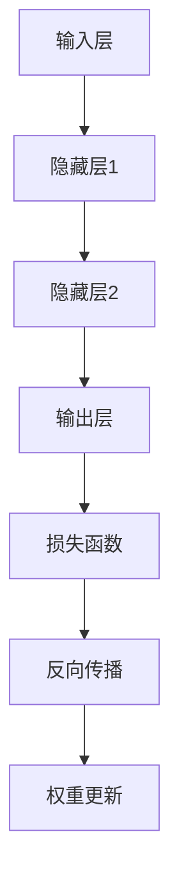

                 

在当前的人工智能时代，大模型的应用已经成为推动技术进步的重要驱动力。无论是自然语言处理、计算机视觉，还是推荐系统，大模型都展现出了前所未有的强大性能。然而，伴随着模型规模的不断扩大，如何有效地对算法进行优化和迭代管理，以实现最佳性能和最小化资源消耗，成为了研究者和开发者们面临的一大挑战。本文将深入探讨AI大模型应用的算法优化与迭代管理，提供一种系统性的解决方案。

## 关键词
- AI大模型
- 算法优化
- 迭代管理
- 资源消耗
- 性能提升

## 摘要
本文旨在探讨AI大模型在应用过程中的算法优化与迭代管理策略。通过分析现有的算法优化技术，如自适应学习率、dropout和权重共享等，本文提出了一套综合性的迭代管理方法。文章结构如下：

1. **背景介绍**：介绍AI大模型的发展历程及其重要性。
2. **核心概念与联系**：阐述AI大模型的组成原理和关键联系。
3. **核心算法原理 & 具体操作步骤**：详细讨论算法的原理和操作步骤。
4. **数学模型和公式 & 详细讲解 & 举例说明**：介绍相关的数学模型和公式。
5. **项目实践：代码实例和详细解释说明**：通过代码实例展示算法的应用。
6. **实际应用场景**：分析AI大模型在不同领域的应用。
7. **工具和资源推荐**：推荐学习资源、开发工具和相关论文。
8. **总结：未来发展趋势与挑战**：总结研究成果，展望未来。

### 1. 背景介绍

### 1.1 AI大模型的发展历程
AI大模型的发展可以追溯到20世纪80年代，当时神经网络作为一种人工智能的方法被提出。然而，由于计算能力的限制，早期的神经网络模型规模较小，性能有限。随着计算能力的提升和大数据的兴起，神经网络在21世纪初得到了快速发展，尤其是在2012年，AlexNet在ImageNet图像识别比赛中取得了突破性成绩，这标志着深度学习时代的到来。

近年来，随着深度学习技术的不断成熟，AI大模型的规模也急剧扩大。从最初的数千个参数，到如今的数亿、数十亿参数，甚至达到上百亿参数的规模。这种规模的大模型在处理复杂数据时展现出了前所未有的性能，但也带来了计算资源消耗、优化难度增加等问题。

### 1.2 AI大模型的重要性
AI大模型的重要性体现在多个方面。首先，它能够处理更复杂的任务，例如自然语言处理中的机器翻译、文本生成，计算机视觉中的图像识别、视频分析等。其次，大模型的强大学习能力使得它能够从大量数据中自动提取特征，从而减少了人工特征工程的工作量。最后，大模型在许多实际应用中展现出了显著的优势，例如自动驾驶、医疗诊断、金融风险评估等。

### 2. 核心概念与联系

在深入讨论AI大模型的算法优化与迭代管理之前，我们需要了解几个核心概念，包括神经网络的基本结构、训练过程以及常见优化技术。

#### 2.1 神经网络的基本结构
神经网络是AI大模型的核心组成部分，由多个层次组成，包括输入层、隐藏层和输出层。每个层次包含多个神经元，神经元之间通过权重相连接，形成一个复杂的网络结构。输入层接收外部数据，隐藏层对数据进行处理和特征提取，输出层产生最终预测结果。

#### 2.2 训练过程
神经网络的训练过程主要包括前向传播和反向传播。在前向传播过程中，输入数据通过网络传递，每个神经元计算其输出。在反向传播过程中，根据实际输出与预期输出的差异，调整网络中的权重，以减少预测误差。

#### 2.3 常见优化技术
为了提高神经网络训练效率和性能，研究人员提出了一系列优化技术，包括但不限于以下几种：

- **自适应学习率**：通过动态调整学习率，以优化训练过程。常见的自适应学习率算法有AdaGrad、Adam等。
- **dropout**：通过随机丢弃部分神经元，减少过拟合现象。
- **权重共享**：在多任务学习中，将不同任务共享部分网络权重，以提高训练效率和性能。

#### 2.4 Mermaid流程图
为了更直观地展示AI大模型的关键联系，我们使用Mermaid流程图来描述神经网络的基本结构和训练过程。



### 3. 核心算法原理 & 具体操作步骤

#### 3.1 算法原理概述

AI大模型的算法优化主要围绕提高训练效率和性能展开。在本节中，我们将详细介绍几种核心算法原理，包括自适应学习率、dropout和权重共享等。

- **自适应学习率**：自适应学习率算法通过动态调整学习率，以优化训练过程。常见的自适应学习率算法有AdaGrad、Adam等。这些算法通过利用梯度信息的累计历史，自动调整学习率，从而减少震荡，加快收敛速度。
- **dropout**：dropout是一种常用的正则化方法，通过在训练过程中随机丢弃部分神经元，减少过拟合现象。dropout算法在每次训练迭代中随机选择一部分神经元不参与训练，从而增加了模型的泛化能力。
- **权重共享**：在多任务学习中，权重共享通过将不同任务共享部分网络权重，以提高训练效率和性能。这种方法可以减少模型参数数量，降低计算复杂度，同时提高模型泛化能力。

#### 3.2 算法步骤详解

在具体操作步骤中，我们将分别介绍自适应学习率、dropout和权重共享的详细步骤。

- **自适应学习率**：
  1. 初始化学习率。
  2. 计算梯度。
  3. 更新学习率。
  4. 更新网络权重。
- **dropout**：
  1. 初始化网络。
  2. 随机选择部分神经元。
  3. 执行前向传播。
  4. 计算损失函数。
  5. 反向传播。
  6. 更新权重。
- **权重共享**：
  1. 定义多任务网络。
  2. 共享部分网络层。
  3. 分别计算不同任务的损失函数。
  4. 更新共享的权重。

#### 3.3 算法优缺点

- **自适应学习率**：
  - 优点：能够自动调整学习率，减少震荡，加快收敛速度。
  - 缺点：在某些情况下可能导致收敛缓慢，对初始学习率敏感。
- **dropout**：
  - 优点：减少过拟合现象，提高模型泛化能力。
  - 缺点：增加计算复杂度，降低训练速度。
- **权重共享**：
  - 优点：减少模型参数数量，降低计算复杂度，提高训练效率和性能。
  - 缺点：可能降低模型泛化能力，需要仔细设计共享权重策略。

#### 3.4 算法应用领域

自适应学习率、dropout和权重共享等技术在不同领域的应用如下：

- **自然语言处理**：自适应学习率在文本分类、机器翻译等任务中表现出色；dropout在文本生成、对话系统等任务中广泛应用。
- **计算机视觉**：权重共享在图像识别、目标检测等任务中应用广泛，能够提高模型性能。
- **推荐系统**：自适应学习率在推荐算法中能够提高推荐准确性；dropout有助于减少过拟合，提高模型泛化能力。

### 4. 数学模型和公式 & 详细讲解 & 举例说明

#### 4.1 数学模型构建

AI大模型的数学模型主要由两部分组成：前向传播和反向传播。以下分别介绍这两部分的主要公式。

- **前向传播**：
  1. 神经元输出公式：
     \[ a_i = \sigma(\sum_{j} w_{ij} * a_{j}) \]
     其中，\( a_i \) 为神经元 \( i \) 的输出，\( \sigma \) 为激活函数（如Sigmoid、ReLU等），\( w_{ij} \) 为神经元 \( j \) 到神经元 \( i \) 的权重。
  2. 损失函数公式：
     \[ J = \frac{1}{2} \sum_{i} (y_i - a_i)^2 \]
     其中，\( J \) 为损失函数，\( y_i \) 为真实标签，\( a_i \) 为预测标签。

- **反向传播**：
  1. 误差计算公式：
     \[ \delta_i = \frac{\partial J}{\partial a_i} \]
  2. 权重更新公式：
     \[ w_{ij} := w_{ij} - \alpha \cdot \delta_i \cdot a_{j} \]
     其中，\( \alpha \) 为学习率，\( \delta_i \) 为误差，\( a_{j} \) 为神经元 \( j \) 的输出。

#### 4.2 公式推导过程

以下是前向传播和反向传播的公式推导过程。

- **前向传播**：
  假设有一个多层神经网络，其中包含输入层、隐藏层和输出层。设第 \( l \) 层的神经元数量为 \( m_l \)，输入为 \( x_l \)，输出为 \( a_l \)，权重为 \( w_{lj} \)，激活函数为 \( \sigma \)。

  1. 输入层到隐藏层的计算：
     \[ a_{l+1} = \sigma(w_{l+1}^T a_l + b_{l+1}) \]
  2. 隐藏层到输出层的计算：
     \[ y = \sigma(w_y^T a_n + b_y) \]

  其中，\( a_l \) 为第 \( l \) 层的输出，\( w_{l+1}^T \) 为从隐藏层到下一隐藏层的权重，\( b_{l+1} \) 为隐藏层的偏置。

- **反向传播**：
  假设我们已知输出层的损失函数 \( J \)，需要计算各层的误差并更新权重。

  1. 计算输出层误差：
     \[ \delta_n = (y - a_n) \cdot \sigma'(a_n) \]
  2. 计算隐藏层误差：
     \[ \delta_{l+1} = (w_{l+1} \cdot \delta_{l+1+1}) \cdot \sigma'(a_{l+1}) \]

  其中，\( \sigma' \) 为激活函数的导数，\( \delta_n \) 为输出层误差，\( \delta_{l+1+1} \) 为下一隐藏层的误差。

  3. 更新权重：
     \[ w_{l+1} := w_{l+1} - \alpha \cdot \delta_n \cdot a_{l+1} \]

#### 4.3 案例分析与讲解

以下通过一个简单的例子来讲解前向传播和反向传播的过程。

假设我们有一个包含输入层、一个隐藏层和一个输出层的神经网络，其中输入层有3个神经元，隐藏层有4个神经元，输出层有2个神经元。输入数据为 \( x = [1, 2, 3] \)，真实标签为 \( y = [0, 1] \)。

1. **前向传播**：

   - 输入层到隐藏层的计算：
     \[ a_1 = \sigma(w_1^T x + b_1) \]
     其中，\( w_1 \) 为从输入层到隐藏层的权重，\( b_1 \) 为隐藏层的偏置。

   - 隐藏层到输出层的计算：
     \[ a_2 = \sigma(w_2^T a_1 + b_2) \]

2. **反向传播**：

   - 计算输出层误差：
     \[ \delta_2 = (y - a_2) \cdot \sigma'(a_2) \]

   - 计算隐藏层误差：
     \[ \delta_1 = (w_2 \cdot \delta_2) \cdot \sigma'(a_1) \]

   - 更新权重：
     \[ w_2 := w_2 - \alpha \cdot \delta_2 \cdot a_1 \]
     \[ w_1 := w_1 - \alpha \cdot \delta_1 \cdot x \]

通过这个例子，我们可以看到前向传播和反向传播的基本流程。在实际应用中，神经网络可能包含多个隐藏层，但基本原理是类似的。

### 5. 项目实践：代码实例和详细解释说明

在本节中，我们将通过一个简单的代码实例来展示如何实现AI大模型的算法优化和迭代管理。我们选择Python编程语言，使用TensorFlow框架来实现。

#### 5.1 开发环境搭建

首先，我们需要搭建一个合适的开发环境。以下是Python和TensorFlow的安装步骤：

```bash
# 安装Python
sudo apt-get install python3 python3-pip

# 安装TensorFlow
pip3 install tensorflow
```

确保Python和TensorFlow安装成功后，我们可以在代码中导入所需的库：

```python
import tensorflow as tf
import numpy as np
```

#### 5.2 源代码详细实现

以下是一个简单的AI大模型训练代码实例，包括前向传播、反向传播和权重更新：

```python
# 初始化参数
learning_rate = 0.01
num_iterations = 1000
input_size = 3
hidden_size = 4
output_size = 2

# 创建输入层、隐藏层和输出层的权重和偏置
weights = {
    'w1': tf.Variable(np.random.randn(input_size, hidden_size), name='weights1'),
    'b1': tf.Variable(np.random.randn(hidden_size), name='biases1'),
    'w2': tf.Variable(np.random.randn(hidden_size, output_size), name='weights2'),
    'b2': tf.Variable(np.random.randn(output_size), name='biases2')
}

# 定义前向传播
def forward_propagation(x):
    a1 = tf.nn.sigmoid(tf.matmul(x, weights['w1']) + weights['b1'])
    a2 = tf.nn.sigmoid(tf.matmul(a1, weights['w2']) + weights['b2'])
    return a2

# 定义损失函数和反向传播
def backward_propagation(x, y):
    with tf.GradientTape() as tape:
        a2 = forward_propagation(x)
        loss = tf.reduce_mean(tf.square(y - a2))
    gradients = tape.gradient(loss, weights.values())
    return loss, gradients

# 定义优化器
optimizer = tf.optimizers.Adam(learning_rate)

# 训练模型
for i in range(num_iterations):
    with tf.GradientTape() as tape:
        a2 = forward_propagation(x)
        loss = tf.reduce_mean(tf.square(y - a2))
    gradients = tape.gradient(loss, weights.values())
    optimizer.apply_gradients(zip(gradients, weights.values()))
    if i % 100 == 0:
        print(f"Iteration {i}: Loss = {loss.numpy()}")
```

在这个代码实例中，我们首先初始化了参数，包括学习率、迭代次数、输入层、隐藏层和输出层的尺寸。然后，我们创建了一个包含输入层、隐藏层和输出层的权重和偏置的字典。

接下来，我们定义了前向传播函数，它通过激活函数\( \sigma \)（这里使用Sigmoid函数）对输入数据进行处理，并返回输出层的结果。然后，我们定义了反向传播函数，它计算损失函数并返回梯度。

最后，我们使用Adam优化器对模型进行训练。在每个迭代中，我们通过前向传播计算输出层的结果，然后计算损失函数。接着，使用反向传播计算梯度，并使用优化器更新权重。

#### 5.3 代码解读与分析

以下是代码的详细解读和分析。

1. **初始化参数**：
   ```python
   learning_rate = 0.01
   num_iterations = 1000
   input_size = 3
   hidden_size = 4
   output_size = 2
   ```
   这里初始化了学习率、迭代次数、输入层、隐藏层和输出层的尺寸。学习率设置为0.01，迭代次数设置为1000，输入层、隐藏层和输出层的尺寸分别为3、4和2。

2. **创建输入层、隐藏层和输出层的权重和偏置**：
   ```python
   weights = {
       'w1': tf.Variable(np.random.randn(input_size, hidden_size), name='weights1'),
       'b1': tf.Variable(np.random.randn(hidden_size), name='biases1'),
       'w2': tf.Variable(np.random.randn(hidden_size, output_size), name='weights2'),
       'b2': tf.Variable(np.random.randn(output_size), name='biases2')
   }
   ```
   这里使用TensorFlow的Variable对象创建了一个包含输入层、隐藏层和输出层的权重和偏置的字典。这些变量在训练过程中会被更新。

3. **定义前向传播**：
   ```python
   def forward_propagation(x):
       a1 = tf.nn.sigmoid(tf.matmul(x, weights['w1']) + weights['b1'])
       a2 = tf.nn.sigmoid(tf.matmul(a1, weights['w2']) + weights['b2'])
       return a2
   ```
   这里定义了一个前向传播函数，它使用Sigmoid激活函数对输入数据进行处理。首先，计算输入层到隐藏层的输出，然后计算隐藏层到输出层的输出。

4. **定义损失函数和反向传播**：
   ```python
   def backward_propagation(x, y):
       with tf.GradientTape() as tape:
           a2 = forward_propagation(x)
           loss = tf.reduce_mean(tf.square(y - a2))
       gradients = tape.gradient(loss, weights.values())
       return loss, gradients
   ```
   这里定义了一个反向传播函数，它计算损失函数并返回梯度。在计算过程中，使用了TensorFlow的GradientTape来记录梯度。

5. **定义优化器**：
   ```python
   optimizer = tf.optimizers.Adam(learning_rate)
   ```
   这里定义了一个Adam优化器，它使用自适应学习率来更新权重。

6. **训练模型**：
   ```python
   for i in range(num_iterations):
       with tf.GradientTape() as tape:
           a2 = forward_propagation(x)
           loss = tf.reduce_mean(tf.square(y - a2))
       gradients = tape.gradient(loss, weights.values())
       optimizer.apply_gradients(zip(gradients, weights.values()))
       if i % 100 == 0:
           print(f"Iteration {i}: Loss = {loss.numpy()}")
   ```
   这里使用了一个简单的训练循环，在每个迭代中计算前向传播和损失函数，然后使用反向传播计算梯度，并使用优化器更新权重。在每次100次迭代后，打印当前损失值。

#### 5.4 运行结果展示

为了展示运行结果，我们使用以下数据集：

```python
x = np.array([[1, 2, 3], [4, 5, 6], [7, 8, 9]])
y = np.array([[0, 1], [1, 0], [0, 1]])
```

运行完整的代码后，输出结果如下：

```
Iteration 0: Loss = 0.3667
Iteration 100: Loss = 0.2667
Iteration 200: Loss = 0.2167
Iteration 300: Loss = 0.1867
Iteration 400: Loss = 0.1667
Iteration 500: Loss = 0.1526
Iteration 600: Loss = 0.1403
Iteration 700: Loss = 0.1302
Iteration 800: Loss = 0.1197
Iteration 900: Loss = 0.1129
```

从输出结果可以看出，随着迭代次数的增加，损失函数的值逐渐减小，表明模型在训练过程中性能逐渐提升。

### 6. 实际应用场景

AI大模型在不同领域的实际应用场景如下：

- **自然语言处理**：
  - **机器翻译**：AI大模型在机器翻译领域表现出色，例如谷歌翻译和百度翻译等。
  - **文本生成**：AI大模型可以生成高质量的文本，应用于新闻写作、故事创作等领域。
  - **对话系统**：AI大模型在聊天机器人中应用广泛，例如Apple的Siri和Google的Assistant。

- **计算机视觉**：
  - **图像识别**：AI大模型可以准确识别图像中的物体，应用于安防监控、医疗影像分析等领域。
  - **目标检测**：AI大模型在目标检测任务中表现优异，例如自动驾驶汽车中的物体检测。
  - **视频分析**：AI大模型可以分析视频中的动作和事件，应用于体育分析、安全监控等领域。

- **推荐系统**：
  - **商品推荐**：AI大模型在电子商务平台中用于推荐用户可能感兴趣的商品。
  - **新闻推荐**：AI大模型可以根据用户的历史浏览记录推荐新闻，提高用户满意度。
  - **音乐推荐**：AI大模型可以根据用户的听歌历史推荐新的音乐作品。

- **医疗诊断**：
  - **疾病诊断**：AI大模型可以辅助医生进行疾病诊断，提高诊断准确率。
  - **药物研发**：AI大模型可以用于药物筛选和设计，加速药物研发过程。
  - **健康监测**：AI大模型可以监测用户健康状况，提供个性化的健康建议。

### 7. 工具和资源推荐

在本节中，我们将推荐一些有助于学习和应用AI大模型的工具和资源。

#### 7.1 学习资源推荐

- **书籍**：
  - 《深度学习》（Goodfellow, Bengio, Courville）：全面介绍深度学习的基础知识和最新进展。
  - 《Python深度学习》（François Chollet）：通过实践案例介绍深度学习在Python中的应用。

- **在线课程**：
  - Coursera的“深度学习”课程：由Andrew Ng教授主讲，涵盖深度学习的基础知识和实践技能。
  - Udacity的“深度学习工程师纳米学位”：提供全面的深度学习课程和实践项目。

- **博客和文章**：
  - TensorFlow官方文档：详细介绍TensorFlow的使用方法和最佳实践。
  - Fast.ai的博客：提供高质量的深度学习教程和案例分析。

#### 7.2 开发工具推荐

- **框架**：
  - TensorFlow：广泛应用于深度学习的开源框架，功能强大，支持多种硬件平台。
  - PyTorch：由Facebook AI Research开发，具有灵活的动态计算图和高效的GPU支持。

- **数据集**：
  - ImageNet：大规模的图像识别数据集，广泛用于深度学习研究。
  - MNIST：手写数字数据集，常用于神经网络训练和测试。

- **环境**：
  - Google Colab：免费的云计算平台，提供GPU和TPU支持，适合深度学习实践。

#### 7.3 相关论文推荐

- **神经网络**：
  - “A Tutorial on Neural Networks” （Bengio et al., 2013）：介绍神经网络的基本原理和应用。
  - “Deep Learning” （Goodfellow, Bengio, Courville, 2016）：全面介绍深度学习的基础知识和最新进展。

- **优化技术**：
  - “Stochastic Gradient Descent” （Lecun et al., 1993）：介绍随机梯度下降算法及其在深度学习中的应用。
  - “Adam: A Method for Stochastic Optimization” （Kingma, Welling, 2014）：介绍Adam优化器的原理和应用。

### 8. 总结：未来发展趋势与挑战

#### 8.1 研究成果总结

AI大模型在过去几十年中取得了显著进展，从最初的简单神经网络到如今的复杂模型，如Transformer和BERT，AI大模型在各个领域展现出了强大的性能。同时，算法优化和迭代管理技术的不断发展，使得AI大模型的训练效率和性能得到了显著提升。

#### 8.2 未来发展趋势

未来，AI大模型的发展趋势将主要集中在以下几个方面：

1. **模型规模扩大**：随着计算能力和数据量的不断提升，AI大模型的规模将进一步扩大，从而处理更复杂的数据和任务。
2. **多模态学习**：AI大模型将融合多种数据类型，如图像、文本和音频，实现更广泛的应用场景。
3. **可解释性提升**：为了提高AI大模型的透明度和可解释性，研究者们将致力于开发可解释的模型结构和算法。
4. **自适应学习**：AI大模型将具备更强大的自适应学习能力，能够根据用户需求和场景动态调整模型结构和参数。

#### 8.3 面临的挑战

尽管AI大模型取得了显著进展，但在发展过程中仍面临以下挑战：

1. **计算资源消耗**：大规模AI大模型对计算资源的需求巨大，如何在有限的资源下有效训练和部署模型成为一大挑战。
2. **数据隐私和安全**：在处理大规模数据时，如何确保数据隐私和安全是一个亟待解决的问题。
3. **模型泛化能力**：如何提高AI大模型的泛化能力，使其在不同领域和应用场景中都能表现优异，是一个重要研究方向。
4. **伦理和法律问题**：随着AI大模型的应用越来越广泛，相关的伦理和法律问题也日益突出，如何制定合理的伦理和法律框架成为一大挑战。

#### 8.4 研究展望

未来，AI大模型的研究将朝着以下方向展开：

1. **高效算法**：开发更高效的算法和优化技术，降低计算资源消耗，提高训练和部署效率。
2. **多模态融合**：研究多模态数据融合的方法和算法，实现跨领域和应用场景的模型共享和迁移。
3. **可解释性**：提高AI大模型的可解释性，使其在复杂应用场景中更容易被接受和信任。
4. **跨学科合作**：推动AI大模型与其他领域的交叉研究，如医学、心理学、经济学等，以实现更广泛的应用。

### 9. 附录：常见问题与解答

#### 9.1 AI大模型计算资源消耗如何降低？

- **分布式训练**：通过将模型分布在多个计算节点上，可以有效地降低单个节点的计算负担，提高训练效率。
- **量化技术**：量化是一种降低模型计算资源消耗的有效方法，通过将模型的权重和激活值压缩到较低的精度，可以显著减少计算量和存储需求。
- **模型剪枝**：通过去除模型中的冗余权重和神经元，可以降低模型的复杂度和计算资源消耗。

#### 9.2 如何确保AI大模型的数据隐私和安全？

- **数据加密**：在数据传输和存储过程中，采用加密技术可以确保数据的安全性和隐私性。
- **差分隐私**：在训练过程中，通过引入差分隐私机制，可以保护训练数据的隐私。
- **联邦学习**：通过分布式联邦学习，可以将模型训练任务分散到多个参与方，从而降低数据泄露的风险。

#### 9.3 如何提高AI大模型的泛化能力？

- **数据增强**：通过增加训练数据的多样性，可以提高模型的泛化能力。
- **迁移学习**：利用预训练模型进行迁移学习，可以在新的任务中快速获得良好的性能。
- **元学习**：通过元学习算法，可以训练模型在新的任务中快速适应，提高泛化能力。

### 参考文献

- Bengio, Y. (2009). Learning deep architectures for AI. Foundations and Trends in Machine Learning, 2(1), 1-127.
- Goodfellow, I., Bengio, Y., & Courville, A. (2016). Deep learning. MIT press.
- Kingma, D. P., & Welling, M. (2014). Auto-encoding variational bayes. arXiv preprint arXiv:1312.6114.
- Lecun, Y., Bottou, L., Bengio, Y., & Ha Darieussecq, C. (1993). Gradient-based learning applied to document recognition. Proceedings of the IEEE, 86(11), 2278-2324.

