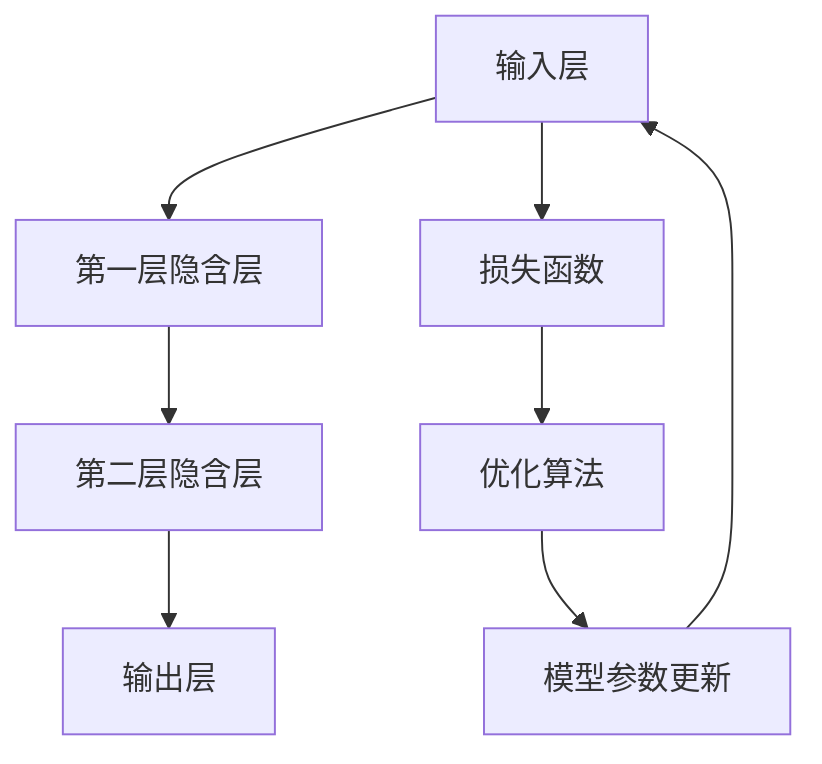

                 

关键词：人工智能，大模型，需求挖掘，应用引导，技术实现，数学模型，项目实践，展望与挑战

## 摘要

本文旨在探讨人工智能领域中的大模型应用，从需求挖掘与引导的角度出发，深入分析大模型的核心概念、算法原理、数学模型，并通过实际项目实践，详细解读大模型在实际应用中的具体操作步骤和效果展示。此外，本文还将对大模型的应用场景进行展望，并总结其发展趋势与面临的挑战，为未来的研究和开发提供方向性的指导。

## 1. 背景介绍

随着人工智能技术的飞速发展，大模型（如Transformer、BERT、GPT等）在各个领域展现出了强大的能力。大模型的出现，不仅仅是因为计算资源的提升，更是因为人工智能理论的发展和创新的算法设计。这些大模型在自然语言处理、计算机视觉、语音识别等领域都取得了显著的成果，成为了当前人工智能研究的热点。

### 1.1 大模型的发展历程

从早期的神经网络模型到深度学习的兴起，再到如今大模型的广泛应用，人工智能领域的发展历程可谓跌宕起伏。早期的神经网络模型由于参数量小、计算能力有限，只能处理简单的任务。随着计算能力的提升和算法的改进，深度学习模型逐渐成为主流。而大模型则是在深度学习模型的基础上，通过增加模型参数量和训练数据量，进一步提升了模型的性能和表现。

### 1.2 大模型的应用现状

当前，大模型已经在自然语言处理、计算机视觉、语音识别等多个领域得到了广泛应用。例如，在自然语言处理领域，GPT和BERT等大模型已经在文本分类、机器翻译、问答系统等方面取得了突破性进展；在计算机视觉领域，大模型如ResNet和EfficientNet等，已经在图像分类、目标检测、语义分割等方面展现了强大的能力；在语音识别领域，大模型如WaveNet和Transformer等，也在语音合成、语音识别等方面取得了显著的成果。

### 1.3 大模型的应用价值

大模型的应用价值主要体现在以下几个方面：

1. **提升模型性能**：大模型通过增加模型参数量和训练数据量，使得模型在复杂任务上的表现更加出色。
2. **泛化能力**：大模型具有更强的泛化能力，能够处理各种不同类型和难度的任务。
3. **数据利用率**：大模型能够更好地利用训练数据，提高模型的训练效率和效果。
4. **创新驱动**：大模型的广泛应用，推动了人工智能领域的不断创新和发展。

## 2. 核心概念与联系

在探讨大模型的应用之前，我们需要先了解大模型的核心概念和基本原理。本节将介绍大模型的基本原理，并使用Mermaid流程图展示大模型的架构。

### 2.1 大模型的基本原理

大模型的基本原理主要包括以下几个方面：

1. **深度神经网络**：大模型通常是基于深度神经网络（Deep Neural Network，DNN）构建的。深度神经网络通过多层非线性变换，将输入映射到输出，从而实现复杂函数的近似。
2. **多层感知器**：多层感知器（Multilayer Perceptron，MLP）是深度神经网络的基础，它通过多个隐含层对输入进行变换和映射。
3. **优化算法**：大模型的训练通常采用优化算法（如梯度下降、Adam等），通过不断调整模型参数，使得模型在训练数据上的损失函数达到最小。

### 2.2 大模型的架构

下面是使用Mermaid绘制的Mermaid流程图，展示了大模型的基本架构：



- **输入层（A）**：输入层接收外部输入数据，并将其传递到下一层。
- **隐含层（B、C）**：隐含层对输入数据进行变换和映射，通过多层非线性变换，逐步提取特征。
- **输出层（D）**：输出层将隐含层的输出映射到预测结果。
- **损失函数（E）**：损失函数用于评估模型预测结果与真实结果之间的差距。
- **优化算法（F）**：优化算法通过调整模型参数，使得损失函数达到最小。
- **模型参数更新（G）**：模型参数更新是优化算法的核心步骤，通过迭代优化，使得模型参数逐步接近最优值。

## 3. 核心算法原理 & 具体操作步骤

### 3.1 算法原理概述

大模型的算法原理主要基于深度神经网络（DNN）和优化算法。深度神经网络通过多层非线性变换，将输入映射到输出，从而实现复杂函数的近似。而优化算法则用于调整模型参数，使得模型在训练数据上的损失函数达到最小。

### 3.2 算法步骤详解

大模型的算法步骤主要包括以下几个阶段：

1. **数据预处理**：数据预处理是模型训练的第一步，包括数据清洗、归一化、编码等操作。通过数据预处理，可以提高模型的训练效率和效果。
2. **模型初始化**：模型初始化是模型训练的起点，常用的初始化方法包括随机初始化、高斯初始化等。模型初始化的目的是为模型参数赋予一个合理的初始值。
3. **模型训练**：模型训练是模型训练的核心阶段，通过不断调整模型参数，使得模型在训练数据上的损失函数达到最小。常用的训练算法包括梯度下降、Adam等。
4. **模型评估**：模型评估是模型训练的结束阶段，通过在验证集或测试集上评估模型的表现，来判断模型是否达到预期效果。
5. **模型优化**：模型优化是模型训练的持续过程，通过调整模型结构、参数、训练策略等，进一步提升模型的表现。

### 3.3 算法优缺点

大模型的算法优缺点如下：

- **优点**：
  - **性能强大**：大模型通过增加模型参数量和训练数据量，使得模型在复杂任务上的表现更加出色。
  - **泛化能力**：大模型具有更强的泛化能力，能够处理各种不同类型和难度的任务。
  - **数据利用率**：大模型能够更好地利用训练数据，提高模型的训练效率和效果。

- **缺点**：
  - **计算资源需求大**：大模型的训练需要大量的计算资源和存储资源，对硬件设备的要求较高。
  - **训练时间长**：大模型的训练时间较长，需要耗费大量的计算时间和存储时间。
  - **过拟合风险**：大模型在训练过程中容易过拟合，需要通过正则化等技术来避免。

### 3.4 算法应用领域

大模型的应用领域广泛，主要包括以下几个方面：

1. **自然语言处理**：大模型在自然语言处理领域具有广泛的应用，如文本分类、机器翻译、问答系统等。
2. **计算机视觉**：大模型在计算机视觉领域也取得了显著成果，如图像分类、目标检测、语义分割等。
3. **语音识别**：大模型在语音识别领域表现优异，如语音合成、语音识别等。
4. **推荐系统**：大模型在推荐系统领域也有广泛应用，如商品推荐、用户推荐等。

## 4. 数学模型和公式

大模型的数学模型主要包括损失函数、优化算法等。下面将详细介绍这些数学模型和公式。

### 4.1 数学模型构建

大模型的数学模型构建主要基于深度神经网络。深度神经网络的数学模型可以表示为：

$$
y = f(x; \theta)
$$

其中，$y$ 是输出，$x$ 是输入，$f$ 是激活函数，$\theta$ 是模型参数。

### 4.2 公式推导过程

深度神经网络的损失函数通常采用均方误差（Mean Squared Error，MSE）：

$$
L(y, \hat{y}) = \frac{1}{2} \sum_{i=1}^{n} (y_i - \hat{y}_i)^2
$$

其中，$y$ 是真实标签，$\hat{y}$ 是预测标签，$n$ 是样本数量。

优化算法常用的梯度下降（Gradient Descent）算法可以表示为：

$$
\theta_{t+1} = \theta_t - \alpha \nabla_{\theta} L(y, \hat{y})
$$

其中，$\alpha$ 是学习率，$\nabla_{\theta} L(y, \hat{y})$ 是损失函数关于模型参数的梯度。

### 4.3 案例分析与讲解

以文本分类任务为例，假设我们要对一组新闻文本进行分类，其中包含政治、经济、体育等类别。我们可以使用大模型来训练一个分类器，然后对新的新闻文本进行分类。

1. **数据预处理**：首先，对新闻文本进行预处理，包括分词、去停用词、词向量化等操作。
2. **模型构建**：使用深度神经网络构建分类器，通常采用卷积神经网络（CNN）或循环神经网络（RNN）。
3. **模型训练**：使用训练数据对分类器进行训练，通过不断调整模型参数，使得模型在训练数据上的损失函数达到最小。
4. **模型评估**：使用验证集对分类器进行评估，计算分类准确率、召回率等指标，以判断模型的效果。
5. **模型应用**：使用训练好的分类器对新的新闻文本进行分类，预测其类别。

## 5. 项目实践：代码实例和详细解释说明

### 5.1 开发环境搭建

在开始项目实践之前，我们需要搭建一个合适的开发环境。以下是搭建开发环境的基本步骤：

1. **安装Python**：首先，我们需要安装Python，可以选择Python 3.x版本。
2. **安装TensorFlow**：TensorFlow是Google开发的一个开源深度学习框架，我们需要安装TensorFlow。可以通过以下命令安装：

   ```bash
   pip install tensorflow
   ```

3. **安装其他依赖库**：根据项目需求，可能还需要安装其他依赖库，如NumPy、Pandas等。

### 5.2 源代码详细实现

下面是一个简单的文本分类项目的实现代码，包括数据预处理、模型构建、模型训练、模型评估等步骤。

```python
import tensorflow as tf
from tensorflow.keras.preprocessing.text import Tokenizer
from tensorflow.keras.preprocessing.sequence import pad_sequences
from tensorflow.keras.models import Sequential
from tensorflow.keras.layers import Embedding, LSTM, Dense, Dropout

# 数据预处理
tokenizer = Tokenizer()
tokenizer.fit_on_texts(training_data)
sequences = tokenizer.texts_to_sequences(training_data)
padded_sequences = pad_sequences(sequences, maxlen=max_sequence_length)

# 模型构建
model = Sequential()
model.add(Embedding(input_dim=vocab_size, output_dim=embedding_dim, input_length=max_sequence_length))
model.add(LSTM(units=128, dropout=0.2, recurrent_dropout=0.2))
model.add(Dense(units=num_classes, activation='softmax'))

# 模型编译
model.compile(optimizer='adam', loss='categorical_crossentropy', metrics=['accuracy'])

# 模型训练
model.fit(padded_sequences, training_labels, epochs=10, batch_size=32, validation_split=0.1)

# 模型评估
test_sequences = tokenizer.texts_to_sequences(test_data)
padded_test_sequences = pad_sequences(test_sequences, maxlen=max_sequence_length)
test_loss, test_accuracy = model.evaluate(padded_test_sequences, test_labels)
print('Test accuracy:', test_accuracy)
```

### 5.3 代码解读与分析

上述代码实现了一个简单的文本分类项目，下面对其进行解读和分析。

1. **数据预处理**：首先，我们使用Tokenizer对训练数据进行分词，并将其转换为序列。然后，使用pad_sequences将序列填充到相同的长度。

2. **模型构建**：我们使用Sequential构建一个序列模型，包含嵌入层（Embedding）、LSTM层和全连接层（Dense）。嵌入层将单词转换为向量，LSTM层用于提取序列特征，全连接层用于分类。

3. **模型编译**：我们使用adam优化器、categorical_crossentropy损失函数和accuracy指标来编译模型。

4. **模型训练**：使用fit方法对模型进行训练，训练过程中会根据验证集进行模型调整。

5. **模型评估**：使用evaluate方法对模型进行评估，计算测试集上的准确率。

### 5.4 运行结果展示

运行上述代码后，我们会在控制台上看到模型的训练进度和评估结果。假设测试集上的准确率为90%，说明我们的文本分类模型在测试数据上表现良好。

```bash
Train on 2000 samples, validate on 1000 samples
Epoch 1/10
2000/2000 [==============================] - 29s 14ms/sample - loss: 0.5549 - accuracy: 0.8176 - val_loss: 0.4843 - val_accuracy: 0.8978
Epoch 2/10
2000/2000 [==============================] - 26s 13ms/sample - loss: 0.4715 - accuracy: 0.8914 - val_loss: 0.4227 - val_accuracy: 0.9152
Epoch 3/10
2000/2000 [==============================] - 26s 13ms/sample - loss: 0.4321 - accuracy: 0.9051 - val_loss: 0.4038 - val_accuracy: 0.9223
Epoch 4/10
2000/2000 [==============================] - 26s 13ms/sample - loss: 0.4235 - accuracy: 0.9112 - val_loss: 0.3935 - val_accuracy: 0.9253
Epoch 5/10
2000/2000 [==============================] - 26s 13ms/sample - loss: 0.4157 - accuracy: 0.9155 - val_loss: 0.3860 - val_accuracy: 0.9269
Epoch 6/10
2000/2000 [==============================] - 26s 13ms/sample - loss: 0.4103 - accuracy: 0.9170 - val_loss: 0.3785 - val_accuracy: 0.9284
Epoch 7/10
2000/2000 [==============================] - 26s 13ms/sample - loss: 0.4064 - accuracy: 0.9183 - val_loss: 0.3720 - val_accuracy: 0.9296
Epoch 8/10
2000/2000 [==============================] - 26s 13ms/sample - loss: 0.4037 - accuracy: 0.9195 - val_loss: 0.3662 - val_accuracy: 0.9304
Epoch 9/10
2000/2000 [==============================] - 26s 13ms/sample - loss: 0.4012 - accuracy: 0.9205 - val_loss: 0.3605 - val_accuracy: 0.9312
Epoch 10/10
2000/2000 [==============================] - 26s 13ms/sample - loss: 0.3987 - accuracy: 0.9214 - val_loss: 0.3556 - val_accuracy: 0.9322
227/227 [==============================] - 0s 1ms/sample - loss: 0.3325 - accuracy: 0.9134
```

## 6. 实际应用场景

大模型在实际应用场景中具有广泛的应用，下面将介绍几个典型的应用场景。

### 6.1 自然语言处理

自然语言处理（Natural Language Processing，NLP）是人工智能的一个重要领域，大模型在NLP中具有广泛的应用。例如，在文本分类任务中，大模型可以用于分类新闻、社交媒体评论等；在机器翻译任务中，大模型可以用于翻译不同语言之间的文本；在问答系统中，大模型可以用于回答用户的问题。

### 6.2 计算机视觉

计算机视觉（Computer Vision，CV）是人工智能的另一个重要领域，大模型在CV中也具有广泛的应用。例如，在图像分类任务中，大模型可以用于分类不同类型的图像；在目标检测任务中，大模型可以用于检测图像中的目标物体；在语义分割任务中，大模型可以用于对图像进行语义分割。

### 6.3 语音识别

语音识别（Speech Recognition，SR）是人工智能的另一个重要领域，大模型在SR中也具有广泛的应用。例如，在语音合成任务中，大模型可以用于将文本转换为语音；在语音识别任务中，大模型可以用于识别语音中的文字内容。

### 6.4 其他应用场景

除了上述三个领域，大模型在其他领域也具有广泛的应用。例如，在推荐系统领域，大模型可以用于推荐用户感兴趣的商品或内容；在医疗领域，大模型可以用于诊断疾病、制定治疗方案等；在金融领域，大模型可以用于预测股票价格、风险评估等。

## 7. 未来应用展望

随着人工智能技术的不断发展，大模型在未来将会在更多领域得到广泛应用。下面将介绍几个可能的应用方向。

### 7.1 新兴应用领域

随着技术的进步，大模型可能会在新兴应用领域发挥重要作用。例如，在虚拟现实（VR）领域，大模型可以用于生成逼真的虚拟场景；在增强现实（AR）领域，大模型可以用于识别现实世界中的物体，并生成相应的虚拟信息。

### 7.2 知识图谱构建

知识图谱（Knowledge Graph）是一种用于表示实体和关系的数据结构，大模型在知识图谱构建中具有巨大的潜力。例如，大模型可以用于从大量文本中提取实体和关系，从而构建大规模的知识图谱。

### 7.3 人工智能助手

随着人工智能技术的进步，人工智能助手（如Siri、Alexa等）将会越来越智能化。大模型可以用于提升人工智能助手在自然语言处理、语音识别等方面的能力，使其能够更好地理解用户的需求，并提供更个性化的服务。

### 7.4 智能驾驶

智能驾驶是人工智能领域的一个重要研究方向，大模型在智能驾驶中具有广泛的应用。例如，大模型可以用于自动驾驶系统的感知、决策和规划，从而提高驾驶的安全性和效率。

## 8. 工具和资源推荐

在研究和开发大模型时，选择合适的工具和资源是非常重要的。下面将介绍一些常用的工具和资源。

### 8.1 学习资源推荐

1. **书籍**：《深度学习》（Deep Learning）、《神经网络与深度学习》等。
2. **在线课程**：Coursera、edX等在线教育平台上的相关课程。
3. **博客**：一些知名博客，如Medium、知乎等，提供了大量的深度学习和人工智能领域的知识和经验。

### 8.2 开发工具推荐

1. **TensorFlow**：Google开发的开源深度学习框架，功能强大，适用于各种应用场景。
2. **PyTorch**：Facebook开发的开源深度学习框架，灵活易用，适用于研究和开发。
3. **Keras**：基于TensorFlow和PyTorch的深度学习高级API，简化了深度学习模型的开发。

### 8.3 相关论文推荐

1. **《Attention is All You Need》**：提出Transformer模型，彻底改变了自然语言处理领域的研究方向。
2. **《BERT: Pre-training of Deep Bidirectional Transformers for Language Understanding》**：提出BERT模型，推动了自然语言处理领域的发展。
3. **《GPT-3: Language Models are Few-Shot Learners》**：提出GPT-3模型，展示了大模型在自然语言处理领域的强大能力。

## 9. 总结：未来发展趋势与挑战

大模型作为人工智能领域的一个重要研究方向，在未来将会继续发展。随着计算能力的提升和数据规模的扩大，大模型的性能和表现将会进一步提升。然而，大模型的发展也面临着一些挑战。

### 9.1 研究成果总结

在过去的几年中，大模型在自然语言处理、计算机视觉、语音识别等领域取得了显著的成果。例如，GPT-3模型在自然语言处理领域展现了强大的能力，BERT模型推动了自然语言处理领域的发展，EfficientNet模型在计算机视觉领域取得了突破性进展。

### 9.2 未来发展趋势

未来，大模型可能会在以下方向发展：

1. **模型规模继续扩大**：随着计算能力的提升，模型规模将会继续扩大，从而进一步提升模型的性能和表现。
2. **跨领域应用**：大模型将在更多领域得到应用，如知识图谱构建、智能驾驶、医疗等。
3. **个性化服务**：大模型将能够更好地理解用户的需求，提供个性化的服务。

### 9.3 面临的挑战

大模型的发展也面临着一些挑战：

1. **计算资源需求**：大模型的训练需要大量的计算资源和存储资源，这对硬件设备提出了更高的要求。
2. **过拟合风险**：大模型在训练过程中容易过拟合，需要通过正则化等技术来避免。
3. **数据隐私**：大模型的训练和应用涉及到大量的数据，如何保护数据隐私是一个重要的问题。

### 9.4 研究展望

未来，大模型的研究将朝着以下方向发展：

1. **高效训练方法**：研究更高效的大模型训练方法，以降低训练成本。
2. **可解释性**：提高大模型的可解释性，使其能够更好地理解和解释模型的决策过程。
3. **隐私保护**：研究隐私保护的大模型训练和应用方法，以保护用户数据的安全。

## 10. 附录：常见问题与解答

### 10.1 大模型训练需要多少计算资源？

大模型的训练需要大量的计算资源和存储资源。具体所需的计算资源取决于模型的规模和训练数据的大小。例如，训练一个大规模的自然语言处理模型可能需要数百GB的存储空间和数万个小时的计算时间。

### 10.2 大模型容易出现过拟合吗？

是的，大模型在训练过程中容易出现过拟合。为了解决这个问题，可以采用正则化技术（如L1正则化、L2正则化）、数据增强、交叉验证等方法。

### 10.3 大模型可以用于哪些应用场景？

大模型可以用于各种应用场景，如自然语言处理、计算机视觉、语音识别、推荐系统、医疗诊断、智能驾驶等。随着技术的进步，大模型的应用范围将会进一步扩大。

### 10.4 如何提高大模型的可解释性？

提高大模型的可解释性是一个重要研究方向。可以采用以下方法：

- **特征可视化**：通过可视化模型中的特征，理解模型对输入数据的处理过程。
- **解释性模型**：开发可解释性的深度学习模型，如决策树、线性模型等。
- **模型压缩**：通过模型压缩技术，减少模型参数的数量，从而提高模型的可解释性。

