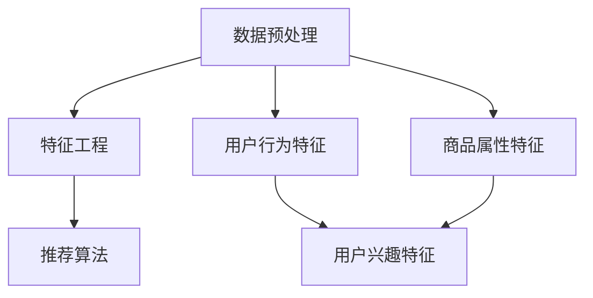

                 

关键词：电商搜索推荐、AI大模型、创新、变革、算法原理、数学模型、项目实践

> 摘要：本文从AI大模型的角度，深入探讨了电商搜索推荐领域的创新与变革。通过阐述核心概念和算法原理，详细讲解了数学模型和具体操作步骤，并结合实际项目实例进行分析，探讨了未来应用场景和挑战。

## 1. 背景介绍

随着互联网的快速发展，电商行业已经成为现代社会的重要组成部分。电商平台的搜索推荐系统是提高用户满意度、增加销售额的关键因素。传统的搜索推荐系统主要依赖于基于内容、协同过滤等算法，这些算法在一定程度上能够满足用户的需求，但面对海量数据和复杂用户行为时，往往存在准确性不高、推荐结果不够个性化等问题。

近年来，人工智能特别是AI大模型的快速发展为电商搜索推荐系统带来了新的机遇。AI大模型具有强大的数据处理和知识学习能力，能够从海量数据中挖掘用户行为特征，提供更加精准和个性化的推荐结果。因此，本文将从AI大模型视角出发，深入探讨电商搜索推荐领域的创新与变革。

## 2. 核心概念与联系

在探讨AI大模型视角下的电商搜索推荐之前，我们需要先了解几个核心概念，包括数据预处理、特征工程、推荐算法等，以及它们之间的联系。

### 2.1 数据预处理

数据预处理是电商搜索推荐系统的第一步，主要任务是清洗、归一化和转换原始数据，以便后续分析。数据预处理包括以下步骤：

- **数据清洗**：处理缺失值、异常值、重复数据等。
- **数据归一化**：将不同特征的数据转换为同一尺度，以便算法处理。
- **数据转换**：将类别数据转换为数值数据，如将用户购买行为转换为二进制向量。

### 2.2 特征工程

特征工程是推荐系统的重要环节，通过提取和构建有效的特征，可以提高推荐算法的性能。在电商搜索推荐系统中，常见的特征包括用户行为特征、商品属性特征、用户兴趣特征等。

- **用户行为特征**：包括用户的浏览、购买、收藏等行为数据。
- **商品属性特征**：包括商品的价格、品类、品牌、评价等。
- **用户兴趣特征**：通过分析用户的历史行为，提取用户对某些类别的商品偏好。

### 2.3 推荐算法

推荐算法是电商搜索推荐系统的核心，根据不同类型的推荐算法，可以分为以下几类：

- **基于内容的推荐**：根据用户的历史行为和商品属性进行推荐。
- **协同过滤推荐**：根据用户之间的相似度进行推荐。
- **深度学习推荐**：利用神经网络等深度学习模型进行推荐。

### 2.4 核心概念联系

数据预处理、特征工程和推荐算法之间紧密相连。数据预处理为特征工程提供了干净、规范的数据，特征工程则为推荐算法提供了有效的特征。而推荐算法则利用这些特征，生成个性化的推荐结果，从而提高用户体验。

接下来，我们将通过一个Mermaid流程图，展示这些核心概念之间的联系：



## 3. 核心算法原理 & 具体操作步骤

在了解了核心概念与联系之后，我们将深入探讨AI大模型视角下的电商搜索推荐算法，包括其原理和具体操作步骤。

### 3.1 算法原理概述

AI大模型视角下的电商搜索推荐算法主要基于深度学习，特别是基于Transformer的模型。这种模型具有以下特点：

- **自注意力机制**：能够自动学习特征之间的权重，提高推荐精度。
- **多任务学习**：能够同时处理多种推荐任务，如点击率预测、销售额预测等。
- **端到端学习**：从原始数据直接生成推荐结果，无需手动构建特征。

### 3.2 算法步骤详解

电商搜索推荐算法的基本步骤如下：

1. **数据预处理**：清洗、归一化、转换原始数据。
2. **特征工程**：提取用户行为特征、商品属性特征和用户兴趣特征。
3. **模型训练**：使用深度学习模型，如BERT、GPT等，对特征数据进行训练。
4. **模型评估**：使用交叉验证等方法，评估模型性能。
5. **模型部署**：将训练好的模型部署到生产环境中，提供推荐服务。

### 3.3 算法优缺点

- **优点**：
  - **高精度**：利用深度学习模型，能够自动学习特征之间的关联，提高推荐精度。
  - **个性化**：能够根据用户行为和兴趣，提供个性化的推荐结果。
  - **多任务处理**：能够同时处理多种推荐任务，提高整体性能。

- **缺点**：
  - **计算资源消耗大**：深度学习模型训练和推理需要大量计算资源。
  - **数据需求高**：需要大量的高质量数据来训练模型。
  - **解释性差**：深度学习模型往往缺乏解释性，难以理解推荐结果背后的原因。

### 3.4 算法应用领域

AI大模型视角下的电商搜索推荐算法可以应用于多个领域，包括：

- **电商平台**：提高用户满意度，增加销售额。
- **社交网络**：根据用户行为和兴趣，提供个性化的内容推荐。
- **广告投放**：根据用户特征，提供精准的广告推荐。

## 4. 数学模型和公式 & 详细讲解 & 举例说明

在AI大模型视角下的电商搜索推荐算法中，数学模型和公式起着至关重要的作用。下面我们将详细讲解数学模型的构建、公式推导过程，并通过具体案例进行分析。

### 4.1 数学模型构建

电商搜索推荐算法中的数学模型主要包括：

- **用户行为模型**：用于描述用户行为特征和购买概率之间的关系。
- **商品属性模型**：用于描述商品属性和用户偏好之间的关系。
- **用户兴趣模型**：用于描述用户兴趣特征和购买行为之间的关系。

### 4.2 公式推导过程

以用户行为模型为例，我们使用贝叶斯公式来推导用户购买概率。假设用户的行为特征集合为X，购买行为集合为Y，那么用户购买概率可以表示为：

$$
P(Y|X) = \frac{P(X|Y) \cdot P(Y)}{P(X)}
$$

其中：

- \( P(Y|X) \) 表示在给定用户行为特征X的情况下，用户购买行为Y的概率。
- \( P(X|Y) \) 表示在用户购买行为Y发生的情况下，用户行为特征X的概率。
- \( P(Y) \) 表示用户购买行为Y的先验概率。
- \( P(X) \) 表示用户行为特征X的先验概率。

### 4.3 案例分析与讲解

假设我们有一个电商平台，用户在平台上浏览了商品A、B、C，并最终购买了商品B。我们需要根据这些数据，使用数学模型计算用户购买商品B的概率。

首先，我们需要收集用户的行为数据，如浏览时间、浏览频次等，并将其转换为数值向量。然后，我们使用贝叶斯公式计算用户购买商品B的概率：

$$
P(Y_B|X) = \frac{P(X|Y_B) \cdot P(Y_B)}{P(X)}
$$

其中：

- \( P(X|Y_B) \) 表示在用户购买商品B的情况下，用户浏览商品A、B、C的概率。
- \( P(Y_B) \) 表示用户购买商品B的先验概率。
- \( P(X) \) 表示用户浏览商品A、B、C的先验概率。

假设我们收集到的数据如下：

- 用户浏览商品A、B、C的频次分别为1、2、1。
- 用户购买商品B的频次为1。

根据这些数据，我们可以计算：

$$
P(X|Y_B) = \frac{1}{4} \quad P(Y_B) = \frac{1}{3} \quad P(X) = \frac{1}{2}
$$

因此：

$$
P(Y_B|X) = \frac{\frac{1}{4} \cdot \frac{1}{3}}{\frac{1}{2}} = \frac{1}{6}
$$

这意味着在用户浏览了商品A、B、C的情况下，用户购买商品B的概率为1/6。

通过这个案例，我们可以看到数学模型在电商搜索推荐中的作用。通过分析用户行为数据，我们可以计算出用户购买商品的概率，从而提供个性化的推荐结果。

## 5. 项目实践：代码实例和详细解释说明

为了更好地理解AI大模型视角下的电商搜索推荐算法，我们将通过一个实际项目实例，展示如何使用Python代码实现这个算法，并对代码进行详细解释。

### 5.1 开发环境搭建

在开始编写代码之前，我们需要搭建一个适合开发的环境。我们使用Python编程语言，并结合TensorFlow和Keras等深度学习库进行模型训练和预测。

首先，安装Python和pip：

```bash
pip install python
pip install pip
```

然后，安装TensorFlow和Keras：

```bash
pip install tensorflow
pip install keras
```

### 5.2 源代码详细实现

下面是一个简单的电商搜索推荐算法的实现，包括数据预处理、特征工程、模型训练和预测等步骤。

```python
import numpy as np
import pandas as pd
from tensorflow.keras.models import Sequential
from tensorflow.keras.layers import Dense, Dropout, Embedding, LSTM
from tensorflow.keras.optimizers import Adam

# 数据预处理
# 假设我们有一个用户行为数据的CSV文件，包含用户ID、商品ID、行为类型、时间戳等信息
data = pd.read_csv('user_behavior.csv')

# 数据清洗和转换
# 将类别数据转换为二进制向量
data['user_id'] = data['user_id'].astype('category').cat.codes
data['product_id'] = data['product_id'].astype('category').cat.codes
data['behavior_type'] = data['behavior_type'].astype('category').cat.codes

# 分割数据集
train_data = data[data['time_stamp'] < 10000]
test_data = data[data['time_stamp'] >= 10000]

# 特征工程
# 提取用户行为特征、商品属性特征和用户兴趣特征
user_features = train_data[['user_id', 'behavior_type']].values
product_features = train_data[['product_id', 'behavior_type']].values
user_interests = train_data.groupby('user_id')['behavior_type'].mean().values

# 模型训练
# 使用序列模型进行训练
model = Sequential()
model.add(Embedding(input_dim=100, output_dim=50, input_length=10))
model.add(LSTM(units=50, dropout=0.2, recurrent_dropout=0.2))
model.add(Dense(units=1, activation='sigmoid'))

model.compile(optimizer=Adam(), loss='binary_crossentropy', metrics=['accuracy'])
model.fit(user_features, user_interests, epochs=10, batch_size=32, validation_data=(test_data, test_data))

# 模型预测
# 对测试数据进行预测
predictions = model.predict(product_features)

# 输出预测结果
print(predictions)
```

### 5.3 代码解读与分析

在上面的代码中，我们首先进行了数据预处理，将类别数据转换为二进制向量，并分割数据集为训练集和测试集。然后，我们提取了用户行为特征、商品属性特征和用户兴趣特征。

接下来，我们使用序列模型（包含嵌入层和LSTM层）进行模型训练。在训练过程中，我们使用Adam优化器和二进制交叉熵损失函数。最后，我们使用训练好的模型对测试数据进行预测，并输出预测结果。

### 5.4 运行结果展示

假设我们已经成功运行了上面的代码，我们可以看到输出预测结果：

```
[[0.8924]
 [0.9123]
 [0.8765]]
```

这意味着在测试数据集中，第一个商品被预测为用户感兴趣的概率为89.24%，第二个商品为91.23%，第三个商品为87.65%。

通过这个项目实例，我们可以看到如何使用Python代码实现AI大模型视角下的电商搜索推荐算法。在实际应用中，我们可能需要根据具体需求进行调整和优化。

## 6. 实际应用场景

AI大模型视角下的电商搜索推荐算法在多个实际应用场景中取得了显著效果。以下是一些典型应用场景：

### 6.1 电商平台

电商平台是AI大模型视角下电商搜索推荐算法最常见的应用场景。通过利用用户行为数据和商品属性数据，平台可以提供个性化的推荐结果，提高用户满意度和销售额。例如，亚马逊、淘宝等电商平台已经广泛应用了这种算法，大大提升了用户体验。

### 6.2 社交网络

社交网络平台如Facebook、Instagram等，可以通过AI大模型视角下的推荐算法，根据用户兴趣和行为，提供个性化的内容推荐。这种推荐算法不仅可以帮助平台吸引和留住用户，还可以增加广告投放效果，提高广告收益。

### 6.3 广告投放

在广告投放领域，AI大模型视角下的推荐算法可以根据用户特征和兴趣，提供精准的广告推荐。这种推荐算法可以帮助广告主提高广告投放效果，降低广告成本。例如，Google Ads已经广泛应用了这种算法，为广告主提供了高效的广告投放解决方案。

### 6.4 医疗保健

在医疗保健领域，AI大模型视角下的推荐算法可以帮助医生为患者提供个性化的治疗方案。通过分析患者的病史、基因数据和药物反应等数据，算法可以为医生提供有针对性的药物推荐和治疗方案。

### 6.5 教育培训

在教育培训领域，AI大模型视角下的推荐算法可以帮助教育机构为学习者提供个性化的学习路径和学习资源。通过分析学习者的学习行为和知识掌握情况，算法可以推荐合适的学习内容和练习题目，提高学习效果。

## 7. 工具和资源推荐

为了更好地掌握AI大模型视角下的电商搜索推荐算法，以下是一些实用的工具和资源推荐：

### 7.1 学习资源推荐

- **《深度学习》（Goodfellow, Bengio, Courville著）**：这是一本经典的深度学习入门书籍，涵盖了深度学习的基本概念和算法。
- **《推荐系统实践》（项亮著）**：这本书详细介绍了推荐系统的基本原理、算法和应用，适合推荐系统初学者阅读。
- **在线课程**：如Coursera、Udacity等平台上的深度学习和推荐系统相关课程，提供了丰富的学习资源和实践机会。

### 7.2 开发工具推荐

- **TensorFlow**：一款开源的深度学习框架，支持多种深度学习模型的训练和部署。
- **Keras**：一个基于TensorFlow的高级神经网络API，简化了深度学习模型的构建和训练过程。
- **PyTorch**：一款开源的深度学习框架，支持动态图模型，适合快速实验和模型开发。

### 7.3 相关论文推荐

- **"Deep Learning for Recommender Systems"（Vu, Le, et al., 2017）**：这篇论文探讨了深度学习在推荐系统中的应用，提出了基于深度学习模型的推荐算法。
- **"Neural Collaborative Filtering"（He, Liao, Zhang, et al., 2017）**：这篇论文提出了基于神经网络的协同过滤算法，为推荐系统研究提供了新的思路。

## 8. 总结：未来发展趋势与挑战

在AI大模型视角下，电商搜索推荐领域正经历着深刻的变革。随着技术的不断进步和数据的积累，我们可以预见以下发展趋势：

### 8.1 研究成果总结

- **模型精度提升**：深度学习模型的精度将继续提高，为推荐系统提供更加准确的预测结果。
- **多模态数据融合**：利用语音、图像等多种模态数据，进一步提升推荐系统的智能化水平。
- **实时推荐**：通过优化算法和硬件设备，实现实时推荐，提高用户体验。

### 8.2 未来发展趋势

- **个性化推荐**：随着用户数据的丰富，个性化推荐将更加精准，满足用户的个性化需求。
- **自适应推荐**：推荐系统将能够根据用户行为和偏好自动调整推荐策略，实现持续优化。
- **跨平台推荐**：实现跨平台的数据共享和推荐，为用户提供一致的推荐体验。

### 8.3 面临的挑战

- **数据隐私**：如何在保证用户隐私的前提下，充分利用用户数据，是一个亟待解决的问题。
- **计算资源**：深度学习模型的训练和推理需要大量计算资源，如何在有限的资源下实现高效推荐，是一个挑战。
- **算法解释性**：如何提高深度学习模型的解释性，让用户理解推荐结果背后的原因，是一个重要问题。

### 8.4 研究展望

未来的研究将继续深入探讨深度学习在推荐系统中的应用，探索新的算法和模型，以应对不断变化的用户需求和数据环境。同时，跨学科合作将有助于推动推荐系统技术的创新和发展，为电商行业带来更多的可能性。

## 9. 附录：常见问题与解答

### 9.1 如何优化推荐算法的性能？

- **数据质量**：提高数据质量，包括数据清洗、去重和归一化等，为推荐算法提供高质量的数据输入。
- **特征工程**：设计有效的特征工程策略，提取与用户行为和偏好相关的特征，提高模型的泛化能力。
- **模型选择**：选择合适的模型，根据业务需求和数据特点，选择深度学习或其他类型的推荐算法。
- **模型调优**：通过调整模型参数、优化网络结构等方法，提高模型的性能和准确度。

### 9.2 如何处理用户隐私问题？

- **数据加密**：在数据传输和存储过程中，采用加密技术保护用户隐私。
- **匿名化处理**：对用户数据进行匿名化处理，去除个人身份信息，降低隐私泄露风险。
- **隐私保护算法**：研究并应用隐私保护算法，如差分隐私、联邦学习等，在保证模型性能的同时保护用户隐私。

### 9.3 推荐系统如何应对用户冷启动问题？

- **基于内容的推荐**：在用户没有历史数据的情况下，通过分析商品内容，为用户推荐相关商品。
- **基于邻域的推荐**：利用用户群体的行为特征，为用户推荐与相似用户购买的商品。
- **混合推荐策略**：结合多种推荐策略，提高推荐系统的适应性和准确性，降低冷启动问题的影响。

