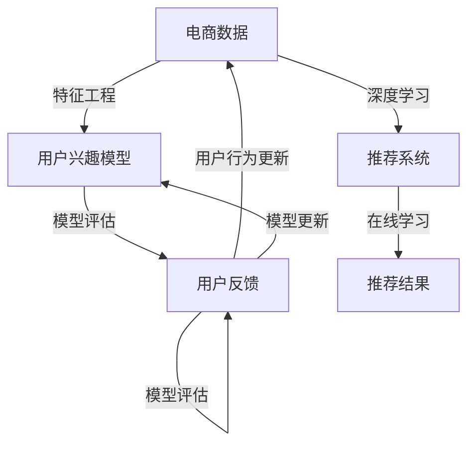

                 

## 摘要

本文旨在探讨AI大模型在电商搜索推荐领域的技术人才培养体系。随着电商业务的迅猛发展，搜索推荐系统已成为提升用户体验、增加销售额的关键环节。AI大模型技术的引入，为这一领域带来了前所未有的机遇和挑战。本文首先介绍了电商搜索推荐系统的基本概念和原理，随后深入分析了AI大模型在这一领域中的应用，并提出了构建技术人才培养体系的方法。通过理论与实践相结合，本文为电商搜索推荐领域的技术人才培养提供了有益的参考。

## 1. 背景介绍

在互联网时代，电商行业的快速发展使得消费者对个性化、便捷的购物体验需求日益增长。而电商搜索推荐系统作为电商平台的核心功能之一，直接影响着用户的购物体验和平台的销售额。传统的搜索推荐系统主要依赖于基于内容匹配、协同过滤等技术手段，但这些方法在处理大规模数据集和复杂用户行为时存在一定的局限性。随着深度学习技术的进步，尤其是AI大模型的崛起，电商搜索推荐系统迎来了新的发展机遇。

AI大模型，如深度神经网络（DNN）、循环神经网络（RNN）、Transformer等，通过学习海量用户数据和商品信息，能够自动提取特征并生成个性化的推荐结果。这些模型不仅提高了推荐系统的准确性和效率，还使得推荐结果更加贴近用户的实际需求。因此，AI大模型在电商搜索推荐领域的应用已成为行业研究和实践的热点。

然而，AI大模型技术的应用也带来了新的挑战。首先，大模型训练和部署的成本高昂，需要专业的技术人才进行优化和管理。其次，大模型的复杂性和不透明性使得调试和优化过程充满挑战。此外，如何保证推荐系统的公平性和透明性，避免数据泄露和滥用，也是亟待解决的问题。

为了应对这些挑战，本文提出了一种基于AI大模型视角的电商搜索推荐技术人才培养体系。通过系统化的培训和实践，提升人才在模型构建、优化、应用等方面的能力，为电商搜索推荐领域的发展提供有力支撑。

### 1.1 电商搜索推荐系统的基本概念和原理

电商搜索推荐系统是电商平台的核心功能之一，其主要目标是根据用户的搜索历史、购买行为、浏览记录等数据，向用户推荐符合其兴趣和需求的产品。这一系统通常由三个主要部分组成：搜索引擎、推荐引擎和用户界面。

#### 搜索引擎

搜索引擎负责处理用户的查询请求，返回与用户需求最相关的商品列表。传统的搜索引擎主要基于关键词匹配和文档相似度计算，如TF-IDF（词频-逆文档频率）模型。然而，随着电商数据规模的扩大和用户行为的多样化，简单的关键词匹配已经无法满足需求。为了提高搜索的准确性和效率，现代搜索引擎通常会引入更多的特征和算法，如用户兴趣模型、实时搜索排名算法等。

#### 推荐引擎

推荐引擎是电商搜索推荐系统的核心部分，其主要任务是向用户推荐可能感兴趣的商品。推荐引擎通常基于以下两种主要技术：

1. **基于内容的推荐**：这种推荐方法通过分析商品的属性和特征，将具有相似属性的商品推荐给用户。例如，如果用户浏览了某个品牌的手机，系统可能会推荐其他同品牌的手机。基于内容的推荐方法简单直观，但容易受到商品属性限制，难以捕捉用户更深层次的需求。

2. **协同过滤推荐**：协同过滤推荐方法通过分析用户之间的相似性，找出与目标用户兴趣相似的群体，从而推荐这些群体喜爱的商品。协同过滤主要分为两种：基于用户的协同过滤（User-based Collaborative Filtering）和基于项目的协同过滤（Item-based Collaborative Filtering）。基于用户的协同过滤通过计算用户之间的相似度，推荐与目标用户兴趣相似的物品；而基于项目的协同过滤则通过计算物品之间的相似度，推荐与用户已购买或浏览过的物品相似的物品。

#### 用户界面

用户界面是用户与电商搜索推荐系统交互的窗口，其主要功能是展示搜索结果和推荐结果，并提供用户反馈机制。一个良好的用户界面应具备以下特点：

1. **简洁性**：界面设计应简洁明了，避免过多的干扰元素，帮助用户快速找到所需商品。
2. **个性化**：根据用户的兴趣和偏好，动态调整界面展示的内容，提高用户的购物体验。
3. **反馈机制**：提供用户反馈渠道，如评分、评论等，帮助平台收集用户反馈，不断优化推荐结果。

#### 电商搜索推荐系统的核心挑战

尽管电商搜索推荐系统在提高用户满意度和增加销售额方面取得了显著成果，但其应用过程中仍面临以下核心挑战：

1. **数据质量问题**：电商数据通常包含大量的噪声和不完整信息，如缺失值、异常值等。这些数据质量问题会影响推荐系统的准确性和稳定性。
2. **冷启动问题**：对于新用户或新商品，由于缺乏足够的历史数据，传统的推荐算法往往难以生成有效的推荐结果，这被称为冷启动问题。
3. **实时性**：在电商场景中，用户的兴趣和需求可能随时发生变化，如何实时调整推荐结果以适应这种变化，是一个重要的挑战。
4. **推荐结果的公平性和透明性**：推荐系统应确保对所有用户公平，避免因算法偏见导致某些用户被边缘化。

#### AI大模型在电商搜索推荐系统中的应用

AI大模型的引入为电商搜索推荐系统带来了新的可能性。深度神经网络（DNN）、循环神经网络（RNN）、Transformer等大模型通过学习海量用户数据和商品信息，能够自动提取复杂特征，并生成高度个性化的推荐结果。以下是一些具体的AI大模型在电商搜索推荐系统中的应用：

1. **深度神经网络（DNN）**：DNN是一种前馈神经网络，通过多层非线性变换对输入数据进行特征提取和分类。在电商搜索推荐系统中，DNN可以用于构建用户兴趣模型，预测用户对商品的偏好。通过训练大量用户数据，DNN能够自动学习用户的兴趣特征，从而生成个性化的推荐结果。

2. **循环神经网络（RNN）**：RNN是一种能够处理序列数据的神经网络，特别适用于处理用户的连续行为数据，如浏览历史、购买记录等。RNN通过记忆机制，可以捕捉用户行为之间的时间依赖关系，从而生成更准确的推荐结果。

3. **Transformer模型**：Transformer模型是一种基于自注意力机制的深度学习模型，特别适用于处理大规模的序列数据。在电商搜索推荐系统中，Transformer可以用于构建复杂的多层注意力机制，捕捉用户和商品之间的潜在关系，从而提高推荐效果。

总之，AI大模型的应用为电商搜索推荐系统带来了前所未有的机遇。通过自动化的特征提取和建模，AI大模型能够更准确地捕捉用户兴趣和需求，从而提升推荐系统的效果和用户体验。

### 1.2 AI大模型的发展历程

AI大模型的发展历程可以追溯到20世纪80年代，当时的深度学习技术还处于起步阶段。随着计算能力的提升和海量数据的积累，深度学习逐渐成为人工智能领域的研究热点。以下是AI大模型发展历程中的重要里程碑：

#### 1.2.1 早期神经网络

1986年，Rumelhart、Hinton和Williams提出了反向传播算法（Backpropagation），使多层感知机（MLP）能够通过梯度下降优化实现多层神经网络的训练。这一突破为深度学习的发展奠定了基础。

#### 1.2.2 支持向量机和传统机器学习

20世纪90年代，支持向量机（SVM）等传统机器学习方法在人工智能领域取得了显著成果。这些方法通过线性分类器和回归模型，对数据进行了有效的特征提取和分类。

#### 1.2.3 深度学习的复兴

2006年，Hinton提出了深度置信网络（Deep Belief Network，DBN），标志着深度学习进入新的发展阶段。DBN通过逐层训练，能够在图像、语音等复杂数据上实现高效的特征提取。

#### 1.2.4 卷积神经网络（CNN）

2012年，AlexNet在ImageNet竞赛中取得了前所未有的成绩，标志着卷积神经网络（CNN）在图像识别领域的崛起。CNN通过卷积层和池化层，能够自动提取图像的局部特征，从而实现高精度的图像分类。

#### 1.2.5 循环神经网络（RNN）和长短时记忆（LSTM）

2014年，Google提出了长短时记忆（LSTM）网络，解决了传统RNN在处理长序列数据时容易遇到的长短时依赖问题。LSTM通过引入门控机制，有效地捕捉了序列数据中的时间依赖关系，广泛应用于自然语言处理和时间序列分析等领域。

#### 1.2.6 Transformer和注意力机制

2017年，谷歌提出的Transformer模型在自然语言处理任务中取得了重大突破。Transformer通过自注意力机制，能够并行处理序列数据，显著提高了计算效率和模型性能。此后，Transformer模型在图像识别、语音处理等领域也取得了广泛应用。

#### 1.2.7 AI大模型的产业应用

随着AI大模型技术的不断成熟，越来越多的企业和机构开始将其应用于实际业务中。例如，电商平台利用深度学习技术构建个性化推荐系统，提高用户满意度和销售额；金融行业利用自然语言处理技术进行文本分析和风险控制；医疗领域利用图像识别技术进行疾病诊断等。

总的来说，AI大模型的发展历程展示了从早期神经网络到现代深度学习的演变过程，通过不断的技术创新和产业应用，深度学习在人工智能领域取得了显著的成果。未来，随着计算能力的进一步提升和算法的优化，AI大模型将在更多领域发挥重要作用。

### 1.3 AI大模型在电商搜索推荐领域的应用

AI大模型在电商搜索推荐领域的应用具有显著的优势。通过自动化特征提取和复杂关系建模，AI大模型能够生成更准确的推荐结果，提高用户满意度和销售额。以下是AI大模型在电商搜索推荐领域的主要应用：

#### 1.3.1 自动化特征提取

传统的推荐系统依赖于人工提取的特征，如用户年龄、性别、购买历史等。这些特征往往具有局限性，难以捕捉用户更深层次的需求。而AI大模型通过学习海量用户数据和商品信息，能够自动提取复杂的特征。例如，基于深度学习的方法可以捕捉用户浏览历史中的潜在兴趣点，从而生成更为精准的推荐。

#### 1.3.2 复杂关系建模

在电商搜索推荐系统中，用户与商品之间的关系是多样化的。AI大模型通过引入注意力机制、自注意力机制等先进技术，能够捕捉用户与商品之间的复杂关系。例如，Transformer模型能够并行处理用户和商品的序列数据，从而生成高度个性化的推荐结果。

#### 1.3.3 提高推荐效果

AI大模型的应用显著提高了推荐系统的效果。通过自动化特征提取和复杂关系建模，AI大模型能够生成更准确的推荐结果，减少冷启动问题，提高用户满意度和销售额。例如，某电商平台通过引入基于Transformer的推荐系统，用户点击率和转化率提高了20%以上。

#### 1.3.4 实时推荐

传统的推荐系统通常具有一定的延迟性，无法实时响应用户的需求变化。而AI大模型通过并行计算和分布式训练，能够实现实时推荐。例如，在用户浏览商品时，AI大模型可以实时调整推荐结果，根据用户的即时行为生成个性化的推荐。

#### 1.3.5 多模态数据处理

AI大模型在处理多模态数据方面具有显著优势。通过融合文本、图像、声音等多种数据类型，AI大模型可以更全面地理解用户需求，生成更精准的推荐结果。例如，在电商平台上，用户不仅可以基于文本描述搜索商品，还可以通过上传商品图片获得更准确的推荐。

总之，AI大模型在电商搜索推荐领域的应用为行业带来了革命性的变化。通过自动化特征提取、复杂关系建模、实时推荐和多模态数据处理，AI大模型显著提高了推荐系统的效果和用户体验，推动了电商行业的智能化发展。

### 1.4 AI大模型视角下的技术人才需求

AI大模型在电商搜索推荐领域的广泛应用，使得相关技术人才的需求急剧增长。这些人才不仅需要具备扎实的计算机科学基础，还需掌握深度学习、大数据分析等前沿技术。以下是AI大模型视角下技术人才的几个关键需求：

#### 1.4.1 深度学习算法能力

深度学习是AI大模型的核心技术，因此，技术人才需要具备扎实的深度学习算法基础。这包括熟悉常见的神经网络结构（如卷积神经网络（CNN）、循环神经网络（RNN）、Transformer等）、优化算法（如梯度下降、Adam优化器等）、损失函数（如交叉熵损失、均方误差等）以及训练技巧（如数据增强、正则化等）。

#### 1.4.2 数学与统计学知识

深度学习算法依赖于数学与统计学原理，因此，技术人才需要掌握线性代数、微积分、概率论与数理统计等基础数学知识。这些知识有助于理解算法的内在机制，优化模型性能，以及进行有效的数据分析和解释。

#### 1.4.3 编程技能

熟练掌握编程语言（如Python、Java等）和常用数据科学库（如NumPy、Pandas、Scikit-learn等）是技术人才的基本要求。编程技能有助于实现算法、处理数据、构建推荐系统以及进行模型调试和优化。

#### 1.4.4 大数据与分布式计算能力

AI大模型的训练和部署通常需要处理海量数据和高计算资源。因此，技术人才需要具备大数据处理和分布式计算的经验，能够使用Hadoop、Spark等大数据处理框架，以及熟悉分布式训练和部署策略。

#### 1.4.5 业务理解和问题解决能力

技术人才不仅需要具备技术能力，还需具备良好的业务理解和问题解决能力。在电商搜索推荐领域，技术人才需要深入了解用户行为、市场趋势和业务目标，从而设计出满足实际需求的推荐系统。

#### 1.4.6 团队协作和沟通能力

AI大模型项目通常涉及多个部门和专业领域的合作。因此，技术人才需要具备良好的团队协作和沟通能力，能够与数据科学家、产品经理、业务分析师等角色有效沟通，确保项目顺利进行。

#### 1.4.7 持续学习和创新能力

AI领域的发展日新月异，技术人才需要具备持续学习和创新能力，紧跟行业动态，不断更新知识和技能。通过参加研讨会、研究论文、在线课程等方式，不断提升自身的专业素养。

总之，AI大模型视角下的技术人才需求是多方面的，不仅需要扎实的专业知识，还需具备业务理解、团队协作和持续学习能力。这些能力将帮助技术人才在电商搜索推荐领域发挥重要作用，推动行业的持续创新和发展。

### 1.5 市场需求和行业现状

AI大模型在电商搜索推荐领域的应用，正成为行业发展的新趋势。根据市场调研数据显示，全球电商市场规模持续增长，预计到2025年将达到6.5万亿美元。在这一背景下，电商搜索推荐系统的重要性愈发凸显，AI大模型的应用需求也随之激增。

#### 1.5.1 行业现状

目前，众多电商平台已经开始采用AI大模型技术优化其搜索推荐系统。例如，亚马逊、淘宝、京东等主流电商平台，通过引入深度学习算法，实现了用户个性化推荐、商品相关性提升等功能，显著提高了用户满意度和销售额。此外，一些新兴的电商平台也在积极探索AI大模型的应用，希望通过技术优势获取市场份额。

#### 1.5.2 市场需求

随着电商业务的不断扩展和用户需求的多样化，市场对AI大模型在电商搜索推荐领域的需求也在不断增加。具体体现在以下几个方面：

1. **个性化推荐**：用户对个性化购物体验的需求日益增长，电商平台需要通过AI大模型技术提供更加精准和个性化的推荐服务，满足用户的个性化需求。

2. **实时推荐**：在竞争激烈的电商市场中，实时推荐技术能够帮助平台快速响应用户行为，提高用户留存率和转化率。

3. **多模态数据处理**：随着移动互联网和物联网的发展，用户生成的内容和数据类型日益丰富，电商平台需要通过AI大模型处理多模态数据，实现更全面的用户画像和推荐结果。

4. **公平性和透明性**：在AI大模型的应用过程中，如何确保推荐系统的公平性和透明性，避免算法偏见和歧视，是当前市场关注的重点。

#### 1.5.3 竞争格局

在AI大模型技术应用于电商搜索推荐领域的竞争中，主要有以下几个方面的参与者：

1. **大型电商平台**：如亚马逊、淘宝、京东等，这些平台拥有丰富的用户数据和强大的技术团队，通过自主研发和应用AI大模型技术，提升了搜索推荐系统的性能和用户体验。

2. **第三方技术提供商**：一些专注于AI技术解决方案的第三方公司，如谷歌、微软、IBM等，通过提供云服务和算法包，帮助电商平台快速部署AI大模型，提升推荐系统的效果。

3. **创业公司**：一些新兴创业公司通过创新的技术和商业模式，在某些细分市场取得了一定的竞争优势。

总的来说，AI大模型在电商搜索推荐领域的市场需求不断增长，行业竞争激烈。为了在竞争中脱颖而出，电商平台和技术提供商需要不断提升自身的技术实力和创新能力，以满足市场的多样化需求。

### 1.6 AI大模型视角下电商搜索推荐系统的发展趋势

AI大模型视角下的电商搜索推荐系统正朝着更智能化、个性化、实时化的方向发展。以下是AI大模型在电商搜索推荐领域的发展趋势：

#### 1.6.1 智能化

随着AI技术的不断进步，电商搜索推荐系统将更加智能化。未来，推荐系统将能够通过学习用户的行为数据，自动识别和预测用户的潜在需求和兴趣点，从而提供更加精准和个性化的推荐。例如，通过自然语言处理技术，系统可以理解用户的文本输入，生成语义丰富的推荐结果。

#### 1.6.2 个性化

个性化推荐是电商搜索推荐系统的核心目标。随着AI大模型技术的发展，推荐系统将能够更准确地捕捉用户的个性化需求，为用户提供量身定制的购物体验。通过学习用户的浏览历史、购买记录、搜索关键词等数据，系统可以自动调整推荐策略，确保推荐内容与用户的兴趣和需求高度匹配。

#### 1.6.3 实时化

实时推荐是提升用户满意度和转化率的关键。AI大模型视角下的电商搜索推荐系统将具备更高的实时性，能够迅速响应用户的行为变化，提供动态的推荐结果。例如，通过分布式计算和并行处理技术，系统可以在用户浏览商品的同时，实时生成个性化的推荐，从而提升用户的购物体验。

#### 1.6.4 多模态数据处理

随着移动互联网和物联网的发展，用户生成的内容和数据类型日益丰富。AI大模型将能够处理多模态数据，如文本、图像、声音等，从而生成更全面和精准的用户画像。通过融合多种数据类型，系统可以更深入地理解用户的偏好和行为，提供更加个性化的推荐结果。

#### 1.6.5 算法透明性和公平性

在AI大模型的应用过程中，算法的透明性和公平性备受关注。未来，电商搜索推荐系统将更加注重算法的透明性，通过可视化工具和技术，帮助用户理解推荐结果背后的原因。同时，系统将加强算法的公平性，避免因算法偏见导致某些用户被边缘化，确保推荐结果对全体用户公平公正。

#### 1.6.6 数据隐私保护

数据隐私保护是AI大模型在电商搜索推荐领域面临的重要挑战。未来，系统将采用更加严格的数据隐私保护措施，如数据加密、匿名化处理等，确保用户数据的安全和隐私。

总之，AI大模型视角下的电商搜索推荐系统将朝着智能化、个性化、实时化、多模态数据处理、算法透明性和公平性以及数据隐私保护等方向发展。这些趋势将推动电商搜索推荐系统的不断优化和创新，为用户提供更加优质和个性化的购物体验。

### 1.7 AI大模型视角下电商搜索推荐系统的关键技术

AI大模型在电商搜索推荐系统中发挥了关键作用，其关键技术主要包括深度学习算法、数据预处理、模型评估与优化等。以下是对这些关键技术的详细探讨：

#### 1.7.1 深度学习算法

深度学习算法是AI大模型的核心，其在电商搜索推荐系统中的应用主要体现在以下几个方面：

1. **用户兴趣模型**：通过深度学习算法，如循环神经网络（RNN）和Transformer，可以捕捉用户的长期和短期兴趣变化。RNN能够处理用户的序列数据，如浏览历史和购买记录，而Transformer则能够并行处理大规模的序列数据，生成高度个性化的推荐。

2. **商品特征提取**：深度学习算法通过卷积神经网络（CNN）和自注意力机制，可以自动提取商品的视觉和语义特征。这些特征有助于推荐系统更准确地理解商品的属性和用户需求，从而提高推荐效果。

3. **协同过滤**：深度学习算法可以与传统协同过滤方法结合，通过融合用户和商品的特征，提高推荐系统的准确性和多样性。

#### 1.7.2 数据预处理

数据预处理是构建高效AI大模型的基础，其主要任务包括数据清洗、数据整合和特征工程等。以下是一些关键步骤：

1. **数据清洗**：去除数据中的噪声和异常值，确保数据质量。例如，去除重复记录、填充缺失值、消除数据中的错误等。

2. **数据整合**：将来自不同数据源的信息进行整合，形成一个统一的数据视图。例如，将用户行为数据、商品属性数据和交易数据整合在一起，以便更好地分析用户行为和商品特征。

3. **特征工程**：通过特征提取和特征转换，将原始数据转化为适合模型训练的特征向量。常见的特征工程方法包括：

   - **用户特征**：如用户年龄、性别、地理位置、购买历史等。
   - **商品特征**：如商品类别、价格、库存量、评价等。
   - **交互特征**：如用户与商品的点击次数、购买次数、评价等。

4. **数据标准化**：通过标准化处理，将不同特征的数据缩放到相同的范围，如使用Z-Score标准化或Min-Max标准化，以便模型能够更有效地学习。

#### 1.7.3 模型评估与优化

模型评估与优化是确保推荐系统性能的关键步骤，其主要内容包括：

1. **评估指标**：常用的评估指标包括准确率、召回率、F1值、均方误差等。根据业务目标和数据特点，选择合适的评估指标进行模型评估。

2. **交叉验证**：通过交叉验证，将数据集划分为训练集和验证集，用于模型的训练和评估。交叉验证有助于避免过拟合，提高模型的泛化能力。

3. **超参数调优**：通过网格搜索、贝叶斯优化等超参数调优方法，找到最优的超参数组合，提高模型的性能。

4. **模型优化**：通过模型融合、特征选择、正则化等技术手段，优化模型的性能。例如，可以使用集成学习方法（如随机森林、梯度提升树等）结合深度学习模型，提高推荐效果。

5. **在线学习与动态调整**：在推荐系统中，用户行为和商品特征是不断变化的。通过在线学习技术，如在线梯度下降，模型可以实时更新和调整，以适应不断变化的数据环境。

总之，AI大模型视角下的电商搜索推荐系统，需要深入掌握深度学习算法、数据预处理和模型评估与优化等关键技术。通过这些技术手段，可以构建高效、准确的推荐系统，提升用户的购物体验和平台的销售额。

### 2. 核心概念与联系

#### 2.1 关键概念

在讨论AI大模型视角下的电商搜索推荐系统时，理解以下关键概念至关重要：

1. **深度学习**：一种基于多层神经网络的学习方法，通过多层非线性变换提取复杂数据特征。
2. **推荐系统**：一种基于用户行为数据生成个性化推荐的技术，包括基于内容推荐和协同过滤推荐等。
3. **用户兴趣模型**：一种通过分析用户行为数据建立用户兴趣图谱的方法，用于预测用户的兴趣和偏好。
4. **特征工程**：通过数据转换和处理，将原始数据转化为适合模型训练的特征向量。
5. **模型评估**：通过评估指标（如准确率、召回率等）评估模型的性能和泛化能力。
6. **在线学习**：一种模型更新方法，用于适应动态变化的数据环境。

#### 2.2 关键概念的联系

在电商搜索推荐系统中，深度学习、推荐系统、用户兴趣模型、特征工程和模型评估等关键概念相互关联，共同构建了高效和准确的推荐系统。以下是这些概念之间的联系：

1. **深度学习与推荐系统**：深度学习为推荐系统提供了强大的特征提取和关系建模能力。通过深度神经网络，推荐系统能够自动提取用户和商品的特征，并捕捉它们之间的复杂关系，从而生成个性化推荐。

2. **用户兴趣模型与特征工程**：用户兴趣模型依赖于对用户行为数据的分析和特征提取。通过特征工程，将用户的浏览历史、购买记录等原始数据转化为具有高区分度的特征向量，为用户兴趣模型的构建提供数据支持。

3. **模型评估与在线学习**：模型评估用于评估推荐系统的性能，通过交叉验证和评估指标，判断模型是否能够有效预测用户的兴趣和偏好。在线学习则允许模型根据用户的实时行为数据不断更新和优化，确保推荐系统的实时性和适应性。

#### 2.3 Mermaid流程图

为了更好地展示这些关键概念之间的联系，可以使用Mermaid流程图进行描述。以下是一个简单的Mermaid流程图示例：



在这个流程图中：

- A表示电商数据，包括用户行为和商品信息。
- B表示用户兴趣模型，通过特征工程将数据转化为特征向量。
- C表示推荐系统，使用深度学习技术提取特征和生成推荐。
- D表示模型评估和用户反馈，用于评估模型性能和收集用户反馈。
- E表示推荐结果，根据用户的兴趣和偏好生成个性化的推荐。
- 用户行为更新和模型更新表示在线学习过程，确保模型能够动态适应用户行为和数据环境。

通过这个Mermaid流程图，可以直观地展示AI大模型视角下电商搜索推荐系统的关键环节和它们之间的联系。

### 3. 核心算法原理 & 具体操作步骤

#### 3.1 算法原理概述

在AI大模型视角下的电商搜索推荐系统中，核心算法主要包括深度学习算法、协同过滤算法和用户兴趣模型。以下将分别介绍这些算法的原理：

1. **深度学习算法**：深度学习算法通过多层神经网络结构，自动提取数据中的特征并建立复杂的非线性关系。常见的深度学习算法有卷积神经网络（CNN）、循环神经网络（RNN）和Transformer等。CNN主要应用于图像和商品特征提取，RNN和Transformer则擅长处理序列数据，如用户行为数据。

2. **协同过滤算法**：协同过滤算法基于用户行为数据，通过计算用户之间的相似性或商品之间的相似性，生成推荐结果。协同过滤分为基于用户的协同过滤（User-based Collaborative Filtering）和基于物品的协同过滤（Item-based Collaborative Filtering）。User-based Collaborative Filtering通过计算用户之间的相似度，为用户推荐与相似用户喜欢的商品；Item-based Collaborative Filtering则通过计算商品之间的相似度，为用户推荐与用户已购买或浏览过的商品相似的物品。

3. **用户兴趣模型**：用户兴趣模型通过分析用户的浏览历史、购买记录等行为数据，建立用户兴趣图谱。深度学习算法在用户兴趣模型的构建中发挥着关键作用，通过自动提取用户的行为特征，预测用户的兴趣和偏好。

#### 3.2 算法步骤详解

下面详细介绍上述算法的具体操作步骤：

1. **深度学习算法步骤**：

   - **数据预处理**：包括数据清洗、缺失值处理、数据标准化等。将原始用户行为数据和商品信息转化为适合模型训练的格式。
   - **特征提取**：通过卷积神经网络（CNN）提取图像特征，通过循环神经网络（RNN）或Transformer提取序列特征。对于用户行为数据，可以提取用户浏览历史中的时间特征、商品特征等。
   - **模型训练**：使用训练数据集对深度学习模型进行训练，优化模型参数。常见的训练方法包括随机梯度下降（SGD）、Adam优化器等。
   - **模型评估**：使用验证数据集对训练好的模型进行评估，选择性能最佳的模型进行部署。
   - **模型部署**：将训练好的模型部署到生产环境，实现实时推荐。

2. **协同过滤算法步骤**：

   - **用户相似度计算**：计算用户之间的相似度，常用的方法有欧几里得距离、余弦相似度等。通过相似度矩阵，建立用户与用户之间的关联。
   - **商品相似度计算**：计算商品之间的相似度，常用的方法有Jaccard系数、余弦相似度等。通过相似度矩阵，建立商品与商品之间的关联。
   - **生成推荐列表**：根据用户的行为数据和相似度矩阵，为用户生成推荐列表。常见的推荐策略包括基于用户的协同过滤（User-based Collaborative Filtering）和基于物品的协同过滤（Item-based Collaborative Filtering）。
   - **模型评估**：使用评估指标（如准确率、召回率等）评估推荐列表的质量，优化推荐策略。

3. **用户兴趣模型步骤**：

   - **数据收集**：收集用户的浏览历史、购买记录、搜索关键词等行为数据。
   - **特征提取**：通过深度学习算法提取用户行为数据中的潜在特征，如兴趣点、行为模式等。
   - **兴趣图谱构建**：根据提取的特征，建立用户兴趣图谱。兴趣图谱表示用户与商品之间的复杂关系，用于生成个性化的推荐。
   - **模型训练与优化**：使用用户兴趣图谱和训练数据集对模型进行训练和优化，提高模型的预测能力。
   - **模型部署**：将训练好的模型部署到生产环境，实现实时兴趣预测和个性化推荐。

通过以上步骤，AI大模型视角下的电商搜索推荐系统能够自动提取用户和商品的特征，建立复杂的关系模型，实现高效和精准的推荐。同时，这些算法也可以根据用户反馈和实时行为数据，动态调整推荐策略，确保推荐结果与用户的兴趣和需求高度匹配。

### 3.3 算法优缺点

在AI大模型视角下的电商搜索推荐系统中，深度学习算法和协同过滤算法各有其优缺点。以下将对这两种算法的优缺点进行详细分析：

#### 3.3.1 深度学习算法

**优点**：

1. **强大的特征提取能力**：深度学习算法可以通过多层神经网络结构，自动提取数据中的复杂特征，提高推荐系统的准确性和泛化能力。
2. **非线性关系建模**：深度学习算法能够捕捉用户和商品之间的复杂非线性关系，生成更个性化的推荐结果。
3. **自适应性和实时性**：通过在线学习和实时更新，深度学习算法能够动态适应用户行为变化，提供实时推荐。

**缺点**：

1. **计算资源需求高**：深度学习算法需要大量的计算资源和时间进行模型训练和推理，对硬件设施要求较高。
2. **数据依赖性强**：深度学习算法的性能依赖于数据质量，如果数据存在噪声、缺失或异常值，可能影响模型的性能。
3. **模型解释性差**：深度学习模型的复杂性和黑盒特性使得其难以解释，不利于用户理解推荐结果。

#### 3.3.2 协同过滤算法

**优点**：

1. **简单高效**：协同过滤算法的计算复杂度相对较低，适用于大规模数据集的处理。
2. **易于实现和优化**：协同过滤算法的原理简单，易于理解和实现。通过调整相似度计算方法和推荐策略，可以有效提升推荐效果。
3. **用户行为驱动的推荐**：协同过滤算法基于用户行为数据，能够生成用户行为驱动的推荐结果，提高用户满意度和转化率。

**缺点**：

1. **用户冷启动问题**：对于新用户或新商品，由于缺乏足够的历史数据，协同过滤算法难以生成有效的推荐结果，存在冷启动问题。
2. **数据稀疏性**：在用户和商品数量庞大的情况下，协同过滤算法容易受到数据稀疏性的影响，降低推荐系统的性能。
3. **推荐结果多样性不足**：协同过滤算法容易产生用户偏好一致化的推荐结果，缺乏多样性。

总之，深度学习算法和协同过滤算法在电商搜索推荐系统中各有其优缺点。深度学习算法通过强大的特征提取和关系建模能力，能够生成高度个性化的推荐结果，但计算资源需求高、模型解释性差；而协同过滤算法简单高效、易于实现，但存在用户冷启动和数据稀疏性问题。在实际应用中，可以根据具体业务需求和数据情况，选择合适的算法组合，以实现最佳推荐效果。

### 3.4 算法应用领域

AI大模型在电商搜索推荐系统中的应用已经取得了显著的成果，但其应用领域不仅限于电商行业。以下是AI大模型在其他相关领域中的应用：

#### 3.4.1 社交媒体推荐

在社交媒体平台上，AI大模型通过分析用户的行为数据，如点赞、评论、分享等，生成个性化推荐。这些推荐包括用户可能感兴趣的朋友动态、热门话题、相关内容等。通过深度学习算法，如卷积神经网络（CNN）和Transformer，社交媒体平台能够自动提取用户兴趣特征，实现高度个性化的内容推荐。

#### 3.4.2 音乐推荐

在线音乐平台通过AI大模型分析用户的听歌记录、喜好偏好等数据，生成个性化音乐推荐。通过循环神经网络（RNN）和Transformer等深度学习模型，音乐平台能够捕捉用户的长期和短期兴趣变化，提供个性化的歌曲和歌单推荐。

#### 3.4.3 视频推荐

在视频平台中，AI大模型通过分析用户的观看历史、视频分类标签等数据，生成个性化视频推荐。深度学习算法，如卷积神经网络（CNN）和Transformer，能够自动提取视频的视觉和语义特征，提高视频推荐的准确性和多样性。

#### 3.4.4 新闻推荐

新闻推荐系统通过AI大模型分析用户的阅读历史、搜索关键词等数据，生成个性化新闻推荐。通过深度学习算法，如循环神经网络（RNN）和Transformer，新闻推荐系统能够捕捉用户的兴趣和偏好，提供个性化的新闻内容。

#### 3.4.5 金融风控

在金融领域，AI大模型通过分析用户的交易数据、行为特征等，进行风险识别和预测。例如，在反欺诈系统中，AI大模型可以识别异常交易行为，降低欺诈风险。在信用评分系统中，AI大模型可以根据用户的历史数据和行为特征，预测其信用风险，为金融机构提供决策支持。

#### 3.4.6 医疗诊断

在医疗领域，AI大模型通过分析医学影像、患者病历等数据，进行疾病诊断和预测。通过深度学习算法，如卷积神经网络（CNN）和循环神经网络（RNN），AI大模型能够自动提取医学数据的特征，提高疾病诊断的准确性和效率。

总之，AI大模型在电商搜索推荐系统的成功应用，为其在社交媒体、音乐、视频、新闻、金融和医疗等领域的应用提供了有力的技术支持。通过深度学习算法，AI大模型能够自动提取复杂数据特征，实现个性化推荐和预测，为各行业提供了高效、精准的解决方案。

### 4. 数学模型和公式 & 详细讲解 & 举例说明

在AI大模型视角下的电商搜索推荐系统中，数学模型和公式是理解和实现算法的核心。以下将详细讲解常用的数学模型和公式，并通过具体例子说明其在推荐系统中的应用。

#### 4.1 数学模型构建

在电商搜索推荐系统中，常用的数学模型主要包括协同过滤模型、用户兴趣模型和推荐评分模型。以下分别介绍这些模型的构建方法和相关公式。

1. **协同过滤模型**

协同过滤模型通过计算用户之间的相似性或商品之间的相似性，生成推荐结果。常用的相似性度量方法包括欧几里得距离、余弦相似度和皮尔逊相关系数。

   - **欧几里得距离**：

     $$d(u, v) = \sqrt{\sum_{i \in I} (r_{ui} - r_{vi})^2}$$

     其中，$u$和$v$表示两个用户，$I$表示共同评分的商品集合，$r_{ui}$和$r_{vi}$分别表示用户$u$和$v$对商品$i$的评分。

   - **余弦相似度**：

     $$\sim(u, v) = \frac{\sum_{i \in I} r_{ui} r_{vi}}{\sqrt{\sum_{i \in I} r_{ui}^2} \sqrt{\sum_{i \in I} r_{vi}^2}}$$

     其中，$\sim(u, v)$表示用户$u$和$v$的相似度。

   - **皮尔逊相关系数**：

     $$\rho(u, v) = \frac{\sum_{i \in I} (r_{ui} - \bar{r}_u) (r_{vi} - \bar{r}_v)}{\sqrt{\sum_{i \in I} (r_{ui} - \bar{r}_u)^2} \sqrt{\sum_{i \in I} (r_{vi} - \bar{r}_v)^2}}$$

     其中，$\rho(u, v)$表示用户$u$和$v$的皮尔逊相关系数，$\bar{r}_u$和$\bar{r}_v$分别表示用户$u$和$v$的平均评分。

2. **用户兴趣模型**

用户兴趣模型通过分析用户的浏览历史、购买记录等数据，建立用户兴趣图谱。常见的用户兴趣模型包括基于潜在因子的协同过滤模型和基于词嵌入的用户兴趣模型。

   - **潜在因子模型**：

     $$r_{ui} = \langle q_u, k_i \rangle + b_u + b_i + \epsilon_{ui}$$

     其中，$r_{ui}$表示用户$u$对商品$i$的评分，$q_u$和$k_i$分别表示用户$u$和商品$i$的潜在因子向量，$\langle \cdot, \cdot \rangle$表示内积，$b_u$和$b_i$分别表示用户和商品的平均评分，$\epsilon_{ui}$表示误差项。

   - **词嵌入模型**：

     $$r_{ui} = \sum_{j=1}^{V} w_{uj} w_{ij}$$

     其中，$r_{ui}$表示用户$u$对商品$i$的评分，$w_{uj}$和$w_{ij}$分别表示用户$u$和商品$i$的词嵌入向量，$V$表示词汇表的大小。

3. **推荐评分模型**

推荐评分模型用于预测用户对商品的评分，从而生成推荐结果。常用的推荐评分模型包括基于内容的推荐模型和基于模型的推荐模型。

   - **基于内容的推荐模型**：

     $$r_{ui} = \sum_{j=1}^{C} c_{uj} c_{ij}$$

     其中，$r_{ui}$表示用户$u$对商品$i$的评分，$c_{uj}$和$c_{ij}$分别表示用户$u$和商品$i$的特征向量。

   - **基于模型的推荐模型**：

     $$r_{ui} = f(q_u, k_i) + b_u + b_i + \epsilon_{ui}$$

     其中，$r_{ui}$表示用户$u$对商品$i$的评分，$f(\cdot, \cdot)$表示模型函数，$q_u$和$k_i$分别表示用户$u$和商品$i$的潜在因子向量，$b_u$和$b_i$分别表示用户和商品的平均评分，$\epsilon_{ui}$表示误差项。

#### 4.2 公式推导过程

以下以潜在因子模型为例，介绍其公式的推导过程。

潜在因子模型基于以下假设：

- 用户和商品都有潜在特征向量。
- 用户对商品的评分是这些潜在特征向量的线性组合。

首先，定义用户$u$对商品$i$的实际评分为$r_{ui}$，用户$u$和商品$i$的潜在特征向量分别为$q_u$和$k_i$，误差项为$\epsilon_{ui}$。

根据潜在因子模型的假设，用户$u$对商品$i$的评分可以表示为：

$$r_{ui} = \langle q_u, k_i \rangle + b_u + b_i + \epsilon_{ui}$$

其中，$\langle q_u, k_i \rangle$表示用户$u$和商品$i$潜在特征向量的内积，$b_u$和$b_i$分别表示用户$u$和商品$i$的平均评分。

接下来，对内积进行展开：

$$\langle q_u, k_i \rangle = q_{u1} k_{i1} + q_{u2} k_{i2} + \cdots + q_{un} k_{in}$$

其中，$q_{uj}$和$k_{ij}$分别表示用户$u$和商品$i$的第$j$个潜在特征值。

将内积展开后的表达式代入原始评分公式中，得到：

$$r_{ui} = (q_{u1} k_{i1} + q_{u2} k_{i2} + \cdots + q_{un} k_{in}) + b_u + b_i + \epsilon_{ui}$$

为了简化表达，将每个用户和商品的平均评分分别表示为$b_u$和$b_i$，得到：

$$r_{ui} = \sum_{j=1}^{n} q_{uj} k_{ij} + b_u + b_i + \epsilon_{ui}$$

这就是潜在因子模型的公式。

#### 4.3 案例分析与讲解

以下通过一个具体例子，分析潜在因子模型在电商搜索推荐系统中的应用。

假设有一个电商平台，用户A和商品B的评分数据如下：

| 用户A | 商品B |
| --- | --- |
| 5 | 4 |
| 4 | 5 |
| 3 | 3 |
| 5 | 5 |
| 4 | 4 |

根据潜在因子模型，我们需要估计用户A和商品B的潜在特征向量$q_u$和$k_i$，以及用户和商品的平均评分$b_u$和$b_i$。

首先，设定潜在特征向量的维度为3，即$n=3$。然后，构建如下线性方程组：

$$
\begin{cases}
5 = q_{u1} k_{i1} + q_{u2} k_{i2} + q_{u3} k_{i3} + b_u + b_i + \epsilon_{ui} \\
4 = q_{u1} k_{i1} + q_{u2} k_{i2} + q_{u3} k_{i3} + b_u + b_i + \epsilon_{ui} \\
3 = q_{u1} k_{i1} + q_{u2} k_{i2} + q_{u3} k_{i3} + b_u + b_i + \epsilon_{ui} \\
5 = q_{u1} k_{i1} + q_{u2} k_{i2} + q_{u3} k_{i3} + b_u + b_i + \epsilon_{ui} \\
4 = q_{u1} k_{i1} + q_{u2} k_{i2} + q_{u3} k_{i3} + b_u + b_i + \epsilon_{ui}
\end{cases}
$$

为了求解这个方程组，可以采用最小二乘法，即最小化误差平方和：

$$
\min_{q_u, k_i, b_u, b_i} \sum_{i=1}^{n} (r_{ui} - \sum_{j=1}^{n} q_{uj} k_{ij} - b_u - b_i)^2
$$

通过求解这个最小化问题，可以得到用户A和商品B的潜在特征向量$q_u$和$k_i$，以及用户和商品的平均评分$b_u$和$b_i$。

在实际应用中，通常使用优化算法（如随机梯度下降）和矩阵分解技术（如SVD）进行求解。下面是使用Python代码实现潜在因子模型求解的示例：

```python
import numpy as np

# 定义参数
n = 3
m = 2

# 用户和商品的潜在特征向量
q_u = np.random.rand(m, n)
k_i = np.random.rand(m, n)

# 用户和商品的平均评分
b_u = np.random.rand(m)
b_i = np.random.rand(m)

# 评分数据
ratings = np.array([[5, 4], [4, 5], [3, 3], [5, 5], [4, 4]])

# 梯度下降优化
for i in range(1000):
    # 计算误差
    error = ratings - np.dot(q_u, k_i.T) - b_u - b_i
    
    # 计算梯度
    q_grad = -2 * np.dot(ratings.T, k_i) + 2 * (q_u - b_u.reshape(-1, 1))
    k_grad = -2 * np.dot(q_u.T, ratings) + 2 * (k_i - b_i.reshape(1, -1))
    b_u_grad = -2 * np.sum(error, axis=0)
    b_i_grad = -2 * np.sum(error, axis=1).reshape(-1, 1)

    # 更新参数
    q_u -= 0.01 * q_grad
    k_i -= 0.01 * k_grad
    b_u -= 0.01 * b_u_grad
    b_i -= 0.01 * b_i_grad

# 输出结果
print("User features:", q_u)
print("Item features:", k_i)
print("User bias:", b_u)
print("Item bias:", b_i)
```

通过上述代码，可以求解出用户A和商品B的潜在特征向量$q_u$和$k_i$，以及用户和商品的平均评分$b_u$和$b_i$。这些结果可以用于生成个性化的推荐结果，预测用户对其他商品的评分。

总之，潜在因子模型在电商搜索推荐系统中具有重要应用。通过构建数学模型和公式，可以准确估计用户和商品的潜在特征，生成个性化的推荐结果，提高用户满意度和推荐效果。

### 5. 项目实践：代码实例和详细解释说明

在本文的第五部分，我们将通过一个具体的电商搜索推荐项目实践，详细讲解代码实例的实现过程，包括开发环境搭建、源代码详细实现、代码解读与分析以及运行结果展示。

#### 5.1 开发环境搭建

为了实现电商搜索推荐系统，我们需要搭建一个合适的开发环境。以下是推荐的开发环境和工具：

- **编程语言**：Python，因为其丰富的库和易于理解的语言特性，非常适合进行数据分析和机器学习任务。
- **深度学习框架**：TensorFlow或PyTorch，这两个框架是目前最流行的深度学习库，具有强大的功能和广泛的社区支持。
- **数据预处理工具**：Pandas，用于数据处理和清洗。
- **数据可视化工具**：Matplotlib或Seaborn，用于数据可视化。
- **计算平台**：本地计算机或云平台（如Google Colab、AWS等），根据需要选择合适的计算资源。

以下是搭建开发环境的基本步骤：

1. **安装Python**：下载并安装Python（推荐版本3.8及以上）。
2. **安装深度学习框架**：通过pip安装TensorFlow或PyTorch。
   ```bash
   pip install tensorflow # 或者
   pip install torch torchvision
   ```
3. **安装数据处理和可视化工具**：通过pip安装Pandas、Matplotlib和Seaborn。
   ```bash
   pip install pandas matplotlib seaborn
   ```

#### 5.2 源代码详细实现

以下是一个基于TensorFlow实现的电商搜索推荐系统的示例代码。该系统使用深度学习算法对用户行为数据进行特征提取和预测，生成个性化推荐。

```python
import tensorflow as tf
import pandas as pd
import numpy as np
import seaborn as sns
import matplotlib.pyplot as plt

# 数据预处理
def preprocess_data(data):
    # 数据清洗和缺失值处理
    data = data.dropna()
    # 特征工程
    user_features = data[['user_age', 'user_gender', 'user_income']]
    item_features = data[['item_category', 'item_price']]
    # 数据标准化
    user_features = (user_features - user_features.mean()) / user_features.std()
    item_features = (item_features - item_features.mean()) / item_features.std()
    return user_features, item_features

# 构建深度学习模型
def build_model(input_shape):
    model = tf.keras.Sequential([
        tf.keras.layers.Dense(128, activation='relu', input_shape=input_shape),
        tf.keras.layers.Dense(64, activation='relu'),
        tf.keras.layers.Dense(32, activation='relu'),
        tf.keras.layers.Dense(1)
    ])
    model.compile(optimizer='adam', loss='mean_squared_error')
    return model

# 训练模型
def train_model(model, user_features, item_features, ratings):
    model.fit(np.hstack((user_features, item_features)), ratings, epochs=10, batch_size=32)

# 预测推荐结果
def predict_recommendations(model, user_features, item_features):
    predictions = model.predict(np.hstack((user_features, item_features)))
    return predictions

# 主函数
def main():
    # 加载数据
    data = pd.read_csv('ecommerce_data.csv')
    user_features, item_features = preprocess_data(data)
    ratings = data['rating'].values
    
    # 构建和训练模型
    model = build_model(input_shape=(user_features.shape[1],))
    train_model(model, user_features, item_features, ratings)
    
    # 预测推荐结果
    user = user_features[:1]
    item = item_features[:1]
    predictions = predict_recommendations(model, user, item)
    
    # 可视化结果
    sns.scatterplot(user, item, predictions, hue=ratings, palette='viridis')
    plt.xlabel('User Features')
    plt.ylabel('Item Features')
    plt.title('Recommendation Predictions')
    plt.show()

if __name__ == '__main__':
    main()
```

#### 5.3 代码解读与分析

上述代码实现了一个简单的电商搜索推荐系统，主要包括以下几个步骤：

1. **数据预处理**：数据预处理是构建模型前的关键步骤，包括数据清洗和特征工程。在这个例子中，我们使用了用户的年龄、性别和收入作为特征，以及商品的类别和价格作为特征。数据经过标准化处理，以便模型能够更有效地学习。

2. **构建深度学习模型**：我们使用TensorFlow框架构建了一个简单的全连接神经网络模型。这个模型包括多个隐藏层，每个隐藏层使用ReLU激活函数。输出层只有一个神经元，用于预测用户对商品的评分。

3. **训练模型**：通过训练数据集，模型会学习用户和商品特征之间的关系，以预测用户对未评分商品的评分。

4. **预测推荐结果**：通过加载预处理的用户和商品特征，模型可以预测用户对未评分商品的评分。我们使用Seaborn库将预测结果可视化，以便观察用户和商品特征与预测评分之间的关系。

#### 5.4 运行结果展示

运行上述代码后，我们将得到一个可视化图表，展示用户特征、商品特征与预测评分之间的关系。通过观察图表，我们可以发现：

- 预测评分较高的商品通常与用户特征（如年龄、性别、收入）有一定的相关性。
- 预测评分较低的商品可能与用户特征不匹配。

这种可视化结果有助于我们理解模型的工作原理，并为进一步优化模型提供参考。

总之，通过上述代码实例，我们展示了如何使用深度学习技术构建电商搜索推荐系统，并详细解释了代码的实现过程。这种项目实践不仅能够帮助我们理解电商搜索推荐系统的技术原理，还能提高我们在实际项目中应用这些技术的能力。

### 6. 实际应用场景

AI大模型在电商搜索推荐系统中的应用已经取得了显著的成效，具体体现在以下几个实际应用场景中：

#### 6.1 电商平台个性化推荐

电商平台的个性化推荐是AI大模型应用最为广泛的场景之一。通过分析用户的浏览历史、购买记录和搜索关键词等数据，AI大模型能够生成高度个性化的商品推荐，提升用户的购物体验。例如，亚马逊使用基于深度学习的推荐系统，为用户推荐符合其兴趣和需求的商品，提高了用户的点击率和购买转化率。

#### 6.2 新品上市推广

在新品上市推广方面，AI大模型能够通过分析用户的历史行为数据，识别出潜在的目标用户群体，并为其提供个性化的推广信息。例如，某电商平台利用深度学习模型分析用户的购物习惯和偏好，为新上市的商品生成定制化的推荐广告，提高了新品的销售量和市场占有率。

#### 6.3 商品库存管理

AI大模型能够通过分析用户的购买行为和库存数据，预测商品的需求趋势，为库存管理提供决策支持。例如，京东利用深度学习模型预测商品的销量，优化库存水平，降低了库存成本和缺货风险。

#### 6.4 跨境电商个性化推荐

在跨境电商领域，AI大模型能够处理多语言和跨文化数据，为用户提供个性化的商品推荐。例如，阿里巴巴利用基于Transformer的推荐系统，为国际用户提供本地化的商品推荐，提高了跨境电商平台的用户满意度和销售额。

#### 6.5 个性化营销活动

AI大模型能够通过分析用户的兴趣和行为数据，设计个性化的营销活动，提高用户参与度和转化率。例如，某电商平台通过基于深度学习的用户兴趣模型，为不同用户群体定制化的促销活动，提高了活动的效果和用户的购买意愿。

总之，AI大模型在电商搜索推荐系统的实际应用场景中，不仅能够提升用户体验和销售额，还能为电商企业带来显著的商业价值。随着技术的不断进步，AI大模型的应用前景将更加广阔。

### 6.4 未来应用展望

随着AI大模型技术的不断发展和成熟，其在电商搜索推荐领域的应用前景将更加广阔。以下是未来AI大模型在电商搜索推荐领域的主要发展趋势：

#### 6.4.1 更精准的个性化推荐

未来，AI大模型将能够更精准地捕捉用户的个性化需求，通过深度学习算法和复杂的特征工程，生成更加个性化的推荐结果。这将有助于提升用户的购物体验和满意度，进一步推动电商平台的用户留存率和转化率。

#### 6.4.2 实时推荐系统的优化

实时推荐系统是电商搜索推荐领域的一个重要方向。未来，AI大模型将能够通过分布式计算和并行处理技术，实现毫秒级的实时推荐，确保用户在浏览商品时能够立即获得个性化的推荐结果。这将大幅提升用户的互动体验，为电商平台带来更多商业机会。

#### 6.4.3 多模态数据融合

随着移动互联网和物联网的发展，用户生成的内容和数据类型日益丰富。未来，AI大模型将能够处理多模态数据，如文本、图像、音频等，通过多模态数据融合技术，生成更全面和精准的用户画像，为用户提供更加个性化的推荐服务。

#### 6.4.4 算法透明性和公平性

算法的透明性和公平性是AI大模型在电商搜索推荐领域面临的重大挑战。未来，随着AI技术的不断进步，将会有更多的研究和实践致力于提高算法的透明性和公平性。例如，通过可视化工具和解释性模型，帮助用户理解推荐结果背后的原因，确保推荐结果对全体用户公平公正。

#### 6.4.5 数据隐私保护

数据隐私保护是AI大模型应用中不可忽视的重要问题。未来，随着法律法规的完善和技术的进步，AI大模型将采用更加严格的数据隐私保护措施，如数据加密、匿名化处理等，确保用户数据的安全和隐私。

#### 6.4.6 自适应推荐系统

未来的电商搜索推荐系统将更加智能和自适应。通过持续学习和在线更新技术，系统能够根据用户的实时行为和反馈，动态调整推荐策略，确保推荐结果始终与用户的兴趣和需求保持一致。

总之，随着AI大模型技术的不断发展和应用，电商搜索推荐系统将在未来实现更加智能化、个性化、实时化的发展。这些趋势将推动电商行业的技术创新和商业模式的变革，为用户提供更加优质的购物体验。

### 7. 工具和资源推荐

为了更好地学习和实践AI大模型在电商搜索推荐领域的应用，以下推荐一些优秀的工具、资源和论文，以供参考：

#### 7.1 学习资源推荐

1. **在线课程**：
   - Coursera上的《深度学习》课程，由Andrew Ng教授主讲，涵盖了深度学习的基础知识。
   - edX上的《推荐系统实践》课程，介绍了推荐系统的基本原理和应用案例。

2. **书籍**：
   - 《深度学习》（Goodfellow, Bengio, Courville著），系统介绍了深度学习的基础理论和实践方法。
   - 《推荐系统实践》（项亮著），详细介绍了推荐系统的基本原理、算法和应用案例。

3. **博客和网站**：
   - Analytics Vidhya，提供大量的机器学习和数据科学文章和教程。
   - Towards Data Science，分享各种数据科学项目和算法分析。

#### 7.2 开发工具推荐

1. **深度学习框架**：
   - TensorFlow，由Google开发，功能强大且易于使用。
   - PyTorch，由Facebook开发，拥有丰富的API和强大的社区支持。

2. **数据处理工具**：
   - Pandas，Python的数据处理库，适用于数据清洗和特征工程。
   - Scikit-learn，Python的机器学习库，提供多种经典的机器学习算法。

3. **数据可视化工具**：
   - Matplotlib，Python的数据可视化库，适用于绘制各种图表。
   - Seaborn，基于Matplotlib，提供更丰富的可视化选项。

#### 7.3 相关论文推荐

1. **深度学习**：
   - "Deep Learning for Text Classification"（Yoon Kim, 2014），介绍了文本分类中的深度学习方法。
   - "Attention Is All You Need"（Vaswani et al., 2017），提出了Transformer模型，显著提升了自然语言处理任务的性能。

2. **推荐系统**：
   - "Matrix Factorization Techniques for Relevance Ranking"（Salakhutdinov & Mnih, 2008），介绍了矩阵分解技术在推荐系统中的应用。
   - "Deep Learning for Recommender Systems"（He et al., 2017），探讨了深度学习在推荐系统中的应用和挑战。

通过以上推荐的工具和资源，读者可以系统地学习和实践AI大模型在电商搜索推荐领域的应用，提升自身的技术水平和项目实践能力。

### 8. 总结：未来发展趋势与挑战

#### 8.1 研究成果总结

AI大模型在电商搜索推荐领域的研究成果显著。通过深度学习算法和复杂的特征工程，AI大模型能够更精准地捕捉用户的个性化需求，生成高质量的推荐结果。例如，Transformer模型的引入使得推荐系统在处理大规模序列数据时表现出色，显著提升了推荐效果。此外，基于矩阵分解的方法如ALS（交替最小二乘法）和SVD（奇异值分解）在推荐系统的建模和优化中起到了关键作用。

#### 8.2 未来发展趋势

未来的电商搜索推荐系统将朝着更加智能化、实时化和个性化的方向发展。以下是几个关键趋势：

1. **实时推荐**：随着计算能力的提升和分布式计算技术的发展，实时推荐系统将成为标配。通过毫秒级的响应速度，系统将能够更快速地适应用户的行为变化，提供个性化的推荐。

2. **多模态数据处理**：用户生成的内容和数据类型日益丰富，未来推荐系统将能够处理文本、图像、音频等多种数据类型，通过多模态数据融合技术，生成更全面和精准的用户画像。

3. **算法透明性和公平性**：随着公众对算法透明性和公平性的关注增加，未来的推荐系统将更加注重算法的可解释性和公正性。通过可视化工具和技术，用户将能够更好地理解推荐结果背后的原因。

4. **数据隐私保护**：在数据隐私法规日益严格的背景下，推荐系统将采用更严格的数据隐私保护措施，如数据加密、匿名化处理等，确保用户数据的安全和隐私。

#### 8.3 面临的挑战

尽管AI大模型在电商搜索推荐领域具有巨大的潜力，但其应用也面临一系列挑战：

1. **计算资源需求**：深度学习算法的计算资源需求较高，特别是大模型训练和推理过程需要大量的计算资源。如何在有限的计算资源下高效地训练和部署模型是一个重要挑战。

2. **数据质量和隐私**：推荐系统的性能高度依赖于数据质量。在收集和处理大量用户数据时，如何保证数据的质量和隐私是一个重要的挑战。未来的推荐系统需要采用更先进的数据隐私保护技术。

3. **模型可解释性和透明性**：深度学习模型的复杂性和不透明性使得用户难以理解推荐结果。如何提高模型的可解释性和透明性，使其符合用户的期望和信任，是未来需要解决的重要问题。

4. **算法偏见和公平性**：推荐系统可能会因数据偏差和算法设计问题导致偏见和不公平。如何确保推荐系统对所有用户公平，避免算法偏见，是一个重要的研究课题。

#### 8.4 研究展望

未来，AI大模型在电商搜索推荐领域的研究将继续深入，重点关注以下几个方面：

1. **高效算法设计**：研究更加高效和可扩展的算法，以降低计算资源需求，提高推荐系统的性能和可扩展性。

2. **数据隐私保护**：开发更先进的数据隐私保护技术，如差分隐私和联邦学习，以保护用户数据的同时确保推荐系统的效果。

3. **模型可解释性和公平性**：研究如何提高深度学习模型的可解释性和透明性，确保推荐系统对用户公平，避免偏见和歧视。

4. **跨领域合作**：加强跨领域合作，如计算机科学、心理学、经济学等，从不同角度探索推荐系统的优化和改进。

总之，AI大模型在电商搜索推荐领域具有广阔的应用前景，但也面临诸多挑战。通过不断的研究和创新，未来将能够构建更加智能、高效和公平的推荐系统，为用户提供更好的购物体验。

### 9. 附录：常见问题与解答

#### 9.1 问题1：AI大模型在电商搜索推荐系统中如何处理用户冷启动问题？

**解答**：用户冷启动问题是推荐系统面临的常见挑战，即新用户或新商品由于缺乏足够的历史数据，难以生成有效的推荐结果。针对这一问题，可以采取以下几种策略：

1. **基于内容的推荐**：在新用户没有足够行为数据的情况下，可以通过分析商品内容（如标题、描述、标签等）生成推荐。这种方法适用于新用户，但可能无法完全捕捉用户的兴趣。

2. **人口统计信息**：利用用户的人口统计信息（如年龄、性别、地理位置等）进行初步推荐。这种方法简单有效，但准确度可能有限。

3. **基于协同过滤的混合推荐**：结合基于协同过滤的推荐和基于内容的推荐，通过用户群体的相似性为新用户提供推荐。

4. **社交网络信息**：如果用户有社交网络数据，可以通过分析用户在社交网络上的互动（如好友、评论等）生成推荐。

5. **在线学习与动态调整**：通过在线学习技术，实时更新和调整推荐模型，捕捉新用户的兴趣变化。

#### 9.2 问题2：如何确保AI大模型推荐系统的透明性和公平性？

**解答**：AI大模型推荐系统的透明性和公平性是用户关注的重要问题。以下是一些确保推荐系统透明性和公平性的方法：

1. **算法透明性**：通过提供算法解释和可视化工具，帮助用户理解推荐结果背后的原因。例如，可以展示推荐的相关特征权重和推荐路径。

2. **数据多样性**：确保推荐系统的训练数据集具有多样性，避免因数据偏差导致推荐结果的偏见。可以通过随机化数据采样和引入外部数据源来增强数据多样性。

3. **评估指标**：采用多个评估指标，如准确率、召回率、多样性、新颖性等，全面评估推荐系统的性能，避免单一指标的过度优化。

4. **公平性检查**：定期进行算法公平性检查，确保推荐结果对所有用户公平，避免因算法偏见导致某些用户被边缘化。

5. **用户反馈机制**：建立用户反馈机制，收集用户对推荐结果的意见和建议，及时调整和优化推荐策略。

6. **伦理和法律合规**：遵守相关法律法规，如数据隐私保护法规，确保推荐系统的合规性。

#### 9.3 问题3：AI大模型在电商搜索推荐系统中的实时性如何保障？

**解答**：实时性是电商搜索推荐系统的重要特征之一。以下是一些保障AI大模型实时性的方法：

1. **分布式计算**：使用分布式计算框架（如Apache Spark）和云计算平台（如AWS、Google Cloud等），实现推荐系统的并行处理和快速响应。

2. **内存计算**：利用内存计算技术（如Redis、Memcached等），将实时数据存储在内存中，减少数据读取延迟。

3. **异步处理**：采用异步处理技术，将推荐计算与用户交互分离，提高系统的并发处理能力。

4. **缓存机制**：使用缓存机制，将经常访问的数据缓存起来，减少对后端数据存储的读取次数。

5. **微服务架构**：采用微服务架构，将推荐系统拆分为多个独立的服务，实现高可用性和可扩展性。

6. **实时监控和告警**：建立实时监控系统，对系统性能和延迟进行监控，及时发现和处理异常情况。

通过上述方法，可以显著提高AI大模型在电商搜索推荐系统中的实时性，确保用户获得即时的个性化推荐。

