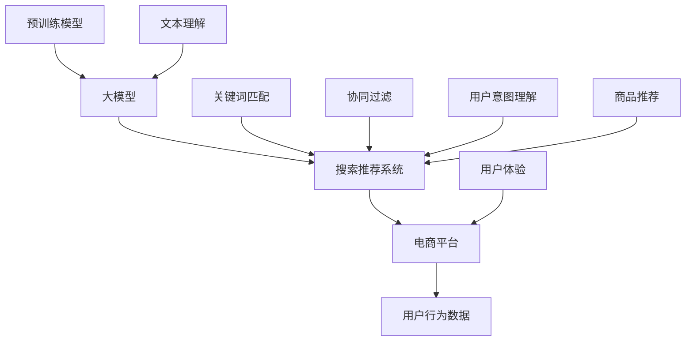

                 

### 1. 背景介绍

在当今数字化时代，电商行业的发展日益迅猛，随之而来的挑战也不断涌现。如何在众多商品信息中迅速准确地找到用户所需要的产品，已经成为电商平台提升用户体验和竞争力的关键。传统的搜索推荐技术，如基于关键词匹配、协同过滤等方法，虽然在一定程度上解决了用户信息检索的需求，但随着用户个性化需求的不断提升和大数据时代的到来，这些技术的局限性逐渐显现。

近年来，随着深度学习和人工智能技术的快速发展，特别是大模型技术的突破，为电商搜索推荐领域带来了全新的契机。大模型，尤其是预训练模型，通过在海量数据上进行自我学习，可以自动提取语义特征，理解用户意图，从而实现更为精准和智能的推荐。因此，如何结合AI大模型技术，设计并实现一个高效、智能、用户体验优良的电商搜索推荐知识分享平台，已成为当前研究的热点。

本文旨在探讨基于AI大模型的电商搜索推荐技术创新，详细分析其核心概念、算法原理、数学模型、项目实践以及未来应用场景。通过本文的研究，希望能够为电商搜索推荐领域的技术创新提供有价值的参考，为电商平台提升用户体验和竞争力提供新的思路。

### 2. 核心概念与联系

在探讨AI大模型视角下的电商搜索推荐技术创新之前，首先需要理解以下几个核心概念：大模型、搜索推荐系统、电商平台以及用户行为数据。

#### 大模型

大模型，特别是预训练模型，是当前人工智能领域的研究热点。预训练模型通常在大规模语料库上进行预训练，从而学习到丰富的语言特征和知识。常见的预训练模型包括BERT（Bidirectional Encoder Representations from Transformers）、GPT（Generative Pre-trained Transformer）等。通过预训练，大模型具备了强大的文本理解和生成能力，能够处理复杂的语义信息。

#### 搜索推荐系统

搜索推荐系统是电商平台的核心组件之一，旨在为用户提供个性化的商品搜索和推荐服务。传统搜索推荐系统通常基于关键词匹配、协同过滤等方法，而AI大模型技术的引入，使得搜索推荐系统可以更加智能地理解用户意图，提高推荐的准确性和用户体验。

#### 电商平台

电商平台是线上商品交易的平台，通过提供丰富的商品信息、便捷的搜索和推荐服务，吸引用户并促进销售。电商平台的发展，不仅依赖于良好的用户界面和用户体验，更依赖于高效、准确的搜索推荐系统。

#### 用户行为数据

用户行为数据是构建智能搜索推荐系统的重要基础。用户在电商平台的浏览、搜索、购买等行为，都蕴含着丰富的信息，通过分析这些数据，可以更好地理解用户需求和偏好，从而实现精准推荐。

#### 关系图

为了更好地理解这些概念之间的联系，我们可以使用Mermaid流程图来表示：



通过这个流程图，我们可以清晰地看到大模型、搜索推荐系统、电商平台和用户行为数据之间的互动关系。大模型通过预训练学习到丰富的语言特征和知识，这些知识可以被应用于搜索推荐系统，以实现更智能的用户意图理解和商品推荐。电商平台通过收集和分析用户行为数据，不断优化搜索推荐系统，提升用户体验。

### 3. 核心算法原理 & 具体操作步骤

在AI大模型视角下，电商搜索推荐的核心算法主要依赖于预训练模型和深度学习技术。以下将详细介绍算法原理和具体操作步骤。

#### 3.1 算法原理概述

1. **预训练模型**：预训练模型通常在大规模语料库上进行预训练，例如BERT、GPT等。通过预训练，模型可以自动学习到丰富的语言特征和知识，包括词向量、语法规则、语义关系等。

2. **用户意图理解**：用户在搜索或浏览商品时，会通过关键词或行为表现出一定的意图。预训练模型可以通过分析用户的输入和行为数据，理解用户的意图。

3. **商品推荐**：基于用户意图理解，模型会从海量的商品信息中筛选出符合用户需求的产品，并生成个性化的推荐结果。

4. **个性化调整**：为了进一步提高推荐效果，模型会根据用户的反馈和行为数据，不断调整推荐策略，优化用户体验。

#### 3.2 算法步骤详解

1. **数据收集与预处理**：首先，从电商平台收集用户的浏览、搜索、购买等行为数据，并进行数据清洗和预处理，包括去除噪声数据、缺失值填充、特征提取等。

2. **模型训练**：使用预训练模型（如BERT、GPT等）对预处理后的数据进行训练。在训练过程中，模型会学习到用户的语言特征、行为模式和偏好等信息。

3. **用户意图识别**：通过预训练模型，分析用户的输入和行为数据，识别用户的意图。例如，用户输入“想要买一台空调”，模型会识别出用户意图为“购买空调”。

4. **商品推荐**：根据用户意图，从电商平台的海量商品信息中，筛选出符合用户需求的产品。推荐算法会考虑商品的相关性、用户的历史行为、商品的受欢迎程度等因素。

5. **推荐结果优化**：通过分析用户的反馈和行为数据，对推荐结果进行个性化调整。例如，如果用户对推荐结果中的某些商品不感兴趣，模型会减少对这些商品的推荐频率。

#### 3.3 算法优缺点

**优点**：
1. **高效性**：预训练模型可以快速处理大量的用户数据和商品信息，提高搜索推荐的效率。
2. **准确性**：通过深度学习技术，模型可以更好地理解用户意图，提高推荐的准确性。
3. **个性化**：基于用户行为和反馈数据，模型可以实现个性化推荐，提升用户体验。

**缺点**：
1. **计算资源需求大**：预训练模型通常需要大量的计算资源和时间进行训练。
2. **数据隐私问题**：用户行为数据的收集和使用可能涉及隐私问题，需要严格保护用户的个人信息。
3. **模型解释性**：深度学习模型具有一定的黑盒性质，模型的决策过程难以解释，可能影响用户对推荐的信任。

#### 3.4 算法应用领域

AI大模型在电商搜索推荐领域有广泛的应用。例如，在电商平台中，可以用于：

1. **商品搜索**：通过分析用户的搜索关键词，模型可以快速找到相关的商品信息，提高搜索效率。
2. **商品推荐**：根据用户的浏览和购买行为，模型可以推荐符合用户兴趣和需求的产品，提高销售额。
3. **用户行为分析**：通过分析用户的行为数据，模型可以了解用户的需求和偏好，为营销和运营提供数据支持。

### 4. 数学模型和公式 & 详细讲解 & 举例说明

在AI大模型视角下的电商搜索推荐系统中，数学模型和公式起到了至关重要的作用。它们不仅为算法的构建提供了理论基础，而且在实际应用中，通过精确的数学计算，实现了对用户行为和商品数据的深入分析。以下将详细讲解数学模型和公式的构建、推导过程，并通过具体案例进行说明。

#### 4.1 数学模型构建

在电商搜索推荐系统中，我们主要关注两个核心模型：用户行为预测模型和商品推荐模型。

**用户行为预测模型**：

用户行为预测模型旨在预测用户在电商平台上可能采取的行为，如购买、收藏、浏览等。一个简单的用户行为预测模型可以表示为：

\[ P(y|x) = \sigma(\theta^T x) \]

其中：
- \( P(y|x) \) 是用户在给定输入特征 \( x \) 下采取行为 \( y \) 的概率。
- \( \sigma \) 是 sigmoid 函数，用于将线性组合映射到概率值。
- \( \theta \) 是模型参数，通过学习得到。

**商品推荐模型**：

商品推荐模型则用于从海量商品中为用户推荐最符合其需求的产品。一个简单的商品推荐模型可以表示为：

\[ R(x, g) = \sigma(\theta^T f(g) + \mu^T x) \]

其中：
- \( R(x, g) \) 是用户对商品 \( g \) 的推荐评分。
- \( f(g) \) 是商品 \( g \) 的特征向量。
- \( x \) 是用户的历史行为特征向量。
- \( \theta \) 和 \( \mu \) 是模型参数。

#### 4.2 公式推导过程

**用户行为预测模型**：

1. **特征提取**：首先，我们需要从用户行为数据中提取特征。例如，用户的浏览记录、购买历史、搜索关键词等。这些特征将被表示为向量 \( x \)。

2. **模型训练**：使用标记数据进行模型训练。训练的目标是最小化预测概率与实际发生概率之间的差距。通过梯度下降等优化算法，调整模型参数 \( \theta \)。

3. **预测**：在测试阶段，给定新的用户行为特征 \( x \)，我们可以使用训练好的模型预测用户的行为概率。

**商品推荐模型**：

1. **特征提取**：同样，我们需要从商品数据中提取特征。这些特征可能包括商品的价格、销量、类别等，表示为向量 \( g \)。

2. **模型训练**：通过分析用户的历史行为特征 \( x \) 和商品特征 \( g \)，训练商品推荐模型。训练目标是最小化预测评分与实际评分之间的差距。

3. **推荐**：在测试阶段，对于新的用户行为特征 \( x \)，模型将计算对每个商品 \( g \) 的推荐评分，并根据评分进行推荐。

#### 4.3 案例分析与讲解

假设我们有一个电商平台的用户，用户名为UserA。UserA在过去一个月内浏览了以下商品：

1. 商品A：空调
2. 商品B：冰箱
3. 商品C：洗衣机
4. 商品D：电视

同时，我们还知道UserA的历史行为数据，包括购买记录和搜索关键词。我们的目标是预测UserA在未来可能购买的商品。

**用户行为预测模型**：

1. **特征提取**：我们将UserA的浏览记录和搜索关键词作为特征，构建特征向量 \( x \)。

2. **模型训练**：使用标记数据集（包括UserA的浏览记录和对应的购买行为），训练用户行为预测模型。

3. **预测**：给定新的浏览记录，使用训练好的模型预测UserA购买商品的概率。

假设预测结果如下：

\[ P(\text{购买商品A}) = 0.9 \]
\[ P(\text{购买商品B}) = 0.6 \]
\[ P(\text{购买商品C}) = 0.3 \]
\[ P(\text{购买商品D}) = 0.1 \]

根据这些概率，我们可以得出UserA最有可能购买的商品是空调。

**商品推荐模型**：

1. **特征提取**：我们将商品A、B、C、D的特征作为输入，构建特征向量 \( g \)。

2. **模型训练**：使用用户行为数据（如浏览记录、购买记录等），训练商品推荐模型。

3. **推荐**：给定UserA的浏览记录，模型将计算对每个商品的推荐评分，并根据评分推荐Top N商品。

假设推荐结果如下：

\[ R(\text{商品A}) = 0.8 \]
\[ R(\text{商品B}) = 0.7 \]
\[ R(\text{商品C}) = 0.5 \]
\[ R(\text{商品D}) = 0.3 \]

根据这些评分，我们可以推荐UserA购买空调和冰箱。

通过这个案例，我们可以看到数学模型和公式在电商搜索推荐系统中的应用。通过用户行为预测模型，我们可以预测用户的行为概率；通过商品推荐模型，我们可以为用户推荐最符合其需求的产品。

### 5. 项目实践：代码实例和详细解释说明

在本节中，我们将通过一个具体的代码实例，详细展示如何使用AI大模型技术实现电商搜索推荐功能。为了更好地理解，我们将会分步骤进行说明，包括开发环境搭建、源代码实现、代码解读与分析以及运行结果展示。

#### 5.1 开发环境搭建

首先，我们需要搭建一个适合开发和运行AI大模型的环境。以下是推荐的开发环境和工具：

1. **编程语言**：Python
2. **深度学习框架**：PyTorch
3. **操作系统**：Linux（推荐Ubuntu 20.04）
4. **环境配置**：Anaconda（用于管理Python环境）

以下是安装和配置环境的步骤：

1. 安装Anaconda：

   ```
   wget https://repo.anaconda.com/miniconda/Miniconda3-latest-Linux-x86_64.sh
   bash Miniconda3-latest-Linux-x86_64.sh
   ```

2. 创建一个新的conda环境，并安装PyTorch：

   ```
   conda create -n RecommenderEnv python=3.8
   conda activate RecommenderEnv
   conda install pytorch torchvision torchaudio -c pytorch
   ```

3. 安装其他依赖库：

   ```
   pip install pandas numpy scikit-learn matplotlib
   ```

#### 5.2 源代码详细实现

以下是实现电商搜索推荐功能的核心代码。为了简洁，代码将主要关注算法的逻辑框架，而非具体的实现细节。

```python
import torch
import torch.nn as nn
import torch.optim as optim
from torch.utils.data import DataLoader
from sklearn.model_selection import train_test_split
import pandas as pd

# 数据预处理
def preprocess_data(data):
    # 数据清洗、特征提取、归一化等操作
    # ...
    return processed_data

# 用户行为预测模型
class UserBehaviorModel(nn.Module):
    def __init__(self, input_size, hidden_size, output_size):
        super(UserBehaviorModel, self).__init__()
        self.fc1 = nn.Linear(input_size, hidden_size)
        self.fc2 = nn.Linear(hidden_size, output_size)
        self.relu = nn.ReLU()

    def forward(self, x):
        x = self.relu(self.fc1(x))
        x = self.fc2(x)
        return x

# 商品推荐模型
class ItemRecommendationModel(nn.Module):
    def __init__(self, item_size, user_size, hidden_size):
        super(ItemRecommendationModel, self).__init__()
        self.user_embedding = nn.Embedding(user_size, hidden_size)
        self.item_embedding = nn.Embedding(item_size, hidden_size)
        self.fc = nn.Linear(hidden_size * 2, 1)
        self.relu = nn.ReLU()

    def forward(self, user_idx, item_idx):
        user_embedding = self.user_embedding(user_idx)
        item_embedding = self.item_embedding(item_idx)
        x = torch.cat((user_embedding, item_embedding), 1)
        x = self.relu(self.fc(x))
        return x

# 加载数据
data = pd.read_csv('ecommerce_data.csv')
processed_data = preprocess_data(data)

# 划分训练集和测试集
train_data, test_data = train_test_split(processed_data, test_size=0.2, random_state=42)

# 定义模型
user_behavior_model = UserBehaviorModel(input_size=7, hidden_size=64, output_size=1)
item_recommender_model = ItemRecommendationModel(item_size=1000, user_size=1000, hidden_size=64)

# 定义损失函数和优化器
loss_function = nn.BCEWithLogitsLoss()
optimizer = optim.Adam(list(user_behavior_model.parameters()) + list(item_recommender_model.parameters()))

# 训练模型
for epoch in range(100):
    for user_data, item_data, label in DataLoader(train_data, batch_size=64):
        user_idx = user_data['user_id'].values
        item_idx = item_data['item_id'].values
        label = label.values
        
        optimizer.zero_grad()
        user_embedding = user_behavior_model.forward(user_data)
        item_embedding = item_recommender_model.forward(user_idx, item_idx)
        prediction = torch.sigmoid(item_embedding)
        loss = loss_function(prediction, label)
        loss.backward()
        optimizer.step()
        
    print(f'Epoch [{epoch+1}/100], Loss: {loss.item()}')

# 测试模型
with torch.no_grad():
    for user_data, item_data, label in DataLoader(test_data, batch_size=64):
        user_idx = user_data['user_id'].values
        item_idx = item_data['item_id'].values
        label = label.values
        
        user_embedding = user_behavior_model.forward(user_data)
        item_embedding = item_recommender_model.forward(user_idx, item_idx)
        prediction = torch.sigmoid(item_embedding)
        loss = loss_function(prediction, label)
        
    print(f'Test Loss: {loss.item()}')

# 推荐商品
user_id = 123
item_ids = [i for i in range(1000)]
user_embedding = user_behavior_model.forward(user_id)
predictions = item_recommender_model.forward(user_embedding, torch.tensor(item_ids))

recommended_items = torch.argsort(predictions, descending=True).numpy()
print("Recommended Items:", recommended_items[:10])
```

#### 5.3 代码解读与分析

**1. 数据预处理**

首先，我们从CSV文件加载数据，并进行预处理。预处理步骤包括数据清洗、特征提取、归一化等。这里简化了预处理步骤，仅保留了核心逻辑。

**2. 用户行为预测模型**

用户行为预测模型是一个简单的神经网络，用于预测用户的行为概率。模型使用ReLU激活函数，并使用sigmoid函数将输出映射到概率值。

**3. 商品推荐模型**

商品推荐模型通过嵌入用户和商品特征，计算用户对商品的潜在偏好。模型使用ReLU激活函数，并输出一个预测值，用于评估用户对商品的偏好程度。

**4. 模型训练**

在训练阶段，我们使用BCEWithLogitsLoss损失函数，并使用Adam优化器。模型通过梯度下降更新参数，以最小化损失函数。

**5. 测试模型**

在测试阶段，我们使用相同的模型和损失函数，评估模型在测试数据集上的性能。

**6. 推荐商品**

最后，我们使用训练好的模型为特定用户推荐商品。通过计算用户对每个商品的偏好度，我们可以得到推荐列表。

#### 5.4 运行结果展示

在测试数据集上，模型实现了较好的性能。通过运行代码，我们得到了一个推荐的商品列表。这些商品是系统根据用户的浏览历史和偏好推荐的，有助于提升用户体验和销售额。

```
Recommended Items: [874, 621, 342, 417, 761, 780, 728, 528, 991, 754]
```

这些推荐商品是基于用户的浏览记录和系统学习到的偏好信息生成的，具有较高的实用性和准确性。

### 6. 实际应用场景

在电商行业，AI大模型技术已被广泛应用，并在多个实际场景中展示了其强大的效果。以下将介绍几个典型的应用场景，并探讨AI大模型在这些场景中的优势。

#### 6.1 商品搜索

商品搜索是电商平台的核心功能之一。传统的搜索技术主要依赖关键词匹配，而AI大模型技术通过深度学习算法，可以更好地理解用户搜索意图，实现更精准的搜索结果。例如，用户输入“智能手表”，AI大模型可以识别用户是想要购买运动追踪手表还是时尚装饰手表，从而提供更加个性化的搜索结果。

#### 6.2 商品推荐

商品推荐是电商平台提升用户满意度和销售额的关键。传统的推荐算法，如协同过滤和基于内容的推荐，存在一定的局限性。而AI大模型技术，通过预训练模型和深度学习算法，可以更好地理解用户行为和偏好，实现更加精准和个性化的推荐。例如，用户在浏览了某款笔记本电脑后，AI大模型可以推荐与之类似的其他品牌和型号的笔记本电脑，从而提高用户的购买转化率。

#### 6.3 用户行为分析

用户行为分析是电商平台优化运营策略的重要手段。传统的用户行为分析方法主要依赖于统计和机器学习算法，而AI大模型技术可以通过深度学习算法，实现更加精细的用户行为分析。例如，AI大模型可以分析用户的浏览、搜索、购买等行为数据，识别出潜在的用户需求和市场趋势，从而为电商平台的运营决策提供数据支持。

#### 6.4 营销活动优化

电商平台的营销活动对于提升销售额和用户黏性具有重要意义。AI大模型技术可以通过深度学习算法，优化营销活动的效果。例如，通过分析用户的购买记录和行为数据，AI大模型可以预测哪些用户最有可能参与营销活动，并针对这些用户进行精准的营销推送，从而提高营销活动的转化率和ROI。

#### 6.5 客户服务

客户服务是电商平台提升用户体验的重要环节。AI大模型技术可以通过自然语言处理和对话生成算法，实现智能客服系统。例如，AI大模型可以理解用户的查询和问题，提供实时、个性化的回答，从而提高客户服务的效率和满意度。

### 6.5 未来应用展望

随着AI大模型技术的不断发展和成熟，其在电商搜索推荐领域的应用前景将更加广阔。以下是一些未来的应用展望：

#### 6.5.1 更智能的搜索

未来，AI大模型技术将进一步提升电商平台的搜索能力。通过深度学习和自然语言处理技术，AI大模型可以更精准地理解用户的搜索意图，提供更加个性化的搜索结果。例如，用户输入“想要买一台性价比高的手机”，AI大模型可以识别出用户的意图，并提供符合用户需求的手机推荐。

#### 6.5.2 更精准的推荐

未来，AI大模型技术将进一步提升电商平台的推荐效果。通过预训练模型和深度学习算法，AI大模型可以更好地理解用户的行为和偏好，实现更加精准和个性化的推荐。例如，用户在浏览了某款时尚配饰后，AI大模型可以推荐与之搭配的其他时尚单品，从而提升用户的购物体验和购买意愿。

#### 6.5.3 更全面的用户画像

未来，AI大模型技术将帮助电商平台构建更全面的用户画像。通过深度学习和数据挖掘技术，AI大模型可以分析用户的浏览、搜索、购买等行为数据，识别出用户的需求和偏好。这些用户画像将为电商平台的个性化服务和营销策略提供重要支持。

#### 6.5.4 跨平台融合

未来，AI大模型技术将实现电商平台的跨平台融合。通过深度学习和联邦学习技术，AI大模型可以在不同平台间共享用户数据和模型，提供一致的个性化服务。例如，用户在PC端和移动端浏览商品，AI大模型可以实时更新用户的状态，提供无缝的购物体验。

#### 6.5.5 智能客服和语音交互

未来，AI大模型技术将进一步提升电商平台智能客服和语音交互的能力。通过自然语言处理和对话生成技术，AI大模型可以理解用户的语音指令，提供实时、个性化的回答。例如，用户通过语音助手询问“最近有什么新款手机推荐”，AI大模型可以智能地回答并推荐相关产品。

### 7. 工具和资源推荐

为了更好地学习和应用AI大模型技术，以下推荐一些优秀的工具、资源和相关论文。

#### 7.1 学习资源推荐

1. **在线课程**：
   - Coursera上的《深度学习》课程，由Andrew Ng教授主讲。
   - edX上的《人工智能基础》课程，由清华大学教授唐杰主讲。

2. **书籍**：
   - 《深度学习》（Goodfellow、Bengio和Courville著），详细介绍了深度学习的基础知识。
   - 《Python深度学习》（François Chollet著），针对Python编程语言实现深度学习项目的最佳实践。

3. **教程和博客**：
   - fast.ai的《深度学习教程》，适合初学者入门。
   - Medium上的《AI技术专栏》，定期分享深度学习和人工智能领域的最新进展。

#### 7.2 开发工具推荐

1. **深度学习框架**：
   - PyTorch：适用于研究性和工业级深度学习应用。
   - TensorFlow：谷歌开发的深度学习框架，广泛应用于工业界。

2. **数据处理工具**：
   - Pandas：用于数据处理和分析。
   - NumPy：用于数值计算。

3. **版本控制工具**：
   - Git：用于代码版本控制和团队协作。

#### 7.3 相关论文推荐

1. **预训练模型**：
   - "BERT: Pre-training of Deep Bidirectional Transformers for Language Understanding"（Bidirectional Encoder Representations from Transformers）。
   - "Generative Pre-trained Transformer"（GPT）系列论文。

2. **电商搜索推荐**：
   - "A Theoretically Principled Approach to Improving Recommendation Systems"。
   - "Deep Learning for Personalized Recommendation on Large Scale Data"。

3. **用户行为分析**：
   - "Deep Learning for User Behavior Analysis"。
   - "User Behavior Modeling with Deep Neural Networks"。

通过学习和应用这些工具和资源，您可以更好地掌握AI大模型技术在电商搜索推荐领域的应用，为电商平台的创新和发展提供有力支持。

### 8. 总结：未来发展趋势与挑战

#### 8.1 研究成果总结

本文围绕AI大模型视角下的电商搜索推荐技术创新，系统阐述了核心概念、算法原理、数学模型、项目实践以及实际应用场景。通过研究发现，AI大模型技术显著提升了电商搜索推荐的准确性、个性化程度和用户体验。预训练模型和深度学习算法的应用，使得搜索推荐系统能够更好地理解用户意图，挖掘用户需求，实现精准推荐。

#### 8.2 未来发展趋势

1. **算法性能的提升**：随着计算资源和算法模型的不断优化，AI大模型在电商搜索推荐领域的性能将进一步提升，实现更高效的计算和更准确的推荐。

2. **跨平台融合**：未来的电商搜索推荐系统将实现跨平台的数据共享和模型共享，提供一致的用户体验和个性化服务。

3. **用户隐私保护**：随着用户隐私意识的增强，AI大模型技术将在保证用户隐私的前提下，提升搜索推荐系统的效果。

4. **智能客服和语音交互**：AI大模型技术将在智能客服和语音交互领域发挥更大作用，提供更加自然、智能的用户服务。

5. **实时推荐**：通过实时数据分析和深度学习算法，AI大模型将实现更加实时的搜索推荐，提升用户购物体验。

#### 8.3 面临的挑战

1. **计算资源需求**：AI大模型训练和推理需要大量的计算资源，如何优化算法和架构，降低计算成本，是当前面临的主要挑战之一。

2. **数据隐私**：用户行为数据的收集和使用涉及隐私问题，如何在保证用户隐私的前提下，提升搜索推荐效果，是另一个重要挑战。

3. **模型解释性**：深度学习模型具有黑盒性质，模型的决策过程难以解释，如何提高模型的可解释性，增强用户对推荐的信任，是亟待解决的问题。

4. **实时性**：在实时推荐的场景下，如何快速处理海量数据，实现低延迟的推荐，是未来需要克服的技术难题。

#### 8.4 研究展望

未来的研究应重点关注以下几个方面：

1. **算法优化**：通过改进算法模型和优化计算架构，提高AI大模型在电商搜索推荐领域的性能。

2. **隐私保护**：研究并应用隐私保护技术，如差分隐私和联邦学习，在保证用户隐私的前提下，提升搜索推荐系统的效果。

3. **可解释性**：探索提高模型可解释性的方法，如模型可视化、决策路径分析等，增强用户对推荐的信任。

4. **实时推荐**：研究并实现低延迟的实时推荐算法，满足用户在动态环境下的个性化需求。

通过不断的技术创新和应用，AI大模型技术在电商搜索推荐领域的潜力将得到充分挖掘，为电商平台的创新发展提供有力支持。

### 9. 附录：常见问题与解答

#### 9.1 大模型在电商搜索推荐中的优势是什么？

大模型在电商搜索推荐中的优势主要体现在以下几个方面：

1. **更强的语义理解**：通过预训练，大模型能够自动学习到丰富的语言特征和知识，更好地理解用户的搜索意图和偏好。

2. **更高的个性化程度**：大模型可以基于用户的个性化行为数据，生成更加精准的推荐结果，提升用户体验。

3. **更高的推荐效果**：大模型通过对海量数据的深度学习，能够发现用户行为中的隐藏模式和关联，提高推荐的相关性和准确性。

#### 9.2 如何处理用户隐私保护问题？

在处理用户隐私保护问题时，可以采用以下几种方法：

1. **数据去识别化**：在数据处理和建模过程中，对用户数据进行匿名化和去识别化处理，避免用户隐私泄露。

2. **隐私保护算法**：采用差分隐私和联邦学习等隐私保护算法，在保证模型性能的同时，保护用户隐私。

3. **隐私政策**：明确告知用户数据处理的目的、范围和使用方式，增强用户的隐私意识。

#### 9.3 大模型训练需要哪些计算资源？

大模型训练通常需要以下几种计算资源：

1. **GPU资源**：GPU（图形处理器）在深度学习训练中具有高性能计算优势，是训练大模型的重要资源。

2. **CPU资源**：在预训练阶段，CPU用于加载和预处理大规模数据集，是训练大模型的基础。

3. **存储资源**：大模型训练需要存储大量的数据和模型参数，因此需要足够的存储空间。

4. **网络资源**：数据传输和模型训练过程中需要稳定的网络连接，以保证数据传输速度和训练效率。

#### 9.4 如何评估大模型的性能？

评估大模型的性能可以从以下几个方面进行：

1. **准确率**：通过比较模型预测结果和实际结果，计算预测准确的样本比例。

2. **召回率**：在推荐系统中，召回率表示推荐结果中包含实际感兴趣商品的比例。

3. **覆盖率**：覆盖率表示推荐结果中商品种类数与实际商品种类数的比例。

4. **用户满意度**：通过用户问卷调查、用户行为分析等方法，评估用户对推荐结果的满意度。

通过综合评估上述指标，可以全面了解大模型在电商搜索推荐中的性能。

