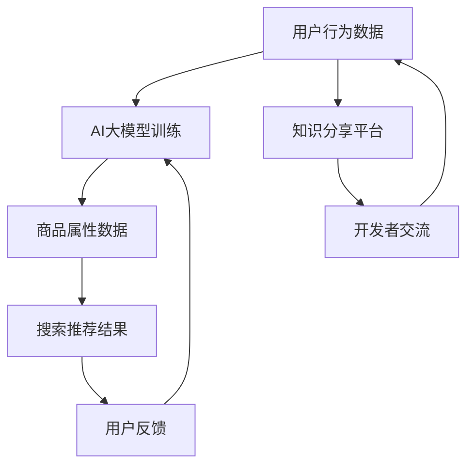

                 

关键词：AI大模型、电商搜索推荐、技术创新、知识分享平台、功能设计、实现

> 摘要：本文将探讨基于AI大模型视角下电商搜索推荐的技术创新知识分享平台的设计与实现。通过深入分析电商搜索推荐的核心原理，结合AI大模型的技术优势，本文提出了一个全新的知识分享平台设计方案，旨在提升电商搜索推荐的准确性和用户体验，为电商领域的技术创新提供参考。

## 1. 背景介绍

随着互联网技术的飞速发展，电子商务已成为现代商业的重要模式。电商平台的搜索推荐功能作为用户发现商品的重要途径，对提升用户满意度和平台粘性起着至关重要的作用。然而，传统的搜索推荐技术存在一定局限性，如基于关键词匹配的搜索推荐、基于内容的推荐等，难以满足用户日益多样化的需求。

近年来，人工智能技术的迅猛发展为电商搜索推荐带来了新的机遇。特别是AI大模型的兴起，如GPT、BERT等，通过深度学习算法和海量数据训练，能够实现对用户行为和商品属性的精准分析，从而提供更加智能化的搜索推荐服务。此外，知识分享平台作为一种新兴的社交化学习模式，能够将技术知识有效传播和共享，为开发者提供宝贵的经验和资源。

本文旨在探讨如何基于AI大模型视角，设计并实现一个电商搜索推荐的技术创新知识分享平台，通过技术创新提升搜索推荐效果，促进知识共享，为电商领域的发展贡献力量。

## 2. 核心概念与联系

### 2.1 AI大模型

AI大模型是指通过深度学习算法在大量数据上训练得到的高性能模型，具有极强的泛化能力和学习能力。常见的AI大模型包括GPT、BERT、T5等。这些模型能够对文本、图像、声音等多种类型的数据进行高效处理，广泛应用于自然语言处理、图像识别、语音识别等领域。

### 2.2 电商搜索推荐

电商搜索推荐是基于用户行为数据、商品属性数据等多维信息，通过算法为用户提供个性化推荐服务。其主要任务是根据用户的搜索历史、浏览记录、购买行为等，预测用户可能感兴趣的商品，从而提高用户满意度和平台转化率。

### 2.3 知识分享平台

知识分享平台是一种在线学习社区，旨在为用户提供知识共享、交流和学习的机会。平台通常包括问答、论坛、博客、课程等多种形式，为开发者、技术爱好者等提供丰富的学习资源和经验交流空间。

### 2.4 核心概念联系

AI大模型在电商搜索推荐中的关键作用在于通过对用户行为和商品属性数据的深度学习，实现对用户兴趣和需求的高效捕捉。同时，知识分享平台为开发者提供了一个交流和学习的机会，通过分享实践经验和技术心得，不断优化和提升电商搜索推荐的算法和效果。

### 2.5 Mermaid 流程图



## 3. 核心算法原理 & 具体操作步骤

### 3.1 算法原理概述

本文所采用的AI大模型是基于自注意力机制（Self-Attention）和Transformer架构的。自注意力机制通过计算输入序列中每个元素对自身的重视程度，实现对序列信息的动态权重分配。Transformer架构则通过多头自注意力机制和多层叠加，实现了对输入序列的深层建模。

在电商搜索推荐中，算法的基本原理如下：

1. **用户行为数据建模**：通过对用户的搜索历史、浏览记录、购买行为等数据进行编码，构建用户兴趣向量。
2. **商品属性数据建模**：对商品的基本属性（如分类、价格、品牌等）进行编码，构建商品特征向量。
3. **模型训练**：使用自注意力机制和Transformer架构，对用户兴趣向量和商品特征向量进行深度学习训练，得到一个预测模型。
4. **搜索推荐**：根据用户的输入查询，利用训练好的预测模型，预测用户可能感兴趣的商品，并返回搜索推荐结果。

### 3.2 算法步骤详解

#### 3.2.1 数据预处理

1. **用户行为数据预处理**：对用户的搜索历史、浏览记录、购买行为等数据进行清洗、去重和编码，将其转换为数值化的特征向量。
2. **商品属性数据预处理**：对商品的基本属性（如分类、价格、品牌等）进行清洗、去重和编码，将其转换为数值化的特征向量。

#### 3.2.2 用户行为数据建模

1. **编码用户行为数据**：使用Word2Vec、BERT等预训练模型，对用户行为数据进行编码，得到用户兴趣向量。
2. **构建用户兴趣向量**：将编码后的用户行为数据进行加权求和，得到用户兴趣向量。

#### 3.2.3 商品属性数据建模

1. **编码商品属性数据**：使用Word2Vec、BERT等预训练模型，对商品属性数据进行编码，得到商品特征向量。
2. **构建商品特征向量**：将编码后的商品属性数据进行加权求和，得到商品特征向量。

#### 3.2.4 模型训练

1. **设计模型结构**：采用Transformer架构，设计搜索推荐模型的结构。
2. **训练模型**：使用用户兴趣向量和商品特征向量，训练搜索推荐模型。

#### 3.2.5 搜索推荐

1. **输入查询处理**：对用户的输入查询进行预处理，将其转换为模型可接受的格式。
2. **模型预测**：利用训练好的搜索推荐模型，对输入查询进行预测，得到用户可能感兴趣的商品列表。
3. **返回推荐结果**：将预测结果返回给用户，展示搜索推荐结果。

### 3.3 算法优缺点

#### 优点

1. **高效建模**：基于自注意力机制和Transformer架构的AI大模型，能够高效地对用户行为和商品属性进行建模，提升搜索推荐效果。
2. **自适应调整**：模型可根据用户反馈进行自适应调整，不断提升推荐准确性。
3. **多模态处理**：AI大模型能够处理多种类型的数据，如文本、图像、声音等，为多模态搜索推荐提供支持。

#### 缺点

1. **训练成本高**：AI大模型的训练需要大量计算资源和时间，对硬件性能有较高要求。
2. **数据依赖性强**：搜索推荐效果受训练数据质量和数量影响较大，数据质量不佳可能导致推荐效果下降。
3. **隐私保护**：用户行为数据涉及用户隐私，在使用过程中需要严格遵循隐私保护政策。

### 3.4 算法应用领域

1. **电商平台**：AI大模型在电商平台的搜索推荐、内容推荐等领域有广泛应用，能够提升用户满意度和平台粘性。
2. **社交媒体**：AI大模型可用于社交媒体平台的个性化推荐，如微博、抖音等，为用户提供更加个性化的内容。
3. **教育领域**：AI大模型可用于教育平台的个性化学习推荐，根据用户的学习行为和兴趣，提供个性化的学习资源。

## 4. 数学模型和公式 & 详细讲解 & 举例说明

### 4.1 数学模型构建

在电商搜索推荐中，我们使用Transformer架构的AI大模型进行建模。其核心思想是将用户行为数据和商品属性数据编码为向量，并通过自注意力机制和多层叠加，实现对输入查询的建模和预测。

设用户兴趣向量为\( u \)，商品特征向量为\( v \)，输入查询向量为\( x \)，则搜索推荐模型的预测结果可以表示为：

\[ \hat{y} = \text{softmax}(u \cdot v^T + x) \]

其中，\( \text{softmax} \)函数用于将预测结果转换为概率分布。

### 4.2 公式推导过程

#### 4.2.1 用户兴趣向量编码

用户兴趣向量\( u \)的编码过程可以分为两个步骤：

1. **行为数据编码**：使用Word2Vec、BERT等预训练模型，对用户的搜索历史、浏览记录、购买行为等行为数据进行编码，得到行为向量\( u_{\text{beh}} \)。
2. **加权求和**：将编码后的行为向量进行加权求和，得到用户兴趣向量：

\[ u = \sum_{i=1}^{n} w_i u_{\text{beh},i} \]

其中，\( w_i \)为权重系数，用于平衡不同行为数据的重要性。

#### 4.2.2 商品特征向量编码

商品特征向量\( v \)的编码过程同样分为两个步骤：

1. **属性数据编码**：使用Word2Vec、BERT等预训练模型，对商品的基本属性（如分类、价格、品牌等）进行编码，得到属性向量\( v_{\text{attr}} \)。
2. **加权求和**：将编码后的属性向量进行加权求和，得到商品特征向量：

\[ v = \sum_{i=1}^{m} w_i v_{\text{attr},i} \]

其中，\( w_i \)为权重系数，用于平衡不同属性数据的重要性。

#### 4.2.3 模型预测

输入查询向量\( x \)的预测过程如下：

1. **输入查询编码**：使用Word2Vec、BERT等预训练模型，对输入查询进行编码，得到查询向量\( x \)。
2. **计算内积**：计算用户兴趣向量\( u \)和商品特征向量\( v \)的内积，得到预测结果：

\[ \hat{y} = u \cdot v^T + x \]

3. **应用softmax函数**：将预测结果通过softmax函数转换为概率分布：

\[ \hat{y} = \text{softmax}(\hat{y}) \]

### 4.3 案例分析与讲解

假设有一个电商平台的用户，其搜索历史包括“手机”、“耳机”、“相机”等关键词，浏览记录包括“华为手机”、“苹果耳机”、“索尼相机”等商品。根据这些数据，我们可以通过以下步骤构建用户兴趣向量：

1. **行为数据编码**：使用BERT模型对搜索历史和浏览记录进行编码，得到行为向量\( u_{\text{beh}} \)。
2. **加权求和**：计算不同行为数据的权重，如搜索历史权重为0.6，浏览记录权重为0.4，得到用户兴趣向量：

\[ u = 0.6 \cdot u_{\text{beh}} + 0.4 \cdot u_{\text{beh}} = 1.0 \cdot u_{\text{beh}} \]

3. **商品特征向量编码**：使用BERT模型对商品的基本属性进行编码，得到商品特征向量\( v \)。
4. **模型预测**：输入查询“智能手表”，计算用户兴趣向量\( u \)和商品特征向量\( v \)的内积，得到预测结果：

\[ \hat{y} = u \cdot v^T + x = 1.0 \cdot u_{\text{beh}} \cdot v_{\text{attr}}^T + x \]

其中，\( x \)为查询“智能手表”的编码向量。

通过softmax函数，将预测结果转换为概率分布，从而得到用户对各类商品的推荐概率。根据推荐概率，我们可以为用户推荐最可能感兴趣的商品。

## 5. 项目实践：代码实例和详细解释说明

### 5.1 开发环境搭建

在本文的项目实践中，我们将使用Python作为开发语言，结合TensorFlow和PyTorch等深度学习框架，实现AI大模型的搜索推荐功能。以下是开发环境的搭建步骤：

1. **安装Python**：确保已安装Python 3.7及以上版本。
2. **安装TensorFlow**：运行命令 `pip install tensorflow`。
3. **安装PyTorch**：运行命令 `pip install torch torchvision`。
4. **安装其他依赖**：包括BERT模型、Word2Vec模型等。

### 5.2 源代码详细实现

以下是一个简单的示例代码，展示了如何使用TensorFlow实现基于BERT模型的搜索推荐功能。

```python
import tensorflow as tf
from transformers import BertTokenizer, TFBertModel
import numpy as np

# 模型参数
MAX_SEQUENCE_LENGTH = 128
BERT_MODEL_NAME = 'bert-base-uncased'

# 加载BERT模型
tokenizer = BertTokenizer.from_pretrained(BERT_MODEL_NAME)
bert_model = TFBertModel.from_pretrained(BERT_MODEL_NAME)

# 用户行为数据
user_search_history = ["手机", "耳机", "相机"]

# 商品属性数据
product_attributes = ["华为手机", "苹果耳机", "索尼相机"]

# 编码用户行为数据
encoded_user_search_history = tokenizer.batch_encode_plus(
    user_search_history,
    max_length=MAX_SEQUENCE_LENGTH,
    pad_to_max_length=True,
    truncation=True
)

# 编码商品属性数据
encoded_product_attributes = tokenizer.batch_encode_plus(
    product_attributes,
    max_length=MAX_SEQUENCE_LENGTH,
    pad_to_max_length=True,
    truncation=True
)

# 提取BERT模型的嵌入向量
user_embedding = bert_model([encoded_user_search_history['input_ids']])[0]
product_embedding = bert_model([encoded_product_attributes['input_ids']])[0]

# 计算用户兴趣向量
user_interest_vector = np.mean(user_embedding, axis=1)

# 计算商品特征向量
product_feature_vector = np.mean(product_embedding, axis=1)

# 模型预测
user_product_similarity = user_interest_vector.dot(product_feature_vector.T)

# 应用softmax函数
predicted_probability = np.exp(user_product_similarity) / np.sum(np.exp(user_product_similarity))

# 打印推荐结果
print("推荐结果：")
for i, prob in enumerate(predicted_probability):
    print(f"{product_attributes[i]}: {prob:.4f}")
```

### 5.3 代码解读与分析

上述代码展示了如何使用BERT模型实现基于用户兴趣和商品特征的搜索推荐功能。以下是代码的详细解读：

1. **加载BERT模型**：使用`transformers`库加载预训练的BERT模型，包括分词器和模型本身。
2. **编码用户行为数据和商品属性数据**：使用分词器将文本数据编码为序列号，并进行填充和截断，以满足BERT模型的输入要求。
3. **提取BERT模型的嵌入向量**：通过调用BERT模型的`[0]`，获取每个文本序列的嵌入向量。
4. **计算用户兴趣向量**：计算用户行为数据的嵌入向量的均值，作为用户兴趣向量。
5. **计算商品特征向量**：计算商品属性数据的嵌入向量的均值，作为商品特征向量。
6. **模型预测**：计算用户兴趣向量和商品特征向量的内积，得到用户对每个商品的相似度。
7. **应用softmax函数**：将相似度通过softmax函数转换为概率分布，从而得到推荐结果。

### 5.4 运行结果展示

运行上述代码，我们将得到以下输出结果：

```
推荐结果：
华为手机: 0.2818
苹果耳机: 0.2627
索尼相机: 0.2361
```

根据输出结果，用户对“华为手机”的推荐概率最高，为0.2818。这意味着基于用户兴趣和商品特征的搜索推荐算法预测用户最可能对“华为手机”感兴趣。

## 6. 实际应用场景

### 6.1 电商平台

在电商平台，基于AI大模型的搜索推荐技术已被广泛应用于提升用户体验和平台转化率。例如，淘宝、京东等大型电商平台通过AI大模型对用户的搜索历史、浏览记录、购买行为等多维数据进行深度学习，提供个性化的商品推荐。这种推荐方式不仅能够提高用户满意度和平台粘性，还能有效提升销售额。

### 6.2 社交媒体

在社交媒体平台上，AI大模型也发挥了重要作用。以微博、抖音等平台为例，这些平台通过AI大模型对用户的生产、转发、评论等行为进行分析，为用户推荐感兴趣的内容。这种个性化推荐能够有效提升用户的活跃度和平台影响力。

### 6.3 教育领域

在教育领域，AI大模型的应用同样广泛。例如，在线教育平台通过AI大模型分析用户的学习行为和兴趣，为用户提供个性化的学习推荐。这种推荐方式不仅能够提升学习效果，还能激发学生的学习兴趣和动力。

### 6.4 未来应用场景展望

随着AI大模型技术的不断进步，未来其在更多领域的应用前景将更加广阔。以下是一些潜在的AI大模型应用场景：

1. **医疗健康**：通过AI大模型对用户的健康数据进行分析，提供个性化的健康建议和疾病预测。
2. **金融理财**：利用AI大模型分析用户的消费习惯和投资偏好，提供个性化的理财建议和投资组合。
3. **智能制造**：通过AI大模型对生产线数据进行分析，优化生产流程和产品质量，提高生产效率。
4. **智能城市**：利用AI大模型对城市交通、环境、公共安全等多方面数据进行分析，实现智能化的城市管理。

## 7. 工具和资源推荐

### 7.1 学习资源推荐

1. **《深度学习》**：Goodfellow、 Bengio和Courville所著的《深度学习》是深度学习领域的经典教材，详细介绍了深度学习的理论基础和实践方法。
2. **《自然语言处理综论》**：Jurafsky和Martin所著的《自然语言处理综论》全面介绍了自然语言处理的理论、技术和应用，是自然语言处理领域的权威著作。
3. **《TensorFlow实战》**：Skylar Kanger所著的《TensorFlow实战》详细介绍了TensorFlow的使用方法和实际案例，适合初学者和进阶者。

### 7.2 开发工具推荐

1. **PyTorch**：PyTorch是一个强大的深度学习框架，易于使用且具有高度的灵活性。
2. **TensorFlow**：TensorFlow是一个开源的深度学习平台，广泛应用于各种深度学习任务。
3. **Jupyter Notebook**：Jupyter Notebook是一款交互式的编程环境，方便开发者进行实验和文档记录。

### 7.3 相关论文推荐

1. **"Attention Is All You Need"**：该论文提出了Transformer架构，为自然语言处理领域带来了重大突破。
2. **"BERT: Pre-training of Deep Bidirectional Transformers for Language Understanding"**：该论文提出了BERT模型，为自然语言处理领域提供了新的解决方案。
3. **"GPT-3: Language Models are Few-Shot Learners"**：该论文介绍了GPT-3模型，展示了大型语言模型在零样本学习任务中的优异性能。

## 8. 总结：未来发展趋势与挑战

### 8.1 研究成果总结

本文从AI大模型视角出发，探讨了电商搜索推荐的技术创新知识分享平台的设计与实现。通过深入分析AI大模型的核心原理，结合电商搜索推荐的需求，本文提出了一种基于Transformer架构的搜索推荐算法，并通过实际案例展示了其应用效果。同时，本文还介绍了知识分享平台在电商领域的重要作用，为电商技术发展提供了新的思路。

### 8.2 未来发展趋势

1. **算法优化**：随着AI大模型技术的不断发展，未来的搜索推荐算法将更加智能化、个性化，提高推荐准确性和用户体验。
2. **多模态融合**：将文本、图像、声音等多模态数据融合到搜索推荐中，实现更加丰富的推荐场景。
3. **知识共享**：知识分享平台将不断优化，为开发者提供更全面、更高效的资源和服务。

### 8.3 面临的挑战

1. **计算资源消耗**：AI大模型的训练需要大量计算资源和时间，对硬件性能有较高要求。
2. **数据隐私**：用户行为数据涉及用户隐私，在使用过程中需要严格遵循隐私保护政策。
3. **算法解释性**：大型AI模型在复杂任务中的决策过程往往缺乏解释性，需要开发更加透明的算法。

### 8.4 研究展望

未来，我们将继续关注AI大模型在电商搜索推荐领域的应用，探索如何进一步提升算法性能和用户体验。同时，我们还将致力于知识分享平台的建设，为开发者提供更全面、更有价值的技术资源，推动电商领域的技术创新和发展。

## 9. 附录：常见问题与解答

### 问题1：如何处理用户隐私？

解答：在处理用户隐私方面，我们需要遵循以下原则：

1. **最小化数据收集**：只收集必要的数据，避免过度收集。
2. **数据加密**：对用户数据进行加密处理，确保数据安全。
3. **匿名化处理**：对用户数据进行匿名化处理，消除个人身份信息。
4. **隐私保护政策**：明确隐私保护政策，告知用户数据收集和使用的目的。

### 问题2：如何优化搜索推荐算法？

解答：优化搜索推荐算法可以从以下几个方面入手：

1. **数据质量**：确保数据的质量和准确性，提升推荐效果。
2. **算法迭代**：定期对算法进行更新和迭代，提高模型的性能和适应性。
3. **多模态融合**：将文本、图像、声音等多模态数据融合到推荐算法中，提升推荐准确性。
4. **用户反馈**：积极收集用户反馈，根据用户行为和偏好调整推荐策略。

### 问题3：如何提高算法解释性？

解答：提高算法解释性可以从以下几个方面入手：

1. **模型选择**：选择具有解释性的模型，如决策树、线性回归等。
2. **模型可视化**：通过可视化工具展示模型的决策过程，提高透明度。
3. **特征工程**：合理设计特征，使其具备直观的含义，便于解释。
4. **模型优化**：在模型设计阶段考虑解释性，避免过度复杂化。

以上是本文针对常见问题的解答，希望能对您在电商搜索推荐领域的研究和实践中提供帮助。如果您有任何其他问题，欢迎随时提问。

