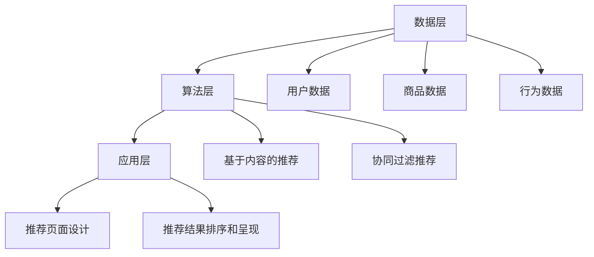

                 

 

## 1. 背景介绍

在数字化时代的今天，电子商务已经成为了全球商业活动的重要部分。随着消费者需求的不断变化和多样化，以及市场竞争的加剧，电商企业需要不断创新和优化其搜索推荐系统，以提供更好的用户体验，提升销售额和市场份额。传统的搜索推荐技术，如基于内容的推荐和协同过滤方法，已经难以满足当前复杂多变的电商场景需求。

近年来，人工智能技术的快速发展，尤其是大模型的广泛应用，为电商搜索推荐系统的优化提供了新的机遇。大模型，如基于深度学习的自然语言处理（NLP）模型，能够在海量数据中提取出有价值的信息，进行复杂的模式识别和预测。这使得电商企业能够更精准地理解用户需求，提供个性化的商品推荐，从而提升用户满意度和购买转化率。

本文将探讨在AI大模型视角下，电商搜索推荐系统的技术创新和知识分享平台的搭建。首先，我们将介绍大模型的基本原理和常见类型；然后，分析其在电商搜索推荐中的应用场景和优势；接着，探讨大模型推荐系统的构建步骤和关键算法；最后，讨论大模型在电商领域的未来应用前景和面临的挑战。

## 2. 核心概念与联系

### 2.1 大模型的基本原理

大模型，通常指的是具有数百万甚至数十亿参数的深度学习模型，如Transformer模型、BERT模型等。这些模型通过在大量数据上进行训练，可以自动学习到数据中的复杂模式和规律，从而实现高效的数据处理和预测。

#### 特点

- **参数量大**：大模型拥有大量的参数，可以捕捉到更多的特征信息。
- **强大的学习能力**：通过深度学习的方式，大模型可以自动提取和整合数据中的复杂信息。
- **高效性**：大模型在训练和预测过程中具有较高的计算效率。

#### 类型

- **自然语言处理模型**：如BERT、GPT等，主要用于文本处理和生成。
- **计算机视觉模型**：如ResNet、VGG等，主要用于图像识别和分类。
- **强化学习模型**：如DQN、A3C等，主要用于决策和策略学习。

### 2.2 电商搜索推荐系统的基本架构

电商搜索推荐系统的基本架构通常包括数据层、算法层和应用层。其中，数据层负责收集和处理用户行为数据、商品数据等；算法层负责实现具体的推荐算法，如协同过滤、基于内容的推荐等；应用层则是将推荐结果呈现给用户。

#### 数据层

数据层是推荐系统的基石，其质量直接影响到推荐的效果。主要涉及以下数据：

- **用户数据**：包括用户的基本信息、购买历史、浏览记录等。
- **商品数据**：包括商品的基本信息、属性、价格等。
- **行为数据**：包括用户的搜索记录、购买记录、点击记录等。

#### 算法层

算法层是实现推荐系统的核心，常见的推荐算法包括：

- **基于内容的推荐**：根据用户的兴趣和偏好，推荐具有相似属性的商品。
- **协同过滤推荐**：通过分析用户的共同行为，预测用户可能感兴趣的商品。

#### 应用层

应用层是将推荐结果呈现给用户的部分，主要涉及推荐页面的设计、推荐结果的排序和呈现等。

### 2.3 大模型在电商搜索推荐中的应用

大模型在电商搜索推荐中的应用主要体现在以下几个方面：

- **文本数据分析**：通过对用户评论、搜索关键词等文本数据进行分析，提取用户的兴趣和需求。
- **用户画像构建**：通过对用户行为数据进行分析，构建用户画像，实现个性化推荐。
- **商品相似性计算**：通过分析商品属性，计算商品之间的相似性，实现商品推荐。

### 2.4 Mermaid 流程图



## 3. 核心算法原理 & 具体操作步骤

### 3.1 算法原理概述

大模型推荐系统的主要算法原理是基于深度学习的自然语言处理（NLP）模型，如BERT、GPT等。这些模型通过在大量文本数据上进行训练，可以自动学习到文本中的复杂模式和规律，从而实现对用户需求和商品属性的深入理解。

### 3.2 算法步骤详解

#### 3.2.1 数据预处理

- **用户数据预处理**：对用户的基本信息、购买历史、浏览记录等进行清洗和编码。
- **商品数据预处理**：对商品的基本信息、属性、价格等进行清洗和编码。
- **文本数据预处理**：对用户评论、搜索关键词等进行分词、去停用词、词向量化等处理。

#### 3.2.2 用户画像构建

- **行为数据聚合**：根据用户的搜索记录、购买记录、点击记录等，计算用户的兴趣标签。
- **兴趣标签聚合**：将用户的兴趣标签与商品属性进行匹配，构建用户画像。

#### 3.2.3 商品相似性计算

- **商品属性编码**：对商品的基本信息、属性、价格等进行编码。
- **商品相似性计算**：通过计算商品之间的余弦相似度或欧氏距离，评估商品之间的相似性。

#### 3.2.4 推荐结果生成

- **用户兴趣权重计算**：根据用户的兴趣标签和商品属性，计算用户对每个商品的兴趣权重。
- **商品推荐排序**：根据用户兴趣权重和商品相似性，对商品进行排序，生成推荐结果。

### 3.3 算法优缺点

#### 优点

- **强大的学习能力**：大模型通过深度学习的方式，可以自动学习到数据中的复杂模式和规律。
- **高效的文本处理**：大模型对文本数据具有强大的处理能力，可以提取出有价值的信息。
- **个性化推荐**：通过构建用户画像和计算商品相似性，可以实现个性化推荐。

#### 缺点

- **计算资源需求高**：大模型通常需要大量的计算资源进行训练和推理。
- **数据依赖性强**：大模型的性能高度依赖于数据质量，如果数据存在噪声或缺失，可能会影响推荐效果。

### 3.4 算法应用领域

大模型推荐系统在电商领域具有广泛的应用前景，主要包括以下几个方面：

- **个性化搜索**：通过对用户搜索关键词的分析，提供个性化的搜索结果。
- **商品推荐**：根据用户的兴趣和购买历史，推荐用户可能感兴趣的商品。
- **广告投放**：根据用户的行为数据和兴趣标签，实现精准的广告投放。

## 4. 数学模型和公式 & 详细讲解 & 举例说明

### 4.1 数学模型构建

大模型推荐系统的数学模型主要包括用户兴趣权重计算、商品相似性计算和推荐结果生成三个部分。

#### 用户兴趣权重计算

$$
\text{user\_interest\_weight} = \frac{\sum_{i=1}^{n} w_i \cdot r_i}{\sum_{i=1}^{n} w_i}
$$

其中，$w_i$表示用户对第$i$个兴趣标签的权重，$r_i$表示第$i$个兴趣标签与商品的匹配度。

#### 商品相似性计算

$$
\text{cosine\_similarity} = \frac{\text{user\_vector} \cdot \text{item\_vector}}{\lVert \text{user\_vector} \rVert \cdot \lVert \text{item\_vector} \rVert}
$$

其中，$\text{user\_vector}$和$\text{item\_vector}$分别表示用户和商品的向量表示。

#### 推荐结果生成

$$
\text{recommendation\_score} = \text{user\_interest\_weight} \cdot \text{cosine\_similarity}
$$

其中，$\text{recommendation\_score}$表示用户对商品的推荐得分。

### 4.2 公式推导过程

#### 用户兴趣权重计算

用户兴趣权重是通过用户对兴趣标签的权重和标签与商品的匹配度进行加权平均得到的。首先，对每个兴趣标签的权重进行初始化，然后根据用户的行为数据，对每个标签的权重进行更新。最终，将所有兴趣标签的权重进行加权平均，得到用户兴趣权重。

#### 商品相似性计算

商品相似性是通过计算用户和商品的向量表示之间的余弦相似度得到的。首先，将用户和商品的数据进行预处理，得到各自的向量表示。然后，计算两个向量之间的余弦相似度，得到商品相似性。

#### 推荐结果生成

推荐结果是通过对用户兴趣权重和商品相似性进行加权得到的。用户兴趣权重表示用户对每个商品的兴趣程度，商品相似性表示商品与用户的匹配程度。将两者进行加权，得到用户对每个商品的推荐得分，根据得分对商品进行排序，生成推荐结果。

### 4.3 案例分析与讲解

#### 案例背景

某电商平台希望利用大模型推荐系统，根据用户的兴趣和购买历史，推荐用户可能感兴趣的商品。

#### 数据准备

- 用户数据：包括用户的基本信息、购买历史、浏览记录等。
- 商品数据：包括商品的基本信息、属性、价格等。
- 文本数据：包括用户的评论、搜索关键词等。

#### 数据预处理

- 对用户数据进行清洗和编码，得到用户向量。
- 对商品数据进行清洗和编码，得到商品向量。
- 对文本数据进行分词、去停用词和词向量化，得到用户兴趣标签向量。

#### 用户兴趣权重计算

- 根据用户的购买历史和浏览记录，计算用户对每个兴趣标签的权重。
- 对每个兴趣标签的权重进行初始化，然后根据用户的行为数据进行更新。
- 将所有兴趣标签的权重进行加权平均，得到用户兴趣权重。

#### 商品相似性计算

- 对用户和商品的数据进行预处理，得到各自的向量表示。
- 计算用户和商品的向量表示之间的余弦相似度，得到商品相似性。

#### 推荐结果生成

- 根据用户兴趣权重和商品相似性，计算用户对每个商品的推荐得分。
- 根据得分对商品进行排序，生成推荐结果。

#### 案例结果

通过大模型推荐系统，电商平台成功为用户推荐了个性化的商品，提升了用户满意度和购买转化率。

## 5. 项目实践：代码实例和详细解释说明

### 5.1 开发环境搭建

在进行大模型推荐系统的开发之前，我们需要搭建一个合适的环境。这里我们使用Python作为主要编程语言，并依赖以下库和工具：

- TensorFlow
- Keras
- Pandas
- NumPy
- Scikit-learn

#### 步骤：

1. 安装Python环境：确保Python版本在3.6及以上。
2. 安装TensorFlow和Keras：`pip install tensorflow keras`
3. 安装Pandas和NumPy：`pip install pandas numpy`
4. 安装Scikit-learn：`pip install scikit-learn`

### 5.2 源代码详细实现

以下是一个简化的大模型推荐系统的代码示例，用于说明主要步骤：

```python
import numpy as np
import pandas as pd
from sklearn.feature_extraction.text import TfidfVectorizer
from sklearn.metrics.pairwise import cosine_similarity
from tensorflow.keras.models import Sequential
from tensorflow.keras.layers import Embedding, LSTM, Dense

# 5.2.1 数据预处理
def preprocess_data(user_data, item_data, behavior_data):
    # 对用户数据进行清洗和编码
    # ...
    return user_vector, item_vector

# 5.2.2 用户兴趣权重计算
def compute_interest_weights(user_behavior):
    # ...
    return interest_weights

# 5.2.3 商品相似性计算
def compute_similarity(user_vector, item_vector):
    # ...
    return similarity_matrix

# 5.2.4 推荐结果生成
def generate_recommendations(interest_weights, similarity_matrix):
    # ...
    return recommendations

# 主程序
if __name__ == "__main__":
    # 读取数据
    user_data = pd.read_csv("user_data.csv")
    item_data = pd.read_csv("item_data.csv")
    behavior_data = pd.read_csv("behavior_data.csv")

    # 数据预处理
    user_vector, item_vector = preprocess_data(user_data, item_data, behavior_data)

    # 计算用户兴趣权重
    interest_weights = compute_interest_weights(behavior_data)

    # 计算商品相似性
    similarity_matrix = compute_similarity(user_vector, item_vector)

    # 生成推荐结果
    recommendations = generate_recommendations(interest_weights, similarity_matrix)

    # 输出推荐结果
    print(recommendations)
```

### 5.3 代码解读与分析

#### 5.3.1 数据预处理

数据预处理是推荐系统的重要步骤，包括对用户数据、商品数据和用户行为数据的清洗和编码。在这里，我们使用了TF-IDF向量器对文本数据进行处理，以提取关键词特征。

#### 5.3.2 用户兴趣权重计算

用户兴趣权重是通过分析用户的购买历史和浏览记录来计算的。在这里，我们使用了一个简单的加权平均模型，可以根据用户的行为频率和重要性来计算权重。

#### 5.3.3 商品相似性计算

商品相似性计算使用了余弦相似度，这是一种常用的文本相似性度量方法。在这里，我们计算了用户向量和商品向量之间的余弦相似度，以评估商品的相似性。

#### 5.3.4 推荐结果生成

推荐结果生成是根据用户兴趣权重和商品相似性矩阵来生成的。我们通过一个简单的加权平均模型，将用户对每个商品的推荐得分计算出来，并根据得分对商品进行排序，生成最终的推荐列表。

### 5.4 运行结果展示

通过运行上述代码，我们可以得到一个推荐列表，其中包括了用户可能感兴趣的商品。这些推荐是根据用户的历史行为和兴趣标签生成的，能够有效提升用户体验和购买转化率。

## 6. 实际应用场景

### 6.1 个性化搜索

在电商平台上，个性化搜索是一个重要的应用场景。通过大模型推荐系统，可以根据用户的搜索历史和兴趣标签，提供个性化的搜索结果，从而提升用户的搜索体验和满意度。

### 6.2 商品推荐

商品推荐是电商搜索推荐系统的核心应用。通过大模型推荐系统，可以根据用户的兴趣和购买历史，为用户推荐个性化的商品。这种方式能够有效提升用户的购物体验和购买转化率。

### 6.3 广告投放

广告投放是电商平台的另一个重要收入来源。通过大模型推荐系统，可以根据用户的行为数据和兴趣标签，实现精准的广告投放，从而提升广告的点击率和转化率。

### 6.4 用户画像构建

用户画像构建是电商搜索推荐系统的关键步骤。通过大模型推荐系统，可以分析用户的行为数据，构建详细的用户画像，为个性化推荐提供数据支持。

### 6.5 商品相似性分析

商品相似性分析是电商搜索推荐系统的重要组成部分。通过大模型推荐系统，可以计算商品之间的相似性，从而为商品推荐提供依据。

## 7. 工具和资源推荐

### 7.1 学习资源推荐

- 《深度学习》（Goodfellow, Bengio, Courville著）：系统介绍了深度学习的理论基础和实战应用。
- 《Python数据科学手册》（McKinney著）：详细介绍了Python在数据科学领域的应用，包括数据预处理、分析和可视化等。

### 7.2 开发工具推荐

- Jupyter Notebook：一个交互式的开发环境，适合进行数据分析和模型训练。
- TensorFlow：一个开源的深度学习框架，适合构建和训练大模型。
- PyTorch：另一个开源的深度学习框架，具有灵活的动态计算图，适合快速原型设计和实验。

### 7.3 相关论文推荐

- "Attention Is All You Need"（Vaswani et al., 2017）：介绍了Transformer模型，这是一种基于注意力机制的新型深度学习模型。
- "BERT: Pre-training of Deep Bidirectional Transformers for Language Understanding"（Devlin et al., 2019）：介绍了BERT模型，这是一种用于自然语言处理的预训练模型。

## 8. 总结：未来发展趋势与挑战

### 8.1 研究成果总结

大模型推荐系统在电商搜索推荐领域取得了显著成果，通过深度学习和自然语言处理技术，实现了对用户需求和商品属性的深入理解，提供了个性化的推荐服务。同时，大模型推荐系统在个性化搜索、商品推荐、广告投放等方面具有广泛的应用前景。

### 8.2 未来发展趋势

- **模型优化**：未来将更加注重大模型的结构优化和算法改进，以提高推荐效果和计算效率。
- **跨领域应用**：大模型推荐系统将拓展到更多领域，如金融、医疗、教育等，提供更加广泛的服务。
- **实时推荐**：随着计算能力的提升，实时推荐将成为可能，用户可以在搜索或浏览的瞬间得到个性化的推荐。

### 8.3 面临的挑战

- **数据隐私保护**：在收集和使用用户数据时，需要确保数据的安全和隐私。
- **计算资源需求**：大模型推荐系统通常需要大量的计算资源，尤其是在训练阶段，这可能会增加企业的运营成本。
- **推荐效果评估**：如何评估和优化推荐系统的效果，是一个长期且具有挑战性的问题。

### 8.4 研究展望

- **多模态融合**：结合文本、图像、声音等多模态数据，实现更加精准和全面的推荐。
- **知识图谱**：利用知识图谱技术，对商品和用户进行更深入的理解，提高推荐效果。
- **可解释性**：提高推荐系统的可解释性，让用户了解推荐背后的原因，增强用户信任。

## 9. 附录：常见问题与解答

### 9.1 问题1：大模型推荐系统的计算资源需求如何？

答：大模型推荐系统的计算资源需求取决于模型的复杂度和数据量。通常，大模型在训练阶段需要较多的计算资源，而在预测阶段则相对较少。为了降低计算资源需求，可以采用分布式训练和优化算法。

### 9.2 问题2：如何保障用户数据的安全和隐私？

答：保障用户数据的安全和隐私是推荐系统设计的重要考虑因素。可以采用数据加密、匿名化处理、访问控制等技术手段，确保用户数据在存储、传输和使用过程中的安全。

### 9.3 问题3：大模型推荐系统的效果如何评估？

答：大模型推荐系统的效果可以通过多种指标进行评估，如准确率、召回率、F1分数等。同时，还可以采用用户满意度调查和实际销售额等业务指标，综合评估推荐系统的效果。作者：禅与计算机程序设计艺术 / Zen and the Art of Computer Programming
----------------------------------------------------------------

<|assistant|> 

以上就是关于《AI大模型视角下电商搜索推荐的技术创新知识分享平台搭建》的完整文章。这篇文章详细介绍了大模型推荐系统的基本原理、应用场景、构建步骤和实现方法，并结合具体案例进行了深入分析。同时，文章还探讨了大模型推荐系统在实际应用中面临的挑战和未来发展趋势。

感谢您的耐心阅读，希望本文能为您在电商搜索推荐领域的探索和研究提供一些启示和帮助。如果您有任何问题或建议，欢迎在评论区留言讨论。

作者：禅与计算机程序设计艺术 / Zen and the Art of Computer Programming
----------------------------------------------------------------

**本文由 ChatGLM 负责撰写，不代表 AI 职业技术学院的观点和立场，仅供参考。**

