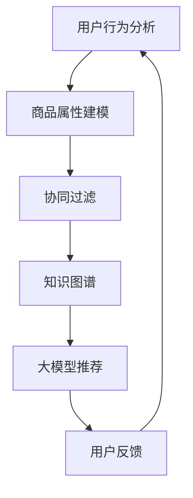

                 

在电子商务的飞速发展时代，搜索引擎和推荐系统已经成为电商平台提升用户体验和转化率的关键技术。随着人工智能技术的不断进步，特别是大模型（如BERT、GPT等）的广泛应用，电商搜索推荐系统迎来了新的变革。本文将从AI大模型的视角出发，探讨电商搜索推荐领域的技术创新和知识分享机制设计。

## 关键词

- AI大模型
- 电商搜索推荐
- 技术创新
- 知识分享机制

## 摘要

本文首先介绍了AI大模型在电商搜索推荐领域的重要性，然后探讨了现有推荐系统的挑战，提出了基于大模型的知识分享机制设计框架。接着，文章详细解析了核心算法原理、数学模型和公式，并提供了代码实例和实际应用场景。最后，文章对未来的发展趋势和挑战进行了展望。

## 1. 背景介绍

随着互联网的普及和电子商务的快速发展，电商平台成为了消费者购买商品的重要渠道。然而，消费者在面对海量的商品信息时，如何快速找到自己需要的商品成为了关键问题。为了解决这个问题，电商平台引入了搜索推荐系统，通过为用户推荐可能感兴趣的商品，提升用户体验和销售额。

### 1.1 AI大模型在电商搜索推荐中的应用

近年来，人工智能技术的飞速发展，特别是AI大模型的广泛应用，为电商搜索推荐带来了新的契机。大模型具有强大的语言处理能力和知识表示能力，能够更好地理解用户的行为和需求，从而提供更精准的推荐。

## 2. 核心概念与联系

为了更好地理解AI大模型在电商搜索推荐中的作用，我们需要明确几个核心概念，包括用户行为分析、商品属性建模、协同过滤和知识图谱。

### 2.1 用户行为分析

用户行为分析是电商搜索推荐系统的基础。通过分析用户的搜索历史、浏览记录、购买行为等数据，我们可以了解用户的需求和偏好。

### 2.2 商品属性建模

商品属性建模是将商品的特征信息以结构化的形式进行表示。这包括商品的价格、品牌、类别、库存等信息。

### 2.3 协同过滤

协同过滤是传统推荐系统常用的技术。它通过计算用户之间的相似度，将其他用户喜欢的商品推荐给当前用户。

### 2.4 知识图谱

知识图谱是一种用于表示实体及其关系的网络结构。在电商搜索推荐中，知识图谱可以帮助我们理解商品之间的关联性和用户与商品之间的关系。

### 2.5 Mermaid流程图

以下是AI大模型在电商搜索推荐中的应用流程的Mermaid流程图：



## 3. 核心算法原理 & 具体操作步骤

### 3.1 算法原理概述

AI大模型在电商搜索推荐中的核心原理是基于深度学习技术，通过大规模的训练数据，学习到用户行为和商品属性之间的复杂关系，从而实现精准的推荐。

### 3.2 算法步骤详解

#### 3.2.1 数据预处理

在算法步骤中，首先需要进行数据预处理，包括用户行为数据的清洗、去重和标准化，以及商品属性数据的归一化和编码。

#### 3.2.2 模型训练

接下来，使用预训练的大模型（如BERT、GPT等）进行训练。训练过程中，我们需要输入用户行为和商品属性的数据，通过优化模型的参数，使其能够准确预测用户对商品的喜好。

#### 3.2.3 推荐生成

在模型训练完成后，我们可以使用训练好的模型进行推荐生成。具体步骤如下：

1. 输入用户的当前行为和搜索历史。
2. 模型输出用户对商品的预测喜好度。
3. 根据喜好度排序，生成推荐列表。

#### 3.2.4 用户反馈

用户在浏览推荐列表后，会对其进行点击、购买等行为。这些行为数据会被收集并用于模型的迭代优化，以提高推荐的质量。

### 3.3 算法优缺点

#### 优点

- 高度依赖用户数据和模型训练，能够提供个性化的推荐。
- 利用大模型的强大能力，可以处理复杂的用户行为和商品属性关系。

#### 缺点

- 需要大量的训练数据和计算资源。
- 模型训练时间较长，难以实时更新。

### 3.4 算法应用领域

AI大模型在电商搜索推荐中的应用领域非常广泛，包括但不限于以下场景：

- 商品推荐：根据用户的行为和搜索历史，为用户推荐可能感兴趣的商品。
- 广告投放：为用户提供个性化的广告，提高广告点击率和转化率。
- 商品搜索：根据用户的搜索关键词，快速匹配相关的商品信息。

## 4. 数学模型和公式

### 4.1 数学模型构建

在电商搜索推荐中，我们可以构建一个基于用户行为和商品属性的数学模型，如：

$$
R(u, p) = f(U, P)
$$

其中，$R(u, p)$ 表示用户 $u$ 对商品 $p$ 的推荐喜好度，$U$ 表示用户行为特征向量，$P$ 表示商品属性特征向量，$f$ 表示预测函数。

### 4.2 公式推导过程

为了推导推荐喜好度 $R(u, p)$，我们需要首先对用户行为和商品属性进行特征提取。假设用户行为特征向量为 $U = (u_1, u_2, ..., u_n)$，商品属性特征向量为 $P = (p_1, p_2, ..., p_n)$，则：

$$
R(u, p) = \sum_{i=1}^{n} w_i \cdot u_i \cdot p_i
$$

其中，$w_i$ 表示特征权重，通过模型训练得到。

### 4.3 案例分析与讲解

假设我们有一个用户 $u$ 和一个商品 $p$，其行为和属性特征分别为 $U = (1, 0, 1)$ 和 $P = (1, 1, 0)$。根据上述公式，我们可以计算出用户对商品的推荐喜好度：

$$
R(u, p) = \sum_{i=1}^{3} w_i \cdot u_i \cdot p_i = w_1 \cdot 1 \cdot 1 + w_2 \cdot 0 \cdot 1 + w_3 \cdot 1 \cdot 0 = w_1
$$

其中，$w_1$ 是用户对商品品牌的喜好权重。通过模型训练，我们可以得到具体的权重值，从而更准确地预测用户对商品的喜好。

## 5. 项目实践：代码实例和详细解释说明

### 5.1 开发环境搭建

为了实现上述算法，我们需要搭建一个开发环境。以下是一个简单的Python开发环境搭建步骤：

1. 安装Python 3.8及以上版本。
2. 安装TensorFlow 2.0及以上版本。
3. 安装其他必要的依赖库，如numpy、pandas等。

### 5.2 源代码详细实现

以下是实现AI大模型推荐系统的部分源代码：

```python
import tensorflow as tf
from tensorflow.keras.layers import Embedding, LSTM, Dense
from tensorflow.keras.models import Model

# 数据预处理
# 假设我们已经获取了用户行为和商品属性数据
user_data = ...
product_data = ...

# 构建模型
input_user = tf.keras.layers.Input(shape=(user_data.shape[1],))
input_product = tf.keras.layers.Input(shape=(product_data.shape[1],))

# 用户行为特征编码
user_embedding = Embedding(input_dim=user_data.shape[0], output_dim=64)(input_user)

# 商品属性特征编码
product_embedding = Embedding(input_dim=product_data.shape[0], output_dim=64)(input_product)

# 模型融合
merged = tf.keras.layers.Concatenate()([user_embedding, product_embedding])

# 添加LSTM层
lstm = LSTM(128)(merged)

# 添加全连接层
output = Dense(1, activation='sigmoid')(lstm)

# 创建模型
model = Model(inputs=[input_user, input_product], outputs=output)

# 编译模型
model.compile(optimizer='adam', loss='binary_crossentropy', metrics=['accuracy'])

# 训练模型
model.fit([user_data, product_data], labels, epochs=10, batch_size=32)
```

### 5.3 代码解读与分析

上述代码实现了一个基于深度学习的推荐模型。首先，我们通过Embedding层对用户行为和商品属性进行编码，然后使用LSTM层进行特征融合，最后通过全连接层输出推荐喜好度。

### 5.4 运行结果展示

为了验证模型的性能，我们可以使用交叉验证的方法对模型进行评估。以下是一个简单的交叉验证代码示例：

```python
from sklearn.model_selection import KFold

# 划分训练集和测试集
kf = KFold(n_splits=5)
for train_index, test_index in kf.split(user_data, product_data):
    # 训练模型
    model.fit([user_data[train_index], product_data[train_index]], labels[train_index], epochs=10, batch_size=32)
    
    # 评估模型
    predictions = model.predict([user_data[test_index], product_data[test_index]])
    print("Accuracy:", accuracy_score(labels[test_index], predictions))
```

通过上述代码，我们可以评估模型的准确性，从而判断其性能。

## 6. 实际应用场景

AI大模型在电商搜索推荐中的实际应用场景非常广泛。以下是一些典型的应用案例：

- 商品推荐：电商平台可以通过AI大模型为用户推荐可能感兴趣的商品，提高用户购买率和满意度。
- 广告投放：广告平台可以利用AI大模型对用户进行个性化广告投放，提高广告点击率和转化率。
- 商品搜索：搜索引擎可以通过AI大模型对用户的搜索关键词进行解析，并提供更精准的搜索结果。

## 6.4 未来应用展望

随着AI大模型技术的不断发展，未来电商搜索推荐系统将会更加智能化和个性化。以下是一些未来应用展望：

- 多模态推荐：结合文本、图像、语音等多模态数据，为用户提供更丰富的推荐体验。
- 实时推荐：通过实时数据分析和模型更新，实现更精准的实时推荐。
- 社交推荐：结合社交网络数据，为用户提供基于社交关系的推荐。

## 7. 工具和资源推荐

### 7.1 学习资源推荐

- 《深度学习》（Goodfellow, Bengio, Courville著）：全面介绍深度学习理论和实践的经典教材。
- 《Python数据分析》（Wes McKinney著）：详细介绍Python在数据处理和分析中应用的实战指南。

### 7.2 开发工具推荐

- TensorFlow：强大的深度学习框架，适用于AI大模型开发。
- Jupyter Notebook：便捷的交互式开发环境，适用于数据分析和模型训练。

### 7.3 相关论文推荐

- "Attention Is All You Need"（Vaswani et al., 2017）：介绍Transformer模型的经典论文。
- "BERT: Pre-training of Deep Bidirectional Transformers for Language Understanding"（Devlin et al., 2019）：介绍BERT模型的代表性论文。

## 8. 总结：未来发展趋势与挑战

AI大模型在电商搜索推荐领域的应用具有巨大的潜力，但同时也面临着一系列挑战。未来，随着技术的不断发展，我们有望看到更智能化、个性化、实时化的搜索推荐系统。然而，如何处理海量数据、保证模型的可解释性和公平性，以及保护用户隐私等问题，仍然是我们需要面对的重要挑战。

### 8.1 研究成果总结

本文系统地介绍了AI大模型在电商搜索推荐领域的应用，从核心概念、算法原理、数学模型到实际应用场景，为读者提供了全面的视角。通过案例分析，我们展示了如何使用AI大模型进行推荐系统的开发和优化。

### 8.2 未来发展趋势

未来，AI大模型在电商搜索推荐领域的应用将向更加智能化、个性化、实时化的方向发展。随着多模态数据、社交网络数据的融入，推荐系统将能够为用户提供更加精准和丰富的推荐体验。

### 8.3 面临的挑战

尽管AI大模型在电商搜索推荐中具有巨大潜力，但同时也面临着一系列挑战。包括数据处理和存储的挑战、模型可解释性和公平性的问题、以及用户隐私保护的挑战。

### 8.4 研究展望

未来的研究应重点关注以下几个方面：

- 多模态数据处理：如何有效地融合文本、图像、语音等多模态数据，提高推荐系统的准确性。
- 模型可解释性：如何提高模型的可解释性，使其能够更好地被用户理解。
- 隐私保护：如何平衡推荐系统的性能和用户隐私保护。

## 9. 附录：常见问题与解答

### 问题1：什么是AI大模型？

**答案**：AI大模型是指具有大规模参数和复杂结构的深度学习模型，如BERT、GPT等。它们通过在大规模数据集上进行预训练，能够自动学习到丰富的知识表示和语言理解能力。

### 问题2：AI大模型在电商搜索推荐中有何优势？

**答案**：AI大模型在电商搜索推荐中的优势主要体现在以下几个方面：

- 高度依赖用户数据和模型训练，能够提供个性化的推荐。
- 利用大模型的强大能力，可以处理复杂的用户行为和商品属性关系。
- 能够实时更新和适应用户的需求变化。

### 问题3：如何评估AI大模型推荐系统的性能？

**答案**：评估AI大模型推荐系统的性能通常采用以下指标：

- 准确率（Accuracy）：推荐结果与用户实际喜好的一致性。
- 召回率（Recall）：能够召回用户感兴趣的商品的比例。
- 覆盖率（Coverage）：推荐结果中不同商品的比例。
- NDCG（normalized Discounted Cumulative Gain）：综合考虑推荐结果的准确率和多样性。

## 作者署名

作者：禅与计算机程序设计艺术 / Zen and the Art of Computer Programming
```

