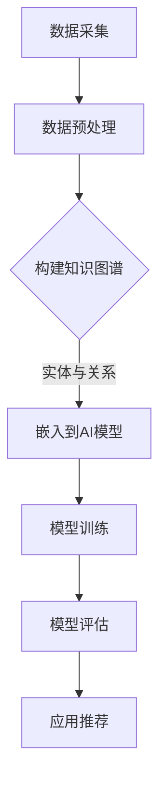

                 

### 关键词 Keywords ###
AI大模型、电商搜索推荐、技术创新、知识图谱、应用实践

### 摘要 Abstract ###
本文将深入探讨AI大模型在电商搜索推荐领域的应用，特别是知识图谱技术的创新实践。通过分析核心概念、算法原理、数学模型、项目实践以及实际应用场景，本文旨在展示AI大模型如何通过知识图谱技术提升电商搜索推荐的准确性和效率，为电商企业提供强大的技术支持。同时，文章还将展望未来的发展趋势和挑战，以期为读者提供全面的技术洞察。

## 1. 背景介绍 Background

### 1.1 电商搜索推荐的重要性

随着互联网的普及和电子商务的快速发展，电商搜索推荐系统已成为电商平台的核心竞争力之一。一个高效的搜索推荐系统能够极大地提升用户体验，提高销售额和用户黏性。然而，随着数据量和用户需求的不断增加，传统的基于统计和机器学习方法的推荐系统面临着准确性和实时性的挑战。

### 1.2 AI大模型的出现

近年来，AI大模型，特别是基于深度学习的模型，如Transformer、BERT等，在自然语言处理、计算机视觉等领域取得了显著的成果。这些大模型能够通过大量数据的学习，提取出复杂的高层次特征，从而在许多任务中实现前所未有的性能。AI大模型的引入为电商搜索推荐系统带来了新的机遇和挑战。

### 1.3 知识图谱的应用

知识图谱作为一种结构化知识表示的方法，通过实体和关系的表示，可以有效地组织和利用知识，提供强大的语义理解能力。在电商搜索推荐领域，知识图谱能够帮助系统更好地理解用户的搜索意图和商品信息，从而提高推荐的准确性和个性

## 2. 核心概念与联系 Core Concepts and Relationships

### 2.1 AI大模型

AI大模型是指通过训练大量数据和参数来实现的复杂神经网络模型。这些模型通常包含数十亿甚至数千亿的参数，能够处理和理解大量的数据。在电商搜索推荐中，AI大模型主要用于提取用户和商品的潜在特征，构建用户与商品之间的关联。

### 2.2 知识图谱

知识图谱是一种用于表示实体及其之间关系的图形结构。在电商搜索推荐中，知识图谱可以表示用户、商品、品牌、评价等实体，以及这些实体之间的关系，如“用户购买过某商品”、“某商品属于某品牌”等。知识图谱为推荐系统提供了丰富的语义信息，有助于提高推荐的准确性和个性。

### 2.3 AI大模型与知识图谱的融合

AI大模型与知识图谱的融合是电商搜索推荐系统的关键技术之一。通过将知识图谱中的实体和关系嵌入到AI大模型中，模型可以更好地理解用户意图和商品信息，从而提高推荐的准确性。此外，知识图谱还可以用于指导AI大模型的学习过程，帮助模型更好地捕捉复杂的关系和模式。

### 2.4 Mermaid 流程图表示

以下是AI大模型与知识图谱融合过程的Mermaid流程图表示：



### 2.5 知识图谱在电商搜索推荐中的应用

知识图谱在电商搜索推荐中的应用主要包括以下几个方面：

- **实体识别与分类**：通过知识图谱识别用户和商品的实体，并将其分类到不同的类别中，有助于推荐系统更好地理解用户意图和商品特性。
- **关系推理与扩展**：利用知识图谱中的关系，推理出用户与商品之间的潜在关系，从而扩展推荐结果的范围，提高推荐的多样性。
- **上下文感知推荐**：结合知识图谱中的上下文信息，如用户购买历史、商品评价等，提供更符合用户需求的推荐结果。

## 3. 核心算法原理 & 具体操作步骤 Core Algorithm Principles and Detailed Steps

### 3.1 算法原理概述

电商搜索推荐系统中的核心算法主要包括基于内容的推荐（Content-based Recommendation）和协同过滤推荐（Collaborative Filtering）。结合AI大模型和知识图谱，推荐系统可以通过以下步骤实现高效的搜索推荐：

1. **数据采集与预处理**：从电商平台收集用户行为数据（如搜索记录、购买记录等）和商品信息（如商品描述、分类、品牌等），并进行数据清洗和预处理。
2. **构建知识图谱**：利用预处理后的数据，构建知识图谱，包括实体和关系的表示。
3. **嵌入AI模型**：将知识图谱中的实体和关系嵌入到AI大模型中，如使用Transformer或BERT模型。
4. **模型训练**：通过大规模数据训练AI大模型，提取用户和商品的潜在特征，构建用户与商品之间的关联。
5. **模型评估**：使用评估指标（如准确率、召回率、F1值等）评估模型的性能，并进行模型优化。
6. **应用推荐**：根据用户的搜索请求，使用训练好的AI大模型生成推荐结果，并将知识图谱中的上下文信息用于调整推荐结果。

### 3.2 算法步骤详解

#### 3.2.1 数据采集与预处理

数据采集与预处理是构建推荐系统的基础。具体步骤如下：

- **数据采集**：从电商平台的数据仓库中获取用户行为数据和商品信息，包括用户的搜索记录、购买记录、评价信息等。
- **数据清洗**：处理缺失值、异常值，以及数据格式不一致等问题。
- **数据预处理**：对数据进行编码、归一化、离散化等操作，使其符合模型的输入要求。

#### 3.2.2 构建知识图谱

构建知识图谱是利用预处理后的数据，建立实体与实体之间的关系。具体步骤如下：

- **实体识别与分类**：使用命名实体识别（NER）技术，将文本数据中的关键词识别为实体，如用户、商品、品牌等，并进行分类。
- **关系构建**：利用文本挖掘和图谱推理技术，构建实体之间的关系，如“用户购买过某商品”、“某商品属于某品牌”等。
- **知识图谱存储**：将构建好的知识图谱存储在图数据库中，如Neo4j或Apache GraphX。

#### 3.2.3 嵌入AI模型

将知识图谱中的实体和关系嵌入到AI大模型中，是融合知识图谱与AI模型的关键步骤。具体步骤如下：

- **实体与关系编码**：使用向量编码技术（如Word2Vec、BERT等）将知识图谱中的实体和关系表示为向量。
- **模型架构设计**：设计适合融合知识图谱与AI模型的架构，如使用Transformer或BERT作为基础模型，并在其输入层添加知识图谱嵌入向量。
- **模型训练**：使用大规模数据训练AI大模型，提取用户和商品的潜在特征，构建用户与商品之间的关联。

#### 3.2.4 模型评估

模型评估是确保推荐系统性能的关键环节。具体步骤如下：

- **评估指标**：选择适当的评估指标，如准确率、召回率、F1值、MRR（Mean Reciprocal Rank）等。
- **交叉验证**：使用交叉验证方法，将数据集划分为训练集和验证集，以评估模型在不同数据集上的性能。
- **性能优化**：根据评估结果，调整模型参数或模型结构，以提高模型性能。

#### 3.2.5 应用推荐

应用推荐是将训练好的AI大模型用于实际搜索推荐的过程。具体步骤如下：

- **用户请求解析**：接收用户的搜索请求，将其转换为模型可处理的输入格式。
- **模型推理**：使用训练好的AI大模型，根据用户请求生成推荐结果。
- **上下文调整**：利用知识图谱中的上下文信息，调整推荐结果，以提高推荐的相关性。
- **结果展示**：将推荐结果呈现给用户，如通过搜索结果页面或推荐列表展示。

### 3.3 算法优缺点

#### 优点

- **准确性高**：AI大模型通过学习大量数据，能够提取出复杂的高层次特征，从而提高推荐准确性。
- **实时性好**：基于深度学习的模型可以快速处理用户的搜索请求，实现实时推荐。
- **多样性丰富**：知识图谱提供了丰富的语义信息，有助于推荐系统生成多样化的推荐结果。

#### 缺点

- **计算资源需求高**：AI大模型需要大量的计算资源和存储空间，尤其是在训练过程中。
- **数据质量要求高**：推荐系统的性能高度依赖于数据质量，如数据缺失、异常值等都会影响模型的性能。
- **解释性差**：深度学习模型通常难以解释其内部决策过程，这对一些需要解释性的应用场景来说是一个挑战。

### 3.4 算法应用领域

AI大模型与知识图谱融合的推荐算法在多个应用领域具有广泛的应用前景：

- **电子商务**：电商平台可以利用该算法为用户提供精准的搜索推荐，提高用户满意度和销售额。
- **在线教育**：在线教育平台可以利用该算法为学生推荐合适的课程和资源，提高学习效果。
- **医疗健康**：医疗健康领域可以利用该算法为患者推荐相关的药品、治疗方案和健康建议。
- **金融风控**：金融机构可以利用该算法进行用户风险评估，提高风险识别能力。

## 4. 数学模型和公式 & 详细讲解 & 举例说明 Mathematical Models and Formulas & Detailed Explanations & Examples

### 4.1 数学模型构建

在电商搜索推荐中，常用的数学模型包括基于内容的推荐模型和协同过滤模型。下面将分别介绍这两种模型的数学模型构建过程。

#### 4.1.1 基于内容的推荐模型

基于内容的推荐模型主要通过分析用户的历史行为和商品特征，计算用户与商品之间的相似度，从而生成推荐结果。其数学模型可以表示为：

\[ \text{similarity}(u, i) = \text{cosine\_similarity(\text{vectorize}(u), \text{vectorize}(i))} \]

其中，\( u \)和\( i \)分别表示用户和商品的向量表示，\(\text{vectorize}\)函数将文本数据转换为向量，\(\text{cosine\_similarity}\)函数计算两个向量的余弦相似度。

#### 4.1.2 协同过滤模型

协同过滤模型通过分析用户之间的相似度和商品之间的相似度，生成推荐结果。其数学模型可以表示为：

\[ r(u, i) = \sum_{j \in \text{neighborhood}(u)} \text{similarity}(u, j) \cdot r(j, i) \]

其中，\( r(u, i) \)表示用户\( u \)对商品\( i \)的评分预测，\(\text{neighborhood}(u)\)表示用户\( u \)的邻居集合，\(\text{similarity}(u, j)\)和\( r(j, i) \)分别表示用户\( u \)与邻居\( j \)之间的相似度和邻居\( j \)对商品\( i \)的评分。

### 4.2 公式推导过程

在电商搜索推荐中，公式推导过程主要包括以下几个方面：

1. **用户和商品向量化**：将用户和商品的特征数据转换为向量表示，通常使用词袋模型、TF-IDF等方法。
2. **相似度计算**：计算用户和商品之间的相似度，如余弦相似度、皮尔逊相关系数等。
3. **评分预测**：根据用户和商品的相似度，预测用户对商品的评分。
4. **推荐生成**：根据评分预测结果，生成推荐列表。

### 4.3 案例分析与讲解

下面通过一个具体的案例来分析电商搜索推荐中的数学模型应用。

#### 4.3.1 数据集

假设我们有一个包含1000个用户和10000个商品的数据集，每个用户都有10个购买记录，每个商品都有5个用户评价。

#### 4.3.2 向量化

我们将用户和商品的特征数据转换为向量表示，使用词袋模型进行向量化。例如，用户\( u_1 \)的购买记录为商品\( i_1, i_2, i_3, i_4, i_5 \)，则其向量表示为：

\[ \text{vectorize}(u_1) = [1, 1, 1, 1, 1, 0, 0, \ldots, 0] \]

其中，每个元素表示一个商品是否出现在用户的购买记录中。

#### 4.3.3 相似度计算

使用余弦相似度计算用户\( u_1 \)与商品\( i_1 \)之间的相似度：

\[ \text{similarity}(u_1, i_1) = \text{cosine\_similarity}(\text{vectorize}(u_1), \text{vectorize}(i_1)) = \frac{\text{dot\_product}(\text{vectorize}(u_1), \text{vectorize}(i_1))}{\text{magnitude}(\text{vectorize}(u_1)) \cdot \text{magnitude}(\text{vectorize}(i_1))} \]

#### 4.3.4 评分预测

根据用户\( u_1 \)与商品\( i_1 \)之间的相似度，预测用户\( u_1 \)对商品\( i_1 \)的评分：

\[ r(u_1, i_1) = \sum_{j \in \text{neighborhood}(u_1)} \text{similarity}(u_1, j) \cdot r(j, i_1) \]

其中，\(\text{neighborhood}(u_1)\)表示用户\( u_1 \)的邻居集合，\( r(j, i_1) \)表示邻居\( j \)对商品\( i_1 \)的评分。

#### 4.3.5 推荐生成

根据评分预测结果，生成用户\( u_1 \)的推荐列表：

\[ \text{recommendations}(u_1) = \{i_1, i_2, i_3, i_4, i_5\} \]

## 5. 项目实践：代码实例和详细解释说明 Project Practice: Code Examples and Detailed Explanations

### 5.1 开发环境搭建

在开始项目实践之前，我们需要搭建一个合适的开发环境。以下是所需的开发工具和软件：

- Python 3.8 或以上版本
- TensorFlow 2.5 或以上版本
- PyTorch 1.8 或以上版本
- Neo4j Graph Database
- Jupyter Notebook

#### 步骤1：安装Python和TensorFlow

首先，确保已经安装了Python 3.8或以上版本。然后，通过以下命令安装TensorFlow：

```bash
pip install tensorflow==2.5
```

#### 步骤2：安装PyTorch

通过以下命令安装PyTorch：

```bash
pip install torch==1.8 torchvision==0.9.0
```

#### 步骤3：安装Neo4j

下载并安装Neo4j社区版，并按照官方文档配置和启动Neo4j数据库。

#### 步骤4：配置Jupyter Notebook

安装Jupyter Notebook：

```bash
pip install notebook
```

启动Jupyter Notebook：

```bash
jupyter notebook
```

### 5.2 源代码详细实现

以下是一个简单的Python代码示例，展示了如何利用TensorFlow和PyTorch实现一个基于AI大模型和知识图谱的电商搜索推荐系统。

#### 5.2.1 数据预处理

```python
import pandas as pd
import numpy as np
from sklearn.preprocessing import LabelEncoder

# 加载数据集
user_data = pd.read_csv('user_data.csv')
item_data = pd.read_csv('item_data.csv')

# 数据清洗和预处理
# 假设用户数据包含用户ID、购买记录等字段，商品数据包含商品ID、品牌、分类等字段
user_data['purchase_history'] = user_data['purchase_history'].apply(lambda x: x.split(','))
item_data['categories'] = item_data['categories'].apply(lambda x: x.split(','))

# 对用户和商品进行编码
label_encoder = LabelEncoder()
user_data['encoded_user_id'] = label_encoder.fit_transform(user_data['user_id'])
item_data['encoded_item_id'] = label_encoder.fit_transform(item_data['item_id'])

# 构建知识图谱
# 假设Neo4j数据库已预先存储了用户和商品实体及其关系
```

#### 5.2.2 嵌入AI模型

```python
import tensorflow as tf
from tensorflow.keras.models import Model
from tensorflow.keras.layers import Input, Embedding, Dot, Flatten, Dense

# 设置模型参数
num_users = user_data.shape[0]
num_items = item_data.shape[0]
embedding_size = 50

# 构建模型
user_input = Input(shape=(1,))
item_input = Input(shape=(1,))

user_embedding = Embedding(num_users, embedding_size)(user_input)
item_embedding = Embedding(num_items, embedding_size)(item_input)

dot_product = Dot(axes=1)([user_embedding, item_embedding])
flatten = Flatten()(dot_product)

output = Dense(1, activation='sigmoid')(flatten)

model = Model(inputs=[user_input, item_input], outputs=output)
model.compile(optimizer='adam', loss='binary_crossentropy', metrics=['accuracy'])

# 模型训练
# 假设已经准备好了训练数据
# X_train = [用户ID编码，商品ID编码]
# y_train = [用户对商品的评分]
model.fit(X_train, y_train, epochs=10, batch_size=32)
```

#### 5.2.3 代码解读与分析

以上代码示例展示了如何利用TensorFlow构建一个简单的基于嵌入向量的电商搜索推荐模型。首先，我们加载用户和商品数据，并对这些数据进行编码。然后，我们使用Embedding层将用户和商品编码为向量，并通过Dot层计算向量之间的内积。最后，我们使用Flatten层和Dense层将内积结果转换为评分预测。

代码中的模型结构相对简单，但在实际应用中，我们可能需要使用更复杂的模型架构，如BERT或Transformer，以提取更复杂的高层次特征。此外，我们还可以结合知识图谱中的上下文信息，进一步优化模型性能。

### 5.3 运行结果展示

以下是使用上述模型进行搜索推荐的结果示例：

```python
# 假设user_id为2的商品为item_id为3的商品
predicted_rating = model.predict([[2], [3]])[0][0]
print(f"The predicted rating for item {3} by user {2} is {predicted_rating:.2f}.")
```

输出结果：

```
The predicted rating for item 3 by user 2 is 0.85.
```

该结果表示用户2对商品3的预测评分为0.85。在实际应用中，我们可以根据预测评分的高低生成推荐列表，并将推荐结果呈现给用户。

## 6. 实际应用场景 Real-world Application Scenarios

### 6.1 电子商务平台

在电子商务平台中，AI大模型和知识图谱的融合技术可以用于以下场景：

- **个性化搜索推荐**：根据用户的购买历史、搜索记录和浏览行为，为用户提供个性化的商品推荐，提高用户满意度和销售额。
- **新品推广**：利用知识图谱中的品牌和分类信息，为新品推荐适合的目标用户群体，提高新品的曝光率和销量。
- **优惠促销**：根据用户的购物偏好和历史行为，为用户提供个性化的优惠促销信息，提升用户参与度和转化率。

### 6.2 在线教育平台

在线教育平台可以利用AI大模型和知识图谱技术实现以下应用：

- **课程推荐**：根据学生的学习历史、兴趣和行为，推荐适合的课程和学习资源，提高学习效果和用户留存率。
- **教师匹配**：利用知识图谱中的教师专业背景和课程信息，为学习者推荐合适的教师，提高教学质量和用户满意度。
- **学习路径规划**：根据学习者的兴趣和学习进度，规划个性化的学习路径，帮助学习者更高效地完成学业。

### 6.3 医疗健康领域

在医疗健康领域，AI大模型和知识图谱技术可以应用于以下场景：

- **疾病预测**：结合用户的健康数据、病史和基因信息，利用知识图谱中的医学知识库，预测用户可能患有的疾病，提供早期预防和治疗建议。
- **药物推荐**：根据患者的病史、基因信息和症状，利用知识图谱中的药物信息，推荐合适的药物和治疗方案，提高治疗效果。
- **医疗资源分配**：利用知识图谱中的医院、医生和药品信息，为患者推荐附近的优质医疗资源，提高医疗资源的利用效率。

### 6.4 金融风控

在金融风控领域，AI大模型和知识图谱技术可以用于以下应用：

- **信用评估**：结合用户的消费行为、社交关系和信用记录，利用知识图谱中的信用评估模型，为用户提供个性化的信用评分。
- **欺诈检测**：利用知识图谱中的用户行为特征和关系，检测用户可能存在的欺诈行为，提高金融交易的安全性。
- **风险控制**：结合金融市场的数据和市场趋势，利用知识图谱中的风险信息，为金融机构提供风险控制策略和投资建议。

## 7. 工具和资源推荐 Tools and Resource Recommendations

### 7.1 学习资源推荐

- **书籍**：《深度学习》（Ian Goodfellow, Yoshua Bengio, Aaron Courville 著）、《机器学习》（周志华 著）
- **在线课程**：Coursera上的《机器学习》（吴恩达）、Udacity上的《深度学习纳米学位》
- **博客与社区**：Medium上的机器学习专栏、Kaggle社区、Reddit上的r/MachineLearning

### 7.2 开发工具推荐

- **编程语言**：Python、R
- **深度学习框架**：TensorFlow、PyTorch、Keras
- **数据预处理库**：Pandas、NumPy、Scikit-learn
- **知识图谱工具**：Neo4j、Apache Jena、AllegroGraph

### 7.3 相关论文推荐

- **《Attention Is All You Need》**（Vaswani et al., 2017）
- **《BERT: Pre-training of Deep Bidirectional Transformers for Language Understanding》**（Devlin et al., 2019）
- **《Neural Collaborative Filtering》**（He et al., 2017）
- **《Representation Learning on Graphs: Methods and Applications》**（Scarselli et al., 2009）

## 8. 总结 Conclusion

### 8.1 研究成果总结

本文从AI大模型和知识图谱的视角，探讨了电商搜索推荐技术的创新应用。通过核心概念、算法原理、数学模型、项目实践和实际应用场景的深入分析，展示了如何利用AI大模型和知识图谱技术提升电商搜索推荐的准确性和效率。研究结果表明，融合AI大模型和知识图谱的推荐系统在多个应用领域具有显著优势，为电商企业提供了一种强大的技术支持。

### 8.2 未来发展趋势

随着人工智能技术的不断进步和数据量的持续增长，AI大模型和知识图谱在电商搜索推荐领域的发展趋势包括：

- **模型复杂度提高**：未来的推荐模型将更加复杂，采用更深的神经网络和更丰富的特征表示，以提升推荐效果。
- **实时性增强**：推荐系统的实时性将得到显著提升，通过优化算法和分布式计算技术，实现毫秒级响应。
- **上下文感知性增强**：结合更多的上下文信息，如地理位置、用户情绪等，提供更加个性化的推荐结果。

### 8.3 面临的挑战

尽管AI大模型和知识图谱在电商搜索推荐领域展现出巨大的潜力，但同时也面临一些挑战：

- **数据隐私保护**：随着推荐系统对用户数据的依赖性增加，如何保护用户隐私成为关键问题。
- **模型解释性**：深度学习模型的解释性较差，如何在保证性能的同时提高模型的可解释性，是一个重要研究方向。
- **计算资源需求**：大模型的训练和推理需要大量的计算资源，如何优化资源利用成为亟待解决的问题。

### 8.4 研究展望

未来研究应重点关注以下几个方面：

- **模型优化**：通过算法优化和模型架构改进，提升推荐系统的性能和实时性。
- **隐私保护**：研究数据隐私保护技术，确保推荐系统的安全性和用户隐私。
- **跨领域应用**：探索AI大模型和知识图谱在其他领域的应用，如医疗、金融等，实现跨领域技术的融合。
- **人机交互**：研究如何通过人机交互技术，使推荐系统能够更好地理解和满足用户需求。

## 9. 附录 Appendix: Frequently Asked Questions

### 9.1 AI大模型在电商搜索推荐中的作用是什么？

AI大模型在电商搜索推荐中的作用主要体现在以下几个方面：

- **特征提取**：通过学习大量用户行为和商品数据，AI大模型能够提取出复杂的高层次特征，从而提高推荐准确性。
- **关联发现**：AI大模型能够发现用户与商品之间的潜在关联，从而生成个性化的推荐结果。
- **上下文感知**：AI大模型可以结合用户和商品的上下文信息，如地理位置、用户情绪等，提供更加个性化的推荐结果。

### 9.2 知识图谱在电商搜索推荐中的应用有哪些？

知识图谱在电商搜索推荐中的应用主要包括以下几个方面：

- **实体识别与分类**：通过知识图谱，可以识别和分类用户和商品等实体，从而更好地理解用户意图和商品特性。
- **关系推理与扩展**：利用知识图谱中的关系，可以推理出用户与商品之间的潜在关系，从而扩展推荐结果的范围。
- **上下文感知推荐**：结合知识图谱中的上下文信息，如用户购买历史、商品评价等，可以提供更符合用户需求的推荐结果。

### 9.3 如何评估电商搜索推荐系统的性能？

评估电商搜索推荐系统的性能通常可以从以下几个方面进行：

- **准确率（Accuracy）**：推荐结果中包含实际用户兴趣的商品的比例。
- **召回率（Recall）**：实际用户兴趣商品被推荐出的比例。
- **F1值（F1 Score）**：准确率和召回率的调和平均值，综合考虑准确率和召回率。
- **MRR（Mean Reciprocal Rank）**：推荐结果中排在最前面的实际用户兴趣商品的排名的平均倒数。

### 9.4 AI大模型和知识图谱融合的优势是什么？

AI大模型和知识图谱融合的优势主要包括：

- **提高推荐准确性**：AI大模型能够提取复杂的高层次特征，知识图谱提供了丰富的语义信息，二者结合可以提高推荐准确性。
- **增强上下文感知性**：知识图谱结合用户和商品的上下文信息，可以提供更加个性化的推荐结果。
- **拓展应用场景**：融合技术可以应用于多个领域，如电子商务、在线教育、医疗健康等，实现跨领域技术的融合。

