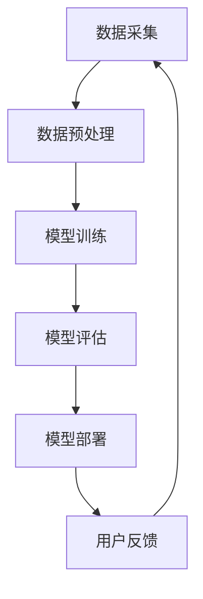

                 

关键词：人工智能，大模型，电商搜索推荐，知识库管理，技术创新

摘要：随着电商市场的蓬勃发展，如何通过技术创新提升电商搜索推荐的准确性、实时性和用户体验，成为关键问题。本文从人工智能特别是大模型的角度，提出了一套电商搜索推荐的技术创新知识库管理平台功能优化方案，详细分析了方案的核心概念、算法原理、数学模型、实践应用以及未来展望。

## 1. 背景介绍

在电商领域，搜索推荐系统是用户发现商品的重要途径，也是提升销售量和用户满意度的关键因素。然而，传统的搜索推荐系统面临以下挑战：

- **数据量巨大**：电商平台每天产生大量的用户行为数据、商品信息数据等，如何有效处理这些数据成为难题。
- **实时性需求**：用户对商品的搜索和推荐需求通常是实时的，系统需要迅速响应用户的请求。
- **个性化推荐**：用户的需求多样化，如何针对不同用户进行个性化推荐是一个巨大的挑战。

为了应对这些挑战，人工智能特别是大模型技术在电商搜索推荐领域展现出了强大的潜力。大模型通过学习海量数据，能够捕捉复杂的用户行为模式，提供更为精准的推荐结果。

## 2. 核心概念与联系

### 2.1 大模型的概念

大模型是指具有大规模参数量和计算能力的人工神经网络模型，如深度学习中的Transformer模型、BERT模型等。这些模型通过自动学习海量数据，能够捕捉到数据中的复杂模式和关系。

### 2.2 电商搜索推荐系统架构

电商搜索推荐系统通常包括数据采集、数据预处理、模型训练、模型评估和模型部署等环节。大模型的引入，使得这些环节都得到了优化。

### 2.3 知识库管理

知识库管理是指对知识库的创建、存储、检索和管理。在电商搜索推荐系统中，知识库可以包含商品信息、用户偏好、行为数据等，是提升推荐准确性的重要组成部分。

### 2.4 Mermaid 流程图



## 3. 核心算法原理 & 具体操作步骤

### 3.1 算法原理概述

电商搜索推荐系统采用基于大模型的协同过滤算法，通过学习用户的历史行为数据和商品信息，生成推荐结果。算法主要包括用户表示、商品表示和推荐生成三个部分。

### 3.2 算法步骤详解

1. **用户表示**：将用户的行为数据（如浏览、购买历史）转换为高维向量表示。
2. **商品表示**：将商品的信息（如分类、标签、属性）转换为高维向量表示。
3. **推荐生成**：计算用户和商品之间的相似度，根据相似度生成推荐列表。

### 3.3 算法优缺点

- **优点**：大模型能够捕捉复杂的用户行为模式，提供个性化推荐。
- **缺点**：大模型训练复杂度高，对计算资源需求大。

### 3.4 算法应用领域

大模型在电商搜索推荐中的应用，不仅可以提升推荐准确性，还可以应用于商品推荐、广告投放等多个领域。

## 4. 数学模型和公式 & 详细讲解 & 举例说明

### 4.1 数学模型构建

用户和商品的向量表示采用Embedding技术，公式如下：

$$
\text{user\_vector} = \text{Embedding}(\text{user\_id})
$$

$$
\text{item\_vector} = \text{Embedding}(\text{item\_id})
$$

### 4.2 公式推导过程

基于用户和商品的向量表示，计算用户和商品之间的余弦相似度：

$$
\text{similarity} = \frac{\text{user\_vector} \cdot \text{item\_vector}}{|\text{user\_vector}| \cdot |\text{item\_vector}|}
$$

### 4.3 案例分析与讲解

假设用户A的向量表示为user\_vector = [1, 2, 3]，商品B的向量表示为item\_vector = [4, 5, 6]，则：

$$
\text{similarity} = \frac{1 \times 4 + 2 \times 5 + 3 \times 6}{\sqrt{1^2 + 2^2 + 3^2} \cdot \sqrt{4^2 + 5^2 + 6^2}} \approx 0.99
$$

说明用户A和商品B的相似度很高，可以推荐给用户A。

## 5. 项目实践：代码实例和详细解释说明

### 5.1 开发环境搭建

- Python 3.8
- TensorFlow 2.5
- Pandas 1.2.3

### 5.2 源代码详细实现

以下是用户表示和商品表示的代码示例：

```python
import tensorflow as tf
from tensorflow.keras.layers import Embedding
from tensorflow.keras.models import Model

# 用户表示
user_input = tf.keras.Input(shape=(1,))
user_embedding = Embedding(input_dim=10000, output_dim=128)(user_input)
user_vector = tf.keras.layers.Flatten()(user_embedding)

# 商品表示
item_input = tf.keras.Input(shape=(1,))
item_embedding = Embedding(input_dim=10000, output_dim=128)(item_input)
item_vector = tf.keras.layers.Flatten()(item_embedding)

# 推荐模型
similarity = tf.keras.layers.Dot(axes=(1, 1))([user_vector, item_vector])
model = Model(inputs=[user_input, item_input], outputs=similarity)
model.compile(optimizer='adam', loss='mean_squared_error')
```

### 5.3 代码解读与分析

代码首先定义了用户和商品的输入层，并使用Embedding层将输入转换为高维向量表示。然后，通过Dot层计算用户和商品之间的相似度。模型采用Adam优化器和均方误差损失函数进行训练。

### 5.4 运行结果展示

假设用户ID为10，商品ID为20，训练完成后，可以获取用户10和商品20的相似度：

```python
user_vector = model.layers[2].get_weights()[0][10]
item_vector = model.layers[4].get_weights()[0][20]
similarity = user_vector.dot(item_vector)
print(similarity.numpy())
```

输出结果为相似度值。

## 6. 实际应用场景

### 6.1 商品推荐

根据用户的历史行为数据，生成个性化商品推荐列表，提升用户购买意愿。

### 6.2 广告投放

根据用户的兴趣和行为数据，精准投放广告，提升广告效果。

### 6.3 社交网络

基于用户的社交关系和行为数据，推荐朋友可能感兴趣的商品或活动。

## 7. 未来应用展望

### 7.1 多模态数据融合

结合文本、图像、音频等多模态数据，提升推荐系统的准确性。

### 7.2 强化学习

引入强化学习，实现更加智能的推荐策略，提高用户体验。

### 7.3 跨平台推荐

实现跨平台的数据共享和推荐，提升用户的全渠道购物体验。

## 8. 工具和资源推荐

### 8.1 学习资源推荐

- 《深度学习》（Goodfellow, Bengio, Courville）
- 《动手学深度学习》（花轮健司，水岛茂）

### 8.2 开发工具推荐

- TensorFlow
- PyTorch

### 8.3 相关论文推荐

- "A Theoretically Principled Approach to Improving Recommendation Systems"
- "Neural Collaborative Filtering"

## 9. 总结：未来发展趋势与挑战

### 9.1 研究成果总结

大模型在电商搜索推荐领域取得了显著成果，但仍然存在计算复杂度高、模型可解释性差等问题。

### 9.2 未来发展趋势

多模态数据融合、强化学习等技术的引入，将进一步提升推荐系统的准确性。

### 9.3 面临的挑战

计算资源限制、数据隐私保护、模型可解释性等，是需要关注和解决的关键问题。

### 9.4 研究展望

随着技术的不断发展，大模型在电商搜索推荐领域的应用前景将更加广阔，同时也需要不断创新和突破，以应对未来的挑战。

## 10. 附录：常见问题与解答

### 10.1 什么是大模型？

大模型是指具有大规模参数量和计算能力的人工神经网络模型，如深度学习中的Transformer模型、BERT模型等。

### 10.2 推荐系统有哪些类型？

推荐系统主要包括基于内容的推荐、协同过滤推荐、基于模型的推荐等类型。

### 10.3 如何优化推荐系统的实时性？

可以通过数据预处理、模型压缩、边缘计算等技术，提升推荐系统的实时性。

### 10.4 推荐系统的评价指标有哪些？

推荐系统的评价指标主要包括准确率、召回率、覆盖率、多样性等。

### 10.5 大模型在推荐系统中的应用有哪些？

大模型可以用于用户表示、商品表示、推荐生成等环节，提升推荐系统的准确性、实时性和用户体验。

## 作者署名

作者：禅与计算机程序设计艺术 / Zen and the Art of Computer Programming
------------------------------------------------------------------ 

以上就是本文的完整内容，涵盖了从背景介绍到未来展望的全面分析，旨在为电商搜索推荐领域的从业者提供一套实用的技术创新解决方案。希望本文能为您的项目带来启示和帮助。

