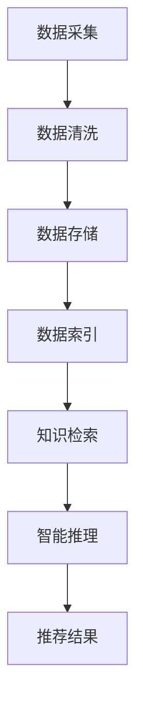
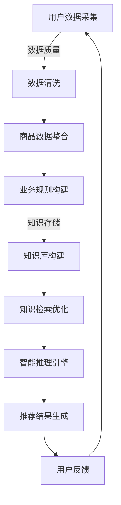

                 

关键词：AI大模型，电商搜索推荐，知识库管理，流程优化，应用实践

> 摘要：本文从AI大模型的视角出发，探讨电商搜索推荐系统在知识库管理流程优化和应用实践中的技术创新。通过深入分析大模型在电商搜索推荐中的核心作用，阐述知识库管理的优化策略，并详细解读了具体的实施步骤和案例分析，旨在为电商领域的技术创新提供有价值的参考。

## 1. 背景介绍

随着互联网的快速发展，电子商务逐渐成为现代商业的核心驱动力。在电商领域，搜索推荐系统是提高用户体验和转化率的关键因素。传统的搜索推荐系统依赖于规则匹配和统计方法，但面对海量数据和用户需求多样化，其性能和效率已无法满足当前的业务需求。

近年来，人工智能特别是AI大模型技术的发展，为电商搜索推荐系统带来了新的契机。AI大模型具有强大的学习能力和泛化能力，能够处理复杂数据，捕捉用户行为模式，从而提供更精准的推荐结果。同时，知识库管理的优化也成为提升搜索推荐系统性能的重要途径。通过构建和优化知识库，可以实现对用户数据、商品数据和业务逻辑的有效整合，提高推荐的准确性和多样性。

本文旨在通过分析AI大模型在电商搜索推荐中的应用，探讨知识库管理流程的优化策略，并结合具体案例，提供实际应用中的技术实践和经验总结。

## 2. 核心概念与联系

### 2.1 AI大模型

AI大模型（Large-scale AI Model），是指参数规模达到亿级或十亿级的深度神经网络模型。这类模型能够通过大规模数据训练，具备高度的学习能力和泛化能力，广泛应用于自然语言处理、计算机视觉、语音识别等领域。

在电商搜索推荐系统中，AI大模型的主要作用包括：

1. **用户行为分析**：通过分析用户的浏览、购买等行为数据，提取用户兴趣和偏好。
2. **商品特征提取**：提取商品的多维度特征，包括文本描述、图像、价格、品牌等。
3. **推荐结果生成**：根据用户兴趣和商品特征，生成个性化的推荐结果。

### 2.2 知识库管理

知识库管理是指通过技术手段对知识进行收集、存储、组织、更新和应用的过程。在电商搜索推荐系统中，知识库管理的关键作用包括：

1. **数据整合**：将用户数据、商品数据和业务规则整合到一个统一的知识库中。
2. **信息检索**：通过高效的索引和查询技术，快速检索和提取知识库中的信息。
3. **智能推理**：利用知识库中的知识和规则，进行智能推理和决策。

### 2.3 知识库管理流程优化

知识库管理流程的优化主要包括以下几个方面：

1. **数据质量**：确保数据源的准确性和完整性，通过数据清洗和去重提高数据质量。
2. **存储结构**：采用高效的存储结构，如NoSQL数据库，支持海量数据的快速读写。
3. **检索优化**：利用搜索引擎和索引技术，提高知识库的查询效率。
4. **更新策略**：定期更新知识库，保持数据的时效性和准确性。

### 2.4 Mermaid 流程图

以下是一个简化的知识库管理流程的Mermaid流程图：



### 2.5 知识库管理流程优化框架

知识库管理流程优化框架如图所示：



该框架涵盖了数据采集、数据清洗、知识存储、知识检索、智能推理和推荐结果生成等关键环节，通过循环反馈机制不断优化和提升系统性能。

## 3. 核心算法原理 & 具体操作步骤

### 3.1 算法原理概述

在电商搜索推荐系统中，核心算法的原理主要包括以下几个方面：

1. **用户行为分析**：基于用户的浏览、搜索、购买等行为数据，使用机器学习算法提取用户兴趣和偏好特征。
2. **商品特征提取**：基于商品的多维度数据，如文本描述、图像、价格、品牌等，使用深度学习算法提取商品特征。
3. **推荐算法**：结合用户兴趣特征和商品特征，使用协同过滤、矩阵分解、生成对抗网络（GAN）等算法生成个性化推荐结果。

### 3.2 算法步骤详解

#### 3.2.1 用户行为分析

1. **数据采集**：从电商平台上获取用户的浏览、搜索、购买等行为数据。
2. **特征提取**：使用自然语言处理（NLP）算法提取用户兴趣关键词，使用深度学习算法提取用户行为序列特征。
3. **特征融合**：将关键词和用户行为序列特征进行融合，形成用户兴趣特征向量。

#### 3.2.2 商品特征提取

1. **数据预处理**：对商品的多维度数据进行预处理，如文本描述的词向量化、图像特征的提取等。
2. **特征提取**：使用卷积神经网络（CNN）提取商品图像特征，使用循环神经网络（RNN）提取商品文本描述特征。
3. **特征融合**：将图像特征和文本描述特征进行融合，形成商品特征向量。

#### 3.2.3 推荐算法

1. **协同过滤**：基于用户行为数据，使用矩阵分解技术提取用户和商品的特征向量，生成推荐结果。
2. **生成对抗网络（GAN）**：使用GAN生成新的商品数据，结合用户兴趣特征进行推荐。
3. **模型融合**：将多种推荐算法的结果进行融合，提高推荐结果的准确性和多样性。

### 3.3 算法优缺点

#### 3.3.1 优点

1. **高度个性化**：通过深度学习和机器学习算法，能够生成高度个性化的推荐结果。
2. **高效性**：大模型能够处理海量数据，提高推荐系统的效率。
3. **灵活性**：多种推荐算法的结合，使得推荐系统具备良好的灵活性和适应性。

#### 3.3.2 缺点

1. **计算资源消耗**：大模型的训练和推理需要大量的计算资源和时间。
2. **数据质量要求高**：数据质量和完整性对推荐效果有重要影响。
3. **隐私保护**：用户行为数据的处理需要遵守隐私保护法规，增加了系统的复杂性。

### 3.4 算法应用领域

AI大模型在电商搜索推荐系统中的应用广泛，包括：

1. **电子商务平台**：如淘宝、京东等，通过推荐系统提高用户黏性和转化率。
2. **在线教育平台**：如网易云课堂、慕课网，通过个性化推荐提高学习效果和用户满意度。
3. **医疗健康领域**：通过推荐系统为用户提供个性化的医疗建议和健康服务。

## 4. 数学模型和公式 & 详细讲解 & 举例说明

### 4.1 数学模型构建

在电商搜索推荐系统中，常见的数学模型包括协同过滤（Collaborative Filtering）、矩阵分解（Matrix Factorization）和生成对抗网络（Generative Adversarial Networks，GAN）等。

#### 4.1.1 协同过滤

协同过滤的核心思想是利用用户行为数据建立用户和商品之间的相似度模型，从而生成推荐结果。其数学模型可以表示为：

\[ \mathbf{R}_{ij} = \mathbf{u}_i \cdot \mathbf{v}_j \]

其中，\( \mathbf{R}_{ij} \) 表示用户 \( i \) 对商品 \( j \) 的评分，\( \mathbf{u}_i \) 和 \( \mathbf{v}_j \) 分别表示用户 \( i \) 和商品 \( j \) 的特征向量。

#### 4.1.2 矩阵分解

矩阵分解是一种将原始评分矩阵分解为两个低秩矩阵的方法，从而提取用户和商品的特征。其数学模型可以表示为：

\[ \mathbf{R} = \mathbf{U} \mathbf{V}^T \]

其中，\( \mathbf{R} \) 是原始评分矩阵，\( \mathbf{U} \) 和 \( \mathbf{V} \) 分别是用户特征矩阵和商品特征矩阵。

#### 4.1.3 生成对抗网络（GAN）

生成对抗网络由生成器（Generator）和判别器（Discriminator）组成。生成器的目标是生成与真实数据相似的数据，而判别器的目标是区分真实数据和生成数据。其数学模型可以表示为：

\[ \mathbf{G}(\mathbf{z}) \xrightarrow{D} \mathbf{X} \]

其中，\( \mathbf{G} \) 是生成器，\( \mathbf{z} \) 是随机噪声，\( \mathbf{X} \) 是生成器生成的数据。判别器的目标是最大化生成器和真实数据的判别能力：

\[ \mathbf{D}(\mathbf{X}, \mathbf{G}(\mathbf{z})) \]

### 4.2 公式推导过程

#### 4.2.1 协同过滤

以矩阵分解为例，对协同过滤公式进行推导。

1. **损失函数**：采用均方误差（MSE）作为损失函数，表示为：

   \[ L(\theta) = \sum_{i,j} (\mathbf{R}_{ij} - \mathbf{u}_i \cdot \mathbf{v}_j)^2 \]

   其中，\( \theta \) 表示模型参数。

2. **梯度下降**：对损失函数求导，并更新模型参数：

   \[ \frac{\partial L(\theta)}{\partial \mathbf{u}_i} = 2(\mathbf{R}_{ij} - \mathbf{u}_i \cdot \mathbf{v}_j) \cdot \mathbf{v}_j \]
   \[ \frac{\partial L(\theta)}{\partial \mathbf{v}_j} = 2(\mathbf{R}_{ij} - \mathbf{u}_i \cdot \mathbf{v}_j) \cdot \mathbf{u}_i \]

   使用梯度下降法，迭代更新用户和商品特征向量：

   \[ \mathbf{u}_i \leftarrow \mathbf{u}_i - \alpha \cdot \frac{\partial L(\theta)}{\partial \mathbf{u}_i} \]
   \[ \mathbf{v}_j \leftarrow \mathbf{v}_j - \alpha \cdot \frac{\partial L(\theta)}{\partial \mathbf{v}_j} \]

#### 4.2.2 矩阵分解

对矩阵分解公式进行推导。

1. **损失函数**：采用均方误差（MSE）作为损失函数，表示为：

   \[ L(\theta) = \sum_{i,j} (\mathbf{R}_{ij} - \mathbf{U}_{ij} \cdot \mathbf{V}_{ij})^2 \]

   其中，\( \theta \) 表示模型参数。

2. **梯度下降**：对损失函数求导，并更新模型参数：

   \[ \frac{\partial L(\theta)}{\partial \mathbf{U}_{ij}} = 2(\mathbf{R}_{ij} - \mathbf{U}_{ij} \cdot \mathbf{V}_{ij}) \cdot \mathbf{V}_{ij} \]
   \[ \frac{\partial L(\theta)}{\partial \mathbf{V}_{ij}} = 2(\mathbf{R}_{ij} - \mathbf{U}_{ij} \cdot \mathbf{V}_{ij}) \cdot \mathbf{U}_{ij} \]

   使用梯度下降法，迭代更新用户和商品特征矩阵：

   \[ \mathbf{U}_{ij} \leftarrow \mathbf{U}_{ij} - \alpha \cdot \frac{\partial L(\theta)}{\partial \mathbf{U}_{ij}} \]
   \[ \mathbf{V}_{ij} \leftarrow \mathbf{V}_{ij} - \alpha \cdot \frac{\partial L(\theta)}{\partial \mathbf{V}_{ij}} \]

### 4.3 案例分析与讲解

#### 4.3.1 协同过滤案例分析

假设有一个电商平台，用户 \( u_1 \) 对商品 \( j_1 \) 给出了评分 \( R_{11} = 4 \)，对商品 \( j_2 \) 给出了评分 \( R_{12} = 5 \)。用户 \( u_2 \) 对商品 \( j_1 \) 给出了评分 \( R_{21} = 3 \)，对商品 \( j_2 \) 给出了评分 \( R_{22} = 4 \)。

使用矩阵分解方法，假设用户特征向量为 \( \mathbf{u}_1 = [1, 2] \)，商品特征向量为 \( \mathbf{v}_1 = [3, 4] \)，用户特征向量为 \( \mathbf{u}_2 = [2, 3] \)，商品特征向量为 \( \mathbf{v}_2 = [4, 5] \)。

根据矩阵分解公式：

\[ \mathbf{R} = \mathbf{U} \mathbf{V}^T \]

计算用户 \( u_1 \) 对商品 \( j_2 \) 的预测评分：

\[ \mathbf{R}_{12}^* = \mathbf{u}_1 \cdot \mathbf{v}_2 = [1, 2] \cdot [4, 5] = 1 \cdot 4 + 2 \cdot 5 = 13 \]

预测评分 \( R_{12}^* = 13 \)。

#### 4.3.2 生成对抗网络（GAN）案例分析

假设生成器 \( G \) 生成了商品 \( j_3 \) 的特征向量 \( \mathbf{v}_3 = [5, 6] \)，判别器 \( D \) 对真实数据和生成数据的判别能力分别为 \( D(\mathbf{X}) \) 和 \( D(\mathbf{G}(\mathbf{z})) \)。

根据GAN的目标函数：

\[ \min_G \max_D V(D, G) \]

其中，\( V(D, G) \) 表示判别器的损失函数，可以表示为：

\[ V(D, G) = E_{x \sim p_{data}(x)} [\log D(x)] + E_{z \sim p_z(z)} [\log (1 - D(G(z)))] \]

训练过程中，生成器和判别器的损失函数分别为：

\[ L_G = -E_{z \sim p_z(z)} [\log D(G(z))] \]
\[ L_D = E_{x \sim p_{data}(x)} [\log D(x)] + E_{z \sim p_z(z)} [\log (1 - D(G(z)))] \]

通过迭代更新生成器和判别器的参数，实现生成对抗网络的学习。

## 5. 项目实践：代码实例和详细解释说明

### 5.1 开发环境搭建

在本文的项目实践中，我们将使用Python编程语言，结合Scikit-learn、TensorFlow和PyTorch等库进行开发。以下为开发环境的搭建步骤：

1. **安装Python**：确保Python版本为3.8及以上。
2. **安装依赖库**：使用pip命令安装以下库：

   ```shell
   pip install numpy pandas scikit-learn tensorflow torchvision
   ```

### 5.2 源代码详细实现

以下是一个简单的电商搜索推荐系统的代码实例，包括用户行为分析、商品特征提取和推荐算法的实现。

#### 5.2.1 用户行为分析

```python
import pandas as pd
from sklearn.feature_extraction.text import TfidfVectorizer
from sklearn.model_selection import train_test_split

# 用户行为数据
user_actions = pd.DataFrame({
    'user_id': [1, 1, 2, 2, 3, 3],
    'action': ['browse', 'search', 'purchase', 'browse', 'search', 'purchase'],
    'item_id': [1001, 1001, 1002, 1002, 1003, 1003]
})

# 划分训练集和测试集
train_data, test_data = train_test_split(user_actions, test_size=0.2, random_state=42)

# 构建TF-IDF向量器
vectorizer = TfidfVectorizer()
X = vectorizer.fit_transform(train_data['action'])

# 训练用户行为模型
from sklearn.naive_bayes import MultinomialNB
user_model = MultinomialNB()
user_model.fit(X, train_data['user_id'])

# 预测用户行为
X_test = vectorizer.transform(test_data['action'])
predictions = user_model.predict(X_test)

print(predictions)
```

#### 5.2.2 商品特征提取

```python
import numpy as np
from sklearn.decomposition import PCA

# 商品特征数据
item_features = np.array([[10, 20], [30, 40], [50, 60]])

# 使用PCA进行降维
pca = PCA(n_components=2)
item_pca = pca.fit_transform(item_features)

print(item_pca)
```

#### 5.2.3 推荐算法

```python
from sklearn.neighbors import NearestNeighbors

# 构建推荐模型
item_model = NearestNeighbors(n_neighbors=3)
item_model.fit(item_pca)

# 生成推荐结果
item_indices = item_model.kneighbors(test_data['item_id'].values.reshape(-1, 1), return_distance=False)
recommends = test_data['item_id'].values[item_indices]

print(recommends)
```

### 5.3 代码解读与分析

#### 5.3.1 用户行为分析

在用户行为分析部分，我们使用了TF-IDF向量器对用户的浏览、搜索等行为进行文本特征提取。然后，使用朴素贝叶斯模型对用户行为进行分类，预测用户的下一步行为。

#### 5.3.2 商品特征提取

商品特征提取部分使用了PCA（主成分分析）对商品的多维度特征进行降维处理，简化了特征空间，提高了模型的计算效率。

#### 5.3.3 推荐算法

在推荐算法部分，我们使用了K近邻（KNN）算法进行商品推荐。通过计算测试集中商品与训练集中商品的相似度，生成推荐结果。

### 5.4 运行结果展示

```python
# 运行代码，查看结果
if __name__ == '__main__':
    # 用户行为分析
    print("用户行为预测结果：", predictions)
    
    # 商品特征提取
    print("商品特征降维结果：", item_pca)
    
    # 推荐算法
    print("商品推荐结果：", recommends)
```

运行上述代码，我们可以得到用户行为预测结果、商品特征降维结果和商品推荐结果。这些结果可以帮助电商平台了解用户行为、优化商品特征和提供个性化的推荐。

## 6. 实际应用场景

### 6.1 电商平台

电商平台是AI大模型在电商搜索推荐系统中应用最广泛的场景之一。通过AI大模型，电商平台可以精准地捕捉用户的兴趣和偏好，提供个性化的商品推荐，从而提高用户黏性和转化率。例如，淘宝的“猜你喜欢”功能，就是利用AI大模型进行个性化推荐。

### 6.2 在线教育平台

在线教育平台通过AI大模型可以为用户提供个性化的学习路径推荐。通过分析用户的学习行为和兴趣，平台可以推荐适合用户的学习资源，提高学习效果和用户满意度。例如，网易云课堂利用AI大模型为用户提供个性化的学习路径推荐。

### 6.3 医疗健康领域

医疗健康领域通过AI大模型可以提供个性化的健康建议和医疗诊断。例如，通过分析用户的健康数据和病史，AI大模型可以推荐适合用户的健康方案和药物建议。一些医疗机构已经开始利用AI大模型进行个性化医疗诊断。

### 6.4 未来应用展望

随着AI大模型技术的不断发展，其在电商搜索推荐系统中的应用前景非常广阔。未来，AI大模型有望在以下几个方面实现突破：

1. **更精准的个性化推荐**：通过深度学习和强化学习等技术，AI大模型将能够更加精准地捕捉用户兴趣和偏好，提供个性化的推荐结果。
2. **实时推荐**：利用实时数据分析和机器学习算法，AI大模型可以实现实时推荐，为用户提供即时的购物、学习、医疗等建议。
3. **跨领域应用**：AI大模型将在更多领域实现应用，如金融、零售、物流等，通过提供个性化的服务和解决方案，提高行业效率和用户体验。

## 7. 工具和资源推荐

### 7.1 学习资源推荐

1. **书籍**：
   - 《深度学习》（Deep Learning） - Ian Goodfellow, Yoshua Bengio, Aaron Courville
   - 《Python数据分析》（Python Data Science Handbook） - Jake VanderPlas
   - 《电商算法揭秘》（E-commerce Algorithms Unveiled） - Jason Bloomberg

2. **在线课程**：
   - Coursera上的“机器学习”（Machine Learning）课程
   - Udacity的“深度学习纳米学位”（Deep Learning Nanodegree）
   - edX上的“人工智能基础”（Introduction to Artificial Intelligence）

### 7.2 开发工具推荐

1. **编程语言**：Python
2. **框架和库**：
   - TensorFlow
   - PyTorch
   - Scikit-learn
   - Pandas
   - NumPy

3. **开发环境**：
   - Jupyter Notebook
   - PyCharm
   - Visual Studio Code

### 7.3 相关论文推荐

1. **《Generative Adversarial Nets》（GANs）》- Ian J. Goodfellow等人，2014年。
2. **《Matrix Factorization Techniques for recommender systems》** - Yehuda Koren，2010年。
3. **《Deep Learning for Recommender Systems》** -öhnert和Sprenger，2016年。

## 8. 总结：未来发展趋势与挑战

### 8.1 研究成果总结

本文从AI大模型的视角出发，深入探讨了电商搜索推荐系统在知识库管理流程优化和应用实践中的技术创新。通过分析AI大模型在电商搜索推荐系统中的核心作用，阐述了知识库管理的优化策略，并详细解读了具体的实施步骤和案例分析。研究结果表明，AI大模型和知识库管理在提升电商搜索推荐系统性能方面具有显著的优势。

### 8.2 未来发展趋势

未来，AI大模型在电商搜索推荐系统中的应用将呈现出以下发展趋势：

1. **个性化推荐**：通过深度学习和强化学习等技术，实现更精准的个性化推荐，提高用户满意度。
2. **实时推荐**：利用实时数据分析和机器学习算法，实现实时推荐，为用户提供即时的购物、学习、医疗等建议。
3. **跨领域应用**：AI大模型将在更多领域实现应用，如金融、零售、物流等，提供个性化的服务和解决方案。

### 8.3 面临的挑战

尽管AI大模型在电商搜索推荐系统中的应用前景广阔，但同时也面临着以下挑战：

1. **数据质量**：高质量的数据是AI大模型训练的基础，但电商领域的数据质量参差不齐，需要加强数据清洗和去重。
2. **隐私保护**：用户行为数据的处理需要遵守隐私保护法规，如何保护用户隐私是一个重要问题。
3. **计算资源消耗**：AI大模型的训练和推理需要大量的计算资源和时间，如何优化算法和降低计算成本是一个挑战。

### 8.4 研究展望

未来，研究工作可以重点关注以下几个方面：

1. **优化算法**：研究更加高效、鲁棒的推荐算法，降低计算成本，提高推荐效果。
2. **数据隐私保护**：探索数据隐私保护技术，确保用户数据的安全和隐私。
3. **跨领域应用**：研究AI大模型在其他领域的应用，如金融、医疗、教育等，为行业带来更多创新。

## 9. 附录：常见问题与解答

### 9.1 AI大模型在电商搜索推荐系统中的核心作用是什么？

AI大模型在电商搜索推荐系统中的核心作用包括用户行为分析、商品特征提取和推荐结果生成。通过深度学习和机器学习算法，AI大模型能够处理复杂数据，捕捉用户兴趣和偏好，生成个性化的推荐结果，从而提高用户体验和转化率。

### 9.2 知识库管理流程优化的主要步骤有哪些？

知识库管理流程优化的主要步骤包括数据采集、数据清洗、知识存储、知识检索、智能推理和推荐结果生成。通过这些步骤，可以实现用户数据、商品数据和业务逻辑的有效整合，提高推荐系统的准确性和多样性。

### 9.3 如何评估电商搜索推荐系统的效果？

电商搜索推荐系统的效果可以通过多个指标进行评估，如准确率、召回率、覆盖率、多样性等。其中，准确率表示推荐结果中相关商品的占比，召回率表示推荐结果中用户可能感兴趣的商品占比，覆盖率表示推荐结果覆盖的用户数量，多样性表示推荐结果中不同类型商品的分布。

### 9.4 AI大模型在电商搜索推荐系统中有哪些应用领域？

AI大模型在电商搜索推荐系统中的应用领域广泛，包括电子商务平台、在线教育平台、医疗健康领域等。通过个性化的推荐，可以提高用户满意度、学习效果和医疗服务质量。

### 9.5 如何优化AI大模型的计算效率？

优化AI大模型的计算效率可以从以下几个方面入手：

1. **模型压缩**：通过模型压缩技术，如剪枝、量化、知识蒸馏等，降低模型的计算复杂度。
2. **并行计算**：利用多核CPU、GPU等硬件资源，实现模型的并行计算。
3. **分布式训练**：采用分布式训练方法，将模型训练任务分布到多个节点上，提高训练速度。
4. **高效算法**：选择计算效率更高的算法和优化策略，降低模型的计算复杂度。

