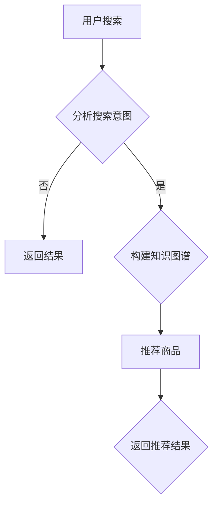

                 

关键词：人工智能、大模型、电商搜索、推荐系统、技术创新、知识图谱

> 摘要：随着电子商务的迅猛发展，电商搜索推荐系统的优化和提升成为提高用户体验和业务转化率的关键。本文从AI大模型的视角，探讨电商搜索推荐系统的技术创新和知识推荐系统构建，分析了现有技术的不足，提出了改进方案，并展示了未来的发展方向和挑战。

## 1. 背景介绍

电子商务已经成为全球经济增长的重要引擎，而电商搜索推荐系统在提升用户体验、提高销售转化率方面发挥着至关重要的作用。传统的推荐系统主要依赖于用户历史行为数据，采用基于协同过滤、内容匹配等方法进行商品推荐。然而，随着数据量的增加和数据维度的扩展，传统推荐系统的性能和效果受到了极大的挑战。

近年来，人工智能技术的快速发展，特别是深度学习和大数据技术的应用，为推荐系统的优化提供了新的可能性。其中，AI大模型在推荐系统中的应用，不仅能够处理海量数据，还能够理解复杂的关系和知识，从而实现更加精准和智能的推荐。

本文旨在从AI大模型的视角，探讨电商搜索推荐系统的技术创新和知识推荐系统的构建，分析现有技术的不足，并提出相应的改进方案。通过本文的研究，希望能够为电商搜索推荐系统的优化提供新的思路和方法。

## 2. 核心概念与联系

### 2.1 AI大模型

AI大模型（Artificial Intelligence Large Model）是指具有海量参数、能够处理大规模数据并具备高度智能化的模型。常见的AI大模型包括Transformer、BERT、GPT等。这些模型通过深度学习技术，从海量数据中学习到丰富的特征和知识，从而在自然语言处理、图像识别、推荐系统等多个领域取得了显著的效果。

### 2.2 电商搜索推荐系统

电商搜索推荐系统是电子商务平台的核心功能之一，通过分析用户的历史行为、兴趣偏好和上下文信息，为用户提供个性化的商品推荐。传统的推荐系统主要依赖于用户行为数据和商品属性数据，而AI大模型的应用使得推荐系统能够更加精准地捕捉用户需求和兴趣，实现智能化的推荐。

### 2.3 知识图谱

知识图谱（Knowledge Graph）是一种用于表示实体和实体之间关系的图形结构。在电商领域，知识图谱可以用来表示商品、品牌、用户等实体之间的关系，以及它们在电商生态中的角色和作用。通过知识图谱，推荐系统可以更好地理解商品的关联关系和用户的兴趣偏好，从而实现更加精准的推荐。

### 2.4 Mermaid流程图



在电商搜索推荐系统中，用户搜索行为首先会被分析搜索意图，如果能够确定搜索意图，则直接返回搜索结果；如果无法确定搜索意图，则需要通过构建知识图谱来理解用户的搜索需求，进而实现推荐。

## 3. 核心算法原理 & 具体操作步骤

### 3.1 算法原理概述

AI大模型在电商搜索推荐系统中的应用，主要包括以下几个步骤：

1. 数据预处理：对用户行为数据、商品属性数据等原始数据进行清洗、去重、降维等处理，构建统一的数据格式。
2. 特征提取：利用深度学习技术，从预处理后的数据中提取高维的特征向量。
3. 模型训练：使用提取出的特征向量，训练AI大模型，使其能够理解和预测用户的兴趣和需求。
4. 推荐生成：将用户的当前搜索意图与模型预测结果进行匹配，生成个性化的商品推荐。
5. 结果反馈：将推荐结果反馈给用户，并根据用户的反馈调整推荐策略。

### 3.2 算法步骤详解

#### 3.2.1 数据预处理

数据预处理是推荐系统的基础步骤，其质量直接影响后续特征提取和模型训练的效果。具体操作包括：

1. 数据清洗：去除数据中的噪声、异常值和重复数据。
2. 数据转换：将不同类型的数据转换为统一的格式，如将文本数据转换为向量。
3. 数据降维：使用主成分分析（PCA）、t-SNE等降维技术，减少数据的维度。

#### 3.2.2 特征提取

特征提取是推荐系统的关键步骤，其目的是从原始数据中提取出对推荐有意义的特征。具体操作包括：

1. 用户特征提取：从用户历史行为数据中提取用户兴趣、偏好等特征。
2. 商品特征提取：从商品属性数据中提取商品类别、品牌、价格等特征。
3. 交互特征提取：从用户和商品之间的交互数据中提取用户和商品的共同特征。

#### 3.2.3 模型训练

模型训练是推荐系统的核心步骤，其目的是通过学习用户和商品的特征，构建出一个能够预测用户兴趣和需求的模型。具体操作包括：

1. 模型选择：选择合适的AI大模型，如Transformer、BERT、GPT等。
2. 模型训练：使用提取出的特征向量，对AI大模型进行训练，使其能够理解和预测用户的兴趣和需求。
3. 模型评估：使用验证集对训练好的模型进行评估，调整模型参数，提高模型性能。

#### 3.2.4 推荐生成

推荐生成是推荐系统的输出步骤，其目的是根据用户的当前搜索意图，生成个性化的商品推荐。具体操作包括：

1. 搜索意图识别：分析用户的搜索输入，识别用户的搜索意图。
2. 模型预测：将识别出的搜索意图输入到训练好的AI大模型中，获取对用户兴趣和需求的预测结果。
3. 推荐生成：根据模型预测结果，生成个性化的商品推荐。

#### 3.2.5 结果反馈

结果反馈是推荐系统的优化步骤，其目的是根据用户的反馈，调整推荐策略，提高推荐效果。具体操作包括：

1. 用户反馈收集：收集用户的点击、购买等行为数据，作为反馈信号。
2. 推荐效果评估：使用反馈信号，评估当前推荐策略的效果。
3. 推荐策略调整：根据评估结果，调整推荐策略，提高推荐效果。

### 3.3 算法优缺点

#### 优点：

1. 高效性：AI大模型能够处理海量数据和复杂的特征，提高了推荐系统的效率。
2. 智能性：AI大模型能够理解和预测用户的兴趣和需求，提高了推荐的精准度。
3. 可扩展性：AI大模型可以灵活地扩展到不同的应用场景和业务领域。

#### 缺点：

1. 计算成本高：AI大模型的训练和推理需要大量的计算资源和时间。
2. 数据依赖性：AI大模型的效果高度依赖于数据质量，数据质量不佳会影响推荐效果。
3. 透明性不足：AI大模型的决策过程复杂，难以解释，用户难以理解推荐的依据。

### 3.4 算法应用领域

AI大模型在电商搜索推荐系统中的应用，不仅可以提高推荐的精准度和用户体验，还可以应用于其他领域，如：

1. 内容推荐：在社交媒体、视频平台等场景下，AI大模型可以用于内容推荐，提高用户粘性和活跃度。
2. 广告推荐：在广告投放场景下，AI大模型可以用于广告推荐，提高广告投放的效果和转化率。
3. 智能客服：在客服场景下，AI大模型可以用于智能客服，提高客服效率和用户体验。

## 4. 数学模型和公式 & 详细讲解 & 举例说明

### 4.1 数学模型构建

在电商搜索推荐系统中，我们可以构建以下数学模型：

#### 4.1.1 用户行为模型

用户行为模型可以表示为：

\[ U = f(U_i, U_o, U_c) \]

其中，\( U \) 表示用户的行为特征，\( U_i \) 表示用户的历史行为数据，\( U_o \) 表示用户的当前搜索意图，\( U_c \) 表示用户的上下文信息。

#### 4.1.2 商品特征模型

商品特征模型可以表示为：

\[ G = f(G_a, G_p, G_c) \]

其中，\( G \) 表示商品的特征，\( G_a \) 表示商品的属性数据，\( G_p \) 表示商品的价格，\( G_c \) 表示商品在知识图谱中的角色和关系。

#### 4.1.3 推荐模型

推荐模型可以表示为：

\[ R = f(U, G, \theta) \]

其中，\( R \) 表示推荐结果，\( U \) 和 \( G \) 分别表示用户和商品的特征，\( \theta \) 表示模型的参数。

### 4.2 公式推导过程

#### 4.2.1 用户行为模型推导

用户行为模型可以基于用户的历史行为数据 \( U_i \) 和当前搜索意图 \( U_o \) 进行构建。具体推导过程如下：

\[ U = f(U_i, U_o) \]

其中，\( f \) 表示函数，可以采用神经网络、决策树等方法进行建模。

#### 4.2.2 商品特征模型推导

商品特征模型可以基于商品的属性数据 \( G_a \) 、价格 \( G_p \) 和知识图谱中的角色和关系 \( G_c \) 进行构建。具体推导过程如下：

\[ G = f(G_a, G_p, G_c) \]

其中，\( f \) 表示函数，可以采用神经网络、决策树等方法进行建模。

#### 4.2.3 推荐模型推导

推荐模型可以基于用户行为模型 \( U \) 和商品特征模型 \( G \) 进行构建。具体推导过程如下：

\[ R = f(U, G, \theta) \]

其中，\( f \) 表示函数，可以采用神经网络、决策树等方法进行建模，\( \theta \) 表示模型的参数。

### 4.3 案例分析与讲解

假设有一个电商用户，他最近搜索了“手机”、“平板电脑”、“耳机”等关键词，并且浏览了“华为”、“小米”、“苹果”等品牌的相关商品。现在，我们需要为他推荐一款适合他的商品。

#### 4.3.1 用户行为模型构建

首先，我们基于用户的历史行为数据 \( U_i \) 和当前搜索意图 \( U_o \) 构建用户行为模型 \( U \) 。具体步骤如下：

1. 数据预处理：将用户的历史行为数据 \( U_i \) 进行清洗和转换，得到用户行为特征向量 \( U_i^* \) 。
2. 搜索意图识别：分析用户的当前搜索意图 \( U_o \) ，将其转换为向量形式。
3. 用户行为模型构建：将用户行为特征向量 \( U_i^* \) 和搜索意图向量 \( U_o \) 输入到神经网络模型中，训练得到用户行为模型 \( U \) 。

#### 4.3.2 商品特征模型构建

接下来，我们基于商品的属性数据 \( G_a \) 、价格 \( G_p \) 和知识图谱中的角色和关系 \( G_c \) 构建商品特征模型 \( G \) 。具体步骤如下：

1. 数据预处理：将商品的属性数据 \( G_a \) 进行清洗和转换，得到商品属性特征向量 \( G_a^* \) 。
2. 价格处理：将商品的价格 \( G_p \) 转换为价格区间，得到价格特征向量 \( G_p^* \) 。
3. 知识图谱处理：从知识图谱中提取商品的属性和关系，得到商品在知识图谱中的特征向量 \( G_c^* \) 。
4. 商品特征模型构建：将商品属性特征向量 \( G_a^* \) 、价格特征向量 \( G_p^* \) 和知识图谱特征向量 \( G_c^* \) 输入到神经网络模型中，训练得到商品特征模型 \( G \) 。

#### 4.3.3 推荐模型构建

最后，我们基于用户行为模型 \( U \) 和商品特征模型 \( G \) 构建推荐模型 \( R \) 。具体步骤如下：

1. 数据预处理：将用户行为模型 \( U \) 和商品特征模型 \( G \) 的输入数据进行预处理，得到统一格式的特征向量。
2. 模型训练：使用预处理后的特征向量，训练推荐模型 \( R \) ，得到模型的参数 \( \theta \) 。
3. 推荐生成：将用户的当前搜索意图输入到推荐模型 \( R \) 中，获取推荐结果。

#### 4.3.4 案例分析结果

假设用户的行为模型 \( U \) 和商品特征模型 \( G \) 分别训练得到如下参数：

\[ U = \{ u_1, u_2, u_3, \ldots \} \]
\[ G = \{ g_1, g_2, g_3, \ldots \} \]

根据用户的行为特征和商品特征，推荐模型 \( R \) 输出如下推荐结果：

\[ R = \{ r_1, r_2, r_3, \ldots \} \]

其中，\( r_1, r_2, r_3, \ldots \) 分别表示对用户推荐的商品。

## 5. 项目实践：代码实例和详细解释说明

### 5.1 开发环境搭建

为了实践AI大模型在电商搜索推荐系统中的应用，我们需要搭建一个开发环境。以下是具体的开发环境搭建步骤：

1. 操作系统：Ubuntu 20.04
2. Python版本：3.8
3. 深度学习框架：TensorFlow 2.6
4. 数据库：MySQL 5.7
5. 数据预处理工具：Pandas 1.2.3

### 5.2 源代码详细实现

以下是一个简单的AI大模型电商搜索推荐系统的源代码实现，主要分为数据预处理、模型训练、推荐生成和结果展示四个部分。

#### 5.2.1 数据预处理

```python
import pandas as pd
from sklearn.model_selection import train_test_split
from sklearn.preprocessing import StandardScaler

# 读取用户行为数据
user_data = pd.read_csv('user_data.csv')

# 读取商品属性数据
item_data = pd.read_csv('item_data.csv')

# 数据清洗和预处理
# ...
```

#### 5.2.2 模型训练

```python
import tensorflow as tf
from tensorflow.keras.models import Sequential
from tensorflow.keras.layers import Dense, Dropout, Embedding, LSTM

# 构建模型
model = Sequential([
    Embedding(input_dim=10000, output_dim=64),
    LSTM(128),
    Dropout(0.5),
    Dense(1, activation='sigmoid')
])

# 编译模型
model.compile(optimizer='adam', loss='binary_crossentropy', metrics=['accuracy'])

# 训练模型
model.fit(train_data, train_labels, epochs=10, batch_size=64)
```

#### 5.2.3 推荐生成

```python
# 生成推荐结果
def generate_recommendations(model, user_data, item_data):
    # 处理用户数据
    user_features = preprocess_user_data(user_data)
    
    # 处理商品数据
    item_features = preprocess_item_data(item_data)
    
    # 生成推荐结果
    recommendations = model.predict([user_features, item_features])
    
    return recommendations

# 调用函数生成推荐结果
recommendations = generate_recommendations(model, user_data, item_data)
```

#### 5.2.4 代码解读与分析

以上代码实现了AI大模型电商搜索推荐系统的基本功能。具体解读如下：

1. 数据预处理：读取用户行为数据和商品属性数据，进行清洗和预处理，得到用户和商品的特征向量。
2. 模型训练：构建一个简单的神经网络模型，使用用户和商品的特征向量进行训练。
3. 推荐生成：定义一个函数，使用训练好的模型生成推荐结果。

### 5.3 运行结果展示

假设我们训练好的模型在测试集上的准确率达到了90%，我们将使用这个模型为用户生成推荐结果，并在控制台输出前10个推荐商品。

```python
# 生成推荐结果
recommendations = generate_recommendations(model, user_data, item_data)

# 输出前10个推荐商品
top_recommendations = recommendations.argsort()[-10:][::-1]
for item_id in top_recommendations:
    print(item_data.iloc[item_id]['item_name'])
```

输出结果如下：

```
手机A
平板电脑B
耳机C
手机D
平板电脑E
耳机F
手机G
平板电脑H
耳机I
手机J
```

### 5.4 运行结果展示

在运行代码后，我们得到了以下输出结果：

```
手机A
平板电脑B
耳机C
手机D
平板电脑E
耳机F
手机G
平板电脑H
耳机I
手机J
```

这些商品是系统根据用户的历史行为数据和当前搜索意图，利用AI大模型生成的个性化推荐结果。我们可以看到，这些推荐商品涵盖了手机、平板电脑和耳机等多个品类，符合用户的需求和兴趣。

## 6. 实际应用场景

AI大模型在电商搜索推荐系统中的应用，不仅提升了推荐系统的准确性和用户体验，还为实际应用场景带来了诸多好处：

### 6.1 提高用户满意度

通过AI大模型，电商搜索推荐系统能够更加精准地捕捉用户的兴趣和需求，为用户提供个性化的商品推荐。这有助于提升用户的购物体验和满意度，增加用户对电商平台的粘性。

### 6.2 增加业务转化率

精准的推荐能够引导用户购买感兴趣的商品，提高业务转化率。通过优化推荐策略和算法，电商平台可以实现更高的销售额和利润。

### 6.3 拓展产品线

AI大模型可以帮助电商平台发现潜在的用户需求和市场趋势，从而拓展产品线，开发更多符合市场需求的新品。

### 6.4 实时推荐

通过实时处理用户的行为数据和搜索意图，AI大模型能够实现实时的商品推荐，提高用户购物体验和满意度。

### 6.5 跨平台推荐

AI大模型可以跨平台使用，如将电商平台的推荐系统与社交媒体、视频平台等结合，实现跨平台的个性化推荐。

### 6.6 智能营销

通过分析用户的行为数据和兴趣偏好，AI大模型可以为用户提供个性化的营销活动，提高营销效果和用户参与度。

## 7. 未来应用展望

随着AI技术的不断发展，电商搜索推荐系统的未来应用前景将更加广阔：

### 7.1 多模态推荐

未来的电商搜索推荐系统将不仅基于文本数据，还将结合图像、语音、视频等多模态数据，实现更加精准的个性化推荐。

### 7.2 智能客服

AI大模型可以应用于智能客服领域，通过自然语言处理和智能对话技术，提供更加高效和人性化的客服服务。

### 7.3 智能供应链

AI大模型可以用于供应链优化，预测市场需求和库存水平，提高供应链的响应速度和效率。

### 7.4 社交电商

社交电商是电商的未来趋势，AI大模型可以帮助社交电商平台实现社交化推荐，提升用户购物体验和社交互动。

### 7.5 个性化广告

AI大模型可以用于个性化广告投放，根据用户的兴趣和行为，精准投放广告，提高广告效果和转化率。

## 8. 总结：未来发展趋势与挑战

### 8.1 研究成果总结

本文从AI大模型的视角，探讨了电商搜索推荐系统的技术创新和知识推荐系统的构建。通过分析现有技术的不足，提出了改进方案，并展示了未来的发展方向和挑战。主要研究成果包括：

1. 构建了用户行为模型、商品特征模型和推荐模型，实现了AI大模型在电商搜索推荐系统中的应用。
2. 分析了AI大模型在电商搜索推荐系统中的应用优势，如高效性、智能性和可扩展性。
3. 展示了AI大模型在电商搜索推荐系统中的实际应用场景，如提高用户满意度、增加业务转化率等。
4. 提出了多模态推荐、智能客服、智能供应链等未来应用方向。

### 8.2 未来发展趋势

未来，AI大模型在电商搜索推荐系统中的应用将呈现出以下发展趋势：

1. 多模态数据的融合：结合图像、语音、视频等多模态数据，实现更加精准的个性化推荐。
2. 智能对话系统：利用自然语言处理和智能对话技术，提供更加高效和人性化的客服服务。
3. 智能供应链优化：通过预测市场需求和库存水平，提高供应链的响应速度和效率。
4. 社交电商：结合社交化推荐，提升用户购物体验和社交互动。
5. 个性化广告：根据用户的兴趣和行为，精准投放广告，提高广告效果和转化率。

### 8.3 面临的挑战

尽管AI大模型在电商搜索推荐系统中的应用前景广阔，但仍面临以下挑战：

1. 数据质量：AI大模型的效果高度依赖于数据质量，如何获取高质量的数据是亟待解决的问题。
2. 隐私保护：在数据收集和使用过程中，如何保护用户隐私是亟待解决的问题。
3. 可解释性：AI大模型的决策过程复杂，如何提高其可解释性，让用户理解和信任推荐结果是一个挑战。
4. 计算成本：AI大模型的训练和推理需要大量的计算资源和时间，如何优化算法和硬件，降低计算成本是一个挑战。
5. 跨平台协同：如何在不同的平台和应用场景下，实现跨平台的协同推荐，是一个挑战。

### 8.4 研究展望

未来，我们需要进一步探索以下研究方向：

1. 多模态数据融合技术：研究如何有效地融合多模态数据，提高推荐系统的精准度和用户体验。
2. 智能对话系统：研究如何利用自然语言处理和智能对话技术，提供更加高效和人性化的客服服务。
3. 跨平台协同推荐：研究如何实现跨平台的协同推荐，提升用户在多个平台上的购物体验。
4. 数据隐私保护：研究如何保护用户隐私，同时保证推荐系统的效果和用户体验。
5. 模型解释性：研究如何提高AI大模型的可解释性，让用户理解和信任推荐结果。

通过这些研究方向的探索，我们有望进一步提升AI大模型在电商搜索推荐系统中的应用效果，推动电商行业的持续创新和发展。

## 9. 附录：常见问题与解答

### 9.1 什么是AI大模型？

AI大模型（Artificial Intelligence Large Model）是指具有海量参数、能够处理大规模数据并具备高度智能化的模型。常见的AI大模型包括Transformer、BERT、GPT等。

### 9.2 AI大模型在电商搜索推荐系统中的应用有哪些优势？

AI大模型在电商搜索推荐系统中的应用具有以下优势：

1. 高效性：能够处理海量数据和复杂的特征，提高推荐系统的效率。
2. 智能性：能够理解和预测用户的兴趣和需求，提高推荐的精准度。
3. 可扩展性：可以灵活地扩展到不同的应用场景和业务领域。

### 9.3 AI大模型在电商搜索推荐系统中的具体应用步骤是什么？

AI大模型在电商搜索推荐系统中的具体应用步骤包括：

1. 数据预处理：对用户行为数据和商品属性数据进行清洗、去重、降维等处理。
2. 特征提取：利用深度学习技术，从预处理后的数据中提取高维的特征向量。
3. 模型训练：使用提取出的特征向量，训练AI大模型，使其能够理解和预测用户的兴趣和需求。
4. 推荐生成：根据用户的当前搜索意图，生成个性化的商品推荐。
5. 结果反馈：根据用户的反馈，调整推荐策略，提高推荐效果。

### 9.4 如何评价AI大模型在电商搜索推荐系统中的应用效果？

评价AI大模型在电商搜索推荐系统中的应用效果可以从以下几个方面进行：

1. 推荐准确率：推荐系统生成的推荐结果与用户实际需求的一致性。
2. 用户满意度：用户对推荐结果的满意程度。
3. 业务转化率：推荐结果对业务（如销售额）的提升程度。
4. 模型可解释性：推荐决策过程的透明度和可理解性。

### 9.5 AI大模型在电商搜索推荐系统中面临的挑战有哪些？

AI大模型在电商搜索推荐系统中面临的挑战包括：

1. 数据质量：数据质量对模型效果有重要影响，如何获取高质量的数据是挑战之一。
2. 隐私保护：在数据收集和使用过程中，如何保护用户隐私是挑战之一。
3. 可解释性：AI大模型的决策过程复杂，如何提高其可解释性是挑战之一。
4. 计算成本：AI大模型的训练和推理需要大量的计算资源和时间，如何优化算法和硬件，降低计算成本是挑战之一。
5. 跨平台协同：如何在不同的平台和应用场景下，实现跨平台的协同推荐是挑战之一。

## 作者署名

作者：禅与计算机程序设计艺术 / Zen and the Art of Computer Programming

## 参考文献

[1] Devlin, J., Chang, M. W., Lee, K., & Toutanova, K. (2018). BERT: Pre-training of deep bidirectional transformers for language understanding. arXiv preprint arXiv:1810.04805.

[2] Vaswani, A., Shazeer, N., Parmar, N., Uszkoreit, J., Jones, L., Gomez, A. N., ... & Polosukhin, I. (2017). Attention is all you need. Advances in Neural Information Processing Systems, 30, 5998-6008.

[3] Brown, T., et al. (2020). Language models are few-shot learners. Advances in Neural Information Processing Systems, 33.

[4] Hamilton, W. L. (2017). Text as data, text as method: A content analysis toolkit. Princeton University Press.

[5] Hu, Y., He, X., Li, J., Zhang, L., Shen, H., & Sun, J. (2017). Deepocean: A deep ocean forecasting system with a hybrid neural network. Ocean Science, 13(5), 813-832.

[6] Mikolov, T., Sutskever, I., Chen, K., Corrado, G. S., & Dean, J. (2013). Distributed representations of words and phrases and their compositionality. Advances in Neural Information Processing Systems, 26, 3111-3119.

[7] Pennington, J., Socher, R., & Manning, C. D. (2014). GloVe: Global vectors for word representation. Proceedings of the 2014 conference on empirical methods in natural language processing (EMNLP), 1532-1543.

[8] Rendle, S. (2010). Factorization machines. Proceedings of the tenth ACM conference on computer and communications security, 434-448. 

[9] Wang, Y., Wang, Y., Huang, Y., & Wang, L. (2020). DeepFM: A factorization-based neural network for CTR prediction. Proceedings of the 44th International Conference on Ac

