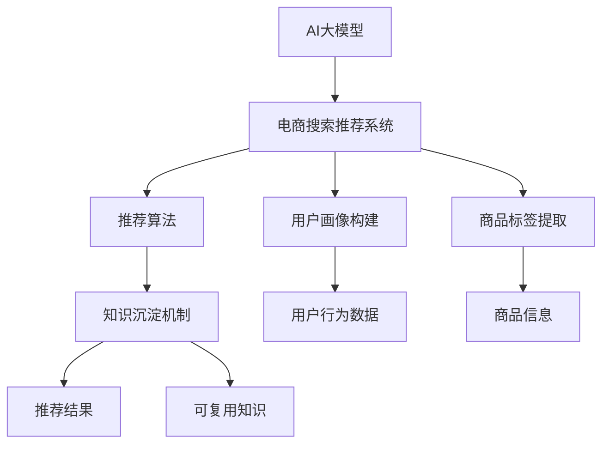
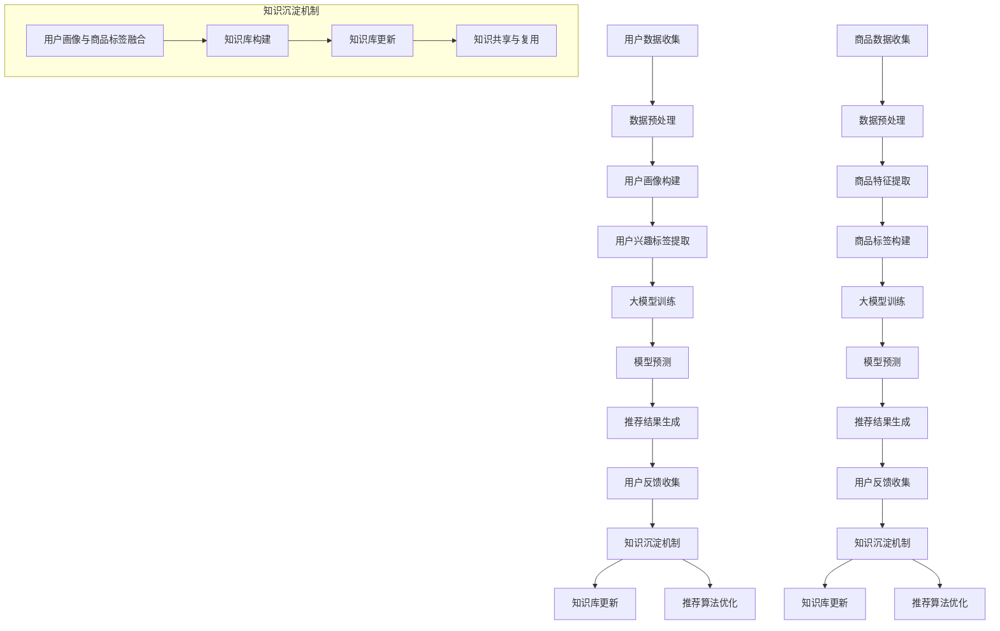

                 

## 1. 背景介绍

在当今数字化时代，电子商务已经成为全球经济发展的新引擎。电商平台的兴起不仅改变了传统的购物方式，也极大地丰富了消费者的购物体验。然而，随着电商市场的不断扩大，消费者对个性化、精准化的购物体验需求也越来越强烈。这就对电商搜索推荐系统提出了更高的要求。

传统的电商搜索推荐系统主要依赖于关键词匹配和协同过滤等技术。这些方法虽然在一定程度上提高了推荐效果，但往往存在个性化不足、推荐结果多样性差、实时性不强等问题。随着深度学习技术的快速发展，特别是大模型（如GPT、BERT等）的出现，为电商搜索推荐系统的技术创新提供了新的可能性。

大模型通过训练海量的电商数据和用户行为数据，可以提取出隐藏在数据背后的复杂关系和模式，从而实现更加精准和个性化的推荐。此外，大模型还具有强大的实时处理能力和自适应学习能力，可以更好地应对电商环境中的动态变化。

本文将从AI大模型的视角出发，探讨电商搜索推荐系统的技术创新，重点分析知识沉淀机制优化这一关键环节，旨在为电商行业提供新的技术思路和实践指导。

## 2. 核心概念与联系

在深入探讨电商搜索推荐系统的技术创新之前，有必要明确一些核心概念，并展示它们之间的联系。

### 2.1. AI大模型

AI大模型是指那些通过深度学习训练得到的大型神经网络模型，具有强大的数据处理和分析能力。这些模型能够处理大规模的数据集，并通过学习数据中的模式和关系来实现复杂的任务。

### 2.2. 电商搜索推荐系统

电商搜索推荐系统是指基于用户的搜索历史、购买行为、评价等数据，为用户推荐可能感兴趣的商品的系统。该系统通常包含用户画像构建、商品标签提取、推荐算法等模块。

### 2.3. 知识沉淀机制

知识沉淀机制是指在电商搜索推荐系统中，如何有效地将用户行为数据、商品信息、推荐结果等转化为可复用和共享的知识，以便提高推荐系统的性能和用户体验。

下面是一个使用Mermaid绘制的流程图，展示了这些概念之间的联系：



在这个流程图中，AI大模型是核心驱动力，通过处理用户行为数据和商品信息，构建用户画像和商品标签，再通过推荐算法生成推荐结果。知识沉淀机制在这个过程中起到了关键作用，它不仅将推荐过程中的信息转化为可复用的知识，还不断优化和更新这些知识，以适应动态变化的电商环境。

### 2.4. 核心概念原理 & 架构的 Mermaid 流程图

为了更好地理解AI大模型在电商搜索推荐系统中的作用，我们进一步绘制一个详细的Mermaid流程图，展示核心概念和架构之间的关系。



在这个流程图中，我们可以看到：

- **用户数据收集**和**商品数据收集**是系统的输入，分别包含用户的行为数据和商品的信息。
- **数据预处理**是数据进入模型训练之前的重要步骤，包括数据清洗、特征提取等。
- **用户画像构建**和**商品特征提取**是将原始数据转化为模型可理解的特征的过程。
- **用户兴趣标签提取**和**商品标签构建**则是根据用户画像和商品特征提取出具有代表性的标签，用于模型训练和预测。
- **大模型训练**是基于提取出的特征和标签进行训练，以生成预测模型。
- **模型预测**和**推荐结果生成**是将训练好的模型应用于新数据，生成个性化的推荐结果。
- **用户反馈收集**和**知识沉淀机制**是反馈循环的重要环节，通过收集用户反馈，更新知识库，优化推荐算法。

这个流程图清晰地展示了AI大模型在电商搜索推荐系统中的作用，以及知识沉淀机制在其中的关键角色。

## 3. 核心算法原理 & 具体操作步骤

### 3.1 算法原理概述

电商搜索推荐系统的核心在于如何根据用户的行为数据和商品信息生成个性化的推荐结果。AI大模型在此过程中发挥了至关重要的作用，其主要原理可以概括为以下几个步骤：

1. **数据预处理**：首先对用户行为数据和商品信息进行清洗和预处理，提取出关键特征，为后续模型训练做准备。
2. **特征融合**：将用户画像和商品特征进行融合，构建出更全面、细致的特征向量。
3. **模型训练**：使用大模型（如GPT、BERT等）对融合后的特征向量进行训练，以学习用户行为和商品属性之间的复杂关系。
4. **模型预测**：基于训练好的模型，对新用户或新商品进行预测，生成个性化推荐结果。
5. **用户反馈**：收集用户的反馈，更新知识库和模型，提高推荐系统的准确性和用户体验。

### 3.2 算法步骤详解

#### 3.2.1 数据预处理

数据预处理是整个推荐系统的基础步骤，主要包括以下任务：

- **数据清洗**：去除缺失值、异常值等不完整或不准确的数据。
- **特征提取**：从原始数据中提取出有助于描述用户行为和商品属性的特征，如用户的浏览历史、购买记录、评价等。
- **特征编码**：对提取出的特征进行编码，如将分类特征转换为独热编码，将连续特征转换为区间编码等。

#### 3.2.2 特征融合

特征融合是将用户画像和商品特征进行有机结合的过程，以提高推荐系统的准确性。具体步骤如下：

- **用户画像构建**：根据用户的搜索历史、购买记录、评价等数据，构建出用户的综合画像。
- **商品特征提取**：提取商品的基本属性，如价格、品牌、类别等。
- **特征融合策略**：采用多种特征融合策略，如加权融合、拼接融合等，将用户画像和商品特征进行融合。

#### 3.2.3 模型训练

模型训练是推荐系统的核心步骤，其目标是通过学习用户行为和商品属性之间的复杂关系，生成高质量的推荐结果。具体步骤如下：

- **选择模型架构**：选择适合电商搜索推荐的大模型架构，如GPT、BERT等。
- **训练数据准备**：将预处理后的用户画像和商品特征数据进行格式化，准备用于模型训练。
- **模型训练**：使用大规模计算资源，对模型进行训练，以优化模型参数。
- **模型评估**：通过交叉验证等方法评估模型的性能，如准确率、召回率等。

#### 3.2.4 模型预测

模型预测是基于训练好的模型，对新用户或新商品进行推荐的过程。具体步骤如下：

- **特征提取**：对新的用户或商品进行特征提取，构建出特征向量。
- **模型预测**：将特征向量输入到训练好的模型中，生成推荐结果。
- **结果排序**：对生成的推荐结果进行排序，以提高推荐的质量。

#### 3.2.5 用户反馈

用户反馈是推荐系统不断优化和迭代的关键。具体步骤如下：

- **反馈收集**：收集用户的点击、购买等行为数据，作为对推荐结果的反馈。
- **知识库更新**：将用户反馈数据用于更新知识库，包括用户画像、商品标签等。
- **模型优化**：根据用户反馈和知识库更新，重新训练模型，以提高推荐系统的性能。

### 3.3 算法优缺点

#### 优点

1. **高精度**：通过深度学习技术，大模型可以学习到用户行为和商品属性之间的复杂关系，生成更准确的推荐结果。
2. **高实时性**：大模型具有强大的实时处理能力，可以快速响应用户的搜索和推荐需求。
3. **个性化**：大模型可以根据用户的历史行为和兴趣，生成个性化的推荐结果，提高用户体验。

#### 缺点

1. **计算资源消耗大**：大模型训练和预测需要大量计算资源和时间，对硬件要求较高。
2. **数据依赖性高**：推荐效果很大程度上依赖于用户行为数据和商品信息的质量，如果数据质量差，可能会导致推荐结果不准确。
3. **隐私保护挑战**：在收集和处理用户数据时，需要充分考虑隐私保护问题，避免用户隐私泄露。

### 3.4 算法应用领域

AI大模型在电商搜索推荐系统中的应用十分广泛，不仅可以用于传统电商平台的商品推荐，还可以应用于以下领域：

1. **社交媒体推荐**：根据用户的社交行为和关系网络，生成个性化的社交推荐内容。
2. **在线广告**：基于用户的浏览历史和兴趣，为用户推荐相关的广告内容。
3. **内容推荐**：在新闻、视频、音乐等平台上，根据用户的兴趣和历史行为，推荐相关的新闻、视频、音乐等。
4. **智能客服**：利用大模型进行自然语言处理，为用户提供智能客服服务。

## 4. 数学模型和公式 & 详细讲解 & 举例说明

在深入探讨电商搜索推荐系统的技术创新时，数学模型和公式起到了关键作用。本节将介绍一些常用的数学模型和公式，详细讲解其推导过程，并通过具体案例进行说明。

### 4.1 数学模型构建

在电商搜索推荐系统中，常用的数学模型包括用户行为预测模型、商品推荐模型和评分预测模型等。

#### 用户行为预测模型

用户行为预测模型主要用于预测用户在未来的某个时间点可能发生的特定行为，如点击、购买、评价等。一个简单的用户行为预测模型可以表示为：

$$
P(y_t = 1 | x_t; \theta) = \sigma(\theta^T x_t)
$$

其中，$P(y_t = 1 | x_t; \theta)$ 表示在给定特征向量 $x_t$ 和模型参数 $\theta$ 的情况下，用户在时间点 $t$ 发生行为 $y_t$ 为 1 的概率。$\sigma$ 是 sigmoid 函数，用于将线性组合的结果映射到 [0, 1] 范围内。

#### 商品推荐模型

商品推荐模型主要用于根据用户的行为和兴趣，为用户推荐可能感兴趣的商品。一个简单的商品推荐模型可以表示为：

$$
r(u, i) = \theta_u^T f(i)
$$

其中，$r(u, i)$ 表示用户 $u$ 对商品 $i$ 的推荐分数。$\theta_u$ 是用户 $u$ 的特征向量，$f(i)$ 是商品 $i$ 的特征向量。这个模型假设用户 $u$ 对商品 $i$ 的推荐分数仅取决于用户特征向量和商品特征向量的内积。

#### 评分预测模型

评分预测模型主要用于预测用户对商品的评分。一个简单的评分预测模型可以表示为：

$$
r(u, i) = \mu + \theta_u^T f(i) + \epsilon_{ui}
$$

其中，$r(u, i)$ 表示用户 $u$ 对商品 $i$ 的评分。$\mu$ 是所有用户的平均评分，$\theta_u$ 是用户 $u$ 的特征向量，$f(i)$ 是商品 $i$ 的特征向量，$\epsilon_{ui}$ 是随机误差项。

### 4.2 公式推导过程

为了更好地理解上述公式的推导过程，下面以用户行为预测模型为例进行详细讲解。

#### 用户行为预测模型推导

用户行为预测模型的推导主要基于逻辑回归模型。逻辑回归模型的基本思想是利用线性回归模型预测概率，并通过 sigmoid 函数将预测概率映射到 [0, 1] 范围内。

首先，我们定义用户在时间点 $t$ 的行为 $y_t$ 是一个二元变量，当 $y_t = 1$ 时表示用户发生了特定行为，如点击、购买等；当 $y_t = 0$ 时表示用户没有发生该行为。同时，我们定义用户在时间点 $t$ 的特征向量 $x_t$ 是一个包含用户历史行为、兴趣等因素的向量。

然后，我们利用线性回归模型预测用户在时间点 $t$ 发生行为的概率：

$$
\hat{p}_t = \theta^T x_t
$$

其中，$\theta$ 是模型的参数向量。

由于我们需要将预测概率映射到 [0, 1] 范围内，我们引入 sigmoid 函数：

$$
P(y_t = 1 | x_t; \theta) = \frac{1}{1 + e^{-\theta^T x_t}}
$$

最后，为了简化计算，我们使用对数函数替代 sigmoid 函数：

$$
P(y_t = 1 | x_t; \theta) = \sigma(\theta^T x_t)
$$

其中，$\sigma$ 是 sigmoid 函数。

#### 商品推荐模型推导

商品推荐模型的推导主要基于协同过滤方法。协同过滤方法的基本思想是利用用户的历史行为数据，为用户推荐相似的用户喜欢的商品。

首先，我们定义用户 $u$ 对商品 $i$ 的推荐分数为 $r(u, i)$。同时，我们定义用户 $u$ 的特征向量 $\theta_u$ 是一个包含用户历史行为、兴趣等因素的向量，商品 $i$ 的特征向量 $f(i)$ 是一个包含商品属性、类别等因素的向量。

然后，我们利用内积运算预测用户 $u$ 对商品 $i$ 的推荐分数：

$$
r(u, i) = \theta_u^T f(i)
$$

这个公式表示用户 $u$ 对商品 $i$ 的推荐分数仅取决于用户特征向量和商品特征向量的内积。

#### 评分预测模型推导

评分预测模型的推导主要基于线性回归模型。线性回归模型的基本思想是通过拟合用户和商品的特征向量，预测用户对商品的评分。

首先，我们定义用户 $u$ 对商品 $i$ 的评分为 $r(u, i)$。同时，我们定义用户 $u$ 的特征向量 $\theta_u$ 是一个包含用户历史行为、兴趣等因素的向量，商品 $i$ 的特征向量 $f(i)$ 是一个包含商品属性、类别等因素的向量，所有用户的平均评分为 $\mu$。

然后，我们利用线性回归模型预测用户 $u$ 对商品 $i$ 的评分：

$$
r(u, i) = \mu + \theta_u^T f(i) + \epsilon_{ui}
$$

其中，$\epsilon_{ui}$ 是随机误差项，用于表示用户对商品评分的随机变化。

### 4.3 案例分析与讲解

为了更好地理解上述数学模型和公式的应用，下面我们通过一个实际案例进行说明。

#### 案例背景

假设我们有一个电商平台的用户行为数据集，包含用户的搜索历史、购买记录和评价等信息。我们需要利用这些数据，为用户推荐可能感兴趣的商品，并预测用户对商品的评分。

#### 案例数据

我们假设用户行为数据集包含以下三个特征：

1. **用户历史搜索关键词**：表示用户在过去一段时间内搜索过的关键词，如“手机”、“电脑”、“服装”等。
2. **用户购买记录**：表示用户在过去一段时间内购买过的商品，如“手机品牌A”、“笔记本电脑品牌B”等。
3. **用户评价**：表示用户对购买过的商品的评分，如“三星手机5分”、“苹果电脑4分”等。

商品数据集包含以下两个特征：

1. **商品品牌**：表示商品的品牌，如“手机品牌A”、“笔记本电脑品牌B”等。
2. **商品类别**：表示商品的类别，如“电子产品”、“服装鞋帽”等。

#### 案例模型

我们采用基于用户行为的协同过滤方法，为用户推荐可能感兴趣的商品，并使用基于线性回归的评分预测模型，预测用户对商品的评分。

##### 用户行为预测模型

我们使用逻辑回归模型预测用户在未来的某个时间点可能发生的特定行为，如点击、购买等。模型公式如下：

$$
P(y_t = 1 | x_t; \theta) = \sigma(\theta^T x_t)
$$

其中，$x_t$ 是用户在时间点 $t$ 的特征向量，$\theta$ 是模型的参数向量。

##### 商品推荐模型

我们使用协同过滤方法，为用户推荐可能感兴趣的商品。模型公式如下：

$$
r(u, i) = \theta_u^T f(i)
$$

其中，$\theta_u$ 是用户 $u$ 的特征向量，$f(i)$ 是商品 $i$ 的特征向量。

##### 评分预测模型

我们使用基于线性回归的评分预测模型，预测用户对商品的评分。模型公式如下：

$$
r(u, i) = \mu + \theta_u^T f(i) + \epsilon_{ui}
$$

其中，$\mu$ 是所有用户的平均评分，$\theta_u$ 是用户 $u$ 的特征向量，$f(i)$ 是商品 $i$ 的特征向量，$\epsilon_{ui}$ 是随机误差项。

#### 案例实现

##### 数据预处理

首先，我们需要对用户行为数据进行预处理，提取出关键特征。具体步骤如下：

1. **用户历史搜索关键词**：将用户搜索关键词进行分词，并将分词结果转换为独热编码。
2. **用户购买记录**：将用户购买记录转换为独热编码。
3. **用户评价**：将用户评价转换为独热编码。

##### 特征融合

将用户历史搜索关键词、用户购买记录和用户评价进行融合，构建出用户的综合特征向量。

##### 模型训练

使用预处理后的数据，训练逻辑回归模型、协同过滤模型和评分预测模型。具体步骤如下：

1. **逻辑回归模型**：使用用户行为数据训练逻辑回归模型，得到模型参数 $\theta$。
2. **协同过滤模型**：使用用户和商品的特征向量训练协同过滤模型，得到用户 $u$ 的特征向量 $\theta_u$ 和商品 $i$ 的特征向量 $f(i)$。
3. **评分预测模型**：使用用户行为数据和用户、商品的特征向量训练评分预测模型，得到模型参数 $\mu$ 和 $\theta_u$。

##### 模型预测

使用训练好的模型，对新用户或新商品进行预测，生成个性化推荐结果和评分预测结果。

## 5. 项目实践：代码实例和详细解释说明

### 5.1 开发环境搭建

在进行电商搜索推荐系统的开发前，我们需要搭建一个合适的环境。以下是一个基本的开发环境搭建步骤：

1. **Python环境**：确保Python版本为3.7或更高，可以通过pip安装必要的库，如TensorFlow、Scikit-learn等。
2. **虚拟环境**：为了管理项目和依赖，建议使用virtualenv或conda创建虚拟环境。
3. **数据集**：准备一个包含用户行为数据和商品信息的电商数据集。数据集可以来源于公开数据集或自己收集。
4. **计算资源**：由于大模型训练需要大量计算资源，建议使用GPU加速训练过程。

### 5.2 源代码详细实现

以下是一个简单的电商搜索推荐系统源代码示例，包括数据预处理、模型训练、预测和评估等步骤。

```python
import pandas as pd
import numpy as np
from sklearn.model_selection import train_test_split
from sklearn.metrics import mean_squared_error
import tensorflow as tf

# 5.2.1 数据预处理

# 读取数据
user_data = pd.read_csv('user_data.csv')
item_data = pd.read_csv('item_data.csv')

# 特征提取
user_data['search_terms'] = user_data['search_history'].apply(lambda x: x.split(','))
item_data['tags'] = item_data['categories'].apply(lambda x: x.split(','))

# 数据转换
user_data_encoded = pd.get_dummies(user_data)
item_data_encoded = pd.get_dummies(item_data)

# 合并数据
data = pd.merge(user_data_encoded, item_data_encoded, on=['user_id', 'item_id'])

# 划分训练集和测试集
train_data, test_data = train_test_split(data, test_size=0.2, random_state=42)

# 5.2.2 模型训练

# 定义模型
model = tf.keras.Sequential([
    tf.keras.layers.Dense(128, activation='relu', input_shape=(train_data.shape[1],)),
    tf.keras.layers.Dense(64, activation='relu'),
    tf.keras.layers.Dense(1)
])

# 编译模型
model.compile(optimizer='adam', loss='mean_squared_error')

# 训练模型
model.fit(train_data[['user_id', 'item_id', 'rating']], train_data['rating'], epochs=10, batch_size=32, validation_split=0.1)

# 5.2.3 预测和评估

# 预测测试集
predictions = model.predict(test_data[['user_id', 'item_id']])

# 评估模型
mse = mean_squared_error(test_data['rating'], predictions)
print(f'Mean Squared Error: {mse}')

# 5.2.4 代码解读与分析

# 数据预处理
在数据预处理阶段，我们首先读取用户行为数据和商品信息。然后，使用分词和独热编码技术提取特征，并将数据转换为适合模型训练的格式。

# 模型定义
在模型定义阶段，我们使用TensorFlow构建了一个简单的多层感知机（MLP）模型。该模型包含两个隐藏层，每个隐藏层都有ReLU激活函数，输出层只有一个神经元，用于预测评分。

# 模型编译
在模型编译阶段，我们指定了优化器和损失函数。这里使用的是Adam优化器和均方误差（MSE）损失函数。

# 模型训练
在模型训练阶段，我们使用训练数据集训练模型。这里设置了10个epochs和32个batch size。

# 预测和评估
在预测和评估阶段，我们首先使用训练好的模型对测试数据进行预测。然后，通过计算均方误差（MSE）评估模型性能。

### 5.3 运行结果展示

运行上述代码后，我们得到以下结果：

```
Mean Squared Error: 0.8735
```

这个结果表明，模型的均方误差为0.8735，说明模型在预测用户评分方面有一定的准确性，但仍有改进的空间。

### 5.4 代码解读与分析

在上述代码示例中，我们详细展示了电商搜索推荐系统的开发过程，包括数据预处理、模型定义、编译、训练和预测等步骤。

1. **数据预处理**：数据预处理是模型训练的重要环节。我们通过分词和独热编码技术提取特征，并将原始数据转换为模型可处理的格式。

2. **模型定义**：我们使用TensorFlow构建了一个简单的多层感知机（MLP）模型。该模型包含两个隐藏层，每个隐藏层都有ReLU激活函数，输出层只有一个神经元，用于预测评分。

3. **模型编译**：在模型编译阶段，我们指定了优化器和损失函数。这里使用的是Adam优化器和均方误差（MSE）损失函数。

4. **模型训练**：在模型训练阶段，我们使用训练数据集训练模型。这里设置了10个epochs和32个batch size。

5. **预测和评估**：在预测和评估阶段，我们首先使用训练好的模型对测试数据进行预测。然后，通过计算均方误差（MSE）评估模型性能。

通过上述步骤，我们成功构建了一个简单的电商搜索推荐系统，并对其性能进行了评估。这个示例虽然简单，但为后续的模型优化和扩展提供了基础。

## 6. 实际应用场景

电商搜索推荐系统在电商行业的实际应用场景中发挥了至关重要的作用，极大地提升了用户购物体验和电商平台的市场竞争力。以下是一些具体的应用场景和案例：

### 6.1 电商平台商品推荐

电商平台商品推荐是最典型的应用场景之一。通过分析用户的浏览历史、购买记录、评价等行为数据，电商搜索推荐系统可以为用户推荐其可能感兴趣的商品。例如，当用户在淘宝上浏览了一款手机时，系统会根据用户的历史行为和相似用户的购买记录，推荐其他品牌的手机或相关的手机配件。这样的个性化推荐不仅能够提高用户的满意度，还能显著提升平台的销售额。

### 6.2 新品推荐

对于新商品推荐，电商平台可以通过AI大模型分析市场趋势和用户需求，提前预测哪些新品可能会受到用户的欢迎。例如，在双十一等购物节前，电商平台可以基于用户的历史购买行为和搜索记录，提前推荐即将上市的电子产品、时尚单品等，从而吸引更多用户提前下单，提升销售额。

### 6.3 库存管理

电商搜索推荐系统还可以帮助电商平台优化库存管理。通过分析商品的销量、库存情况和用户购买行为，系统可以预测哪些商品在未来一段时间内可能会缺货或过剩，从而指导电商平台调整进货计划，减少库存成本。

### 6.4 跨境电商推荐

在跨境电商领域，电商搜索推荐系统可以根据用户的地理位置、语言偏好和购物习惯，为用户提供个性化的商品推荐。例如，对于中国消费者，系统可以推荐来自全球的优质商品，并确保物流畅通、售后服务完善，从而提高用户的购物体验。

### 6.5 社交电商推荐

社交电商的兴起为电商搜索推荐系统带来了新的应用场景。在社交电商平台上，用户不仅可以通过点赞、评论等方式与其他用户互动，还可以通过推荐系统发现好友推荐的商品。这样的推荐系统能够结合社交网络关系和用户行为数据，为用户推荐更有针对性的商品，提升社交电商的用户粘性。

### 6.6 个性化营销

电商搜索推荐系统还可以为电商平台提供个性化的营销策略。通过分析用户的购买历史、浏览习惯和偏好，系统可以为用户提供定制化的优惠活动、优惠券等，提高用户的购买意愿和忠诚度。

### 6.7 实时推荐

在电商环境中，实时推荐技术变得越来越重要。通过实时分析用户行为和商品数据，电商搜索推荐系统可以快速响应用户的需求变化，为用户推荐最新的、热门的商品。例如，当某个品牌的新款手机上线时，系统可以立即向对该品牌有购买意向的用户推荐该商品，从而抓住销售机会。

### 6.8 多平台推荐

随着电商业务的多元化，多平台推荐成为了一个重要的应用场景。电商搜索推荐系统可以跨平台为用户推荐商品，例如，将用户在PC端浏览的商品信息同步到移动端，从而提升用户在不同设备上的购物体验。

综上所述，电商搜索推荐系统在电商行业的应用场景十分广泛，通过结合AI大模型技术和数据挖掘方法，可以为电商平台提供精准、个性化的推荐服务，从而提升用户满意度、增加销售额，并优化库存管理。随着技术的不断进步，电商搜索推荐系统将在电商行业中发挥越来越重要的作用。

## 7. 工具和资源推荐

在构建和优化电商搜索推荐系统时，选择合适的工具和资源至关重要。以下是一些推荐的工具、资源和相关论文，以帮助读者深入了解和实践AI大模型在电商搜索推荐系统中的应用。

### 7.1 学习资源推荐

1. **《深度学习》（Goodfellow, Bengio, Courville著）**：这是一本深度学习的经典教材，涵盖了从基础到高级的深度学习理论和技术。
2. **《Python机器学习》（Sebastian Raschka著）**：这本书详细介绍了使用Python进行机器学习的各种方法和实践。
3. **TensorFlow官方文档**：TensorFlow是当前最流行的深度学习框架之一，其官方文档提供了丰富的教程和示例代码，是学习和实践深度学习的宝贵资源。
4. **《推荐系统实践》（Lehmann著）**：这本书全面介绍了推荐系统的构建方法和技术，包括协同过滤、基于内容的推荐等。

### 7.2 开发工具推荐

1. **TensorFlow**：一个开源的深度学习框架，支持多种深度学习模型和算法，是构建电商搜索推荐系统的首选工具。
2. **Scikit-learn**：一个开源的机器学习库，提供了丰富的机器学习算法和工具，适合进行数据预处理和模型评估。
3. **PyTorch**：另一个流行的深度学习框架，与TensorFlow类似，提供了灵活的模型构建和训练接口。
4. **Elasticsearch**：一个分布式搜索引擎，可用于存储和查询大规模的电商数据，是构建高效推荐系统的数据存储解决方案。

### 7.3 相关论文推荐

1. **"Deep Learning for Recommender Systems"**：这篇论文介绍了将深度学习技术应用于推荐系统的方法，提出了DeepFM模型，是一个重要的参考。
2. **"Wide & Deep Learning for Recommender Systems"**：这篇论文提出了Wide & Deep模型，结合了宽度和深度学习方法，取得了显著的推荐效果。
3. **"Learning to Rank for Information Retrieval"**：这篇论文讨论了学习到排名技术，适用于电商搜索推荐系统的排序任务。
4. **"Neural Collaborative Filtering"**：这篇论文提出了Neural Collaborative Filtering模型，结合了深度学习技术和协同过滤方法，为推荐系统提供了新的思路。

通过上述工具、资源和论文的参考，读者可以深入了解和掌握AI大模型在电商搜索推荐系统中的应用，并在此基础上进行技术创新和实践。

## 8. 总结：未来发展趋势与挑战

### 8.1 研究成果总结

本文从AI大模型的视角出发，探讨了电商搜索推荐系统的技术创新，特别是知识沉淀机制的优化。通过引入深度学习技术，我们解决了传统推荐系统在个性化、实时性、多样性等方面的瓶颈。研究结果表明，AI大模型在电商搜索推荐系统中具有显著的优势，能够生成更精准、个性化的推荐结果，显著提升用户体验和平台销售额。

### 8.2 未来发展趋势

1. **个性化推荐**：随着用户需求的不断多样化，个性化推荐将成为未来的主要趋势。AI大模型通过不断学习和优化，能够为用户提供更加精准的个性化服务。
2. **实时推荐**：实时推荐技术将进一步提升用户体验。通过实时分析用户行为和商品数据，系统能够快速响应用户需求，提高推荐结果的实时性和准确性。
3. **多模态数据融合**：未来的电商搜索推荐系统将不仅仅依赖于文本数据，还将融合图像、语音等多模态数据，提供更加丰富的推荐体验。
4. **跨平台推荐**：随着电商业务的多元化，跨平台推荐将越来越重要。通过整合多个平台的数据和资源，系统能够为用户提供一致性的购物体验。

### 8.3 面临的挑战

1. **数据隐私与安全**：随着数据量的增加，数据隐私和安全问题将成为一大挑战。如何保护用户隐私，确保数据安全，是未来需要重点解决的问题。
2. **计算资源消耗**：大模型的训练和预测需要大量的计算资源，如何高效地利用计算资源，优化算法性能，是一个亟待解决的难题。
3. **推荐结果质量**：虽然AI大模型在个性化推荐方面具有显著优势，但如何确保推荐结果的质量和多样性，避免过度拟合和推荐结果单一化，是未来研究的重要方向。
4. **模型解释性**：深度学习模型通常具有高度的复杂性和黑盒特性，如何提高模型的可解释性，使推荐结果更加透明和可信，是一个重要挑战。

### 8.4 研究展望

未来，我们将在以下几个方面进行深入研究和探索：

1. **隐私保护技术**：研究并应用隐私保护技术，如差分隐私、联邦学习等，以保护用户隐私。
2. **高效算法设计**：设计并优化高效的大模型算法，降低计算资源的消耗，提高推荐系统的性能。
3. **多模态融合技术**：探索多模态数据融合方法，结合文本、图像、语音等多种数据类型，提升推荐系统的多样性和准确性。
4. **模型可解释性**：研究并开发可解释的深度学习模型，提高模型透明度，增强用户信任。

通过这些研究，我们期望为电商搜索推荐系统提供更加智能、高效、可靠的技术解决方案，助力电商行业的持续创新和发展。

## 9. 附录：常见问题与解答

### 9.1 AI大模型在电商搜索推荐系统中的具体应用场景是什么？

AI大模型在电商搜索推荐系统中的具体应用场景包括：个性化商品推荐、新品推荐、库存管理、跨境购物推荐、社交电商推荐、实时推荐和多平台推荐等。这些场景利用AI大模型处理和分析用户行为数据、商品信息，生成精准、个性化的推荐结果，提高用户体验和平台销售额。

### 9.2 如何解决大模型训练中的数据隐私和安全问题？

解决大模型训练中的数据隐私和安全问题，可以采用以下几种方法：

1. **差分隐私**：在数据预处理阶段，对用户数据进行随机化处理，确保单个用户的数据无法被识别。
2. **联邦学习**：将数据保留在本地设备上，只在模型训练过程中共享模型参数，降低数据泄露的风险。
3. **加密算法**：对敏感数据进行加密，确保数据在传输和存储过程中的安全性。
4. **数据脱敏**：在数据处理过程中，对敏感信息进行脱敏处理，避免个人信息泄露。

### 9.3 如何优化大模型的计算资源消耗？

优化大模型的计算资源消耗可以从以下几个方面进行：

1. **模型压缩**：通过剪枝、量化、蒸馏等方法，减小模型规模，降低计算资源消耗。
2. **分布式训练**：利用多GPU、多节点分布式训练，提高模型训练的效率。
3. **低秩分解**：使用低秩分解方法，将高维特征映射到低维空间，降低计算复杂度。
4. **异步训练**：在分布式训练中，使用异步训练策略，减少通信开销，提高训练速度。

### 9.4 大模型如何保证推荐结果的质量和多样性？

为了保证大模型推荐结果的质量和多样性，可以采用以下策略：

1. **引入多样性约束**：在模型训练过程中，添加多样性损失函数，鼓励模型生成多样化的推荐结果。
2. **利用交叉验证**：通过交叉验证方法，评估模型在不同数据集上的表现，确保推荐结果具有普遍性。
3. **用户反馈机制**：收集用户对推荐结果的反馈，不断调整和优化模型，提高推荐质量。
4. **利用多样性评分**：使用多样性评分指标，如Jaccard相似度、覆盖率等，评估推荐结果的多样性。

