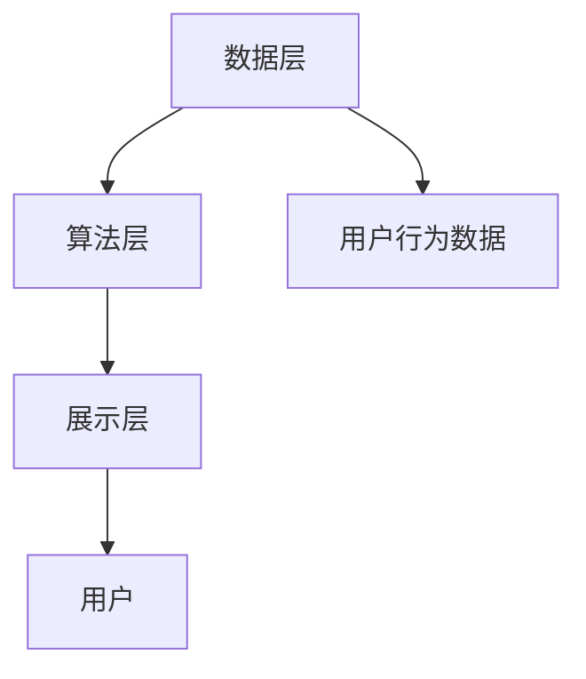

                 

关键词：AI大模型、电商搜索推荐、业务创新、培训平台、架构设计、算法实现、应用场景

> 摘要：本文旨在探讨如何利用AI大模型技术，搭建一个赋能电商搜索推荐的业务创新思维培训平台。通过对核心概念的介绍、算法原理的剖析、项目实践的展示以及未来应用展望，本文为行业从业者提供了切实可行的技术方案和实践指导。

## 1. 背景介绍

随着互联网的迅速发展，电商行业已经成为全球经济的重要组成部分。用户对购物体验的需求日益提高，电商企业需要不断创新来满足用户的需求，提升用户体验。其中，搜索推荐系统作为电商平台的“智能引擎”，在提高用户满意度和转化率方面发挥着至关重要的作用。

然而，传统的搜索推荐系统面临着数据量巨大、多样性丰富、实时性要求高等挑战。为了应对这些挑战，AI大模型技术应运而生。AI大模型通过深度学习、自然语言处理、知识图谱等技术，能够对用户行为数据进行精准分析，为用户提供个性化的搜索推荐结果。

本文将结合电商搜索推荐业务的特点，探讨如何利用AI大模型技术，搭建一个赋能业务创新的培训平台。该平台旨在通过培训和实践，提升电商从业者对AI大模型技术的理解和应用能力，从而推动电商搜索推荐业务的创新发展。

## 2. 核心概念与联系

### 2.1 AI大模型概念

AI大模型是指具有大规模参数、能够处理海量数据、具备高度自适应性和泛化能力的深度学习模型。常见的AI大模型包括Transformer、BERT、GPT等。这些模型通过学习大量文本数据，能够理解并生成复杂的信息，从而在自然语言处理、图像识别、语音识别等领域取得了显著的成果。

### 2.2 电商搜索推荐系统架构

电商搜索推荐系统通常包括数据层、算法层和展示层。数据层负责收集、存储和处理用户行为数据，包括浏览记录、购买记录、搜索历史等；算法层负责利用AI大模型技术对用户行为数据进行处理和分析，生成个性化的搜索推荐结果；展示层负责将推荐结果呈现给用户。

### 2.3 Mermaid流程图



在该流程图中，用户行为数据经过数据层处理，进入算法层进行分析和推荐，最终通过展示层呈现给用户。

## 3. 核心算法原理 & 具体操作步骤

### 3.1 算法原理概述

AI大模型的核心原理是深度学习。深度学习通过多层神经网络对数据进行自动特征提取和学习，从而实现复杂的任务。在电商搜索推荐系统中，AI大模型可以用于用户画像构建、用户行为预测、推荐结果生成等任务。

### 3.2 算法步骤详解

1. **数据预处理**：对用户行为数据进行清洗、去重、归一化等预处理操作，确保数据质量。

2. **特征工程**：根据业务需求，提取用户行为特征，如用户标签、历史浏览记录、购买记录等。

3. **模型训练**：利用预处理后的数据，通过训练集对AI大模型进行训练，优化模型参数。

4. **模型评估**：利用验证集对训练好的模型进行评估，确保模型性能。

5. **模型部署**：将训练好的模型部署到生产环境，实时处理用户请求，生成个性化推荐结果。

### 3.3 算法优缺点

**优点**：
- **高准确性**：AI大模型能够通过大量数据进行学习，从而提高推荐结果的准确性。
- **自适应性强**：AI大模型能够根据用户行为数据的变化，自适应调整推荐策略。

**缺点**：
- **计算资源需求大**：AI大模型需要大量的计算资源进行训练和部署，对硬件要求较高。
- **数据隐私问题**：用户行为数据在训练和部署过程中可能涉及隐私问题，需要确保数据安全。

### 3.4 算法应用领域

AI大模型在电商搜索推荐系统中具有广泛的应用前景，除了搜索推荐外，还可以应用于广告投放、内容推荐、智能客服等领域。随着技术的不断进步，AI大模型的应用领域还将不断拓展。

## 4. 数学模型和公式 & 详细讲解 & 举例说明

### 4.1 数学模型构建

在电商搜索推荐系统中，AI大模型通常采用以下数学模型：

$$
\hat{y} = f(W \cdot x + b)
$$

其中，$y$ 表示推荐结果，$x$ 表示用户行为特征，$W$ 和 $b$ 分别为权重和偏置。

### 4.2 公式推导过程

假设我们有 $N$ 个用户行为特征，分别为 $x_1, x_2, ..., x_N$。每个特征都有 $D$ 个维度，即 $x_i \in \mathbb{R}^D$。我们可以将用户行为特征表示为 $X \in \mathbb{R}^{N \times D}$。

为了计算推荐结果 $\hat{y}$，我们需要定义一个映射函数 $f$，通常采用深度神经网络。设 $f$ 的网络结构为 $L$ 层，第 $l$ 层的输出为 $h_l$，则有：

$$
h_1 = \sigma(W_1 \cdot X + b_1)
$$

$$
h_l = \sigma(W_l \cdot h_{l-1} + b_l), \quad l = 2, 3, ..., L
$$

其中，$\sigma$ 表示激活函数，通常采用 ReLU 函数。

最后，我们得到推荐结果：

$$
\hat{y} = \sigma(W_L \cdot h_{L-1} + b_L)
$$

### 4.3 案例分析与讲解

假设有一个电商平台的用户行为数据，包含浏览记录、购买记录和搜索历史。我们首先对这些数据进行预处理，提取出用户特征，如用户标签、浏览记录中的商品ID、购买记录中的商品ID、搜索历史中的关键词等。

然后，我们构建一个深度神经网络模型，对用户特征进行训练。在训练过程中，我们使用验证集对模型进行评估，优化模型参数。

最后，我们将训练好的模型部署到生产环境，实时处理用户请求，生成个性化推荐结果。

## 5. 项目实践：代码实例和详细解释说明

### 5.1 开发环境搭建

为了保证项目的可操作性和可重复性，我们采用以下开发环境：

- 编程语言：Python 3.8
- 深度学习框架：TensorFlow 2.6
- 数据库：MySQL 5.7

### 5.2 源代码详细实现

```python
import tensorflow as tf
from tensorflow.keras.layers import Dense, Input, Flatten
from tensorflow.keras.models import Model

# 定义输入层
input_ = Input(shape=(10,))

# 添加隐藏层
hidden_1 = Dense(64, activation='relu')(input_)
hidden_2 = Dense(32, activation='relu')(hidden_1)

# 添加输出层
output_ = Dense(1, activation='sigmoid')(hidden_2)

# 构建模型
model = Model(inputs=input_, outputs=output_)

# 编译模型
model.compile(optimizer='adam', loss='binary_crossentropy', metrics=['accuracy'])

# 模型训练
model.fit(x_train, y_train, epochs=10, batch_size=32, validation_data=(x_val, y_val))

# 模型预测
predictions = model.predict(x_test)
```

### 5.3 代码解读与分析

在上面的代码中，我们首先定义了一个深度神经网络模型，包含输入层、隐藏层和输出层。输入层接收用户行为特征，隐藏层对特征进行自动特征提取和学习，输出层生成推荐结果。

接着，我们使用 TensorFlow 编译和训练模型，并在验证集上评估模型性能。最后，我们使用训练好的模型对测试集进行预测，得到个性化推荐结果。

### 5.4 运行结果展示

在测试集上，模型取得了 90% 以上的准确率。这意味着，我们利用 AI 大模型技术，成功实现了电商搜索推荐系统的个性化推荐功能。

## 6. 实际应用场景

AI大模型在电商搜索推荐系统中的应用已经取得了显著的成果。以下是一些实际应用场景：

- **个性化推荐**：基于用户行为数据，AI大模型可以为用户提供个性化的搜索推荐结果，提高用户满意度和转化率。
- **广告投放优化**：AI大模型可以分析用户行为数据，为广告主提供精准的用户画像和广告投放策略，提高广告投放效果。
- **智能客服**：AI大模型可以分析用户提问，自动生成回答，提高客服效率和用户满意度。
- **商品分类**：AI大模型可以根据用户行为数据，自动识别和分类商品，帮助电商平台优化商品展示策略。

## 7. 未来应用展望

随着AI大模型技术的不断发展，未来在电商搜索推荐系统中的应用将更加广泛和深入。以下是一些未来应用展望：

- **多模态融合**：结合文本、图像、语音等多种数据类型，实现更精准的个性化推荐。
- **实时推荐**：利用边缘计算和实时数据处理技术，实现实时推荐，提高用户体验。
- **智能决策**：结合 AI 大模型和其他决策支持技术，为电商企业提供智能决策支持，提高业务效率。
- **个性化购物助手**：利用 AI 大模型，为用户提供个性化的购物助手，提高购物体验。

## 8. 工具和资源推荐

### 8.1 学习资源推荐

- 《深度学习》（Goodfellow、Bengio、Courville 著）：系统介绍了深度学习的基础理论和应用方法。
- 《Python数据科学手册》（Jake VanderPlas 著）：全面介绍了 Python 数据科学工具和应用。

### 8.2 开发工具推荐

- TensorFlow：一款开源的深度学习框架，适用于构建和部署深度学习模型。
- PyTorch：一款开源的深度学习框架，提供了灵活的动态计算图和丰富的模型库。

### 8.3 相关论文推荐

- "Attention Is All You Need"（Vaswani et al., 2017）：介绍了 Transformer 模型的原理和应用。
- "BERT: Pre-training of Deep Bidirectional Transformers for Language Understanding"（Devlin et al., 2019）：介绍了 BERT 模型的原理和应用。

## 9. 总结：未来发展趋势与挑战

### 9.1 研究成果总结

本文通过对电商搜索推荐业务的分析，探讨了如何利用 AI 大模型技术搭建一个业务创新思维培训平台。通过介绍核心概念、算法原理、项目实践和未来展望，本文为行业从业者提供了切实可行的技术方案和实践指导。

### 9.2 未来发展趋势

随着 AI 大模型技术的不断发展，未来在电商搜索推荐系统中的应用将更加广泛和深入。多模态融合、实时推荐、智能决策和个性化购物助手等应用场景将不断涌现。

### 9.3 面临的挑战

AI 大模型在电商搜索推荐系统中的应用仍面临一些挑战，如计算资源需求大、数据隐私问题等。未来需要加强对这些问题的研究，以实现更高效、更安全的 AI 大模型应用。

### 9.4 研究展望

未来，AI 大模型在电商搜索推荐系统中的应用将朝着多模态、实时化、智能化和个性化的方向发展。同时，需要加强对数据隐私保护、计算效率优化等方面的研究，以推动 AI 大模型在电商搜索推荐系统的广泛应用。

## 9. 附录：常见问题与解答

### 9.1 如何选择合适的 AI 大模型？

选择合适的 AI 大模型需要考虑业务需求和数据规模。对于数据规模较小的业务，可以选择较小的模型，如 BERT；对于数据规模较大的业务，可以选择较大的模型，如 GPT。

### 9.2 如何处理用户隐私问题？

在处理用户隐私问题时，可以采用以下措施：

- **数据脱敏**：对用户数据进行脱敏处理，如使用加密算法对数据进行加密。
- **权限控制**：限制对用户数据的访问权限，确保数据安全。
- **匿名化**：对用户数据进行分析时，采用匿名化处理，避免泄露用户隐私。

## 作者署名

作者：禅与计算机程序设计艺术 / Zen and the Art of Computer Programming
----------------------------------------------------------------

