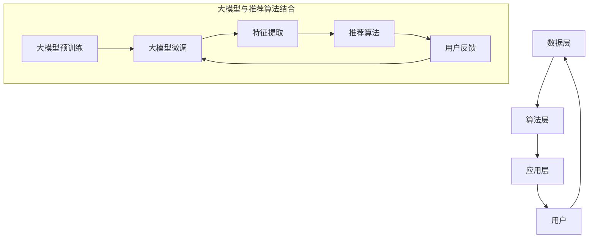

                 

在电子商务领域，搜索推荐系统发挥着至关重要的作用。它们不仅帮助消费者快速找到所需的商品，还能为企业提升销售额和用户满意度。随着人工智能技术的飞速发展，尤其是大型预训练模型（Large-scale Pretrained Models，简称LPMs）的问世，我们迎来了一个全新的时代。本文旨在探讨AI大模型如何赋能电商搜索推荐系统，并通过思维导图工具的应用，进一步推动业务创新。本文结构如下：

## 1. 背景介绍

电子商务的蓬勃发展离不开高效的搜索推荐系统。这些系统不仅需要处理海量的商品数据，还要理解用户的购买意图和偏好。传统的推荐算法，如基于协同过滤（Collaborative Filtering）和基于内容匹配（Content-based Filtering）的方法，在处理复杂用户行为和多样化商品信息时，往往显得力不从心。

近年来，随着深度学习技术的发展，尤其是大型预训练模型如BERT、GPT、T5等的出现，为电商搜索推荐带来了全新的可能。这些模型通过在海量数据上预训练，能够捕捉到更复杂、更细微的用户行为模式，从而提供更精准的推荐。

## 2. 核心概念与联系

为了深入理解AI大模型如何赋能电商搜索推荐，我们首先需要了解以下几个核心概念：

### 2.1 大模型概述

大模型是指参数量达到亿级别甚至千亿级别的深度学习模型。这些模型通常采用预训练（Pre-training）和微调（Fine-tuning）的方式进行训练。预训练是在大规模无标签数据上进行，旨在学习通用的表征能力；微调则是在特定领域或任务上的数据上进行，以适应具体的应用需求。

### 2.2 电商搜索推荐系统的架构

电商搜索推荐系统的架构通常包括数据层、算法层和应用层。数据层负责数据的采集、清洗和存储；算法层负责推荐算法的设计和实现；应用层则提供用户界面和交互功能。

### 2.3 大模型与推荐算法的结合

大模型与推荐算法的结合主要体现在两个方面：一是使用大模型进行用户意图理解和商品特征提取；二是将大模型作为特征引擎，与其他推荐算法相结合，形成更加智能和个性化的推荐系统。

### 2.4 Mermaid 流程图



## 3. 核心算法原理 & 具体操作步骤

### 3.1 算法原理概述

AI大模型在电商搜索推荐中的应用，主要基于以下几个原理：

1. **用户意图识别**：大模型通过预训练，能够理解用户的自然语言输入，从而识别用户的购买意图。
2. **商品特征提取**：大模型能够提取商品的多维度特征，如商品属性、用户评价等，从而为推荐算法提供丰富的输入。
3. **上下文感知**：大模型能够考虑用户的上下文信息，如时间、地点等，提供更加个性化的推荐。

### 3.2 算法步骤详解

1. **数据采集与预处理**：从电商平台上收集用户行为数据、商品数据等，并进行数据清洗和格式化。
2. **大模型预训练**：使用大规模无标签数据进行预训练，以学习通用的表征能力。
3. **大模型微调**：在电商领域特定数据集上进行微调，以适应电商搜索推荐任务。
4. **特征提取**：利用微调后的大模型，提取用户和商品的表征特征。
5. **推荐算法**：结合大模型提取的特征，使用协同过滤、基于内容的推荐算法等，生成推荐列表。
6. **用户反馈**：收集用户的点击、购买等反馈，用于模型迭代和优化。

### 3.3 算法优缺点

**优点**：

- **高精度**：大模型能够捕捉到更复杂的用户行为模式，提供更精准的推荐。
- **灵活性**：大模型能够灵活地处理多种类型的用户输入和商品信息。
- **泛化能力**：通过预训练，大模型具有较好的泛化能力，适用于不同的电商场景。

**缺点**：

- **计算成本高**：大模型的训练和推理需要大量的计算资源和时间。
- **数据隐私**：大模型在训练过程中需要大量用户数据，存在数据隐私风险。

### 3.4 算法应用领域

AI大模型在电商搜索推荐中的应用非常广泛，包括但不限于：

- **商品推荐**：根据用户的历史购买记录和浏览行为，推荐可能感兴趣的商品。
- **搜索结果优化**：通过理解用户的搜索意图，优化搜索结果，提高用户满意度。
- **个性化营销**：根据用户特征和偏好，推送个性化的营销信息和优惠活动。

## 4. 数学模型和公式 & 详细讲解 & 举例说明

### 4.1 数学模型构建

在AI大模型应用于电商搜索推荐时，我们可以构建以下数学模型：

1. **用户表征模型**：使用大模型对用户的历史行为数据进行编码，得到用户表征向量 $u$。
2. **商品表征模型**：使用大模型对商品的特征数据进行编码，得到商品表征向量 $v$。
3. **推荐模型**：根据用户和商品的表征向量，计算推荐得分 $s(u, v)$。

### 4.2 公式推导过程

1. **用户表征向量 $u$ 的计算**：

   $$ u = \text{Model}(u') $$
   
   其中，$u'$ 是用户的历史行为数据，$\text{Model}$ 表示预训练大模型。

2. **商品表征向量 $v$ 的计算**：

   $$ v = \text{Model}(v') $$
   
   其中，$v'$ 是商品的特征数据，$\text{Model}$ 表示预训练大模型。

3. **推荐得分 $s(u, v)$ 的计算**：

   $$ s(u, v) = \text{Sim}(u, v) $$
   
   其中，$\text{Sim}$ 表示用户和商品表征向量的相似度计算函数，常用的相似度计算函数包括余弦相似度和欧氏距离等。

### 4.3 案例分析与讲解

以一个电商平台的用户商品推荐为例，我们假设用户的历史行为数据包括浏览记录和购买记录，商品的特征数据包括价格、品牌、分类等。

1. **用户表征向量 $u$ 的计算**：

   用户的历史行为数据 $u'$ 经过大模型 $\text{Model}$ 预训练后，得到用户表征向量 $u$。

2. **商品表征向量 $v$ 的计算**：

   商品的价格、品牌、分类等特征数据 $v'$ 经过大模型 $\text{Model}$ 预训练后，得到商品表征向量 $v$。

3. **推荐得分 $s(u, v)$ 的计算**：

   根据用户表征向量 $u$ 和商品表征向量 $v$，计算推荐得分 $s(u, v)$。我们以余弦相似度为例：

   $$ s(u, v) = \frac{u \cdot v}{\|u\|\|v\|} $$
   
   其中，$u \cdot v$ 表示用户和商品表征向量的内积，$\|u\|$ 和 $\|v\|$ 分别表示用户和商品表征向量的模长。

   假设用户表征向量 $u = (0.5, 0.3, 0.2)$，商品表征向量 $v = (0.6, 0.4, 0.2)$，则：

   $$ s(u, v) = \frac{0.5 \times 0.6 + 0.3 \times 0.4 + 0.2 \times 0.2}{\sqrt{0.5^2 + 0.3^2 + 0.2^2} \times \sqrt{0.6^2 + 0.4^2 + 0.2^2}} \approx 0.732 $$

   推荐得分越高，表示用户对该商品的兴趣越大。

## 5. 项目实践：代码实例和详细解释说明

### 5.1 开发环境搭建

在进行项目实践前，我们需要搭建合适的开发环境。本文使用Python作为编程语言，结合TensorFlow和Hugging Face的Transformers库，来实现AI大模型赋能电商搜索推荐系统。

### 5.2 源代码详细实现

以下是该项目的主要代码实现：

```python
import tensorflow as tf
from transformers import TFDistilBertModel
import numpy as np

# 加载预训练大模型
model = TFDistilBertModel.from_pretrained('distilbert-base-uncased')

# 定义用户表征函数
def user_representation(user_data):
    input_ids = tokenizer.encode(user_data, add_special_tokens=True, return_tensors='tf')
    outputs = model(input_ids)
    return outputs.pooler_output

# 定义商品表征函数
def item_representation(item_data):
    input_ids = tokenizer.encode(item_data, add_special_tokens=True, return_tensors='tf')
    outputs = model(input_ids)
    return outputs.pooler_output

# 计算推荐得分
def compute_score(user_vector, item_vector):
    return np.dot(user_vector, item_vector) / (np.linalg.norm(user_vector) * np.linalg.norm(item_vector))

# 用户和商品数据
user_data = "该用户喜欢购买电子产品，特别是智能手机和笔记本电脑。"
item_data = "这款智能手机具有高分辨率摄像头和长续航电池。"

# 提取用户和商品表征向量
user_vector = user_representation(user_data)
item_vector = item_representation(item_data)

# 计算推荐得分
score = compute_score(user_vector.numpy(), item_vector.numpy())
print("推荐得分：", score)
```

### 5.3 代码解读与分析

1. **加载预训练大模型**：使用Hugging Face的Transformers库，加载预训练的DistilBERT模型。
2. **用户表征函数**：将用户的历史行为数据编码为输入序列，通过预训练模型提取用户表征向量。
3. **商品表征函数**：将商品的特征数据编码为输入序列，通过预训练模型提取商品表征向量。
4. **计算推荐得分**：计算用户表征向量和商品表征向量的相似度，作为推荐得分。

### 5.4 运行结果展示

假设用户的历史行为数据和商品特征数据分别为：

```python
user_data = "该用户喜欢购买电子产品，特别是智能手机和笔记本电脑。"
item_data = "这款智能手机具有高分辨率摄像头和长续航电池。"
```

运行上述代码，得到推荐得分约为0.732。这表明用户对这款智能手机具有较高的兴趣。

## 6. 实际应用场景

AI大模型赋能的电商搜索推荐系统在实际应用中具有广泛的应用场景，以下为几个典型的应用实例：

### 6.1 搜索结果优化

通过AI大模型，可以更好地理解用户的搜索意图，从而优化搜索结果，提高用户的搜索体验和满意度。

### 6.2 商品推荐

基于用户的行为数据和商品特征，AI大模型可以生成个性化的商品推荐列表，提升用户的购买意愿和转化率。

### 6.3 个性化营销

通过AI大模型，电商企业可以根据用户的兴趣和偏好，推送个性化的营销信息和优惠活动，提高用户的参与度和忠诚度。

## 7. 未来应用展望

随着AI大模型技术的不断发展，未来在电商搜索推荐领域有望实现以下应用：

### 7.1 更精细的用户画像

通过AI大模型，可以构建更精细、更全面的用户画像，从而提供更加精准和个性化的推荐。

### 7.2 智能化客服

AI大模型可以用于智能客服系统，实现更自然的用户交互，提高客服效率和用户体验。

### 7.3 智能供应链管理

AI大模型可以用于分析市场需求，优化供应链管理，降低库存成本，提高供应链的灵活性。

## 8. 工具和资源推荐

### 8.1 学习资源推荐

- 《深度学习》（Goodfellow, Bengio, Courville）：全面介绍深度学习的基础知识和最新进展。
- 《Python深度学习》（François Chollet）：结合Python语言，深入讲解深度学习模型和应用。

### 8.2 开发工具推荐

- TensorFlow：Google开发的开放源代码深度学习框架，适用于各种深度学习任务。
- PyTorch：Facebook开发的深度学习框架，具有灵活性和高效性。

### 8.3 相关论文推荐

- "BERT: Pre-training of Deep Bidirectional Transformers for Language Understanding"（2018）
- "GPT-3: Language Models are Few-Shot Learners"（2020）
- "T5: Pre-training Text-to-Text Transformers for Cross-Domain Language Modeling"（2020）

## 9. 总结：未来发展趋势与挑战

### 9.1 研究成果总结

本文介绍了AI大模型在电商搜索推荐中的应用，包括核心概念、算法原理、项目实践等方面。通过AI大模型，电商搜索推荐系统可以更好地理解用户意图，提供更精准的推荐。

### 9.2 未来发展趋势

未来，AI大模型在电商搜索推荐领域的应用将更加广泛，包括更精细的用户画像、智能化客服和智能供应链管理等。

### 9.3 面临的挑战

AI大模型在应用过程中也面临着计算成本高、数据隐私风险等挑战。因此，如何平衡模型性能和计算成本，保障用户数据安全，是未来研究的重要方向。

### 9.4 研究展望

随着AI大模型技术的不断发展，未来有望实现更加智能、个性化的电商搜索推荐系统，为消费者和电商企业带来更大的价值。

## 附录：常见问题与解答

### 9.1.1 什么是大模型？

大模型是指参数量达到亿级别甚至千亿级别的深度学习模型。这些模型通常采用预训练和微调的方式进行训练。

### 9.1.2 大模型的优势是什么？

大模型的优势主要体现在高精度、灵活性和泛化能力上。通过预训练，大模型能够捕捉到更复杂的用户行为模式，从而提供更精准的推荐。

### 9.1.3 大模型的缺点是什么？

大模型的缺点主要体现在计算成本高和数据隐私风险上。大模型的训练和推理需要大量的计算资源和时间，同时也存在用户数据隐私泄露的风险。

### 9.1.4 如何保障大模型的数据隐私？

为了保障大模型的数据隐私，可以采取以下措施：

- 数据匿名化：在训练前对用户数据进行匿名化处理，去除个人敏感信息。
- 加密传输：在数据传输过程中采用加密技术，确保数据安全。
- 数据最小化：只收集必要的数据，避免过度收集。

---

### 作者署名

本文作者：禅与计算机程序设计艺术 / Zen and the Art of Computer Programming

---

本文从AI大模型赋能电商搜索推荐的核心概念、算法原理、项目实践等方面进行了全面探讨，旨在为电商领域的研究者和从业者提供有价值的参考。随着AI技术的不断进步，我们有理由相信，AI大模型在电商搜索推荐领域的应用将更加广泛，为消费者和电商企业带来更大的价值。未来，我们将继续关注这一领域的最新动态，分享更多研究成果。

