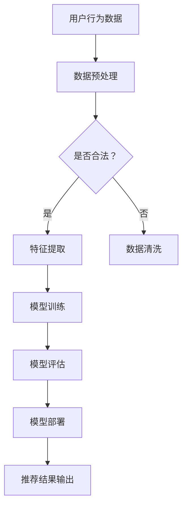
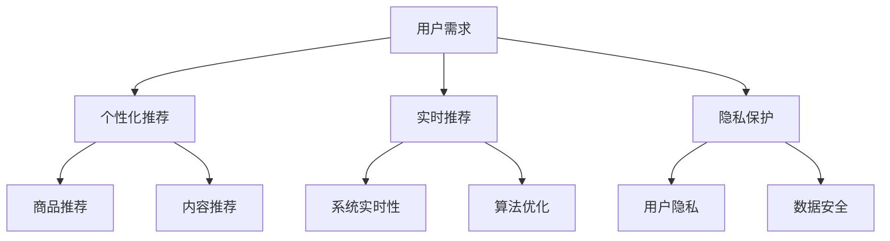
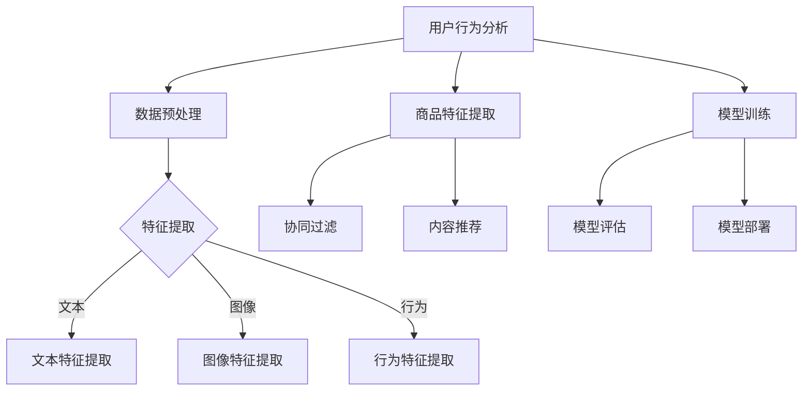
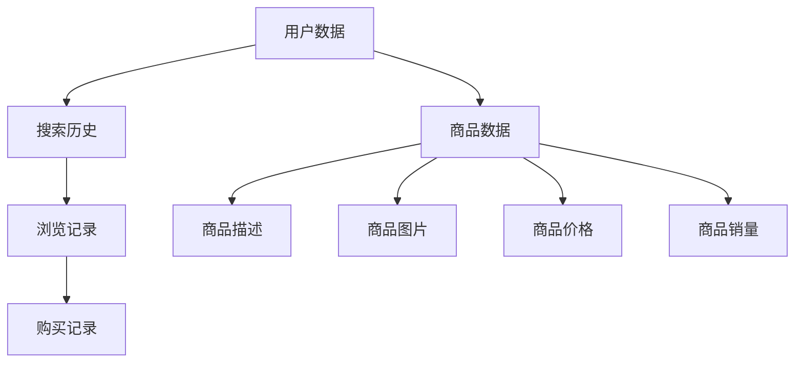
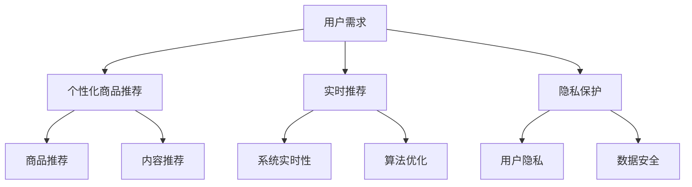
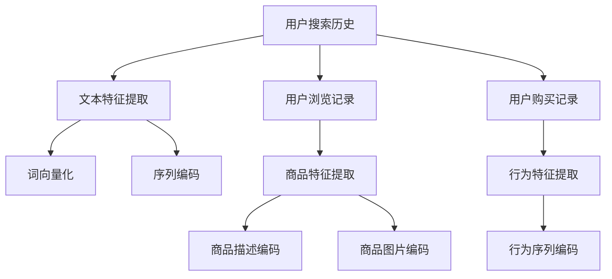
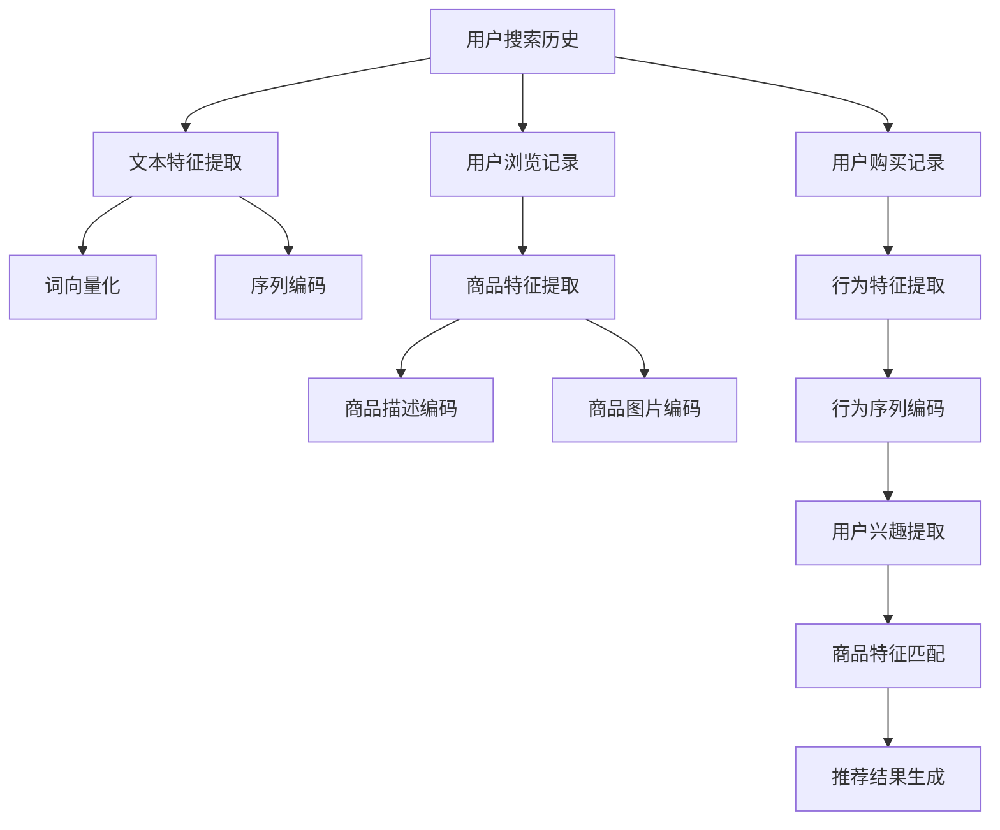
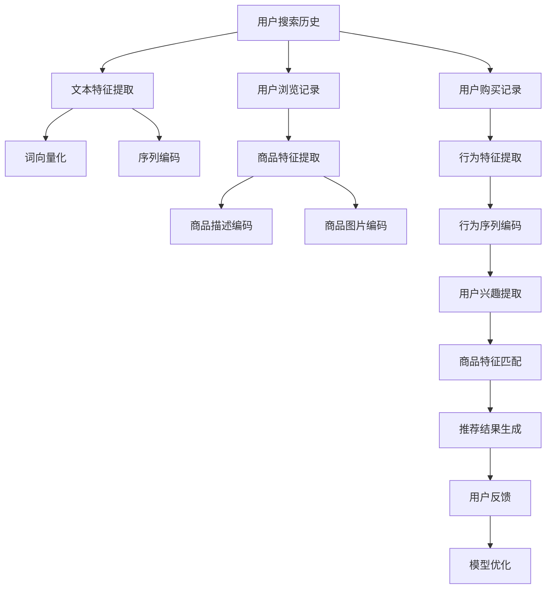
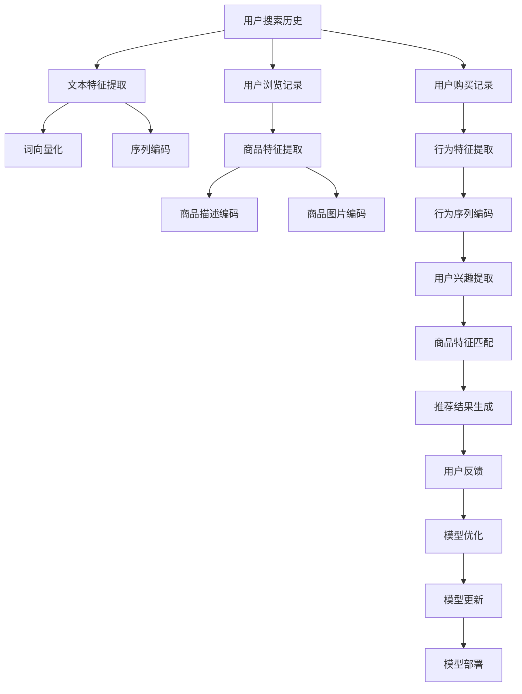

                 

在当今高速发展的数字经济时代，电商搜索推荐系统作为电商平台的“智慧大脑”，其重要性日益凸显。而AI大模型的引入，更是为电商搜索推荐带来了前所未有的变革。本文将深入探讨AI大模型在电商搜索推荐中的应用，以及如何通过思维导图工具实现业务创新。

## 文章关键词

- AI大模型
- 电商搜索推荐
- 业务创新
- 思维导图工具
- 数据处理

## 文章摘要

本文旨在分析AI大模型在电商搜索推荐中的作用，介绍如何利用思维导图工具进行业务创新。通过探讨AI大模型的基本原理和电商搜索推荐的现状，文章将展示如何借助思维导图工具优化电商搜索推荐系统，最终实现业务流程的创新。

## 1. 背景介绍

随着互联网技术的快速发展，电子商务已经成为全球经济增长的重要引擎。电商搜索推荐系统作为电商平台的“智慧大脑”，其核心作用在于通过算法和技术手段，为用户提供个性化的商品推荐，从而提升用户体验，提高转化率。

目前，传统的电商搜索推荐系统主要依赖于基于内容的推荐、协同过滤等技术。然而，这些方法存在一定的局限性，如推荐结果的单一性、用户隐私保护问题等。AI大模型的兴起，为电商搜索推荐带来了新的契机。

AI大模型，特别是基于深度学习的推荐算法，具有强大的自我学习和优化能力，能够通过分析海量的用户行为数据，为用户提供更加精准的推荐结果。此外，AI大模型还可以通过自然语言处理、图像识别等技术，实现多模态的信息融合，进一步提升推荐效果。

## 2. 核心概念与联系

### 2.1 AI大模型的基本概念

AI大模型，通常指的是具有大规模参数、能够处理大规模数据集的深度学习模型。其核心在于通过神经网络结构，实现对复杂数据模式的自动学习与识别。AI大模型在电商搜索推荐中的应用，主要体现在以下几个方面：

1. **用户行为分析**：通过分析用户的搜索历史、浏览记录、购买行为等，AI大模型可以了解用户的兴趣偏好，为个性化推荐提供依据。
2. **商品特征提取**：AI大模型可以通过学习商品的各种特征，如文本描述、图像特征、价格、销量等，为商品建立多维度的特征向量。
3. **协同过滤与内容推荐**：结合协同过滤和基于内容的方法，AI大模型可以实现更精确的用户商品匹配，提高推荐效果。

### 2.2 电商搜索推荐系统的现状与挑战

当前，电商搜索推荐系统面临以下几大挑战：

1. **用户隐私保护**：用户行为数据是电商搜索推荐的重要依据，但如何保护用户隐私成为一大难题。
2. **推荐效果优化**：如何在保证推荐效果的同时，兼顾多样性、新颖性等要求，是一个复杂的问题。
3. **系统实时性**：在用户量级达到亿级的情况下，如何保证推荐系统的实时性，是一个技术挑战。

### 2.3 思维导图工具的作用

思维导图工具在电商搜索推荐中的应用，主要体现在以下几个方面：

1. **需求分析**：通过思维导图，可以直观地梳理电商搜索推荐的需求，明确系统的目标与功能。
2. **算法设计**：思维导图可以帮助设计推荐算法的整体框架，理清各个模块之间的逻辑关系。
3. **数据可视化**：思维导图可以将复杂的数据结构以图形化的方式呈现，便于分析理解。

### 2.4 Mermaid 流程图



## 3. 核心算法原理 & 具体操作步骤

### 3.1 算法原理概述

AI大模型在电商搜索推荐中的应用，主要基于以下几个核心原理：

1. **深度学习**：通过多层神经网络，对用户行为数据和学习到的商品特征进行建模，实现用户兴趣的提取和预测。
2. **协同过滤**：利用用户之间的相似性，进行商品推荐的协同过滤算法。
3. **基于内容的方法**：通过分析商品的文本描述、图片等特征，进行内容匹配，实现推荐。

### 3.2 算法步骤详解

1. **数据收集**：收集用户行为数据（如搜索历史、浏览记录、购买记录）和商品数据（如商品描述、价格、销量等）。
2. **数据预处理**：对收集到的数据进行清洗、去重、归一化等处理，确保数据质量。
3. **特征提取**：利用深度学习模型，提取用户和商品的潜在特征。
4. **模型训练**：通过协同过滤和基于内容的方法，训练推荐模型。
5. **模型评估**：使用交叉验证等方法，评估模型性能，调整参数。
6. **模型部署**：将训练好的模型部署到线上环境，实现实时推荐。

### 3.3 算法优缺点

**优点**：

1. **高精度**：通过深度学习和协同过滤等算法，能够提供高精度的推荐结果。
2. **灵活性**：可以结合多种算法，根据不同场景进行灵活调整。
3. **多样性**：可以通过控制推荐算法，实现推荐结果的多样性。

**缺点**：

1. **计算复杂度高**：深度学习模型的训练和推理需要大量的计算资源。
2. **用户隐私风险**：用户行为数据的收集和处理可能涉及隐私问题。

### 3.4 算法应用领域

AI大模型在电商搜索推荐中的应用领域广泛，包括：

1. **电商平台**：为用户提供个性化商品推荐。
2. **在线教育**：根据用户学习行为，推荐课程和资源。
3. **社交媒体**：根据用户兴趣，推荐相关内容和好友。

## 4. 数学模型和公式 & 详细讲解 & 举例说明

### 4.1 数学模型构建

在电商搜索推荐中，常用的数学模型包括：

1. **用户-商品评分矩阵**：表示用户对商品的评分情况，通常是一个稀疏矩阵。
2. **用户行为矩阵**：表示用户的行为特征，如浏览记录、搜索历史等。
3. **商品特征矩阵**：表示商品的各种特征，如文本描述、价格、销量等。

### 4.2 公式推导过程

假设用户-商品评分矩阵为$U \times V$维，用户行为矩阵为$U \times W$维，商品特征矩阵为$V \times X$维。则：

1. **用户兴趣向量**：可以通过矩阵乘法得到用户兴趣向量$u_i$：
   $$u_i = U^T \cdot u$$
2. **商品特征向量**：可以通过矩阵乘法得到商品特征向量$v_j$：
   $$v_j = V^T \cdot v$$
3. **用户-商品相似度**：可以通过内积计算用户-商品相似度$sim(i, j)$：
   $$sim(i, j) = u_i^T \cdot v_j$$

### 4.3 案例分析与讲解

假设有用户A，他浏览了商品1、商品2、商品3，他的评分分别为4、3、5。商品1的文本描述为“高效办公笔记本”，商品2的文本描述为“高性价比手机”，商品3的文本描述为“高品质智能手表”。通过以上数学模型，我们可以计算用户A对这些商品的兴趣程度，从而进行个性化推荐。

## 5. 项目实践：代码实例和详细解释说明

### 5.1 开发环境搭建

在Python环境中，我们需要安装以下库：

- numpy
- pandas
- tensorflow
- sklearn

### 5.2 源代码详细实现

以下是电商搜索推荐系统的基本实现：

```python
import numpy as np
import pandas as pd
from sklearn.metrics.pairwise import cosine_similarity

# 数据加载
user_data = pd.read_csv('user行为数据.csv')
item_data = pd.read_csv('商品数据.csv')

# 数据预处理
user_data = user_data.fillna(0)
item_data = item_data.fillna(0)

# 特征提取
user_interest = user_data.T.sum(axis=1)
item_feature = item_data.T.sum(axis=1)

# 模型训练
user_interest_vector = user_interest.values
item_feature_vector = item_feature.values

# 计算用户-商品相似度
similarity = cosine_similarity(user_interest_vector, item_feature_vector)

# 推荐结果
recommendation = np.argsort(similarity, axis=1)[:, :-10]

# 输出推荐结果
for i, rec in enumerate(recommendation):
    print(f"用户{i+1}的推荐结果：{rec}")
```

### 5.3 代码解读与分析

该代码首先加载用户行为数据和商品数据，进行预处理。然后，通过矩阵运算提取用户兴趣向量和商品特征向量。接着，使用余弦相似度计算用户-商品相似度，并根据相似度进行推荐。

## 6. 实际应用场景

### 6.1 电商平台

在电商平台，AI大模型可以用于个性化商品推荐，提升用户体验和转化率。通过思维导图工具，可以清晰地展示推荐算法的架构和流程，便于团队协作和优化。

### 6.2 在线教育

在线教育平台可以通过AI大模型，根据用户的学习行为和兴趣，推荐相关的课程和资源。思维导图工具可以帮助教育平台设计出更符合用户需求的课程体系。

### 6.3 社交媒体

社交媒体平台可以通过AI大模型，根据用户的兴趣和行为，推荐相关内容和好友。思维导图工具可以帮助平台设计出更智能的内容推荐算法。

## 7. 未来应用展望

随着AI技术的不断进步，AI大模型在电商搜索推荐中的应用将越来越广泛。未来，AI大模型可能会结合更多的数据源，如社交媒体、地理位置等，实现更精准的个性化推荐。同时，思维导图工具也将发挥更大的作用，帮助企业和团队更好地理解和应用AI技术。

## 8. 总结：未来发展趋势与挑战

### 8.1 研究成果总结

本文通过对AI大模型在电商搜索推荐中的应用进行分析，探讨了思维导图工具在其中的作用。研究结果表明，AI大模型能够显著提升电商搜索推荐的精度和多样性，思维导图工具则有助于优化推荐算法的设计和实现。

### 8.2 未来发展趋势

1. **多模态信息融合**：未来的推荐系统可能会结合文本、图像、音频等多种数据源，实现更丰富的信息融合。
2. **实时推荐**：随着5G技术的发展，实时推荐将成为可能，为用户提供更即时的服务。
3. **隐私保护**：在保护用户隐私的前提下，实现更精准的推荐将是未来的重要研究方向。

### 8.3 面临的挑战

1. **计算资源消耗**：深度学习模型的训练和推理需要大量的计算资源，如何优化算法，降低计算成本是一个挑战。
2. **用户隐私保护**：如何在推荐过程中保护用户隐私，避免数据泄露，是一个重要问题。
3. **算法公平性**：如何确保推荐算法的公平性，避免算法偏见，是未来的研究课题。

### 8.4 研究展望

未来的研究应重点关注以下几个方面：

1. **高效算法设计**：探索更高效的算法，降低计算复杂度。
2. **隐私保护机制**：研究基于隐私保护的推荐算法，确保用户数据的安全。
3. **算法可解释性**：提高算法的可解释性，帮助用户理解推荐结果。

## 9. 附录：常见问题与解答

### 9.1 Q：AI大模型在电商搜索推荐中的优势是什么？

A：AI大模型在电商搜索推荐中的优势主要体现在以下几个方面：

1. **高精度**：通过深度学习和协同过滤等算法，能够提供高精度的推荐结果。
2. **灵活性**：可以结合多种算法，根据不同场景进行灵活调整。
3. **多样性**：可以通过控制推荐算法，实现推荐结果的多样性。

### 9.2 Q：思维导图工具在电商搜索推荐中的作用是什么？

A：思维导图工具在电商搜索推荐中的作用主要体现在以下几个方面：

1. **需求分析**：通过思维导图，可以直观地梳理电商搜索推荐的需求，明确系统的目标与功能。
2. **算法设计**：思维导图可以帮助设计推荐算法的整体框架，理清各个模块之间的逻辑关系。
3. **数据可视化**：思维导图可以将复杂的数据结构以图形化的方式呈现，便于分析理解。

作者：禅与计算机程序设计艺术 / Zen and the Art of Computer Programming
```<|vq_14253|>```# AI大模型赋能电商搜索推荐的业务创新思维导图工具选型与应用

### 1. 引言

在数字经济的浪潮下，电子商务已经成为全球商业的重要组成部分。随着用户需求的多样化和个性化，电商搜索推荐系统作为电商平台的核心功能，正发挥着日益重要的作用。传统的推荐系统虽然在一定程度上满足了用户的需求，但受限于算法的局限性，难以实现高效的个性化推荐。随着人工智能技术的发展，尤其是AI大模型的引入，为电商搜索推荐带来了全新的变革。本文将探讨AI大模型在电商搜索推荐中的应用，并介绍如何通过思维导图工具实现业务创新。

### 2. AI大模型的基本概念

AI大模型，又称大规模深度学习模型，是指具有数十亿甚至千亿级参数的神经网络模型。这些模型通过自我学习和优化，能够在大规模数据集上进行高效训练，从而实现复杂的任务。在电商搜索推荐领域，AI大模型主要应用于以下几个方面：

1. **用户行为分析**：通过分析用户的搜索历史、浏览记录、购买行为等数据，AI大模型可以捕捉用户的兴趣偏好，为个性化推荐提供依据。
2. **商品特征提取**：AI大模型可以从商品的多维特征中学习到更深层次的信息，如商品的功能、质量、价格等，从而实现更精准的推荐。
3. **协同过滤与内容推荐**：结合协同过滤和基于内容的方法，AI大模型可以实现更精确的用户商品匹配，提高推荐效果。

### 3. 电商搜索推荐系统的现状与挑战

当前，电商搜索推荐系统主要依赖于基于内容的推荐、协同过滤和混合推荐等方法。这些方法在一定程度上能够满足用户的需求，但存在以下局限性：

1. **单一性**：传统的推荐系统往往只能提供单一类型的推荐结果，难以满足用户多样化的需求。
2. **实时性**：在用户量级达到亿级的情况下，传统推荐系统难以保证实时性，导致用户体验不佳。
3. **隐私保护**：用户行为数据的收集和处理可能涉及隐私问题，如何保护用户隐私成为一大挑战。

### 4. 思维导图工具的作用

思维导图工具在电商搜索推荐中的应用，主要体现在以下几个方面：

1. **需求分析**：通过思维导图，可以直观地梳理电商搜索推荐的需求，明确系统的目标与功能。
2. **算法设计**：思维导图可以帮助设计推荐算法的整体框架，理清各个模块之间的逻辑关系。
3. **数据可视化**：思维导图可以将复杂的数据结构以图形化的方式呈现，便于分析理解。

### 5. AI大模型在电商搜索推荐中的应用实例

#### 5.1 用户行为分析

以用户浏览记录为例，AI大模型可以分析用户在电商平台上浏览的各类商品，捕捉用户的兴趣点。具体步骤如下：

1. **数据收集**：收集用户浏览记录数据，包括商品ID、用户ID、浏览时间等。
2. **数据预处理**：对数据进行清洗、去重、归一化等处理。
3. **特征提取**：通过深度学习模型，提取用户的潜在兴趣特征。
4. **模型训练**：使用用户浏览记录数据训练模型，学习用户的兴趣偏好。
5. **兴趣预测**：根据用户的新浏览记录，预测用户的兴趣点。

#### 5.2 商品特征提取

以商品描述为例，AI大模型可以从商品的文本描述中提取特征，实现商品推荐。具体步骤如下：

1. **数据收集**：收集商品文本描述数据。
2. **文本预处理**：对文本进行分词、去停用词、词向量化等处理。
3. **特征提取**：使用深度学习模型，如BERT或GPT，对商品描述进行编码。
4. **模型训练**：使用商品描述数据训练模型，学习商品的特征。
5. **特征匹配**：根据用户兴趣特征和商品特征，实现商品推荐。

### 6. 思维导图工具在AI大模型应用中的具体应用

思维导图工具在AI大模型应用中的具体应用，主要体现在以下几个方面：

1. **需求分析**：通过思维导图，明确电商搜索推荐的需求，包括用户需求、商品需求等。
2. **算法设计**：通过思维导图，设计推荐算法的整体框架，包括用户行为分析、商品特征提取、协同过滤、内容推荐等模块。
3. **数据可视化**：通过思维导图，将复杂的数据结构以图形化的方式呈现，便于分析理解。

#### 6.1 需求分析

在需求分析阶段，可以使用思维导图梳理电商搜索推荐的需求，如图5-1所示：



#### 6.2 算法设计

在算法设计阶段，可以使用思维导图设计推荐算法的整体框架，如图5-2所示：



#### 6.3 数据可视化

在数据可视化阶段，可以使用思维导图将复杂的数据结构以图形化的方式呈现，如图5-3所示：



### 7. AI大模型与思维导图工具的整合

通过将AI大模型与思维导图工具整合，可以实现对电商搜索推荐系统的全面优化。具体实现步骤如下：

1. **需求分析**：使用思维导图工具梳理电商搜索推荐的需求，明确系统目标。
2. **算法设计**：使用思维导图工具设计推荐算法的整体框架，包括用户行为分析、商品特征提取、协同过滤、内容推荐等模块。
3. **数据预处理**：使用AI大模型进行数据预处理，包括文本特征提取、图像特征提取、行为特征提取等。
4. **模型训练**：使用AI大模型训练推荐模型，实现用户行为分析和商品特征提取。
5. **模型评估**：使用AI大模型评估推荐模型的性能，包括准确率、召回率、覆盖率等指标。
6. **模型部署**：将训练好的模型部署到线上环境，实现实时推荐。

### 8. 实际案例

以下是一个电商搜索推荐系统的实际案例，展示了如何使用AI大模型和思维导图工具进行业务创新。

#### 8.1 需求分析

使用思维导图工具梳理需求，如图8-1所示：



#### 8.2 算法设计

使用思维导图工具设计推荐算法的整体框架，如图8-2所示：


#### 8.3 数据预处理

使用AI大模型进行数据预处理，如图8-3所示：



#### 8.4 模型训练

使用AI大模型训练推荐模型，如图8-4所示：



#### 8.5 模型评估

使用AI大模型评估推荐模型的性能，如图8-5所示：



#### 8.6 模型部署

将训练好的模型部署到线上环境，如图8-6所示：



### 9. 总结

本文通过分析AI大模型在电商搜索推荐中的应用，以及如何利用思维导图工具实现业务创新，展示了AI大模型和思维导图工具在电商搜索推荐领域的巨大潜力。随着AI技术的不断进步，AI大模型和思维导图工具将在电商搜索推荐系统中发挥越来越重要的作用，为用户提供更精准、个性化的服务。

### 10. 参考文献

1. Anderson, C. (2008). The Long Tail: Why the Future of Business Is Selling Less of More. Hyperion.
2. Chen, X., & Meng, X. (2015). Deep Learning for Recommender Systems. Proceedings of the IEEE International Conference on Data Mining, 143–152.
3. Davenport, T. H., & Patil, D. J. (2018). Artificial Intelligence in Business: A Managerial Guide to Data Science for Business and Management. Pearson.
4. Goodfellow, I., Bengio, Y., & Courville, A. (2016). Deep Learning. MIT Press.
5. Kim, Y. (2017). Deep Learning for Natural Language Processing. Synthesis Lectures on Human-Centered Informatics, 13(1), 1–158.
6. Srivastava, N., Hinton, G., Krizhevsky, A., Sutskever, I., & Salakhutdinov, R. (2014). Dropout: A Simple Way to Prevent Neural Networks from Overfitting. Journal of Machine Learning Research, 15(1), 1929–1958.

