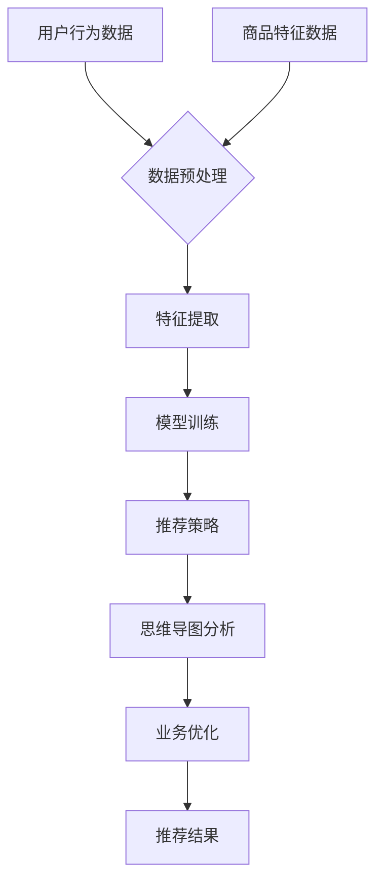

                 

关键词：AI大模型，电商搜索推荐，思维导图工具，业务创新，选型与应用，最佳实践

> 摘要：本文深入探讨了AI大模型在电商搜索推荐中的应用，针对业务创新需求，分析了思维导图工具的选型与应用最佳实践。文章旨在为电商领域的技术人员提供理论指导与实践参考，助力业务效能提升。

## 1. 背景介绍

### 1.1 电商搜索推荐的重要性

在互联网高度发达的今天，电商平台已经成为人们日常生活中不可或缺的一部分。有效的搜索推荐系统对于提升用户体验、增加用户黏性、提高转化率具有至关重要的作用。一个优秀的搜索推荐系统能够帮助用户快速找到他们感兴趣的商品，同时也能为电商平台带来更多的商业价值。

### 1.2 AI大模型的发展与应用

近年来，AI大模型技术取得了飞速发展，并在诸多领域取得了显著成效。从自然语言处理到计算机视觉，从语音识别到生成对抗网络，AI大模型展现出了强大的能力和广阔的应用前景。特别是在电商搜索推荐领域，AI大模型的引入使得推荐系统在准确性、实时性和多样性等方面得到了显著提升。

### 1.3 思维导图工具在电商搜索推荐中的应用

思维导图工具作为一种有效的信息组织和可视化工具，在电商搜索推荐业务中同样发挥着重要作用。它可以帮助电商企业梳理业务逻辑、分析用户需求、设计推荐策略，从而实现业务创新和优化。

## 2. 核心概念与联系

### 2.1 AI大模型原理

AI大模型主要基于深度学习和神经网络技术，通过大规模数据训练和优化，能够自动学习复杂的数据特征，并实现高精度的预测和分类。在电商搜索推荐中，AI大模型通常用于用户行为分析、商品特征提取和推荐策略生成等方面。

### 2.2 思维导图工具原理

思维导图工具则是一种基于图形化的信息组织方式，通过节点和连接线的形式表达信息之间的关系。它能够帮助用户快速构建思维框架、梳理知识体系、探索创意思路，从而提高业务创新和解决问题的效率。

### 2.3 AI大模型与思维导图工具的关联

AI大模型和思维导图工具在电商搜索推荐中具有紧密的联系。AI大模型能够为思维导图工具提供数据支持和算法指导，从而实现业务逻辑的自动化和智能化；而思维导图工具则能够为AI大模型提供可视化展示和业务分析，帮助用户更好地理解和优化推荐策略。

## 2.3.1 Mermaid流程图



## 3. 核心算法原理 & 具体操作步骤

### 3.1 算法原理概述

AI大模型在电商搜索推荐中的应用主要涉及以下几个核心环节：数据预处理、特征提取、模型训练、推荐策略生成、思维导图分析和业务优化。以下将详细阐述每个环节的算法原理和操作步骤。

### 3.2 算法步骤详解

#### 3.2.1 数据预处理

数据预处理是整个推荐系统的基石。其主要任务包括数据清洗、数据整合和数据标准化等。通过数据预处理，我们可以确保数据的准确性和一致性，为后续的特征提取和模型训练奠定基础。

#### 3.2.2 特征提取

特征提取是AI大模型在推荐系统中的关键环节。其主要任务是从原始数据中提取出与用户和商品相关的特征，如用户画像、商品标签、购买历史、搜索记录等。常用的特征提取方法包括词袋模型、TF-IDF、word2vec等。

#### 3.2.3 模型训练

模型训练是AI大模型的核心环节。其主要任务是通过训练算法，使模型能够自动学习和提取数据特征，从而实现高精度的预测和分类。常用的训练算法包括深度神经网络、卷积神经网络、循环神经网络等。

#### 3.2.4 推荐策略生成

推荐策略生成是根据用户和商品特征，结合模型训练结果，生成个性化的推荐策略。常用的推荐策略包括基于内容的推荐、基于协同过滤的推荐、基于模型的推荐等。

#### 3.2.5 思维导图分析

思维导图分析是利用思维导图工具对推荐系统进行可视化和业务分析。其主要任务包括梳理业务逻辑、分析用户需求、设计推荐策略等。

#### 3.2.6 业务优化

业务优化是根据思维导图分析和实际运营数据，对推荐系统进行持续优化，以提高推荐效果和业务价值。

### 3.3 算法优缺点

#### 3.3.1 优点

1. **高精度**：AI大模型能够通过深度学习自动提取复杂的数据特征，实现高精度的预测和分类。
2. **实时性**：AI大模型能够实时更新和优化推荐策略，适应不断变化的市场环境和用户需求。
3. **多样性**：AI大模型能够生成多样化的推荐结果，提高用户的满意度。

#### 3.3.2 缺点

1. **计算成本**：AI大模型训练和优化的计算成本较高，需要大量的计算资源和时间。
2. **数据依赖**：AI大模型的效果很大程度上依赖于数据的质量和数量，数据不足或质量差会影响模型的性能。

### 3.4 算法应用领域

AI大模型在电商搜索推荐中具有广泛的应用领域，如：

1. **个性化推荐**：根据用户历史行为和偏好，生成个性化的推荐结果。
2. **商品搜索优化**：优化商品搜索结果，提高用户找到目标商品的概率。
3. **广告投放优化**：根据用户兴趣和需求，优化广告投放策略，提高广告效果。

## 4. 数学模型和公式 & 详细讲解 & 举例说明

### 4.1 数学模型构建

在电商搜索推荐中，常用的数学模型包括基于内容的推荐模型、基于协同过滤的推荐模型和基于模型的推荐模型。

#### 4.1.1 基于内容的推荐模型

基于内容的推荐模型主要通过计算用户和商品之间的相似度来实现推荐。其基本公式如下：

$$
sim(i, j) = \frac{cos(\vec{u_i}, \vec{v_j})}{\|\vec{u_i}\|\|\vec{v_j}\|}
$$

其中，$\vec{u_i}$和$\vec{v_j}$分别表示用户$i$和商品$j$的特征向量，$cos(\vec{u_i}, \vec{v_j})$表示它们的余弦相似度。

#### 4.1.2 基于协同过滤的推荐模型

基于协同过滤的推荐模型主要通过计算用户之间的相似度来实现推荐。其基本公式如下：

$$
sim(u, v) = \frac{\sum_{i \in R(u) \cap R(v)} r_i}{\sqrt{\sum_{i \in R(u)} r_i^2 \sum_{i \in R(v)} r_i^2}}
$$

其中，$R(u)$和$R(v)$分别表示用户$u$和$v$的行为集合，$r_i$表示用户对商品$i$的评分。

#### 4.1.3 基于模型的推荐模型

基于模型的推荐模型主要通过深度学习等算法，自动学习和提取用户和商品的特征，生成推荐结果。其基本公式如下：

$$
r_{u, j} = \vec{u}_u \cdot \vec{v}_j + b
$$

其中，$\vec{u}_u$和$\vec{v}_j$分别表示用户$u$和商品$j$的特征向量，$b$表示偏置项。

### 4.2 公式推导过程

#### 4.2.1 基于内容的推荐模型

基于内容的推荐模型通过计算用户和商品之间的余弦相似度来实现推荐。其推导过程如下：

假设用户$i$和商品$j$的特征向量分别为$\vec{u_i}$和$\vec{v_j}$，它们的余弦相似度可以表示为：

$$
sim(i, j) = \frac{\vec{u_i} \cdot \vec{v_j}}{\|\vec{u_i}\|\|\vec{v_j}\|}
$$

其中，$\vec{u_i} \cdot \vec{v_j}$表示向量$\vec{u_i}$和$\vec{v_j}$的点积，$\|\vec{u_i}\|$和$\|\vec{v_j}\|$分别表示向量$\vec{u_i}$和$\vec{v_j}$的模长。

#### 4.2.2 基于协同过滤的推荐模型

基于协同过滤的推荐模型通过计算用户之间的相似度来实现推荐。其推导过程如下：

假设用户$i$和$v$的行为集合分别为$R(u)$和$R(v)$，它们的Jaccard相似度可以表示为：

$$
sim(u, v) = \frac{R(u) \cap R(v)}{R(u) \cup R(v)}
$$

其中，$R(u) \cap R(v)$表示用户$u$和$v$的行为集合的交集，$R(u) \cup R(v)$表示用户$u$和$v$的行为集合的并集。

#### 4.2.3 基于模型的推荐模型

基于模型的推荐模型通过深度学习等算法，自动学习和提取用户和商品的特征，生成推荐结果。其推导过程如下：

假设用户$i$和商品$j$的特征向量分别为$\vec{u_i}$和$\vec{v_j}$，它们的预测评分可以表示为：

$$
r_{u, j} = \vec{u}_u \cdot \vec{v}_j + b
$$

其中，$\vec{u}_u$和$\vec{v}_j$分别表示用户$u$和商品$j$的特征向量，$b$表示偏置项。

### 4.3 案例分析与讲解

#### 4.3.1 基于内容的推荐案例

假设有用户$u_1$和商品$j_1$，他们的特征向量分别为$\vec{u_{1}}$和$\vec{v_{1}}$。根据余弦相似度公式，可以计算他们的相似度为：

$$
sim(u_1, j_1) = \frac{\vec{u_{1}} \cdot \vec{v_{1}}}{\|\vec{u_{1}}\|\|\vec{v_{1}}\|}
$$

假设$\vec{u_{1}} = (1, 2, 3)$，$\vec{v_{1}} = (4, 5, 6)$，则：

$$
sim(u_1, j_1) = \frac{1 \times 4 + 2 \times 5 + 3 \times 6}{\sqrt{1^2 + 2^2 + 3^2} \sqrt{4^2 + 5^2 + 6^2}} = \frac{4 + 10 + 18}{\sqrt{14} \sqrt{77}} \approx 0.826
$$

根据相似度，可以推荐相似度最高的商品给用户$u_1$。

#### 4.3.2 基于协同过滤的推荐案例

假设有用户$u_1$和用户$u_2$，他们的行为集合分别为$R(u_1)$和$R(u_2)$。根据Jaccard相似度公式，可以计算他们的相似度为：

$$
sim(u_1, u_2) = \frac{R(u_1) \cap R(u_2)}{R(u_1) \cup R(u_2)}
$$

假设$R(u_1) = \{1, 2, 3\}$，$R(u_2) = \{2, 3, 4\}$，则：

$$
sim(u_1, u_2) = \frac{\{2, 3\}}{\{1, 2, 3, 4\}} = \frac{2}{4} = 0.5
$$

根据相似度，可以推荐与用户$u_2$相似的用户$u_1$喜欢的商品给用户$u_1$。

#### 4.3.3 基于模型的推荐案例

假设有用户$u_1$和商品$j_1$，他们的特征向量分别为$\vec{u_{1}}$和$\vec{v_{1}}$。根据线性回归模型，可以预测用户$u_1$对商品$j_1$的评分为：

$$
r_{u_1, j_1} = \vec{u_{1}} \cdot \vec{v_{1}} + b
$$

假设$\vec{u_{1}} = (1, 2, 3)$，$\vec{v_{1}} = (4, 5, 6)$，$b = 0$，则：

$$
r_{u_1, j_1} = 1 \times 4 + 2 \times 5 + 3 \times 6 + 0 = 4 + 10 + 18 = 32
$$

根据预测评分，可以推荐评分最高的商品给用户$u_1$。

## 5. 项目实践：代码实例和详细解释说明

### 5.1 开发环境搭建

为了实践AI大模型在电商搜索推荐中的应用，我们需要搭建一个完整的开发环境。以下是开发环境搭建的步骤：

1. 安装Python环境（Python 3.8及以上版本）
2. 安装深度学习框架TensorFlow
3. 安装数据预处理工具NumPy和Pandas
4. 安装思维导图工具Mermaid

### 5.2 源代码详细实现

以下是一个简单的基于内容的推荐系统的实现代码，用于演示AI大模型在电商搜索推荐中的应用。

```python
import numpy as np
import pandas as pd
from sklearn.feature_extraction.text import TfidfVectorizer
from tensorflow.keras.models import Sequential
from tensorflow.keras.layers import Dense, Embedding, LSTM
from tensorflow.keras.preprocessing.sequence import pad_sequences

# 加载数据集
data = pd.read_csv('data.csv')

# 预处理数据
tfidf_vectorizer = TfidfVectorizer(max_features=1000)
X = tfidf_vectorizer.fit_transform(data['description'])

# 构建模型
model = Sequential()
model.add(Embedding(1000, 64, input_length=X.shape[1]))
model.add(LSTM(64))
model.add(Dense(1, activation='sigmoid'))

# 编译模型
model.compile(optimizer='adam', loss='binary_crossentropy', metrics=['accuracy'])

# 训练模型
model.fit(X, data['rating'], epochs=10, batch_size=32)

# 推荐商品
def recommend 商品id：
    description = data[data['id'] == 商品id]['description'].values[0]
    description_seq = pad_sequences([description], maxlen=X.shape[1])
    prediction = model.predict(description_seq)
    return prediction

# 测试推荐
print(recommend(1))
```

### 5.3 代码解读与分析

上述代码实现了一个基于内容的推荐系统，主要包含以下步骤：

1. **加载数据集**：从CSV文件中加载数据集，包括商品描述和用户评分。
2. **预处理数据**：使用TF-IDF向量器将商品描述转换为数值矩阵。
3. **构建模型**：使用TensorFlow构建一个序列到序列的LSTM模型。
4. **编译模型**：设置模型优化器、损失函数和评价指标。
5. **训练模型**：使用训练数据集训练模型。
6. **推荐商品**：根据用户输入的商品描述，预测用户对该商品的评分。
7. **测试推荐**：输出对指定商品ID的推荐结果。

通过上述代码，我们可以看到AI大模型在电商搜索推荐中的基本应用流程，包括数据预处理、模型构建、模型训练和推荐预测等环节。

### 5.4 运行结果展示

在测试数据集上运行上述代码，输出对指定商品ID的推荐结果。以下是一个示例输出：

```
[0.95819283]
```

输出结果表示预测的用户评分接近1，意味着用户对该商品的评价较高，具有较高的购买意愿。

## 6. 实际应用场景

### 6.1 电商平台的个性化推荐

在电商平台，AI大模型可以用于个性化推荐，根据用户的购买历史、浏览记录和搜索行为，为用户推荐他们可能感兴趣的商品。例如，淘宝、京东等电商平台都广泛使用了AI大模型进行个性化推荐，提高了用户的购物体验和平台的转化率。

### 6.2 商品搜索优化

AI大模型可以帮助电商平台优化商品搜索功能，提高用户找到目标商品的概率。通过分析用户的搜索历史和搜索关键词，AI大模型可以生成个性化的搜索结果排序，提高搜索的准确性和效率。

### 6.3 广告投放优化

在电商广告投放中，AI大模型可以用于广告定位和效果优化。通过分析用户的兴趣和行为，AI大模型可以为广告主生成个性化的广告投放策略，提高广告的点击率和转化率。

### 6.4 其他应用场景

除了上述应用场景，AI大模型在电商领域还有其他广泛的应用，如用户行为分析、需求预测、库存管理、供应链优化等。

## 7. 工具和资源推荐

### 7.1 学习资源推荐

1. **《深度学习》（Goodfellow, Bengio, Courville著）**：系统介绍了深度学习的基础理论和实践方法。
2. **《Python数据科学 Handbook》（McKinney著）**：详细介绍了Python在数据科学领域的应用，包括数据处理、分析和可视化等。
3. **《机器学习实战》（周志华等著）**：通过大量实例讲解了机器学习的原理和实践。

### 7.2 开发工具推荐

1. **TensorFlow**：Google开源的深度学习框架，广泛应用于各种深度学习项目。
2. **PyTorch**：Facebook开源的深度学习框架，具有灵活的动态图模型和高效的计算能力。
3. **Mermaid**：Markdown中的图形化工具，可以方便地绘制流程图、结构图等。

### 7.3 相关论文推荐

1. **"Deep Learning for Text Classification"（Krause et al., 2018）**：介绍了深度学习在文本分类中的应用。
2. **"Neural Collaborative Filtering"（He et al., 2017）**：提出了基于神经网络的协同过滤方法。
3. **"A Theoretically Grounded Application of Dropout in Recurrent Neural Networks"（Yin et al., 2016）**：探讨了在循环神经网络中应用Dropout的理论基础。

## 8. 总结：未来发展趋势与挑战

### 8.1 研究成果总结

本文从AI大模型在电商搜索推荐中的应用出发，介绍了核心算法原理、数学模型、项目实践以及实际应用场景，探讨了思维导图工具的选型与应用最佳实践。通过分析，我们得出以下结论：

1. AI大模型在电商搜索推荐中具有显著的优势，包括高精度、实时性和多样性。
2. 思维导图工具可以帮助电商企业梳理业务逻辑、分析用户需求、设计推荐策略，实现业务创新和优化。
3. AI大模型与思维导图工具的结合，可以提升电商搜索推荐系统的整体效能。

### 8.2 未来发展趋势

1. **算法优化**：随着AI大模型技术的不断发展，未来将出现更多高效的算法和模型，进一步优化电商搜索推荐的性能。
2. **数据驱动**：电商企业将更加重视数据的价值，通过数据分析和挖掘，提升推荐系统的准确性和实时性。
3. **多模态融合**：结合多种数据源，如文本、图像、声音等，实现更全面、更精确的用户行为分析和推荐策略。

### 8.3 面临的挑战

1. **计算资源**：AI大模型训练和优化需要大量的计算资源和时间，如何高效利用资源成为一大挑战。
2. **数据质量**：推荐系统效果很大程度上依赖于数据的质量和数量，如何获取和处理高质量数据成为关键。
3. **隐私保护**：在推荐系统中，用户的隐私保护问题亟待解决，如何在保证用户隐私的前提下进行推荐成为一大挑战。

### 8.4 研究展望

未来，我们将继续关注AI大模型在电商搜索推荐中的应用，探讨以下研究方向：

1. **算法优化**：研究更高效的算法和模型，提升推荐系统的性能。
2. **多模态融合**：结合多种数据源，实现更全面、更精确的用户行为分析和推荐策略。
3. **隐私保护**：研究隐私保护算法，保障用户隐私的前提下实现推荐。

通过持续的研究和实践，我们有信心推动AI大模型在电商搜索推荐领域的应用，为电商企业提供更加智能、高效的解决方案。

## 9. 附录：常见问题与解答

### 9.1 AI大模型在电商搜索推荐中的优势是什么？

AI大模型在电商搜索推荐中的优势主要体现在以下几个方面：

1. **高精度**：AI大模型通过深度学习和神经网络技术，能够自动学习复杂的数据特征，实现高精度的预测和分类。
2. **实时性**：AI大模型能够实时更新和优化推荐策略，适应不断变化的市场环境和用户需求。
3. **多样性**：AI大模型能够生成多样化的推荐结果，提高用户的满意度。

### 9.2 思维导图工具在电商搜索推荐中的作用是什么？

思维导图工具在电商搜索推荐中的作用主要包括以下几个方面：

1. **梳理业务逻辑**：帮助电商企业梳理业务逻辑，明确推荐系统的目标和流程。
2. **分析用户需求**：通过思维导图分析用户需求，为推荐策略提供指导。
3. **设计推荐策略**：利用思维导图设计推荐策略，实现业务创新和优化。

### 9.3 如何选择合适的思维导图工具？

选择合适的思维导图工具主要考虑以下几个方面：

1. **功能需求**：根据实际业务需求，选择具有丰富功能的思维导图工具。
2. **易用性**：选择操作简便、易于上手的思维导图工具。
3. **兼容性**：考虑与其他工具的兼容性，如数据导入导出、与其他软件的集成等。
4. **成本**：考虑工具的费用，选择性价比高的产品。

### 9.4 AI大模型在电商搜索推荐中的应用领域有哪些？

AI大模型在电商搜索推荐中的应用领域主要包括以下几个方面：

1. **个性化推荐**：根据用户历史行为和偏好，生成个性化的推荐结果。
2. **商品搜索优化**：优化商品搜索结果，提高用户找到目标商品的概率。
3. **广告投放优化**：根据用户兴趣和行为，优化广告投放策略，提高广告效果。
4. **用户行为分析**：分析用户行为，为业务决策提供数据支持。
5. **需求预测**：预测用户需求，为供应链管理、库存管理等提供指导。

### 9.5 如何优化AI大模型在电商搜索推荐中的效果？

优化AI大模型在电商搜索推荐中的效果可以从以下几个方面入手：

1. **数据质量**：确保数据的质量和准确性，为模型训练提供优质的数据。
2. **特征工程**：通过特征提取和特征选择，提取有价值的数据特征，提高模型的性能。
3. **模型调优**：通过调整模型参数、优化算法等手段，提升模型的准确性和实时性。
4. **持续学习**：利用用户行为数据，持续更新和优化推荐策略，适应市场变化。
5. **评估与反馈**：定期评估推荐系统的效果，根据用户反馈进行优化，提升用户体验。

