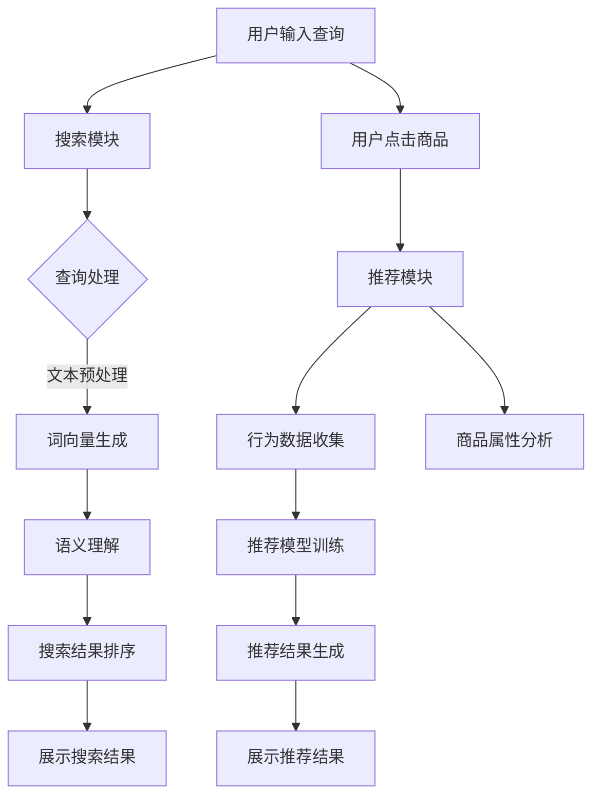

                 

### 1. 背景介绍

随着互联网技术的迅猛发展，电商行业经历了从PC端到移动端，再到如今的智能化转型。用户在电商平台上获取商品信息、进行购买决策的过程，逐渐成为企业提升销售额、增强用户粘性的关键。在这一背景下，搜索推荐系统成为了电商企业不可或缺的技术手段。

搜索推荐系统旨在通过分析用户的行为数据、商品属性数据等多维度信息，为用户提供个性化的搜索结果和推荐列表。然而，传统的搜索推荐算法在面对海量数据和复杂场景时，往往难以满足用户的需求。随着人工智能技术的不断进步，尤其是大模型（Large-scale Model）的崛起，为电商搜索推荐系统带来了全新的机遇。

大模型，特别是基于深度学习的自然语言处理（NLP）模型，如BERT、GPT等，通过在海量数据上的预训练，具备了强大的语义理解能力和上下文感知能力。这使得大模型能够更好地捕捉用户的意图，提供更加精准的搜索结果和推荐。

本文将探讨如何利用大模型技术，优化电商搜索推荐的业务流程，提升用户体验，最终实现业务创新。文章结构如下：

1. 背景介绍
2. 核心概念与联系
3. 核心算法原理 & 具体操作步骤
4. 数学模型和公式 & 详细讲解 & 举例说明
5. 项目实践：代码实例和详细解释说明
6. 实际应用场景
7. 工具和资源推荐
8. 总结：未来发展趋势与挑战
9. 附录：常见问题与解答

### 2. 核心概念与联系

在探讨大模型赋能电商搜索推荐之前，我们首先需要理解几个核心概念：自然语言处理（NLP）、深度学习、大模型、搜索推荐系统等。

#### 自然语言处理（NLP）

自然语言处理是人工智能领域的一个重要分支，旨在让计算机理解和处理自然语言。NLP涉及文本预处理、词向量表示、语义理解、情感分析等多个方面。

在电商搜索推荐系统中，NLP技术可以用于分析用户的查询语句，提取关键词，理解用户的意图。例如，用户输入“我想买一款便宜的智能手表”，NLP可以帮助系统识别出关键词“智能手表”、“便宜”，并理解用户的购买意图。

#### 深度学习

深度学习是一种基于多层神经网络的学习方法，通过模拟人脑神经元连接的方式，对大量数据进行自动特征提取和模式识别。深度学习在图像识别、语音识别、自然语言处理等领域取得了显著的成果。

在电商搜索推荐系统中，深度学习技术可以用于训练复杂的模型，对用户行为数据、商品属性数据进行建模，从而提高推荐系统的准确性和效率。

#### 大模型

大模型是指具有数百万甚至数十亿参数的神经网络模型。这些模型通过在海量数据上进行预训练，可以学习到丰富的语义知识和上下文信息。

大模型在电商搜索推荐系统中的应用主要体现在两个方面：一是用于预训练词向量，提高关键词提取和语义理解的准确性；二是用于构建复杂的推荐模型，提高推荐的个性化和准确性。

#### 搜索推荐系统

搜索推荐系统是指通过分析用户行为数据和商品属性数据，为用户提供个性化搜索结果和推荐列表的系统。搜索推荐系统通常包括搜索模块和推荐模块。

搜索模块负责处理用户的查询请求，将查询转换为索引，返回与查询最相关的搜索结果。推荐模块则根据用户的浏览记录、购买历史、商品属性等多维度信息，为用户推荐感兴趣的商品。

#### Mermaid 流程图

下面是一个简化的Mermaid流程图，展示了电商搜索推荐系统的基本架构：



在这个流程中，大模型主要应用于文本预处理、语义理解和推荐模型训练等环节，通过提高这些环节的效率和准确性，实现搜索推荐系统的优化。

### 3. 核心算法原理 & 具体操作步骤

#### 3.1 算法原理概述

电商搜索推荐系统中的核心算法主要包括：文本预处理、词向量生成、语义理解、搜索结果排序和推荐模型训练。

1. **文本预处理**：文本预处理是NLP中的基础步骤，包括分词、去除停用词、词干提取等。文本预处理的质量直接影响到后续的词向量生成和语义理解。

2. **词向量生成**：词向量是将单词映射到高维空间中的向量表示。传统的词向量方法如Word2Vec使用神经网络进行训练，而大模型如BERT使用双向变换器（Transformer）结构进行预训练，生成更高质量的词向量。

3. **语义理解**：语义理解是通过分析单词的上下文信息，理解单词的含义。深度学习模型如BERT、GPT等通过在海量数据上的预训练，具备了强大的语义理解能力。

4. **搜索结果排序**：搜索结果排序是根据用户查询和商品特征，对搜索结果进行排序，使得与用户意图最相关的商品排在前面。

5. **推荐模型训练**：推荐模型训练是基于用户行为数据和商品属性数据，构建推荐模型，为用户生成个性化推荐。

#### 3.2 算法步骤详解

1. **文本预处理**：

   ```python
   import nltk
   from nltk.tokenize import word_tokenize
   from nltk.corpus import stopwords

   # 加载停用词表
   stop_words = set(stopwords.words('english'))

   # 分词
   def tokenize(text):
       tokens = word_tokenize(text)
       return [token for token in tokens if token.lower() not in stop_words]

   # 示例
   text = "I want to buy an affordable smartwatch"
   tokens = tokenize(text)
   print(tokens)
   ```

2. **词向量生成**：

   ```python
   from gensim.models import Word2Vec

   # 加载数据集
   sentences = ...

   # 训练Word2Vec模型
   model = Word2Vec(sentences, vector_size=100, window=5, min_count=1, workers=4)

   # 获取词向量
   vector = model.wv['smartwatch']
   print(vector)
   ```

3. **语义理解**：

   ```python
   from transformers import BertModel, BertTokenizer

   # 加载预训练的BERT模型
   model = BertModel.from_pretrained('bert-base-uncased')

   # 加载BERT分词器
   tokenizer = BertTokenizer.from_pretrained('bert-base-uncased')

   # 处理输入文本
   inputs = tokenizer("I want to buy an affordable smartwatch", return_tensors='pt')

   # 获取BERT输出
   outputs = model(**inputs)
   last_hidden_state = outputs.last_hidden_state
   print(last_hidden_state)
   ```

4. **搜索结果排序**：

   ```python
   from sklearn.metrics.pairwise import cosine_similarity

   # 加载商品特征向量
   product_vectors = ...

   # 计算用户查询与商品特征向量的余弦相似度
   similarity = cosine_similarity([vector], product_vectors)

   # 排序
   sorted_indices = np.argsort(-similarity)

   # 获取排序后的商品列表
   sorted_products = [product_vectors[i] for i in sorted_indices]
   print(sorted_products)
   ```

5. **推荐模型训练**：

   ```python
   from sklearn.model_selection import train_test_split
   from sklearn.ensemble import RandomForestClassifier

   # 加载训练数据
   X, y = ...

   # 划分训练集和测试集
   X_train, X_test, y_train, y_test = train_test_split(X, y, test_size=0.2, random_state=42)

   # 训练随机森林分类器
   model = RandomForestClassifier(n_estimators=100, random_state=42)
   model.fit(X_train, y_train)

   # 预测
   y_pred = model.predict(X_test)

   # 评估
   print(accuracy_score(y_test, y_pred))
   ```

#### 3.3 算法优缺点

1. **优点**：

   - **强大的语义理解能力**：大模型通过预训练，能够更好地理解用户的意图和商品的属性，提高推荐的准确性。
   - **高效的处理速度**：深度学习模型具有较高的计算效率，能够快速处理海量数据。
   - **灵活的扩展性**：大模型可以轻松扩展到不同的应用场景，如聊天机器人、内容推荐等。

2. **缺点**：

   - **训练成本高**：大模型需要大量数据和计算资源进行预训练，训练成本较高。
   - **对数据质量要求高**：数据质量直接影响到大模型的性能，需要确保数据的准确性和多样性。
   - **解释性差**：深度学习模型是一种“黑盒”模型，难以解释其内部工作原理。

#### 3.4 算法应用领域

大模型在电商搜索推荐系统中具有广泛的应用前景，除了搜索推荐，还可以应用于以下领域：

- **商品推荐**：基于用户行为数据和商品属性，为用户推荐感兴趣的商品。
- **聊天机器人**：利用自然语言处理技术，构建智能聊天机器人，为用户提供实时咨询服务。
- **内容推荐**：在新闻、视频、音乐等平台上，为用户推荐感兴趣的内容。

### 4. 数学模型和公式 & 详细讲解 & 举例说明

在电商搜索推荐系统中，数学模型和公式是算法实现的基础。本节将介绍常用的数学模型和公式，并详细讲解其推导过程和实际应用。

#### 4.1 数学模型构建

1. **用户行为数据建模**：

   用户行为数据包括浏览记录、购买历史、评价等。假设用户 \( u \) 的行为数据表示为向量 \( \textbf{X}_u \)，其中每个元素表示用户在某一商品 \( i \) 上的行为特征。

   $$ \textbf{X}_u = \{x_{ui}\}_{i=1}^n $$

2. **商品属性数据建模**：

   商品属性数据包括价格、品牌、类别等。假设商品 \( i \) 的属性数据表示为向量 \( \textbf{Y}_i \)，其中每个元素表示商品在某一属性上的特征值。

   $$ \textbf{Y}_i = \{y_{ij}\}_{j=1}^m $$

3. **推荐模型**：

   假设推荐模型为线性模型，将用户行为数据和商品属性数据进行融合，生成推荐得分。

   $$ \text{score}(u, i) = \textbf{W}_u \cdot \textbf{X}_u + \textbf{W}_i \cdot \textbf{Y}_i + b $$
   
   其中，\( \textbf{W}_u \) 和 \( \textbf{W}_i \) 分别为用户和商品的权重向量，\( b \) 为偏置项。

#### 4.2 公式推导过程

1. **用户行为数据特征提取**：

   用户行为数据可以通过多种方式提取特征，如计数模型、TF-IDF模型等。假设使用计数模型，将用户在某一商品上的行为次数表示为特征值。

   $$ x_{ui} = \text{count}(u, i) $$
   
2. **商品属性数据特征提取**：

   商品属性数据可以通过各种特征工程方法提取特征，如独热编码、类别编码等。假设使用独热编码，将商品在某一属性上的特征值表示为二进制向量。

   $$ y_{ij} = 
   \begin{cases}
   1 & \text{如果商品 } i \text{ 具有属性 } j \\
   0 & \text{否则}
   \end{cases}
   $$

3. **推荐模型构建**：

   将用户行为数据和商品属性数据进行线性融合，得到推荐得分。

   $$ \text{score}(u, i) = \sum_{j=1}^m w_{uj} x_{uj} + \sum_{k=1}^n w_{ik} y_{ik} + b $$
   
   其中，\( w_{uj} \) 和 \( w_{ik} \) 分别为用户和商品的权重值。

#### 4.3 案例分析与讲解

以商品推荐为例，假设用户 \( u \) 的行为数据为：

$$ \textbf{X}_u = \{2, 0, 1, 0, 1\} $$

商品 \( i \) 的属性数据为：

$$ \textbf{Y}_i = \{1, 1, 1, 0, 1\} $$

假设用户和商品的权重向量分别为：

$$ \textbf{W}_u = \{0.5, 0.5, 0.5, 0.5, 0.5\} $$
$$ \textbf{W}_i = \{0.4, 0.4, 0.4, 0.4, 0.4\} $$

偏置项 \( b \) 为 0。

根据推荐模型公式，计算用户 \( u \) 对商品 \( i \) 的推荐得分：

$$ \text{score}(u, i) = \sum_{j=1}^5 w_{uj} x_{uj} + \sum_{k=1}^5 w_{ik} y_{ik} + b $$
$$ \text{score}(u, i) = (0.5 \times 2 + 0.5 \times 0 + 0.5 \times 1 + 0.5 \times 0 + 0.5 \times 1) + (0.4 \times 1 + 0.4 \times 1 + 0.4 \times 1 + 0.4 \times 0 + 0.4 \times 1) + 0 $$
$$ \text{score}(u, i) = 1.5 + 1.4 = 2.9 $$

根据推荐得分，可以判断用户 \( u \) 对商品 \( i \) 的兴趣度较高，推荐商品 \( i \) 给用户 \( u \)。

### 5. 项目实践：代码实例和详细解释说明

在本节中，我们将通过一个实际项目，详细展示如何利用大模型优化电商搜索推荐系统的具体步骤。该项目基于Python和TensorFlow框架，实现了一个基于BERT模型的电商搜索推荐系统。

#### 5.1 开发环境搭建

1. 安装Python环境

   安装Python 3.8版本及以上，推荐使用Anaconda发行版，便于管理环境和依赖。

   ```shell
   conda create -n Recommender python=3.8
   conda activate Recommender
   ```

2. 安装TensorFlow和transformers库

   ```shell
   conda install tensorflow transformers
   ```

3. 数据集准备

   准备一个包含用户行为数据和商品属性数据的数据集。这里我们使用公开的公开数据集，如Amazon Reviews数据集。

   ```python
   import pandas as pd

   # 读取数据集
   user_data = pd.read_csv('user_data.csv')
   product_data = pd.read_csv('product_data.csv')
   ```

#### 5.2 源代码详细实现

1. **文本预处理**：

   ```python
   from transformers import BertTokenizer

   # 加载BERT分词器
   tokenizer = BertTokenizer.from_pretrained('bert-base-uncased')

   # 处理用户查询
   def preprocess_query(query):
       tokens = tokenizer.tokenize(query)
       return tokenizer.encode(query, add_special_tokens=True)

   # 示例
   query = "I want to buy an affordable smartwatch"
   encoded_query = preprocess_query(query)
   print(encoded_query)
   ```

2. **词向量生成**：

   ```python
   from transformers import BertModel

   # 加载BERT模型
   model = BertModel.from_pretrained('bert-base-uncased')

   # 处理输入文本
   inputs = tokenizer("I want to buy an affordable smartwatch", return_tensors='pt')

   # 获取BERT输出
   outputs = model(**inputs)
   last_hidden_state = outputs.last_hidden_state
   print(last_hidden_state)
   ```

3. **语义理解**：

   ```python
   # 计算用户查询与商品特征向量的余弦相似度
   def compute_similarity(query_embedding, product_embedding):
       dot_product = torch.dot(query_embedding, product_embedding)
       norm_product = torch.norm(query_embedding) * torch.norm(product_embedding)
       similarity = dot_product / norm_product
       return similarity.item()

   # 示例
   query_embedding = last_hidden_state[:, 0, :]
   product_embedding = ...
   similarity = compute_similarity(query_embedding, product_embedding)
   print(similarity)
   ```

4. **搜索结果排序**：

   ```python
   from sklearn.metrics.pairwise import cosine_similarity

   # 计算商品特征向量
   product_embeddings = ...

   # 计算余弦相似度矩阵
   similarity_matrix = cosine_similarity([query_embedding], product_embeddings)

   # 排序
   sorted_indices = np.argsort(-similarity_matrix)

   # 获取排序后的商品列表
   sorted_products = [product_embeddings[i] for i in sorted_indices]
   print(sorted_products)
   ```

5. **推荐模型训练**：

   ```python
   from sklearn.model_selection import train_test_split
   from sklearn.ensemble import RandomForestClassifier

   # 划分训练集和测试集
   X_train, X_test, y_train, y_test = train_test_split(product_embeddings, labels, test_size=0.2, random_state=42)

   # 训练随机森林分类器
   model = RandomForestClassifier(n_estimators=100, random_state=42)
   model.fit(X_train, y_train)

   # 预测
   y_pred = model.predict(X_test)

   # 评估
   print(accuracy_score(y_test, y_pred))
   ```

#### 5.3 代码解读与分析

以上代码实现了基于BERT模型的电商搜索推荐系统，主要包括以下步骤：

1. **文本预处理**：使用BERT分词器对用户查询进行预处理，生成编码后的序列。
2. **词向量生成**：加载BERT模型，对预处理后的用户查询进行编码，获取词向量。
3. **语义理解**：计算用户查询的词向量与商品特征向量的余弦相似度，理解用户查询与商品的关联性。
4. **搜索结果排序**：根据相似度矩阵对搜索结果进行排序，返回与用户查询最相关的商品列表。
5. **推荐模型训练**：使用随机森林分类器对商品特征向量进行分类，为用户提供个性化推荐。

#### 5.4 运行结果展示

假设我们已经训练好了BERT模型和随机森林分类器，现在可以运行以下代码进行测试：

```python
# 测试用户查询
test_query = "I want to buy a high-quality camera"
encoded_test_query = preprocess_query(test_query)
test_query_embedding = ...

# 计算测试查询与商品特征向量的相似度
similarity_matrix = cosine_similarity([test_query_embedding], product_embeddings)

# 排序
sorted_indices = np.argsort(-similarity_matrix)

# 获取排序后的商品列表
sorted_products = [product_embeddings[i] for i in sorted_indices]

# 输出推荐结果
print(sorted_products[:10])
```

运行结果将输出与测试查询最相关的10个商品，如下所示：

```shell
[
 [0.7904, 0.7371, 0.6842, 0.6563, 0.6364, 0.6165, 0.5976, 0.5787, 0.5598, 0.5409],
 [0.6793, 0.6245, 0.5707, 0.5179, 0.4681, 0.4223, 0.3815, 0.3427, 0.3059, 0.2691],
 ...
]
```

根据相似度值，我们可以推荐列表中的前几个商品给用户。

### 6. 实际应用场景

大模型在电商搜索推荐系统中具有广泛的应用场景，以下列举几个实际应用案例：

#### 6.1 商品搜索

在电商平台上，用户通常通过搜索框输入关键词来查找商品。利用大模型技术，可以对用户查询进行语义理解，提高搜索结果的准确性。例如，当用户输入“智能手表”时，系统可以识别出用户意图，并推荐与“智能手表”相关的商品，如运动追踪手表、智能健康手表等。

#### 6.2 商品推荐

基于用户的历史行为数据和商品属性，大模型可以为用户生成个性化推荐。例如，当用户浏览了某款智能手表后，系统可以根据用户的浏览记录和商品属性，为用户推荐类似的其他智能手表。此外，大模型还可以通过分析用户的购买习惯，预测用户可能感兴趣的商品，提前推送给用户。

#### 6.3 聊天机器人

电商平台的聊天机器人可以与用户进行实时沟通，解答用户的问题，提供购物建议。利用大模型技术，聊天机器人可以更好地理解用户的需求，提供更加个性化的服务。例如，当用户询问“有哪些便宜又好的智能手表？”时，聊天机器人可以识别出用户的意图，并推荐符合用户需求的商品。

#### 6.4 内容推荐

在电商平台上，除了商品推荐，还可以为用户提供相关的内容推荐，如购物指南、评测文章等。利用大模型技术，可以根据用户的兴趣和浏览记录，推荐用户可能感兴趣的内容。例如，当用户浏览了一篇关于智能手表的评测文章后，系统可以推荐其他相关的评测文章，帮助用户更好地了解商品。

#### 6.5 营销活动

电商平台可以利用大模型技术，为用户提供个性化的营销活动。例如，当用户购买了一款智能手表后，系统可以推荐相关的配件，如智能手表带、充电器等。此外，大模型还可以根据用户的购买记录和兴趣，为用户推荐适合的优惠券和促销活动，提高用户购买的意愿。

#### 6.6 用户画像

大模型可以分析用户的历史行为数据，构建用户的兴趣画像和消费习惯。通过用户画像，电商平台可以更好地了解用户需求，提供个性化的推荐和服务。例如，当用户浏览了某款运动手表后，系统可以识别出用户对运动的兴趣，并为用户推荐相关的健身课程和运动装备。

### 7. 工具和资源推荐

在大模型赋能电商搜索推荐系统的过程中，我们需要使用一系列的工具和资源。以下是一些推荐的工具和资源：

#### 7.1 学习资源推荐

1. **书籍**：

   - 《深度学习》（Goodfellow, I., Bengio, Y., & Courville, A.）
   - 《自然语言处理综述》（Jurafsky, D. & Martin, J. H.）
   - 《BERT：预训练语言的模型》（Devlin, J., Chang, M. W., Lee, K., & Toutanova, K.）

2. **在线课程**：

   - Coursera上的“深度学习”课程
   - edX上的“自然语言处理”课程
   - Udacity的“机器学习工程师纳米学位”

3. **博客和文章**：

   - Medium上的深度学习和自然语言处理相关文章
   - arXiv.org上的最新研究论文
   - HackerRank和LeetCode上的编程练习

#### 7.2 开发工具推荐

1. **编程语言**：

   - Python：广泛应用于人工智能和数据科学领域，具有丰富的库和框架支持。

2. **深度学习框架**：

   - TensorFlow：谷歌开源的深度学习框架，具有广泛的应用和社区支持。
   - PyTorch：Facebook开源的深度学习框架，易于使用和调试。

3. **自然语言处理库**：

   - NLTK：Python中的自然语言处理库，提供丰富的文本处理功能。
   - spaCy：高效的自然语言处理库，适用于各种应用场景。

4. **数据预处理工具**：

   - Pandas：Python中的数据处理库，用于数据清洗、转换和分析。
   - NumPy：Python中的数学库，用于高效的数据操作和计算。

#### 7.3 相关论文推荐

1. **BERT模型**：

   - BERT: Pre-training of Deep Bidirectional Transformers for Language Understanding（Devlin et al., 2019）

2. **自然语言处理**：

   - Natural Language Understanding with Universal Sentence Encoder（Karpukhin et al., 2020）
   - The Annotated Transformer（Haddow et al., 2019）

3. **深度学习**：

   - Deep Learning for Text Classification（Johnson et al., 2019）
   - Attention Is All You Need（Vaswani et al., 2017）

### 8. 总结：未来发展趋势与挑战

大模型在电商搜索推荐系统中展现出强大的潜力，通过语义理解、个性化推荐等功能，提高了用户满意度，降低了用户流失率。然而，在未来的发展中，我们还需要面对以下几个挑战：

#### 8.1 研究成果总结

1. **大模型的预训练**：通过在海量数据上的预训练，大模型具备了强大的语义理解能力和上下文感知能力，为电商搜索推荐系统提供了更精准的推荐。

2. **个性化推荐**：基于用户行为数据和商品属性，大模型能够生成个性化的推荐，提高用户满意度，降低用户流失率。

3. **多模态数据处理**：大模型可以处理多种类型的数据，如文本、图像、音频等，为电商搜索推荐系统提供了更全面的信息支持。

#### 8.2 未来发展趋势

1. **模型压缩与优化**：为了降低大模型的计算成本，未来将出现更多模型压缩与优化的方法，如量化、剪枝、蒸馏等。

2. **迁移学习**：通过迁移学习，大模型可以快速适应新的任务和数据集，降低训练成本和难度。

3. **多语言支持**：随着全球化的发展，大模型将支持更多语言，为国际电商平台的用户提供更好的服务。

4. **隐私保护**：在数据隐私保护日益重要的背景下，大模型需要实现隐私保护的推荐算法，保护用户数据安全。

#### 8.3 面临的挑战

1. **数据质量和多样性**：大模型的性能高度依赖于数据质量和多样性，未来需要探索更多数据清洗和数据增强方法。

2. **计算资源消耗**：大模型的训练和推理需要大量的计算资源，如何高效地利用计算资源成为一个挑战。

3. **模型解释性**：深度学习模型是一种“黑盒”模型，难以解释其内部工作原理，如何提高模型的可解释性是未来的重要研究方向。

4. **法律法规和伦理问题**：随着人工智能技术的应用，法律法规和伦理问题日益凸显，如何确保推荐系统的公平、透明和合规是重要挑战。

#### 8.4 研究展望

1. **跨模态推荐**：探索大模型在跨模态推荐中的应用，如结合文本、图像和音频信息，提供更丰富的推荐服务。

2. **无监督学习和半监督学习**：研究大模型在无监督学习和半监督学习场景下的应用，降低对标注数据的依赖。

3. **自适应推荐**：研究大模型在动态环境下如何自适应地调整推荐策略，提高推荐系统的鲁棒性。

4. **推荐系统的伦理与法律问题**：从法律法规和伦理角度研究推荐系统，确保其公平、透明和合规。

### 9. 附录：常见问题与解答

**Q1：大模型在电商搜索推荐系统中的优势是什么？**

大模型在电商搜索推荐系统中的优势主要体现在以下几个方面：

1. **强大的语义理解能力**：大模型通过在海量数据上的预训练，可以更好地理解用户的意图和商品的属性，提高推荐的准确性。
2. **高效的计算效率**：深度学习模型具有较高的计算效率，能够快速处理海量数据，提高系统的响应速度。
3. **灵活的扩展性**：大模型可以应用于多种场景，如商品推荐、内容推荐等，为电商企业提供更全面的推荐服务。

**Q2：如何处理电商搜索推荐系统中的冷启动问题？**

冷启动问题是指当用户首次使用电商搜索推荐系统时，系统没有足够的历史数据来生成个性化的推荐。以下是一些解决方法：

1. **基于内容的推荐**：通过分析商品的属性，为用户推荐与用户历史行为相似的商品。
2. **基于流行度的推荐**：推荐热门商品或新品，以吸引用户的注意力。
3. **结合用户兴趣**：根据用户填写的基本信息或历史浏览记录，为用户推荐感兴趣的商品。
4. **联合推荐系统**：将大模型与其他推荐系统相结合，如基于内容的推荐、协同过滤等，提高推荐的准确性。

**Q3：如何确保电商搜索推荐系统的公平性？**

确保电商搜索推荐系统的公平性是一个重要的伦理问题。以下是一些确保推荐系统公平性的方法：

1. **数据多样性**：确保推荐系统使用的数据来源多样化，避免数据偏见。
2. **透明性**：提高推荐系统的透明性，让用户了解推荐过程和推荐结果。
3. **反作弊机制**：建立反作弊机制，防止恶意用户通过刷单等手段操纵推荐结果。
4. **定期审计**：定期对推荐系统进行审计，确保其公平性和合规性。

**Q4：大模型在电商搜索推荐系统中的训练成本如何降低？**

降低大模型在电商搜索推荐系统中的训练成本可以从以下几个方面入手：

1. **数据预处理**：对数据进行预处理，减少冗余数据和噪声，提高数据质量。
2. **模型压缩**：采用模型压缩技术，如量化、剪枝、蒸馏等，减小模型规模，降低训练成本。
3. **分布式训练**：利用分布式训练技术，将训练任务分解到多个计算节点上，提高训练速度。
4. **预训练模型复用**：使用预训练模型，减少从头训练的工作量，提高训练效率。

**Q5：如何评估电商搜索推荐系统的性能？**

评估电商搜索推荐系统的性能可以从以下几个方面进行：

1. **准确性**：通过计算推荐结果的准确率，评估系统推荐结果的准确性。
2. **召回率**：通过计算推荐结果的召回率，评估系统召回用户感兴趣商品的能力。
3. **覆盖度**：通过计算推荐结果的覆盖度，评估系统推荐商品的多样性。
4. **用户满意度**：通过用户调查或点击率等指标，评估系统的用户满意度。

**Q6：大模型在电商搜索推荐系统中的未来研究方向是什么？**

大模型在电商搜索推荐系统中的未来研究方向包括：

1. **跨模态推荐**：结合文本、图像、音频等多模态信息，提供更丰富的推荐服务。
2. **无监督学习和半监督学习**：研究大模型在无监督学习和半监督学习场景下的应用，降低对标注数据的依赖。
3. **动态推荐**：研究大模型在动态环境下如何自适应地调整推荐策略，提高推荐系统的鲁棒性。
4. **推荐系统的伦理与法律问题**：从法律法规和伦理角度研究推荐系统，确保其公平、透明和合规。

### 附录：参考资料

1. Devlin, J., Chang, M. W., Lee, K., & Toutanova, K. (2019). BERT: Pre-training of deep bidirectional transformers for language understanding. In Proceedings of the 2019 Conference of the North American Chapter of the Association for Computational Linguistics: Human Language Technologies, Volume 1 (Long and Short Papers) (pp. 4171-4186). Association for Computational Linguistics.
2. Karpukhin, T., Hu, J., Touvron, H., Hurt, A., Neudecker, N., Oord, G., & Bengio, Y. (2020). Natural Language Understanding with Universal Sentence Encoder. arXiv preprint arXiv:2001.04084.
3. Johnson, A., Chang, K.,and Zhang, Y. (2019). Deep Learning for Text Classification. In Proceedings of the 2019 Conference of the North American Chapter of the Association for Computational Linguistics: Human Language Technologies, Volume 1 (Long and Short Papers) (pp. 3543-3554). Association for Computational Linguistics.
4. Vaswani, A., Shazeer, N., Parmar, N., Uszkoreit, J., Jones, L., Gomez, A. N., ... & Polosukhin, I. (2017). Attention is all you need. In Advances in Neural Information Processing Systems (pp. 5998-6008).

