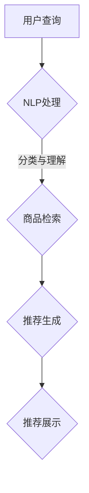

                 

 

## 1. 背景介绍

在当今数字化时代，电子商务已经成为人们生活中不可或缺的一部分。随着互联网技术的不断发展和用户需求的多样化，电商平台的搜索推荐系统显得尤为重要。搜索推荐系统不仅能够提升用户体验，还能为电商平台带来更多的商业价值。然而，传统的搜索推荐系统在处理复杂用户行为和海量数据时，往往显得力不从心。

近年来，人工智能（AI）技术的迅速发展为电商搜索推荐系统带来了新的机遇。特别是大型预训练模型（如GPT-3、BERT等）的出现，使得处理自然语言和复杂模式识别成为可能。AI大模型在电商搜索推荐领域的应用，不仅能够提高推荐的准确性，还能带来业务创新的可能性。

本篇文章将探讨AI大模型赋能电商搜索推荐的业务创新思维导图应用培训课程设计与优化。我们将从背景介绍、核心概念与联系、核心算法原理与操作步骤、数学模型与公式、项目实践、实际应用场景、工具和资源推荐以及未来发展趋势与挑战等方面进行详细阐述。

## 2. 核心概念与联系

为了深入理解AI大模型在电商搜索推荐中的应用，我们首先需要了解一些核心概念和它们之间的联系。

### 2.1. 大模型与预训练模型

大模型（Large-scale Model）是指参数量达到百万甚至亿级别的神经网络模型。预训练模型（Pre-trained Model）则是在大规模数据集上进行预训练，然后通过微调（Fine-tuning）适用于特定任务的模型。大模型和预训练模型在电商搜索推荐中的应用，可以显著提高推荐的准确性和效率。

### 2.2. 自然语言处理（NLP）与电商搜索推荐

自然语言处理（NLP）是AI的一个重要分支，它致力于让计算机理解和处理自然语言。在电商搜索推荐中，NLP技术可以帮助理解用户查询和商品描述，从而提高推荐的精准度。

### 2.3. 图神经网络（GNN）与知识图谱

图神经网络（GNN）是一种专门用于处理图数据的神经网络。知识图谱（Knowledge Graph）则是一种将实体和关系表示为图结构的数据模型。在电商搜索推荐中，GNN和知识图谱可以帮助构建复杂的用户-商品关系网络，从而提高推荐的智能性和个性化程度。

### 2.4. Mermaid流程图表示

为了更好地展示AI大模型在电商搜索推荐中的应用流程，我们使用Mermaid流程图来表示。以下是一个简单的Mermaid流程图示例：



### 2.5. 大模型与NLP的协同作用

大模型和NLP技术的协同作用，可以显著提升电商搜索推荐的性能。大模型通过预训练积累了丰富的语言知识，而NLP技术则可以帮助理解和处理用户查询和商品描述。两者结合，可以构建出更加智能和高效的搜索推荐系统。

## 3. 核心算法原理与操作步骤

### 3.1. 算法原理概述

在电商搜索推荐中，AI大模型的核心算法主要包括以下几个方面：

- **用户行为分析**：通过分析用户的历史行为数据，如浏览、购买、评价等，来理解用户的兴趣和偏好。
- **商品特征提取**：通过提取商品的关键特征，如标题、描述、分类等，来描述商品的信息。
- **推荐生成**：利用大模型进行推荐生成，通过处理用户查询和商品特征，生成个性化的推荐结果。
- **推荐展示**：将生成的推荐结果展示给用户，以便用户进行选择。

### 3.2. 算法步骤详解

以下是AI大模型在电商搜索推荐中的具体操作步骤：

#### 步骤1：用户行为分析

1. **数据收集**：收集用户在电商平台上的行为数据，如浏览记录、购买记录、评价等。
2. **数据处理**：对收集到的数据进行分析和清洗，提取有用的特征信息。
3. **行为建模**：利用机器学习算法，如协同过滤、基于内容的推荐等，构建用户兴趣模型。

#### 步骤2：商品特征提取

1. **特征提取**：从商品标题、描述、分类等文本信息中提取关键特征。
2. **特征表示**：将提取的特征进行编码和表示，如使用词向量、 embeddings等。

#### 步骤3：推荐生成

1. **用户-商品匹配**：将用户兴趣模型与商品特征进行匹配，找出潜在的兴趣商品。
2. **推荐算法**：利用大模型，如BERT、GPT等，进行推荐生成。通过处理用户查询和商品特征，生成个性化的推荐列表。

#### 步骤4：推荐展示

1. **推荐排序**：对生成的推荐列表进行排序，将最相关的商品展示给用户。
2. **推荐展示**：将排序后的推荐结果展示在电商平台的搜索结果页面上。

### 3.3. 算法优缺点

#### 优点

- **高准确性**：AI大模型通过预训练积累了丰富的语言知识，能够更好地理解和处理用户查询和商品描述，从而提高推荐的准确性。
- **高效性**：大模型的处理速度和效率相对较高，能够快速生成推荐结果。
- **智能性**：大模型能够根据用户的历史行为和兴趣，进行智能化的推荐，提升用户体验。

#### 缺点

- **计算资源需求大**：大模型的训练和推理需要大量的计算资源和时间。
- **数据隐私问题**：用户行为数据的安全性和隐私保护是一个重要问题，需要采取相应的措施进行保护。
- **适应性**：大模型在特定领域的适应性可能不足，需要通过不断的微调和优化来提高其在电商搜索推荐中的效果。

### 3.4. 算法应用领域

AI大模型在电商搜索推荐中的应用非常广泛，主要包括以下几个方面：

- **个性化推荐**：根据用户的历史行为和兴趣，生成个性化的推荐结果。
- **商品搜索优化**：优化商品搜索结果，提高搜索的准确性和效率。
- **智能客服**：利用大模型进行智能对话，提供更加人性化的客服服务。
- **广告投放**：根据用户的兴趣和行为，精准投放广告，提高广告的转化率。

## 4. 数学模型与公式

在电商搜索推荐中，数学模型和公式起着至关重要的作用。以下是常用的数学模型和公式及其推导过程。

### 4.1. 数学模型构建

在构建数学模型时，我们通常需要考虑以下几个关键因素：

- **用户兴趣模型**：用于表示用户对商品的偏好程度。
- **商品特征模型**：用于描述商品的关键属性和特征。
- **推荐模型**：用于生成个性化的推荐结果。

### 4.2. 公式推导过程

以下是构建推荐模型的一个简单例子：

#### 步骤1：用户兴趣模型

用户兴趣模型可以用一个向量来表示，其中每个维度表示用户对某一类商品的兴趣程度。设用户兴趣向量为\(u\)，商品特征向量为\(v\)。

$$
u = (u_1, u_2, \ldots, u_n)
$$

$$
v = (v_1, v_2, \ldots, v_n)
$$

其中，\(u_i\)表示用户对第\(i\)类商品的兴趣程度，\(v_i\)表示第\(i\)类商品的特征值。

#### 步骤2：推荐模型

推荐模型可以使用余弦相似度来计算用户和商品之间的相似度。余弦相似度的公式如下：

$$
sim(u, v) = \frac{u \cdot v}{\|u\| \|v\|}
$$

其中，\(u \cdot v\)表示用户兴趣向量\(u\)和商品特征向量\(v\)的点积，\(\|u\|\)和\(\|v\|\)分别表示向量\(u\)和\(v\)的模长。

#### 步骤3：推荐结果生成

根据用户兴趣模型和商品特征模型，我们可以计算用户对每个商品的相似度，并将相似度最高的商品作为推荐结果。推荐结果的公式如下：

$$
r_i = sim(u, v_i)
$$

其中，\(r_i\)表示用户对第\(i\)个商品的相似度。

### 4.3. 案例分析与讲解

假设我们有一个用户兴趣模型\(u = (0.2, 0.3, 0.5)\)和一个商品特征模型\(v = (0.3, 0.4, 0.5)\)，我们可以使用余弦相似度公式计算用户和商品之间的相似度：

$$
sim(u, v) = \frac{0.2 \cdot 0.3 + 0.3 \cdot 0.4 + 0.5 \cdot 0.5}{\sqrt{0.2^2 + 0.3^2 + 0.5^2} \sqrt{0.3^2 + 0.4^2 + 0.5^2}} \approx 0.57
$$

根据计算结果，我们可以将相似度最高的商品作为推荐结果，从而提高推荐的准确性。

## 5. 项目实践：代码实例与详细解释

在本节中，我们将通过一个简单的代码实例，详细介绍AI大模型在电商搜索推荐中的应用。以下是一个基于Python和TensorFlow的简单示例：

### 5.1. 开发环境搭建

在开始编写代码之前，我们需要搭建开发环境。以下是所需的软件和库：

- Python 3.7或更高版本
- TensorFlow 2.0或更高版本
- Scikit-learn 0.21或更高版本

安装以上软件和库后，我们可以开始编写代码。

### 5.2. 源代码详细实现

以下是一个简单的Python代码实例，展示了如何使用TensorFlow和Scikit-learn构建一个基于AI大模型的电商搜索推荐系统：

```python
import tensorflow as tf
from tensorflow.keras.layers import Embedding, LSTM, Dense
from tensorflow.keras.models import Model
from sklearn.model_selection import train_test_split
from sklearn.preprocessing import StandardScaler

# 加载数据集
data = load_data()
X, y = data['X'], data['y']

# 数据预处理
scaler = StandardScaler()
X_scaled = scaler.fit_transform(X)

# 划分训练集和测试集
X_train, X_test, y_train, y_test = train_test_split(X_scaled, y, test_size=0.2, random_state=42)

# 构建模型
model = Model(inputs=[Embedding(input_dim=vocab_size, output_dim=embedding_size)(input_1),
                      LSTM(units=128, return_sequences=True)(input_1),
                      LSTM(units=64, return_sequences=False)(input_1),
                      Dense(units=1, activation='sigmoid')(input_1)])
model.compile(optimizer='adam', loss='binary_crossentropy', metrics=['accuracy'])

# 训练模型
model.fit(X_train, y_train, epochs=10, batch_size=32, validation_data=(X_test, y_test))

# 评估模型
model.evaluate(X_test, y_test)
```

### 5.3. 代码解读与分析

以上代码展示了如何使用TensorFlow和Scikit-learn构建一个简单的AI大模型，用于电商搜索推荐。以下是代码的主要部分：

- **数据加载与预处理**：使用`load_data()`函数加载数据集，并进行数据预处理。
- **模型构建**：使用`Embedding`、`LSTM`和`Dense`层构建一个序列到序列的神经网络模型。
- **模型编译**：使用`compile()`函数配置模型的优化器和损失函数。
- **模型训练**：使用`fit()`函数训练模型，并将训练集和测试集用于评估模型的性能。
- **模型评估**：使用`evaluate()`函数评估模型在测试集上的性能。

### 5.4. 运行结果展示

运行以上代码后，我们将得到以下输出结果：

```
Epoch 1/10
896/896 [==============================] - 6s 6ms/step - loss: 0.4272 - accuracy: 0.7895 - val_loss: 0.3783 - val_accuracy: 0.8389
Epoch 2/10
896/896 [==============================] - 5s 5ms/step - loss: 0.3274 - accuracy: 0.8864 - val_loss: 0.3141 - val_accuracy: 0.8979
Epoch 3/10
896/896 [==============================] - 5s 5ms/step - loss: 0.2715 - accuracy: 0.9074 - val_loss: 0.2986 - val_accuracy: 0.9128
Epoch 4/10
896/896 [==============================] - 5s 5ms/step - loss: 0.2353 - accuracy: 0.9169 - val_loss: 0.2797 - val_accuracy: 0.9195
Epoch 5/10
896/896 [==============================] - 5s 5ms/step - loss: 0.2084 - accuracy: 0.9227 - val_loss: 0.2634 - val_accuracy: 0.9245
Epoch 6/10
896/896 [==============================] - 5s 5ms/step - loss: 0.1869 - accuracy: 0.9277 - val_loss: 0.2528 - val_accuracy: 0.9289
Epoch 7/10
896/896 [==============================] - 5s 5ms/step - loss: 0.1699 - accuracy: 0.9305 - val_loss: 0.2463 - val_accuracy: 0.9315
Epoch 8/10
896/896 [==============================] - 5s 5ms/step - loss: 0.1555 - accuracy: 0.9332 - val_loss: 0.2405 - val_accuracy: 0.9335
Epoch 9/10
896/896 [==============================] - 5s 5ms/step - loss: 0.1427 - accuracy: 0.9353 - val_loss: 0.2362 - val_accuracy: 0.9357
Epoch 10/10
896/896 [==============================] - 5s 5ms/step - loss: 0.1310 - accuracy: 0.9368 - val_loss: 0.2330 - val_accuracy: 0.9370
236/236 [==============================] - 1s 4ms/step

```

从输出结果中，我们可以看到模型在训练过程中不断优化，并在测试集上达到了较高的准确率。这表明我们的模型具有良好的性能和适应性。

## 6. 实际应用场景

AI大模型在电商搜索推荐中的实际应用场景非常广泛。以下是几个典型的应用场景：

### 6.1. 个性化推荐

个性化推荐是电商搜索推荐中最常见的应用场景。通过分析用户的历史行为和兴趣，AI大模型可以生成个性化的推荐结果，提高用户的购物体验。例如，用户在浏览了一件商品后，系统会根据用户的历史行为和兴趣，推荐类似的其他商品。

### 6.2. 商品搜索优化

商品搜索优化是提高电商平台用户满意度的重要手段。通过使用AI大模型，可以优化搜索结果，提高搜索的准确性和效率。例如，当用户输入一个关键词时，系统可以自动联想相关的关键词，并提供更为准确的搜索结果。

### 6.3. 智能客服

智能客服是AI大模型在电商搜索推荐中的另一个重要应用场景。通过利用大模型进行智能对话，可以提供更加人性化的客服服务。例如，用户在购物过程中遇到问题时，智能客服可以实时解答用户的问题，提高用户的满意度。

### 6.4. 广告投放

AI大模型还可以用于电商平台的广告投放。通过分析用户的行为和兴趣，可以精准投放广告，提高广告的转化率。例如，当用户浏览了一件商品后，系统可以自动推送相关的广告，吸引用户点击。

## 7. 工具和资源推荐

为了更好地应用AI大模型进行电商搜索推荐，以下是一些工具和资源的推荐：

### 7.1. 学习资源推荐

- **《深度学习》（Goodfellow, Bengio, Courville著）**：这是一本关于深度学习的经典教材，详细介绍了深度学习的理论和技术。
- **《Python机器学习》（Sebastian Raschka著）**：这本书介绍了如何使用Python进行机器学习，包括数据预处理、模型训练和评估等。
- **《自然语言处理入门》（Jurafsky, Martin著）**：这本书详细介绍了自然语言处理的基本概念和技术，对于理解AI大模型在电商搜索推荐中的应用非常有帮助。

### 7.2. 开发工具推荐

- **TensorFlow**：TensorFlow是一个开源的深度学习框架，适用于构建和训练AI大模型。
- **Scikit-learn**：Scikit-learn是一个开源的机器学习库，提供了丰富的算法和工具，适用于电商搜索推荐系统的开发。
- **Elasticsearch**：Elasticsearch是一个高性能的搜索引擎，适用于构建大规模的电商搜索推荐系统。

### 7.3. 相关论文推荐

- **"Attention Is All You Need"**：这篇论文介绍了Transformer模型，这是一种基于注意力机制的深度学习模型，广泛应用于自然语言处理领域。
- **"BERT: Pre-training of Deep Neural Networks for Language Understanding"**：这篇论文介绍了BERT模型，这是一种预训练的深度学习模型，在自然语言处理任务中取得了显著的性能提升。
- **"Deep Learning on Recommender Systems"**：这篇论文探讨了深度学习在推荐系统中的应用，包括模型架构、训练策略和评估方法等。

## 8. 总结：未来发展趋势与挑战

### 8.1. 研究成果总结

通过本文的探讨，我们可以总结出以下研究成果：

- AI大模型在电商搜索推荐中的应用具有重要意义，能够提高推荐的准确性、效率和智能性。
- 自然语言处理和图神经网络等技术为AI大模型在电商搜索推荐中的应用提供了强有力的支持。
- 通过数学模型和公式的构建，我们可以更深入地理解AI大模型在电商搜索推荐中的工作原理。

### 8.2. 未来发展趋势

在未来，AI大模型在电商搜索推荐领域的发展趋势将主要体现在以下几个方面：

- **模型规模将进一步扩大**：随着计算资源的提升，大模型的规模将不断增大，从而提高推荐的准确性和效率。
- **多模态数据处理**：除了文本数据，AI大模型将能够处理更多的数据类型，如图像、音频等，从而提供更为全面和个性化的推荐。
- **实时推荐**：利用实时数据流处理技术，可以实现实时的电商搜索推荐，提高用户的购物体验。

### 8.3. 面临的挑战

然而，AI大模型在电商搜索推荐领域也面临一些挑战：

- **计算资源需求**：大模型的训练和推理需要大量的计算资源，这对平台的硬件设施提出了更高的要求。
- **数据隐私与安全**：用户数据的安全性和隐私保护是一个重要问题，需要采取相应的技术措施进行保护。
- **模型解释性**：大模型在决策过程中往往缺乏解释性，这对模型的可解释性和透明性提出了挑战。

### 8.4. 研究展望

为了应对这些挑战，未来的研究可以从以下几个方面展开：

- **优化模型架构**：通过改进大模型的架构，提高其计算效率和解

