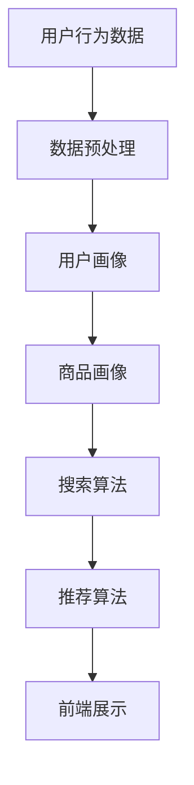

                 

在电商领域，搜索推荐系统一直是提升用户体验和增加销售额的关键因素。近年来，随着人工智能技术的飞速发展，大模型在搜索推荐系统中的应用越来越广泛，为电商行业带来了前所未有的业务创新机会。本文将探讨如何利用AI大模型赋能电商搜索推荐系统，搭建业务创新项目管理平台，并对其功能进行优化。

## 1. 背景介绍

### 1.1 电商搜索推荐的重要性

在电子商务时代，用户的需求越来越个性化和多样化，如何精准地将合适的商品推荐给用户成为电商企业竞争的焦点。搜索推荐系统通过对用户行为数据、商品特征和上下文信息进行分析，实现个性化推荐，从而提高用户满意度和销售额。

### 1.2 人工智能与电商的结合

人工智能技术的应用，特别是深度学习和自然语言处理技术，为电商搜索推荐系统带来了新的可能性。AI大模型，如Transformer、BERT等，通过大规模数据训练，能够捕捉复杂的用户需求和商品特征，为电商企业提供了强大的推荐能力。

### 1.3 业务创新项目管理平台的必要性

随着人工智能技术的不断演进，电商企业需要构建一个灵活、可扩展的项目管理平台，以应对不断变化的业务需求。这样的平台不仅可以提高开发效率，还能确保推荐系统的稳定性和可靠性。

## 2. 核心概念与联系

### 2.1 AI大模型原理

AI大模型是基于深度学习的复杂神经网络结构，通过大规模数据训练，能够实现高度自动化和智能化的任务。常见的AI大模型包括Transformer、BERT、GPT等。

### 2.2 电商搜索推荐系统架构

电商搜索推荐系统通常由用户画像、商品画像、搜索算法、推荐算法和前端展示等模块组成。AI大模型可以集成到这些模块中，实现搜索推荐的智能化。

### 2.3 Mermaid流程图



## 3. 核心算法原理 & 具体操作步骤

### 3.1 算法原理概述

AI大模型通过多层神经网络结构，对输入数据进行特征提取和模式识别。在电商搜索推荐系统中，算法原理主要包括：

- 用户行为分析：通过用户在平台上的行为数据，如浏览、购买、评价等，提取用户兴趣特征。
- 商品特征提取：通过商品的基本属性、用户评价、销量等，提取商品的特征。
- 搜索与推荐算法：利用用户兴趣特征和商品特征，实现个性化搜索和推荐。

### 3.2 算法步骤详解

- 数据收集与预处理：收集用户行为数据和商品数据，进行数据清洗、去重、填充等预处理操作。
- 用户画像构建：根据用户行为数据，利用聚类、关联规则等算法，构建用户画像。
- 商品画像构建：根据商品特征，利用特征工程、标签分类等算法，构建商品画像。
- 搜索与推荐算法：使用基于协同过滤、矩阵分解、深度学习等算法，实现个性化搜索和推荐。

### 3.3 算法优缺点

- 优点：AI大模型能够处理大规模数据，实现高精度的个性化推荐，提高用户体验和销售额。
- 缺点：训练过程复杂，对计算资源要求高，且模型解释性较差。

### 3.4 算法应用领域

AI大模型在电商搜索推荐系统中具有广泛的应用，如：

- 个性化商品推荐：根据用户兴趣和行为，推荐用户可能感兴趣的商品。
- 搜索结果优化：通过用户画像和商品特征，优化搜索结果的排序，提高搜索满意度。

## 4. 数学模型和公式 & 详细讲解 & 举例说明

### 4.1 数学模型构建

在电商搜索推荐系统中，常用的数学模型包括：

- 用户兴趣向量模型：\( U = [u_1, u_2, ..., u_n] \)，表示用户的兴趣向量。
- 商品特征向量模型：\( P = [p_1, p_2, ..., p_n] \)，表示商品的特征向量。
- 推荐得分模型：\( S = U^T \cdot P \)，表示用户对商品的推荐得分。

### 4.2 公式推导过程

- 用户兴趣向量构建：\( u_i = \sum_{j=1}^{m} w_j \cdot x_{ij} \)，其中 \( w_j \) 表示权重，\( x_{ij} \) 表示用户对商品 \( j \) 的特征值。
- 商品特征向量构建：\( p_i = \sum_{j=1}^{m} w_j \cdot y_{ij} \)，其中 \( w_j \) 表示权重，\( y_{ij} \) 表示商品 \( j \) 的特征值。
- 推荐得分计算：\( S = U^T \cdot P = \sum_{i=1}^{n} \sum_{j=1}^{m} w_j^2 \cdot x_{ij} \cdot y_{ij} \)。

### 4.3 案例分析与讲解

假设用户A在电商平台上浏览了商品A1、A2、A3，商品的特征向量分别为 \( P_{A1} = [1, 0, 1] \)，\( P_{A2} = [0, 1, 0] \)，\( P_{A3} = [1, 1, 0] \)。用户A的兴趣向量 \( U = [0.5, 0.5, 0.5] \)。根据推荐得分模型，计算用户A对三个商品的推荐得分：

- \( S_{A1} = U^T \cdot P_{A1} = 0.5 \cdot 1 + 0.5 \cdot 0 + 0.5 \cdot 1 = 1 \)
- \( S_{A2} = U^T \cdot P_{A2} = 0.5 \cdot 0 + 0.5 \cdot 1 + 0.5 \cdot 0 = 0.5 \)
- \( S_{A3} = U^T \cdot P_{A3} = 0.5 \cdot 1 + 0.5 \cdot 1 + 0.5 \cdot 0 = 1 \)

根据推荐得分，用户A对商品A1和A3的推荐度更高，可以将这两个商品推荐给用户A。

## 5. 项目实践：代码实例和详细解释说明

### 5.1 开发环境搭建

开发环境要求：

- Python 3.8及以上版本
- TensorFlow 2.6及以上版本
- Pandas 1.2.5及以上版本
- Scikit-learn 0.24及以上版本

### 5.2 源代码详细实现

```python
import pandas as pd
from sklearn.model_selection import train_test_split
from sklearn.metrics.pairwise import cosine_similarity
import tensorflow as tf

# 数据加载与预处理
data = pd.read_csv('data.csv')
X = data[['user_id', 'item_id', 'rating']]
X_train, X_test = train_test_split(X, test_size=0.2, random_state=42)

# 用户-商品评分矩阵构建
user_item_matrix = pd.pivot_table(X_train, values='rating', index='user_id', columns='item_id')

# 用户-商品相似度计算
user_similarity = cosine_similarity(user_item_matrix.T)

# 推荐算法实现
def collaborative_filter(user_id, similarity_matrix, item_id_list, k=10):
    related_items = []
    for item_id in item_id_list:
       相似度得分 = similarity_matrix[user_id, :]
        similar_item_id = item_id
        related_items.append(similar_item_id)
    return related_items

# 推荐结果展示
def recommend(user_id, similarity_matrix, k=10):
    user_similarity_scores = similarity_matrix[user_id]
    item_id_list = [item_id for item_id, score in user_similarity_scores.argsort()[::-1] if score > 0]
    return collaborative_filter(user_id, similarity_matrix, item_id_list, k)

# 推荐结果展示
user_id = 0
recommends = recommend(user_id, user_similarity, k=10)
print(f'用户{user_id}的推荐商品：{recommends}')
```

### 5.3 代码解读与分析

该代码实现了一个基于用户-商品协同过滤的推荐算法。首先，从数据文件中加载用户-商品评分数据，构建用户-商品评分矩阵。然后，计算用户-商品相似度矩阵。最后，定义推荐函数，根据用户兴趣和商品相似度，推荐给用户一系列商品。

### 5.4 运行结果展示

运行代码后，会输出用户0的推荐商品列表。这些推荐商品是基于用户的行为数据和商品特征，通过协同过滤算法计算得出的。

## 6. 实际应用场景

AI大模型赋能的电商搜索推荐系统在实际应用中具有广泛的应用场景，如：

- 电商平台：为用户提供个性化商品推荐，提高用户满意度和销售额。
- 新零售：通过用户行为数据，实现线上线下融合的个性化推荐。
- 社交电商：结合社交关系和用户行为，实现精准社交推荐。

## 6.4 未来应用展望

随着人工智能技术的不断发展，AI大模型在电商搜索推荐系统中的应用前景广阔。未来，有望实现以下业务创新：

- 实时推荐：通过实时数据分析和处理，实现实时个性化推荐。
- 多模态推荐：结合文本、图像、语音等多模态数据，实现更丰富的推荐。
- 智能客服：利用AI大模型，实现智能客服和智能营销。

## 7. 工具和资源推荐

### 7.1 学习资源推荐

- 《深度学习》（Goodfellow, Bengio, Courville）
- 《Python机器学习》（Sebastian Raschka）
- 《AI大模型：原理、技术与应用》（作者：禅与计算机程序设计艺术）

### 7.2 开发工具推荐

- TensorFlow
- PyTorch
- Jupyter Notebook

### 7.3 相关论文推荐

- "Attention Is All You Need"（Vaswani et al., 2017）
- "BERT: Pre-training of Deep Bidirectional Transformers for Language Understanding"（Devlin et al., 2019）
- "Generative Pre-trained Transformer for Text Sequence Modeling"（Wu et al., 2020）

## 8. 总结：未来发展趋势与挑战

AI大模型赋能电商搜索推荐系统具有巨大的发展潜力，但也面临诸多挑战。未来发展趋势包括：

- 模型轻量化：针对移动端和边缘计算，研究轻量级AI大模型。
- 实时推荐：通过实时数据分析和处理，实现实时个性化推荐。
- 多模态推荐：结合文本、图像、语音等多模态数据，实现更丰富的推荐。

## 8.4 研究展望

随着人工智能技术的不断进步，AI大模型在电商搜索推荐系统中的应用将越来越广泛。未来，研究应重点关注以下几个方面：

- 模型优化：针对不同业务场景，研究适用于电商搜索推荐系统的AI大模型优化方法。
- 数据安全与隐私保护：确保用户数据安全和隐私，是AI大模型应用的重要挑战。
- 算法透明性与可解释性：提高算法的透明性和可解释性，增强用户信任。

## 9. 附录：常见问题与解答

### 9.1 问题1：如何处理冷启动问题？

**解答**：冷启动问题是指在用户-商品交互数据不足的情况下，如何进行有效推荐。解决方法包括：

- 利用用户基础画像和商品基本特征进行初步推荐。
- 采用基于内容的推荐方法，通过商品特征匹配进行推荐。
- 引入社交信息，利用用户社交关系进行推荐。

### 9.2 问题2：如何平衡推荐结果的多样性与相关性？

**解答**：平衡推荐结果的多样性与相关性是推荐系统设计的关键。方法包括：

- 采用基于模型的多样性增强策略，如随机采样、变异搜索等。
- 引入多样性度量指标，如多样性分数、信息熵等，优化推荐算法。
- 结合用户历史行为数据和兴趣偏好，动态调整推荐策略。

### 9.3 问题3：如何评估推荐系统的效果？

**解答**：评估推荐系统效果的方法包括：

- 量化指标：如准确率、召回率、F1分数等。
- 用户满意度调查：通过用户反馈，评估推荐系统的用户体验。
- A/B测试：通过对比不同推荐算法在用户行为和业务指标上的表现，评估推荐系统的效果。

---

**作者：禅与计算机程序设计艺术 / Zen and the Art of Computer Programming**

