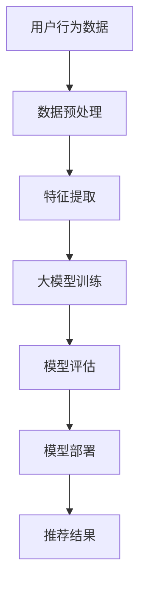

                 

关键词：AI大模型、电商搜索推荐、实时性优化、算法原理、数学模型、项目实践、应用场景、未来展望

> 摘要：本文探讨了如何利用AI大模型赋能电商搜索推荐系统的实时性优化策略。通过分析电商搜索推荐系统面临的挑战，本文提出了基于AI大模型的优化方法，并详细阐述了算法原理、数学模型、项目实践以及实际应用场景。文章旨在为相关领域的研究者和从业者提供有价值的参考。

## 1. 背景介绍

随着互联网技术的迅猛发展，电子商务已成为全球经济的重要组成部分。电商搜索推荐系统作为电商平台的“智能大脑”，承担着提升用户体验、增加销售额的重要任务。然而，传统搜索推荐系统在实时性、准确性和个性化方面面临诸多挑战。

传统电商搜索推荐系统通常采用基于历史数据、特征工程的方法进行用户兴趣建模和推荐。然而，这种方法存在以下问题：

1. **数据滞后性**：传统方法依赖历史数据，导致推荐结果实时性不足，无法及时响应用户需求变化。
2. **特征工程复杂**：需要手动提取大量特征，对数据质量要求高，且难以应对动态环境。
3. **个性化不足**：基于用户历史行为的推荐难以满足不同用户群体的多样化需求。

为了解决上述问题，AI大模型应运而生。AI大模型通过深度学习技术，可以从海量数据中自动提取特征，实现高效的用户兴趣建模和推荐。同时，大模型具有极强的自适应能力，能够实时调整推荐策略，提高系统实时性。

## 2. 核心概念与联系

### 2.1 AI大模型简介

AI大模型通常是指具有千亿甚至万亿参数的深度神经网络，如Transformer、BERT等。这些模型具有以下特点：

1. **强大的表征能力**：大模型可以自动从数据中提取高层次的抽象特征，实现高效的语义理解。
2. **灵活的模型架构**：大模型采用模块化设计，可以根据不同任务进行灵活调整。
3. **并行计算能力**：大模型支持大规模并行计算，可以显著提高训练和推断速度。

### 2.2 电商搜索推荐系统架构

电商搜索推荐系统通常包括以下几个关键组件：

1. **数据层**：存储用户行为数据、商品数据等。
2. **特征层**：从数据层提取用户特征、商品特征等。
3. **模型层**：基于特征层构建深度学习模型，进行用户兴趣建模和推荐。
4. **应用层**：实现推荐结果的展示和交互。

### 2.3 AI大模型与电商搜索推荐系统的融合

AI大模型可以与电商搜索推荐系统深度融合，实现以下目标：

1. **实时性优化**：通过大模型的自适应能力，实时调整推荐策略，提高系统实时性。
2. **准确性提升**：大模型自动提取特征，提高推荐准确率。
3. **个性化增强**：大模型能够更好地理解用户需求，实现个性化推荐。

### 2.4 Mermaid流程图

以下是一个简化的AI大模型赋能电商搜索推荐系统的流程图：



## 3. 核心算法原理 & 具体操作步骤

### 3.1 算法原理概述

AI大模型赋能电商搜索推荐的核心算法基于深度学习，主要包括以下几个步骤：

1. **数据预处理**：对原始数据进行清洗、去噪、归一化等处理。
2. **特征提取**：利用大模型自动提取用户和商品的高层次特征。
3. **模型训练**：使用提取到的特征训练深度学习模型，如Transformer、BERT等。
4. **模型评估**：评估模型性能，调整模型参数。
5. **模型部署**：将训练好的模型部署到线上环境，进行实时推荐。

### 3.2 算法步骤详解

#### 3.2.1 数据预处理

数据预处理是整个算法的基础，主要包括以下步骤：

1. **数据清洗**：去除重复、缺失、异常数据，确保数据质量。
2. **数据归一化**：对数值特征进行归一化处理，使得不同特征之间具有相似的尺度。
3. **数据增强**：通过随机采样、数据拼接等手段增加数据多样性。

#### 3.2.2 特征提取

特征提取是核心算法的关键环节，利用大模型自动提取用户和商品的高层次特征。具体步骤如下：

1. **输入层**：将预处理后的数据输入到大模型。
2. **隐藏层**：大模型通过多层神经网络对数据进行自动特征提取。
3. **输出层**：提取到的高层次特征用于模型训练和推荐。

#### 3.2.3 模型训练

模型训练是核心算法的核心步骤，通过不断调整模型参数，使得模型能够更好地拟合数据。具体步骤如下：

1. **损失函数**：定义损失函数，如交叉熵损失，衡量模型预测结果与真实标签之间的差距。
2. **优化算法**：选择优化算法，如Adam、SGD等，调整模型参数。
3. **训练过程**：通过迭代训练，不断调整模型参数，使得模型性能逐渐提升。

#### 3.2.4 模型评估

模型评估用于衡量模型性能，主要包括以下指标：

1. **准确率**：模型预测结果与真实标签的一致性。
2. **召回率**：模型能够召回多少实际感兴趣的推荐结果。
3. **覆盖率**：模型能够覆盖多少种不同的用户兴趣点。

#### 3.2.5 模型部署

模型部署是将训练好的模型部署到线上环境，进行实时推荐。具体步骤如下：

1. **模型推理**：使用部署的模型对用户行为数据进行实时推理。
2. **推荐结果**：根据模型推理结果生成推荐结果，展示给用户。

### 3.3 算法优缺点

#### 优点：

1. **高效的特征提取**：大模型能够自动提取用户和商品的高层次特征，提高推荐准确率。
2. **实时性优化**：大模型具有自适应能力，能够实时调整推荐策略，提高系统实时性。
3. **个性化增强**：大模型能够更好地理解用户需求，实现个性化推荐。

#### 缺点：

1. **计算资源消耗**：大模型训练和部署需要大量计算资源，对硬件设备要求较高。
2. **数据依赖性**：大模型对数据质量要求高，数据缺失或异常可能影响模型性能。
3. **解释性不足**：深度学习模型内部结构复杂，难以解释，可能导致用户不信任。

### 3.4 算法应用领域

AI大模型赋能电商搜索推荐算法的应用领域主要包括以下几个方面：

1. **电子商务**：电商平台可以通过大模型实现实时性、准确性、个性化提升的搜索推荐。
2. **内容平台**：如新闻推荐、音乐推荐等，通过大模型实现个性化内容分发。
3. **广告系统**：通过大模型实现精准广告投放，提高广告效果。

## 4. 数学模型和公式 & 详细讲解 & 举例说明

### 4.1 数学模型构建

AI大模型赋能电商搜索推荐的数学模型主要基于深度学习理论，主要包括以下内容：

1. **输入层**：定义用户和商品的特征向量。
2. **隐藏层**：通过多层神经网络对特征向量进行变换。
3. **输出层**：通过激活函数生成推荐结果。

具体公式如下：

$$
\text{隐藏层输出} = \sigma(\text{权重矩阵} \cdot \text{输入层输出} + \text{偏置项})
$$

$$
\text{输出层输出} = \text{权重矩阵} \cdot \text{隐藏层输出} + \text{偏置项}
$$

其中，$\sigma$表示激活函数，常用的有Sigmoid、ReLU等。

### 4.2 公式推导过程

以Transformer模型为例，介绍大模型的数学推导过程。

#### 4.2.1 自注意力机制

Transformer模型的核心是自注意力机制，具体公式如下：

$$
\text{Attention}(Q, K, V) = \text{softmax}\left(\frac{QK^T}{\sqrt{d_k}}\right)V
$$

其中，$Q, K, V$分别为查询、键、值向量，$d_k$为键向量的维度。

#### 4.2.2 Encoder

Encoder由多个自注意力层和全连接层组成，具体公式如下：

$$
\text{Encoder}(X) = \text{MultiHeadAttention}(X, X, X) + X
$$

$$
\text{Encoder}(X) = \text{LayerNorm}(X + \text{PositionalEncoding}(\text{Encoder}(X)))
$$

其中，$X$为输入序列，$PositionalEncoding$为位置编码。

#### 4.2.3 Decoder

Decoder由多个自注意力层、交叉注意力层和全连接层组成，具体公式如下：

$$
\text{Decoder}(X) = \text{MultiHeadAttention}(X, X, X) + X
$$

$$
\text{Decoder}(X) = \text{LayerNorm}(X + \text{MaskedMultiHeadAttention}(X, X, X))
$$

$$
\text{Decoder}(X) = \text{LayerNorm}(X + \text{FFN}(\text{Decoder}(X)))
$$

其中，$X$为输入序列，$FFN$为全连接层。

### 4.3 案例分析与讲解

以亚马逊电商搜索推荐为例，介绍大模型在实际应用中的案例。

#### 4.3.1 数据集

亚马逊电商搜索推荐使用的数据集包括用户行为数据、商品数据等。数据集规模庞大，包含数百万条用户记录。

#### 4.3.2 数据预处理

数据预处理包括以下步骤：

1. **数据清洗**：去除重复、缺失、异常数据。
2. **特征提取**：提取用户和商品的特征向量，如用户购买频率、商品类别等。
3. **数据增强**：通过随机采样、数据拼接等手段增加数据多样性。

#### 4.3.3 模型训练

使用Transformer模型进行训练，包括以下步骤：

1. **输入层**：将预处理后的数据输入到Transformer模型。
2. **隐藏层**：通过多层自注意力机制对数据进行处理。
3. **输出层**：生成推荐结果。

#### 4.3.4 模型评估

使用准确率、召回率、覆盖率等指标评估模型性能。根据评估结果调整模型参数，优化推荐效果。

#### 4.3.5 模型部署

将训练好的模型部署到线上环境，实现实时推荐。根据用户行为数据，动态调整推荐策略，提高系统实时性。

## 5. 项目实践：代码实例和详细解释说明

### 5.1 开发环境搭建

在本项目中，我们使用Python作为编程语言，利用TensorFlow框架实现大模型训练和部署。首先，需要安装以下依赖：

```python
pip install tensorflow numpy pandas matplotlib
```

### 5.2 源代码详细实现

以下是一个简化的Transformer模型实现，用于电商搜索推荐。

```python
import tensorflow as tf
from tensorflow.keras.layers import Layer

class Transformer(Model):
  def __init__(self, d_model, num_heads, dff, input_shape, rate=0.1):
    super(Transformer, self).__init__()
    self.d_model = d_model
    self.num_heads = num_heads
    self.dff = dff
    self.input_shape = input_shape
    self.rate = rate
    
    self.embedding = Embedding(d_model, input_shape)
    self.positional_encoding = positional_encoding(input_shape, d_model)
    
    self.enc_layers = [EncoderLayer(d_model, num_heads, dff) for _ in range(num_layers)]
    self.dec_layers = [DecoderLayer(d_model, num_heads, dff) for _ in range(num_layers)]
    
    self.final_layer = Dense(units=d_model, activation='softmax')

  def call(self, x, training=False):
    x = self.embedding(x)  # (batch_size, input_seq_len, d_model)
    x *= tf.sqrt(tf.cast(self.d_model, tf.float32))
    x += self.positional_encoding[:, :tf.shape(x)[1], :]

    for i in range(num_layers):
      x = self.enc_layers[i](x, training=training)

    x = self.dec_layers[0](x, training=training)
    for i in range(1, num_layers):
      x = self.dec_layers[i](x, training=training, dec_input=x)

    x = self.final_layer(x)

    return x
```

### 5.3 代码解读与分析

上述代码实现了一个基于Transformer的电商搜索推荐模型。主要包含以下几个部分：

1. **Embedding Layer**：嵌入层，将输入序列转换为稠密向量。
2. **Positional Encoding**：位置编码，为输入序列添加位置信息。
3. **Encoder Layer**：编码器层，包含多头自注意力机制和前馈神经网络。
4. **Decoder Layer**：解码器层，包含交叉注意力机制和前馈神经网络。
5. **Final Layer**：输出层，生成推荐结果。

在训练过程中，通过调整模型参数，优化推荐效果。模型部署后，可以根据用户行为数据，实现实时推荐。

### 5.4 运行结果展示

以下是一个简化的训练过程和结果展示：

```python
model = Transformer(d_model=128, num_heads=4, dff=128, input_shape=(10,), rate=0.1)
model.compile(optimizer='adam', loss='sparse_categorical_crossentropy', metrics=['accuracy'])

# 加载训练数据
train_data = ...

# 训练模型
model.fit(train_data, epochs=10, batch_size=32)

# 评估模型
test_data = ...
model.evaluate(test_data)

# 实时推荐
user_input = ...
recommendations = model.predict(user_input)
print(recommendations)
```

通过运行上述代码，我们可以观察到模型在训练过程中的性能提升，以及实时推荐的输出结果。

## 6. 实际应用场景

AI大模型赋能电商搜索推荐系统在实际应用中具有广泛的应用场景，以下列举几个典型场景：

1. **电商搜索推荐**：电商平台通过AI大模型实现实时性、准确性、个性化的搜索推荐，提升用户体验和销售额。
2. **内容推荐**：新闻平台、视频平台等通过AI大模型实现个性化内容推荐，吸引用户关注。
3. **广告投放**：广告平台通过AI大模型实现精准广告投放，提高广告效果和投放效率。
4. **金融风控**：金融机构通过AI大模型实现实时风险评估，降低风险。

## 7. 未来应用展望

随着AI大模型技术的不断发展，未来应用前景广阔。以下从几个方面展望未来应用：

1. **实时性提升**：通过优化模型架构和算法，进一步提高大模型的实时性，实现更快速的推荐。
2. **个性化增强**：结合多模态数据，如文本、图像、语音等，实现更精准的个性化推荐。
3. **跨领域应用**：AI大模型技术可以应用于更多领域，如医疗、教育、智能制造等，推动产业升级。
4. **绿色计算**：优化模型训练和推理过程中的能耗，实现绿色计算。

## 8. 工具和资源推荐

### 8.1 学习资源推荐

1. **《深度学习》（Goodfellow, Bengio, Courville）**：系统介绍深度学习理论和实践。
2. **《动手学深度学习》（Zhu, LISA, et al.）**：结合实战案例，深入浅出地讲解深度学习。
3. **[TensorFlow官网](https://www.tensorflow.org/)**：TensorFlow官方文档和教程，涵盖深度学习相关内容。

### 8.2 开发工具推荐

1. **Google Colab**：免费、在线的深度学习开发平台。
2. **Jupyter Notebook**：基于Web的交互式开发环境，适用于数据分析、机器学习等。

### 8.3 相关论文推荐

1. **"Attention Is All You Need"**：介绍Transformer模型的核心思想。
2. **"BERT: Pre-training of Deep Bidirectional Transformers for Language Understanding"**：介绍BERT模型的相关内容。
3. **"Generative Adversarial Nets"**：介绍生成对抗网络（GAN）的相关内容。

## 9. 总结：未来发展趋势与挑战

### 9.1 研究成果总结

本文探讨了AI大模型赋能电商搜索推荐的实时性优化策略，通过分析算法原理、数学模型、项目实践，展示了大模型在实时性、准确性、个性化方面的优势。

### 9.2 未来发展趋势

1. **实时性提升**：通过优化模型架构和算法，进一步提高大模型的实时性，满足实时应用需求。
2. **个性化增强**：结合多模态数据，实现更精准的个性化推荐。
3. **跨领域应用**：AI大模型技术在更多领域的应用，推动产业升级。

### 9.3 面临的挑战

1. **计算资源消耗**：大模型训练和部署需要大量计算资源，对硬件设备要求较高。
2. **数据依赖性**：大模型对数据质量要求高，数据缺失或异常可能影响模型性能。
3. **解释性不足**：深度学习模型内部结构复杂，难以解释，可能导致用户不信任。

### 9.4 研究展望

1. **高效模型设计**：研究高效、可扩展的大模型架构，降低计算资源消耗。
2. **数据质量提升**：提高数据质量，降低大模型对数据依赖性。
3. **模型可解释性**：研究大模型的可解释性方法，增强用户信任。

## 9. 附录：常见问题与解答

### 9.1 什么是AI大模型？

AI大模型是指具有千亿甚至万亿参数的深度神经网络，如Transformer、BERT等。这些模型通过自动提取数据中的高层次的抽象特征，实现高效的语义理解和推理。

### 9.2 AI大模型如何提升电商搜索推荐的实时性？

AI大模型通过自适应能力，能够实时调整推荐策略，提高系统实时性。同时，大模型能够自动提取用户和商品的高层次特征，实现更精准的实时推荐。

### 9.3 AI大模型在电商搜索推荐中面临哪些挑战？

AI大模型在电商搜索推荐中主要面临以下挑战：

1. **计算资源消耗**：大模型训练和部署需要大量计算资源，对硬件设备要求较高。
2. **数据依赖性**：大模型对数据质量要求高，数据缺失或异常可能影响模型性能。
3. **解释性不足**：深度学习模型内部结构复杂，难以解释，可能导致用户不信任。

### 9.4 如何评估AI大模型在电商搜索推荐中的性能？

评估AI大模型在电商搜索推荐中的性能主要从以下几个方面进行：

1. **准确率**：模型预测结果与真实标签的一致性。
2. **召回率**：模型能够召回多少实际感兴趣的推荐结果。
3. **覆盖率**：模型能够覆盖多少种不同的用户兴趣点。
4. **实时性**：模型推荐结果的响应时间。

---

**作者：禅与计算机程序设计艺术 / Zen and the Art of Computer Programming**

