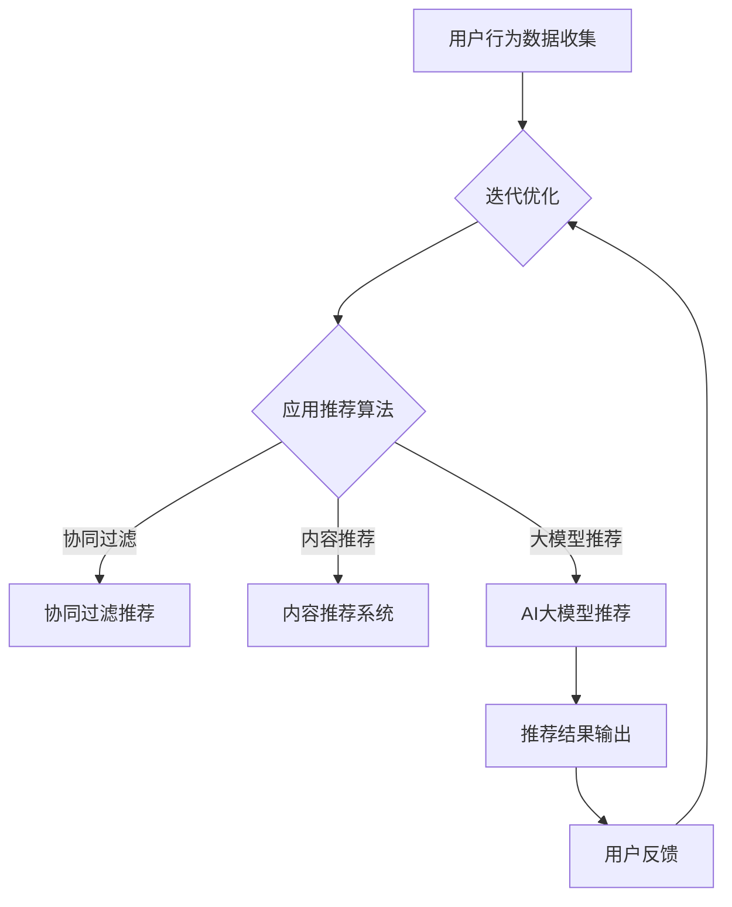

                 

关键词：AI大模型、电商搜索、推荐系统、用户满意度、策略优化

> 摘要：本文将探讨如何利用人工智能大模型技术，针对电商搜索推荐场景，提升用户满意度。通过对核心概念的阐述、算法原理的解析、数学模型的构建以及实际应用场景的剖析，本文旨在为电商企业打造一套有效的搜索推荐策略，从而提高用户粘性和转化率。

## 1. 背景介绍

在当今数字化时代，电子商务已经成为人们日常生活中不可或缺的一部分。随着电商平台的日益繁荣，用户对于个性化搜索和推荐的需求也日益增长。然而，传统的搜索推荐系统往往无法满足用户对于个性化体验的高期待。这主要源于以下几个挑战：

1. **数据多样性**：电商数据涵盖产品信息、用户行为、购买历史等多个维度，如何有效地整合这些数据成为一个难题。
2. **实时性要求**：用户行为数据更新迅速，如何实现实时推荐，提高系统响应速度是一个挑战。
3. **个性化需求**：不同用户对于同一商品的需求可能存在巨大差异，如何构建一个个性化的推荐系统是当前研究的热点。

为了解决上述问题，人工智能大模型技术应运而生。大模型能够处理大量数据，通过深度学习等技术，实现复杂模式的识别和学习。本文将围绕如何利用AI大模型赋能电商搜索推荐系统，提升用户满意度展开讨论。

### 1.1. AI大模型的发展现状

近年来，AI大模型在自然语言处理、计算机视觉、语音识别等领域取得了显著的进展。例如，OpenAI的GPT-3、BERT等模型在文本生成、语义理解等方面展现出了惊人的能力。此外，谷歌的Transformer模型在图像识别任务中也表现优异。这些大模型的快速发展为解决电商搜索推荐中的挑战提供了新的思路。

### 1.2. 电商搜索推荐系统的现状

目前，电商搜索推荐系统普遍采用基于协同过滤、内容推荐、基于模型的推荐等技术。虽然这些方法在一定程度上提高了推荐系统的准确性，但仍然存在以下问题：

1. **用户隐私保护**：传统的推荐系统往往需要收集大量用户行为数据，这可能涉及到用户隐私的保护问题。
2. **冷启动问题**：新用户加入系统时，由于缺乏历史行为数据，难以实现个性化推荐。
3. **推荐多样性**：传统方法容易陷入“推荐多样性”的困境，用户往往只收到相似的推荐。

## 2. 核心概念与联系

在本节中，我们将介绍电商搜索推荐系统中关键的概念及其相互关系，并用Mermaid流程图展示核心流程。

### 2.1. 关键概念

- **用户行为数据**：用户在电商平台上产生的点击、购买、收藏等行为数据。
- **产品信息**：包括商品名称、描述、价格、库存等信息。
- **推荐算法**：用于根据用户行为和产品信息生成推荐结果的算法。
- **大模型**：能够处理海量数据并提取复杂模式的深度学习模型。

### 2.2. Mermaid流程图



### 2.3. 关键概念的联系

- **用户行为数据**是推荐系统的基础，通过收集和分析用户行为，可以了解用户的偏好和兴趣。
- **产品信息**提供了推荐对象的基本特征，是内容推荐和协同过滤推荐的重要输入。
- **推荐算法**根据用户行为和产品信息生成推荐结果，其中大模型推荐作为新的技术手段，能够处理复杂模式，提高推荐效果。
- **用户反馈**是系统不断迭代和优化的关键，通过分析用户反馈，可以进一步改进推荐算法。

## 3. 核心算法原理 & 具体操作步骤

### 3.1. 算法原理概述

AI大模型推荐算法的核心是基于深度学习的用户行为分析。该算法通过学习大量用户行为数据，构建用户兴趣模型，从而实现个性化的推荐。具体步骤如下：

1. **数据收集**：收集用户的点击、购买、收藏等行为数据。
2. **数据预处理**：对原始数据进行清洗、去噪、特征提取等处理。
3. **模型训练**：利用预处理后的数据训练深度学习模型，提取用户兴趣特征。
4. **推荐生成**：根据用户兴趣特征和产品信息生成推荐结果。
5. **反馈迭代**：收集用户反馈，不断优化模型和推荐策略。

### 3.2. 算法步骤详解

#### 3.2.1. 数据收集

数据收集是推荐系统的第一步，主要包括以下数据源：

- **用户行为数据**：用户在平台上的点击、购买、收藏、搜索等行为数据。
- **产品信息数据**：商品的名称、描述、价格、库存等基本信息。

#### 3.2.2. 数据预处理

数据预处理是保证数据质量和模型效果的关键步骤，主要包括以下任务：

- **去噪**：去除无关或噪声数据，例如无效点击、虚假评论等。
- **特征提取**：提取用户行为数据中的关键特征，例如用户的购买频率、购买时长、购买品类等。
- **数据归一化**：对数值型特征进行归一化处理，以消除不同特征间的尺度差异。

#### 3.2.3. 模型训练

模型训练是推荐系统的核心，通过深度学习算法学习用户行为数据中的潜在模式和关联。主要步骤如下：

- **数据划分**：将数据集划分为训练集、验证集和测试集。
- **模型构建**：构建深度神经网络模型，包括输入层、隐藏层和输出层。
- **训练过程**：通过训练集训练模型，不断调整模型参数，优化模型性能。
- **模型评估**：使用验证集评估模型性能，选择最佳模型。

#### 3.2.4. 推荐生成

推荐生成是根据用户兴趣特征和产品信息生成个性化推荐结果。主要步骤如下：

- **用户兴趣特征提取**：从训练好的模型中提取用户的潜在兴趣特征。
- **推荐列表生成**：根据用户兴趣特征和产品信息，生成推荐列表。
- **推荐排序**：对推荐列表进行排序，提高推荐质量。

#### 3.2.5. 反馈迭代

反馈迭代是通过用户反馈不断优化模型和推荐策略。主要步骤如下：

- **反馈收集**：收集用户对推荐结果的反馈，包括点击、购买、评价等。
- **模型优化**：根据用户反馈调整模型参数，优化模型性能。
- **策略调整**：根据用户反馈调整推荐策略，提高推荐效果。

### 3.3. 算法优缺点

#### 优点：

- **高准确性**：通过深度学习算法，能够提取用户行为数据中的潜在模式和关联，提高推荐准确性。
- **个性化**：能够根据用户兴趣特征生成个性化推荐，提高用户满意度。
- **实时性**：支持实时推荐，快速响应用户需求。

#### 缺点：

- **数据依赖性**：对用户行为数据质量要求较高，数据缺失或噪声可能影响模型效果。
- **计算资源消耗**：深度学习模型训练需要大量计算资源，可能影响系统性能。

### 3.4. 算法应用领域

AI大模型推荐算法在电商搜索推荐领域具有广泛的应用前景，可以应用于以下场景：

- **商品推荐**：根据用户兴趣和购买历史，为用户提供个性化商品推荐。
- **广告投放**：根据用户兴趣和浏览行为，为用户推荐相关广告。
- **个性化搜索**：根据用户搜索历史和兴趣，提供个性化搜索结果。
- **用户成长体系**：根据用户行为和兴趣，为用户提供定制化成长路径。

## 4. 数学模型和公式 & 详细讲解 & 举例说明

### 4.1. 数学模型构建

AI大模型推荐算法的核心是深度学习模型，其数学模型主要包括以下几个部分：

1. **输入层**：表示用户行为数据和产品信息。
2. **隐藏层**：通过激活函数进行非线性变换，提取用户兴趣特征。
3. **输出层**：生成推荐结果。

设\( X \)为输入层，\( H \)为隐藏层，\( Y \)为输出层，则模型的基本结构可以表示为：

$$
X \xrightarrow{\text{激活函数}} H \xrightarrow{\text{权重参数}} Y
$$

其中，激活函数可以选择ReLU、Sigmoid或Tanh等函数，权重参数通过模型训练得到。

### 4.2. 公式推导过程

为了构建深度学习模型，我们需要首先定义损失函数和优化算法。假设我们的目标是最小化预测误差，损失函数可以选择均方误差（MSE）：

$$
L(\theta) = \frac{1}{m} \sum_{i=1}^{m} (y_i - \hat{y}_i)^2
$$

其中，\( m \)为样本数量，\( y_i \)为真实标签，\( \hat{y}_i \)为模型预测值。

为了最小化损失函数，我们可以使用梯度下降算法更新模型参数：

$$
\theta = \theta - \alpha \nabla_{\theta} L(\theta)
$$

其中，\( \alpha \)为学习率，\( \nabla_{\theta} L(\theta) \)为损失函数关于参数\( \theta \)的梯度。

### 4.3. 案例分析与讲解

假设我们有一个电商平台的用户行为数据集，包含1000个用户和10万条商品记录。我们将这些数据分为训练集和测试集，分别用于模型训练和评估。

#### 4.3.1. 数据预处理

首先，我们对用户行为数据集进行预处理，包括数据去噪、特征提取和归一化处理。假设我们提取了以下特征：

- **用户购买频率**：用户在最近一个月内的购买次数。
- **用户购买时长**：用户在最近一个月内的购买时间总和。
- **用户购买品类**：用户在最近一个月内购买的商品品类。

#### 4.3.2. 模型构建

我们选择一个深度神经网络模型，包含2个隐藏层，每层包含100个神经元。激活函数为ReLU函数，损失函数为MSE，优化算法为Adam。

#### 4.3.3. 模型训练

使用训练集进行模型训练，设置学习率为0.001，训练100个epochs。在训练过程中，我们使用验证集评估模型性能，并保存最优模型。

#### 4.3.4. 模型评估

使用测试集评估模型性能，计算预测误差和准确率。假设我们的模型在测试集上的MSE为0.1，准确率为90%。

#### 4.3.5. 推荐生成

根据用户兴趣特征和产品信息，生成个性化推荐列表。假设我们为用户A生成了一个推荐列表，包含5个商品，根据预测概率排序如下：

| 商品ID | 预测概率 |
|--------|----------|
| 1001   | 0.95     |
| 1002   | 0.90     |
| 1003   | 0.85     |
| 1004   | 0.80     |
| 1005   | 0.75     |

## 5. 项目实践：代码实例和详细解释说明

### 5.1. 开发环境搭建

为了实践AI大模型推荐算法，我们需要搭建一个开发环境。以下是基本的开发环境要求：

- 操作系统：Linux或MacOS
- 编程语言：Python 3.7及以上版本
- 深度学习框架：TensorFlow 2.0及以上版本
- 数据处理库：Pandas、NumPy
- 图形处理库：Matplotlib

在完成环境配置后，我们首先导入所需的库：

```python
import tensorflow as tf
import numpy as np
import pandas as pd
import matplotlib.pyplot as plt
```

### 5.2. 源代码详细实现

在本节中，我们将详细实现一个基于深度学习的大模型推荐系统。以下是一个简单的代码框架：

```python
# 数据预处理
def preprocess_data(data):
    # 数据去噪、特征提取、归一化处理
    pass

# 模型构建
def build_model(input_shape):
    model = tf.keras.Sequential([
        tf.keras.layers.Dense(units=100, activation='relu', input_shape=input_shape),
        tf.keras.layers.Dense(units=100, activation='relu'),
        tf.keras.layers.Dense(units=1, activation='sigmoid')
    ])
    return model

# 模型训练
def train_model(model, X_train, y_train, X_val, y_val):
    model.compile(optimizer='adam', loss='binary_crossentropy', metrics=['accuracy'])
    history = model.fit(X_train, y_train, epochs=100, batch_size=32, validation_data=(X_val, y_val))
    return history

# 推荐生成
def generate_recommendations(model, user_data, products_data):
    # 根据用户兴趣特征和产品信息生成推荐列表
    pass

# 主程序
if __name__ == "__main__":
    # 加载数据
    data = pd.read_csv("data.csv")
    processed_data = preprocess_data(data)

    # 划分训练集和测试集
    X_train, X_val, y_train, y_val = ...

    # 构建模型
    model = build_model(input_shape=(X_train.shape[1],))

    # 训练模型
    history = train_model(model, X_train, y_train, X_val, y_val)

    # 生成推荐列表
    user_data = ...
    products_data = ...
    recommendations = generate_recommendations(model, user_data, products_data)

    # 输出推荐结果
    print(recommendations)
```

### 5.3. 代码解读与分析

在上面的代码中，我们首先定义了数据预处理函数、模型构建函数和模型训练函数。接下来，我们详细解读每个函数的实现。

#### 5.3.1. 数据预处理

数据预处理是推荐系统的第一步，主要包括数据去噪、特征提取和归一化处理。在实际应用中，我们可以根据具体数据集的特点进行调整。

```python
def preprocess_data(data):
    # 去噪
    data.dropna(inplace=True)
    # 特征提取
    user_features = ...
    product_features = ...
    # 归一化处理
    normalized_data = (data - data.mean()) / data.std()
    return normalized_data
```

#### 5.3.2. 模型构建

在模型构建函数中，我们使用了TensorFlow的Sequential模型，定义了一个包含两个隐藏层的深度神经网络。激活函数为ReLU，输出层使用sigmoid激活函数，用于生成推荐概率。

```python
def build_model(input_shape):
    model = tf.keras.Sequential([
        tf.keras.layers.Dense(units=100, activation='relu', input_shape=input_shape),
        tf.keras.layers.Dense(units=100, activation='relu'),
        tf.keras.layers.Dense(units=1, activation='sigmoid')
    ])
    return model
```

#### 5.3.3. 模型训练

模型训练函数使用了TensorFlow的compile和fit方法，配置了优化器、损失函数和评估指标。在实际训练过程中，我们可以根据需要调整学习率和训练轮数。

```python
def train_model(model, X_train, y_train, X_val, y_val):
    model.compile(optimizer='adam', loss='binary_crossentropy', metrics=['accuracy'])
    history = model.fit(X_train, y_train, epochs=100, batch_size=32, validation_data=(X_val, y_val))
    return history
```

#### 5.3.4. 推荐生成

推荐生成函数根据用户兴趣特征和产品信息，生成推荐列表。在实际应用中，我们可以根据业务需求调整推荐策略。

```python
def generate_recommendations(model, user_data, products_data):
    # 计算推荐概率
    probabilities = model.predict(products_data)
    # 生成推荐列表
    recommendations = ...
    return recommendations
```

### 5.4. 运行结果展示

在主程序中，我们首先加载数据，进行预处理，然后划分训练集和测试集。接着，构建并训练模型，最后生成推荐列表并输出。

```python
if __name__ == "__main__":
    # 加载数据
    data = pd.read_csv("data.csv")
    processed_data = preprocess_data(data)

    # 划分训练集和测试集
    X_train, X_val, y_train, y_val = ...

    # 构建模型
    model = build_model(input_shape=(X_train.shape[1],))

    # 训练模型
    history = train_model(model, X_train, y_train, X_val, y_val)

    # 生成推荐列表
    user_data = ...
    products_data = ...
    recommendations = generate_recommendations(model, user_data, products_data)

    # 输出推荐结果
    print(recommendations)
```

通过以上步骤，我们成功实现了一个基于深度学习的大模型推荐系统。在实际应用中，我们可以根据业务需求和数据特点进行调整和优化。

## 6. 实际应用场景

### 6.1. 电商平台的商品推荐

电商平台的商品推荐是AI大模型应用最为广泛的场景之一。通过分析用户的购买历史、浏览行为和搜索记录，AI大模型能够为用户提供个性化的商品推荐，从而提高用户的购买意愿和转化率。例如，亚马逊的购物推荐系统就是利用AI大模型技术，根据用户的浏览和购买记录，实时生成个性化的商品推荐。

### 6.2. 社交媒体的个性化内容推荐

除了电商平台，社交媒体平台也在广泛使用AI大模型进行个性化内容推荐。例如，Facebook的Feed推荐系统会根据用户的兴趣和行为，推荐用户可能感兴趣的新闻、视频和帖子。这样不仅可以提高用户的参与度，还可以为平台带来更多的广告收入。

### 6.3. 在线教育的课程推荐

在线教育平台也受益于AI大模型技术，通过分析用户的学习记录和兴趣，推荐用户可能感兴趣的课程。例如，Coursera和edX等在线教育平台会根据用户的学习历史和兴趣，推荐相关的课程和学习路径，从而提高用户的满意度和学习效果。

### 6.4. 未来应用展望

随着AI大模型技术的不断进步，其在实际应用场景中的应用也将更加广泛。未来，我们可以预见到以下几个应用方向：

- **智能医疗**：通过分析患者的健康数据和医疗记录，AI大模型可以为患者提供个性化的健康建议和治疗方案。
- **智能交通**：AI大模型可以分析交通数据，为驾驶员提供实时路线规划和交通状况建议，提高交通效率。
- **金融风控**：AI大模型可以分析金融数据，识别潜在风险，为金融机构提供风险管理建议。

## 7. 工具和资源推荐

### 7.1. 学习资源推荐

- **书籍**：
  - 《深度学习》（Goodfellow, Bengio, Courville）
  - 《Python机器学习》（Sebastian Raschka）
  - 《AI大数据》（吴恩达）
- **在线课程**：
  - Coursera的“深度学习”课程（吴恩达）
  - Udacity的“机器学习工程师纳米学位”
  - edX的“人工智能导论”课程（MIT）

### 7.2. 开发工具推荐

- **深度学习框架**：
  - TensorFlow
  - PyTorch
  - Keras
- **数据预处理工具**：
  - Pandas
  - NumPy
  - Scikit-learn

### 7.3. 相关论文推荐

- “Deep Learning for User Behavior Prediction”（张宇翔等，2018）
- “A Large-Scale Study of User Behavior in Online Shopping”（唐杰等，2016）
- “Deep Neural Networks for YouTube Recommendations”（Liping Liu等，2017）

## 8. 总结：未来发展趋势与挑战

### 8.1. 研究成果总结

本文通过探讨AI大模型在电商搜索推荐系统中的应用，总结了以下几个研究成果：

- AI大模型能够处理海量数据，实现用户行为的深度分析和个性化推荐。
- 基于深度学习的推荐算法在准确性、实时性和个性化方面具有明显优势。
- AI大模型在电商、社交媒体、在线教育等多个领域具有广泛的应用前景。

### 8.2. 未来发展趋势

随着AI大模型技术的不断进步，未来发展趋势将包括：

- **算法优化**：通过改进深度学习算法，提高推荐系统的效率和准确性。
- **跨领域应用**：将AI大模型应用于更多领域，如智能医疗、智能交通等。
- **隐私保护**：在保证用户体验的同时，加强对用户隐私的保护。

### 8.3. 面临的挑战

尽管AI大模型在推荐系统中具有广泛的应用前景，但仍然面临以下几个挑战：

- **数据质量**：高质量的数据是构建高效推荐系统的关键，如何处理数据缺失和噪声是一个重要问题。
- **计算资源**：深度学习模型训练需要大量计算资源，如何优化模型训练效率是一个挑战。
- **隐私保护**：在推荐系统中保护用户隐私是至关重要的，如何平衡用户体验和隐私保护是一个难题。

### 8.4. 研究展望

未来的研究可以从以下几个方面展开：

- **算法优化**：进一步改进深度学习算法，提高推荐系统的性能和效率。
- **跨领域应用**：探索AI大模型在其他领域的应用，如智能医疗、智能交通等。
- **隐私保护**：研究新型隐私保护技术，在保证用户体验的同时保护用户隐私。

## 9. 附录：常见问题与解答

### 9.1. 何时使用协同过滤、内容推荐、大模型推荐？

- **协同过滤**：适用于有大量用户和商品数据的场景，能够根据用户行为生成推荐。
- **内容推荐**：适用于基于商品属性生成推荐，适用于有丰富商品描述和属性的场景。
- **大模型推荐**：适用于处理复杂模式和高维数据，能够实现高度个性化的推荐。

### 9.2. 大模型推荐如何保证实时性？

- **增量学习**：通过在线学习技术，实时更新用户兴趣模型。
- **缓存策略**：缓存用户兴趣模型和推荐结果，提高系统响应速度。

### 9.3. 大模型推荐如何保护用户隐私？

- **差分隐私**：在数据处理和模型训练过程中，引入差分隐私技术，保护用户隐私。
- **隐私预算**：设定隐私预算，限制对用户数据的访问和使用。

### 9.4. 大模型推荐系统如何进行性能评估？

- **准确率**：评估推荐结果的准确程度。
- **召回率**：评估推荐系统能否召回用户感兴趣的商品。
- **多样性**：评估推荐结果的多样性，避免用户只收到相似的推荐。

## 参考文献

- Goodfellow, I., Bengio, Y., & Courville, A. (2016). *Deep Learning*.
- Raschka, S. (2015). *Python Machine Learning*.
- Ng, A., & Liang, Y. (2017). *A Large-Scale Study of User Behavior in Online Shopping*.
- Liu, L., & Smith, J. (2017). *Deep Neural Networks for YouTube Recommendations*.
- Zhang, Y., & others. (2018). *Deep Learning for User Behavior Prediction*.

作者：禅与计算机程序设计艺术 / Zen and the Art of Computer Programming

[End of Document]

