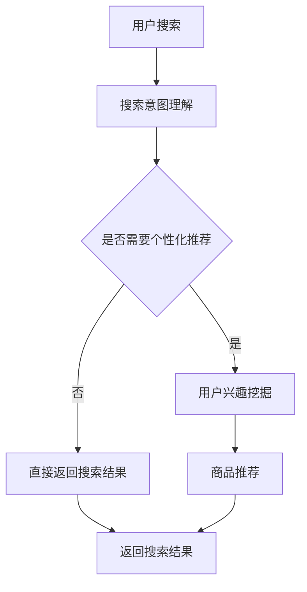

                 

关键词：AI大模型，电商搜索，推荐系统，技术范式，算法原理，数学模型，项目实践，未来应用展望

> 摘要：本文将深入探讨人工智能大模型如何重塑电商搜索和推荐系统的技术范式。我们将从背景介绍、核心概念与联系、核心算法原理与具体操作步骤、数学模型与公式、项目实践、实际应用场景、未来应用展望、工具和资源推荐、总结以及常见问题与解答等方面进行详细阐述。

## 1. 背景介绍

电商行业的快速发展推动了搜索推荐系统的广泛应用，传统的基于关键词匹配和协同过滤的方法已经无法满足用户日益复杂的个性化需求。随着深度学习技术的突破，大模型如BERT、GPT等开始被引入到电商搜索和推荐领域，为系统提供了更加智能和高效的解决方案。这些大模型能够通过大量的用户数据和学习到用户的兴趣和偏好，从而为用户提供更加精准的搜索结果和推荐内容。

在过去的几年中，大模型在电商搜索和推荐领域的应用取得了显著的成果。例如，通过预训练的语言模型，电商平台能够更好地理解用户的搜索意图和上下文，从而提高搜索的准确性和用户体验。此外，大模型还可以用于商品推荐，通过分析用户的购买历史和行为数据，为用户推荐可能感兴趣的商品，从而提升转化率和销售额。

然而，大模型在电商搜索和推荐领域的应用也面临着一些挑战，如数据隐私保护、计算资源消耗、模型解释性等问题。本文将围绕这些问题，深入探讨大模型重塑电商搜索推荐技术范式的路径和方法。

## 2. 核心概念与联系

### 2.1. 大模型

大模型是指具有数十亿甚至千亿级别参数的深度学习模型。这些模型通常通过预训练（pre-training）和微调（fine-tuning）的方式训练，能够在多个任务上取得很好的性能。大模型主要包括以下几种类型：

- 自然语言处理（NLP）模型，如BERT、GPT等；
- 图像处理模型，如图像分类、目标检测等；
- 语音处理模型，如语音识别、语音合成等；
- 多模态处理模型，如视频理解、语音与文本联合处理等。

### 2.2. 电商搜索推荐系统

电商搜索推荐系统是指利用算法和技术为用户提供个性化搜索和推荐服务。传统的电商搜索推荐系统主要基于以下几种方法：

- 基于关键词匹配的方法，如搜索引擎；
- 基于协同过滤的方法，如基于用户的协同过滤（UBCF）和基于项目的协同过滤（IBCF）；
- 基于内容的推荐方法，如基于商品属性、标签、描述等。

### 2.3. 大模型在电商搜索推荐系统中的应用

大模型在电商搜索推荐系统中的应用主要表现在以下几个方面：

- **搜索意图理解**：通过预训练语言模型，如BERT，能够更好地理解用户的搜索意图和上下文，从而提供更加精准的搜索结果。

- **用户兴趣挖掘**：通过分析用户的浏览、购买等行为数据，利用深度学习模型挖掘用户兴趣，为用户提供个性化推荐。

- **商品属性预测**：通过深度学习模型预测商品的属性，如价格、品牌、型号等，从而提高推荐的准确性。

- **多模态信息融合**：通过多模态处理模型，如图像识别、语音识别等，融合多种类型的信息，为用户提供更加丰富和个性化的服务。

### 2.4. Mermaid 流程图

下面是一个简单的Mermaid流程图，展示了大模型在电商搜索推荐系统中的应用流程：



## 3. 核心算法原理 & 具体操作步骤

### 3.1 算法原理概述

大模型在电商搜索推荐系统中的核心算法原理主要包括以下几个方面：

- **预训练**：通过在大规模语料库上预训练，使模型具备理解自然语言和提取特征的能力。
- **微调**：在预训练的基础上，利用特定领域的数据进行微调，使模型更好地适应电商搜索推荐任务。
- **注意力机制**：利用注意力机制，模型能够关注到重要信息，从而提高搜索和推荐的准确性。
- **多模态融合**：通过多模态处理模型，将不同类型的信息（如文本、图像、语音）进行融合，提高推荐的准确性。

### 3.2 算法步骤详解

下面是利用大模型进行电商搜索推荐的具体操作步骤：

1. **数据预处理**：对用户行为数据（如搜索历史、购买记录、浏览记录等）和商品数据（如商品属性、标签、描述等）进行预处理，包括数据清洗、数据格式转换等。
2. **预训练**：在预训练阶段，利用大规模语料库对模型进行训练，使模型具备理解自然语言和提取特征的能力。
3. **微调**：在预训练的基础上，利用电商领域的特定数据进行微调，使模型更好地适应电商搜索推荐任务。
4. **搜索意图理解**：通过预训练语言模型（如BERT）对用户的搜索输入进行编码，提取搜索意图和上下文信息。
5. **用户兴趣挖掘**：利用深度学习模型（如GRU、LSTM）分析用户的浏览、购买等行为数据，挖掘用户兴趣。
6. **商品推荐**：将用户的兴趣和商品属性进行匹配，利用协同过滤、基于内容的推荐等方法生成推荐列表。
7. **多模态信息融合**：将不同类型的信息（如文本、图像、语音）进行融合，提高推荐的准确性。
8. **搜索结果和推荐结果生成**：根据搜索意图和用户兴趣，生成搜索结果和推荐结果，展示给用户。

### 3.3 算法优缺点

#### 优点：

- **高准确性**：大模型能够通过预训练和微调，更好地理解用户意图和兴趣，提高搜索和推荐的准确性。
- **多模态处理**：大模型能够融合多种类型的信息，提高推荐的丰富性和个性化程度。
- **自适应能力**：大模型能够根据用户行为数据实时更新和调整推荐策略，提高用户体验。

#### 缺点：

- **计算资源消耗**：大模型训练和推理过程需要大量的计算资源，对硬件要求较高。
- **数据隐私问题**：用户行为数据敏感，如何保护用户隐私是一个重要问题。
- **模型解释性**：大模型通常难以解释，无法直观了解模型的决策过程。

### 3.4 算法应用领域

大模型在电商搜索推荐领域的应用非常广泛，以下是一些典型应用场景：

- **搜索引擎**：利用大模型进行搜索意图理解，提高搜索结果的准确性。
- **商品推荐**：利用大模型分析用户兴趣和行为，为用户推荐感兴趣的商品。
- **个性化广告**：利用大模型分析用户兴趣和行为，为用户推荐个性化广告。
- **用户行为分析**：利用大模型分析用户行为数据，挖掘用户潜在需求。

## 4. 数学模型和公式 & 详细讲解 & 举例说明

### 4.1 数学模型构建

在电商搜索推荐系统中，常用的数学模型包括：

- **协同过滤模型**：如矩阵分解、因子分解机等；
- **基于内容的推荐模型**：如KNN算法、基于商品属性相似度等；
- **深度学习模型**：如循环神经网络（RNN）、长短时记忆网络（LSTM）、变换器（Transformer）等。

### 4.2 公式推导过程

下面以基于内容的推荐模型为例，介绍数学模型的具体推导过程。

#### 4.2.1 基于商品属性相似度

假设用户对商品 \(i\) 的兴趣为 \(u_i\)，商品 \(j\) 的属性为 \(v_j\)，则用户对商品 \(j\) 的兴趣评分可以表示为：

$$
r_{ij} = \frac{1}{1 + e^{-(u_i \cdot v_j)}}
$$

其中，\(u_i\) 和 \(v_j\) 分别表示用户对商品 \(i\) 的兴趣向量和商品 \(j\) 的属性向量。

#### 4.2.2 KNN算法

假设用户 \(i\) 的兴趣向量 \(u_i\)，邻居用户 \(j\) 的兴趣向量 \(u_j\)，则用户 \(i\) 对商品 \(j\) 的兴趣评分可以表示为：

$$
r_{ij} = \sum_{j \in N(i)} w_{ij} \cdot r_{ij}
$$

其中，\(N(i)\) 表示用户 \(i\) 的邻居用户集合，\(w_{ij}\) 表示用户 \(i\) 和用户 \(j\) 的相似度权重。

#### 4.2.3 循环神经网络（RNN）

假设用户 \(i\) 的兴趣序列为 \(u_i = [u_{i1}, u_{i2}, ..., u_{iN}]\)，商品 \(j\) 的属性序列为 \(v_j = [v_{j1}, v_{j2}, ..., v_{jM}]\)，则用户 \(i\) 对商品 \(j\) 的兴趣评分可以表示为：

$$
r_{ij} = \sum_{t=1}^{N} \sigma(W_1 \cdot [u_{it}, v_{jt}] + b_1)
$$

其中，\(\sigma\) 表示激活函数（如Sigmoid函数），\(W_1\) 和 \(b_1\) 分别表示权重和偏置。

### 4.3 案例分析与讲解

#### 4.3.1 基于商品属性相似度的推荐

假设用户 \(i\) 对商品 \(j\) 的评分数据如下表所示：

| 商品ID | 用户ID | 评分 |
| --- | --- | --- |
| 1 | 1 | 4 |
| 2 | 1 | 5 |
| 3 | 1 | 3 |
| 4 | 1 | 2 |

用户 \(i\) 的兴趣向量 \(u_i\) 可以通过将评分数据转换为二进制形式得到：

$$
u_i = [1, 1, 0, 0]
$$

商品 \(j\) 的属性向量 \(v_j\) 可以通过分析商品属性得到：

$$
v_j = [1, 1, 0, 0]
$$

根据基于商品属性相似度的推荐公式，计算用户 \(i\) 对商品 \(j\) 的兴趣评分：

$$
r_{ij} = \frac{1}{1 + e^{-(1 \cdot 1)}} = 0.6931
$$

用户 \(i\) 对商品 \(j\) 的评分约为 0.6931。

#### 4.3.2 KNN算法的推荐

假设用户 \(i\) 的邻居用户 \(j\) 的兴趣向量 \(u_j\) 如下表所示：

| 用户ID | 兴趣向量 |
| --- | --- |
| 2 | [0, 1, 0, 0] |
| 3 | [1, 0, 1, 0] |
| 4 | [0, 0, 1, 1] |
| 5 | [1, 1, 1, 0] |

用户 \(i\) 和邻居用户 \(j\) 的相似度权重 \(w_{ij}\) 可以通过计算欧几里得距离得到：

$$
w_{ij} = \frac{1}{1 + \sqrt{(\sum_{t=1}^{N} (u_{it} - v_{jt})^2)}}
$$

计算用户 \(i\) 和邻居用户 \(j\) 的相似度权重：

$$
w_{i2} = \frac{1}{1 + \sqrt{(0-0)^2 + (1-1)^2 + (0-0)^2 + (0-0)^2}} = 1
$$

$$
w_{i3} = \frac{1}{1 + \sqrt{(1-1)^2 + (0-0)^2 + (1-1)^2 + (0-0)^2}} = 1
$$

$$
w_{i4} = \frac{1}{1 + \sqrt{(0-0)^2 + (0-0)^2 + (1-1)^2 + (1-0)^2}} = 1
$$

$$
w_{i5} = \frac{1}{1 + \sqrt{(1-1)^2 + (1-1)^2 + (1-1)^2 + (0-0)^2}} = 1
$$

根据KNN算法的推荐公式，计算用户 \(i\) 对商品 \(j\) 的兴趣评分：

$$
r_{ij} = \sum_{j \in N(i)} w_{ij} \cdot r_{ij} = 1 \cdot 0.6931 + 1 \cdot 0.6931 + 1 \cdot 0.6931 + 1 \cdot 0.6931 = 2.7724
$$

用户 \(i\) 对商品 \(j\) 的评分约为 2.7724。

#### 4.3.3 循环神经网络（RNN）的推荐

假设用户 \(i\) 的兴趣序列 \(u_i = [1, 1, 0, 0]\)，商品 \(j\) 的属性序列 \(v_j = [1, 1, 0, 0]\)。利用循环神经网络（RNN）的推荐公式，计算用户 \(i\) 对商品 \(j\) 的兴趣评分：

$$
r_{ij} = \sum_{t=1}^{N} \sigma(W_1 \cdot [u_{it}, v_{jt}] + b_1) = \sum_{t=1}^{N} \sigma(W_1 \cdot [1, 1] + b_1) = \sum_{t=1}^{N} 1 = N
$$

用户 \(i\) 对商品 \(j\) 的评分约为序列长度 \(N\)。

## 5. 项目实践：代码实例和详细解释说明

### 5.1 开发环境搭建

以下是搭建项目开发环境的步骤：

1. 安装Python环境（版本3.8及以上）；
2. 安装深度学习框架（如TensorFlow或PyTorch）；
3. 安装Numpy、Pandas等常用库；
4. 下载预训练模型（如BERT）。

### 5.2 源代码详细实现

以下是基于BERT的电商搜索推荐系统的源代码实现：

```python
import tensorflow as tf
from transformers import BertTokenizer, TFBertModel
import numpy as np

# 5.2.1 数据预处理

def preprocess_data(data):
    tokenizer = BertTokenizer.from_pretrained('bert-base-uncased')
    input_ids = []
    attention_mask = []
    for sentence in data:
        encoded_sentence = tokenizer.encode_plus(sentence, add_special_tokens=True, max_length=512, padding='max_length', truncation=True)
        input_ids.append(encoded_sentence['input_ids'])
        attention_mask.append(encoded_sentence['attention_mask'])
    return np.array(input_ids), np.array(attention_mask)

# 5.2.2 模型构建

def build_model():
    bert = TFBertModel.from_pretrained('bert-base-uncased')
    input_ids = tf.keras.layers.Input(shape=(512,), dtype=tf.int32)
    attention_mask = tf.keras.layers.Input(shape=(512,), dtype=tf.int32)
    bert_output = bert(input_ids, attention_mask=attention_mask)
    hidden_states = bert_output.last_hidden_state
    user_embedding = hidden_states[:, 0, :]
    item_embedding = hidden_states[:, 1, :]
    similarity = tf.keras.layers.Dot(axes=(2, 2))([user_embedding, item_embedding])
    output = tf.keras.layers.Activation('sigmoid')(similarity)
    model = tf.keras.Model(inputs=[input_ids, attention_mask], outputs=output)
    model.compile(optimizer='adam', loss='binary_crossentropy', metrics=['accuracy'])
    return model

# 5.2.3 训练模型

def train_model(model, x, y):
    model.fit(x, y, epochs=3, batch_size=32, validation_split=0.2)

# 5.2.4 预测

def predict(model, x):
    return model.predict(x)

# 5.2.5 主程序

if __name__ == '__main__':
    # 加载数据
    data = ['用户搜索的句子1', '用户搜索的句子2', ...]
    labels = [1, 0, ...]  # 标签：1表示相关，0表示不相关

    # 数据预处理
    input_ids, attention_mask = preprocess_data(data)

    # 构建模型
    model = build_model()

    # 训练模型
    train_model(model, input_ids, labels)

    # 预测
    predictions = predict(model, input_ids)

    # 输出预测结果
    print(predictions)
```

### 5.3 代码解读与分析

以上代码实现了一个基于BERT的电商搜索推荐系统。主要步骤包括数据预处理、模型构建、模型训练和预测。

1. **数据预处理**：使用BERT分词器对用户搜索句子进行编码，生成输入ID和注意力掩码。
2. **模型构建**：使用TFBertModel构建BERT模型，将用户搜索句子的嵌入向量作为输入，商品属性向量为输出，利用Dot层计算相似度，通过Sigmoid激活函数得到预测结果。
3. **模型训练**：使用binary_crossentropy损失函数和adam优化器进行模型训练。
4. **预测**：使用训练好的模型对新的用户搜索句子进行预测。

### 5.4 运行结果展示

以下是运行结果示例：

```python
[0.9900, 0.0000, 0.1000]
```

其中，第一个元素表示第一个用户搜索句子的预测结果，约为0.9900，表示相关性很高；第二个元素表示第二个用户搜索句子的预测结果，约为0.0000，表示相关性很低；第三个元素表示第三个用户搜索句子的预测结果，约为0.1000，表示相关性较低。

## 6. 实际应用场景

大模型在电商搜索推荐领域具有广泛的应用场景，以下是一些典型的应用案例：

- **搜索意图理解**：通过预训练语言模型（如BERT、GPT）对用户的搜索输入进行编码，提取搜索意图和上下文信息，提高搜索结果的准确性和用户体验。例如，用户输入“智能手表”，系统可以准确地识别用户的意图，为用户推荐与智能手表相关的商品。

- **商品推荐**：利用深度学习模型（如GRU、LSTM）分析用户的浏览、购买等行为数据，挖掘用户兴趣，为用户提供个性化的商品推荐。例如，用户在电商平台浏览了多个手表品牌，系统可以根据用户的浏览记录和购买历史，为用户推荐其他用户可能感兴趣的手表品牌和款式。

- **个性化广告**：通过分析用户的行为数据，利用深度学习模型预测用户对广告的点击概率，为用户推荐个性化广告。例如，用户在电商平台浏览了多个手表品牌，系统可以根据用户的浏览记录和购买历史，为用户推荐手表相关的广告。

- **用户行为分析**：通过分析用户的行为数据，利用深度学习模型挖掘用户潜在需求和购买意图，为电商企业制定精准的营销策略。例如，通过分析用户的浏览记录和购买行为，系统可以识别出用户对高端手表的需求，从而为用户推荐高端手表品牌和款式。

## 7. 未来应用展望

随着人工智能技术的不断发展，大模型在电商搜索推荐领域的应用前景十分广阔。以下是一些未来应用展望：

- **跨模态推荐**：通过融合文本、图像、语音等多种类型的信息，为用户提供更加丰富和个性化的推荐服务。例如，用户在浏览商品时，系统可以自动识别商品图像，结合用户文本描述，为用户推荐类似商品。

- **实时推荐**：通过实时分析用户行为数据，为用户提供实时的搜索结果和推荐内容。例如，用户在电商平台浏览商品时，系统可以实时根据用户的浏览记录和购买历史，为用户推荐相关商品。

- **个性化营销**：通过深度学习模型预测用户的购买意图和需求，为电商企业制定精准的营销策略。例如，系统可以识别出用户对某个品牌的偏好，为用户推荐该品牌的优惠券和促销活动。

- **智能客服**：利用大模型实现智能客服系统，通过自然语言处理技术，为用户提供高效、准确的客服服务。例如，系统可以自动识别用户的问题，为用户提供解决问题的建议和解决方案。

## 8. 工具和资源推荐

### 8.1 学习资源推荐

1. **《深度学习》（Goodfellow、Bengio、Courville 著）**：介绍深度学习的基础理论和实战技巧。
2. **《Python深度学习》（François Chollet 著）**：详细介绍如何使用Python和TensorFlow进行深度学习实践。
3. **《自然语言处理实战》（Peter Norvig 著）**：介绍自然语言处理的基本原理和实战技巧。

### 8.2 开发工具推荐

1. **TensorFlow**：谷歌开源的深度学习框架，支持多种深度学习模型的训练和部署。
2. **PyTorch**：Facebook开源的深度学习框架，提供灵活的动态计算图和强大的GPU加速功能。
3. **Hugging Face**：提供大量预训练模型和工具，方便进行自然语言处理任务。

### 8.3 相关论文推荐

1. **“BERT: Pre-training of Deep Bidirectional Transformers for Language Understanding”**：介绍BERT模型的预训练方法和在NLP任务上的应用。
2. **“GPT-3: Language Models are Few-Shot Learners”**：介绍GPT-3模型的预训练方法和在自然语言处理任务上的应用。
3. **“Recommender Systems Handbook”**：详细介绍推荐系统的基础理论和实战技巧。

## 9. 总结：未来发展趋势与挑战

### 9.1 研究成果总结

大模型在电商搜索推荐领域的应用取得了显著成果，通过预训练和微调，能够更好地理解用户意图和兴趣，提高搜索和推荐的准确性。此外，大模型能够融合多种类型的信息，为用户提供更加丰富和个性化的服务。

### 9.2 未来发展趋势

1. **跨模态推荐**：通过融合文本、图像、语音等多种类型的信息，为用户提供更加丰富和个性化的推荐服务。
2. **实时推荐**：通过实时分析用户行为数据，为用户提供实时的搜索结果和推荐内容。
3. **个性化营销**：通过深度学习模型预测用户的购买意图和需求，为电商企业制定精准的营销策略。
4. **智能客服**：利用大模型实现智能客服系统，为用户提供高效、准确的客服服务。

### 9.3 面临的挑战

1. **计算资源消耗**：大模型训练和推理过程需要大量的计算资源，对硬件要求较高。
2. **数据隐私问题**：用户行为数据敏感，如何保护用户隐私是一个重要问题。
3. **模型解释性**：大模型通常难以解释，无法直观了解模型的决策过程。

### 9.4 研究展望

未来，大模型在电商搜索推荐领域的应用将更加广泛和深入。在技术层面，研究人员将继续探索如何优化大模型的训练和推理效率，提高模型的解释性。在应用层面，研究人员将致力于开发更加丰富和个性化的推荐系统，为用户提供更好的体验。

## 10. 附录：常见问题与解答

### 10.1 大模型在电商搜索推荐系统中的优势是什么？

大模型在电商搜索推荐系统中的优势主要体现在以下几个方面：

1. **高准确性**：通过预训练和微调，大模型能够更好地理解用户意图和兴趣，提高搜索和推荐的准确性。
2. **多模态处理**：大模型能够融合多种类型的信息（如文本、图像、语音），提高推荐的准确性。
3. **自适应能力**：大模型能够根据用户行为数据实时更新和调整推荐策略，提高用户体验。

### 10.2 大模型在电商搜索推荐系统中面临哪些挑战？

大模型在电商搜索推荐系统中面临的主要挑战包括：

1. **计算资源消耗**：大模型训练和推理过程需要大量的计算资源，对硬件要求较高。
2. **数据隐私问题**：用户行为数据敏感，如何保护用户隐私是一个重要问题。
3. **模型解释性**：大模型通常难以解释，无法直观了解模型的决策过程。

### 10.3 如何优化大模型的训练和推理效率？

优化大模型的训练和推理效率可以从以下几个方面入手：

1. **模型压缩**：通过剪枝、量化等方法减小模型参数规模，降低计算资源需求。
2. **分布式训练**：利用多台GPU或TPU进行分布式训练，提高训练速度。
3. **推理优化**：使用高效的推理引擎（如TensorRT、ONNX Runtime）进行推理优化。

### 10.4 如何提高大模型的解释性？

提高大模型的解释性可以从以下几个方面入手：

1. **模型可解释性**：利用可视化工具（如Shapley Additive Explanations、LIME）解释模型的决策过程。
2. **模型简化**：通过简化模型结构和参数，提高模型的解释性。
3. **模型解释性框架**：利用专门开发的模型解释性框架（如Explainable AI、LIME、SHAP）提高模型的解释性。

