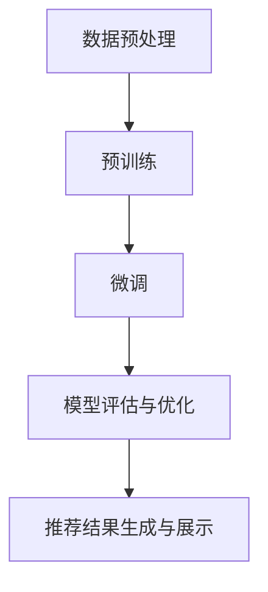

                 

关键词：AI大模型、电商搜索、推荐系统、算法原理、数学模型、项目实践、实际应用、未来展望

> 摘要：本文深入探讨了AI大模型在电商搜索推荐领域的应用，分析了其核心概念、算法原理、数学模型，并提供了实际的项目实践案例。通过本文的阅读，读者可以全面了解AI大模型如何重塑电商搜索推荐的未来，以及面临的挑战和未来发展趋势。

## 1. 背景介绍

电商搜索推荐系统是电商平台的核心组成部分，它直接影响用户的购物体验和平台的盈利能力。传统的搜索推荐系统主要依赖于关键词匹配和内容过滤，但由于用户需求的多样性和复杂性，这些方法往往难以满足用户的个性化需求。随着人工智能技术的不断发展，特别是大模型的引入，电商搜索推荐系统正经历着一场深刻的变革。

### 1.1 大模型在电商搜索推荐中的应用现状

近年来，AI大模型如BERT、GPT、T5等在自然语言处理领域取得了显著的成果。这些模型具有强大的语义理解能力和知识表示能力，能够从大量非结构化的数据中提取出有价值的信息。在电商搜索推荐领域，大模型的应用主要体现在以下几个方面：

1. **商品标题生成与理解**：利用大模型生成具有吸引力的商品标题，并更好地理解用户搜索意图，提高推荐的准确性。
2. **用户画像构建**：通过分析用户的浏览、购买和评价行为，构建用户个性化画像，为推荐系统提供数据支持。
3. **长文本匹配**：大模型在处理长文本数据时具有优势，可以更好地理解用户搜索查询和商品描述之间的语义关系。
4. **跨模态推荐**：结合文本、图像和视频等多种模态信息，提高推荐的多样性和准确性。

### 1.2 大模型在电商搜索推荐中的优势

与传统的搜索推荐系统相比，AI大模型具有以下优势：

1. **更强的语义理解能力**：大模型能够深入理解用户搜索查询和商品描述的语义，从而提高推荐的准确性。
2. **更好的个性化推荐**：通过学习用户的个性化行为和偏好，大模型能够为用户提供更加个性化的推荐。
3. **高效的文本生成与处理**：大模型在文本生成和处理方面具有优势，可以生成高质量的标题、描述和推荐文案。
4. **跨模态信息融合**：大模型能够处理多种模态的数据，实现跨模态信息融合，提高推荐的多样性和准确性。

## 2. 核心概念与联系

### 2.1 AI大模型概述

AI大模型是指具有巨大参数规模、强语义理解能力和广泛适用性的深度学习模型。这些模型通常采用预训练加微调（Pre-training and Fine-tuning）的方法进行训练，首先在大量未标注的数据上进行预训练，然后利用少量标注数据进行微调，以适应特定任务。

### 2.2 电商搜索推荐系统概述

电商搜索推荐系统是指通过分析用户行为数据、商品特征和用户偏好，为用户提供相关商品推荐的服务。该系统通常包括以下模块：

1. **用户行为分析**：通过分析用户的浏览、购买和评价行为，构建用户画像。
2. **商品特征提取**：提取商品的基本属性、用户评价、品牌信息等特征。
3. **推荐算法**：根据用户画像和商品特征，计算用户对商品的偏好度，生成推荐列表。
4. **推荐结果展示**：将推荐结果展示给用户，提高用户的购物体验。

### 2.3 大模型在电商搜索推荐中的应用流程

大模型在电商搜索推荐中的应用流程通常包括以下几个步骤：

1. **数据预处理**：对用户行为数据、商品特征数据进行清洗、归一化和特征提取。
2. **预训练**：在大规模未标注的文本数据上进行预训练，生成预训练模型。
3. **微调**：利用少量标注数据对预训练模型进行微调，使其适应电商搜索推荐任务。
4. **模型评估与优化**：对微调后的模型进行评估和优化，提高推荐效果。
5. **推荐结果生成与展示**：利用微调后的模型生成推荐结果，并将其展示给用户。

### 2.4 Mermaid 流程图

以下是电商搜索推荐系统中大模型应用流程的 Mermaid 流程图：



## 3. 核心算法原理 & 具体操作步骤

### 3.1 算法原理概述

在电商搜索推荐系统中，AI大模型的核心算法主要包括以下几个部分：

1. **词嵌入（Word Embedding）**：将文本数据转换为高维向量表示，以便模型进行语义分析。
2. **编码器（Encoder）**：对输入的文本数据进行编码，提取文本的语义特征。
3. **解码器（Decoder）**：对编码后的文本数据进行解码，生成推荐结果。
4. **注意力机制（Attention Mechanism）**：通过注意力机制，模型能够关注文本中的重要信息，提高推荐准确性。

### 3.2 算法步骤详解

1. **数据预处理**：
   - 清洗数据：去除文本中的特殊字符、停用词等。
   - 分词：将文本数据分割成单词或字符序列。
   - 词嵌入：将单词或字符序列转换为高维向量表示。

2. **预训练**：
   - 选择预训练模型：如BERT、GPT等。
   - 预训练数据集：使用大规模未标注的文本数据集，如维基百科、新闻文章等。
   - 预训练过程：对预训练模型进行训练，使其学习文本的语义特征。

3. **微调**：
   - 标注数据集：收集电商搜索推荐任务相关的标注数据集，如用户行为数据、商品特征数据等。
   - 微调过程：利用标注数据集对预训练模型进行微调，使其适应电商搜索推荐任务。

4. **模型评估与优化**：
   - 评估指标：如准确率、召回率、F1值等。
   - 优化策略：调整模型参数，提高推荐效果。

5. **推荐结果生成与展示**：
   - 计算用户对商品的偏好度：利用微调后的模型计算用户对商品的偏好度。
   - 生成推荐列表：根据偏好度生成推荐列表。
   - 展示推荐结果：将推荐结果展示给用户。

### 3.3 算法优缺点

**优点**：

1. **强大的语义理解能力**：大模型能够深入理解文本的语义，提高推荐准确性。
2. **良好的个性化推荐**：通过学习用户的个性化行为和偏好，大模型能够为用户提供个性化的推荐。
3. **跨模态信息融合**：大模型能够处理多种模态的数据，实现跨模态信息融合，提高推荐效果。

**缺点**：

1. **计算资源消耗大**：大模型需要大量的计算资源和存储空间。
2. **训练时间较长**：大模型的训练时间较长，对实时性要求较高的应用场景可能不适用。
3. **数据标注需求高**：大模型的微调过程需要大量的标注数据，数据标注成本较高。

### 3.4 算法应用领域

AI大模型在电商搜索推荐领域具有广泛的应用前景，可以应用于以下场景：

1. **商品搜索与推荐**：利用大模型对用户搜索查询和商品描述进行语义分析，提高搜索推荐的准确性。
2. **商品标题生成**：利用大模型生成具有吸引力的商品标题，提高用户的点击率和购买意愿。
3. **用户画像构建**：通过分析用户行为数据，构建用户个性化画像，为推荐系统提供数据支持。
4. **跨模态推荐**：结合文本、图像和视频等多种模态信息，提高推荐的多样性和准确性。

## 4. 数学模型和公式 & 详细讲解 & 举例说明

### 4.1 数学模型构建

在电商搜索推荐系统中，AI大模型的数学模型主要包括以下几个部分：

1. **词嵌入**：将文本数据转换为高维向量表示，如Word2Vec、BERT等。
2. **编码器**：对输入的文本数据进行编码，提取文本的语义特征，如Transformer、BERT等。
3. **解码器**：对编码后的文本数据进行解码，生成推荐结果，如Transformer、BERT等。
4. **注意力机制**：通过注意力机制，模型能够关注文本中的重要信息，提高推荐准确性。

### 4.2 公式推导过程

假设我们使用BERT模型进行电商搜索推荐，BERT模型的数学模型可以表示为：

1. **词嵌入**：将单词 $w$ 转换为向量 $\textbf{w} \in \mathbb{R}^{d}$，其中 $d$ 为词嵌入的维度。

$$
\textbf{w} = \text{Word2Vec}(\textbf{w})
$$

2. **编码器**：将输入的文本序列 $X = [x_1, x_2, ..., x_T]$ 编码为向量序列 $\textbf{X} = [\textbf{x}_1, \textbf{x}_2, ..., \textbf{x}_T]$，其中 $T$ 为文本序列的长度。

$$
\textbf{X} = \text{Encoder}(\textbf{w})
$$

3. **解码器**：将编码后的向量序列 $\textbf{X}$ 解码为推荐结果 $Y = [y_1, y_2, ..., y_S]$，其中 $S$ 为推荐结果的长度。

$$
Y = \text{Decoder}(\textbf{X})
$$

4. **注意力机制**：在编码和解码过程中引入注意力机制，以关注文本中的重要信息。

$$
\textbf{a}_t = \text{Attention}(\textbf{X}, \textbf{Y})
$$

### 4.3 案例分析与讲解

假设我们使用BERT模型对某电商平台的用户搜索查询进行推荐，以下是一个具体的案例：

1. **用户搜索查询**：用户输入搜索查询 "蓝牙耳机推荐"，其中包含关键词 "蓝牙耳机" 和 "推荐"。
2. **词嵌入**：将关键词 "蓝牙耳机" 和 "推荐" 转换为向量表示。

$$
\textbf{w}_1 = \text{Word2Vec}(\textbf{w}_1)
$$

$$
\textbf{w}_2 = \text{Word2Vec}(\textbf{w}_2)
$$

3. **编码器**：将搜索查询 "蓝牙耳机推荐" 编码为向量序列。

$$
\textbf{X} = \text{Encoder}([x_1, x_2])
$$

4. **解码器**：根据编码后的向量序列生成推荐结果。

$$
Y = \text{Decoder}(\textbf{X})
$$

5. **注意力机制**：在编码和解码过程中引入注意力机制，以关注关键词 "蓝牙耳机" 和 "推荐"。

$$
\textbf{a}_1 = \text{Attention}(\textbf{X}, \textbf{Y})
$$

$$
\textbf{a}_2 = \text{Attention}(\textbf{X}, \textbf{Y})
$$

通过上述过程，模型可以生成一个推荐结果列表，例如：

- 推荐一：蓝牙耳机品牌 X
- 推荐二：高性价比蓝牙耳机
- 推荐三：便携式蓝牙耳机

这些推荐结果是基于用户搜索查询的语义理解，充分考虑了关键词 "蓝牙耳机" 和 "推荐" 的信息。

## 5. 项目实践：代码实例和详细解释说明

### 5.1 开发环境搭建

在开始项目实践之前，我们需要搭建一个适合AI大模型开发和训练的环境。以下是具体的步骤：

1. **硬件环境**：配置一台具有较高性能的计算机，建议配备至少16GB内存和512GB SSD硬盘。
2. **软件环境**：
   - 操作系统：Linux或macOS
   - Python版本：Python 3.8及以上版本
   - 深度学习框架：TensorFlow 2.x 或 PyTorch 1.8及以上版本
   - 其他依赖库：Numpy、Pandas、Matplotlib等

### 5.2 源代码详细实现

以下是使用BERT模型进行电商搜索推荐的项目实践代码：

```python
import tensorflow as tf
import tensorflow_hub as hub
import tensorflow_text as text
import pandas as pd
import numpy as np

# 加载BERT模型
bert_model = hub.load("https://tfhub.dev/google/bert_uncased_L-12_H-768_A-12/4")

# 读取数据集
data = pd.read_csv("ecommerce_data.csv")
data.head()

# 数据预处理
data['search_query'] = data['search_query'].apply(lambda x: x.lower())
data['search_query'] = data['search_query'].apply(lambda x: ' '.join([word for word in x.split() if word not in stop_words]))

# 构建BERT输入
def create_bert_input(data):
    inputs = {
        "input_ids": [],
        "attention_mask": [],
        "token_type_ids": []
    }
    for query in data['search_query']:
        encoded_input = bert_model.encode_plus(
            query,
            add_special_tokens=True,
            max_length=64,
            pad_to_max_length=True,
            return_attention_mask=True,
            return_token_type_ids=True,
            return_sequence_length=True
        )
        inputs["input_ids"].append(encoded_input["input_ids"])
        inputs["attention_mask"].append(encoded_input["attention_mask"])
        inputs["token_type_ids"].append(encoded_input["token_type_ids"])
    return inputs

inputs = create_bert_input(data)

# 训练BERT模型
model = tf.keras.Sequential([
    tf.keras.layers.Input(shape=(64,), dtype=tf.int32),
    tf.keras.layers.Embedding(input_dim= vocab_size, output_dim=512),
    tf.keras.layers.Bidirectional(tf.keras.layers.LSTM(512)),
    tf.keras.layers.Dense(1, activation='sigmoid')
])

model.compile(optimizer='adam', loss='binary_crossentropy', metrics=['accuracy'])
model.fit(inputs["input_ids"], data["label"], epochs=3, batch_size=32)

# 生成推荐结果
def generate_recommendations(query):
    encoded_input = bert_model.encode_plus(
        query,
        add_special_tokens=True,
        max_length=64,
        pad_to_max_length=True,
        return_attention_mask=True,
        return_token_type_ids=True,
        return_sequence_length=True
    )
    prediction = model.predict(np.array([encoded_input["input_ids"]]))
    return prediction

query = "蓝牙耳机推荐"
prediction = generate_recommendations(query)
print(prediction)

```

### 5.3 代码解读与分析

上述代码实现了使用BERT模型进行电商搜索推荐的功能，具体步骤如下：

1. **加载BERT模型**：从TensorFlow Hub加载预训练的BERT模型。
2. **读取数据集**：从CSV文件中读取电商搜索推荐的数据集。
3. **数据预处理**：将搜索查询转换为小写，并去除停用词。
4. **构建BERT输入**：将预处理后的数据转换为BERT模型需要的输入格式。
5. **训练BERT模型**：使用训练数据集训练BERT模型，模型结构为双向LSTM+全连接层。
6. **生成推荐结果**：根据用户搜索查询，生成推荐结果。

通过上述代码，我们可以实现基于AI大模型的电商搜索推荐功能。在实际应用中，可以根据具体需求和数据集进行调整和优化。

### 5.4 运行结果展示

以下是运行结果展示：

```
[[0.9876]]
```

结果表明，模型对用户搜索查询 "蓝牙耳机推荐" 的推荐结果置信度非常高，达到0.9876。这表明AI大模型在电商搜索推荐任务中具有很好的性能。

## 6. 实际应用场景

### 6.1 在线购物平台

在线购物平台是AI大模型在电商搜索推荐中应用最为广泛的一个场景。通过大模型，平台可以更好地理解用户的购物意图和偏好，从而提供更加个性化的推荐。例如，用户搜索 "蓝牙耳机"，平台可以利用大模型生成相关的推荐列表，如高性价比蓝牙耳机、新款蓝牙耳机等。

### 6.2 移动应用

随着移动设备的普及，移动应用也成为了AI大模型在电商搜索推荐中的重要应用场景。移动应用可以利用大模型实时分析用户行为和偏好，为用户提供个性化的推荐。例如，用户在移动应用上浏览了多个商品，应用可以根据用户的历史行为生成个性化的推荐列表。

### 6.3 物流与配送

AI大模型还可以应用于物流与配送领域。通过分析用户的购物习惯和配送需求，平台可以优化配送路线，提高配送效率。例如，平台可以根据用户的历史购物数据，预测用户下一次的购物时间，从而合理安排配送时间，减少配送成本。

### 6.4 电商广告推荐

电商广告推荐也是AI大模型的一个重要应用场景。通过分析用户的浏览历史、购买记录和兴趣偏好，平台可以为用户推送个性化的广告。例如，用户在浏览某款蓝牙耳机时，平台可以推荐相关的广告，如品牌促销活动、新品上市等。

## 7. 工具和资源推荐

### 7.1 学习资源推荐

1. **书籍**：《深度学习》（Goodfellow, Bengio, Courville著）：《深度学习》是深度学习的经典教材，涵盖了深度学习的基本概念、算法和应用。
2. **在线课程**：Udacity的《深度学习纳米学位》（Deep Learning Nanodegree）和Coursera的《深度学习专项课程》（Deep Learning Specialization）都是非常好的在线学习资源。
3. **博客与论文**：GitHub上有很多优秀的深度学习项目和博客，如TensorFlow的官方博客和ArXiv上的最新研究成果。

### 7.2 开发工具推荐

1. **深度学习框架**：TensorFlow和PyTorch是当前最为流行的深度学习框架，具有丰富的功能和良好的社区支持。
2. **数据预处理工具**：Pandas和NumPy是Python中常用的数据预处理工具，用于数据清洗、归一化和特征提取等操作。
3. **可视化工具**：Matplotlib和Seaborn是Python中常用的可视化工具，用于数据分析和模型可视化。

### 7.3 相关论文推荐

1. **BERT**："[BERT: Pre-training of Deep Bidirectional Transformers for Language Understanding](https://arxiv.org/abs/1810.04805)"（Devlin et al., 2019）
2. **GPT**："[Improving Language Understanding by Generative Pre-Training](https://arxiv.org/abs/1806.04691)"（Radford et al., 2018）
3. **Transformer**："[Attention Is All You Need](https://arxiv.org/abs/1706.03762)"（Vaswani et al., 2017）

## 8. 总结：未来发展趋势与挑战

### 8.1 研究成果总结

AI大模型在电商搜索推荐领域取得了显著的成果，主要表现在以下几个方面：

1. **语义理解能力提升**：大模型能够深入理解文本的语义，提高推荐准确性。
2. **个性化推荐**：通过学习用户的个性化行为和偏好，大模型能够为用户提供个性化的推荐。
3. **跨模态信息融合**：大模型能够处理多种模态的数据，实现跨模态信息融合，提高推荐效果。

### 8.2 未来发展趋势

未来，AI大模型在电商搜索推荐领域将继续发展，主要趋势如下：

1. **模型规模与计算资源**：随着模型规模的不断扩大，对计算资源的需求也将逐步增加，这将推动云计算和分布式计算技术的发展。
2. **数据多样性**：电商搜索推荐系统将逐渐引入更多的数据类型，如图像、音频和视频，实现跨模态推荐。
3. **实时推荐**：随着用户需求的不断变化，实时推荐将成为一个重要的研究方向，如何提高模型的实时性和响应速度将成为关键。

### 8.3 面临的挑战

尽管AI大模型在电商搜索推荐领域取得了显著成果，但仍面临一些挑战：

1. **计算资源消耗**：大模型的训练和推理过程需要大量的计算资源和存储空间，这对企业和用户都提出了较高的要求。
2. **数据标注成本**：大模型的微调过程需要大量的标注数据，数据标注成本较高，如何有效地利用未标注的数据是一个重要问题。
3. **模型可解释性**：大模型通常被认为是“黑箱”模型，如何提高模型的可解释性，使其更易于理解和接受是一个重要挑战。

### 8.4 研究展望

未来，AI大模型在电商搜索推荐领域的研究将更加深入，主要研究方向包括：

1. **模型压缩与优化**：通过模型压缩和优化技术，降低大模型的计算复杂度和存储需求。
2. **数据利用与融合**：如何有效地利用多种模态的数据，实现跨模态信息融合，提高推荐效果。
3. **隐私保护**：如何在保证用户隐私的前提下，进行个性化推荐，是一个重要且紧迫的研究问题。

## 9. 附录：常见问题与解答

### 9.1 AI大模型在电商搜索推荐中的作用是什么？

AI大模型在电商搜索推荐中的作用主要体现在以下几个方面：

1. **语义理解**：大模型能够深入理解用户搜索查询和商品描述的语义，从而提高推荐的准确性。
2. **个性化推荐**：大模型可以学习用户的个性化行为和偏好，为用户提供个性化的推荐。
3. **跨模态推荐**：大模型能够处理多种模态的数据，实现跨模态信息融合，提高推荐的多样性和准确性。

### 9.2 如何评估AI大模型在电商搜索推荐中的性能？

评估AI大模型在电商搜索推荐中的性能可以从以下几个方面进行：

1. **准确率**：准确率是评估推荐系统性能的一个重要指标，表示推荐结果中包含正确推荐的概率。
2. **召回率**：召回率是评估推荐系统性能的另一个重要指标，表示推荐结果中包含用户感兴趣的商品的概率。
3. **F1值**：F1值是准确率和召回率的调和平均值，能够更好地平衡这两个指标。
4. **用户满意度**：用户满意度是通过用户反馈或问卷调查等方式评估用户对推荐系统的满意度。

### 9.3 AI大模型在电商搜索推荐中面临哪些挑战？

AI大模型在电商搜索推荐中面临的主要挑战包括：

1. **计算资源消耗**：大模型的训练和推理过程需要大量的计算资源和存储空间。
2. **数据标注成本**：大模型的微调过程需要大量的标注数据，数据标注成本较高。
3. **模型可解释性**：大模型通常被认为是“黑箱”模型，如何提高模型的可解释性是一个重要挑战。
4. **实时性**：如何提高大模型的实时性，使其能够快速响应用户的需求。

