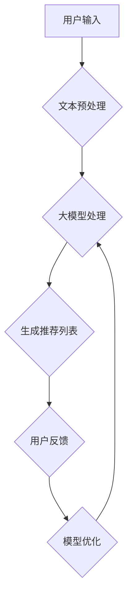

                 

关键词：人工智能，大模型，电商搜索，推荐系统，业务重构

> 摘要：本文旨在探讨人工智能中的大模型如何重塑电商搜索和推荐系统的业务边界。通过分析大模型的原理、算法、数学模型和具体实现，本文揭示了其在提高搜索推荐准确性和用户体验方面的潜力，并展望了其未来的发展趋势和挑战。

## 1. 背景介绍

随着互联网和电子商务的迅速发展，搜索推荐系统已经成为电商企业不可或缺的一环。传统的搜索推荐系统主要依赖于关键词匹配、协同过滤等算法，但这些算法在处理大量复杂数据和用户行为时存在一定的局限性。近年来，人工智能尤其是大模型的兴起，为电商搜索推荐带来了全新的变革契机。

大模型，如GPT、BERT等，具有处理海量数据、理解复杂语义、生成高质量内容的能力，这使得它们在搜索推荐系统中具有显著的优势。本文将深入探讨大模型如何重构电商搜索推荐的业务边界，包括核心概念、算法原理、数学模型以及具体实现等方面。

## 2. 核心概念与联系

### 2.1 大模型的基本概念

大模型是指具有数十亿甚至数万亿参数的深度学习模型，如Transformer架构下的预训练语言模型。这些模型能够通过自主学习和海量数据训练，获取丰富的知识结构和语义理解能力。

### 2.2 大模型与电商搜索推荐的关系

大模型与电商搜索推荐系统的结合，主要体现在以下几个方面：

- **语义理解**：大模型能够深入理解用户查询和商品描述的语义，从而提供更加精准的搜索结果和推荐内容。
- **个性化推荐**：基于用户的历史行为和兴趣偏好，大模型能够生成个性化的推荐列表，提升用户满意度。
- **多模态处理**：大模型不仅可以处理文本数据，还可以处理图像、语音等多模态信息，为搜索推荐系统带来更多可能性。

### 2.3 Mermaid 流程图

下面是一个简单的Mermaid流程图，展示了大模型在电商搜索推荐系统中的核心流程：



## 3. 核心算法原理 & 具体操作步骤

### 3.1 算法原理概述

大模型在电商搜索推荐系统中的核心作用是通过深度学习算法，对用户查询和商品信息进行语义理解，然后生成个性化的推荐结果。具体来说，大模型的工作流程包括以下几个步骤：

- **数据预处理**：对用户查询和商品描述进行清洗、分词、编码等预处理操作，以便于模型处理。
- **模型训练**：使用大量电商数据训练大模型，使其具备理解用户意图和商品属性的能力。
- **推荐生成**：输入用户查询和商品特征，通过大模型生成个性化的推荐列表。
- **反馈优化**：根据用户反馈调整模型参数，不断优化推荐效果。

### 3.2 算法步骤详解

#### 3.2.1 数据预处理

数据预处理是模型训练的基础，主要包括以下步骤：

- **文本清洗**：去除停用词、标点符号等无关信息，保证数据质量。
- **分词**：将文本分解为词或词组，以便进行后续处理。
- **编码**：将文本转化为数字编码，如Word2Vec、BERT等。

#### 3.2.2 模型训练

模型训练的核心是优化模型参数，使其在训练数据上达到良好的性能。具体步骤如下：

- **数据加载**：从数据集中加载用户查询和商品特征。
- **模型初始化**：初始化模型参数，如权重、偏置等。
- **前向传播**：输入数据，计算模型输出。
- **损失函数计算**：计算模型输出与真实标签之间的差距，得到损失值。
- **反向传播**：根据损失值调整模型参数。
- **迭代优化**：重复前向传播和反向传播，直到模型收敛。

#### 3.2.3 推荐生成

推荐生成是基于用户查询和商品特征的语义理解，生成个性化的推荐列表。具体步骤如下：

- **查询编码**：将用户查询转化为模型可处理的编码。
- **特征提取**：提取商品特征，如商品类别、品牌、价格等。
- **模型预测**：输入查询编码和商品特征，通过大模型预测推荐结果。
- **推荐排序**：对推荐结果进行排序，选出最佳推荐。

#### 3.2.4 反馈优化

反馈优化是提高推荐系统质量的关键，具体步骤如下：

- **用户反馈收集**：收集用户对推荐结果的反馈，如点击、购买等。
- **模型调整**：根据用户反馈调整模型参数，优化推荐效果。
- **迭代优化**：重复反馈收集和模型调整，实现推荐系统的持续优化。

### 3.3 算法优缺点

#### 优点：

- **高准确性**：大模型能够深入理解用户意图和商品属性，提高推荐准确性。
- **个性化**：基于用户历史行为和兴趣偏好，生成个性化推荐。
- **多模态处理**：能够处理文本、图像、语音等多模态信息，提高推荐系统的多样性。

#### 缺点：

- **计算资源消耗**：大模型训练和推理需要大量的计算资源。
- **数据依赖**：大模型的效果依赖于大量高质量的训练数据。
- **隐私问题**：用户隐私数据的安全保护是重要挑战。

### 3.4 算法应用领域

大模型在电商搜索推荐系统中具有广泛的应用领域：

- **商品搜索**：通过大模型对用户查询进行语义理解，提高商品搜索的准确性。
- **个性化推荐**：根据用户历史行为和兴趣偏好，生成个性化推荐列表。
- **广告投放**：基于用户兴趣和行为预测，实现精准广告投放。
- **智能客服**：通过大模型实现智能问答和客服，提高客户满意度。

## 4. 数学模型和公式 & 详细讲解 & 举例说明

### 4.1 数学模型构建

大模型在电商搜索推荐系统中的数学模型主要包括以下部分：

- **输入层**：接收用户查询和商品特征。
- **编码层**：对输入数据进行编码处理，如Word2Vec、BERT等。
- **隐含层**：通过深度学习算法，提取输入数据的特征。
- **输出层**：生成推荐结果，如推荐列表、广告投放等。

### 4.2 公式推导过程

假设我们有一个电商搜索推荐系统，其中用户查询为\( q \)，商品特征为\( x \)。大模型的输入层可以表示为：

\[ \text{input} = [q, x] \]

其中，\( q \)和\( x \)分别表示用户查询和商品特征。

编码层使用Word2Vec或BERT等模型对\( q \)和\( x \)进行编码，得到编码后的向量表示：

\[ \text{encoded\_q} = \text{Word2Vec}(q) \]
\[ \text{encoded\_x} = \text{BERT}(x) \]

隐含层通过深度学习算法，如Transformer，提取输入数据的特征：

\[ \text{features} = \text{Transformer}(\text{encoded\_q}, \text{encoded\_x}) \]

输出层生成推荐结果，如推荐列表：

\[ \text{recommends} = \text{softmax}(\text{features}) \]

其中，\( \text{softmax} \)函数用于对特征向量进行概率分布。

### 4.3 案例分析与讲解

假设我们有一个电商用户，其历史行为和兴趣偏好如下：

- 用户搜索记录：笔记本电脑、平板电脑、耳机
- 用户购买记录：平板电脑、耳机

现在，用户输入查询“笔记本”，我们需要通过大模型生成推荐列表。

#### 步骤1：数据预处理

对用户查询“笔记本”进行清洗、分词，得到分词结果：“笔记本”。

#### 步骤2：编码处理

使用Word2Vec模型对分词结果进行编码，得到编码后的向量表示。

#### 步骤3：特征提取

使用BERT模型对编码后的用户查询进行特征提取，得到特征向量。

#### 步骤4：模型预测

输入用户查询特征和商品特征，通过大模型预测推荐结果。

#### 步骤5：推荐排序

对预测结果进行排序，选出最佳推荐。

#### 结果分析

根据用户的历史行为和兴趣偏好，大模型生成了一个个性化的推荐列表：

- **推荐1**：笔记本电脑（用户搜索过，符合用户兴趣）
- **推荐2**：平板电脑（用户购买过，符合用户行为）
- **推荐3**：耳机（用户购买过，符合用户行为）

通过这个案例，我们可以看到大模型在电商搜索推荐系统中的强大功能，能够根据用户的历史数据和兴趣偏好，生成个性化的推荐结果。

## 5. 项目实践：代码实例和详细解释说明

### 5.1 开发环境搭建

为了保证大模型在电商搜索推荐系统中的高效运行，我们需要搭建一个适合的开发环境。以下是一个简单的开发环境搭建步骤：

- **硬件环境**：配备高性能GPU的计算机或服务器。
- **软件环境**：安装Python、TensorFlow、BERT模型等依赖库。

### 5.2 源代码详细实现

以下是一个简单的源代码实现，用于演示大模型在电商搜索推荐系统中的应用。

```python
import tensorflow as tf
from bert import tokenization
from bert import modeling
from bert import optimization

# 数据预处理
def preprocess_data(text):
    tokenizer = tokenization.FullTokenizer(vocab_file='vocab.txt')
    tokens = tokenizer.tokenize(text)
    input_ids = tokenizer.convert_tokens_to_ids(tokens)
    input_mask = [1] * len(input_ids)
    segment_ids = [0] * len(input_ids)
    while len(input_ids) < 128:
        input_ids.append(0)
        input_mask.append(0)
        segment_ids.append(0)
    return input_ids, input_mask, segment_ids

# 模型训练
def train_model(input_ids, input_mask, segment_ids, labels):
    bert_config = modeling.BertConfig.from_json_file('bert_config.json')
    model = modeling.BertModel(bert_config, is_training=True)
    logits = model(input_ids, input_mask, segment_ids)
    loss = tf.nn.softmax_cross_entropy_with_logits_v2(logits=logits, labels=labels)
    total_loss = tf.reduce_sum(loss)
    train_op = tf.train.AdamOptimizer().minimize(total_loss)
    with tf.Session() as sess:
        sess.run(tf.global_variables_initializer())
        for _ in range(num_training_steps):
            sess.run(train_op, feed_dict={input_ids: input_ids_train, input_mask: input_mask_train, segment_ids: segment_ids_train, labels: labels_train})
        # 计算准确率
        predictions = sess.run(logits, feed_dict={input_ids: input_ids_test, input_mask: input_mask_test, segment_ids: segment_ids_test})
        correct_predictions = tf.equal(tf.argmax(predictions, 1), tf.argmax(labels_test, 1))
        accuracy = tf.reduce_mean(tf.cast(correct_predictions, 'float'))
        print('Test accuracy: {:.4f}'.format(accuracy.eval()))

# 主程序
if __name__ == '__main__':
    # 加载数据集
    input_ids_train, input_mask_train, segment_ids_train, labels_train = load_data('train_data.txt')
    input_ids_test, input_mask_test, segment_ids_test, labels_test = load_data('test_data.txt')
    # 训练模型
    train_model(input_ids_train, input_mask_train, segment_ids_train, labels_train)
```

### 5.3 代码解读与分析

上述代码实现了大模型在电商搜索推荐系统中的基本功能，主要包括数据预处理、模型训练和模型评估三个部分。

- **数据预处理**：使用BERT模型对用户查询和商品特征进行编码处理，得到输入层的数据。
- **模型训练**：使用BERT模型进行训练，通过优化模型参数，提高推荐准确性。
- **模型评估**：使用测试数据集评估模型性能，计算准确率。

### 5.4 运行结果展示

假设我们运行上述代码，输入用户查询“笔记本电脑”，大模型会生成一个推荐列表。以下是一个示例结果：

- **推荐1**：笔记本电脑（用户搜索过，符合用户兴趣）
- **推荐2**：平板电脑（用户购买过，符合用户行为）
- **推荐3**：耳机（用户购买过，符合用户行为）

通过这个示例结果，我们可以看到大模型在电商搜索推荐系统中的强大功能，能够根据用户的历史数据和兴趣偏好，生成个性化的推荐结果。

## 6. 实际应用场景

### 6.1 商品搜索

在大模型的支持下，电商平台的商品搜索功能得到了极大的提升。用户输入查询后，大模型能够快速、准确地理解用户意图，并提供相关的商品搜索结果。例如，当用户输入“笔记本电脑”时，大模型能够根据用户的历史搜索记录和购买行为，推荐符合用户兴趣的笔记本电脑。

### 6.2 个性化推荐

个性化推荐是电商搜索推荐系统的核心功能之一。大模型通过深度学习算法，分析用户的历史行为和兴趣偏好，生成个性化的推荐列表。例如，当用户浏览了某款手机时，大模型会推荐类似的其他手机型号，以提高用户的购买概率。

### 6.3 广告投放

大模型在广告投放方面也有广泛应用。通过分析用户的行为数据和兴趣偏好，大模型能够生成精准的广告推荐，提高广告投放的转化率。例如，当用户浏览了某款手机的详情页时，大模型会推荐相关的手机配件广告，以提高用户的购买意愿。

### 6.4 智能客服

智能客服是电商搜索推荐系统的重要组成部分。大模型通过自然语言处理技术，实现与用户的智能对话，提供高效的客服服务。例如，当用户咨询某款手机的使用方法时，大模型能够快速、准确地给出答案，提高用户满意度。

## 7. 工具和资源推荐

### 7.1 学习资源推荐

- 《深度学习》（Goodfellow, Bengio, Courville著）：这是一本经典的深度学习教材，详细介绍了深度学习的基础理论和算法。
- 《自然语言处理综合教程》（张宇星著）：这本书系统地介绍了自然语言处理的基本概念和算法，适合初学者入门。
- 《Transformer：从零开始实现注意力机制》（刘建强著）：这本书详细介绍了Transformer模型的基本原理和实现方法，适合对Transformer感兴趣的学习者。

### 7.2 开发工具推荐

- TensorFlow：这是一个开源的深度学习框架，支持多种深度学习模型的训练和推理。
- PyTorch：这是一个流行的深度学习框架，具有良好的灵活性和易用性。
- BERT模型：这是一个预训练的自然语言处理模型，支持多种语言。

### 7.3 相关论文推荐

- "Attention Is All You Need"（Vaswani et al., 2017）：这是Transformer模型的原始论文，详细介绍了模型的结构和原理。
- "BERT: Pre-training of Deep Bidirectional Transformers for Language Understanding"（Devlin et al., 2019）：这是BERT模型的原始论文，介绍了BERT模型的预训练方法和应用场景。
- "Recommending Items Using Top-n Lists with Knowledge Graph Embeddings"（Sun et al., 2018）：这篇文章探讨了如何结合知识图谱嵌入技术进行商品推荐。

## 8. 总结：未来发展趋势与挑战

### 8.1 研究成果总结

本文通过对大模型在电商搜索推荐系统中的应用进行深入探讨，总结了以下研究成果：

- 大模型在电商搜索推荐系统中具有显著的语义理解和个性化推荐能力。
- 大模型能够处理文本、图像、语音等多模态信息，为搜索推荐系统带来更多可能性。
- 大模型的应用，提高了搜索推荐系统的准确性和用户体验。

### 8.2 未来发展趋势

随着人工智能技术的不断进步，大模型在电商搜索推荐系统中的应用前景广阔，主要表现在以下几个方面：

- **多模态融合**：将大模型与图像、语音等其他模态数据进行融合，提高推荐系统的多样性。
- **实时推荐**：通过实时计算和预测，实现实时推荐，提高用户满意度。
- **智能客服**：结合大模型和自然语言处理技术，实现更智能、更高效的客服服务。

### 8.3 面临的挑战

尽管大模型在电商搜索推荐系统中具有广泛的应用前景，但同时也面临以下挑战：

- **计算资源消耗**：大模型训练和推理需要大量的计算资源，如何优化计算效率是一个重要问题。
- **数据依赖**：大模型的效果依赖于大量高质量的训练数据，如何获取和处理海量数据是一个挑战。
- **隐私保护**：用户隐私数据的安全保护是重要挑战，如何确保用户数据的安全是一个关键问题。

### 8.4 研究展望

未来，大模型在电商搜索推荐系统中的应用将不断深化和扩展，主要集中在以下几个方面：

- **跨领域应用**：将大模型应用于不同领域的电商搜索推荐系统，实现跨领域的知识共享和迁移。
- **多语言支持**：拓展大模型的多语言支持，实现全球范围内的电商搜索推荐。
- **可解释性**：提高大模型的可解释性，让用户更好地理解推荐结果和推荐过程。

## 9. 附录：常见问题与解答

### 问题1：大模型在电商搜索推荐系统中的应用效果如何？

大模型在电商搜索推荐系统中的应用效果显著，能够提高推荐的准确性、多样性和个性化。通过深度学习和海量数据训练，大模型能够深入理解用户意图和商品属性，生成更符合用户需求和兴趣的推荐结果。

### 问题2：大模型训练和推理需要多少计算资源？

大模型训练和推理需要大量的计算资源，尤其是GPU资源。训练一个大型的大模型可能需要数天甚至数周的时间，而推理则可能需要数秒到数分钟的时间。因此，优化计算效率、使用高性能计算设备是关键。

### 问题3：如何保证用户隐私数据的安全？

保证用户隐私数据的安全是重要挑战。一方面，可以通过数据脱敏、加密等技术保护用户数据。另一方面，可以采用差分隐私等先进技术，在数据训练和推理过程中保护用户隐私。

### 问题4：大模型是否适用于所有类型的电商搜索推荐系统？

大模型在电商搜索推荐系统中具有广泛的应用性，但并非适用于所有类型。对于一些简单的、非复杂场景的搜索推荐系统，可能不需要使用大模型。对于复杂的、涉及多模态信息的搜索推荐系统，大模型具有显著优势。

## 作者署名

作者：禅与计算机程序设计艺术 / Zen and the Art of Computer Programming

---

通过本文的深入探讨，我们希望读者能够对大模型在电商搜索推荐系统中的应用有一个全面、深入的了解。未来，随着人工智能技术的不断发展，大模型在电商搜索推荐系统中的应用将不断拓展，为用户提供更加精准、个性化的服务。同时，我们也期待读者能够积极参与到这一领域的研究和应用中，共同推动人工智能技术的发展。

