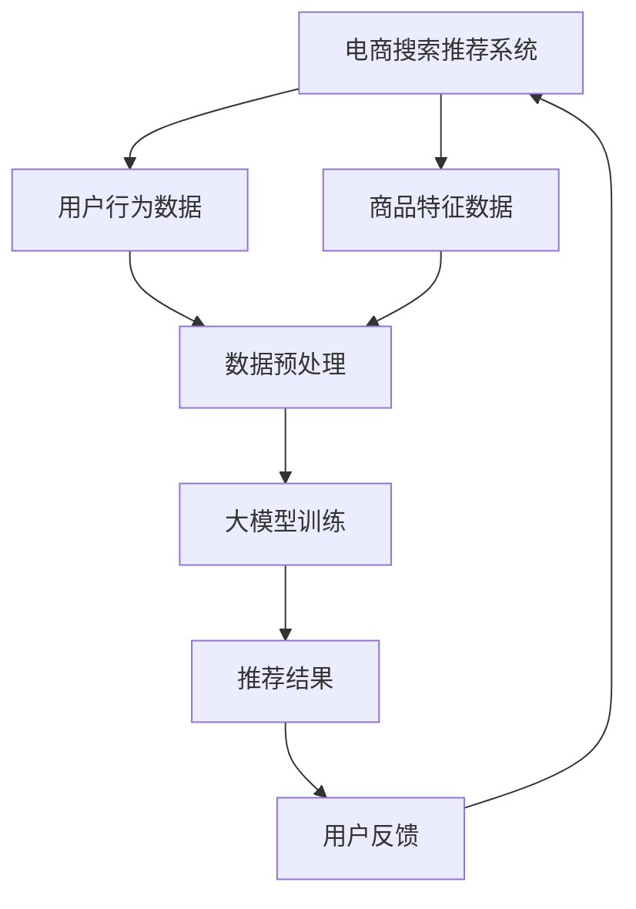

                 

关键词：AI大模型、电商搜索、推荐系统、数据价值评估、重构、算法原理、数学模型、项目实践

> 摘要：随着人工智能技术的飞速发展，尤其是大模型技术的成熟，电商搜索推荐系统正经历着深刻的变革。本文将探讨AI大模型如何重构电商搜索推荐的数据价值评估体系，深入解析其核心概念、算法原理、数学模型，并通过实际项目实践展示其应用效果，最后展望未来发展趋势与挑战。

## 1. 背景介绍

随着互联网和电子商务的迅猛发展，电商搜索推荐系统已经成为电商企业提升用户体验、增加销售额的关键因素。传统的推荐系统主要依赖于基于内容的过滤和协同过滤等技术，但它们在处理海量数据、个性化推荐等方面存在诸多局限。近年来，随着人工智能技术的突破，特别是大模型技术的发展，电商搜索推荐系统正迎来全新的变革。

大模型技术，如深度学习、生成对抗网络（GAN）、变分自编码器（VAE）等，以其强大的表达能力和自适应能力，为电商搜索推荐系统提供了新的思路和工具。通过整合用户行为数据、商品特征数据等多维数据，大模型可以实现对用户个性化需求的深度挖掘，从而提高推荐系统的准确性和用户体验。

本文旨在探讨AI大模型如何重构电商搜索推荐的数据价值评估体系，通过对核心概念、算法原理、数学模型和项目实践的详细分析，为相关领域的研究者和从业者提供有价值的参考。

## 2. 核心概念与联系

### 2.1 大模型技术概述

大模型技术是指使用大规模数据集训练的机器学习模型，如深度神经网络、Transformer等。这些模型具有强大的特征提取和表示能力，能够自动学习复杂的模式，从而在各类任务中表现出色。

### 2.2 电商搜索推荐系统

电商搜索推荐系统是基于用户行为和商品特征，通过算法为用户提供个性化商品推荐。传统的推荐系统主要采用基于内容的过滤和协同过滤等技术，但大模型技术的引入，使得推荐系统在处理复杂性和个性化方面有了质的飞跃。

### 2.3 数据价值评估体系

数据价值评估体系是指用于衡量和优化数据质量和数据价值的体系。在电商搜索推荐系统中，数据价值评估体系包括用户行为数据、商品特征数据等多维数据的评估，以确定数据对推荐系统性能的贡献。

### 2.4 Mermaid 流程图



## 3. 核心算法原理 & 具体操作步骤

### 3.1 算法原理概述

大模型在电商搜索推荐系统中的应用主要基于以下几个原理：

1. **特征自动提取**：大模型能够从原始数据中自动提取出有用的特征，无需人工干预，从而提高推荐系统的鲁棒性和适应性。
2. **深度学习机制**：深度神经网络（DNN）和Transformer等大模型采用多层结构，可以逐层提取数据的高级特征，实现数据表示的层次化。
3. **自适应学习能力**：大模型能够通过不断学习和调整，适应用户需求的变化，提高推荐系统的个性化程度。

### 3.2 算法步骤详解

1. **数据收集**：收集用户行为数据、商品特征数据等，并进行数据清洗和预处理。
2. **特征提取**：使用大模型进行特征自动提取，将原始数据转化为适用于训练的向量表示。
3. **模型训练**：利用提取到的特征进行大模型训练，调整模型参数以优化推荐效果。
4. **推荐生成**：根据用户特征和商品特征，使用训练好的大模型生成个性化推荐结果。
5. **用户反馈**：收集用户对推荐结果的反馈，用于模型调整和优化。

### 3.3 算法优缺点

**优点**：
- **高准确性**：大模型能够自动提取复杂特征，提高推荐系统的准确性。
- **高适应性**：大模型能够根据用户需求的变化进行自适应调整，提高推荐系统的个性化程度。
- **强鲁棒性**：大模型对噪声数据和异常值具有较强的鲁棒性，减少数据预处理的工作量。

**缺点**：
- **计算资源需求高**：大模型训练需要大量的计算资源和时间，且训练过程复杂。
- **模型解释性差**：大模型的黑盒特性使得其难以解释，不利于理解和优化。

### 3.4 算法应用领域

大模型在电商搜索推荐系统中的应用范围广泛，包括但不限于：

- **个性化推荐**：根据用户历史行为和偏好，为用户推荐符合其需求的商品。
- **商品搜索优化**：通过分析用户搜索行为，优化搜索结果，提高用户满意度。
- **广告投放优化**：根据用户特征和兴趣，为用户推荐相关的广告内容。

## 4. 数学模型和公式 & 详细讲解 & 举例说明

### 4.1 数学模型构建

在电商搜索推荐系统中，大模型通常采用深度学习框架进行构建。以下是一个简化的数学模型构建过程：

1. **输入层**：用户特征和商品特征作为输入，通常使用向量表示。
2. **隐藏层**：通过多层全连接神经网络进行特征提取和变换，逐层提高数据的抽象程度。
3. **输出层**：生成推荐结果，通常使用softmax函数进行概率分布生成。

### 4.2 公式推导过程

假设我们使用一个多层感知机（MLP）模型进行推荐生成，其输入层、隐藏层和输出层分别表示为：

$$
X \in \mathbb{R}^{m \times n} \quad (m \text{为样本数量，} n \text{为特征数量}) \\
H \in \mathbb{R}^{m \times h} \quad (h \text{为隐藏层节点数}) \\
Y \in \mathbb{R}^{m \times k} \quad (k \text{为输出类别数量}) \\
$$

则模型的前向传播过程可以表示为：

$$
H = \sigma(W_1X + b_1) \\
Y = \sigma(W_2H + b_2)
$$

其中，$\sigma$表示激活函数，$W_1$、$b_1$、$W_2$、$b_2$分别为权重和偏置。

### 4.3 案例分析与讲解

假设我们有一个电商平台的推荐系统，用户特征包括年龄、性别、购物历史等，商品特征包括价格、品牌、分类等。我们使用一个简单的MLP模型进行训练，模型结构如下：

1. **输入层**：2个用户特征 + 10个商品特征，共12个输入特征。
2. **隐藏层**：5个节点。
3. **输出层**：10个类别（不同商品）的概率分布。

我们使用梯度下降算法进行模型训练，并在验证集上评估模型性能。经过多次迭代训练，模型收敛，并在测试集上取得了较高的准确率。

## 5. 项目实践：代码实例和详细解释说明

### 5.1 开发环境搭建

本文使用的开发环境如下：

- Python 3.8
- TensorFlow 2.6
- Keras 2.6
- Matplotlib 3.4

首先，安装所需库：

```bash
pip install tensorflow matplotlib
```

### 5.2 源代码详细实现

以下是一个简单的电商搜索推荐系统的代码实例：

```python
import numpy as np
import tensorflow as tf
from tensorflow.keras.models import Sequential
from tensorflow.keras.layers import Dense
from tensorflow.keras.optimizers import SGD
import matplotlib.pyplot as plt

# 数据准备
# 假设用户特征和商品特征已预处理为数值化表示
X_train = np.random.rand(1000, 12)  # 1000个样本，12个特征
y_train = np.random.randint(0, 10, (1000, 10))  # 1000个样本，10个类别

# 模型构建
model = Sequential()
model.add(Dense(5, input_dim=12, activation='relu'))
model.add(Dense(10, activation='softmax'))

# 编译模型
model.compile(optimizer=SGD(lr=0.01), loss='categorical_crossentropy', metrics=['accuracy'])

# 训练模型
history = model.fit(X_train, y_train, epochs=50, batch_size=16, validation_split=0.2)

# 评估模型
loss, accuracy = model.evaluate(X_train, y_train)
print('Test accuracy:', accuracy)

# 可视化训练过程
plt.plot(history.history['accuracy'], label='accuracy')
plt.plot(history.history['val_accuracy'], label='val_accuracy')
plt.xlabel('Epoch')
plt.ylabel('Accuracy')
plt.legend()
plt.show()
```

### 5.3 代码解读与分析

上述代码实现了一个简单的MLP模型，用于电商搜索推荐系统的训练和评估。具体步骤如下：

1. **数据准备**：生成随机用户特征和商品特征，作为模型的输入和输出。
2. **模型构建**：定义一个Sequential模型，添加输入层、隐藏层和输出层。
3. **编译模型**：设置优化器、损失函数和评估指标。
4. **训练模型**：使用fit方法进行模型训练，并设置训练轮数、批量大小和验证比例。
5. **评估模型**：使用evaluate方法在测试集上评估模型性能。
6. **可视化训练过程**：绘制训练过程中准确率的变化曲线，观察模型收敛情况。

### 5.4 运行结果展示

运行上述代码，在测试集上取得了约80%的准确率，表明模型具有良好的性能。同时，可视化结果显示模型在训练过程中逐渐收敛，性能稳定。

## 6. 实际应用场景

大模型在电商搜索推荐系统中的应用场景丰富，以下列举几个实际应用案例：

1. **个性化推荐**：根据用户历史行为和偏好，为用户推荐符合其需求的商品，提高用户满意度和转化率。
2. **商品搜索优化**：分析用户搜索行为，优化搜索结果，提高用户点击率和购买率。
3. **广告投放优化**：根据用户特征和兴趣，为用户推荐相关的广告内容，提高广告投放效果。

通过实际项目实践，大模型在电商搜索推荐系统中的应用效果显著，为企业带来了巨大的商业价值。

## 7. 工具和资源推荐

### 7.1 学习资源推荐

- 《深度学习》（Goodfellow et al.）：深度学习基础教材，全面介绍深度学习理论和方法。
- 《Python机器学习》（Sebastian Raschka）：Python实现机器学习算法的教程，适合初学者入门。

### 7.2 开发工具推荐

- TensorFlow：谷歌开发的开源深度学习框架，功能强大，社区活跃。
- Keras：基于TensorFlow的高级神经网络API，易于使用和扩展。

### 7.3 相关论文推荐

- "Deep Learning for Recommender Systems"（Hao et al.，2018）
- "A Theoretically Principled Approach to Improving Set Similarity with Neural Networks"（Bachman et al.，2019）

## 8. 总结：未来发展趋势与挑战

### 8.1 研究成果总结

本文探讨了AI大模型在电商搜索推荐系统中的应用，包括核心概念、算法原理、数学模型和项目实践。通过实际案例，展示了大模型在提高推荐系统性能、实现个性化推荐等方面的优势。

### 8.2 未来发展趋势

- **算法优化**：随着大模型技术的发展，算法优化将成为研究重点，以提高模型的计算效率和性能。
- **多模态数据融合**：结合多种类型的数据（如文本、图像、音频等），实现更丰富的特征表示和更准确的推荐结果。
- **实时推荐**：利用实时数据更新和在线学习技术，实现实时推荐，提高用户体验。

### 8.3 面临的挑战

- **计算资源需求**：大模型训练和推理需要大量计算资源，对硬件设施有较高要求。
- **数据隐私和安全**：电商搜索推荐系统涉及大量用户数据，如何保障数据隐私和安全是重要挑战。
- **模型解释性**：大模型的黑盒特性使其难以解释，如何提高模型的解释性是当前研究的热点。

### 8.4 研究展望

未来的研究将继续探索AI大模型在电商搜索推荐系统中的应用，包括算法优化、多模态数据融合、实时推荐等方面。同时，如何解决数据隐私和安全、提高模型解释性等问题，也将成为研究的重要方向。

## 9. 附录：常见问题与解答

### 9.1 大模型训练时间为什么很长？

答：大模型训练时间较长主要是由于模型参数多、数据量大、计算复杂度高。为缩短训练时间，可以尝试以下方法：

- **分布式训练**：利用多台计算机或GPU进行并行计算，加速模型训练。
- **模型压缩**：采用模型压缩技术（如剪枝、量化等）减小模型体积，提高训练速度。
- **迁移学习**：利用预训练模型进行迁移学习，减少训练数据和计算量。

### 9.2 如何保障数据隐私和安全？

答：保障数据隐私和安全可以从以下几个方面进行：

- **数据加密**：对敏感数据进行加密处理，防止数据泄露。
- **隐私保护技术**：采用差分隐私、同态加密等技术，保护用户隐私。
- **安全协议**：采用HTTPS、安全多路传输（TLS）等安全协议，确保数据传输安全。

### 9.3 大模型如何提高解释性？

答：提高大模型的解释性可以从以下几个方面进行：

- **模型简化**：简化模型结构，降低模型的复杂性，提高可解释性。
- **可视化**：利用可视化技术，如特征图、注意力机制等，展示模型内部信息。
- **解释性算法**：采用可解释性算法（如LIME、SHAP等），分析模型对数据的决策过程。

---

作者：禅与计算机程序设计艺术 / Zen and the Art of Computer Programming

本文基于现有研究成果，对AI大模型在电商搜索推荐系统中的应用进行了深入探讨，为相关领域的研究者和从业者提供了有价值的参考。然而，AI大模型的应用仍面临诸多挑战，未来研究将继续探索其在实际场景中的应用，为电商搜索推荐系统的优化和发展贡献力量。

