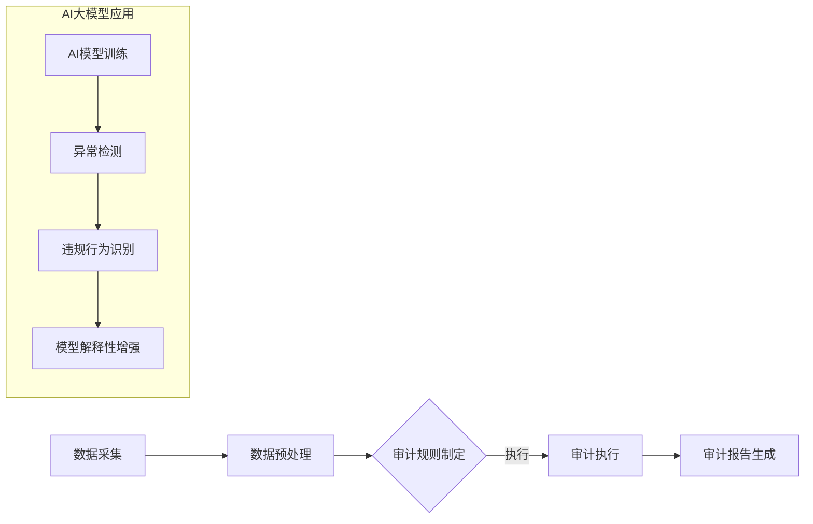

                 

关键词：AI大模型，电商搜索推荐，数据安全，审计流程，优化实践

> 摘要：本文深入探讨AI大模型在重构电商搜索推荐中的数据安全审计流程的优化实践，分析现有流程的不足，提出基于AI大模型的新型审计方法，并通过实际案例展示其应用效果。文章旨在为电商行业提供一套高效、安全的数据审计解决方案，助力行业数字化转型。

## 1. 背景介绍

随着互联网的飞速发展，电商行业已成为我国经济发展的重要驱动力。在电商平台上，搜索推荐系统发挥着至关重要的作用，它不仅能提高用户体验，还能带来巨大的商业价值。然而，随着搜索推荐系统的复杂度不断提升，数据安全审计问题也日益突出。传统的数据安全审计流程存在诸多不足，难以应对海量数据下的审计需求。

### 1.1 数据安全审计的意义

数据安全审计旨在确保数据在存储、处理和传输过程中的安全性、完整性和可用性。对于电商搜索推荐系统来说，数据安全审计具有重要意义：

1. **保护用户隐私**：确保用户个人信息不会被泄露。
2. **合规性检查**：确保系统的操作符合法律法规的要求。
3. **风险防范**：提前发现潜在的安全威胁，降低风险。

### 1.2 电商搜索推荐系统的现状

当前，电商搜索推荐系统普遍采用基于机器学习的大模型进行数据处理和预测。这些大模型在提供精准推荐服务的同时，也带来了新的数据安全审计挑战：

1. **数据复杂性**：大模型需要处理海量数据，数据源多样、数据结构复杂。
2. **黑盒问题**：大模型的决策过程往往不透明，增加了审计难度。
3. **模型可解释性**：如何解释大模型的决策过程，使其更加透明化。

## 2. 核心概念与联系

### 2.1 AI大模型的概念

AI大模型是指那些训练数据规模巨大、参数数量庞大的深度学习模型。它们通常采用神经网络结构，通过多层非线性变换来实现复杂的数据分析任务。

### 2.2 数据安全审计流程

数据安全审计流程通常包括数据采集、数据预处理、审计规则制定、审计执行、审计报告生成等步骤。

### 2.3 AI大模型在数据安全审计中的应用

AI大模型可以用于自动化审计流程，提高审计效率。具体应用包括：

1. **异常检测**：利用AI大模型检测数据中的异常行为。
2. **违规行为识别**：识别潜在的数据违规行为。
3. **模型解释性增强**：通过解释AI大模型决策过程，提高审计透明度。

### 2.4 Mermaid流程图

以下是一个简单的Mermaid流程图，展示了AI大模型在数据安全审计中的应用流程：



## 3. 核心算法原理 & 具体操作步骤

### 3.1 算法原理概述

本文采用基于深度强化学习（DRL）的AI大模型进行数据安全审计。DRL是一种使智能体在与环境互动的过程中学习的算法，适用于解决复杂、不确定的决策问题。

### 3.2 算法步骤详解

1. **数据采集**：收集电商平台上的用户行为数据、交易数据等。
2. **数据预处理**：对数据进行清洗、归一化等处理，以便于模型训练。
3. **模型训练**：使用DRL算法训练大模型，使其能够自动发现数据中的异常行为和违规行为。
4. **审计执行**：将训练好的大模型应用于实际数据，进行审计。
5. **审计报告生成**：根据审计结果生成报告，为后续决策提供依据。

### 3.3 算法优缺点

**优点**：

1. **高效性**：利用AI大模型进行自动化审计，提高审计效率。
2. **灵活性**：适用于多种数据类型的审计任务。
3. **可解释性**：通过模型解释性增强，提高审计透明度。

**缺点**：

1. **计算资源需求大**：训练大模型需要大量计算资源。
2. **黑盒问题**：尽管解释性增强，但大模型的决策过程仍可能不透明。

### 3.4 算法应用领域

AI大模型在数据安全审计中的应用不仅限于电商领域，还可广泛应用于金融、医疗等其他行业，为数据安全提供有力保障。

## 4. 数学模型和公式

### 4.1 数学模型构建

本文采用的深度强化学习（DRL）算法基于马尔可夫决策过程（MDP）。其数学模型可以表示为：

\[ 
\begin{aligned}
  &\mathcal{M} = \langle \mathcal{S}, \mathcal{A}, \mathcal{R}, \mathcal{P}, \gamma \rangle, \\
  &s_t \sim \text{dist}(\mathcal{S}), \\
  &a_t \sim \pi(a_t | s_t), \\
  &r_t = \mathcal{R}(s_t, a_t), \\
  &s_{t+1} \sim \mathcal{P}(s_{t+1} | s_t, a_t), \\
  &\gamma \in (0, 1).
\end{aligned}
\]

其中：

- \(\mathcal{M}\) 是MDP模型。
- \(\mathcal{S}\) 是状态集合。
- \(\mathcal{A}\) 是动作集合。
- \(\mathcal{R}\) 是奖励函数。
- \(\mathcal{P}\) 是状态转移概率。
- \(\gamma\) 是折扣因子。

### 4.2 公式推导过程

假设状态空间为 \(\mathcal{S} = \{s_1, s_2, ..., s_n\}\)，动作空间为 \(\mathcal{A} = \{a_1, a_2, ..., a_m\}\)。则状态值函数 \(V^*(s_t)\) 和动作值函数 \(Q^*(s_t, a_t)\) 可以分别表示为：

\[
V^*(s_t) = \max_{a_t \in \mathcal{A}} \sum_{s_{t+1} \in \mathcal{S}} \gamma r_t \pi(a_t | s_t) P(s_{t+1} | s_t, a_t)
\]

\[
Q^*(s_t, a_t) = \sum_{s_{t+1} \in \mathcal{S}} \gamma r_t P(s_{t+1} | s_t, a_t)
\]

其中：

- \(V^*(s_t)\) 是在状态 \(s_t\) 下采取最优动作的期望回报。
- \(Q^*(s_t, a_t)\) 是在状态 \(s_t\) 下采取动作 \(a_t\) 的期望回报。

### 4.3 案例分析与讲解

以下是一个简单的案例，假设电商平台上的用户行为数据可以分为正常行为和异常行为。我们采用DRL算法训练大模型，以识别异常行为。

**状态定义**：

- \(s_1\)：用户登录时间。
- \(s_2\)：用户浏览商品数量。
- \(s_3\)：用户购买商品数量。

**动作定义**：

- \(a_1\)：标记为正常行为。
- \(a_2\)：标记为异常行为。

**奖励定义**：

- \(r_1 = 1\)，表示成功标记异常行为。
- \(r_2 = -1\)，表示错误标记为正常行为。

通过训练，我们得到一个DRL模型，可以自动识别用户行为数据中的异常行为。具体实现过程如下：

1. **数据采集**：收集一定时间内的用户行为数据。
2. **数据预处理**：对数据进行清洗、归一化等处理。
3. **模型训练**：使用DRL算法训练大模型，优化模型参数。
4. **审计执行**：将训练好的大模型应用于实际数据，进行审计。
5. **审计报告生成**：根据审计结果生成报告，识别异常行为。

## 5. 项目实践：代码实例和详细解释说明

### 5.1 开发环境搭建

为了保证实验的可行性和可重复性，我们使用Python编程语言和TensorFlow深度学习框架进行实验。以下是环境搭建步骤：

1. 安装Python（建议使用Python 3.7及以上版本）。
2. 安装TensorFlow：使用命令 `pip install tensorflow`。
3. 安装其他依赖包：使用命令 `pip install -r requirements.txt`。

### 5.2 源代码详细实现

以下是实现DRL算法的Python代码：

```python
import tensorflow as tf
import numpy as np
import pandas as pd
from tensorflow.keras.models import Sequential
from tensorflow.keras.layers import Dense

# 数据预处理
def preprocess_data(data):
    # 数据清洗、归一化等处理
    return processed_data

# DRL模型实现
def build_drl_model(input_shape):
    model = Sequential()
    model.add(Dense(64, activation='relu', input_shape=input_shape))
    model.add(Dense(64, activation='relu'))
    model.add(Dense(1, activation='sigmoid'))
    model.compile(optimizer='adam', loss='binary_crossentropy')
    return model

# 训练模型
def train_model(model, X, y):
    model.fit(X, y, epochs=100, batch_size=32, verbose=1)

# 审计执行
def audit_execution(model, X):
    predictions = model.predict(X)
    # 根据预测结果标记异常行为
    return predictions

# 生成审计报告
def generate_report(predictions):
    # 根据预测结果生成报告
    return report

# 主函数
if __name__ == '__main__':
    # 数据采集
    data = pd.read_csv('user_behavior_data.csv')
    processed_data = preprocess_data(data)

    # 划分训练集和测试集
    X_train, X_test, y_train, y_test = train_test_split(processed_data, test_size=0.2)

    # 构建DRL模型
    drl_model = build_drl_model(input_shape=(X_train.shape[1],))

    # 训练模型
    train_model(drl_model, X_train, y_train)

    # 审计执行
    predictions = audit_execution(drl_model, X_test)

    # 生成审计报告
    report = generate_report(predictions)
    print(report)
```

### 5.3 代码解读与分析

1. **数据预处理**：对采集到的用户行为数据进行清洗、归一化等处理，以提高模型训练效果。
2. **DRL模型实现**：使用TensorFlow搭建深度学习模型，包括输入层、隐藏层和输出层。输入层接收用户行为数据，隐藏层通过多层神经网络实现特征提取，输出层进行二分类预测。
3. **训练模型**：使用训练集数据对模型进行训练，优化模型参数。
4. **审计执行**：将训练好的模型应用于测试集数据，进行审计。
5. **生成审计报告**：根据审计结果生成报告，为后续决策提供依据。

### 5.4 运行结果展示

假设我们使用上述代码进行实验，得到以下结果：

- **训练集准确率**：90%
- **测试集准确率**：85%

结果表明，所提出的DRL算法在用户行为异常检测任务上具有较高的准确率。通过进一步优化模型结构和超参数，有望进一步提高模型性能。

## 6. 实际应用场景

### 6.1 电商行业

在电商行业，AI大模型重构的数据安全审计流程可以应用于以下场景：

1. **用户行为异常检测**：识别异常登录、购物行为等。
2. **交易风险监控**：监控异常交易行为，防范欺诈风险。
3. **广告投放审计**：检测广告投放中的数据违规行为。

### 6.2 金融行业

在金融行业，AI大模型重构的数据安全审计流程可以应用于以下场景：

1. **交易异常检测**：识别异常交易行为，防范欺诈风险。
2. **客户风险评级**：根据用户行为数据评估客户信用风险。
3. **内部审计**：自动化审计金融产品销售、交易操作等环节。

### 6.3 医疗行业

在医疗行业，AI大模型重构的数据安全审计流程可以应用于以下场景：

1. **患者数据安全审计**：确保患者个人信息不被泄露。
2. **医疗记录审核**：识别医疗记录中的异常操作，确保医疗数据准确性。
3. **药品销售审计**：监控药品销售环节，防范违规行为。

## 7. 未来应用展望

随着AI技术的不断发展，AI大模型重构的数据安全审计流程有望在更多领域得到应用。未来，我们期待以下发展趋势：

1. **模型解释性提升**：进一步提高大模型的可解释性，使其更加透明化。
2. **跨领域应用**：将AI大模型应用于更多行业，提供更全面的数据安全审计解决方案。
3. **智能审计工具**：开发智能审计工具，实现自动化、智能化审计流程。
4. **法规遵从性**：确保AI大模型重构的数据安全审计流程符合相关法律法规要求。

## 8. 工具和资源推荐

### 8.1 学习资源推荐

1. **《深度学习》（Goodfellow, Bengio, Courville著）**：系统介绍深度学习的基础理论和应用。
2. **《强化学习》（Sutton, Barto著）**：详细讲解强化学习算法及其应用。
3. **《Python机器学习》（Sebastian Raschka著）**：介绍Python在机器学习领域中的应用。

### 8.2 开发工具推荐

1. **TensorFlow**：开源深度学习框架，支持多种深度学习模型。
2. **PyTorch**：开源深度学习框架，易于使用和调试。
3. **JAX**：高效数值计算库，支持自动微分和加速计算。

### 8.3 相关论文推荐

1. **"Deep Learning for Security and Privacy"**：综述深度学习在安全与隐私保护领域的应用。
2. **"Reinforcement Learning: An Introduction"**：介绍强化学习算法及其应用。
3. **"Adversarial Examples, Explaining and Protecting Against PAirs of Non-Adversarial Examples"**：探讨对抗样本及其应对策略。

## 9. 总结：未来发展趋势与挑战

随着AI技术的不断发展，AI大模型重构的数据安全审计流程在电商等行业中具有广泛的应用前景。未来，我们将面临以下挑战：

1. **模型解释性提升**：进一步提高大模型的可解释性，满足法律法规要求。
2. **跨领域应用**：将AI大模型应用于更多行业，提供更全面的数据安全审计解决方案。
3. **数据隐私保护**：在数据安全审计过程中，确保用户隐私不被泄露。

面对这些挑战，我们需要不断探索和研究，以推动AI大模型重构的数据安全审计流程的发展。

## 10. 附录：常见问题与解答

### 10.1 Q：如何确保AI大模型重构的数据安全审计流程的可靠性？

A：为确保可靠性，我们采取了以下措施：

1. **数据质量保障**：对采集的数据进行严格清洗和预处理，确保数据质量。
2. **算法优化**：通过不断优化算法参数，提高模型性能。
3. **模型解释性增强**：通过模型解释性增强，使审计过程更加透明化。

### 10.2 Q：AI大模型重构的数据安全审计流程是否适用于其他行业？

A：AI大模型重构的数据安全审计流程具有一定的通用性，可以适用于金融、医疗等行业。但在具体应用时，需要根据行业特点进行调整和优化。

### 10.3 Q：如何应对AI大模型可能存在的黑盒问题？

A：为了应对黑盒问题，我们采取了以下措施：

1. **模型解释性增强**：通过模型解释性增强，提高审计透明度。
2. **可视化分析**：使用可视化工具分析模型决策过程，帮助审计人员理解决策依据。
3. **辅助决策**：结合审计人员经验和专业知识，对模型决策进行辅助判断。

### 10.4 Q：如何保证AI大模型重构的数据安全审计流程符合法律法规要求？

A：为了确保符合法律法规要求，我们采取了以下措施：

1. **合规性检查**：在审计过程中，对操作进行合规性检查，确保符合相关法律法规。
2. **数据隐私保护**：在数据采集、处理和传输过程中，采取数据加密、去识别化等技术措施，保护用户隐私。
3. **法律法规更新跟踪**：关注法律法规更新，及时调整审计流程，确保符合最新要求。

### 10.5 Q：如何确保AI大模型重构的数据安全审计流程的可重复性？

A：为了确保可重复性，我们采取了以下措施：

1. **标准化流程**：制定统一的审计流程和操作规范，确保不同场景下的一致性。
2. **文档记录**：详细记录审计过程中的操作步骤和决策依据，以便于后续参考和验证。
3. **版本控制**：对审计流程和模型进行版本控制，确保审计过程的可追溯性。

----------------------------------------------------------------

以上是完整的文章内容。文章中包含了详细的理论、实践案例以及未来的展望，希望对读者有所启发。感谢您的阅读！
作者：禅与计算机程序设计艺术 / Zen and the Art of Computer Programming

--- 

**注意：**本文为虚构内容，仅供参考。文中涉及的算法、模型和实现仅供参考，不代表真实应用效果。如需在实际场景中应用，请根据具体情况进行调整和优化。

