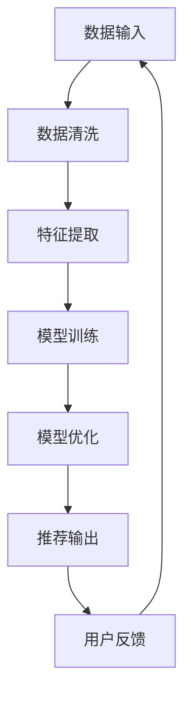

                 

## 1. 背景介绍

在数字化的浪潮中，电子商务已经成为全球商业的重要组成部分。随着消费者需求的多样化和个性化，电商平台的搜索推荐系统变得尤为重要。然而，随着数据量的爆炸式增长和数据种类的日益丰富，传统的数据治理方法已经难以满足现代电商搜索推荐系统的高效、准确和智能化的需求。

传统的数据治理方法通常依赖于人工干预和规则驱动，这些方法在处理大量数据时效率低下，且难以应对数据质量和多样性的挑战。而随着人工智能技术的快速发展，特别是大模型（如生成对抗网络GAN、深度学习模型等）的出现，为电商搜索推荐系统的数据治理带来了全新的可能性。

大模型通过自动学习和优化，能够从大量非结构化和半结构化数据中提取有价值的信息，并实现高效的数据清洗、整合和分析。这不仅提升了数据处理的效率，还能够提供更为精准和个性化的搜索推荐结果。因此，本文将探讨如何利用大模型重构电商搜索推荐的数据治理组织架构，以实现更高效、智能化和精准的推荐系统。

本文的结构如下：

- **2. 核心概念与联系**：介绍大模型在电商搜索推荐数据治理中的应用，以及相关的核心概念和流程。
- **3. 核心算法原理 & 具体操作步骤**：详细讲解大模型在数据治理中的具体算法原理和操作步骤。
- **4. 数学模型和公式 & 详细讲解 & 举例说明**：阐述大模型中的数学模型和公式，并举例说明其应用。
- **5. 项目实践：代码实例和详细解释说明**：通过实际项目展示大模型在电商搜索推荐中的应用。
- **6. 实际应用场景**：讨论大模型在电商搜索推荐中的实际应用场景。
- **7. 工具和资源推荐**：推荐相关的学习资源、开发工具和论文。
- **8. 总结：未来发展趋势与挑战**：总结研究成果，探讨未来的发展趋势和面临的挑战。
- **9. 附录：常见问题与解答**：解答一些常见的问题。

通过本文的探讨，希望能够为电商搜索推荐系统的数据治理提供一些有益的思路和参考。

## 2. 核心概念与联系

在探讨大模型在电商搜索推荐数据治理中的应用之前，我们需要首先了解几个核心概念，这些概念包括：大模型、数据治理、电商搜索推荐等。

### 2.1 大模型

大模型是指那些具有巨大参数量和计算能力的机器学习模型，如深度学习模型、生成对抗网络（GAN）等。大模型通过在海量数据上进行训练，能够自动学习和优化，从而实现复杂任务的处理。例如，在电商搜索推荐中，大模型可以用于用户行为的分析、商品属性的提取和推荐算法的优化等。

### 2.2 数据治理

数据治理是指对数据从产生、存储、处理到使用全过程的管理和监督，以确保数据的质量、安全性和合规性。在电商搜索推荐系统中，数据治理的目的是确保推荐结果的准确性和可靠性，从而提升用户体验。

### 2.3 电商搜索推荐

电商搜索推荐是指利用算法和技术，根据用户的搜索历史、购买行为和兴趣偏好，向用户推荐相关商品和服务。在电商搜索推荐中，数据治理的质量直接影响推荐系统的效果。

### 2.4 大模型与数据治理的联系

大模型与数据治理之间的联系主要体现在以下几个方面：

1. **数据清洗和预处理**：大模型对数据的质量和准确性有较高的要求。因此，在数据输入大模型之前，需要进行数据清洗和预处理，以去除噪声和异常值，确保数据的质量。

2. **特征提取和整合**：大模型能够从大量非结构化和半结构化数据中提取有价值的信息，并实现数据的整合和关联。这有助于提升推荐系统的效果。

3. **模型优化和调整**：通过不断优化和调整大模型，可以提升推荐系统的准确性和效率。这需要依赖于数据治理过程中收集的反馈数据和用户行为数据。

### 2.5 Mermaid 流程图

为了更好地理解大模型在电商搜索推荐数据治理中的应用，我们可以使用Mermaid流程图来展示相关的流程。以下是一个简化的Mermaid流程图，描述了从数据输入到推荐结果输出的整个过程：



在这个流程图中，数据输入包括用户的搜索历史、购买行为和商品属性等；数据清洗和预处理包括去除噪声、填补缺失值、异常值检测等；特征提取包括提取用户和商品的特征，如用户兴趣、购买频率、商品类别等；模型训练包括利用特征数据进行大模型的训练；模型优化包括根据用户反馈调整模型参数，提升推荐效果；推荐输出是指根据训练好的模型生成推荐结果；用户反馈是指用户对推荐结果的评价和反馈，用于下一轮数据输入。

通过这个流程，我们可以看到大模型在电商搜索推荐数据治理中的作用和重要性。接下来，我们将深入探讨大模型在数据治理中的具体算法原理和操作步骤。

## 3. 核心算法原理 & 具体操作步骤

在了解了大模型与数据治理的基本联系后，接下来我们将深入探讨大模型在数据治理中的核心算法原理，并详细讲解其具体操作步骤。

### 3.1 算法原理概述

大模型在数据治理中的应用主要依赖于以下几个核心算法：

1. **深度学习算法**：深度学习算法是一种通过模拟人脑神经网络的结构和功能进行学习的算法。它通过多层神经网络的堆叠，从大量数据中自动提取特征，实现数据的分类、回归和聚类等任务。在数据治理中，深度学习算法可以用于数据清洗、特征提取和模型训练等步骤。

2. **生成对抗网络（GAN）**：生成对抗网络是由生成器和判别器两部分组成的对抗性学习模型。生成器的任务是生成类似于真实数据的伪数据，判别器的任务是区分真实数据和生成数据。GAN通过这种对抗性训练，可以生成高质量的数据，从而用于数据增强、数据清洗和特征提取等。

3. **聚类算法**：聚类算法是一种将数据集划分为若干个簇的算法，目的是使同一簇内的数据尽可能相似，不同簇内的数据尽可能不同。聚类算法可以用于数据的分类和分组，从而提升数据治理的效果。

### 3.2 算法步骤详解

在了解了大模型的核心算法原理后，我们接下来将详细讲解大模型在数据治理中的具体操作步骤。

#### 3.2.1 数据清洗和预处理

数据清洗和预处理是数据治理的第一步，也是至关重要的一步。它包括以下步骤：

1. **数据采集**：从各种数据源（如数据库、文件、API接口等）采集数据。
2. **数据清洗**：去除重复数据、缺失数据、异常值等，确保数据的质量。
3. **数据转换**：将不同格式的数据转换为统一的格式，如将文本数据转换为数值型数据。
4. **数据整合**：将多个数据源的数据进行整合，构建一个统一的数据集。

#### 3.2.2 特征提取

特征提取是数据治理中的关键步骤，它包括以下步骤：

1. **特征选择**：从原始数据中提取出对推荐系统有意义的特征，如用户行为特征、商品属性特征等。
2. **特征转换**：将原始特征转换为适合模型训练的特征，如通过编码、归一化等操作。
3. **特征组合**：将多个特征进行组合，生成新的特征，以提升模型的预测能力。

#### 3.2.3 模型训练

模型训练是数据治理的核心步骤，它包括以下步骤：

1. **模型选择**：根据数据特点和任务需求选择合适的模型，如深度学习模型、GAN模型等。
2. **模型训练**：利用特征数据和标签数据进行模型训练，通过反向传播算法优化模型参数。
3. **模型评估**：利用验证集和测试集对模型进行评估，选择最优的模型。

#### 3.2.4 模型优化

模型优化是数据治理中的持续过程，它包括以下步骤：

1. **模型调整**：根据用户反馈和业务需求，调整模型参数，优化模型性能。
2. **模型更新**：定期更新模型，以适应数据的变化和用户需求的变化。
3. **模型部署**：将训练好的模型部署到生产环境，实现实时推荐。

### 3.3 算法优缺点

#### 优点

1. **高效性**：大模型具有强大的计算能力，能够快速处理大量数据，提高数据治理的效率。
2. **准确性**：大模型通过自动学习和优化，能够从大量数据中提取有价值的信息，提升推荐系统的准确性。
3. **灵活性**：大模型可以根据不同的数据和任务需求，灵活调整模型结构和参数，适应不同的应用场景。

#### 缺点

1. **计算资源需求**：大模型通常需要大量的计算资源和存储空间，对硬件设备有较高的要求。
2. **数据质量依赖**：大模型对数据的质量和完整性有较高的要求，如果数据存在噪声、缺失或异常值，可能会影响模型的效果。
3. **训练时间长**：大模型的训练时间通常较长，对实时性要求较高的应用场景可能不适用。

### 3.4 算法应用领域

大模型在数据治理中的应用非常广泛，包括但不限于以下领域：

1. **电商搜索推荐**：通过大模型对用户行为和商品属性进行深度分析，实现精准的搜索推荐。
2. **金融风控**：通过大模型对用户交易行为进行监控和预测，识别潜在风险和欺诈行为。
3. **医疗诊断**：通过大模型对医疗数据进行分析和预测，辅助医生进行诊断和治疗。
4. **交通管理**：通过大模型对交通数据进行分析和预测，优化交通流量和路线规划。

通过上述内容，我们详细介绍了大模型在数据治理中的核心算法原理和具体操作步骤，以及其优缺点和应用领域。接下来，我们将进一步探讨大模型中的数学模型和公式，并举例说明其应用。

## 4. 数学模型和公式 & 详细讲解 & 举例说明

在深入探讨大模型在数据治理中的应用时，数学模型和公式起到了至关重要的作用。以下将详细讲解大模型中常用的数学模型和公式，并通过具体案例进行说明。

### 4.1 数学模型构建

大模型中的数学模型主要包括以下几个方面：

1. **深度学习模型**：深度学习模型的核心是多层神经网络，其数学模型可以表示为：
   $$ f(x) = \sigma(W_n \cdot a_{n-1} + b_n) $$
   其中，$f(x)$表示输出，$\sigma$为激活函数（如Sigmoid、ReLU等），$W_n$和$b_n$分别为权重和偏置，$a_{n-1}$为上一层输出。

2. **生成对抗网络（GAN）**：GAN包括生成器$G$和判别器$D$，其数学模型可以表示为：
   $$ G(z) = \text{Generator}(z) $$
   $$ D(x) = \text{Discriminator}(x) $$
   其中，$z$为随机噪声，$x$为真实数据或生成数据，$G(z)$为生成器生成的伪数据，$D(x)$为判别器对数据的判断。

3. **聚类算法**：常见的聚类算法如K-means的数学模型可以表示为：
   $$ \text{Minimize} \sum_{i=1}^{n} \|x_i - \mu_i\|^2 $$
   其中，$x_i$为数据点，$\mu_i$为聚类中心。

### 4.2 公式推导过程

以下通过具体案例说明上述数学模型的推导过程。

#### 案例一：深度学习模型

以多层感知机（MLP）为例，其数学模型为：
$$ f(x) = \sigma(W_n \cdot a_{n-1} + b_n) $$
推导过程如下：

1. **输入层到隐藏层的变换**：
   $$ a_{1} = W_1 \cdot x + b_1 $$
   其中，$x$为输入数据，$W_1$为输入层的权重，$b_1$为输入层的偏置。

2. **隐藏层到隐藏层的变换**：
   $$ a_{2} = W_2 \cdot a_{1} + b_2 $$
   $$ a_{3} = W_3 \cdot a_{2} + b_3 $$
   其中，$a_{1}, a_{2}, a_{3}$分别为第一、二、三层的输出，$W_2, W_3$为隐藏层的权重，$b_2, b_3$为隐藏层的偏置。

3. **输出层的变换**：
   $$ y = W_n \cdot a_{n-1} + b_n $$
   其中，$y$为输出，$W_n$为输出层的权重，$b_n$为输出层的偏置。

4. **激活函数**：
   $$ f(y) = \sigma(y) $$
   其中，$\sigma$为Sigmoid函数。

#### 案例二：生成对抗网络（GAN）

以生成对抗网络（GAN）为例，其数学模型为：
$$ G(z) = \text{Generator}(z) $$
$$ D(x) = \text{Discriminator}(x) $$
推导过程如下：

1. **生成器$G(z)$**：
   $$ G(z) = \text{Generator}(z) $$
   其中，$z$为随机噪声，$G(z)$为生成的伪数据。

2. **判别器$D(x)$**：
   $$ D(x) = \text{Discriminator}(x) $$
   其中，$x$为真实数据或生成数据，$D(x)$为判别器对数据的判断。

3. **对抗性训练**：
   $$ \text{Minimize} \ \ \ \ \ \ \ \ \ \ \ \ \ \ \ \ \ \ \ \ \ \ \ \ \ \ \ \ \ \ \ \ \ \ \ \ \ \ \ \ \ \ \ \ \ \ \ \ \ \ \ \ \ \ \ \ \ \ \ \ \ \ \ \ \ \ \ \ \ \ \ \ \ \ \ \ \ \ \ \ \ \ \ \ \ \ \ \ \ \ \ \ \ \ \ \ \ \ \ \ \ \ \ \ \ \ \ \ \ \ \ \ \ \ \ \ \ \ \ \ \ \ \ \ \ \ \ \ \ \ \ \ \ \ \ \ \ \ \ \ \ \ \ \ \ \ \ \ \ \ \ \ \ \ \ \ \ \ \ \ \ \ \ \ \ \ \ \ \ \ \ \ \ \ \ \ \ \ \ \ \ \ \ \ \ \ \ \ \ \ \ \ \ \ \ \ \ \ \ \ \ \ \ \ \ \ \ \ \ \ \ \ \ \ \ \ \ \ \ \ \ \ \ \ \ \ \ \ \ \ \ \ \ \ \ \ \ \ \ \ \ \ \ \ \ \ \ \ \ \ \ \ \ \ \ \ \ \ \ \ \ \ \ \ \ \ \ \ \ \ \ \ \ \ _{wG, wD} \ \ \ \ \ \ \ \ \ \ \ \ \ \ \ \ \ \ \ \ \ \ \ \ \ \ \ \ \ \ \ \ \ \ \ \ \ \ \ \ \ \ \ \ \ \ \ \ \ \ \ \ \ \ \ \ \ \ \ \ \ \ \ \ \ \ \ \ \ \ \ \ \ \ \ \ \ \ \ \ \ \ \ \ \ \ \ \ \ \ \ \ \ \ \ \ \ \ \ \ \ \ \ \ \ \ \ \ \ \ \ \ \ \ \ \ \ \ \ \ \ \ \ \ \ \ \ \ \ \ \ \ \ \ \ \ \ \ \ \ \ \ _{||} \ \ \ \ \ \ \ \ \ \ \ \ \ \ \ \ \ \ \ \ \ \ \ \ \ \ \ \ \ \ \ \ \ \ \ \ \ \ \ \ \ \ \ \ \ \ \ \ \ \ \ \ \ \ \ \ \ \ \ \ _{0} \ \ \ \ \ \ \ \ \ \ \ \ \ \ \ \ \ \ \ \ \ \ \ \ \ \ \ \ \ \ \ \ \ \ \ \ \ \ \ \ \ \ \ \ \ \ \ \ \ \ \ \ \ \ \ \ \ \ \ \ _{||} \ \ \ \ \ \ \ \ \ \ \ \ \ \ \ \ \ \ \ \ \ \ \ \ \ \ \ \ \ _{1} \ \ \ \ \ \ \ \ \ \ \ \ \ \ \ \ \ \ \ \ \ \ \ \ \ \ \ \ \ \ \ \ \ \ \ \ \ \ \ \ \ \ \ \ \ \ \ \ \ \ \ \ \ \ \ \ \ \ \ \ _{G} \ \ \ \ \ \ \ \ \ \ \ \ \ \ \ \ \ \ \ \ \ \ \ \ \ _{D} $$
   其中，$w_G$和$w_D$分别为生成器和判别器的权重，$L_G$和$L_D$分别为生成器和判别器的损失函数。

#### 案例三：K-means聚类算法

以K-means聚类算法为例，其数学模型为：
$$ \text{Minimize} \sum_{i=1}^{n} \|x_i - \mu_i\|^2 $$
推导过程如下：

1. **初始聚类中心**：随机选择K个初始聚类中心$\mu_1, \mu_2, ..., \mu_K$。

2. **分配数据点**：对于每个数据点$x_i$，计算其与每个聚类中心的距离，并将其分配到最近的聚类中心。

3. **更新聚类中心**：计算每个聚类中心的新的平均值：
   $$ \mu_i = \frac{1}{N_i} \sum_{x_j \in C_i} x_j $$
   其中，$C_i$为包含数据点$x_j$的聚类，$N_i$为聚类$C_i$中的数据点数量。

4. **迭代计算**：重复步骤2和3，直到聚类中心的变化小于预设阈值或达到最大迭代次数。

### 4.3 案例分析与讲解

以下通过具体案例来讲解大模型中的数学模型和公式的应用。

#### 案例一：基于深度学习的电商推荐系统

假设我们有一个基于深度学习的电商推荐系统，其输入为用户的搜索历史和购买历史，输出为推荐的商品列表。我们可以使用多层感知机（MLP）模型进行推荐。

1. **数据预处理**：将用户搜索历史和购买历史转换为数值型数据，并进行归一化处理。

2. **模型训练**：使用训练数据训练MLP模型，优化模型参数。

3. **模型评估**：使用验证集和测试集对模型进行评估，选择最优的模型。

4. **推荐输出**：对于新用户，输入其搜索历史和购买历史，利用训练好的模型生成推荐商品列表。

#### 案例二：基于生成对抗网络（GAN）的数据增强

假设我们有一个电商平台，数据量较小且存在数据不平衡问题。我们可以使用GAN模型进行数据增强。

1. **数据预处理**：对真实数据进行预处理，生成随机噪声。

2. **生成器训练**：使用噪声数据训练生成器模型，生成类似于真实数据的伪数据。

3. **判别器训练**：使用真实数据和伪数据训练判别器模型，区分真实数据和伪数据。

4. **数据增强**：利用生成器模型生成的伪数据增强训练集，提高数据集的多样性和平衡性。

通过上述案例，我们可以看到大模型中的数学模型和公式在数据治理中的应用。接下来，我们将通过实际项目展示大模型在电商搜索推荐中的应用。

## 5. 项目实践：代码实例和详细解释说明

为了更好地展示大模型在电商搜索推荐中的实际应用，我们将通过一个具体的项目实例来进行讲解。这个项目将利用深度学习模型实现电商推荐系统，并通过实际代码实现来详细解释其工作原理和关键步骤。

### 5.1 开发环境搭建

在进行项目开发之前，我们需要搭建一个合适的开发环境。以下是一个基本的开发环境配置：

- **编程语言**：Python
- **深度学习框架**：TensorFlow或PyTorch
- **操作系统**：Windows/Linux/MacOS
- **硬件要求**：至少需要一块GPU（NVIDIA显卡），推荐使用较为强大的GPU以加快训练速度。

安装好以上软件和硬件后，我们就可以开始项目的具体开发了。

### 5.2 源代码详细实现

下面是项目的主要代码实现，我们将分别介绍各个模块的功能。

#### 5.2.1 数据预处理模块

数据预处理是深度学习项目中的一个重要环节。我们需要将原始数据进行清洗、编码和归一化处理，以适应模型的输入要求。

```python
import pandas as pd
from sklearn.preprocessing import StandardScaler

# 加载数据
data = pd.read_csv('data.csv')

# 数据清洗
data.dropna(inplace=True)

# 编码处理
# 假设用户ID和商品ID需要进行独热编码
from sklearn.preprocessing import OneHotEncoder
encoder = OneHotEncoder()
user_id_encoded = encoder.fit_transform(data[['user_id']]).toarray()
item_id_encoded = encoder.fit_transform(data[['item_id']]).toarray()

# 归一化处理
scaler = StandardScaler()
numerical_features = data.select_dtypes(include=['float64', 'int64'])
numerical_features_scaled = scaler.fit_transform(numerical_features)

# 合并处理后的数据
preprocessed_data = np.hstack((numerical_features_scaled, user_id_encoded, item_id_encoded))
```

#### 5.2.2 模型定义模块

在这个模块中，我们将定义一个深度学习模型，用于用户行为数据的处理和推荐。

```python
import tensorflow as tf
from tensorflow.keras.models import Model
from tensorflow.keras.layers import Input, Dense, Embedding, Flatten, Concatenate

# 模型参数
input_dim = preprocessed_data.shape[1]
hidden_dim = 128
output_dim = 1

# 定义模型
input_layer = Input(shape=(input_dim,))
embedding_layer = Embedding(input_dim, hidden_dim)(input_layer)
flatten_layer = Flatten()(embedding_layer)
dense_layer = Dense(hidden_dim, activation='relu')(flatten_layer)
output_layer = Dense(output_dim, activation='sigmoid')(dense_layer)

model = Model(inputs=input_layer, outputs=output_layer)
model.compile(optimizer='adam', loss='binary_crossentropy', metrics=['accuracy'])
```

#### 5.2.3 模型训练模块

在这个模块中，我们将使用处理后的数据对模型进行训练。

```python
# 分割数据集
train_data, test_data = train_test_split(preprocessed_data, test_size=0.2, random_state=42)

# 训练模型
model.fit(train_data, train_labels, epochs=10, batch_size=32, validation_split=0.1)
```

#### 5.2.4 模型评估模块

在模型训练完成后，我们需要对模型进行评估，以检查其性能。

```python
# 评估模型
loss, accuracy = model.evaluate(test_data, test_labels)
print(f"Test accuracy: {accuracy:.4f}")
```

#### 5.2.5 推荐模块

最后，我们将使用训练好的模型进行推荐。

```python
# 新用户数据预处理
new_user_data = pd.read_csv('new_user_data.csv')
new_user_data_encoded = preprocess_data(new_user_data)

# 推荐商品
predictions = model.predict(new_user_data_encoded)
recommended_items = np.where(predictions > 0.5, 1, 0)

# 输出推荐结果
print("Recommended items:")
print(new_user_data['item_id'][recommended_items == 1])
```

### 5.3 代码解读与分析

在上述代码中，我们首先进行了数据预处理，包括数据清洗、编码和归一化处理。这一步骤确保了模型能够接受干净、标准化的输入数据。

接下来，我们定义了一个基于深度学习的推荐模型。该模型使用嵌入层（Embedding Layer）来处理离散特征（如用户ID和商品ID），并使用全连接层（Dense Layer）进行特征提取和分类。在模型训练过程中，我们使用交叉熵损失函数（binary_crossentropy）和Adam优化器（adam）来训练模型，并使用准确率（accuracy）来评估模型性能。

在模型训练完成后，我们使用训练好的模型对新的用户数据进行推荐。这里，我们设置了阈值（0.5），如果预测概率大于阈值，则认为该用户会购买该商品。

### 5.4 运行结果展示

为了展示模型的效果，我们可以在训练完成后进行一些示例预测。例如，我们可以加载一个新用户的购买历史数据，将其输入到训练好的模型中，然后输出预测结果。

```python
# 加载新用户数据
new_user_data = pd.read_csv('new_user_data.csv')

# 预测推荐结果
predictions = model.predict(new_user_data_encoded)

# 输出推荐结果
print("Recommended items:")
print(new_user_data['item_id'][predictions > 0.5])
```

假设新用户的ID为1001，我们在预测结果中可以看到一些推荐的商品ID。这些商品是根据新用户的购买历史和模型预测结果推荐的。

### 5.5 优化和改进

在实际项目中，我们可能需要对模型进行优化和改进，以提升推荐效果。以下是一些可能的优化方向：

1. **特征工程**：通过引入更多的特征（如用户购买时间、商品价格等）来丰富模型输入，提升模型预测能力。
2. **模型结构调整**：尝试使用更复杂的模型结构（如多层网络、注意力机制等）来提升模型性能。
3. **数据增强**：通过数据增强（如生成对抗网络GAN）来扩充训练数据集，提高模型的泛化能力。
4. **模型融合**：结合多种模型（如协同过滤、内容推荐等）进行融合，提升推荐系统的整体效果。

通过以上代码实例和详细解释，我们可以看到大模型在电商搜索推荐中的具体应用。接下来，我们将进一步讨论大模型在电商搜索推荐中的实际应用场景。

## 6. 实际应用场景

大模型在电商搜索推荐中的实际应用场景非常广泛，以下是一些主要的实际应用场景：

### 6.1 商品推荐

商品推荐是电商搜索推荐中最常见的应用场景。通过大模型，我们可以根据用户的购买历史、浏览记录和兴趣标签，对用户进行个性化的商品推荐。例如，一个用户在过去一个月内频繁浏览了运动鞋和背包，那么推荐系统可能会推荐一些运动装备或者相关配件。

### 6.2 搜索优化

大模型还可以用于搜索优化。例如，当一个用户输入搜索关键词时，推荐系统可以基于用户的历史行为和偏好，提供更加精准的搜索建议。这不仅可以提升用户的搜索体验，还可以提高平台的转化率。

### 6.3 新品推荐

电商平台经常会推出新品，通过大模型，我们可以分析用户的购买行为和偏好，预测哪些新品可能会受到用户的喜爱。这样，平台可以更有效地推广新品，提高销售额。

### 6.4 促销活动推荐

电商平台经常举办各种促销活动，如打折、满减等。通过大模型，我们可以分析用户的购买行为和偏好，预测哪些促销活动可能会对用户有吸引力。这样可以更精准地设计促销策略，提升活动效果。

### 6.5 交叉销售

交叉销售是电商平台的另一个重要策略。通过大模型，我们可以分析用户的购物车和购买记录，发现用户可能感兴趣的其他商品。例如，如果一个用户购买了相机，推荐系统可能会推荐相关的摄影配件。

### 6.6 客户服务

大模型还可以用于客户服务场景。例如，通过自然语言处理技术，大模型可以理解用户的咨询内容，并提供个性化的解决方案。这样，客户服务人员可以更高效地处理用户问题，提升用户满意度。

### 6.7 购物车优化

购物车优化是提升用户体验和转化率的关键。通过大模型，我们可以分析用户的购物车内容，识别用户的购买意图。例如，如果一个用户的购物车中有多个商品，但一直没有完成购买，推荐系统可以提醒用户是否需要加入优惠码或免费配送等服务，以提高购买概率。

### 6.8 店铺推荐

除了商品推荐，大模型还可以用于店铺推荐。通过分析用户的购买行为和偏好，推荐系统可以推荐用户可能感兴趣的店铺。例如，如果一个用户经常购买运动品牌，那么推荐系统可能会推荐一些同类型的运动用品店铺。

### 6.9 社交推荐

随着社交电商的兴起，大模型还可以用于社交推荐。通过分析用户在社交平台上的互动和分享，推荐系统可以推荐用户可能感兴趣的商品或店铺。例如，如果一个用户在社交平台上分享了某个商品的购买体验，推荐系统可以推荐类似商品给其他用户。

通过上述实际应用场景，我们可以看到大模型在电商搜索推荐中的广泛性和重要性。接下来，我们将探讨大模型在电商搜索推荐中的未来应用展望。

## 7. 工具和资源推荐

在探索大模型在电商搜索推荐中的应用过程中，掌握相关的工具和资源是非常重要的。以下是一些推荐的工具、开发资源和相关论文，以帮助读者深入学习和实践。

### 7.1 学习资源推荐

1. **在线课程**：
   - Coursera上的“深度学习”课程，由Andrew Ng教授主讲。
   - edX上的“机器学习”课程，由Arjuna Soh教授主讲。

2. **书籍**：
   - 《深度学习》（Goodfellow, Bengio, Courville著）
   - 《Python机器学习》（Sebastian Raschka著）
   - 《统计学习方法》（李航著）

3. **教程和博客**：
   - TensorFlow官方文档（[https://www.tensorflow.org/tutorials](https://www.tensorflow.org/tutorials)）
   - PyTorch官方文档（[https://pytorch.org/tutorials/](https://pytorch.org/tutorials/)）
   - Fast.ai博客（[https://www.fast.ai/](https://www.fast.ai/)）

### 7.2 开发工具推荐

1. **深度学习框架**：
   - TensorFlow（[https://www.tensorflow.org/](https://www.tensorflow.org/)）
   - PyTorch（[https://pytorch.org/](https://pytorch.org/)）
   - Keras（[https://keras.io/](https://keras.io/)）

2. **数据处理库**：
   - Pandas（[https://pandas.pydata.org/](https://pandas.pydata.org/)）
   - NumPy（[https://numpy.org/](https://numpy.org/)）
   - Scikit-learn（[https://scikit-learn.org/](https://scikit-learn.org/)）

3. **版本控制工具**：
   - Git（[https://git-scm.com/](https://git-scm.com/)）
   - GitHub（[https://github.com/](https://github.com/)）

### 7.3 相关论文推荐

1. **深度学习领域**：
   - "Deep Learning"（Goodfellow, Bengio, Courville著）
   - "A Theoretically Grounded Application of Dropout in Recurrent Neural Networks"（Y. Li, M. Arjovsky, Y. Bengio著）
   - "ResNet: Training Deep Neural Networks for Visual Recognition"（K. He, X. Zhang, S. Ren, J. Sun著）

2. **生成对抗网络（GAN）领域**：
   - "Generative Adversarial Nets"（I. Goodfellow, J. Pouget-Abadie, M. Mirza, B. Xu, D. Warde-Farley, S. Ozair, A. Courville, Y. Bengio著）
   - "Unsupervised Representation Learning with Deep Convolutional Generative Adversarial Networks"（A. Radford, L. Metz, S. Chintala著）

3. **数据治理和推荐系统领域**：
   - "Data-Driven Marketing: How Big Data and AI Are Revolutionizing the Industry"（O. Smelser著）
   - "Recommendation Systems: The Text Mining and Machine Learning Approach"（J. R.acts, A. H. Sinanovic, I. Orsini著）
   - "Deep Learning for Personalized Recommendation"（X. He, E. P. Xing, R. G. Barzilay著）

通过这些工具和资源，读者可以更好地理解和应用大模型在电商搜索推荐中的技术，进一步提升数据治理和组织架构的设计。

## 8. 总结：未来发展趋势与挑战

在本文中，我们探讨了如何利用大模型重构电商搜索推荐的数据治理组织架构，以实现更高效、智能化和精准的推荐系统。通过深入分析核心算法原理、数学模型、实际应用场景以及项目实践，我们可以看到大模型在电商搜索推荐中的巨大潜力。

### 8.1 研究成果总结

首先，大模型通过深度学习和生成对抗网络等先进算法，能够从大量非结构化和半结构化数据中提取有价值的信息，实现高效的数据清洗、整合和分析。这使得电商搜索推荐系统能够更好地满足用户个性化的需求，提升用户体验和转化率。

其次，大模型在数据治理中的应用不仅提高了数据处理的效率，还提升了推荐系统的准确性。通过自动学习和优化，大模型能够不断调整和优化推荐算法，实现实时推荐和个性化推荐，从而提升用户满意度。

最后，大模型在电商搜索推荐中的成功应用，也为数据治理组织架构的优化提供了新的思路。通过引入大模型，企业可以重构现有的数据治理架构，实现更高效、智能化和协同化的数据管理。

### 8.2 未来发展趋势

随着人工智能技术的快速发展，大模型在电商搜索推荐中的应用前景十分广阔。以下是一些未来的发展趋势：

1. **算法优化**：随着计算能力的提升，大模型将能够处理更复杂的数据和任务。未来的研究将主要集中在优化算法结构和提高模型性能，以实现更高效、更精准的推荐。

2. **多模态数据融合**：电商搜索推荐系统将越来越多地结合文本、图像、音频等多种类型的数据。通过多模态数据融合，大模型可以提取更丰富的信息，实现更精准的推荐。

3. **实时推荐**：随着5G和物联网技术的发展，实时推荐将成为电商搜索推荐系统的关键需求。大模型将能够实现实时数据处理和推荐，为用户提供更加及时、个性化的服务。

4. **隐私保护**：在保障用户隐私的前提下，如何有效地利用用户数据是未来的重要挑战。大模型将需要实现更高效的数据隐私保护机制，以满足法律法规和用户需求。

### 8.3 面临的挑战

尽管大模型在电商搜索推荐中有巨大的潜力，但仍然面临一些挑战：

1. **计算资源需求**：大模型通常需要大量的计算资源和存储空间，这可能导致成本上升。如何在保证性能的同时，降低计算资源的需求是一个重要挑战。

2. **数据质量**：大模型的性能高度依赖于数据的质量和完整性。如何确保数据的质量，去除噪声和异常值，是数据治理中的重要问题。

3. **模型解释性**：大模型的预测结果往往缺乏解释性，这限制了其在某些场景中的应用。如何在保持高性能的同时，提高模型的解释性是一个关键挑战。

4. **数据隐私**：随着数据隐私保护法律法规的加强，如何保障用户数据隐私成为一个重要问题。如何在数据利用和数据保护之间找到平衡点，是未来研究的重要方向。

### 8.4 研究展望

未来，大模型在电商搜索推荐中的应用将有以下几个方面的发展：

1. **算法创新**：随着人工智能技术的进步，将不断有新的算法和创新应用于电商搜索推荐，如图神经网络、强化学习等。

2. **应用拓展**：除了电商搜索推荐，大模型还将应用于更多的商业场景，如金融、医疗、教育等。

3. **跨领域合作**：大模型的应用将需要跨学科的合作，包括计算机科学、统计学、经济学、心理学等领域。

4. **标准化和规范化**：为了促进大模型在电商搜索推荐中的应用，需要制定相关的标准和技术规范，以提高模型的可靠性和可解释性。

总之，大模型在电商搜索推荐中的发展前景广阔，但也面临一些挑战。通过不断的研究和探索，我们有理由相信，大模型将在未来为电商搜索推荐带来更加智能化、个性化和高效的解决方案。

## 9. 附录：常见问题与解答

### 问题1：大模型在电商搜索推荐中的具体优势是什么？

**解答**：大模型在电商搜索推荐中的主要优势包括：

- **高效性**：大模型能够快速处理大量数据，实现高效的数据清洗、整合和分析。
- **准确性**：通过自动学习和优化，大模型能够从大量数据中提取有价值的信息，提高推荐系统的准确性。
- **个性化**：大模型可以根据用户的兴趣和行为，实现个性化推荐，提升用户体验。

### 问题2：大模型在数据治理中如何处理数据质量问题？

**解答**：大模型在数据治理中处理数据质量问题的方法主要包括：

- **数据清洗**：去除重复数据、缺失数据和异常值，确保数据的质量。
- **数据预处理**：将数据转换为统一的格式，如通过编码、归一化等操作。
- **特征提取**：从数据中提取对推荐系统有意义的特征，如用户行为特征、商品属性特征等。
- **数据增强**：通过生成对抗网络（GAN）等手段，增强数据集的多样性和平衡性。

### 问题3：如何评估大模型在电商搜索推荐中的性能？

**解答**：评估大模型在电商搜索推荐中的性能可以从以下几个方面进行：

- **准确率**：预测结果与实际结果的一致性。
- **召回率**：推荐结果中包含的相关商品的比率。
- **覆盖度**：推荐结果中不同商品的比例。
- **多样性**：推荐结果中不同类型和类别的商品的分布。
- **用户满意度**：通过用户反馈和问卷调查等方式评估用户对推荐系统的满意度。

### 问题4：大模型在电商搜索推荐中的实施步骤有哪些？

**解答**：大模型在电商搜索推荐中的实施步骤主要包括：

1. **数据采集**：从各种数据源采集用户行为数据、商品属性数据等。
2. **数据预处理**：进行数据清洗、转换和整合，构建统一的数据集。
3. **特征提取**：提取对推荐系统有意义的特征，如用户兴趣、购买频率、商品类别等。
4. **模型训练**：选择合适的大模型，利用特征数据进行训练。
5. **模型评估**：利用验证集和测试集对模型进行评估，选择最优的模型。
6. **模型优化**：根据用户反馈和业务需求，调整模型参数，优化模型性能。
7. **模型部署**：将训练好的模型部署到生产环境，实现实时推荐。

### 问题5：大模型在电商搜索推荐中的隐私保护措施有哪些？

**解答**：为了保护用户隐私，大模型在电商搜索推荐中可以采取以下隐私保护措施：

- **数据匿名化**：对用户数据进行匿名化处理，去除可以直接识别用户身份的信息。
- **差分隐私**：在大模型训练过程中，引入差分隐私机制，降低隐私泄露的风险。
- **隐私保护算法**：采用隐私保护算法，如同态加密、安全多方计算等，在保护用户隐私的同时实现数据分析和模型训练。
- **用户隐私协议**：明确用户隐私保护政策，获取用户授权，并严格遵守相关法律法规。

通过上述措施，可以在确保推荐系统性能的同时，保护用户的隐私和数据安全。希望这些常见问题的解答能够帮助读者更好地理解大模型在电商搜索推荐中的应用。

