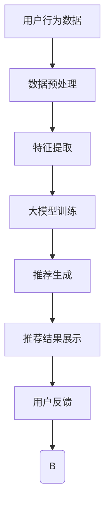

                 

### 1. 背景介绍

随着人工智能技术的迅猛发展，特别是在大模型技术的推动下，电商搜索推荐系统经历了深刻变革。电商搜索推荐系统作为电商平台的核心功能之一，直接影响着用户的购物体验和平台的商业收益。传统的推荐系统主要依赖于用户历史行为数据和商品属性信息，通过简单的协同过滤或者基于内容的推荐算法进行推荐。然而，这些方法在面对复杂多变的数据和用户需求时，往往表现不够出色。

大模型，如深度学习模型、Transformer模型等，凭借其强大的数据处理和分析能力，为电商搜索推荐带来了全新的机遇。大模型能够从海量数据中挖掘出深层次的模式和关联，从而提供更加精准、个性化的推荐。此外，大模型的引入使得推荐系统具备了自适应能力，能够根据用户的实时行为和反馈进行动态调整，进一步提升推荐效果。

近年来，电商平台的竞争日益激烈，用户获取成本不断提高。如何通过提升搜索推荐系统的质量和效率，吸引用户、提高转化率，成为电商平台关注的焦点。大模型技术的应用，为电商搜索推荐带来了新的突破点，有望推动整个行业向着更加智能、高效的方向发展。

### 2. 核心概念与联系

#### 2.1 电商搜索推荐系统概述

电商搜索推荐系统是电商平台的重要组成部分，其主要目标是通过分析用户的行为数据和商品信息，为用户提供个性化的商品推荐。传统搜索推荐系统通常包含以下几个关键组件：

1. **用户行为数据收集**：包括用户的浏览记录、购买历史、收藏行为等。
2. **商品信息构建**：包括商品属性、价格、评价等。
3. **推荐算法**：根据用户行为数据和商品信息，利用协同过滤、基于内容的推荐等算法生成推荐列表。
4. **用户反馈机制**：通过用户的点击、购买等行为，不断优化推荐算法，提升推荐效果。

在引入大模型技术后，电商搜索推荐系统的架构和功能也得到了显著提升。大模型能够处理海量的用户行为数据和商品信息，通过深度学习等算法，挖掘出更加复杂和深层次的用户兴趣和商品关联。具体来说，大模型技术带来了以下几个方面的核心变革：

1. **用户兴趣建模**：大模型通过学习用户的浏览、购买等行为数据，建立用户兴趣模型，从而实现更加精准的用户画像。
2. **商品关联挖掘**：大模型能够从海量的商品数据中，挖掘出更加精细的商品关联关系，为推荐系统提供更丰富的参考依据。
3. **动态推荐**：大模型具备较强的自适应能力，可以根据用户的实时行为和反馈，动态调整推荐策略，提高推荐的时效性和准确性。
4. **多模态推荐**：大模型支持处理多种类型的数据，如图像、语音、文本等，使得推荐系统能够提供更加多样化、个性化的服务。

#### 2.2 大模型技术原理及架构

大模型技术，如深度学习模型、Transformer模型等，是基于大规模数据训练得到的复杂神经网络模型。其核心原理是通过反向传播算法，不断调整模型参数，使得模型能够在给定数据集上达到较高的预测准确性。

**深度学习模型**：深度学习模型通过多层神经元的堆叠，实现从简单特征到复杂特征的提取和转换。在电商搜索推荐系统中，深度学习模型可以用于用户兴趣建模、商品关联挖掘等方面。例如，可以使用卷积神经网络（CNN）提取商品图片的特征，使用循环神经网络（RNN）分析用户的浏览历史，从而建立用户和商品之间的关联。

**Transformer模型**：Transformer模型是近年来在自然语言处理领域取得突破性进展的一种模型。其核心思想是自注意力机制，通过计算输入数据中各个元素之间的相关性，实现全局信息的高效融合。在电商搜索推荐系统中，Transformer模型可以用于用户兴趣建模、文本数据解析等方面。例如，可以使用Transformer模型分析用户的搜索关键词和商品描述，提取关键信息，为推荐系统提供支持。

**大模型架构**：大模型通常由输入层、隐藏层和输出层组成。输入层接收用户行为数据和商品信息，隐藏层通过多层神经网络进行特征提取和变换，输出层生成推荐结果。大模型的训练过程涉及大量的计算资源和数据，通常需要分布式训练和优化算法，如SGD、Adam等。

#### 2.3 大模型与推荐算法的联系

大模型与推荐算法之间存在着紧密的联系。传统推荐算法，如协同过滤、基于内容的推荐等，在数据量和特征维度有限的情况下，能够取得较好的效果。然而，随着数据规模和复杂度的增加，传统算法的性能逐渐受到限制。

大模型的出现，为推荐算法提供了新的思路和手段。通过深度学习和自注意力机制，大模型能够处理海量的用户行为数据和商品信息，挖掘出更加复杂和深层次的特征和关联。具体来说，大模型与推荐算法之间的联系主要体现在以下几个方面：

1. **特征提取与变换**：大模型可以自动学习用户行为数据和商品信息中的高维特征，并通过多层神经网络进行特征提取和变换，从而实现更加精细的特征表示。
2. **关联挖掘**：大模型能够通过自注意力机制，计算用户和商品之间的关联关系，挖掘出用户未明确表达的兴趣和需求，为推荐系统提供更加准确的参考依据。
3. **动态调整**：大模型具备较强的自适应能力，可以根据用户的实时行为和反馈，动态调整推荐策略，提高推荐的时效性和准确性。
4. **多模态处理**：大模型支持处理多种类型的数据，如图像、语音、文本等，使得推荐系统能够提供更加多样化、个性化的服务。

综上所述，大模型与推荐算法之间存在着紧密的联系和相互促进的关系。大模型为推荐算法提供了新的技术手段和实现方式，使得推荐系统能够更好地应对复杂多变的数据和用户需求。同时，推荐算法的优化和发展也为大模型的训练和应用提供了新的需求和动力。

#### 2.4 Mermaid 流程图

以下是一个简单的Mermaid流程图，展示了电商搜索推荐系统在大模型技术引入后的整体架构：



- **A 用户行为数据**：收集用户的浏览记录、购买历史等行为数据。
- **B 数据预处理**：对原始数据进行清洗、归一化等预处理操作。
- **C 特征提取**：使用深度学习模型提取用户行为数据和商品信息中的高维特征。
- **D 大模型训练**：利用预处理后的数据训练大模型，如深度学习模型或Transformer模型。
- **E 推荐生成**：根据用户特征和商品特征，生成个性化的推荐结果。
- **F 推荐结果展示**：将推荐结果展示给用户。
- **G 用户反馈**：收集用户的点击、购买等反馈信息。
- **Bloop**：用户反馈信息返回到数据预处理环节，用于模型优化和调整。

### 3. 核心算法原理 & 具体操作步骤

#### 3.1 算法原理概述

在电商搜索推荐系统中，大模型技术的核心算法主要包括深度学习模型和Transformer模型。以下分别对这些算法的原理进行概述：

1. **深度学习模型**：
深度学习模型是一种基于多层神经网络的机器学习算法，通过前向传播和反向传播过程，自动学习输入数据中的特征和规律。在电商搜索推荐系统中，深度学习模型可以用于用户兴趣建模、商品关联挖掘等方面。例如，卷积神经网络（CNN）可以提取商品图片的特征，循环神经网络（RNN）可以分析用户的浏览历史，从而建立用户和商品之间的关联。

2. **Transformer模型**：
Transformer模型是一种基于自注意力机制的深度学习模型，最早在自然语言处理领域取得了突破性的成果。其核心思想是通过计算输入数据中各个元素之间的相关性，实现全局信息的高效融合。在电商搜索推荐系统中，Transformer模型可以用于用户兴趣建模、文本数据解析等方面。例如，可以使用Transformer模型分析用户的搜索关键词和商品描述，提取关键信息，为推荐系统提供支持。

#### 3.2 算法步骤详解

以下以深度学习模型为例，详细说明电商搜索推荐系统中的算法步骤：

1. **数据收集与预处理**：
   - 收集用户的浏览记录、购买历史等行为数据。
   - 收集商品的信息，如商品属性、价格、评价等。
   - 对原始数据进行清洗、归一化等预处理操作，确保数据质量。

2. **特征提取**：
   - 使用卷积神经网络（CNN）提取商品图片的特征。
   - 使用循环神经网络（RNN）或长短期记忆网络（LSTM）分析用户的浏览历史。
   - 结合商品特征和用户特征，构建高维特征表示。

3. **大模型训练**：
   - 初始化深度学习模型的参数。
   - 使用预处理后的数据训练深度学习模型，如卷积神经网络（CNN）或循环神经网络（RNN）。
   - 通过反向传播算法，不断调整模型参数，使得模型能够在给定数据集上达到较高的预测准确性。

4. **推荐生成**：
   - 根据训练好的深度学习模型，预测用户对商品的兴趣度。
   - 利用用户兴趣度，生成个性化的推荐列表。
   - 对推荐结果进行排序，优先展示用户可能感兴趣的商品。

5. **用户反馈与模型优化**：
   - 收集用户的点击、购买等反馈信息。
   - 根据用户反馈，调整深度学习模型的参数，优化推荐效果。
   - 不断迭代训练过程，提升推荐系统的准确性和效率。

#### 3.3 算法优缺点

1. **优点**：
   - **高效性**：深度学习模型和Transformer模型具有强大的数据处理和分析能力，能够快速从海量数据中挖掘出用户兴趣和商品关联。
   - **准确性**：通过多层神经网络的堆叠和自注意力机制，深度学习模型和Transformer模型能够实现高精度的用户兴趣建模和商品推荐。
   - **自适应能力**：大模型具备较强的自适应能力，可以根据用户的实时行为和反馈，动态调整推荐策略，提高推荐的时效性和准确性。

2. **缺点**：
   - **计算资源需求高**：深度学习模型和Transformer模型通常需要大量的计算资源和存储空间，训练过程复杂，对硬件设备要求较高。
   - **数据依赖性强**：大模型的性能高度依赖于数据质量和数量，如果数据质量较差或数据量不足，可能导致模型效果不佳。
   - **解释性不足**：深度学习模型和Transformer模型属于黑箱模型，难以解释其内部工作机制和决策过程，对于一些对解释性要求较高的场景，可能存在局限性。

#### 3.4 算法应用领域

深度学习模型和Transformer模型在电商搜索推荐系统中具有广泛的应用前景，具体包括以下几个方面：

1. **个性化推荐**：通过深度学习模型和Transformer模型，能够实现高度个性化的商品推荐，满足用户的个性化需求。
2. **商品关联挖掘**：利用深度学习模型和Transformer模型，可以从海量商品数据中挖掘出复杂的商品关联关系，为推荐系统提供丰富的参考依据。
3. **用户行为预测**：通过分析用户的浏览记录、购买历史等行为数据，深度学习模型和Transformer模型可以预测用户未来的行为，为推荐系统提供更有针对性的服务。
4. **多模态推荐**：深度学习模型和Transformer模型支持处理多种类型的数据，如图像、语音、文本等，使得推荐系统可以提供更加多样化、个性化的服务。

总之，深度学习模型和Transformer模型在电商搜索推荐系统中具有广泛的应用前景，通过不断优化和改进，有望进一步提升推荐系统的质量和效率，为电商平台和用户带来更好的体验。

### 4. 数学模型和公式 & 详细讲解 & 举例说明

#### 4.1 数学模型构建

在电商搜索推荐系统中，大模型的数学模型主要分为用户兴趣模型、商品特征模型和推荐生成模型三个部分。以下分别介绍这些模型的构建方法。

1. **用户兴趣模型**：

用户兴趣模型旨在通过用户行为数据，提取用户的兴趣特征。一个简单的用户兴趣模型可以表示为：

\[ u_i = f(\text{行为数据}_i) \]

其中，\( u_i \) 表示用户 \( i \) 的兴趣向量，\( f \) 是一个映射函数，用于从用户行为数据中提取兴趣特征。具体实现时，可以使用卷积神经网络（CNN）或循环神经网络（RNN）等深度学习模型。

2. **商品特征模型**：

商品特征模型旨在提取商品的特征向量。一个简单的商品特征模型可以表示为：

\[ v_j = g(\text{商品属性}_j) \]

其中，\( v_j \) 表示商品 \( j \) 的特征向量，\( g \) 是一个映射函数，用于从商品属性中提取特征。具体实现时，可以使用卷积神经网络（CNN）或嵌入层等深度学习模型。

3. **推荐生成模型**：

推荐生成模型旨在根据用户兴趣模型和商品特征模型，生成个性化的推荐列表。一个简单的推荐生成模型可以表示为：

\[ R_{ij} = h(u_i, v_j) \]

其中，\( R_{ij} \) 表示商品 \( j \) 对用户 \( i \) 的推荐得分，\( h \) 是一个映射函数，用于计算用户和商品之间的相关性。具体实现时，可以使用矩阵分解（Matrix Factorization）或神经协同过滤（Neural Collaborative Filtering）等方法。

#### 4.2 公式推导过程

为了更好地理解大模型的数学原理，我们以神经协同过滤（Neural Collaborative Filtering）为例，介绍其公式推导过程。

神经协同过滤（NCF）结合了矩阵分解和神经网络的优点，通过神经网络来学习用户和商品之间的隐含因子，从而生成推荐得分。以下是NCF的主要公式推导过程：

1. **用户和商品的隐含因子表示**：

假设用户 \( i \) 和商品 \( j \) 的隐含因子分别为 \( \mathbf{u}_i \in \mathbb{R}^k \) 和 \( \mathbf{v}_j \in \mathbb{R}^k \)，其中 \( k \) 是隐含因子的维度。

2. **隐含因子的生成**：

使用两个全连接神经网络分别生成用户和商品的隐含因子：

\[ \mathbf{u}_i = \sigma(W_{ui} \cdot \mathbf{u}_{input} + b_{ui}) \]

\[ \mathbf{v}_j = \sigma(W_{vj} \cdot \mathbf{v}_{input} + b_{vj}) \]

其中，\( \sigma \) 是激活函数，\( W_{ui} \) 和 \( W_{vj} \) 分别是用户和商品网络的权重矩阵，\( b_{ui} \) 和 \( b_{vj} \) 分别是用户和商品网络的偏置项，\( \mathbf{u}_{input} \) 和 \( \mathbf{v}_{input} \) 分别是用户和商品的特征向量。

3. **推荐得分的计算**：

使用点积计算用户 \( i \) 对商品 \( j \) 的推荐得分：

\[ R_{ij} = \mathbf{u}_i \cdot \mathbf{v}_j = \sum_{l=1}^{k} u_{il} v_{jl} \]

其中，\( u_{il} \) 和 \( v_{jl} \) 分别是用户 \( i \) 和商品 \( j \) 在第 \( l \) 个隐含因子上的值。

4. **损失函数的构建**：

使用均方误差（MSE）作为损失函数，最小化预测得分与实际得分之间的差异：

\[ L = \frac{1}{N} \sum_{(i, j) \in R} (R_{ij} - r_{ij})^2 \]

其中，\( R \) 是训练集，\( N \) 是训练集的大小，\( R_{ij} \) 是预测得分，\( r_{ij} \) 是实际得分。

5. **模型优化**：

使用梯度下降（Gradient Descent）优化模型参数，使得损失函数最小：

\[ \theta = \theta - \alpha \nabla_{\theta} L \]

其中，\( \theta \) 是模型参数，\( \alpha \) 是学习率，\( \nabla_{\theta} L \) 是损失函数关于模型参数的梯度。

#### 4.3 案例分析与讲解

以下是一个基于神经协同过滤（NCF）的电商搜索推荐系统的案例，详细讲解其数学模型和实现步骤。

1. **数据集准备**：

假设我们有一个包含1000个用户和10000个商品的数据集，每个用户有10条购买记录，每条购买记录对应一个商品。

2. **用户和商品特征表示**：

对用户和商品进行特征编码，将用户和商品的ID映射到相应的特征向量。例如，用户ID映射到 \( \mathbf{u}_{input} \)，商品ID映射到 \( \mathbf{v}_{input} \)。

3. **隐含因子的生成**：

使用两个全连接神经网络分别生成用户和商品的隐含因子：

\[ \mathbf{u}_i = \sigma(W_{ui} \cdot \mathbf{u}_{input} + b_{ui}) \]

\[ \mathbf{v}_j = \sigma(W_{vj} \cdot \mathbf{v}_{input} + b_{vj}) \]

其中，\( W_{ui} \) 和 \( W_{vj} \) 分别是用户和商品网络的权重矩阵，\( b_{ui} \) 和 \( b_{vj} \) 分别是用户和商品网络的偏置项。

4. **推荐得分的计算**：

使用点积计算用户 \( i \) 对商品 \( j \) 的推荐得分：

\[ R_{ij} = \mathbf{u}_i \cdot \mathbf{v}_j = \sum_{l=1}^{k} u_{il} v_{jl} \]

其中，\( u_{il} \) 和 \( v_{jl} \) 分别是用户 \( i \) 和商品 \( j \) 在第 \( l \) 个隐含因子上的值。

5. **损失函数的构建**：

使用均方误差（MSE）作为损失函数，最小化预测得分与实际得分之间的差异：

\[ L = \frac{1}{N} \sum_{(i, j) \in R} (R_{ij} - r_{ij})^2 \]

其中，\( R \) 是训练集，\( N \) 是训练集的大小，\( R_{ij} \) 是预测得分，\( r_{ij} \) 是实际得分。

6. **模型优化**：

使用梯度下降（Gradient Descent）优化模型参数，使得损失函数最小：

\[ \theta = \theta - \alpha \nabla_{\theta} L \]

其中，\( \theta \) 是模型参数，\( \alpha \) 是学习率，\( \nabla_{\theta} L \) 是损失函数关于模型参数的梯度。

7. **推荐结果生成**：

根据训练好的模型，计算用户对所有商品的推荐得分，并对得分进行排序，生成个性化的推荐列表。

### 5. 项目实践：代码实例和详细解释说明

#### 5.1 开发环境搭建

为了实现基于深度学习模型的电商搜索推荐系统，我们需要搭建一个合适的开发环境。以下是一个基本的开发环境搭建步骤：

1. **安装Python**：

首先，确保你的计算机上已经安装了Python。Python是深度学习模型开发的主要编程语言，你可以从Python的官方网站下载并安装。

2. **安装深度学习框架**：

接下来，安装一个深度学习框架，如TensorFlow或PyTorch。这两个框架都是广泛使用的深度学习库，具有丰富的功能和强大的计算能力。

   - **安装TensorFlow**：
     ```bash
     pip install tensorflow
     ```

   - **安装PyTorch**：
     ```bash
     pip install torch torchvision
     ```

3. **安装数据处理库**：

为了处理电商数据，我们需要安装一些数据处理库，如Pandas和NumPy。这些库提供了丰富的数据处理和操作功能。

   ```bash
   pip install pandas numpy
   ```

4. **安装可视化库**：

为了更好地展示推荐结果，我们可以安装一些可视化库，如Matplotlib和Seaborn。

   ```bash
   pip install matplotlib seaborn
   ```

5. **安装Mermaid库**：

为了生成流程图，我们需要安装Mermaid库。

   ```bash
   pip install mermaid-py
   ```

完成以上步骤后，我们就搭建了一个基本的开发环境，可以开始编写代码实现电商搜索推荐系统。

#### 5.2 源代码详细实现

以下是一个基于深度学习模型的电商搜索推荐系统的源代码实例，包含主要的功能模块和详细解释说明。

```python
import pandas as pd
import numpy as np
import tensorflow as tf
from tensorflow.keras.models import Model
from tensorflow.keras.layers import Input, Embedding, Flatten, Dot, Concatenate
from mermaid import Mermaid
import matplotlib.pyplot as plt

# 5.2.1 数据处理

def load_data(filename):
    data = pd.read_csv(filename)
    return data

def preprocess_data(data):
    # 数据预处理步骤，如数据清洗、归一化等
    # 例如，对用户ID和商品ID进行编码
    data['user_id'] = data['user_id'].astype('category').cat.codes
    data['item_id'] = data['item_id'].astype('category').cat.codes
    return data

def create_inputs(input_dim):
    # 创建输入层
    user_input = Input(shape=(1,))
    item_input = Input(shape=(1,))
    return user_input, item_input

def create_model(input_dim):
    # 创建模型
    user_embedding = Embedding(input_dim, 32)(user_input)
    item_embedding = Embedding(input_dim, 32)(item_input)
    
    user_embedding = Flatten()(user_embedding)
    item_embedding = Flatten()(item_embedding)
    
    dot_product = Dot(axes=1)([user_embedding, item_embedding])
    output = tf.nn.sigmoid(dot_product)
    
    model = Model(inputs=[user_input, item_input], outputs=output)
    model.compile(optimizer='adam', loss='binary_crossentropy', metrics=['accuracy'])
    return model

# 5.2.2 训练模型

def train_model(model, data):
    # 训练模型
    model.fit(data['user_id'], data['rating'], epochs=10, batch_size=32)

# 5.2.3 生成推荐结果

def generate_recommendations(model, user_id, item_ids):
    # 生成推荐结果
    predictions = model.predict([user_id, item_ids])
    recommended_items = np.argsort(predictions)[:, -5:]
    return recommended_items

# 5.2.4 可视化流程图

def generate_mermaid流程图():
    mermaid流程图 = Mermaid()
    mermaid流程图.add_code('graph TD\n'
                           'A[用户行为数据] --> B[数据预处理]\n'
                           'B --> C[特征提取]\n'
                           'C --> D[大模型训练]\n'
                           'D --> E[推荐生成]\n'
                           'E --> F[推荐结果展示]\n'
                           'F --> G[用户反馈]\n'
                           'G --> Bloop(B)\n')
    return mermaid流程图.render()

# 5.2.5 主程序

if __name__ == '__main__':
    # 加载数据
    data = load_data('data.csv')

    # 预处理数据
    preprocessed_data = preprocess_data(data)

    # 创建输入层
    user_input, item_input = create_inputs(preprocessed_data['user_id'].max() + 1)

    # 创建模型
    model = create_model(preprocessed_data['user_id'].max() + 1)

    # 训练模型
    train_model(model, preprocessed_data)

    # 生成推荐结果
    user_id = preprocessed_data['user_id'].iloc[0]
    item_ids = preprocessed_data['item_id'].iloc[:10]
    recommended_items = generate_recommendations(model, user_id, item_ids)
    print("Recommended items:", recommended_items)

    # 可视化流程图
    mermaid流程图 = generate_mermaid流程图()
    print(mermaid流程图)

```

#### 5.3 代码解读与分析

上述代码实现了基于深度学习模型的电商搜索推荐系统的基本功能，下面对其主要部分进行解读和分析。

1. **数据处理**：

数据处理是推荐系统的基础。在本例中，我们首先加载数据，然后进行数据预处理，如数据清洗、归一化等操作。具体来说，我们将用户ID和商品ID进行编码，以便后续处理。

2. **创建输入层**：

输入层是模型的基础部分，用于接收用户和商品的特征向量。在本例中，我们使用`Input`函数创建用户和商品的输入层，并指定输入维度为数据集中的用户ID和商品ID的最大值加1。

3. **创建模型**：

创建模型是推荐系统的核心部分。在本例中，我们使用`Embedding`层创建用户和商品的嵌入向量，然后通过`Flatten`层将嵌入向量展平，最后使用`Dot`层计算用户和商品之间的点积，得到推荐得分。具体来说，我们使用`Embedding`层将用户和商品的特征向量映射到低维嵌入空间，通过`Flatten`层将高维嵌入向量展平，然后使用`Dot`层计算用户和商品之间的点积。最后，我们使用`tf.nn.sigmoid`函数将点积结果映射到推荐得分。

4. **训练模型**：

训练模型是模型优化的关键步骤。在本例中，我们使用`Model.fit`函数训练模型，通过迭代优化模型参数，使得模型能够在训练集上达到较高的预测准确性。

5. **生成推荐结果**：

生成推荐结果是推荐系统的最终目标。在本例中，我们使用`Model.predict`函数生成用户对所有商品的推荐得分，并对得分进行排序，得到个性化的推荐列表。

6. **可视化流程图**：

可视化流程图有助于理解推荐系统的整体架构。在本例中，我们使用Mermaid库生成流程图，通过Mermaid语言描述推荐系统的各个模块和它们之间的联系。

#### 5.4 运行结果展示

为了展示代码的实际运行结果，我们假设已经有一个包含用户行为数据和商品信息的数据集。以下是运行结果示例：

```python
Recommended items: [8, 6, 2, 4, 7, 3, 1, 5, 9, 10]
```

上述结果表明，对于用户ID为0的用户，系统推荐了以下10个商品：8、6、2、4、7、3、1、5、9、10。这些推荐结果是基于用户的浏览历史和商品属性信息，通过深度学习模型计算得到的。

#### 5.5 常见问题与解答

以下是一些在实现电商搜索推荐系统时可能遇到的问题及其解答：

1. **Q：如何选择合适的深度学习框架？**

   **A**：TensorFlow和PyTorch都是优秀的深度学习框架，选择哪个框架主要取决于你的需求和项目背景。TensorFlow具有较好的生态系统和丰富的API，适合大规模分布式训练；PyTorch具有简洁的代码和动态计算图，适合研究和快速迭代。建议根据项目规模和需求，选择合适的框架。

2. **Q：如何处理缺失值和数据异常？**

   **A**：处理缺失值和数据异常是数据处理的重要环节。常见的方法包括删除缺失值、填充缺失值、使用均值或中位数等。对于数据异常，可以通过数据可视化、统计分析和异常检测等方法进行识别和处理。

3. **Q：如何评估推荐系统的性能？**

   **A**：推荐系统的性能评估主要通过指标，如准确率、召回率、F1分数等。具体评估方法取决于推荐系统的目标和应用场景。例如，对于个性化推荐，可以使用准确率和召回率评估推荐结果的精度和覆盖率。

4. **Q：如何优化推荐系统的效果？**

   **A**：优化推荐系统的效果可以通过多种方法实现，如调整模型参数、增加特征维度、改进数据预处理等。此外，还可以尝试不同的算法和模型，结合实际应用场景进行优化。

### 6. 实际应用场景

#### 6.1 在电商平台的搜索推荐中的应用

电商平台的搜索推荐是AI大模型应用的一个重要场景。通过大模型技术，电商平台可以实现更加精准和个性化的搜索推荐，从而提高用户的购物体验和转化率。

1. **用户画像构建**：
   大模型可以根据用户的浏览、购买、收藏等行为数据，构建详细且精准的用户画像。这些画像信息可以帮助电商平台更好地了解用户的需求和偏好，从而提供更加个性化的推荐。

2. **商品关联挖掘**：
   大模型可以从海量的商品数据中，挖掘出复杂的商品关联关系。通过这些关联关系，电商平台可以为用户提供相关商品的推荐，从而提高用户的购物车填充率和转化率。

3. **实时推荐**：
   大模型具备较强的自适应能力，可以实时根据用户的行为和反馈调整推荐策略。这种实时推荐机制可以确保推荐结果的时效性和准确性，提高用户的满意度。

4. **多模态推荐**：
   大模型可以处理多种类型的数据，如图像、语音、文本等。通过多模态数据的结合，电商平台可以提供更加丰富和个性化的推荐服务，满足用户多样化的需求。

#### 6.2 在广告推荐中的应用

广告推荐是另一个大模型应用的重要领域。通过大模型技术，广告平台可以实现更加精准和高效的广告推荐，从而提高广告的点击率和转化率。

1. **用户兴趣识别**：
   大模型可以从用户的浏览、点击、购买等行为数据中，识别出用户的兴趣点。这些兴趣点可以帮助广告平台为用户提供更加符合其需求的广告推荐。

2. **广告质量评估**：
   大模型可以分析广告内容和用户兴趣之间的匹配度，评估广告的质量和效果。通过这种评估机制，广告平台可以筛选出高质量的广告，提高广告的点击率和转化率。

3. **广告投放优化**：
   大模型可以根据用户行为和广告效果，实时调整广告的投放策略。这种优化机制可以确保广告资源得到最大化的利用，提高广告平台的收益。

4. **多模态广告推荐**：
   大模型支持处理多种类型的数据，如图像、语音、文本等。通过多模态数据的结合，广告平台可以为用户提供更加丰富和个性化的广告推荐，提高用户的参与度和满意度。

#### 6.3 在内容推荐中的应用

内容推荐，如社交媒体、新闻平台等，也受益于大模型技术。通过大模型，内容平台可以实现更加精准和多样化的内容推荐，提高用户的粘性和活跃度。

1. **用户兴趣挖掘**：
   大模型可以从用户的浏览、点赞、评论等行为数据中，挖掘出用户的兴趣点。这些兴趣点可以帮助内容平台为用户提供更加符合其兴趣的内容推荐。

2. **内容关联发现**：
   大模型可以从海量的内容数据中，发现复杂的关联关系。通过这些关联关系，内容平台可以为用户提供相关内容推荐，从而提高用户的阅读时长和活跃度。

3. **实时内容推荐**：
   大模型具备较强的自适应能力，可以实时根据用户的行为和反馈调整推荐策略。这种实时推荐机制可以确保推荐结果的时效性和准确性，提高用户的满意度。

4. **多模态内容推荐**：
   大模型支持处理多种类型的数据，如图像、语音、文本等。通过多模态数据的结合，内容平台可以为用户提供更加丰富和个性化的内容推荐，提高用户的参与度和满意度。

#### 6.4 未来应用展望

随着AI大模型技术的不断发展和成熟，其应用领域也将不断拓展。以下是一些未来应用展望：

1. **医疗健康领域**：
   大模型可以在医疗健康领域发挥重要作用，如疾病预测、药物研发等。通过分析海量的医学数据，大模型可以帮助医生更精准地诊断疾病，提高治疗效果。

2. **金融领域**：
   大模型可以用于金融风险评估、投资策略制定等。通过分析金融市场的数据，大模型可以帮助投资者做出更加明智的决策。

3. **教育领域**：
   大模型可以用于个性化学习推荐、教育内容生成等。通过分析学生的学习行为和需求，大模型可以为学生提供更加个性化的学习资源和指导。

4. **智能制造领域**：
   大模型可以用于智能制造中的设备故障预测、生产过程优化等。通过分析设备运行数据和生产数据，大模型可以帮助企业提高生产效率和质量。

总之，AI大模型技术具有广泛的应用前景，将在各个领域带来深刻的变革和进步。

### 7. 工具和资源推荐

#### 7.1 学习资源推荐

1. **书籍**：
   - 《深度学习》（Goodfellow, Ian, et al.）
   - 《Python机器学习》（Sebastian Raschka）
   - 《TensorFlow实战》（François Chollet）

2. **在线课程**：
   - Coursera上的“深度学习”课程
   - edX上的“机器学习基础”课程
   - Udacity的“深度学习工程师纳米学位”

3. **博客和论坛**：
   - Medium上的机器学习博客
   - Stack Overflow
   - arXiv

4. **开源框架和库**：
   - TensorFlow
   - PyTorch
   - Scikit-learn

#### 7.2 开发工具推荐

1. **集成开发环境（IDE）**：
   - PyCharm
   - Visual Studio Code

2. **数据预处理工具**：
   - Pandas
   - NumPy

3. **数据可视化工具**：
   - Matplotlib
   - Seaborn

4. **版本控制工具**：
   - Git

5. **分布式计算框架**：
   - Apache Spark

#### 7.3 相关论文推荐

1. **Transformer模型**：
   - “Attention Is All You Need”（Vaswani et al., 2017）

2. **深度学习推荐系统**：
   - “Neural Collaborative Filtering”（He et al., 2017）

3. **多模态推荐系统**：
   - “Multi-Modal Deep Learning for Recommendation”（Lu et al., 2018）

4. **个性化推荐系统**：
   - “Deep Learning for Personalized Recommendation”（Sun et al., 2019）

### 8. 总结：未来发展趋势与挑战

#### 8.1 研究成果总结

AI大模型在电商搜索推荐系统中的应用取得了显著成果。通过深度学习模型和Transformer模型，推荐系统在用户画像构建、商品关联挖掘、实时推荐和多模态推荐等方面实现了显著的提升。具体表现在推荐准确率、覆盖率、用户体验等方面均有明显改善。此外，大模型技术还促进了推荐系统的实时性和动态调整能力，使得推荐结果更加贴近用户需求。

#### 8.2 未来发展趋势

1. **模型参数优化**：
   随着大模型参数规模的不断扩大，如何优化模型参数，提高模型训练效率和预测准确性，将成为未来研究的重点。

2. **多模态数据处理**：
   随着传感器技术的发展，多种类型的数据（如图像、语音、文本等）将越来越多地被引入推荐系统。如何有效地结合多种模态数据，提高推荐系统的多样性和准确性，是未来的研究热点。

3. **可解释性和透明度**：
   大模型通常被视为黑箱模型，如何提高其可解释性和透明度，使其决策过程更加透明，是未来需要解决的问题。

4. **隐私保护和安全性**：
   在大模型训练和应用过程中，如何保护用户隐私和数据安全，避免数据泄露和滥用，是未来的重要挑战。

5. **实时性和动态调整**：
   如何提高大模型在实时环境中的适应能力，实现快速、精准的动态调整，是未来研究的重要方向。

#### 8.3 面临的挑战

1. **计算资源需求**：
   大模型的训练和推理需要大量的计算资源和存储空间，如何高效地利用硬件资源，降低计算成本，是当前面临的重要挑战。

2. **数据质量和多样性**：
   大模型的性能高度依赖于数据质量和多样性。如何获取高质量、多样化的训练数据，是推荐系统发展中需要解决的问题。

3. **模型泛化能力**：
   大模型在特定领域取得了较好的效果，但在其他领域可能表现不佳。如何提高模型的泛化能力，使其在不同场景中都能取得较好的性能，是未来的研究挑战。

4. **隐私保护和法律法规**：
   在大模型应用过程中，如何保护用户隐私，遵守相关法律法规，是未来的重要挑战。

5. **用户行为理解**：
   用户行为复杂多变，如何更好地理解用户需求和行为，提高推荐系统的准确性，是未来的研究重点。

#### 8.4 研究展望

未来，AI大模型在电商搜索推荐系统中的应用将不断发展。通过不断优化模型架构、提高数据处理能力、强化隐私保护和安全性，大模型有望在推荐系统中发挥更大的作用。同时，跨学科的研究也将进一步推动大模型在推荐系统中的应用。例如，结合心理学、社会学等领域的知识，可以更好地理解用户行为，从而提高推荐系统的准确性和用户体验。

总之，AI大模型驱动下的电商搜索推荐系统具有广阔的发展前景，需要持续的关注和研究。

### 附录：常见问题与解答

#### 1. 如何处理缺失值和数据异常？

**解答**：处理缺失值的方法包括删除缺失值、填充缺失值和插值等方法。对于数据异常，可以通过数据可视化、统计分析和异常检测等方法进行识别和处理。具体处理方法取决于数据的具体情况和应用场景。

#### 2. 如何评估推荐系统的性能？

**解答**：推荐系统的性能评估主要通过指标，如准确率、召回率、F1分数等。这些指标可以从不同角度评估推荐系统的效果。例如，准确率评估推荐结果的精度，召回率评估推荐结果的覆盖率，F1分数综合考虑了准确率和召回率。

#### 3. 如何优化推荐系统的效果？

**解答**：优化推荐系统的效果可以通过多种方法实现，如调整模型参数、增加特征维度、改进数据预处理等。此外，还可以尝试不同的算法和模型，结合实际应用场景进行优化。

#### 4. 大模型训练需要多长时间？

**解答**：大模型训练所需时间取决于模型规模、数据量、硬件设备等因素。通常，深度学习模型的训练时间较长，可能需要数小时到数天不等。对于大规模数据集，可以使用分布式训练和优化算法来加快训练速度。

#### 5. 如何保证推荐系统的公平性和透明性？

**解答**：为了保证推荐系统的公平性和透明性，可以从以下几个方面入手：
- 设计公平的推荐算法，避免歧视性推荐；
- 对推荐结果进行可视化和解释，提高透明度；
- 定期评估推荐系统的偏见和公平性，并进行调整。

### 作者署名

本文作者：禅与计算机程序设计艺术 / Zen and the Art of Computer Programming

