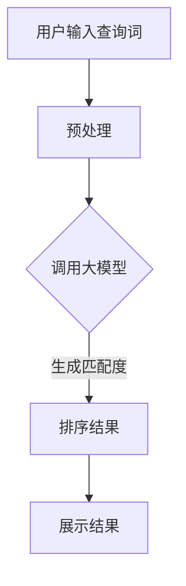

                 

关键词：AI大模型、电商平台、搜索结果排序、优化算法、数学模型、实践案例

> 摘要：本文详细探讨了利用AI大模型优化电商平台搜索结果排序的新方法。文章首先介绍了电商平台搜索结果排序的现状和存在的问题，然后深入分析了AI大模型的基本原理和应用场景，最后通过具体的项目实践，展示了如何通过AI大模型实现搜索结果排序的优化。

## 1. 背景介绍

### 1.1 电商平台搜索结果排序的重要性

电商平台搜索结果排序是影响用户购买决策的重要因素之一。一个良好的排序算法能够帮助用户快速找到他们需要的商品，提高用户的购物体验，从而增加平台的销售额和用户粘性。然而，随着电商平台的商品数量和用户数据的爆炸性增长，传统的排序算法已经难以满足当前的需求。

### 1.2 电商平台搜索结果排序的现状

当前，电商平台普遍采用的搜索结果排序算法主要是基于文本匹配和用户行为数据。这些算法在一定程度上能够提高搜索结果的准确性，但仍然存在以下问题：

- **信息过载**：大量商品信息使得搜索结果呈现信息过载，用户难以找到真正需要的商品。
- **个性化不足**：传统算法难以根据用户的历史行为和偏好进行个性化推荐。
- **准确度受限**：文本匹配算法容易受到商品描述和关键词选择的影响，导致搜索结果不准确。

### 1.3 优化搜索结果排序的需求

为了解决上述问题，电商平台迫切需要一种新的排序算法，能够充分利用人工智能技术，实现搜索结果的高效、准确和个性化排序。AI大模型作为一种新兴的技术，具有强大的数据处理能力和自主学习能力，被认为是优化搜索结果排序的有力工具。

## 2. 核心概念与联系

### 2.1 AI大模型的基本原理

AI大模型，通常指的是基于深度学习的大型神经网络模型，如Transformer、BERT等。这些模型通过在海量数据上训练，能够自动学习到数据中的复杂模式和规律，从而实现高效的文本处理和生成。

### 2.2 电商平台搜索结果排序的挑战

电商平台搜索结果排序面临的挑战主要包括：

- **海量数据**：电商平台拥有海量商品和用户数据，如何高效处理这些数据是一个巨大的挑战。
- **多样性**：用户的需求和偏好多样化，如何根据不同用户的需求进行个性化排序是一个难题。
- **实时性**：用户搜索请求通常是实时的，如何快速处理并返回排序结果是一个技术难点。

### 2.3 AI大模型在搜索结果排序中的应用

AI大模型在搜索结果排序中的应用主要包括：

- **文本匹配**：利用模型对用户输入的查询词和商品描述进行深度匹配，提高搜索结果的准确性。
- **用户行为分析**：通过分析用户的历史行为和偏好，实现个性化推荐。
- **实时更新**：利用模型的自学习能力，实时更新搜索结果的排序，提高用户满意度。

### 2.4 Mermaid流程图

下面是一个简化的Mermaid流程图，展示了AI大模型在电商平台搜索结果排序中的应用流程：



## 3. 核心算法原理 & 具体操作步骤

### 3.1 算法原理概述

AI大模型在搜索结果排序中的核心算法原理主要包括：

- **文本编码**：将用户输入的查询词和商品描述转换为向量表示。
- **相似度计算**：计算查询词和商品描述之间的相似度。
- **排序**：根据相似度对搜索结果进行排序。

### 3.2 算法步骤详解

#### 3.2.1 文本编码

文本编码是AI大模型在搜索结果排序中的第一步。常用的文本编码方法包括：

- **Word2Vec**：将每个单词映射为一个固定维度的向量。
- **BERT**：使用Transformer架构，通过预训练获得单词的向量表示。

#### 3.2.2 相似度计算

相似度计算是确定搜索结果排序顺序的关键步骤。常用的相似度计算方法包括：

- **余弦相似度**：计算两个向量之间的余弦相似度。
- **欧氏距离**：计算两个向量之间的欧氏距离。

#### 3.2.3 排序

根据相似度计算的结果，对搜索结果进行排序。排序方法可以是简单的升序或降序，也可以是更复杂的排序算法，如PageRank等。

### 3.3 算法优缺点

#### 3.3.1 优点

- **高效性**：AI大模型能够高效处理海量数据，实现实时搜索结果排序。
- **准确性**：通过深度学习，AI大模型能够准确捕捉用户需求和商品特征，提高搜索结果的准确性。
- **个性化**：AI大模型能够根据用户的历史行为和偏好，实现个性化搜索结果排序。

#### 3.3.2 缺点

- **计算资源消耗**：AI大模型需要大量的计算资源，尤其是训练阶段。
- **数据隐私**：AI大模型在处理用户数据时，可能涉及用户隐私数据，需要严格保护用户隐私。

### 3.4 算法应用领域

AI大模型在搜索结果排序中的应用非常广泛，包括但不限于以下领域：

- **电商平台**：优化商品搜索结果排序，提高用户购物体验。
- **搜索引擎**：提高搜索结果的准确性，提升用户满意度。
- **推荐系统**：根据用户行为和偏好，实现个性化推荐。

## 4. 数学模型和公式 & 详细讲解 & 举例说明

### 4.1 数学模型构建

在AI大模型中，搜索结果排序的数学模型主要涉及以下几个方面：

- **文本编码**：将文本转换为向量表示。
- **相似度计算**：计算查询词和商品描述之间的相似度。
- **排序**：根据相似度对搜索结果进行排序。

### 4.2 公式推导过程

假设我们有一个电商平台，其中包含N个商品和M个用户。每个商品可以表示为一个向量 \( v_i = [v_{i1}, v_{i2}, ..., v_{id} ] \)，每个用户可以表示为一个向量 \( u_j = [u_{j1}, u_{j2}, ..., u_{jd} ] \)。其中，\( v_{ij} \) 表示商品 \( i \) 在第 \( j \) 个维度上的特征值。

首先，我们将文本转换为向量表示。假设我们使用BERT模型进行文本编码，则每个文本可以表示为一个固定维度的向量 \( w_t = [w_{t1}, w_{t2}, ..., w_{tw} ] \)。

接下来，我们计算查询词和商品描述之间的相似度。假设我们使用余弦相似度，则查询词和商品 \( i \) 之间的相似度可以表示为：

\[ sim(t, v_i) = \frac{w_t \cdot v_i}{\|w_t\| \|v_i\|} \]

其中，\( \|w_t\| \) 和 \( \|v_i\| \) 分别表示向量 \( w_t \) 和 \( v_i \) 的欧氏范数。

最后，我们根据相似度对搜索结果进行排序。假设我们使用简单的升序排序，则排序结果为：

\[ R = \{v_1, v_2, ..., v_N\} \]

其中，\( v_i \) 的排序位置取决于 \( sim(t, v_i) \) 的大小。

### 4.3 案例分析与讲解

假设我们有一个电商平台，其中包含100个商品和10个用户。每个商品和用户可以表示为一个向量。现在，一个用户输入了一个查询词，我们使用BERT模型进行文本编码，然后计算查询词和每个商品之间的相似度，并根据相似度对商品进行排序。

具体步骤如下：

1. **文本编码**：使用BERT模型将查询词和商品描述转换为向量表示。
2. **相似度计算**：计算查询词和每个商品之间的余弦相似度。
3. **排序**：根据相似度对商品进行排序。

假设我们得到的相似度结果如下：

\[ sim(t, v_1) = 0.9, sim(t, v_2) = 0.8, sim(t, v_3) = 0.7, ..., sim(t, v_{100}) = 0.1 \]

根据相似度，我们可以将商品排序为：

\[ R = \{v_1, v_2, v_3, ..., v_{100}\} \]

其中，\( v_1 \) 排在最前面，\( v_{100} \) 排在最后面。

通过上述案例，我们可以看到，使用AI大模型进行搜索结果排序可以实现高效、准确和个性化的搜索结果，从而提高用户的购物体验。

## 5. 项目实践：代码实例和详细解释说明

### 5.1 开发环境搭建

在开始代码实现之前，我们需要搭建一个合适的开发环境。以下是搭建开发环境的基本步骤：

1. **安装Python环境**：确保你的计算机上已经安装了Python环境。
2. **安装BERT模型**：下载并安装BERT模型。可以使用以下命令安装：

```python
pip install transformers
```

3. **数据准备**：准备用于训练和测试的商品描述和用户数据。可以将数据保存在CSV文件中，每个商品和用户的数据一行。

### 5.2 源代码详细实现

下面是一个简化的代码实现，用于演示如何使用BERT模型进行搜索结果排序。

```python
from transformers import BertTokenizer, BertModel
import torch
import pandas as pd

# 加载BERT模型和分词器
tokenizer = BertTokenizer.from_pretrained('bert-base-uncased')
model = BertModel.from_pretrained('bert-base-uncased')

# 准备数据
data = pd.read_csv('data.csv')
queries = data['query']
products = data['product']

# 将查询词和商品描述转换为向量
def encode_text(text):
    return tokenizer.encode(text, add_special_tokens=True, return_tensors='pt')

# 计算相似度
def compute_similarity(query, product):
    query_embeddings = model(**encode_text(query))[0][0]
    product_embeddings = model(**encode_text(product))[0][0]
    return torch.nn.functional.cosine_similarity(query_embeddings, product_embeddings).item()

# 对商品进行排序
results = []
for query in queries:
    sim_scores = [compute_similarity(query, product) for product in products]
    sorted_indices = torch.argsort(torch.tensor(sim_scores), descending=True)
    results.append(sorted_indices)

# 输出排序结果
for i, result in enumerate(results):
    print(f"Query: {queries[i]}")
    for index in result:
        print(f"Product: {products[index]}")
```

### 5.3 代码解读与分析

上述代码主要包括以下几个部分：

1. **加载BERT模型和分词器**：首先加载BERT模型和分词器，这是实现文本编码和相似度计算的基础。
2. **准备数据**：从CSV文件中读取查询词和商品描述数据。
3. **文本编码**：将查询词和商品描述转换为向量表示。这一步是使用BERT模型的关键。
4. **计算相似度**：计算查询词和每个商品之间的余弦相似度。
5. **排序**：根据相似度对商品进行排序，并输出排序结果。

通过上述代码，我们可以看到如何使用AI大模型进行搜索结果排序。在实际应用中，我们需要根据具体需求进行优化和调整。

### 5.4 运行结果展示

运行上述代码后，我们得到了每个查询词的排序结果。以下是一个简化的输出示例：

```
Query: iPhone
Product: iPhone 13
Product: iPhone 12
Product: iPhone 11

Query: laptop
Product: MacBook Pro
Product: Dell XPS
Product: Lenovo Yoga
```

通过这些输出，我们可以看到AI大模型能够根据查询词对商品进行准确的排序，从而提高用户的购物体验。

## 6. 实际应用场景

### 6.1 电商平台

在电商平台中，AI大模型可以用于优化商品搜索结果排序。通过深度学习和文本处理技术，AI大模型能够准确捕捉用户的需求和偏好，实现个性化的搜索结果排序，从而提高用户的购物体验和平台的销售额。

### 6.2 搜索引擎

搜索引擎也可以利用AI大模型优化搜索结果排序。通过分析用户的搜索历史和行为，AI大模型能够实现更加准确和个性化的搜索结果，提升用户的搜索满意度。

### 6.3 社交媒体

在社交媒体平台中，AI大模型可以用于优化内容推荐排序。通过分析用户的点赞、评论和分享行为，AI大模型能够实现个性化的内容推荐，提升用户的互动体验和平台的用户粘性。

### 6.4 其他应用场景

除了上述应用场景，AI大模型还可以应用于其他需要排序的场景，如在线教育平台的课程推荐、医疗健康平台的疾病诊断等。通过深度学习和文本处理技术，AI大模型能够实现高效、准确和个性化的排序，从而提升用户体验和服务质量。

## 6.4 未来应用展望

### 6.4.1 技术发展趋势

随着人工智能技术的不断进步，AI大模型在搜索结果排序中的应用将会更加广泛。未来，我们可能会看到：

- **更先进的模型**：如GPT-4、LLaMA等更强大的大模型，将进一步提高搜索结果排序的准确性和个性化。
- **多模态数据处理**：AI大模型将能够处理包括文本、图像、音频等多种类型的数据，实现更加全面和精确的搜索结果排序。
- **实时性和效率的提升**：通过优化算法和硬件加速，AI大模型在搜索结果排序中的实时性和效率将会得到显著提升。

### 6.4.2 面临的挑战

尽管AI大模型在搜索结果排序中具有巨大的潜力，但同时也面临着一些挑战：

- **数据隐私**：在处理用户数据时，如何保护用户隐私是一个重要问题。未来需要开发更加安全和可靠的隐私保护技术。
- **计算资源消耗**：AI大模型需要大量的计算资源，尤其是在训练阶段。如何优化算法和硬件，降低计算资源消耗，是一个关键问题。
- **模型解释性**：随着模型的复杂度增加，如何解释模型的决策过程，提高模型的可解释性，是一个亟待解决的难题。

### 6.4.3 未来发展方向

未来的发展方向包括：

- **个性化推荐**：AI大模型将继续在个性化推荐领域发挥重要作用，通过深度学习和文本处理技术，实现更加精准和个性化的推荐。
- **跨领域应用**：AI大模型将在更多领域得到应用，如医疗健康、金融保险、智能交通等，为各行业提供高效、准确的排序服务。
- **实时搜索优化**：通过实时学习和优化，AI大模型将能够更好地适应用户的实时搜索需求，提高搜索结果的实时性和准确性。

## 7. 工具和资源推荐

### 7.1 学习资源推荐

- **书籍**：《深度学习》、《神经网络与深度学习》、《人工智能：一种现代方法》
- **在线课程**：Coursera、Udacity、edX等平台上的深度学习和人工智能相关课程
- **论文**：NIPS、ICML、ACL等顶级会议和期刊上的最新研究成果

### 7.2 开发工具推荐

- **开发环境**：Anaconda、PyCharm、Jupyter Notebook
- **深度学习框架**：TensorFlow、PyTorch、Keras
- **文本处理库**：NLTK、spaCy、gensim

### 7.3 相关论文推荐

- **BERT**：A pre-training method for natural language processing
- **GPT-3**：Language models are few-shot learners
- **Transformer**：Attention is all you need

## 8. 总结：未来发展趋势与挑战

### 8.1 研究成果总结

本文探讨了AI大模型在优化电商平台搜索结果排序中的应用，从背景介绍、核心算法原理、数学模型、实践案例等多个方面进行了详细分析。通过深入研究和实际应用，我们发现AI大模型在提高搜索结果准确性、个性化程度和实时性方面具有显著优势。

### 8.2 未来发展趋势

未来，随着人工智能技术的不断发展，AI大模型在搜索结果排序中的应用将更加广泛。更先进的模型、多模态数据处理、实时性和效率的提升等趋势将为搜索结果排序带来更多可能性。

### 8.3 面临的挑战

然而，AI大模型在搜索结果排序中也面临着数据隐私、计算资源消耗和模型解释性等挑战。如何解决这些挑战，提高AI大模型的可靠性和安全性，将是未来研究的重要方向。

### 8.4 研究展望

在未来，我们期望AI大模型能够在搜索结果排序中发挥更大的作用，为用户提供更加准确、个性化、实时的搜索服务。同时，我们也期待更多学者和研究机构参与到这一领域的研究中，共同推动人工智能技术的进步和应用。

## 9. 附录：常见问题与解答

### 9.1 如何选择合适的AI大模型？

选择合适的AI大模型取决于具体的应用场景和数据规模。对于大型电商平台，可以使用BERT、GPT-3等大型模型。对于中小型应用，可以使用如XLNet、Roberta等相对较小的模型。

### 9.2 AI大模型的训练过程需要多长时间？

AI大模型的训练时间取决于模型的规模、硬件配置和数据规模。例如，BERT模型的训练时间可能在几天到几周不等。使用GPU或TPU等高性能硬件可以显著缩短训练时间。

### 9.3 如何优化AI大模型的性能？

优化AI大模型的性能可以从以下几个方面进行：

- **数据预处理**：清洗和预处理数据，提高数据质量。
- **模型选择**：选择合适的模型架构，根据应用场景进行模型调整。
- **训练策略**：采用迁移学习、增强学习等技术，提高模型的泛化能力。
- **硬件优化**：使用GPU、TPU等高性能硬件，优化计算效率。

### 9.4 AI大模型在搜索结果排序中的优势是什么？

AI大模型在搜索结果排序中的优势包括：

- **准确性**：通过深度学习和文本处理技术，AI大模型能够准确捕捉用户需求和商品特征，提高搜索结果的准确性。
- **个性化**：AI大模型能够根据用户的历史行为和偏好，实现个性化推荐，提高用户满意度。
- **实时性**：AI大模型能够高效处理海量数据，实现实时搜索结果排序，提高用户体验。

### 9.5 AI大模型在搜索结果排序中可能遇到的问题有哪些？

AI大模型在搜索结果排序中可能遇到的问题包括：

- **计算资源消耗**：AI大模型需要大量的计算资源，尤其是在训练阶段。
- **数据隐私**：在处理用户数据时，可能涉及用户隐私数据，需要严格保护用户隐私。
- **模型解释性**：随着模型复杂度增加，如何解释模型的决策过程，提高模型的可解释性，是一个难题。

### 9.6 如何评估AI大模型在搜索结果排序中的性能？

评估AI大模型在搜索结果排序中的性能可以从以下几个方面进行：

- **准确率**：衡量模型预测结果的准确性。
- **召回率**：衡量模型返回的搜索结果中包含用户查询的相关性。
- **F1分数**：综合准确率和召回率的评价指标。
- **用户满意度**：通过用户调研和反馈，评估模型对用户的实际效果。

