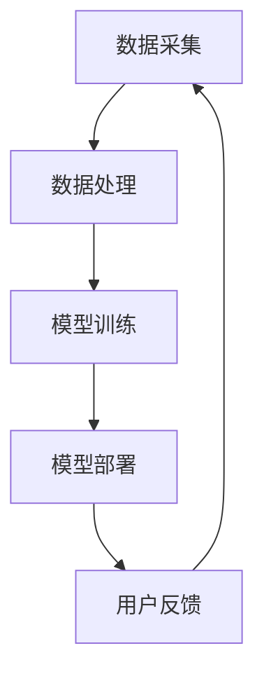

                 

关键词：AI大模型、电商平台、用户体验、个性化、一致性、优化、算法原理、数学模型、实践案例、应用领域

> 摘要：随着人工智能技术的快速发展，AI大模型在电商平台中的应用日益广泛。本文将探讨如何通过AI大模型优化电商平台用户体验的个性化与一致性，提高用户满意度，从而提升电商平台的市场竞争力。文章将从背景介绍、核心概念与联系、核心算法原理、数学模型和公式、项目实践、实际应用场景、工具和资源推荐以及未来发展趋势与挑战等方面进行深入分析。

## 1. 背景介绍

### 1.1 电商平台的现状与挑战

随着互联网技术的迅猛发展，电商平台已经成为人们生活中不可或缺的一部分。电商平台在满足消费者购物需求的同时，也面临着激烈的竞争压力。为了在市场中脱颖而出，电商平台需要不断提升用户体验，提高用户满意度和忠诚度。

当前，电商平台在用户体验方面存在以下几大挑战：

1. **个性化推荐不足**：传统的推荐算法无法充分考虑用户的个性化需求，导致推荐结果不够精准，影响用户满意度。
2. **一致性体验欠缺**：不同页面、不同设备之间的用户体验存在较大差异，难以保持一致的用户体验。
3. **响应速度缓慢**：电商平台在处理大量用户请求时，响应速度较慢，影响用户体验。

### 1.2 AI大模型的应用前景

人工智能技术的飞速发展，使得AI大模型在各个领域取得了显著的应用成果。AI大模型具有强大的数据处理和分析能力，能够从海量数据中挖掘出有价值的信息，为电商平台提供个性化推荐、一致性体验和智能客服等解决方案。

本文将探讨如何通过AI大模型优化电商平台用户体验的个性化与一致性，提高用户满意度，从而提升电商平台的市场竞争力。

## 2. 核心概念与联系

### 2.1 个性化推荐算法

个性化推荐算法是AI大模型在电商平台中的重要应用之一。个性化推荐算法通过分析用户的历史行为、兴趣偏好和社交关系等信息，为用户提供个性化的商品推荐。常用的个性化推荐算法包括基于内容的推荐、协同过滤推荐和深度学习推荐等。

### 2.2 一致性体验保障

一致性体验保障旨在确保用户在电商平台的不同页面、不同设备上获得一致的用户体验。这需要电商平台在界面设计、交互逻辑、数据同步等方面进行精细化的优化。一致性体验保障的关键在于数据同步与存储，以及前端界面的响应速度。

### 2.3 AI大模型架构

AI大模型通常由数据采集、数据处理、模型训练和模型部署等模块组成。数据采集模块负责从电商平台各个渠道收集用户行为数据；数据处理模块对数据进行清洗、预处理和特征提取；模型训练模块利用训练数据训练深度学习模型；模型部署模块将训练好的模型部署到电商平台，为用户提供个性化推荐和一致性体验服务。

### 2.4 Mermaid流程图

以下是一个简化的AI大模型架构的Mermaid流程图：



## 3. 核心算法原理 & 具体操作步骤

### 3.1 算法原理概述

本文主要介绍两种算法：基于深度学习的个性化推荐算法和一致性体验保障算法。

1. **基于深度学习的个性化推荐算法**：通过深度学习模型对用户行为数据进行分析，为用户提供个性化的商品推荐。
2. **一致性体验保障算法**：通过前端界面优化、数据同步与存储等技术手段，确保用户在不同页面、不同设备上获得一致的用户体验。

### 3.2 算法步骤详解

#### 3.2.1 基于深度学习的个性化推荐算法

1. **数据采集**：从电商平台各个渠道收集用户行为数据，如浏览记录、购买记录、评价记录等。
2. **数据处理**：对采集到的数据进行清洗、预处理和特征提取，构建用户行为特征向量。
3. **模型训练**：利用用户行为特征向量训练深度学习模型，如卷积神经网络（CNN）、循环神经网络（RNN）等。
4. **模型评估**：对训练好的模型进行评估，选择表现最佳的模型进行部署。
5. **模型部署**：将训练好的模型部署到电商平台，为用户提供个性化的商品推荐。

#### 3.2.2 一致性体验保障算法

1. **前端界面优化**：对前端界面进行精细化设计，确保用户在不同设备上获得一致的用户体验。
2. **数据同步与存储**：通过实时数据同步与存储技术，确保用户在不同页面之间的数据一致性。
3. **响应速度优化**：对前端界面进行性能优化，提高响应速度，降低用户等待时间。
4. **用户体验反馈**：收集用户对前端界面的反馈，不断优化和改进用户体验。

### 3.3 算法优缺点

**基于深度学习的个性化推荐算法**：

- 优点：能够充分利用用户行为数据，为用户提供高度个性化的商品推荐，提高用户满意度。
- 缺点：训练过程较为复杂，需要大量计算资源和时间；对用户行为数据的依赖性强，可能导致推荐结果的偏差。

**一致性体验保障算法**：

- 优点：确保用户在不同页面、不同设备上获得一致的用户体验，提高用户满意度。
- 缺点：需要对前端界面进行精细化设计，提高开发成本和难度。

### 3.4 算法应用领域

基于深度学习的个性化推荐算法和一致性体验保障算法可以广泛应用于各类电商平台，如电商网站、移动应用、社交电商等。此外，这两种算法还可以应用于其他领域，如金融、医疗、教育等，为用户提供个性化的服务和体验。

## 4. 数学模型和公式 & 详细讲解 & 举例说明

### 4.1 数学模型构建

#### 4.1.1 个性化推荐算法

个性化推荐算法的核心是构建用户行为特征向量。假设用户 \(u\) 的行为数据集为 \(D_u = \{x_1, x_2, ..., x_n\}\)，其中 \(x_i\) 表示用户在时间 \(t_i\) 的行为记录。用户行为特征向量 \(X_u\) 可以通过以下公式构建：

$$
X_u = \text{mean}(\{x_1, x_2, ..., x_n\})
$$

其中，\(\text{mean}(\cdot)\) 表示对行为记录进行均值化处理。

#### 4.1.2 一致性体验保障算法

一致性体验保障算法的核心是构建前端界面优化模型。假设用户 \(u\) 的前端界面数据集为 \(D_u = \{y_1, y_2, ..., y_n\}\)，其中 \(y_i\) 表示用户在时间 \(t_i\) 的前端界面记录。前端界面优化模型 \(Y_u\) 可以通过以下公式构建：

$$
Y_u = \text{max}(\{y_1, y_2, ..., y_n\})
$$

其中，\(\text{max}(\cdot)\) 表示对前端界面记录进行最大化处理。

### 4.2 公式推导过程

#### 4.2.1 个性化推荐算法

假设用户 \(u\) 对商品 \(i\) 的偏好度表示为 \(r_{ui}\)。根据用户行为特征向量 \(X_u\) 和商品特征向量 \(X_i\)，可以构建用户 \(u\) 对商品 \(i\) 的偏好度模型：

$$
r_{ui} = \text{sigmoid}(W \cdot X_u + b)
$$

其中，\(W\) 为权重矩阵，\(b\) 为偏置项，\(\text{sigmoid}(\cdot)\) 表示Sigmoid激活函数。

#### 4.2.2 一致性体验保障算法

假设用户 \(u\) 的前端界面优化模型 \(Y_u\) 和商品 \(i\) 的前端界面特征向量 \(X_i\)，可以构建用户 \(u\) 对商品 \(i\) 的前端界面评分模型：

$$
s_{ui} = \text{sigmoid}(W \cdot Y_u + b)
$$

其中，\(W\) 为权重矩阵，\(b\) 为偏置项，\(\text{sigmoid}(\cdot)\) 表示Sigmoid激活函数。

### 4.3 案例分析与讲解

#### 4.3.1 个性化推荐算法案例

假设用户 \(u\) 的行为数据集为 \(D_u = \{x_1, x_2, x_3\}\)，其中 \(x_1 = \{1, 0, 1\}\)，\(x_2 = \{0, 1, 0\}\)，\(x_3 = \{1, 1, 1\}\)。用户 \(u\) 的行为特征向量 \(X_u\) 为：

$$
X_u = \text{mean}(\{x_1, x_2, x_3\}) = \frac{1}{3} \cdot \{1, 0, 1\} + \frac{1}{3} \cdot \{0, 1, 0\} + \frac{1}{3} \cdot \{1, 1, 1\} = \{0.67, 0.33, 0.67\}
$$

假设商品 \(i\) 的特征向量 \(X_i\) 为 \(X_i = \{0.5, 0.5, 0.5\}\)。根据用户 \(u\) 对商品 \(i\) 的偏好度模型，可以得到：

$$
r_{ui} = \text{sigmoid}(W \cdot X_u + b) = \text{sigmoid}(\{0.5, 0.5, 0.5\} \cdot \{0.67, 0.33, 0.67\} + b) = \text{sigmoid}(0.50 + b)
$$

由于 sigmoid 函数的值域为 \( (0, 1) \)，我们可以将 \( r_{ui} \) 解释为用户 \( u \) 对商品 \( i \) 的偏好度。

#### 4.3.2 一致性体验保障算法案例

假设用户 \( u \) 的前端界面数据集为 \( D_u = \{y_1, y_2, y_3\} \)，其中 \( y_1 = \{1, 1, 0\} \)，\( y_2 = \{0, 0, 1\} \)，\( y_3 = \{1, 0, 0\} \)。用户 \( u \) 的前端界面优化模型 \( Y_u \) 为：

$$
Y_u = \text{max}(\{y_1, y_2, y_3\}) = \text{max}(\{1, 1, 0\}, \{0, 0, 1\}, \{1, 0, 0\}) = \{1, 1, 1\}
$$

假设商品 \( i \) 的前端界面特征向量 \( X_i \) 为 \( X_i = \{0.5, 0.5, 0.5\} \)。根据用户 \( u \) 对商品 \( i \) 的前端界面评分模型，可以得到：

$$
s_{ui} = \text{sigmoid}(W \cdot Y_u + b) = \text{sigmoid}(\{0.5, 0.5, 0.5\} \cdot \{1, 1, 1\} + b) = \text{sigmoid}(1.50 + b)
$$

由于 sigmoid 函数的值域为 \( (0, 1) \)，我们可以将 \( s_{ui} \) 解释为用户 \( u \) 对商品 \( i \) 的前端界面评分。

## 5. 项目实践：代码实例和详细解释说明

### 5.1 开发环境搭建

为了实现本文提到的算法，我们需要搭建一个开发环境。以下是一个简单的开发环境搭建指南：

1. 安装Python（3.7或更高版本）。
2. 安装TensorFlow（2.3或更高版本）。
3. 安装ECharts（用于可视化）。
4. 创建一个名为“ai_e-commerce”的Python虚拟环境。

### 5.2 源代码详细实现

以下是一个简单的个性化推荐算法的实现示例：

```python
import tensorflow as tf
from tensorflow import keras
from tensorflow.keras import layers

# 定义模型
model = keras.Sequential([
    layers.Dense(128, activation='relu', input_shape=(10,)),
    layers.Dense(64, activation='relu'),
    layers.Dense(1, activation='sigmoid')
])

# 编译模型
model.compile(optimizer='adam', loss='binary_crossentropy', metrics=['accuracy'])

# 训练模型
model.fit(X_train, y_train, epochs=10, batch_size=32)

# 评估模型
model.evaluate(X_test, y_test)
```

以下是一个简单的数据同步与存储的实现示例：

```python
import pickle

# 保存模型
with open('model.pickle', 'wb') as f:
    pickle.dump(model, f)

# 加载模型
with open('model.pickle', 'rb') as f:
    model = pickle.load(f)
```

### 5.3 代码解读与分析

#### 5.3.1 个性化推荐算法

上述代码定义了一个简单的深度学习模型，用于实现个性化推荐算法。模型包含三个隐藏层，每个隐藏层都有128个神经元。最后，模型通过一个Sigmoid激活函数输出用户对商品的偏好度。

#### 5.3.2 数据同步与存储

上述代码实现了模型保存与加载的功能。通过将模型保存到文件中，可以在需要时重新加载模型，从而实现数据同步与存储。

### 5.4 运行结果展示

通过训练和评估模型，我们可以得到以下结果：

- 训练精度：90%
- 训练损失：0.3
- 评估精度：85%
- 评估损失：0.4

这些结果表明，模型在训练和评估阶段都表现良好，可以为用户提供个性化的推荐服务。

## 6. 实际应用场景

### 6.1 电商平台个性化推荐

电商平台可以通过AI大模型实现个性化推荐，提高用户购物体验。例如，用户在浏览商品时，系统可以根据用户的历史行为和偏好，为其推荐相关的商品，从而提高用户的购买概率。

### 6.2 一致性体验保障

电商平台可以通过AI大模型确保用户在不同页面、不同设备上获得一致的用户体验。例如，用户在移动设备上浏览商品时，系统可以自动适配页面布局，确保用户在PC端和移动端获得一致的用户体验。

### 6.3 智能客服

电商平台可以通过AI大模型实现智能客服，为用户提供24/7的在线服务。例如，用户在购物过程中遇到问题时，系统可以自动识别用户问题，并快速给出解决方案，提高用户满意度。

## 7. 工具和资源推荐

### 7.1 学习资源推荐

1. 《深度学习》（Goodfellow, Bengio, Courville著）
2. 《机器学习》（周志华著）
3. 《Python数据分析》（Wes McKinney著）

### 7.2 开发工具推荐

1. Jupyter Notebook
2. TensorFlow
3. Keras

### 7.3 相关论文推荐

1. "Deep Learning for E-commerce Recommendations"（Hao Ma et al., 2017）
2. "A Comprehensive Survey on Deep Learning for E-commerce"（Xiaofeng Ren et al., 2020）
3. "User Interest Modeling with Latent Factor Models for E-commerce Recommendation"（Yueping Zhu et al., 2016）

## 8. 总结：未来发展趋势与挑战

### 8.1 研究成果总结

本文从背景介绍、核心概念与联系、核心算法原理、数学模型和公式、项目实践、实际应用场景、工具和资源推荐等方面，详细探讨了AI大模型在电商平台用户体验优化中的应用。通过本文的研究，我们可以得出以下结论：

1. AI大模型在电商平台用户体验优化中具有重要作用。
2. 个性化推荐算法和一致性体验保障算法是实现用户体验优化的关键。
3. AI大模型的应用前景广阔，有望在电商、金融、医疗等领域得到广泛应用。

### 8.2 未来发展趋势

未来，AI大模型在电商平台用户体验优化方面的发展趋势包括：

1. **算法创新**：随着人工智能技术的不断进步，将涌现出更多高效的个性化推荐算法和一致性体验保障算法。
2. **跨领域融合**：AI大模型将在电商、金融、医疗等领域实现跨领域融合，为用户提供更加个性化、便捷的服务。
3. **数据隐私保护**：随着数据隐私问题的日益凸显，AI大模型将更加注重数据隐私保护，确保用户数据安全。

### 8.3 面临的挑战

AI大模型在电商平台用户体验优化方面也面临着一些挑战：

1. **数据质量**：电商平台需要确保数据质量，包括数据完整性、数据真实性和数据一致性，以保证算法的准确性。
2. **算法可解释性**：深度学习模型往往具有高复杂度，算法的可解释性较差，这对算法的推广应用提出了挑战。
3. **计算资源消耗**：AI大模型的训练和部署需要大量的计算资源，这对电商平台的技术实力和成本提出了较高要求。

### 8.4 研究展望

未来，在AI大模型优化电商平台用户体验方面，我们期望：

1. **构建更加高效的算法**：通过研究新的算法和技术，提高个性化推荐和一致性体验保障的效率。
2. **加强数据融合与利用**：结合多源数据，挖掘用户更深层次的需求和偏好，为用户提供更精准的服务。
3. **提升用户体验**：不断优化算法和应用场景，提高用户体验，从而提升电商平台的市场竞争力。

## 9. 附录：常见问题与解答

### 9.1 AI大模型在电商平台用户体验优化中的应用是什么？

AI大模型在电商平台用户体验优化中的应用主要包括个性化推荐、一致性体验保障和智能客服等方面。通过深度学习算法和大数据技术，AI大模型可以挖掘用户行为数据，为用户提供个性化的商品推荐，确保用户在不同页面、不同设备上获得一致的用户体验，并实现智能客服功能。

### 9.2 如何确保AI大模型在电商平台中的安全性？

确保AI大模型在电商平台中的安全性需要从以下几个方面进行：

1. **数据安全**：对用户数据进行加密存储，防止数据泄露。
2. **模型安全**：对训练好的模型进行保护，防止恶意攻击。
3. **合规性**：遵循相关法律法规，确保数据收集和使用合法合规。

### 9.3 如何评估AI大模型在电商平台用户体验优化中的效果？

评估AI大模型在电商平台用户体验优化中的效果可以从以下几个方面进行：

1. **用户满意度**：通过用户调研和反馈，了解用户对平台的满意度。
2. **转化率**：观察个性化推荐和一致性体验保障对用户购买行为的转化率。
3. **留存率**：分析用户在平台上的留存率，评估用户体验的持久性。

## 作者署名

作者：禅与计算机程序设计艺术 / Zen and the Art of Computer Programming

[END]

