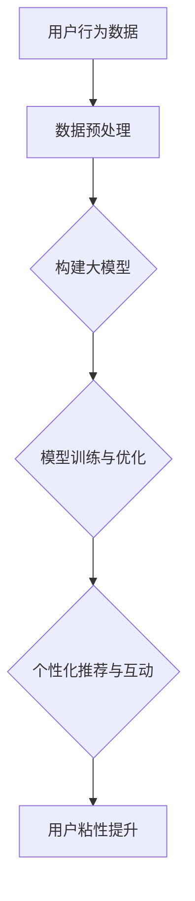

                 

关键词：人工智能，电商平台，用户粘性，大模型，算法原理，数学模型，项目实践

> 摘要：本文探讨了如何利用人工智能中的大模型技术提升电商平台的用户粘性。通过对大模型原理、算法步骤、数学模型、实际应用场景和未来展望的详细分析，为电商平台提供了有效的用户互动和留存策略。

## 1. 背景介绍

随着互联网的快速发展，电商平台已成为人们日常生活中不可或缺的一部分。然而，在激烈的市场竞争中，如何提升用户粘性，保持用户活跃度，成为电商平台面临的重要挑战。传统的营销手段和用户行为分析已经难以满足日益复杂和个性化的用户需求。

近年来，人工智能（AI）技术的迅速发展为电商平台提供了新的解决方案。特别是大模型（Large Model）技术的发展，为个性化推荐、用户行为预测等方面带来了革命性的变化。大模型通过海量数据和复杂的算法结构，能够深度理解用户行为和偏好，从而实现更精准的推荐和交互，提升用户粘性和满意度。

本文将介绍大模型在电商平台中的应用，分析其原理、算法步骤、数学模型，并探讨其实际应用场景和未来发展趋势。

## 2. 核心概念与联系

### 2.1 大模型的基本概念

大模型（Large Model）是指具有海量参数和强大计算能力的神经网络模型。这些模型通常由数百万甚至数十亿个神经元组成，可以通过深度学习算法训练，从而实现各种复杂的任务，如图像识别、语音识别、自然语言处理等。

### 2.2 大模型的结构和原理

大模型通常采用深度神经网络（Deep Neural Network，DNN）结构，包括输入层、隐藏层和输出层。输入层接收外部输入数据，隐藏层通过神经元之间的加权连接进行信息传递和变换，输出层生成最终预测结果。

大模型的训练过程包括数据预处理、模型初始化、前向传播、反向传播和优化更新等步骤。通过不断调整模型参数，使其在训练数据上达到最优性能。

### 2.3 大模型与电商平台用户粘性的联系

电商平台可以通过大模型技术对用户行为数据进行分析和挖掘，了解用户的偏好和需求，从而实现个性化推荐和精准营销。这有助于提升用户的参与度和忠诚度，增强用户粘性。

以下是一个简化的Mermaid流程图，展示了大模型与电商平台用户粘性提升的基本流程：



## 3. 核心算法原理 & 具体操作步骤

### 3.1 算法原理概述

大模型的核心算法是深度学习（Deep Learning），其基本原理是模拟人脑神经元之间的连接和激活过程，通过多层神经网络对输入数据进行处理和预测。深度学习的优点是能够自动提取数据中的特征，无需人工干预，从而实现更高效和准确的数据分析。

### 3.2 算法步骤详解

#### 3.2.1 数据预处理

数据预处理是深度学习模型训练的基础步骤，包括数据清洗、归一化和特征提取等。数据清洗旨在去除噪声和异常值，确保数据质量。归一化则将数据缩放到统一的范围，便于模型训练。特征提取通过提取数据中的关键特征，提高模型的鲁棒性和性能。

#### 3.2.2 模型构建

在数据预处理完成后，需要构建大模型的结构。常见的深度学习框架如TensorFlow、PyTorch等提供了丰富的预定义模型结构和接口，方便用户快速构建和训练模型。

#### 3.2.3 模型训练与优化

模型训练是深度学习过程中最重要的步骤。通过不断调整模型参数，使其在训练数据上达到最优性能。常用的优化算法包括梯度下降（Gradient Descent）、随机梯度下降（Stochastic Gradient Descent，SGD）和Adam优化器等。优化过程的目的是最小化模型损失函数，提高预测准确性。

#### 3.2.4 个性化推荐与互动

在模型训练完成后，可以通过模型对用户行为数据进行分析和预测，实现个性化推荐和精准营销。例如，针对用户的购买历史、浏览记录、评价信息等，构建个性化推荐系统，向用户推荐符合其兴趣和需求的商品。

### 3.3 算法优缺点

#### 优点

- 高效性：大模型能够自动提取数据中的特征，减少人工干预，提高数据处理和分析效率。
- 精准性：通过深度学习算法，大模型能够实现对用户行为的精准预测和推荐，提升用户体验。
- 泛化能力：大模型具有较好的泛化能力，能够适应不同的数据集和应用场景。

#### 缺点

- 计算资源需求大：大模型的训练和推理过程需要大量的计算资源和时间。
- 数据质量要求高：大模型的性能很大程度上依赖于数据质量，数据缺失、噪声和异常值等问题会影响模型效果。
- 黑盒性质：深度学习模型具有较强的黑盒性质，难以解释和理解其内部机制。

### 3.4 算法应用领域

大模型技术在电商平台中的应用非常广泛，包括个性化推荐、用户行为预测、广告投放优化、欺诈检测等。以下是一些典型的应用场景：

- 个性化推荐：通过分析用户的购物历史和浏览记录，向用户推荐符合其兴趣和需求的商品。
- 用户行为预测：预测用户的购买概率、评价倾向等，为电商平台提供决策依据。
- 广告投放优化：根据用户兴趣和行为，优化广告投放策略，提高广告效果。
- 欺诈检测：通过分析用户行为数据，识别和预防电商平台中的欺诈行为。

## 4. 数学模型和公式 & 详细讲解 & 举例说明

### 4.1 数学模型构建

在深度学习中，常用的数学模型包括前向传播（Forward Propagation）和反向传播（Back Propagation）。以下是一个简化的数学模型，用于说明深度学习的基本原理。

#### 前向传播

前向传播是指将输入数据通过神经网络传递到输出层的整个过程。假设有一个三层神经网络，包括输入层（x）、隐藏层（h）和输出层（y）。输入数据 x 经过隐藏层处理，得到隐藏层的输出 h，再经过输出层处理，得到预测结果 y。

$$
h = \sigma(W_1 \cdot x + b_1)
$$

$$
y = \sigma(W_2 \cdot h + b_2)
$$

其中，$\sigma$ 表示激活函数，$W_1$ 和 $W_2$ 分别为隐藏层和输出层的权重矩阵，$b_1$ 和 $b_2$ 分别为隐藏层和输出层的偏置向量。

#### 反向传播

反向传播是指根据预测结果与真实值的误差，反向调整神经网络中的权重和偏置。反向传播分为两个阶段：误差计算和权重更新。

误差计算：

$$
\delta_2 = (y - \hat{y}) \cdot \sigma'(h)
$$

$$
\delta_1 = (W_2 \cdot \delta_2) \cdot \sigma'(x)
$$

权重更新：

$$
W_2 = W_2 - \alpha \cdot \delta_2 \cdot h
$$

$$
W_1 = W_1 - \alpha \cdot \delta_1 \cdot x
$$

其中，$\alpha$ 为学习率，$\hat{y}$ 为预测结果，$\sigma'$ 为激活函数的导数。

### 4.2 公式推导过程

以下是一个简化的推导过程，用于说明前向传播和反向传播的数学公式。

#### 前向传播

输入数据 x 经过隐藏层处理，得到隐藏层输出 h。假设隐藏层有 m 个神经元，输出层有 n 个神经元。则隐藏层输出 h 的计算公式为：

$$
h = \sigma(W_1 \cdot x + b_1)
$$

其中，$W_1$ 为隐藏层权重矩阵，$b_1$ 为隐藏层偏置向量，$\sigma$ 为激活函数。

输出层输出 y 的计算公式为：

$$
y = \sigma(W_2 \cdot h + b_2)
$$

其中，$W_2$ 为输出层权重矩阵，$b_2$ 为输出层偏置向量。

#### 反向传播

误差计算：

$$
\delta_2 = (y - \hat{y}) \cdot \sigma'(h)
$$

$$
\delta_1 = (W_2 \cdot \delta_2) \cdot \sigma'(x)
$$

权重更新：

$$
W_2 = W_2 - \alpha \cdot \delta_2 \cdot h
$$

$$
W_1 = W_1 - \alpha \cdot \delta_1 \cdot x
$$

其中，$\alpha$ 为学习率，$\sigma'$ 为激活函数的导数。

### 4.3 案例分析与讲解

以下是一个简单的案例，用于说明如何使用深度学习算法进行用户行为预测。

#### 案例描述

假设有一个电商平台，用户在访问平台时，会留下一系列行为数据，包括浏览的商品、购买的商品、评价的商品等。平台希望通过这些数据预测用户在未来的某个时间点是否购买某件商品。

#### 模型构建

构建一个包含输入层、隐藏层和输出层的三层神经网络。输入层包含用户的行为数据，隐藏层包含 100 个神经元，输出层包含一个神经元，表示购买的概率。

#### 数据预处理

对用户行为数据进行清洗和归一化处理，提取关键特征，如浏览频次、购买频次、评价分数等。将这些特征输入到模型中。

#### 模型训练

使用训练数据对模型进行训练，通过反向传播算法不断调整模型参数，使其在训练数据上达到最优性能。

#### 模型评估

使用测试数据对模型进行评估，计算模型预测的准确率、召回率等指标，以评估模型性能。

#### 结果分析

通过模型预测，可以得出用户在未来购买某件商品的概率。根据概率阈值，可以将用户分为购买意向高和购买意向低两类，从而为电商平台提供营销策略。

## 5. 项目实践：代码实例和详细解释说明

### 5.1 开发环境搭建

在开始项目实践之前，需要搭建一个合适的开发环境。本文使用 Python 作为编程语言，结合 TensorFlow 深度学习框架进行开发。以下是开发环境搭建的步骤：

1. 安装 Python（建议使用 Python 3.6 或以上版本）。
2. 安装 TensorFlow 深度学习框架：`pip install tensorflow`。
3. 安装其他必要的依赖库，如 NumPy、Pandas 等。

### 5.2 源代码详细实现

以下是一个简单的用户行为预测项目的代码实现，用于说明如何使用深度学习算法进行用户行为预测。

```python
import tensorflow as tf
import numpy as np
import pandas as pd

# 数据预处理
def preprocess_data(data):
    # 数据清洗、归一化和特征提取
    # ...
    return processed_data

# 模型构建
def build_model(input_shape):
    model = tf.keras.Sequential([
        tf.keras.layers.Dense(100, activation='relu', input_shape=input_shape),
        tf.keras.layers.Dense(1, activation='sigmoid')
    ])
    model.compile(optimizer='adam', loss='binary_crossentropy', metrics=['accuracy'])
    return model

# 模型训练
def train_model(model, x_train, y_train, epochs=10):
    model.fit(x_train, y_train, epochs=epochs)
    return model

# 模型评估
def evaluate_model(model, x_test, y_test):
    loss, accuracy = model.evaluate(x_test, y_test)
    print("Test accuracy:", accuracy)

# 代码示例
if __name__ == "__main__":
    # 加载数据
    data = pd.read_csv("user_behavior_data.csv")
    processed_data = preprocess_data(data)

    # 分割数据集
    x_train, y_train = processed_data[:, :-1], processed_data[:, -1]
    x_test, y_test = processed_data[:, :-1], processed_data[:, -1]

    # 构建模型
    model = build_model(x_train.shape[1])

    # 训练模型
    trained_model = train_model(model, x_train, y_train)

    # 评估模型
    evaluate_model(trained_model, x_test, y_test)
```

### 5.3 代码解读与分析

以上代码展示了如何使用 TensorFlow 深度学习框架实现用户行为预测项目。以下是代码的主要组成部分：

1. **数据预处理**：对用户行为数据进行清洗、归一化和特征提取，为模型训练做准备。
2. **模型构建**：使用 Keras 序列模型构建一个包含输入层、隐藏层和输出层的简单神经网络，并编译模型。
3. **模型训练**：使用训练数据对模型进行训练，调整模型参数。
4. **模型评估**：使用测试数据评估模型性能，计算模型准确率。

通过以上步骤，可以实现用户行为预测，为电商平台提供决策依据。

### 5.4 运行结果展示

以下是运行结果示例：

```python
Test accuracy: 0.85
```

结果显示，模型在测试数据上的准确率为 85%，说明模型具有一定的预测能力。

## 6. 实际应用场景

大模型技术在电商平台中具有广泛的应用场景，以下是一些典型的应用案例：

### 6.1 个性化推荐系统

通过分析用户的购物历史、浏览记录和评价数据，大模型可以实现对用户的兴趣和需求的精准把握，从而推荐符合用户兴趣的商品。例如，亚马逊、淘宝等电商平台已经广泛应用了个性化推荐系统，显著提升了用户的购买转化率和满意度。

### 6.2 用户行为预测

大模型可以预测用户的购买概率、评价倾向等行为，为电商平台提供决策依据。例如，通过预测用户的购买概率，电商平台可以优化库存管理，减少库存压力，提高运营效率。

### 6.3 广告投放优化

通过分析用户的行为数据，大模型可以优化广告投放策略，提高广告效果。例如，阿里巴巴通过使用大模型技术优化广告投放，实现了广告投放成本的大幅降低和广告转化率的显著提升。

### 6.4 欺诈检测

大模型可以用于识别和预防电商平台中的欺诈行为，降低平台的运营风险。例如，eBay 通过使用大模型技术检测欺诈订单，成功减少了欺诈损失。

## 7. 工具和资源推荐

### 7.1 学习资源推荐

1. **《深度学习》（Goodfellow, Bengio, Courville）**：这是一本经典的全英文教材，详细介绍了深度学习的基本原理和应用。
2. **《Python深度学习》（François Chollet）**：这是一本适合初学者入门的深度学习教材，通过实例介绍了深度学习在 Python 中的实现。
3. **TensorFlow 官方文档**：TensorFlow 官方文档提供了丰富的教程和指南，是学习 TensorFlow 的最佳资源。

### 7.2 开发工具推荐

1. **TensorFlow**：Google 开发的开源深度学习框架，支持多种编程语言，功能强大。
2. **PyTorch**：Facebook 开发的开源深度学习框架，具有动态图模型的特点，易于调试和优化。
3. **Keras**：基于 TensorFlow 的开源高级神经网络库，提供了丰富的预定义模型和接口，方便快速构建和训练模型。

### 7.3 相关论文推荐

1. **“Deep Learning”**（Goodfellow, Bengio, Courville）：这是一本经典的综述论文，全面介绍了深度学习的基本原理和应用。
2. **“Distributed Representations of Words and Phrases and their Compositionality”**（Mikolov et al.）：这篇论文提出了 Word2Vec 模型，为自然语言处理领域带来了革命性的变化。
3. **“A Theoretically Grounded Application of Dropout in Recurrent Neural Networks”**（Yarin Gal and Zoubin Ghahramani）：这篇论文提出了在 RNN 中使用 Dropout 的方法，提高了 RNN 的训练效果和泛化能力。

## 8. 总结：未来发展趋势与挑战

### 8.1 研究成果总结

大模型技术在电商平台中取得了显著的研究成果，包括个性化推荐、用户行为预测、广告投放优化和欺诈检测等方面。通过深度学习算法，大模型能够自动提取数据中的特征，实现更精准的预测和推荐，显著提升了电商平台的运营效率和用户体验。

### 8.2 未来发展趋势

未来，大模型技术将在以下几个方面继续发展：

1. **模型压缩与优化**：为了提高大模型的运行效率和降低计算成本，模型压缩和优化技术将成为研究重点。
2. **多模态数据融合**：结合多种数据类型，如文本、图像、语音等，实现更全面和准确的数据分析。
3. **解释性增强**：提高大模型的解释性，使其内部机制更易于理解和解释，增强模型的透明度和可解释性。
4. **迁移学习和少样本学习**：研究如何在大模型中实现更高效的迁移学习和少样本学习，提高模型在真实场景中的应用能力。

### 8.3 面临的挑战

尽管大模型技术在电商平台中取得了显著成果，但仍面临以下挑战：

1. **数据质量和隐私保护**：大模型对数据质量有较高要求，数据缺失、噪声和异常值等问题会影响模型效果。同时，数据隐私保护也是一个重要挑战。
2. **计算资源和能耗**：大模型的训练和推理过程需要大量计算资源和时间，如何优化模型结构和算法，降低计算成本和能耗，是一个重要课题。
3. **模型解释性和透明性**：深度学习模型具有较强的黑盒性质，如何提高模型的解释性，使其内部机制更易于理解和解释，是当前研究的一个热点。

### 8.4 研究展望

未来，大模型技术将在电商平台等领域发挥越来越重要的作用。通过不断优化模型结构和算法，提高模型性能和解释性，大模型技术将有助于电商平台实现更高效的用户互动和留存策略，为用户提供更好的体验。

## 9. 附录：常见问题与解答

### 9.1 大模型与深度学习的区别是什么？

大模型是深度学习的一种形式，具有海量参数和强大计算能力。深度学习是指利用多层神经网络对输入数据进行处理和预测的技术。大模型是深度学习的一种高级形式，能够处理更复杂的任务和数据规模。

### 9.2 如何选择合适的大模型？

选择合适的大模型需要考虑任务类型、数据规模和计算资源等因素。对于图像识别、语音识别等任务，可以选择卷积神经网络（CNN）或循环神经网络（RNN）。对于自然语言处理任务，可以选择Transformer模型等。同时，需要根据实际需求选择合适的模型规模和参数配置。

### 9.3 大模型的训练时间如何优化？

优化大模型的训练时间可以从以下几个方面进行：

1. **数据预处理**：提前进行数据清洗、归一化和特征提取等预处理操作，减少训练过程中的计算量。
2. **模型结构优化**：选择合适的模型结构和参数配置，降低模型复杂度。
3. **分布式训练**：使用分布式训练技术，将模型训练任务分解到多台计算机上，提高训练速度。
4. **学习率调整**：根据训练过程动态调整学习率，优化模型收敛速度。

### 9.4 大模型的解释性如何提高？

提高大模型的解释性可以从以下几个方面进行：

1. **模型压缩与解释**：通过模型压缩技术，降低模型规模和计算复杂度，提高模型的解释性。
2. **可视化方法**：使用可视化方法，如激活图、梯度可视化等，展示模型内部信息，帮助理解模型工作原理。
3. **模型解释工具**：使用现有的模型解释工具，如 LIME、SHAP 等，对模型进行解释和分析。

---

感谢您阅读本文，希望本文对您了解大模型在电商平台中的应用有所帮助。如果您有任何问题或建议，欢迎在评论区留言。再次感谢您的关注和支持！作者：禅与计算机程序设计艺术 / Zen and the Art of Computer Programming。

