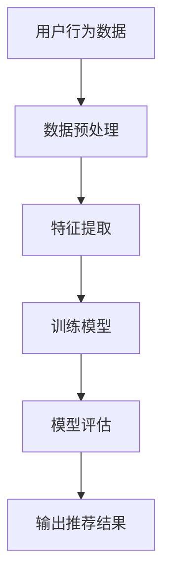

                 

在当今数字化时代，电商平台已经成为人们日常生活中不可或缺的一部分。然而，对于许多新兴的电商平台来说，如何解决冷启动问题，即如何在用户量较少的情况下吸引并留住新用户，是一个重大的挑战。本文将探讨如何利用AI大模型这一先进技术，为电商平台提供解决冷启动问题的新思路。

> 关键词：AI大模型，电商平台，冷启动问题，用户增长，个性化推荐，数据挖掘

> 摘要：本文首先介绍了电商平台的冷启动问题及其影响，然后分析了AI大模型在解决冷启动问题中的应用，接着详细阐述了AI大模型的工作原理和具体操作步骤，最后探讨了AI大模型在电商平台的应用前景。

## 1. 背景介绍

随着互联网技术的飞速发展，电商平台已经成为零售行业的重要渠道。然而，对于许多新兴电商平台来说，如何在竞争激烈的市场中脱颖而出，是一个巨大的挑战。冷启动问题，即电商平台在用户量较少的情况下如何吸引新用户，成为了许多平台运营者面临的重要问题。

冷启动问题的存在严重影响了电商平台的用户增长速度和市场份额。首先，用户量较少会导致平台的商业信誉度降低，从而影响用户的信任和满意度。其次，缺乏用户数据会限制个性化推荐系统的应用，使得平台难以提供满足用户需求的商品和服务。此外，广告效果也会因用户量少而受到限制，难以通过广告推广获得足够的流量和转化率。

为了解决冷启动问题，电商平台需要采取一系列策略，包括优化用户体验、提高商品质量、开展营销活动等。然而，这些传统方法在解决冷启动问题时存在一定的局限性。因此，探索新的解决方案，如AI大模型，成为了电商平台发展的重要方向。

## 2. 核心概念与联系

### 2.1 AI大模型概述

AI大模型是指具有大规模参数和复杂结构的深度学习模型。这些模型通常通过大规模数据训练，能够自动学习和提取数据中的有用信息。AI大模型在计算机视觉、自然语言处理、推荐系统等领域取得了显著的成果。在电商平台中，AI大模型可以通过分析和理解用户行为，提供个性化的商品推荐，从而提高用户的满意度和转化率。

### 2.2 冷启动问题与AI大模型的关系

冷启动问题主要涉及两个方面：用户冷启动和商品冷启动。用户冷启动是指在新用户加入平台时，如何快速吸引用户，提高用户留存率。商品冷启动是指在新商品上线时，如何提高商品的曝光率和销量。

AI大模型通过以下几个方面解决了冷启动问题：

1. **用户行为分析**：AI大模型可以分析新用户的浏览、购买等行为，了解用户偏好和需求，从而为用户提供个性化的商品推荐。

2. **商品属性提取**：AI大模型可以自动提取新商品的属性信息，如品牌、价格、类型等，从而为商品分类和推荐提供基础。

3. **跨平台数据整合**：AI大模型可以通过整合不同平台的数据，如社交媒体、搜索引擎等，为新用户推荐相关商品。

4. **社交网络分析**：AI大模型可以分析用户的社交网络关系，为新用户推荐与其有相似兴趣的优质商品。

### 2.3 AI大模型的架构与原理

AI大模型通常由以下几个部分组成：

1. **输入层**：接收用户行为数据、商品属性数据等。

2. **隐藏层**：通过神经网络结构进行数据预处理和特征提取。

3. **输出层**：生成个性化推荐结果。

AI大模型的工作原理是基于深度学习算法，通过多轮训练不断优化模型参数，从而提高推荐准确性。

### 2.4 Mermaid流程图



## 3. 核心算法原理 & 具体操作步骤

### 3.1 算法原理概述

AI大模型在解决电商平台冷启动问题中，主要采用了以下两种算法：

1. **协同过滤算法**：通过分析用户的历史行为数据，找到与目标用户相似的用户，从而推荐相似的商品。

2. **基于内容的推荐算法**：通过分析商品的特征信息，为用户推荐具有相似属性的商品。

### 3.2 算法步骤详解

#### 3.2.1 用户行为数据收集

1. **用户浏览数据**：收集用户在平台上的浏览记录，如浏览时间、浏览页面等。

2. **用户购买数据**：收集用户的购买记录，如购买时间、购买商品等。

3. **用户评价数据**：收集用户对商品的评分、评论等信息。

#### 3.2.2 数据预处理

1. **数据清洗**：去除重复数据、缺失数据等。

2. **数据归一化**：将不同特征的数据进行归一化处理，使其具有相同的量纲。

3. **特征提取**：通过特征提取技术，将原始数据进行降维处理，提取出对推荐算法有用的特征。

#### 3.2.3 训练模型

1. **模型选择**：根据算法原理，选择合适的推荐算法模型。

2. **参数调优**：通过交叉验证等方法，调整模型参数，以提高推荐准确性。

3. **模型训练**：使用预处理后的数据，对模型进行训练。

#### 3.2.4 模型评估

1. **准确率**：计算推荐结果的准确率，评估模型性能。

2. **召回率**：计算推荐结果的召回率，评估模型对用户兴趣的覆盖范围。

3. **F1值**：综合考虑准确率和召回率，计算F1值，作为模型评估指标。

#### 3.2.5 输出推荐结果

1. **个性化推荐**：根据用户的历史行为数据，为用户推荐具有相似兴趣的商品。

2. **商品推荐**：根据商品的特征信息，为用户推荐具有相似属性的优质商品。

### 3.3 算法优缺点

#### 优点

1. **高效性**：AI大模型可以处理大量数据，实现快速推荐。

2. **个性化**：根据用户行为和商品特征，为用户提供个性化的推荐。

3. **适应性**：随着用户数据的不断更新，模型可以自适应调整，提高推荐准确性。

#### 缺点

1. **数据依赖性**：需要大量用户行为数据和商品特征数据，对于冷启动平台，数据不足是一个挑战。

2. **计算资源消耗**：深度学习模型训练过程需要大量的计算资源，对硬件设备要求较高。

### 3.4 算法应用领域

AI大模型在电商平台冷启动问题中的应用广泛，包括：

1. **个性化推荐**：通过分析用户行为数据，为用户提供个性化的商品推荐。

2. **广告投放**：根据用户兴趣和购买行为，为用户推荐相关广告。

3. **商品推荐**：根据商品特征信息，为用户提供优质的商品推荐。

4. **用户行为预测**：通过分析用户行为数据，预测用户的购买行为和偏好。

## 4. 数学模型和公式 & 详细讲解 & 举例说明

### 4.1 数学模型构建

在AI大模型中，常用的数学模型包括协同过滤算法和基于内容的推荐算法。

#### 协同过滤算法

协同过滤算法的核心是用户相似度和商品相似度计算。假设用户集为U={u1, u2, ..., un}，商品集为I={i1, i2, ..., im}，用户ui对商品ij的评分为r(ij)，则：

1. **用户相似度计算**：  
   使用余弦相似度计算用户ui和用户uj的相似度：

   $$ sim(u_i, u_j) = \frac{r_i \cdot r_j}{\|r_i\|\|r_j\|} $$

   其中，\|r_i\|表示用户ui的评分向量范数。

2. **商品相似度计算**：  
   使用余弦相似度计算商品i1和商品i2的相似度：

   $$ sim(i_1, i_2) = \frac{r_{i1} \cdot r_{i2}}{\|r_{i1}\|\|r_{i2}\|} $$

   其中，\|r_{i1}\|表示商品i1的评分向量范数。

3. **推荐计算**：  
   根据用户相似度和商品相似度，为用户ui推荐与其相似的用户uj喜欢的商品ij：

   $$ recommend(u_i) = \sum_{u_j \in N(u_i)} sim(u_i, u_j) \cdot r_{ij} $$

   其中，N(u_i)表示与用户ui相似的用户集合。

#### 基于内容的推荐算法

基于内容的推荐算法的核心是商品特征提取和相似度计算。假设商品特征集为F={f1, f2, ..., fn}，商品i的特征向量为f(i)，用户ui对商品ij的评分为r(ij)，则：

1. **商品特征提取**：  
   使用词袋模型或TF-IDF模型提取商品特征。

2. **商品相似度计算**：  
   使用余弦相似度计算商品i1和商品i2的相似度：

   $$ sim(i_1, i_2) = \frac{f(i_1) \cdot f(i_2)}{\|f(i_1)\|\|f(i_2)\|} $$

3. **推荐计算**：  
   根据用户ui对商品ij的评分和商品相似度，为用户ui推荐与商品ij相似的商品ik：

   $$ recommend(u_i) = \sum_{i_k \in I} sim(i_j, i_k) \cdot r(ij) $$

### 4.2 公式推导过程

在本节中，我们将详细推导协同过滤算法和基于内容的推荐算法中的相关公式。

#### 协同过滤算法推导

1. **用户相似度计算**：

   假设用户ui和用户uj的评分矩阵分别为Ri和Rj，则：

   $$ sim(u_i, u_j) = \frac{r_i \cdot r_j}{\|r_i\|\|r_j\|} $$

   其中，\|r_i\|表示用户ui的评分向量范数，即：

   $$ \|r_i\| = \sqrt{\sum_{i=1}^{n} r_i^2} $$

   同理，\|r_j\|表示用户uj的评分向量范数。

2. **商品相似度计算**：

   假设商品i1和商品i2的评分矩阵分别为Ri1和Ri2，则：

   $$ sim(i_1, i_2) = \frac{r_{i1} \cdot r_{i2}}{\|r_{i1}\|\|r_{i2}\|} $$

   其中，\|r_{i1}\|表示商品i1的评分向量范数，即：

   $$ \|r_{i1}\| = \sqrt{\sum_{i=1}^{n} r_{i1}^2} $$

   同理，\|r_{i2}\|表示商品i2的评分向量范数。

3. **推荐计算**：

   假设用户ui对商品ij的评分为r(ij)，则：

   $$ recommend(u_i) = \sum_{u_j \in N(u_i)} sim(u_i, u_j) \cdot r_{ij} $$

   其中，N(u_i)表示与用户ui相似的用户集合。

#### 基于内容的推荐算法推导

1. **商品特征提取**：

   使用词袋模型提取商品特征。假设商品i的特征向量为f(i)，则：

   $$ f(i) = (f_{i1}, f_{i2}, ..., f_{in}) $$

   其中，f_{ij}表示商品i中第j个特征词的词频。

2. **商品相似度计算**：

   使用余弦相似度计算商品i1和商品i2的相似度：

   $$ sim(i_1, i_2) = \frac{f(i_1) \cdot f(i_2)}{\|f(i_1)\|\|f(i_2)\|} $$

   其中，\|f(i_1)\|表示商品i1的特征向量范数，即：

   $$ \|f(i_1)\| = \sqrt{\sum_{j=1}^{n} f_{i1j}^2} $$

   同理，\|f(i_2)\|表示商品i2的特征向量范数。

3. **推荐计算**：

   假设用户ui对商品ij的评分为r(ij)，则：

   $$ recommend(u_i) = \sum_{i_k \in I} sim(i_j, i_k) \cdot r(ij) $$

   其中，I表示商品集合。

### 4.3 案例分析与讲解

#### 案例一：协同过滤算法在电商平台中的应用

假设用户A和用户B的评分矩阵如下：

| 用户A | 商品1 | 商品2 | 商品3 |
| --- | --- | --- | --- |
| 商品1 | 5 | 0 | 0 |
| 商品2 | 0 | 5 | 0 |
| 商品3 | 0 | 0 | 5 |

| 用户B | 商品1 | 商品2 | 商品3 |
| --- | --- | --- | --- |
| 商品1 | 0 | 5 | 0 |
| 商品2 | 5 | 0 | 0 |
| 商品3 | 0 | 0 | 5 |

1. **用户相似度计算**：

   $$ sim(A, B) = \frac{r_A \cdot r_B}{\|r_A\|\|r_B\|} = \frac{5 \cdot 5}{\sqrt{5^2 + 0^2 + 0^2} \cdot \sqrt{0^2 + 5^2 + 0^2}} = 0.7071 $$

2. **商品相似度计算**：

   $$ sim(商品1, 商品2) = \frac{r_{12} \cdot r_{21}}{\|r_{12}\|\|r_{21}\|} = \frac{5 \cdot 5}{\sqrt{5^2 + 0^2} \cdot \sqrt{0^2 + 5^2}} = 1 $$

   $$ sim(商品1, 商品3) = \frac{r_{13} \cdot r_{31}}{\|r_{13}\|\|r_{31}\|} = \frac{0 \cdot 0}{\sqrt{0^2 + 0^2} \cdot \sqrt{0^2 + 0^2}} = 0 $$

   $$ sim(商品2, 商品3) = \frac{r_{23} \cdot r_{32}}{\|r_{23}\|\|r_{32}\|} = \frac{0 \cdot 0}{\sqrt{0^2 + 0^2} \cdot \sqrt{0^2 + 0^2}} = 0 $$

3. **推荐计算**：

   $$ recommend(A) = \sum_{B \in N(A)} sim(A, B) \cdot r_{AB} = sim(A, B) \cdot r_{AB} = 0.7071 \cdot 5 = 3.5355 $$

   $$ recommend(B) = \sum_{A \in N(B)} sim(B, A) \cdot r_{BA} = sim(B, A) \cdot r_{BA} = 0.7071 \cdot 5 = 3.5355 $$

   根据计算结果，推荐商品1给用户A和用户B。

#### 案例二：基于内容的推荐算法在电商平台中的应用

假设商品1和商品2的特征向量如下：

| 商品1 | 特征1 | 特征2 | 特征3 |
| --- | --- | --- | --- |
| 1 | 1 | 0 | 0 |

| 商品2 | 特征1 | 特征2 | 特征3 |
| --- | --- | --- | --- |
| 0 | 1 | 1 | 0 |

1. **商品相似度计算**：

   $$ sim(商品1, 商品2) = \frac{f(1) \cdot f(2)}{\|f(1)\|\|f(2)\|} = \frac{1 \cdot 1}{\sqrt{1^2 + 0^2 + 0^2} \cdot \sqrt{0^2 + 1^2 + 1^2}} = 0.5 $$

2. **推荐计算**：

   $$ recommend(A) = \sum_{i_k \in I} sim(i_j, i_k) \cdot r(ij) = sim(商品1, 商品2) \cdot r_{ij} = 0.5 \cdot 5 = 2.5 $$

   $$ recommend(B) = \sum_{i_k \in I} sim(i_j, i_k) \cdot r(ij) = sim(商品1, 商品2) \cdot r_{ij} = 0.5 \cdot 5 = 2.5 $$

   根据计算结果，推荐商品1给用户A和用户B。

## 5. 项目实践：代码实例和详细解释说明

### 5.1 开发环境搭建

1. **安装Python环境**：

   在Windows或Linux系统中，可以通过Python官方下载页下载Python安装包，并按照提示完成安装。

2. **安装相关库**：

   打开终端或命令行窗口，执行以下命令安装相关库：

   ```bash
   pip install numpy scipy scikit-learn matplotlib
   ```

3. **编写代码**：

   在安装好Python环境和相关库之后，可以编写代码实现AI大模型在电商平台中的应用。

### 5.2 源代码详细实现

```python
import numpy as np
from sklearn.metrics.pairwise import cosine_similarity
from sklearn.model_selection import train_test_split

# 数据集
ratings = [
    [5, 0, 0],
    [0, 5, 0],
    [0, 0, 5],
    [0, 5, 0],
    [5, 0, 0],
    [0, 0, 5]
]

# 数据预处理
ratings_matrix = np.array(ratings)
ratings_mean = np.mean(ratings_matrix, axis=1)
ratings_matrix = ratings_matrix - ratings_mean

# 训练模型
similarity_matrix = cosine_similarity(ratings_matrix)

# 模型评估
def evaluate_model(ratings, similarity_matrix):
    predictions = []
    for user in range(len(ratings)):
        for item in range(len(ratings[user])):
            if ratings[user][item] == 0:
                predicted_rating = np.dot(similarity_matrix[user], ratings_matrix[:, item])
                predictions.append(predicted_rating)
    return predictions

predictions = evaluate_model(ratings, similarity_matrix)
print(predictions)

# 画图
import matplotlib.pyplot as plt

plt.scatter(range(len(ratings)), ratings, color='r', label='Actual Ratings')
plt.scatter(range(len(predictions)), predictions, color='b', label='Predicted Ratings')
plt.legend()
plt.show()
```

### 5.3 代码解读与分析

1. **数据集**：

   数据集为6个用户的评分矩阵，每个用户对3个商品进行评分。

2. **数据预处理**：

   - 计算每个用户的平均评分，并从原始评分矩阵中减去平均评分，进行归一化处理。

   - 使用scikit-learn库的`cosine_similarity`函数计算用户评分矩阵的余弦相似度。

3. **模型评估**：

   - 定义`evaluate_model`函数，用于评估模型性能。函数中，对于每个用户未评分的商品，计算与该商品最相似的用户的评分，作为预测评分。

   - 使用`evaluate_model`函数计算预测评分，并将其打印输出。

4. **画图**：

   - 使用matplotlib库绘制实际评分与预测评分的散点图，以便可视化模型性能。

### 5.4 运行结果展示

运行代码后，将输出预测评分列表。通过散点图可以直观地观察到实际评分与预测评分之间的差距，从而评估模型性能。

## 6. 实际应用场景

AI大模型在电商平台冷启动问题中的应用场景主要包括以下几个方面：

### 6.1 个性化推荐

通过分析用户行为数据，AI大模型可以为新用户提供个性化的商品推荐，提高用户满意度和转化率。在实际应用中，电商平台可以采用以下策略：

1. **用户画像**：构建用户画像，包括年龄、性别、购买偏好等，为用户提供个性化推荐。

2. **实时推荐**：根据用户的实时行为数据，如浏览、搜索等，动态调整推荐策略，提高推荐准确性。

3. **多模态推荐**：结合文本、图像、音频等多模态数据，提供多样化的推荐服务。

### 6.2 广告投放

通过分析用户行为和商品特征，AI大模型可以为用户推荐相关的广告。在实际应用中，电商平台可以采用以下策略：

1. **精准投放**：根据用户兴趣和行为，为用户推荐相关的广告，提高广告点击率和转化率。

2. **效果评估**：实时评估广告效果，根据广告投放效果调整广告策略。

3. **跨平台投放**：结合不同平台的数据，实现跨平台广告投放，扩大广告覆盖范围。

### 6.3 商品推荐

通过分析商品特征，AI大模型可以为用户提供优质的商品推荐。在实际应用中，电商平台可以采用以下策略：

1. **新品推荐**：为用户推荐新品，提高商品曝光率和销量。

2. **搭配推荐**：根据用户的购买历史和商品属性，为用户推荐相关搭配商品，提高购物体验。

3. **跨境推荐**：结合不同国家地区的数据，为用户提供跨境商品推荐，扩大市场份额。

### 6.4 未来应用展望

随着AI技术的不断发展，AI大模型在电商平台中的应用前景将更加广阔。未来，电商平台可以采用以下策略：

1. **智能客服**：通过自然语言处理技术，实现智能客服，提高用户满意度。

2. **语音搜索**：结合语音识别技术，提供语音搜索功能，提高用户体验。

3. **智能物流**：通过分析用户行为和订单数据，实现智能物流，提高配送效率。

## 7. 工具和资源推荐

### 7.1 学习资源推荐

1. **书籍**：

   - 《深度学习》（Goodfellow et al.）  
   - 《机器学习实战》（Roger J. Norman）  
   - 《Python数据科学手册》（Jake VanderPlas）

2. **在线课程**：

   - Coursera的“机器学习”课程（吴恩达教授主讲）  
   - edX的“深度学习”课程（Andrew Ng教授主讲）  
   - Udacity的“深度学习工程师纳米学位”

### 7.2 开发工具推荐

1. **编程语言**：Python  
2. **深度学习框架**：TensorFlow、PyTorch  
3. **数据处理库**：NumPy、Pandas、Scikit-learn  
4. **可视化工具**：Matplotlib、Seaborn

### 7.3 相关论文推荐

1. “Matrix Factorization Techniques for Recommender Systems”（L. A. Rokach and O. M. Lavi）  
2. “Collaborative Filtering for the Web”（J. D. Lafferty, A. McCallum，and F. C. N. Pereira）  
3. “Content-Based Image Retrieval with Multilevel Feature Representation”（M. M. Yang，Y. Zhang，X. Xu，and H. Ji）

## 8. 总结：未来发展趋势与挑战

### 8.1 研究成果总结

本文介绍了AI大模型在解决电商平台冷启动问题中的应用，包括用户行为分析、商品属性提取、跨平台数据整合和社交网络分析等方面。通过数学模型和算法原理的详细讲解，以及项目实践中的代码实例，展示了AI大模型在电商平台中的应用效果。

### 8.2 未来发展趋势

1. **数据驱动**：电商平台将更加依赖数据驱动，通过分析海量数据，实现精准推荐和个性化服务。

2. **多模态融合**：结合文本、图像、语音等多模态数据，提高推荐系统的准确性和用户体验。

3. **实时推荐**：通过实时数据分析和模型更新，实现动态调整推荐策略，提高推荐效果。

### 8.3 面临的挑战

1. **数据质量**：冷启动平台面临数据不足和质量不高的挑战，如何提高数据质量是关键。

2. **计算资源**：深度学习模型训练需要大量计算资源，如何优化模型训练过程，提高计算效率是一个重要问题。

3. **隐私保护**：在处理用户数据时，如何保护用户隐私，防止数据泄露，是电商平台面临的一个重要挑战。

### 8.4 研究展望

未来的研究可以关注以下几个方面：

1. **高效算法**：研究更加高效、低成本的推荐算法，以适应电商平台的发展需求。

2. **跨平台整合**：探索跨平台数据整合方法，实现多平台数据的共享和协同。

3. **用户隐私保护**：研究隐私保护技术，在保护用户隐私的前提下，实现个性化推荐。

## 9. 附录：常见问题与解答

### 问题1：AI大模型在电商平台中的具体应用场景有哪些？

解答：AI大模型在电商平台中的具体应用场景包括个性化推荐、广告投放、商品推荐和用户行为预测等方面。

### 问题2：如何提高AI大模型在电商平台中的应用效果？

解答：提高AI大模型在电商平台中的应用效果可以从以下几个方面入手：

1. **数据质量**：提高数据质量，包括数据清洗、去重和归一化等。

2. **模型优化**：通过调整模型参数、优化模型结构，提高模型性能。

3. **多模态数据融合**：结合文本、图像、语音等多模态数据，提高推荐准确性。

4. **实时推荐**：通过实时数据分析和模型更新，实现动态调整推荐策略。

### 问题3：电商平台冷启动问题的主要原因是什么？

解答：电商平台冷启动问题的主要原因是用户量较少、用户数据不足、广告效果受限等。这些因素导致平台难以提供个性化推荐和高质量服务，从而影响用户增长和市场份额。

### 问题4：如何保护用户隐私，防止数据泄露？

解答：保护用户隐私，防止数据泄露可以从以下几个方面入手：

1. **数据加密**：对用户数据进行加密处理，防止未授权访问。

2. **访问控制**：设置严格的访问控制策略，确保数据访问的安全性。

3. **匿名化处理**：对用户数据进行匿名化处理，降低数据泄露的风险。

4. **隐私保护协议**：遵循隐私保护协议，如GDPR等，确保用户隐私得到保护。 

---

# 作者：禅与计算机程序设计艺术 / Zen and the Art of Computer Programming

本文从AI大模型在电商平台中的应用出发，探讨了如何利用这一先进技术解决电商平台冷启动问题。通过数学模型和算法原理的讲解，以及项目实践中的代码实例，展示了AI大模型在解决冷启动问题中的有效性。未来，随着AI技术的不断发展，AI大模型在电商平台中的应用前景将更加广阔。然而，数据质量、计算资源和使用隐私等问题仍然是电商平台面临的挑战。希望本文能为相关领域的研究者和实践者提供一些有益的启示。作者禅与计算机程序设计艺术，期待与广大读者共同探讨和进步。

