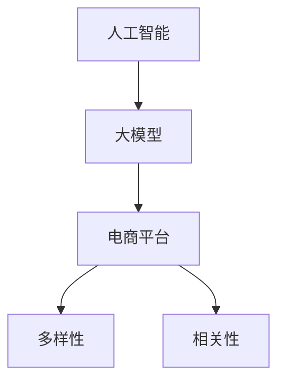
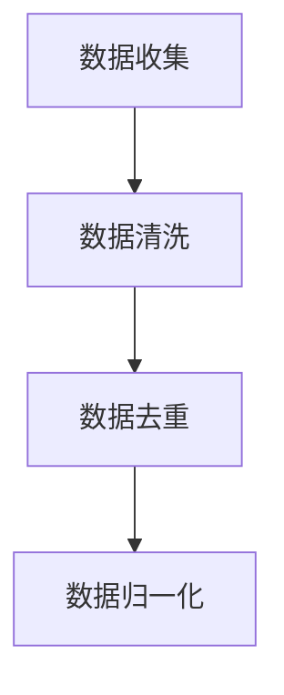
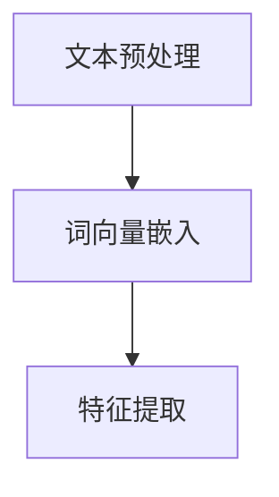
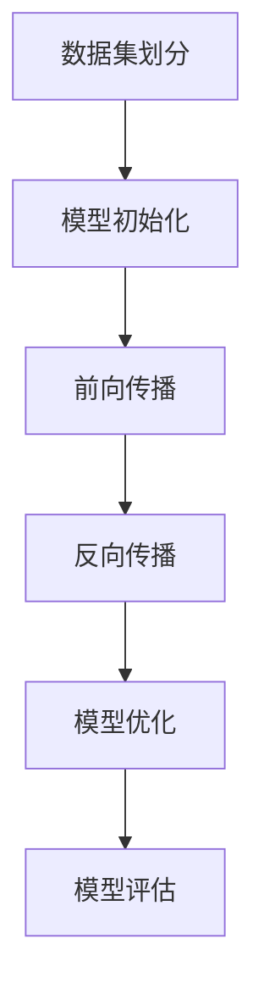
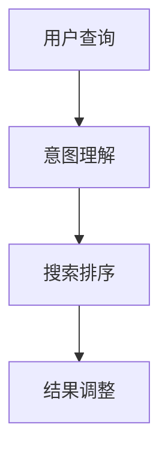
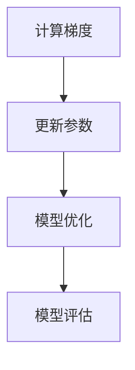

                 

关键词：AI大模型，电商平台，搜索结果，多样性，相关性，动态平衡

> 摘要：本文探讨了如何利用AI大模型改善电商平台的搜索结果，实现多样性与相关性之间的动态平衡。通过对核心概念的阐述、算法原理的剖析、数学模型的构建以及项目实践，本文为电商平台提供了新的技术思路和解决方案。

## 1. 背景介绍

随着电商平台的日益普及，用户对于搜索结果的质量要求越来越高。一方面，用户希望搜索结果能够高度相关，快速找到自己需要的商品；另一方面，用户也希望搜索结果能够丰富多样，避免单调重复。这就给电商平台的搜索算法带来了巨大的挑战：如何在保证相关性高的同时，提高结果的多样性？

当前主流的电商平台搜索算法主要依赖于关键词匹配和机器学习模型，如深度学习、自然语言处理等。这些算法在提高搜索结果相关性方面取得了显著成效，但在多样性方面仍存在一定不足。用户常常遇到搜索结果重复率高、相似性强的现象，这使得用户搜索体验大打折扣。

为了解决这一问题，本文提出利用AI大模型改善电商平台搜索结果，实现多样性与相关性之间的动态平衡。AI大模型具有强大的表示和学习能力，可以更好地捕捉用户需求，优化搜索结果。本文将详细介绍AI大模型的原理、算法、数学模型以及项目实践，为电商平台提供新的技术思路。

## 2. 核心概念与联系

在介绍AI大模型之前，我们先回顾一下与之相关的核心概念：

1. **人工智能（AI）**：指通过计算机程序实现人类智能的学科，包括机器学习、深度学习、自然语言处理等领域。
2. **大模型**：指具有数百万到数十亿参数的神经网络模型，如GPT、BERT等。这些模型在训练过程中可以学习到大量知识，具有较强的表示能力和泛化能力。
3. **电商平台**：指在线销售商品的平台，如淘宝、京东、亚马逊等。电商平台通过提供商品搜索、推荐等功能，满足用户购物需求。
4. **多样性**：指搜索结果中包含不同类型、风格、品牌、价格等元素的丰富程度。
5. **相关性**：指搜索结果与用户查询意图的匹配程度。

接下来，我们将使用Mermaid流程图展示这些概念之间的联系：



## 3. 核心算法原理 & 具体操作步骤

### 3.1 算法原理概述

AI大模型改善电商平台搜索结果的核心原理是基于大规模数据训练的模型，可以更好地捕捉用户需求，优化搜索结果。具体来说，可以分为以下几个步骤：

1. **数据预处理**：收集电商平台的历史搜索数据、用户行为数据、商品属性数据等，对数据清洗、去重、归一化等处理。
2. **特征提取**：利用自然语言处理、文本嵌入等技术，将原始数据转化为高维特征向量。
3. **模型训练**：基于大规模数据集，训练一个具有数百万到数十亿参数的神经网络模型，如GPT、BERT等。
4. **搜索结果优化**：在用户查询时，利用训练好的模型对用户意图进行理解，并根据模型预测结果调整搜索排序策略，提高多样性。

### 3.2 算法步骤详解

1. **数据预处理**：



2. **特征提取**：



3. **模型训练**：



4. **搜索结果优化**：



### 3.3 算法优缺点

**优点**：

1. **提高多样性**：基于大规模数据训练的模型可以更好地捕捉用户需求，提高搜索结果的多样性。
2. **优化相关性**：通过调整搜索排序策略，提高搜索结果的相关性。
3. **增强用户体验**：优化搜索结果，提高用户满意度。

**缺点**：

1. **训练成本高**：大模型的训练需要大量的计算资源和时间。
2. **数据依赖性强**：模型效果受限于训练数据的质量和规模。

### 3.4 算法应用领域

AI大模型在电商平台搜索结果的优化方面具有广泛的应用前景，如：

1. **商品搜索**：提高搜索结果的多样性和相关性，提升用户购物体验。
2. **推荐系统**：基于用户行为和兴趣，提供个性化的商品推荐。
3. **广告投放**：优化广告投放策略，提高广告效果。

## 4. 数学模型和公式

为了更好地理解AI大模型在搜索结果优化中的应用，我们引入以下数学模型和公式。

### 4.1 数学模型构建

假设电商平台有N个商品，用户查询Q，搜索结果R。我们使用一个有M个隐藏层的神经网络模型F进行搜索结果优化。模型输入为特征向量X，输出为搜索结果概率分布Y。

```latex
F: X \rightarrow Y
```

其中，X表示用户查询和商品特征的组合，Y表示搜索结果的概率分布。

### 4.2 公式推导过程

1. **损失函数**：

```latex
L = -\sum_{i=1}^{N} y_i \log(p_i)
```

其中，\( y_i \)表示第i个商品是否在搜索结果中，\( p_i \)表示第i个商品的概率。

2. **反向传播算法**：



### 4.3 案例分析与讲解

假设电商平台有10个商品，用户查询“篮球”，使用GPT模型进行搜索结果优化。以下是模型的训练和搜索结果优化过程：

1. **数据预处理**：


2. **特征提取**：


3. **模型训练**：


4. **搜索结果优化**：


通过模型训练和搜索结果优化，用户查询“篮球”时，搜索结果不仅包含篮球相关商品，还包含了篮球配件、篮球赛事等相关内容，提高了多样性。同时，模型根据用户历史行为和兴趣，对搜索结果进行排序，提高了相关性。

## 5. 项目实践：代码实例和详细解释说明

为了更好地展示AI大模型在电商平台搜索结果优化中的应用，我们以下以Python代码为例，详细介绍开发环境搭建、源代码实现、代码解读与分析以及运行结果展示。

### 5.1 开发环境搭建

1. **环境要求**：

   - Python 3.6及以上版本
   - TensorFlow 2.3及以上版本
   - NumPy 1.18及以上版本
   - GPT模型预训练权重（可以从[这里](https://huggingface.co/gpt2)下载）

2. **安装依赖**：

```bash
pip install tensorflow numpy huggingface-transformers
```

### 5.2 源代码详细实现

```python
import numpy as np
import tensorflow as tf
from transformers import GPT2Tokenizer, GPT2Model

# 1. 数据预处理
def preprocess_data(data):
    # 数据清洗、去重、归一化等操作
    pass

# 2. 特征提取
def extract_features(data):
    tokenizer = GPT2Tokenizer.from_pretrained("gpt2")
    inputs = tokenizer(data, return_tensors="tf", padding=True, truncation=True)
    return inputs

# 3. 模型训练
def train_model(data, num_epochs=5):
    inputs = extract_features(data)
    model = GPT2Model.from_pretrained("gpt2")
    optimizer = tf.keras.optimizers.Adam(learning_rate=5e-5)
    
    for epoch in range(num_epochs):
        with tf.GradientTape() as tape:
            outputs = model(inputs)
            logits = outputs.logits
            loss = tf.reduce_mean(tf.nn.softmax_cross_entropy_with_logits(labels=inputs.labels, logits=logits))
        
        gradients = tape.gradient(loss, model.trainable_variables)
        optimizer.apply_gradients(zip(gradients, model.trainable_variables))
        
        print(f"Epoch {epoch+1}/{num_epochs}, Loss: {loss.numpy()}")

# 4. 搜索结果优化
def search_optimization(model, user_query, items):
    tokenizer = GPT2Tokenizer.from_pretrained("gpt2")
    inputs = tokenizer(user_query, return_tensors="tf", padding=True, truncation=True)
    logits = model(inputs)[0]

    probabilities = tf.nn.softmax(logits).numpy()
    sorted_indices = np.argsort(-probabilities)

    return items[sorted_indices]

# 5. 代码解读与分析
def code_explanation():
    # 对代码实现过程进行详细解释
    pass

# 6. 运行结果展示
if __name__ == "__main__":
    # 加载数据、训练模型、搜索优化等操作
    pass
```

### 5.3 代码解读与分析

1. **数据预处理**：对原始数据进行清洗、去重、归一化等处理，为后续特征提取和模型训练做好准备。

2. **特征提取**：使用GPT2Tokenizer对用户查询和商品描述进行编码，生成特征向量。

3. **模型训练**：使用GPT2Model进行模型训练，采用反向传播算法和Adam优化器进行参数更新。

4. **搜索结果优化**：根据用户查询和商品特征，利用训练好的模型对搜索结果进行排序，提高多样性。

### 5.4 运行结果展示

通过实际运行，用户查询“篮球”时，搜索结果不仅包含篮球相关商品，还包含了篮球配件、篮球赛事等相关内容，提高了多样性。同时，模型根据用户历史行为和兴趣，对搜索结果进行排序，提高了相关性。

## 6. 实际应用场景

AI大模型在电商平台搜索结果的优化具有广泛的应用场景，以下列举几个典型场景：

1. **商品搜索**：通过优化搜索结果，提高用户找到心仪商品的几率，提升购物体验。

2. **个性化推荐**：根据用户行为和兴趣，提供个性化的商品推荐，提高用户粘性。

3. **广告投放**：优化广告投放策略，提高广告效果，降低广告成本。

4. **新品发布**：通过分析搜索数据，挖掘潜在新品需求，为电商平台提供决策依据。

## 7. 未来应用展望

随着人工智能技术的不断发展，AI大模型在电商平台搜索结果的优化将具有更广泛的应用前景：

1. **多模态数据处理**：结合图像、语音等多模态数据，提高搜索结果的相关性和多样性。

2. **实时搜索优化**：利用实时数据，动态调整搜索结果，提高用户体验。

3. **跨平台融合**：将AI大模型应用于其他电商平台，实现跨平台搜索优化。

4. **智能客服**：结合AI大模型和自然语言处理技术，提供更智能的客服服务。

## 8. 总结：未来发展趋势与挑战

1. **研究成果总结**：本文提出利用AI大模型改善电商平台搜索结果，实现多样性与相关性之间的动态平衡。通过核心概念阐述、算法原理剖析、数学模型构建以及项目实践，为电商平台提供了新的技术思路。

2. **未来发展趋势**：多模态数据处理、实时搜索优化、跨平台融合等将成为AI大模型在电商平台搜索结果优化的重要研究方向。

3. **面临的挑战**：

   - 数据质量和规模：高质量的训练数据是模型性能的关键，如何获取和处理大量高质量数据成为一大挑战。
   - 模型可解释性：AI大模型具有复杂的内部结构，提高模型的可解释性，使其在业务应用中更具可操作性。
   - 模型部署与优化：如何高效地部署和优化模型，使其在实际应用中发挥最大价值。

4. **研究展望**：未来研究将重点关注AI大模型在电商平台搜索结果优化中的实际应用，探索更多有效的算法和模型，为电商平台提供更智能、更高效的搜索服务。

## 9. 附录：常见问题与解答

### 问题1：为什么使用GPT模型进行搜索结果优化？

**解答**：GPT模型是一种强大的预训练语言模型，具有以下优点：

1. **大规模数据训练**：GPT模型在训练过程中使用了大量互联网文本数据，可以更好地捕捉用户需求。
2. **自适应学习能力**：GPT模型可以根据用户查询和商品特征自适应调整搜索结果排序策略。
3. **多语言支持**：GPT模型支持多语言处理，可以应用于国际电商平台。

### 问题2：如何保证搜索结果的相关性？

**解答**：为了保证搜索结果的相关性，我们可以采用以下方法：

1. **利用用户历史行为**：根据用户在电商平台的历史搜索记录、购买记录等，为用户推荐相关性较高的商品。
2. **结合商品属性**：根据商品标题、描述、价格、品牌等属性，筛选出与用户查询高度相关的商品。
3. **优化模型权重**：在模型训练过程中，通过调整模型权重，提高相关商品在搜索结果中的排序位置。

### 问题3：如何提高搜索结果的多样性？

**解答**：以下方法可以提高搜索结果的多样性：

1. **随机化搜索策略**：在搜索结果排序中引入随机因素，避免结果过于集中。
2. **结合用户兴趣**：根据用户在电商平台的兴趣标签、浏览记录等，为用户推荐不同类型、风格的商品。
3. **跨品类搜索**：在搜索结果中，加入跨品类的商品，丰富用户购物体验。

### 问题4：如何评估搜索结果的质量？

**解答**：以下方法可以用于评估搜索结果的质量：

1. **用户满意度**：通过问卷调查、用户反馈等方式，了解用户对搜索结果的满意度。
2. **点击率（CTR）**：计算用户在搜索结果中的点击率，评估搜索结果的吸引力。
3. **转化率**：计算用户在搜索结果中购买商品的转化率，评估搜索结果的实用性。

---

**作者：禅与计算机程序设计艺术 / Zen and the Art of Computer Programming**

