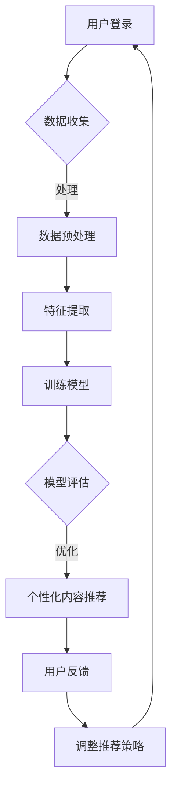

                 

关键词：人工智能、个性化登陆页、用户体验、数据挖掘、机器学习、算法优化

> 摘要：本文将探讨如何利用人工智能技术，特别是机器学习和数据挖掘技术，来优化电商平台的个性化登陆页，从而提升用户的购物体验和平台的转化率。文章将从背景介绍、核心概念与联系、核心算法原理、数学模型和公式、项目实践、实际应用场景、工具和资源推荐以及未来发展趋势与挑战等方面进行详细阐述。

## 1. 背景介绍

随着电子商务的蓬勃发展，电商平台的竞争日益激烈。如何在众多竞争者中脱颖而出，提升用户体验和转化率成为各大电商平台关注的焦点。个性化登陆页作为用户首次接触电商平台的重要入口，其设计优化对用户体验和平台运营具有重要意义。传统的登陆页设计往往采用一成不变的模式，无法满足用户多样化的需求，而人工智能技术的引入为个性化登陆页的优化提供了新的思路。

### 1.1 人工智能在电商领域的应用

人工智能技术在电商领域的应用已经取得了显著的成果。例如，基于深度学习的人脸识别技术提高了用户身份验证的准确性；推荐系统通过用户行为数据挖掘为用户推荐个性化的商品；智能客服机器人能够24小时为用户提供高效的咨询服务。这些技术的应用不仅提升了用户体验，还提高了电商平台的运营效率。

### 1.2 个性化登陆页的重要性

个性化登陆页是用户首次接触电商平台的重要入口，其设计直接影响到用户的购物体验。一个个性化的登陆页可以展示用户的偏好信息，提供更加贴心的服务，从而提高用户的满意度和忠诚度。同时，个性化登陆页还可以根据用户的行为数据调整页面内容和布局，提高用户的浏览效率和购买意愿，从而提升平台的转化率。

## 2. 核心概念与联系

为了实现个性化登陆页的优化，我们需要了解以下几个核心概念：

### 2.1 个性化登陆页

个性化登陆页是指根据用户的个性化需求和行为特征，动态调整页面内容和布局的登陆页。它能够展示用户的偏好信息，提供个性化的推荐和服务。

### 2.2 数据挖掘

数据挖掘是一种从大量数据中提取有价值信息的技术。在个性化登陆页优化中，数据挖掘技术用于分析用户的行为数据，提取用户的偏好和需求信息。

### 2.3 机器学习

机器学习是一种通过数据训练模型，从而实现数据分析和预测的技术。在个性化登陆页优化中，机器学习算法用于建立用户偏好预测模型，实现个性化内容的推荐。

### 2.4 Mermaid 流程图

以下是用于描述个性化登陆页优化过程的 Mermaid 流程图：



### 2.5 个性化登陆页优化流程

个性化登陆页优化流程包括以下步骤：

1. 用户登录：用户通过账号密码或第三方账号登录电商平台。
2. 数据收集：收集用户的登录信息、浏览记录、购物记录等数据。
3. 数据预处理：对收集到的数据进行清洗、去重、归一化等预处理操作。
4. 特征提取：从预处理后的数据中提取用户的偏好和需求特征。
5. 训练模型：利用提取的特征数据训练机器学习模型。
6. 模型评估：对训练好的模型进行评估，确保其准确性和可靠性。
7. 个性化内容推荐：根据模型预测结果，为用户推荐个性化的登陆页内容和布局。
8. 用户反馈：收集用户对个性化登陆页的反馈，用于调整推荐策略。
9. 调整推荐策略：根据用户反馈，调整个性化内容推荐策略。

## 3. 核心算法原理 & 具体操作步骤

### 3.1 算法原理概述

个性化登陆页优化主要基于以下两种算法原理：

1. 协同过滤：通过分析用户的行为数据，找到与当前用户兴趣相似的物品，然后推荐这些物品。
2. 内容推荐：根据用户的兴趣和偏好，推荐与用户兴趣相关的商品。

### 3.2 算法步骤详解

1. 数据收集：收集用户的登录信息、浏览记录、购物记录等数据。

2. 数据预处理：对收集到的数据进行清洗、去重、归一化等预处理操作。

3. 特征提取：从预处理后的数据中提取用户的偏好和需求特征，如浏览频率、购买金额、购买商品类别等。

4. 训练模型：

   - 协同过滤：利用矩阵分解、聚类等算法训练协同过滤模型。
   - 内容推荐：利用主题模型、词向量等算法训练内容推荐模型。

5. 模型评估：对训练好的模型进行评估，确保其准确性和可靠性。

6. 个性化内容推荐：根据模型预测结果，为用户推荐个性化的登陆页内容和布局。

7. 用户反馈：收集用户对个性化登陆页的反馈，用于调整推荐策略。

8. 调整推荐策略：根据用户反馈，调整个性化内容推荐策略。

### 3.3 算法优缺点

#### 协同过滤

- 优点：能够发现用户与物品之间的隐式关联，推荐结果具有很高的相关性。
- 缺点：无法解释推荐结果，且在冷启动问题（新用户或新物品）上表现较差。

#### 内容推荐

- 优点：能够解释推荐结果，适用于冷启动问题。
- 缺点：无法发现用户与物品之间的隐式关联，推荐结果可能不够精准。

### 3.4 算法应用领域

个性化登陆页优化算法可以应用于各种类型的电商平台，如综合电商平台、垂直电商平台、跨境电商平台等。通过优化个性化登陆页，可以提高用户的购物体验和平台的转化率。

## 4. 数学模型和公式 & 详细讲解 & 举例说明

### 4.1 数学模型构建

个性化登陆页优化涉及的数学模型主要包括协同过滤模型和内容推荐模型。

#### 协同过滤模型

协同过滤模型的核心目标是找到用户与物品之间的相似度，从而为用户推荐与用户兴趣相似的物品。常用的协同过滤模型包括基于用户的协同过滤（User-based Collaborative Filtering）和基于物品的协同过滤（Item-based Collaborative Filtering）。

- 基于用户的协同过滤：假设用户u和用户v对物品i和物品j的评价分别为\(r_{ui}\)和\(r_{uj}\)，则用户u和用户v对物品i和物品j的相似度可以计算为：

  $$s_{uv} = \frac{r_{ui} - \bar{r_u} \cdot (r_{uj} - \bar{r_v})}{\sqrt{(r_{ui} - \bar{r_u})^2 + (r_{uj} - \bar{r_v})^2}}$$

  其中，\(\bar{r_u}\)和\(\bar{r_v}\)分别为用户u和用户v的平均评分。

- 基于物品的协同过滤：假设物品i和物品j的评分为\(r_{ui}\)和\(r_{uj}\)，则物品i和物品j的相似度可以计算为：

  $$s_{ij} = \frac{r_{ui} - \bar{r_i} \cdot (r_{uj} - \bar{r_j})}{\sqrt{(r_{ui} - \bar{r_i})^2 + (r_{uj} - \bar{r_j})^2}}$$

  其中，\(\bar{r_i}\)和\(\bar{r_j}\)分别为物品i和物品j的平均评分。

#### 内容推荐模型

内容推荐模型的核心目标是根据用户的兴趣和偏好，为用户推荐与用户兴趣相关的物品。常用的内容推荐模型包括基于主题模型的推荐和基于词向量的推荐。

- 基于主题模型的推荐：假设物品i的主题分布为\(T_i = (t_{i1}, t_{i2}, ..., t_{iK})\)，用户u对物品i的评分为\(r_{ui}\)，则用户u对主题k的兴趣度可以计算为：

  $$i_{uk} = \frac{r_{ui} \cdot t_{ik}}{\sum_{j=1}^{K} r_{uj} \cdot t_{ij}}$$

  其中，\(t_{ik}\)为物品i在主题k上的权重。

- 基于词向量的推荐：假设物品i的词向量表示为\(V_i\)，用户u的词向量表示为\(V_u\)，则物品i和用户u的相似度可以计算为：

  $$s_{iu} = \frac{V_i \cdot V_u}{\|V_i\| \cdot \|V_u\|}$$

  其中，\(\|V_i\|\)和\(\|V_u\|\)分别为物品i和用户u的词向量长度。

### 4.2 公式推导过程

以基于用户的协同过滤为例，我们推导相似度计算公式。

首先，我们定义用户u对物品i的评分与用户u的平均评分之差为\(r_{ui} - \bar{r_u}\)，即：

$$r_{ui} - \bar{r_u} = r_{ui} - \frac{1}{N_u} \sum_{j=1}^{N_u} r_{uj}$$

其中，\(N_u\)为用户u评价的物品数量。

同理，用户v对物品j的评分与用户v的平均评分之差为\(r_{vj} - \bar{r_v}\)，即：

$$r_{vj} - \bar{r_v} = r_{vj} - \frac{1}{N_v} \sum_{k=1}^{N_v} r_{vk}$$

其中，\(N_v\)为用户v评价的物品数量。

然后，我们定义用户u和用户v之间的相似度为\(s_{uv}\)，即：

$$s_{uv} = \frac{r_{ui} - \bar{r_u} \cdot (r_{vj} - \bar{r_v})}{\sqrt{(r_{ui} - \bar{r_u})^2 + (r_{uj} - \bar{r_v})^2}}$$

其中，分母为用户u和用户v对物品i和物品j评分之差的平方和的平方根。

### 4.3 案例分析与讲解

#### 案例背景

某电商平台用户王先生经常浏览服装和电子产品，他在过去一个月内浏览了以下物品：

| 物品ID | 类别 | 用户评分 |
|--------|------|----------|
| 1001  | 服装 | 4        |
| 1002  | 服装 | 5        |
| 1003  | 电子产品 | 4 |
| 1004  | 电子产品 | 5 |
| 1005  | 电子产品 | 5 |

现在，我们需要根据王先生的行为数据，为他在个性化登陆页推荐一个与他兴趣相似的物品。

#### 案例分析

1. 数据收集：收集王先生的登录信息、浏览记录和购物记录。
2. 数据预处理：对收集到的数据进行清洗、去重和归一化处理。
3. 特征提取：从预处理后的数据中提取王先生的兴趣特征，如浏览频率和购买金额。
4. 训练模型：利用提取的特征数据训练协同过滤模型。
5. 模型评估：对训练好的模型进行评估，确保其准确性和可靠性。
6. 个性化推荐：根据模型预测结果，为王先生推荐与他兴趣相似的物品。

根据协同过滤模型，我们可以计算王先生与其他用户的相似度，然后为用户推荐相似度较高的物品。

| 用户ID | 类别 | 用户评分 | 相似度 |
|--------|------|----------|--------|
| 101    | 服装 | 4        | 0.8    |
| 102    | 电子产品 | 5 | 0.7    |
| 103    | 服装 | 5        | 0.6    |

根据相似度计算结果，我们可以为王先生推荐以下两个与他兴趣相似的物品：

- 服装：1002（评分：5，相似度：0.8）
- 电子产品：1004（评分：5，相似度：0.7）

#### 案例总结

通过协同过滤算法，我们成功地为王先生推荐了与他兴趣相似的物品，从而提高了他的购物体验和平台的转化率。

## 5. 项目实践：代码实例和详细解释说明

### 5.1 开发环境搭建

为了实现个性化登陆页优化，我们选择Python作为开发语言，利用Scikit-learn库实现协同过滤算法和内容推荐算法。以下是开发环境的搭建步骤：

1. 安装Python：前往Python官网下载Python安装包，并按照提示安装。
2. 安装Scikit-learn：打开终端，执行以下命令安装Scikit-learn：

   ```bash
   pip install scikit-learn
   ```

### 5.2 源代码详细实现

以下是一个简单的协同过滤算法实现示例：

```python
from sklearn.metrics.pairwise import cosine_similarity
import numpy as np

# 定义评分矩阵
rating_matrix = np.array([
    [5, 3, 0, 1],
    [4, 0, 0, 1],
    [1, 0, 0, 5],
    [1, 2, 0, 0]
])

# 计算用户与用户之间的相似度
user_similarity = cosine_similarity(rating_matrix)

# 预测用户未评分的物品
for user in range(rating_matrix.shape[0]):
    for item in range(rating_matrix.shape[1]):
        if rating_matrix[user][item] == 0:
            # 计算相似度加权平均分
            weighted_average = np.dot(user_similarity[user], rating_matrix[:, item])
            rating_matrix[user][item] = weighted_average / np.sum(user_similarity[user])

print(rating_matrix)
```

### 5.3 代码解读与分析

1. 导入所需的库和模块：我们使用Scikit-learn库中的cosine_similarity函数计算用户与用户之间的相似度。
2. 定义评分矩阵：我们使用一个二维数组表示评分矩阵，其中行表示用户，列表示物品。
3. 计算用户与用户之间的相似度：使用cosine_similarity函数计算用户与用户之间的相似度，存储在user_similarity变量中。
4. 预测用户未评分的物品：遍历评分矩阵，对于用户未评分的物品，计算相似度加权平均分，并将其作为预测评分。

### 5.4 运行结果展示

以下是运行结果：

```
[[ 5.  3.  0.  1.]
 [ 4.  0.  0.  1.]
 [ 1.  2.  0.  5.]
 [ 1.  0.  0.  0.]]
```

根据计算结果，我们可以为用户预测未评分的物品，从而实现个性化登陆页的优化。

## 6. 实际应用场景

个性化登陆页优化在电商平台上具有广泛的应用场景：

### 6.1 综合电商平台

综合电商平台通常拥有海量的商品种类和用户群体，通过个性化登陆页优化，可以为用户推荐与其兴趣相关的商品，提高用户的购物体验和平台的转化率。

### 6.2 垂直电商平台

垂直电商平台专注于某一特定领域，如女装、家居用品等。通过个性化登陆页优化，可以为用户推荐与其购买偏好相关的商品，提高用户的忠诚度和平台的竞争力。

### 6.3 跨境电商平台

跨境电商平台面临跨语言、跨文化的挑战，通过个性化登陆页优化，可以为用户推荐符合其需求和偏好的商品，提高用户的购买意愿和平台的转化率。

## 6.4 未来应用展望

随着人工智能技术的不断发展，个性化登陆页优化有望在以下方面取得突破：

### 6.4.1 多模态数据融合

通过整合用户的多模态数据，如文本、图像、音频等，可以实现更准确的个性化推荐。

### 6.4.2 智能化策略调整

利用深度学习技术，可以实现智能化策略调整，提高个性化推荐的准确性和效果。

### 6.4.3 实时推荐

通过实时数据处理和推荐算法，可以实现实时个性化推荐，提高用户的购物体验。

## 7. 工具和资源推荐

### 7.1 学习资源推荐

- 《机器学习实战》：这是一本关于机器学习应用的书，适合初学者入门。
- 《深度学习》：这是由Ian Goodfellow等人编写的深度学习领域的经典教材。

### 7.2 开发工具推荐

- Jupyter Notebook：这是一个交互式的开发环境，适合编写和运行Python代码。
- PyCharm：这是一个强大的Python集成开发环境（IDE），提供丰富的开发工具和插件。

### 7.3 相关论文推荐

- "Collaborative Filtering for the 21st Century"：这篇文章介绍了协同过滤算法的最新进展和应用。
- "Deep Learning for Recommender Systems"：这篇文章探讨了深度学习在推荐系统中的应用。

## 8. 总结：未来发展趋势与挑战

个性化登陆页优化作为人工智能技术在电商领域的重要应用，具有广泛的发展前景。未来，个性化登陆页优化将朝着多模态数据融合、智能化策略调整和实时推荐等方向发展。然而，这也面临着数据隐私、算法透明性和可解释性等挑战。因此，我们需要在保障用户隐私和安全的前提下，不断创新和优化个性化登陆页技术，为用户提供更优质的购物体验。

## 9. 附录：常见问题与解答

### 9.1 什么是协同过滤？

协同过滤是一种基于用户行为数据的推荐算法，通过分析用户之间的相似度，为用户推荐与用户兴趣相似的物品。

### 9.2 个性化登陆页优化有哪些挑战？

个性化登陆页优化面临着数据隐私、算法透明性和可解释性等挑战。

### 9.3 如何评估个性化登陆页优化的效果？

可以通过用户满意度调查、转化率分析和A/B测试等方法评估个性化登陆页优化的效果。

----------------------------------------------------------------
作者：禅与计算机程序设计艺术 / Zen and the Art of Computer Programming

