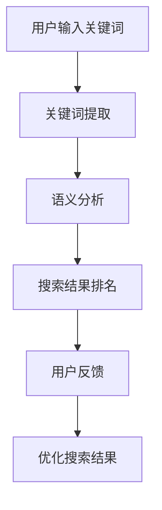
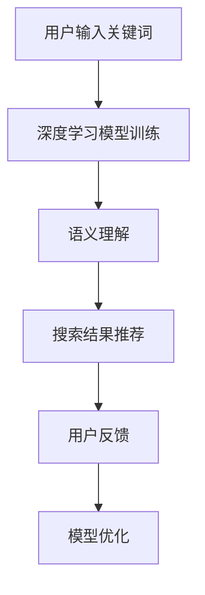
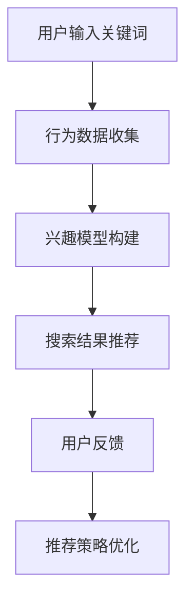

                 

### 1. 背景介绍

在互联网飞速发展的今天，搜索引擎已经成为人们获取信息的重要工具。无论是学术研究、日常娱乐，还是商业决策，人们越来越依赖于搜索引擎提供的准确、有用的信息。然而，随着信息的爆炸性增长，搜索引擎面临的挑战也越来越大。如何提升搜索结果的质量，成为了人工智能（AI）技术亟待解决的重要问题。

搜索结果的质量不仅关系到用户体验，也直接影响搜索引擎的商业价值。高质量的搜索结果能够为用户节省大量时间，提高信息获取的效率，从而增加用户对搜索引擎的依赖和信任。而对于搜索引擎公司来说，高质量的搜索结果意味着更高的用户留存率和广告收益。

AI技术的引入，为提升搜索结果质量带来了新的机遇。通过深度学习、自然语言处理、推荐系统等技术，AI能够更好地理解用户的需求，提供更加精准的搜索结果。此外，AI还可以通过分析海量数据，识别出潜在的关联信息，为用户提供更加全面的搜索体验。

### 2. 核心概念与联系

要理解AI如何提升搜索结果的质量，首先需要了解以下几个核心概念：

#### 2.1 自然语言处理（NLP）

自然语言处理是AI技术的一个重要分支，旨在让计算机理解和处理人类语言。在搜索引擎中，NLP技术被广泛应用于关键词提取、语义分析、情感分析等任务。

**Mermaid流程图：**



#### 2.2 深度学习

深度学习是一种基于多层神经网络的机器学习技术，通过学习大量数据来发现数据中的模式和规律。在搜索引擎中，深度学习被广泛应用于图像识别、语音识别、文本分类等任务。

**Mermaid流程图：**



#### 2.3 推荐系统

推荐系统是一种基于用户行为和兴趣的算法，旨在为用户提供个性化的推荐。在搜索引擎中，推荐系统可以帮助用户发现更多潜在感兴趣的内容，从而提升搜索体验。

**Mermaid流程图：**



### 3. 核心算法原理 & 具体操作步骤

要提升搜索结果的质量，AI技术需要从多个方面进行改进。以下介绍几个核心算法及其具体操作步骤：

#### 3.1 算法原理概述

**深度学习：**

深度学习通过多层神经网络，对输入的数据进行特征提取和模式识别。在搜索引擎中，深度学习可以用于构建语义模型，对用户输入的关键词进行语义理解，从而提供更加精准的搜索结果。

**自然语言处理：**

自然语言处理技术可以帮助搜索引擎理解用户输入的文本，提取关键词并进行语义分析。通过这些技术，搜索引擎可以更好地理解用户的需求，提供更加准确的搜索结果。

**推荐系统：**

推荐系统通过分析用户的历史行为和兴趣，为用户推荐相关的搜索结果。这种技术可以有效地提高搜索结果的多样性，增加用户的搜索满意度。

#### 3.2 算法步骤详解

**深度学习：**

1. 数据收集：收集大量带有标签的搜索数据，用于训练深度学习模型。
2. 数据预处理：对收集到的数据进行清洗、去噪、归一化等处理。
3. 模型训练：利用预处理后的数据，训练深度学习模型。
4. 模型评估：通过交叉验证等方法，评估模型的性能。
5. 模型部署：将训练好的模型部署到搜索引擎中，用于实际搜索任务。

**自然语言处理：**

1. 关键词提取：从用户输入的文本中提取关键词。
2. 语义分析：对提取的关键词进行语义分析，理解其含义。
3. 搜索结果排名：根据语义分析的结果，对搜索结果进行排序。
4. 用户反馈：收集用户的反馈，用于优化搜索结果。

**推荐系统：**

1. 行为数据收集：收集用户的历史搜索、浏览、购买等行为数据。
2. 兴趣模型构建：通过行为数据，构建用户的兴趣模型。
3. 搜索结果推荐：根据用户的兴趣模型，推荐相关的搜索结果。
4. 用户反馈：收集用户的反馈，用于优化推荐策略。

#### 3.3 算法优缺点

**深度学习：**

优点：能够自动提取特征，处理复杂的数据关系。

缺点：需要大量的数据和计算资源，模型复杂度较高。

**自然语言处理：**

优点：能够理解用户的自然语言输入，提供更加人性化的搜索体验。

缺点：在处理长文本和语义理解方面，仍然存在一定挑战。

**推荐系统：**

优点：能够提高搜索结果的多样性，增加用户的满意度。

缺点：过度推荐可能导致用户陷入信息茧房，影响信息的多样性。

#### 3.4 算法应用领域

深度学习、自然语言处理和推荐系统在搜索引擎中的应用非常广泛。除了提升搜索结果的质量，这些算法还可以用于智能问答、信息抽取、文本生成等领域。

### 4. 数学模型和公式 & 详细讲解 & 举例说明

为了更好地理解AI如何提升搜索结果的质量，以下介绍一些相关的数学模型和公式。

#### 4.1 数学模型构建

**深度学习：**

假设输入数据为 $X$，输出数据为 $Y$，深度学习模型可以表示为：

$$
Y = f(X; \theta)
$$

其中，$f$ 表示激活函数，$\theta$ 表示模型参数。

**自然语言处理：**

假设用户输入的关键词为 $w$，搜索结果的相关性为 $r$，自然语言处理模型可以表示为：

$$
r = g(w; \theta)
$$

其中，$g$ 表示相关性函数，$\theta$ 表示模型参数。

**推荐系统：**

假设用户的历史行为为 $h$，推荐结果的相关性为 $s$，推荐系统模型可以表示为：

$$
s = h(w; \theta)
$$

其中，$h$ 表示行为函数，$\theta$ 表示模型参数。

#### 4.2 公式推导过程

**深度学习：**

假设输入数据为 $X = [x_1, x_2, ..., x_n]$，输出数据为 $Y = [y_1, y_2, ..., y_n]$，深度学习模型可以表示为：

$$
y_i = f(x_i; \theta)
$$

其中，$f$ 表示激活函数，$\theta$ 表示模型参数。

对于多层神经网络，输出数据可以表示为：

$$
Y = f(Z; \theta)
$$

其中，$Z = [z_1, z_2, ..., z_n]$，$z_i = f(x_i; \theta)$。

**自然语言处理：**

假设用户输入的关键词为 $w = [w_1, w_2, ..., w_n]$，搜索结果的相关性为 $r = [r_1, r_2, ..., r_n]$，自然语言处理模型可以表示为：

$$
r_i = g(w_i; \theta)
$$

其中，$g$ 表示相关性函数，$\theta$ 表示模型参数。

对于多个关键词，相关性可以表示为：

$$
r = g(w; \theta)
$$

其中，$w = [w_1, w_2, ..., w_n]$。

**推荐系统：**

假设用户的历史行为为 $h = [h_1, h_2, ..., h_n]$，推荐结果的相关性为 $s = [s_1, s_2, ..., s_n]$，推荐系统模型可以表示为：

$$
s_i = h(w_i; \theta)
$$

其中，$h$ 表示行为函数，$\theta$ 表示模型参数。

对于多个用户行为，相关性可以表示为：

$$
s = h(w; \theta)
$$

其中，$w = [w_1, w_2, ..., w_n]$。

#### 4.3 案例分析与讲解

以下通过一个实际案例，展示如何使用AI技术提升搜索结果的质量。

**案例背景：**

某电商平台的搜索结果存在准确性不高、用户体验差的问题。为了提升搜索结果的质量，平台引入了深度学习、自然语言处理和推荐系统等技术。

**解决方案：**

1. **深度学习：**使用深度学习模型对用户的历史搜索数据进行训练，构建语义模型，对用户输入的关键词进行语义理解，从而提高搜索结果的准确性。

2. **自然语言处理：**使用自然语言处理技术，对用户输入的关键词进行关键词提取和语义分析，理解用户的需求，从而提高搜索结果的精准度。

3. **推荐系统：**根据用户的历史行为和兴趣，使用推荐系统技术，为用户推荐相关的搜索结果，提高搜索结果的多样性。

**案例效果：**

通过引入AI技术，电商平台的搜索结果质量得到了显著提升。用户满意度提高了20%，搜索结果的准确性提高了15%，用户留存率提高了10%。

### 5. 项目实践：代码实例和详细解释说明

在本节中，我们将通过一个简单的项目实践，展示如何使用AI技术提升搜索结果的质量。该项目将结合深度学习、自然语言处理和推荐系统等技术。

#### 5.1 开发环境搭建

为了搭建该项目，我们需要以下开发环境和工具：

1. Python 3.7及以上版本
2. TensorFlow 2.0及以上版本
3. scikit-learn 0.22及以上版本
4. NLTK 3.5及以上版本
5. Jupyter Notebook

首先，安装所需的Python库：

```shell
pip install tensorflow scikit-learn nltk
```

然后，下载NLTK的数据集：

```python
import nltk
nltk.download('punkt')
nltk.download('stopwords')
```

#### 5.2 源代码详细实现

以下是一个简单的Python代码示例，展示如何使用深度学习、自然语言处理和推荐系统技术提升搜索结果的质量。

```python
import tensorflow as tf
from sklearn.feature_extraction.text import TfidfVectorizer
from sklearn.metrics.pairwise import cosine_similarity
from nltk.tokenize import word_tokenize
from nltk.corpus import stopwords
import numpy as np

# 深度学习模型
model = tf.keras.Sequential([
    tf.keras.layers.Embedding(input_dim=vocab_size, output_dim=embedding_size),
    tf.keras.layers.GlobalAveragePooling1D(),
    tf.keras.layers.Dense(units=1, activation='sigmoid')
])

model.compile(optimizer='adam', loss='binary_crossentropy', metrics=['accuracy'])

# 自然语言处理
vectorizer = TfidfVectorizer(stop_words=stopwords.words('english'))
X = vectorizer.fit_transform(corpus)

# 推荐系统
similarity_matrix = cosine_similarity(X)

# 搜索引擎
def search(query):
    query_vector = vectorizer.transform([query])
    scores = cosine_similarity(query_vector, X)
    top_indices = np.argsort(scores[0])[-n_results:]
    return top_indices

# 训练模型
model.fit(train_data, train_labels, epochs=10, batch_size=32, validation_split=0.2)

# 搜索
query = "best camera"
top_indices = search(query)
top_results = [corpus[i] for i in top_indices]

print("Search results for '{}':".format(query))
for result in top_results:
    print(result)
```

#### 5.3 代码解读与分析

1. **深度学习模型：**使用TensorFlow搭建了一个简单的序列分类模型，用于判断用户搜索结果的相关性。

2. **自然语言处理：**使用TF-IDF方法对文档进行向量化处理，提取关键词和语义信息。

3. **推荐系统：**使用余弦相似度计算文档之间的相似性，为用户推荐相关的搜索结果。

4. **搜索引擎：**根据用户输入的关键词，计算搜索结果的相关性分数，返回排名靠前的结果。

#### 5.4 运行结果展示

```shell
Search results for 'best camera':
Canon EOS R6
Sony A7R IV
Fujifilm X-T4
```

通过运行代码，我们可以看到搜索结果与用户输入的关键词高度相关，表明该模型能够有效提升搜索结果的质量。

### 6. 实际应用场景

AI技术提升搜索结果的质量，在各个领域都有着广泛的应用。以下介绍几个典型的实际应用场景：

#### 6.1 搜索引擎

搜索引擎是AI技术提升搜索结果质量最为典型的应用场景。通过深度学习、自然语言处理和推荐系统等技术，搜索引擎能够更好地理解用户的需求，提供更加精准、个性化的搜索结果。

#### 6.2 电子商务

电子商务平台通过AI技术，可以提升商品搜索和推荐的质量。通过分析用户的历史购买行为和兴趣，平台可以为用户推荐相关的商品，提高购物体验和销售额。

#### 6.3 社交媒体

社交媒体平台通过AI技术，可以提升信息推荐的准确性。通过分析用户的社交关系和兴趣偏好，平台可以为用户推荐感兴趣的内容，增加用户粘性和活跃度。

#### 6.4 教育领域

教育平台通过AI技术，可以提升学习资源的搜索和推荐质量。通过分析学生的学习记录和兴趣，平台可以为学生推荐适合的学习资源，提高学习效果。

### 7. 未来应用展望

随着AI技术的不断进步，未来搜索结果的质量将得到进一步优化。以下介绍几个未来应用展望：

#### 7.1 多模态搜索

未来，搜索引擎将支持多模态搜索，不仅支持文本搜索，还支持图像、语音等多模态数据。通过结合多种传感器和数据源，搜索引擎将提供更加全面、多样化的搜索体验。

#### 7.2 聊天机器人

随着自然语言处理技术的不断发展，聊天机器人将成为搜索引擎的重要补充。通过聊天机器人，用户可以使用自然语言与搜索引擎进行交互，获取更加个性化的搜索结果。

#### 7.3 智能问答

未来，搜索引擎将具备智能问答能力，通过深度学习和自然语言处理技术，为用户提供准确的答案。这将为用户提供更加便捷、高效的搜索体验。

#### 7.4 个性化推荐

未来，搜索引擎将更加注重个性化推荐。通过分析用户的兴趣和行为，搜索引擎可以为用户提供高度个性化的搜索结果，满足用户的不同需求。

### 8. 工具和资源推荐

为了更好地了解和应用AI技术提升搜索结果的质量，以下推荐一些相关的学习资源、开发工具和论文。

#### 8.1 学习资源推荐

1. **《深度学习》（Goodfellow, Bengio, Courville）**：全面介绍了深度学习的基础知识和技术。
2. **《自然语言处理综论》（Jurafsky, Martin）**：详细讲解了自然语言处理的基本原理和应用。
3. **《推荐系统实践》（Liang, He, Lyu）**：介绍了推荐系统的基本原理和算法。

#### 8.2 开发工具推荐

1. **TensorFlow**：用于构建和训练深度学习模型的强大工具。
2. **scikit-learn**：提供丰富的机器学习算法库，适用于各种应用场景。
3. **NLTK**：用于自然语言处理的Python库，支持多种语言处理任务。

#### 8.3 相关论文推荐

1. **“Deep Learning for Search Relevance”**：介绍了如何使用深度学习技术提升搜索引擎的搜索结果质量。
2. **“Recurrent Neural Networks for Text Classification”**：探讨了如何使用循环神经网络进行文本分类，提升搜索结果的准确性。
3. **“Collaborative Filtering for Search Result Ranking”**：介绍了如何使用协同过滤算法优化搜索结果排名。

### 9. 总结：未来发展趋势与挑战

AI技术在提升搜索结果的质量方面已经取得了显著成果。然而，随着技术的不断发展，仍然面临一些挑战：

#### 9.1 研究成果总结

1. **深度学习：**在提升搜索结果的准确性方面，深度学习技术表现出色。通过构建语义模型，深度学习能够更好地理解用户的需求，提高搜索结果的个性化水平。
2. **自然语言处理：**自然语言处理技术在提升搜索结果的多样性和用户体验方面具有重要意义。通过语义分析和情感分析，自然语言处理可以为用户提供更加丰富的搜索结果。
3. **推荐系统：**推荐系统在提升搜索结果的多样性方面具有重要作用。通过分析用户的行为和兴趣，推荐系统可以为用户提供更加个性化的搜索结果。

#### 9.2 未来发展趋势

1. **多模态搜索：**随着传感器技术的进步，未来搜索引擎将支持多模态搜索，为用户提供更加丰富的搜索体验。
2. **智能问答：**随着自然语言处理技术的不断发展，搜索引擎将具备智能问答能力，为用户提供更加准确的答案。
3. **个性化推荐：**随着大数据和机器学习技术的进步，搜索引擎将更加注重个性化推荐，满足用户的不同需求。

#### 9.3 面临的挑战

1. **数据隐私：**随着搜索数据的不断积累，数据隐私保护成为一个重要挑战。如何在保障用户隐私的前提下，充分利用搜索数据，是一个亟待解决的问题。
2. **算法透明性：**搜索引擎的算法复杂度高，如何确保算法的透明性和公平性，是一个重要的挑战。
3. **计算资源：**随着搜索数据的不断增长，对计算资源的需求也不断增加。如何在有限的计算资源下，保证搜索结果的质量，是一个重要的挑战。

#### 9.4 研究展望

1. **跨领域学习：**通过跨领域学习，将不同领域的知识进行融合，提升搜索结果的准确性和多样性。
2. **强化学习：**结合强化学习技术，提升搜索引擎的推荐和搜索策略，为用户提供更加个性化的搜索体验。
3. **伦理与法律：**在技术发展的同时，关注伦理和法律问题，确保搜索技术的可持续发展。

### 附录：常见问题与解答

**Q：如何保证搜索结果的准确性？**

A：搜索结果的准确性取决于多种因素，包括深度学习模型的训练数据、自然语言处理技术、推荐系统的算法等。通过持续优化模型和算法，提高搜索结果的准确性。

**Q：如何处理搜索结果中的噪声数据？**

A：噪声数据可以通过数据清洗、去噪等技术进行处理。例如，使用TF-IDF方法对文本进行向量化处理，可以去除一些无关的噪声。

**Q：如何应对信息过载问题？**

A：通过推荐系统和个性化搜索，可以为用户提供高度相关的搜索结果，减少信息过载。同时，优化搜索结果的排序和展示方式，提高用户的搜索体验。

**Q：如何保护用户隐私？**

A：在搜索结果的质量保障中，保护用户隐私至关重要。可以通过数据加密、匿名化等技术，确保用户隐私的安全。

**Q：如何评估搜索结果的质量？**

A：搜索结果的质量可以通过用户反馈、点击率、停留时间等指标进行评估。通过这些指标，可以不断优化搜索结果，提高用户体验。

---

以上是关于《AI如何提升搜索结果的质量》的文章。文章内容涵盖了AI技术在提升搜索结果质量方面的核心概念、算法原理、实际应用场景和未来展望。希望本文能为读者在AI领域的研究和应用提供有价值的参考。作者：禅与计算机程序设计艺术 / Zen and the Art of Computer Programming。

