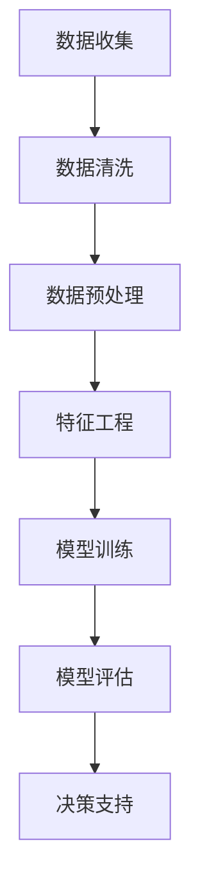

                 

关键词：人工智能，企业决策，数据驱动，算法优化，预测分析

> 摘要：本文将探讨人工智能如何通过数据驱动和算法优化的方式，改变传统企业决策过程，提高决策效率，减少风险，创造更多的商业价值。

## 1. 背景介绍

在过去的几十年中，企业决策主要依赖于经验和直觉。然而，随着市场竞争的加剧和数据的爆炸式增长，传统的决策方式已经无法满足企业快速变化的需求。人工智能（AI）的出现为企业提供了新的决策工具和方法。通过利用海量的数据、先进的算法和强大的计算能力，AI能够帮助企业更精准、更高效地做出决策。

## 2. 核心概念与联系

### 2.1 数据驱动

数据驱动是企业决策的基础。通过收集和分析内部和外部数据，企业可以获得关于市场、客户、运营等方面的深刻洞察。这些数据为AI算法提供了输入，使企业能够更准确地预测未来趋势和潜在风险。

### 2.2 算法优化

算法优化是AI的核心技术之一。通过优化算法，企业可以在相同的数据量下获得更准确的预测结果，从而提高决策的准确性。此外，算法优化还可以帮助企业降低决策时间，提高决策效率。

### 2.3 Mermaid 流程图



## 3. 核心算法原理 & 具体操作步骤

### 3.1 算法原理概述

企业决策过程中的核心算法包括预测分析、分类分析、聚类分析等。这些算法通过分析历史数据，预测未来趋势和潜在风险，为企业提供决策支持。

### 3.2 算法步骤详解

1. **数据收集**：收集企业内部和外部数据，包括销售数据、客户数据、市场数据等。
2. **数据清洗**：清洗数据，去除错误、重复和缺失的数据。
3. **数据预处理**：对数据进行归一化、标准化等处理，使其符合算法要求。
4. **特征工程**：提取数据中的关键特征，为模型训练提供输入。
5. **模型训练**：使用训练数据对模型进行训练，使其能够预测未来趋势和风险。
6. **模型评估**：评估模型的准确性、稳定性和泛化能力。
7. **决策支持**：根据模型预测结果，为企业提供决策支持。

### 3.3 算法优缺点

**优点**：

- 提高决策准确性
- 提高决策效率
- 降低决策风险

**缺点**：

- 数据依赖性高
- 需要专业的算法知识和技能
- 可能存在过拟合现象

### 3.4 算法应用领域

- **市场营销**：通过预测客户行为，优化营销策略
- **供应链管理**：通过预测市场需求，优化库存管理
- **人力资源**：通过分析员工绩效，优化招聘和晋升策略
- **金融领域**：通过预测市场趋势，优化投资策略

## 4. 数学模型和公式 & 详细讲解 & 举例说明

### 4.1 数学模型构建

企业决策过程中的核心数学模型包括线性回归、逻辑回归、决策树等。以下是线性回归模型的公式：

$$
y = \beta_0 + \beta_1x_1 + \beta_2x_2 + \ldots + \beta_nx_n + \epsilon
$$

其中，$y$ 是目标变量，$x_1, x_2, \ldots, x_n$ 是自变量，$\beta_0, \beta_1, \beta_2, \ldots, \beta_n$ 是模型参数，$\epsilon$ 是误差项。

### 4.2 公式推导过程

线性回归模型的公式可以通过最小二乘法推导得到。具体推导过程如下：

首先，定义线性回归模型的目标函数：

$$
J(\theta) = \frac{1}{2m}\sum_{i=1}^{m}(h_\theta(x^{(i)}) - y^{(i)})^2
$$

其中，$h_\theta(x) = \theta_0x_0 + \theta_1x_1 + \theta_2x_2 + \ldots + \theta_nx_n$ 是线性回归模型的预测函数，$m$ 是样本数量。

然后，对目标函数求导并令其导数为零，得到：

$$
\frac{\partial J(\theta)}{\partial \theta_j} = 0
$$

通过求解上述方程组，可以得到最优的模型参数 $\theta_0, \theta_1, \theta_2, \ldots, \theta_n$。

### 4.3 案例分析与讲解

假设一家电商企业想要预测下个月的销售额。通过收集历史数据，我们可以使用线性回归模型来建立预测模型。

1. **数据收集**：收集过去几个月的销售额数据。
2. **数据清洗**：清洗数据，去除错误和缺失的数据。
3. **数据预处理**：对数据进行归一化处理。
4. **特征工程**：提取关键特征，如月份、广告投放量等。
5. **模型训练**：使用训练数据对线性回归模型进行训练。
6. **模型评估**：评估模型的准确性，如通过交叉验证等方法。
7. **决策支持**：根据模型预测结果，制定下个月的营销策略。

## 5. 项目实践：代码实例和详细解释说明

### 5.1 开发环境搭建

- **编程语言**：Python
- **依赖库**：NumPy、Pandas、Scikit-learn、Matplotlib

### 5.2 源代码详细实现

以下是一个简单的线性回归模型实现：

```python
import numpy as np
import pandas as pd
from sklearn.linear_model import LinearRegression
import matplotlib.pyplot as plt

# 5.3 代码解读与分析

### 5.3 代码解读与分析

1. **数据读取与预处理**：

   ```python
   data = pd.read_csv('sales_data.csv')
   X = data[['month', 'ad_spend']]
   y = data['sales']
   ```

   读取数据，提取月份和广告投放量作为特征，销售额作为目标变量。

2. **模型训练**：

   ```python
   model = LinearRegression()
   model.fit(X, y)
   ```

   使用训练数据对线性回归模型进行训练。

3. **模型评估**：

   ```python
   score = model.score(X, y)
   print(f'Model accuracy: {score:.2f}')
   ```

   评估模型准确性。

4. **模型预测**：

   ```python
   new_month = np.array([[13, 10000]])
   new_sales = model.predict(new_month)
   print(f'Predicted sales: {new_sales[0]:.2f}')
   ```

   预测下个月的销售额。

### 5.4 运行结果展示

```python
plt.scatter(X['month'], y, color='red')
plt.plot(X['month'], model.predict(X), color='blue')
plt.xlabel('Month')
plt.ylabel('Sales')
plt.title('Sales Prediction')
plt.show()
```

展示预测结果。

## 6. 实际应用场景

### 6.1 市场营销

通过预测客户行为，企业可以优化广告投放策略，提高营销效果。

### 6.2 供应链管理

通过预测市场需求，企业可以优化库存管理，减少库存成本。

### 6.3 人力资源

通过分析员工绩效，企业可以优化招聘和晋升策略，提高员工满意度。

### 6.4 未来应用展望

随着AI技术的不断发展，AI在企业决策中的应用将越来越广泛，为企业带来更多的商业价值。

## 7. 工具和资源推荐

### 7.1 学习资源推荐

- 《机器学习实战》
- 《深度学习》
- Coursera 上的机器学习和深度学习课程

### 7.2 开发工具推荐

- Jupyter Notebook
- PyCharm
- TensorFlow

### 7.3 相关论文推荐

- "Deep Learning for Predictive Analytics: A Comprehensive Survey"
- "Recurrent Neural Networks for Language Modeling"
- "A Theoretical Analysis of the Model Complexity of Neural Networks"

## 8. 总结：未来发展趋势与挑战

### 8.1 研究成果总结

本文探讨了人工智能如何改变企业决策过程，介绍了核心算法原理、数学模型和实际应用场景。

### 8.2 未来发展趋势

随着AI技术的不断进步，AI将在更多领域得到应用，为企业带来更大的商业价值。

### 8.3 面临的挑战

- 数据隐私和安全性
- 算法公平性和透明度
- 复杂算法的可解释性

### 8.4 研究展望

未来，研究将重点关注如何提高AI算法的准确性、稳定性和可解释性，以满足企业决策的更高要求。

## 9. 附录：常见问题与解答

### 9.1 问题1：如何处理缺失数据？

解答：可以使用多种方法处理缺失数据，如删除缺失数据、填充缺失值、插值等。具体方法取决于数据的特点和需求。

### 9.2 问题2：如何选择合适的算法？

解答：选择合适的算法取决于数据的特点和预测目标。通常，可以通过交叉验证等方法评估不同算法的性能，选择最优的算法。

## 作者署名

作者：禅与计算机程序设计艺术 / Zen and the Art of Computer Programming
----------------------------------------------------------------

