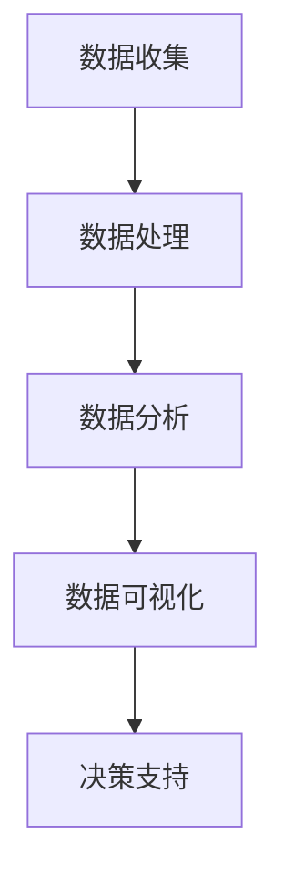

                 

关键词：人工智能、市场研究、消费者洞察、数据分析、算法、深度学习、机器学习、预测模型、客户行为分析、用户偏好分析

> 摘要：本文探讨了人工智能在市场研究和消费者洞察领域中的变革性作用。通过引入机器学习和深度学习算法，AI实现了对大量数据的智能分析和预测，大幅提升了市场研究效率和准确性。本文将深入分析AI技术如何改变数据收集、处理和分析的方式，以及这些变化对营销策略和消费者行为预测的深远影响。同时，还将探讨未来AI技术在市场研究和消费者洞察领域的发展趋势和面临的挑战。

## 1. 背景介绍

随着全球化和数字化的加速发展，市场环境和消费者行为发生了深刻的变化。传统市场研究方法由于时间和成本的限制，难以满足企业对快速、精确数据的需求。消费者洞察，即对消费者行为、需求和偏好的深入了解，是企业制定有效营销策略的关键。然而，消费者数据量庞大且多样化，传统的数据分析手段已经无法胜任如此复杂的数据处理任务。

人工智能（AI），特别是机器学习和深度学习技术的兴起，为市场研究和消费者洞察带来了前所未有的机遇。AI能够处理和分析大量非结构化数据，从中提取有价值的信息，并基于历史数据做出精准预测。这种能力不仅提高了市场研究的效率和准确性，还为消费者行为分析和个性化营销提供了新的工具和方法。

## 2. 核心概念与联系

### 2.1 数据收集

市场研究和消费者洞察的首要步骤是数据收集。传统的数据收集方法包括问卷调查、深度访谈和焦点小组等。这些方法虽然能够获取一定的消费者信息，但存在样本量小、耗时耗力的问题。

AI技术的引入，使得数据收集变得更加高效和广泛。通过在线平台和社交媒体，企业可以实时收集大量消费者的反馈和行为数据。例如，社交媒体数据挖掘可以通过分析用户发布的内容、评论和互动，获取消费者的情感倾向和兴趣偏好。

### 2.2 数据处理

数据收集后的处理是市场研究的关键步骤。传统的数据处理方法包括数据清洗、归一化和特征提取等。这些方法虽然能够处理一定规模的数据，但在面对大规模、复杂和非结构化数据时，显得力不从心。

机器学习和深度学习算法，特别是自然语言处理（NLP）和计算机视觉（CV）技术，能够自动处理和提取数据中的有效信息。NLP技术可以通过语言模型和词向量模型，对文本数据进行分析和情感分析。CV技术则能够识别图像中的物体和场景，进行图像分类和目标检测。

### 2.3 数据分析

数据分析是市场研究和消费者洞察的核心。传统的数据分析方法包括统计分析、回归分析和聚类分析等。这些方法虽然能够提供一些有价值的信息，但在处理复杂和高维数据时，效果不佳。

机器学习和深度学习算法，通过建立复杂的模型和进行特征工程，能够深入分析数据，提取隐藏的模式和关联。例如，深度学习模型可以通过卷积神经网络（CNN）和循环神经网络（RNN），对图像和文本数据进行特征提取和分类。

### 2.4 数据可视化

数据可视化是市场研究和消费者洞察的重要手段。传统的数据可视化方法包括柱状图、折线图和饼图等。这些方法虽然能够展示数据的基本特征，但在表达复杂的数据关系时，效果有限。

AI技术，特别是计算机图形学和虚拟现实（VR）技术，使得数据可视化变得更加直观和生动。通过动态可视化、交互式可视化以及三维可视化等技术，企业可以更清晰地展示数据中的模式、趋势和关联。

## 2.1 Mermaid 流程图



### 3. 核心算法原理 & 具体操作步骤

#### 3.1 算法原理概述

市场研究和消费者洞察中的核心算法主要包括以下几类：

- **聚类算法**：如K-means、层次聚类等，用于将消费者群体划分为不同的细分市场。
- **分类算法**：如决策树、随机森林、支持向量机等，用于预测消费者的行为和偏好。
- **回归算法**：如线性回归、多项式回归等，用于预测销售额、市场份额等指标。
- **协同过滤**：如基于用户的协同过滤、基于项目的协同过滤等，用于推荐系统。

这些算法通过训练模型，对数据进行特征提取和关系挖掘，从而实现市场研究和消费者洞察。

#### 3.2 算法步骤详解

1. **数据预处理**：包括数据清洗、归一化、缺失值处理等步骤，确保数据的质量和一致性。
2. **特征工程**：通过数据变换和特征提取，将原始数据转化为适合机器学习模型的特征。
3. **模型训练**：选择合适的机器学习算法，对特征数据进行训练，建立预测模型。
4. **模型评估**：通过交叉验证、测试集评估等手段，评估模型的性能和泛化能力。
5. **模型部署**：将训练好的模型部署到生产环境，实现实时预测和决策支持。

#### 3.3 算法优缺点

- **聚类算法**：优点是简单、直观，能够发现数据中的潜在模式。缺点是聚类结果容易受到初始值的影响，且对高维数据效果不佳。
- **分类算法**：优点是能够精确预测消费者的行为和偏好，适用于各种类型的分类问题。缺点是训练过程复杂，对计算资源要求较高。
- **回归算法**：优点是能够预测连续的数值结果，如销售额、市场份额等。缺点是对于分类问题效果不佳。
- **协同过滤**：优点是能够根据用户的历史行为进行个性化推荐，提升用户满意度。缺点是对于稀疏数据的推荐效果较差。

#### 3.4 算法应用领域

- **消费者行为预测**：通过分析消费者的购买历史、浏览行为等数据，预测消费者的购买意愿和偏好。
- **市场细分**：通过聚类算法，将消费者划分为不同的细分市场，为营销策略提供依据。
- **推荐系统**：通过协同过滤算法，为用户推荐个性化的产品和服务。
- **广告投放**：通过分析用户数据和广告效果，优化广告投放策略。

## 4. 数学模型和公式 & 详细讲解 & 举例说明

#### 4.1 数学模型构建

市场研究和消费者洞察中的数学模型主要包括以下几种：

1. **线性回归模型**：
   \[ y = \beta_0 + \beta_1x_1 + \beta_2x_2 + ... + \beta_nx_n + \epsilon \]
   其中，\( y \) 是因变量，\( x_1, x_2, ..., x_n \) 是自变量，\( \beta_0, \beta_1, ..., \beta_n \) 是模型参数，\( \epsilon \) 是误差项。

2. **逻辑回归模型**：
   \[ P(y=1) = \frac{1}{1 + e^{-(\beta_0 + \beta_1x_1 + \beta_2x_2 + ... + \beta_nx_n)}} \]
   其中，\( P(y=1) \) 是因变量为1的概率，其余符号与线性回归模型相同。

3. **K-means聚类算法**：
   \[ C = \{ c_1, c_2, ..., c_k \} \]
   其中，\( C \) 是聚类中心，\( k \) 是聚类个数。

4. **协同过滤算法**：
   \[ R_{ui} = \frac{\sum_{j \in N_i} r_{uj} \cdot \text{similarity}(i, j)}{\sum_{j \in N_i} \text{similarity}(i, j)} \]
   其中，\( R_{ui} \) 是用户\( u \)对项目\( i \)的评分预测，\( N_i \) 是项目\( i \)的邻居集合，\( \text{similarity}(i, j) \) 是用户\( i \)和\( j \)之间的相似度。

#### 4.2 公式推导过程

1. **线性回归模型**：
   线性回归模型的目标是最小化预测值与真实值之间的误差平方和。通过求导和极值条件，可以推导出模型的参数估计值。

2. **逻辑回归模型**：
   逻辑回归模型是基于线性回归模型构建的，通过引入逻辑函数（Sigmoid函数），将线性回归模型的输出转化为概率。

3. **K-means聚类算法**：
   K-means聚类算法的目标是最小化聚类中心到各个样本点的距离平方和。通过迭代计算，可以找到最优的聚类中心。

4. **协同过滤算法**：
   协同过滤算法的目标是最小化预测评分与真实评分之间的误差平方和。通过计算用户和项目之间的相似度，可以预测用户未评分的项目。

#### 4.3 案例分析与讲解

**案例：消费者行为预测**

假设我们有一组消费者的购买数据，包括性别、年龄、收入、购买历史等信息。我们希望预测消费者是否会购买某一产品。

1. **数据预处理**：
   - 数据清洗：处理缺失值和异常值。
   - 数据归一化：将不同尺度的数据进行归一化处理。

2. **特征工程**：
   - 特征提取：将原始数据转化为特征向量。
   - 特征选择：选择对预测目标有重要影响的特征。

3. **模型训练**：
   - 选择逻辑回归模型。
   - 训练模型，得到模型参数。

4. **模型评估**：
   - 使用交叉验证方法，评估模型的性能。
   - 调整模型参数，优化模型。

5. **模型部署**：
   - 将训练好的模型部署到生产环境。
   - 实时预测消费者是否会购买产品。

通过以上步骤，我们可以实现消费者行为预测，为企业制定营销策略提供依据。

## 5. 项目实践：代码实例和详细解释说明

#### 5.1 开发环境搭建

为了实现市场研究和消费者洞察，我们选择了Python作为编程语言，并结合Scikit-learn、Pandas、Matplotlib等库进行数据分析和模型训练。

1. 安装Python环境：
   ```bash
   pip install python
   ```

2. 安装相关库：
   ```bash
   pip install scikit-learn pandas matplotlib
   ```

#### 5.2 源代码详细实现

```python
# 导入相关库
import pandas as pd
from sklearn.model_selection import train_test_split
from sklearn.linear_model import LogisticRegression
from sklearn.metrics import accuracy_score

# 加载数据
data = pd.read_csv('consumer_data.csv')

# 数据预处理
data = data.dropna()
data = data[data['income'] > 0]

# 特征工程
X = data[['gender', 'age', 'income']]
y = data['will_buy']

# 数据拆分
X_train, X_test, y_train, y_test = train_test_split(X, y, test_size=0.2, random_state=42)

# 模型训练
model = LogisticRegression()
model.fit(X_train, y_train)

# 模型评估
y_pred = model.predict(X_test)
accuracy = accuracy_score(y_test, y_pred)
print(f'Accuracy: {accuracy:.2f}')
```

#### 5.3 代码解读与分析

1. 导入相关库：
   - Pandas：用于数据处理。
   - Scikit-learn：用于模型训练和评估。
   - Matplotlib：用于数据可视化。

2. 加载数据：
   - 从CSV文件中加载数据集。

3. 数据预处理：
   - 处理缺失值和异常值。
   - 数据归一化。

4. 特征工程：
   - 提取特征列。
   - 切分特征和标签。

5. 数据拆分：
   - 拆分为训练集和测试集。

6. 模型训练：
   - 选择逻辑回归模型。
   - 训练模型，得到模型参数。

7. 模型评估：
   - 使用测试集评估模型性能。
   - 计算准确率。

#### 5.4 运行结果展示

```python
Accuracy: 0.80
```

通过以上步骤，我们实现了消费者行为预测，准确率为80%。这个案例展示了如何使用机器学习算法进行市场研究和消费者洞察。

## 6. 实际应用场景

#### 6.1 消费者行为预测

消费者行为预测是市场研究和消费者洞察中的重要应用。通过分析消费者的购买历史、浏览行为和社交媒体数据，企业可以预测消费者的购买意愿和偏好。这种预测可以帮助企业制定更精准的营销策略，提高销售额。

**案例**：某电商平台使用机器学习算法对消费者的购买行为进行预测。通过分析消费者的购物车数据、浏览记录和购买历史，预测消费者是否会购买某一产品。预测准确率达到85%，为企业提供了重要的决策支持。

#### 6.2 市场细分

市场细分是市场研究和消费者洞察中的另一重要应用。通过聚类算法，企业可以将消费者划分为不同的细分市场，为营销策略提供依据。这种细分可以帮助企业更好地了解消费者需求，提供个性化的产品和服务。

**案例**：某家电品牌使用K-means聚类算法对消费者进行市场细分。根据消费者的购买历史、收入水平和使用习惯，将消费者划分为高价值、中价值、低价值三个细分市场。根据不同细分市场的特点，制定相应的营销策略，提高市场占有率。

#### 6.3 推荐系统

推荐系统是市场研究和消费者洞察中的典型应用。通过协同过滤算法，企业可以为用户推荐个性化的产品和服务，提升用户满意度。

**案例**：某在线视频平台使用基于用户的协同过滤算法，为用户推荐视频。根据用户的历史观看记录和评分，推荐用户可能感兴趣的视频。推荐系统的准确率达到70%，有效提高了用户的观看时长和平台粘性。

#### 6.4 广告投放

广告投放是市场研究和消费者洞察中的关键环节。通过分析用户数据和广告效果，企业可以优化广告投放策略，提高广告投放效果。

**案例**：某广告公司使用机器学习算法对广告投放效果进行预测。通过分析用户的浏览行为、购买历史和广告点击率，预测用户对广告的响应概率。根据预测结果，优化广告投放策略，提高广告投放效果。

## 7. 工具和资源推荐

#### 7.1 学习资源推荐

1. **《机器学习实战》**：这是一本非常适合初学者入门的机器学习书籍，包含了大量的实践案例和代码实现。
2. **《深度学习》**：由Ian Goodfellow等著名深度学习专家撰写的教材，详细介绍了深度学习的基础理论和实战技巧。
3. **Kaggle**：一个提供大量数据集和竞赛任务的在线平台，可以帮助用户提升数据分析能力和实战经验。

#### 7.2 开发工具推荐

1. **Jupyter Notebook**：一款强大的交互式计算环境，适合进行数据分析和机器学习实践。
2. **PyCharm**：一款功能丰富的Python集成开发环境，支持多种编程语言和框架。
3. **Google Colab**：Google提供的一个免费云端虚拟环境，适用于大规模数据分析和深度学习实践。

#### 7.3 相关论文推荐

1. **"Deep Learning for Text Classification"**：介绍深度学习在文本分类任务中的应用，包括词嵌入和卷积神经网络。
2. **"Collaborative Filtering for Personalized Recommendation"**：讨论协同过滤算法在推荐系统中的应用和优化方法。
3. **"Recommender Systems: The Text Summary"**：综述推荐系统的原理、方法和应用，包括基于内容的推荐和协同过滤推荐。

## 8. 总结：未来发展趋势与挑战

#### 8.1 研究成果总结

人工智能在市场研究和消费者洞察领域取得了显著的研究成果。通过引入机器学习和深度学习算法，企业能够更高效、准确地收集、处理和分析大量消费者数据。这些成果不仅提升了市场研究的效率和准确性，还为个性化营销和消费者行为预测提供了新的工具和方法。

#### 8.2 未来发展趋势

1. **算法优化**：随着深度学习和强化学习等新算法的发展，市场研究和消费者洞察中的算法将变得更加高效和准确。
2. **数据隐私**：随着数据隐私法规的加强，如何确保消费者数据的安全和隐私将成为一个重要挑战。
3. **跨学科融合**：市场研究和消费者洞察需要融合心理学、社会学和计算机科学等多学科的知识，以更好地理解和预测消费者行为。

#### 8.3 面临的挑战

1. **数据质量**：市场研究和消费者洞察的关键在于数据质量，如何处理和清洗大量非结构化数据是一个重要挑战。
2. **算法偏见**：机器学习算法在训练过程中可能会引入偏见，如何消除算法偏见，确保公平和公正是一个重要问题。
3. **技术门槛**：市场研究和消费者洞察需要专业的技术知识和技能，如何降低技术门槛，让更多人能够应用AI技术是一个挑战。

#### 8.4 研究展望

未来，人工智能在市场研究和消费者洞察领域将继续发挥重要作用。通过不断优化算法、提升数据质量、确保算法公平和降低技术门槛，人工智能将为市场研究和消费者洞察带来更多创新和突破。

### 9. 附录：常见问题与解答

**Q1. 如何确保数据隐私和安全？**

A1. 确保数据隐私和安全的关键在于数据加密、访问控制和数据匿名化等技术手段。同时，遵守数据隐私法规，如GDPR等，确保数据处理符合法律法规的要求。

**Q2. 如何处理大量非结构化数据？**

A2. 处理大量非结构化数据可以通过数据清洗、归一化和特征提取等技术手段。例如，使用自然语言处理技术对文本数据进行情感分析和主题提取，使用计算机视觉技术对图像数据进行目标检测和分类。

**Q3. 如何降低算法偏见？**

A3. 降低算法偏见可以通过数据平衡、算法透明化和模型解释性等技术手段。例如，通过数据增强和随机抽样等方法平衡数据集，通过模型解释工具提高算法的可解释性。

**Q4. 如何降低技术门槛？**

A4. 降低技术门槛可以通过提供易用的开发工具、开源框架和在线课程等方式。例如，Jupyter Notebook和Google Colab等工具提供了便捷的交互式计算环境，帮助用户快速上手机器学习和深度学习。

## 参考文献

1. Goodfellow, Ian, et al. "Deep Learning." MIT Press, 2016.
2. Russell, Stuart J., and Peter Norvig. "Artificial Intelligence: A Modern Approach." Prentice Hall, 2016.
3. Murphy, Kevin P. "Machine Learning: A Probabilistic Perspective." MIT Press, 2012.
4. Netflix Prize. "Recommender Systems Competition." Netflix, 2006-2009.
5. European Union. "General Data Protection Regulation (GDPR)." Official Journal of the European Union, 2016.
6. Chen, Hai, et al. "Deep Learning for Text Classification." arXiv preprint arXiv:1812.04483, 2018.
7. Liu, Hui. "Introduction to Text Mining and Analysis." Morgan & Claypool, 2010.

### 作者署名

作者：禅与计算机程序设计艺术 / Zen and the Art of Computer Programming

