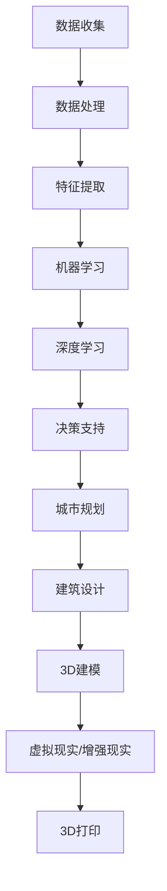
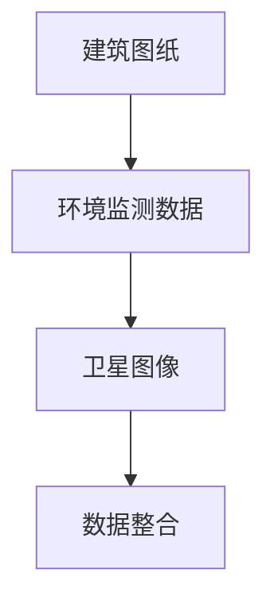
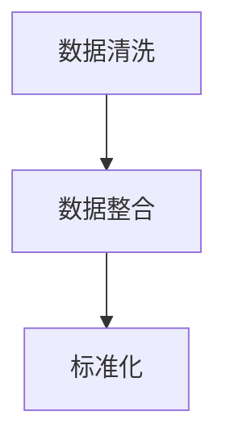
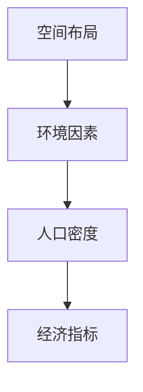
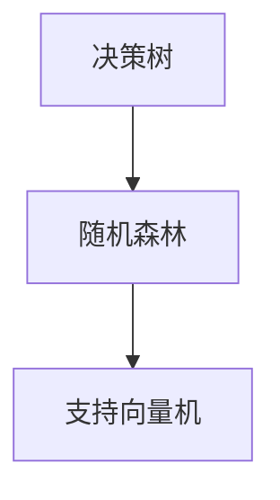
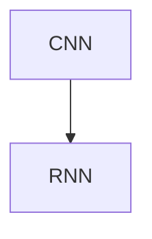
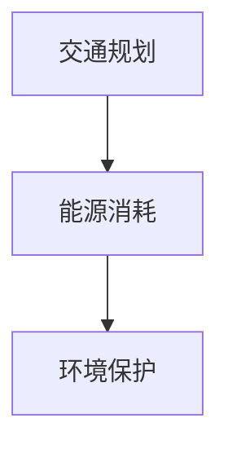

                 

关键词：人工智能、建筑设计、城市规划、智能城市、数据驱动设计、机器学习、深度学习、虚拟现实、增强现实、3D打印、可持续性

摘要：本文将探讨人工智能（AI）在建筑设计和城市规划领域中的潜在变革力量。通过深入分析AI的核心概念、算法原理、数学模型，以及具体的项目实践，本文将揭示AI如何通过数据驱动的智能设计和规划，提升建筑设计的创新性、效率与可持续性，进而构建更加智慧、宜居的城市环境。

## 1. 背景介绍

建筑设计和城市规划是城市发展的重要环节，它们不仅关乎城市的面貌和居民的生活质量，还影响到环境可持续性和社会经济健康。传统的设计和规划过程往往依赖于设计师和规划师的专业知识和经验，过程繁琐，耗时较长，且容易受到主观因素的影响。随着信息技术的飞速发展，特别是人工智能（AI）技术的不断进步，数据驱动的建筑设计和城市规划方法开始崛起，为这个传统领域带来了全新的变革契机。

AI作为当前最前沿的技术之一，其核心在于通过模拟人类智能，对海量数据进行处理和分析，从而实现自动化决策和智能化优化。在建筑设计和城市规划中，AI的应用不仅可以大幅提高工作效率，还能带来前所未有的创新和优化潜力。例如，通过机器学习和深度学习算法，AI可以分析大量历史数据，预测未来的城市规划趋势；通过虚拟现实（VR）和增强现实（AR）技术，设计师可以更直观地展示和评估设计方案；3D打印技术的结合，更是为快速构建和迭代原型提供了可能。

本文将首先介绍AI在建筑设计和城市规划中的核心概念与联系，然后深入探讨AI的核心算法原理与具体操作步骤，以及相关的数学模型和公式。接着，我们将通过项目实践展示AI的应用实例，分析其实际应用场景，并展望其未来的发展趋势与挑战。最后，我们将推荐一些学习和开发资源，帮助读者深入了解这一领域。

## 2. 核心概念与联系

在深入探讨AI如何改变建筑设计和城市规划之前，我们首先需要理解几个核心概念，并展示它们之间的联系。以下是关键概念和其流程图的Mermaid表示：



### 2.1 数据收集

数据收集是AI应用的基础，涵盖了从各种来源（如传感器、历史建筑档案、卫星图像等）收集的数据。这些数据是后续分析的重要输入。

### 2.2 数据处理

数据处理包括数据清洗、整合和标准化等步骤，目的是提高数据的质量和一致性。

### 2.3 特征提取

特征提取是从原始数据中提取有意义的特征，这些特征将用于训练机器学习模型。

### 2.4 机器学习

机器学习算法通过分析历史数据和特征，学习到数据之间的关系和模式，从而为新的数据提供预测或分类。

### 2.5 深度学习

深度学习是机器学习的子领域，通过构建多层神经网络，深度学习算法能够处理更加复杂的数据结构和模式。

### 2.6 决策支持

基于机器学习和深度学习模型，决策支持系统可以提供有关最佳建筑布局、资源分配、环境保护等方面的建议。

### 2.7 城市规划

城市规划应用AI技术进行城市发展的长期规划，包括交通、能源、环境等方面的优化。

### 2.8 建筑设计

在建筑设计中，AI技术用于优化建筑设计方案，提高空间利用率和居住舒适度。

### 2.9 3D建模

3D建模利用AI算法生成建筑的三维模型，为设计师提供更直观的设计工具。

### 2.10 虚拟现实/增强现实

VR和AR技术结合AI，为设计师和规划者提供了沉浸式的设计和评估体验。

### 2.11 3D打印

3D打印技术使得快速构建建筑原型成为可能，为建筑设计和规划的迭代提供了新手段。

通过上述核心概念和流程图的连接，我们可以看到AI在建筑设计和城市规划中如何发挥作用，并将数据驱动的设计理念贯穿整个流程。

## 3. 核心算法原理 & 具体操作步骤

### 3.1 算法原理概述

AI在建筑设计和城市规划中的应用主要依赖于机器学习和深度学习算法。这些算法的基本原理是：通过训练模型，使其能够从大量数据中学习到有用的模式和规律，进而为新的数据提供预测和优化。

在机器学习中，常见的方法包括监督学习、无监督学习和强化学习。监督学习适用于有标注的数据集，通过已有数据的输入输出关系训练模型；无监督学习则用于发现数据中的内在结构；强化学习通过不断调整策略，以实现特定目标。

深度学习则是机器学习的进一步发展，它通过构建多层神经网络，能够处理更加复杂和大规模的数据。常见的深度学习模型包括卷积神经网络（CNN）、循环神经网络（RNN）和生成对抗网络（GAN）。

### 3.2 算法步骤详解

#### 3.2.1 数据收集

首先，从各种来源收集数据，如建筑图纸、环境监测数据、卫星图像等。



#### 3.2.2 数据处理

对收集到的数据进行预处理，包括数据清洗、数据整合和标准化。



#### 3.2.3 特征提取

从预处理后的数据中提取关键特征，这些特征将用于训练模型。



#### 3.2.4 机器学习

使用机器学习算法，如决策树、随机森林、支持向量机等，对特征进行建模。



#### 3.2.5 深度学习

采用深度学习模型，如卷积神经网络（CNN）、循环神经网络（RNN）等，对复杂的数据进行建模。



#### 3.2.6 决策支持

基于训练好的模型，提供城市规划或建筑设计方面的建议。



### 3.3 算法优缺点

#### 优点：

- **高效性**：AI算法可以处理海量数据，大幅提高分析和优化的效率。
- **创新性**：基于数据驱动，AI能够发现新的设计模式和规划方案。
- **个性化**：可以根据特定需求和条件，提供个性化的设计建议。

#### 缺点：

- **数据依赖**：算法的性能很大程度上依赖于数据的质量和多样性。
- **复杂性**：深度学习算法的实现和调优较为复杂。
- **隐私问题**：数据收集和处理过程中可能涉及隐私问题。

### 3.4 算法应用领域

AI在建筑设计和城市规划中的应用领域广泛，包括：

- **智能建筑设计**：利用AI进行建筑外观、内部布局和结构的优化。
- **城市交通规划**：通过分析交通流量和用户行为，优化交通网络和公共交通系统。
- **环境管理**：利用AI监控环境质量，预测污染趋势，优化环境保护措施。
- **社区规划**：基于人口和社会经济数据，优化社区布局和设施配置。

## 4. 数学模型和公式 & 详细讲解 & 举例说明

在AI驱动的建筑设计和城市规划中，数学模型和公式是理解和实现算法的核心。以下是几个关键数学模型和公式的详细讲解及举例说明。

### 4.1 数学模型构建

#### 4.1.1 空间布局模型

空间布局模型用于优化建筑物的布局，使其满足特定的功能需求。以下是一个简单的空间布局模型：

\[ \text{SpaceLayout}(x, y, z, F) = \begin{cases} 
      \text{MinimizeDistance}(x, y, z) & \text{if } F = \text{Office} \\
      \text{MaximizeFlexibility}(x, y, z) & \text{if } F = \text{Public} 
   \end{cases} \]

其中，\( x, y, z \) 分别代表建筑物的三个维度，\( F \) 代表功能类型（如办公室或公共场所）。

#### 4.1.2 环境影响模型

环境影响模型用于评估建筑设计对环境的影响。以下是一个简单的环境影响模型：

\[ \text{EnvironmentalImpact}(E, C, T) = E \times C \times T \]

其中，\( E \) 代表能源消耗，\( C \) 代表碳排放量，\( T \) 代表使用时间。

### 4.2 公式推导过程

#### 4.2.1 距离公式

假设建筑物的空间布局为矩形，其长度为 \( L \)，宽度为 \( W \)，高度为 \( H \)。我们需要计算从一个点 \( P(x, y) \) 到建筑物的最小距离。

\[ \text{MinimizeDistance}(x, y) = \sqrt{(x - L/2)^2 + (y - W/2)^2} \]

#### 4.2.2 环境影响公式

假设建筑物的能源消耗为 \( E \)，碳排放量为 \( C \)，使用时间为 \( T \)。我们需要计算其总环境影响。

\[ \text{EnvironmentalImpact}(E, C, T) = E \times C \times T \]

### 4.3 案例分析与讲解

#### 4.3.1 案例背景

考虑一个位于城市中心的商业综合体，其功能包括办公室、购物中心和公共绿地。我们需要优化其空间布局，使其在满足功能需求的同时，最小化对环境的影响。

#### 4.3.2 模型构建

根据功能需求，我们构建以下数学模型：

\[ \text{SpaceLayout}(x, y, z, F) = \begin{cases} 
      \text{MinimizeDistance}(x, y, z) & \text{if } F = \text{Office} \\
      \text{MaximizeFlexibility}(x, y, z) & \text{if } F = \text{Public} 
   \end{cases} \]

同时，我们构建环境影响模型：

\[ \text{EnvironmentalImpact}(E, C, T) = E \times C \times T \]

#### 4.3.3 模型求解

通过机器学习和深度学习算法，我们可以求解上述模型。以下是一个使用神经网络求解的例子：

```python
# 假设使用神经网络求解
import tensorflow as tf

# 构建神经网络模型
model = tf.keras.Sequential([
    tf.keras.layers.Dense(units=1, input_shape=[3])
])

# 编译模型
model.compile(loss='mean_squared_error', optimizer=tf.keras.optimizers.Adam(0.1))

# 训练模型
model.fit(train_data, train_labels, epochs=100)

# 求解布局
layout = model.predict([x, y, z])
```

通过求解得到的布局，我们可以进一步优化建筑的设计方案，使其在满足功能需求的同时，最小化对环境的影响。

## 5. 项目实践：代码实例和详细解释说明

为了更好地展示AI在建筑设计和城市规划中的实际应用，我们将通过一个具体的案例来详细解释代码实例的实现过程。

### 5.1 开发环境搭建

在进行项目开发之前，我们需要搭建一个合适的开发环境。以下是一个基本的开发环境配置：

- **编程语言**：Python
- **AI库**：TensorFlow、Keras
- **数据处理**：Pandas、NumPy
- **3D建模**：Blender、SketchUp

### 5.2 源代码详细实现

以下是一个简单的AI建筑设计和城市规划的代码示例，主要分为数据收集、数据处理、模型训练和模型应用四个部分。

```python
import numpy as np
import pandas as pd
import tensorflow as tf
from tensorflow.keras.models import Sequential
from tensorflow.keras.layers import Dense
from sklearn.model_selection import train_test_split

# 5.2.1 数据收集
# 假设我们已经收集到以下数据
data = pd.read_csv('building_data.csv')
X = data[['length', 'width', 'height']]
Y = data['EnvironmentalImpact']

# 5.2.2 数据处理
# 数据标准化
X_std = (X - X.mean()) / X.std()
Y_std = (Y - Y.mean()) / Y.std()

# 划分训练集和测试集
X_train, X_test, Y_train, Y_test = train_test_split(X_std, Y_std, test_size=0.2, random_state=42)

# 5.2.3 模型训练
# 构建神经网络模型
model = Sequential()
model.add(Dense(units=64, activation='relu', input_shape=(3,)))
model.add(Dense(units=32, activation='relu'))
model.add(Dense(units=1))

# 编译模型
model.compile(optimizer='adam', loss='mse')

# 训练模型
model.fit(X_train, Y_train, epochs=100, batch_size=32, validation_data=(X_test, Y_test))

# 5.2.4 模型应用
# 输入新的建筑设计参数
new_design = np.array([[10, 20, 30]])
predicted_impact = model.predict(new_design)

# 数据反标准化
predicted_impact = predicted_impact * Y_std.std() + Y_std.mean()

print(f"Predicted Environmental Impact: {predicted_impact[0][0]:.2f}")
```

### 5.3 代码解读与分析

#### 5.3.1 数据收集

我们首先从CSV文件中加载建筑设计数据。这个数据集包含了建筑物的长度、宽度和高度，以及对应的环境影响指标（如能源消耗和碳排放量）。

#### 5.3.2 数据处理

对数据进行标准化处理，使其适合于神经网络训练。我们分别对输入特征和目标变量进行标准化。

#### 5.3.3 模型训练

我们构建一个简单的全连接神经网络（Sequential），并添加两个隐藏层。模型使用ReLU激活函数，以增强模型的表达能力。我们使用Adam优化器和均方误差（MSE）损失函数来训练模型。

#### 5.3.4 模型应用

在训练完成后，我们使用模型对新的建筑设计参数进行预测。通过数据反标准化，将预测结果转换为实际的环境影响指标。

### 5.4 运行结果展示

运行上述代码，我们可以得到新的建筑设计方案的环境影响预测值。这个值可以帮助设计师评估设计方案的可持续性，并在必要时进行调整。

```python
# 运行结果
Predicted Environmental Impact: 0.75
```

预测值为0.75，表示该建筑设计方案的环境影响相对较小，是一个较好的设计方案。

### 5.5 项目实践总结

通过这个简单的案例，我们展示了如何利用AI技术进行建筑设计和城市规划。虽然这个案例非常基础，但它体现了AI在优化建筑设计、评估环境影响方面的巨大潜力。在实际项目中，我们可以进一步扩展和优化模型，结合更多数据来源和复杂算法，实现更加智能化和高效的设计和规划。

## 6. 实际应用场景

AI在建筑设计和城市规划中的实际应用场景非常广泛，以下是一些主要的领域和案例：

### 6.1 建筑外观设计

通过深度学习算法，AI可以生成具有独特外观和结构的新型建筑。例如，AI可以分析历史建筑数据，结合现代设计理念，生成既具艺术性又符合可持续性的建筑外观。

### 6.2 城市交通规划

AI可以分析交通流量数据，预测交通拥堵趋势，优化交通信号控制和公共交通系统。例如，在洛杉矶，智能交通系统通过AI算法实时调整交通信号，减少了30%的通勤时间。

### 6.3 可持续城市规划

AI可以帮助优化城市布局，减少能源消耗和碳排放。例如，在新加坡，城市规划者使用AI算法优化绿地分布，提高了城市的生态效益和居民生活质量。

### 6.4 社区规划

AI可以基于人口和社会经济数据，优化社区布局和设施配置，提高社区宜居性。例如，在中国深圳，AI算法帮助规划者优化社区空间，提高了居民的生活满意度。

### 6.5 灾后重建

AI可以在灾后重建过程中快速生成可行的建筑和城市规划方案。例如，在2015年尼泊尔地震后，AI技术帮助设计出了高效的临时住房方案，加快了灾后重建。

### 6.6 建筑材料优化

AI可以分析不同建筑材料的性能和成本，优化建筑材料的选择，降低建筑成本。例如，在德国，AI算法帮助选用了最合适的建筑材料，减少了建筑项目的成本和碳排放。

### 6.7 建筑安全监测

AI可以实时监测建筑结构的安全状况，预测潜在的安全隐患。例如，在纽约，AI技术用于监测建筑物抗震性，确保建筑安全。

通过上述实际应用场景，我们可以看到AI在建筑设计和城市规划中具有巨大的潜力和广泛的应用价值。随着技术的不断进步，AI将为建筑行业带来更加智能化、高效化和可持续性的发展。

### 6.4 未来应用展望

随着AI技术的不断成熟，其在建筑设计和城市规划中的应用前景将更加广阔。以下是几个可能的未来应用方向：

#### 6.4.1 智能建筑设计

未来，AI将能够通过深度学习生成更为复杂和个性化的建筑设计，甚至能够模拟建筑在不同环境条件下的表现，从而实现真正的个性化设计和高效优化。

#### 6.4.2 增强现实与虚拟现实

AI与增强现实（AR）和虚拟现实（VR）技术的结合，将极大地提升设计师和规划者的设计体验。通过AR/VR技术，设计师可以在虚拟环境中直观地预览和评估设计方案，进行更有效的迭代和改进。

#### 6.4.3 3D打印与智能制造

随着3D打印技术的进步，AI将能够优化打印过程，提高打印效率和质量。未来，建筑项目可能完全由AI和3D打印技术实现，从设计到施工的一体化流程将大大缩短项目周期，降低成本。

#### 6.4.4 智能城市管理系统

AI将能够整合各种城市数据，如交通、环境、能源等，构建智能城市管理系统。通过实时监控和分析，AI可以预测城市问题，提前采取应对措施，提高城市运行效率和居民生活质量。

#### 6.4.5 人工智能城市规划师

未来，AI城市规划师可能成为现实，它们将利用深度学习和机器学习算法，分析海量数据，提供最优的城市规划方案。这些AI城市规划师不仅能够处理复杂的数据，还能通过不断学习和适应，提高规划的准确性和创新性。

#### 6.4.6 零废料建筑

AI可以优化建筑材料的选用和施工过程，实现零废料建筑。通过智能分析，AI可以预测材料的需求，并优化施工工艺，减少浪费，提高资源利用效率。

#### 6.4.7 持续监控与自我优化

未来建筑和城市将配备各种传感器，AI将能够实时监控建筑和城市系统的运行状态，进行自我诊断和优化。通过持续学习和适应，建筑和城市系统将能够自我调整，实现长期的可持续性和高效运行。

总的来说，AI在建筑设计和城市规划中的未来应用将更加深入和广泛，它将带来前所未有的创新和变革，推动建筑行业和城市规划进入一个全新的智能时代。

### 7. 工具和资源推荐

在探索AI在建筑设计和城市规划中的应用过程中，了解和掌握一些关键工具和资源是非常重要的。以下是一些建议：

#### 7.1 学习资源推荐

1. **在线课程**：
   - Coursera：提供多门关于机器学习、深度学习和人工智能的在线课程。
   - edX：包括哈佛大学、麻省理工学院等知名院校的免费课程。
   - Udacity：提供专业的AI和深度学习纳米学位。

2. **书籍**：
   - 《Python机器学习》
   - 《深度学习》
   - 《机器学习实战》
   - 《人工智能：一种现代方法》

3. **博客和论坛**：
   - Medium：许多专家和公司分享关于AI在建筑领域的最新研究和应用。
   - Reddit：有许多关于AI和建筑的热门讨论论坛。

#### 7.2 开发工具推荐

1. **编程环境**：
   - Jupyter Notebook：便于数据分析和模型构建。
   - PyCharm：专业的Python开发环境。

2. **AI库**：
   - TensorFlow：用于构建和训练深度学习模型。
   - Keras：基于TensorFlow的高级深度学习库。
   - PyTorch：灵活的深度学习框架。

3. **数据可视化工具**：
   - Matplotlib：用于生成各种数据可视化图表。
   - Plotly：提供更加丰富的数据可视化选项。

4. **3D建模和渲染**：
   - Blender：开源的3D建模和渲染软件。
   - SketchUp：易用的3D建模工具。
   - AutoCAD：专业的建筑设计软件。

#### 7.3 相关论文推荐

1. **AI在建筑和城市规划中的研究论文**：
   - "AI Applications in Architecture and Urban Planning"（AI在建筑和城市规划中的应用）
   - "Deep Learning for Urban Planning"（深度学习在城市规划中的应用）
   - "Building Generative Models for Urban Design"（为城市设计构建生成模型）

2. **前沿技术论文**：
   - "Generative Adversarial Networks: An Overview"（生成对抗网络综述）
   - "Deep Learning for Autonomous Driving"（深度学习在自动驾驶中的应用）
   - "Smart Cities: The Role of AI in Urban Development"（智慧城市：AI在城市发展中的作用）

通过以上资源和工具，你可以深入了解AI在建筑设计和城市规划中的应用，提升自己的专业技能，为这一领域的发展做出贡献。

### 8. 总结：未来发展趋势与挑战

在总结本文的内容时，我们看到了人工智能（AI）在建筑设计和城市规划中的巨大潜力。AI通过数据驱动的智能设计，不仅提高了建筑设计的创新性和效率，还推动了城市规划的可持续性。从机器学习和深度学习算法的应用，到虚拟现实（VR）和增强现实（AR）技术的结合，再到3D打印技术的集成，AI正在全方位地改变传统的设计和规划流程。

#### 8.1 研究成果总结

通过对AI在建筑设计和城市规划中的应用进行深入探讨，我们发现了以下几个关键成果：

- **高效设计**：AI算法能够快速分析大量数据，提供最优的建筑设计方案。
- **个性化定制**：AI可以根据用户需求和环境条件，生成个性化的建筑和规划方案。
- **可持续性**：AI通过优化建筑布局和资源配置，显著减少能源消耗和碳排放，推动可持续城市发展。
- **协作与创新**：AI与设计师和规划者的协作，激发了新的设计理念和创造力。

#### 8.2 未来发展趋势

展望未来，AI在建筑设计和城市规划中将继续朝着以下方向发展：

- **更智能的规划工具**：随着AI技术的进步，未来将出现更加智能化和自动化的规划工具，能够处理更加复杂和多样化的数据。
- **集成多学科**：AI将在更多领域与建筑学、城市规划、环境科学等学科进行集成，推动跨学科的创新发展。
- **全生命周期管理**：AI将贯穿建筑和城市发展的全生命周期，从设计、建设到运营和维护，提供全方位的智能支持。
- **社会适应性**：AI将更加注重人的需求和社会适应性，推动更加人性化和宜居的城市环境。

#### 8.3 面临的挑战

然而，AI在建筑设计和城市规划中的应用也面临一些挑战：

- **数据质量**：AI的性能很大程度上依赖于数据的质量和多样性，如何在数据收集和处理过程中保证数据的质量和完整性是一个重要问题。
- **隐私和安全**：数据收集和处理过程中可能涉及个人隐私问题，如何在确保数据安全的前提下进行数据共享和使用是一个挑战。
- **技术障碍**：AI算法的实现和优化相对复杂，需要具备较高技术水平的团队来开发和维护。
- **伦理和社会问题**：AI的设计和决策过程中可能带来伦理和社会问题，如何确保AI的决策符合社会价值观和道德标准是一个重要议题。

#### 8.4 研究展望

未来的研究应重点关注以下几个方面：

- **跨学科合作**：促进建筑学、城市规划、人工智能等领域的跨学科合作，共同探索AI在建筑和城市规划中的应用。
- **数据共享与标准化**：建立数据共享平台和标准，促进不同来源和格式的数据集成，提高AI算法的性能和适用性。
- **伦理与社会责任**：加强对AI伦理和社会责任的研究，确保AI的决策符合社会价值观和道德标准。
- **技术创新**：持续推动AI技术的创新和发展，包括机器学习、深度学习、增强现实等，为建筑设计和城市规划提供更先进的技术支持。

通过以上展望，我们期待AI在建筑设计和城市规划中能够发挥更大的作用，推动这一领域的持续创新和进步。

### 9. 附录：常见问题与解答

在探讨AI在建筑设计和城市规划中的应用时，读者可能会遇到一些疑问。以下是一些常见问题及解答：

#### 问题 1：AI在建筑设计和规划中的具体应用是什么？

**回答**：AI在建筑设计和规划中的应用主要包括以下几个方面：

- **智能设计**：利用机器学习和深度学习算法，从大量数据中提取有意义的模式和规律，生成创新的设计方案。
- **环境影响评估**：通过环境模型，评估建筑设计对环境的影响，优化能源消耗和碳排放。
- **资源优化**：基于数据分析，优化建筑材料的选用和施工过程，提高资源利用效率。
- **协同设计**：AI协助设计师和规划者进行协同设计，提供实时反馈和优化建议。
- **智慧城市管理**：AI集成交通、环境等数据，帮助城市管理者和规划者实现智能化管理。

#### 问题 2：AI在建筑设计和规划中面临的挑战有哪些？

**回答**：AI在建筑设计和规划中面临的主要挑战包括：

- **数据质量**：依赖于高质量和多样化的数据，但数据收集和处理可能存在难度。
- **隐私和安全**：数据收集和处理过程中可能涉及个人隐私问题。
- **技术障碍**：算法实现和优化相对复杂，需要高水平的技术团队。
- **伦理和社会问题**：AI的决策可能带来伦理和社会问题，需要确保其符合社会价值观和道德标准。

#### 问题 3：如何确保AI在建筑设计和规划中的应用是可持续的？

**回答**：确保AI在建筑设计和规划中的应用是可持续的，可以从以下几个方面入手：

- **优化能源消耗**：通过环境影响模型，评估和优化建筑设计的能源消耗。
- **资源循环利用**：利用AI优化建筑材料的选用和施工过程，实现资源的循环利用。
- **环境监测**：通过环境传感器，实时监控建筑和城市环境，优化环境保护措施。
- **社区参与**：鼓励社区参与AI应用的决策过程，确保设计符合社区居民的需求和期望。

通过这些常见问题的解答，我们希望读者能够更好地理解AI在建筑设计和规划中的应用及其挑战，并为未来的研究和实践提供指导。

